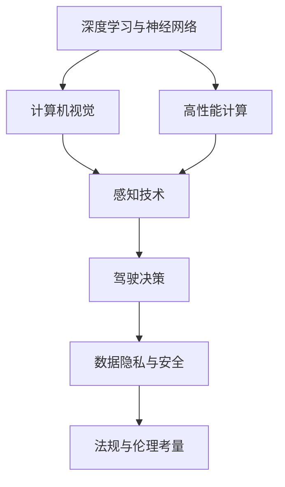
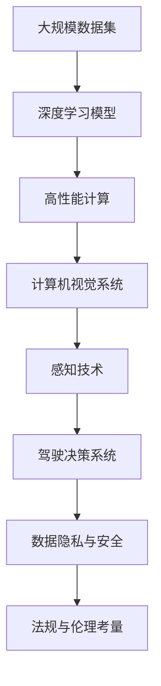
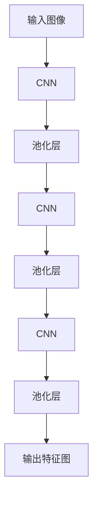
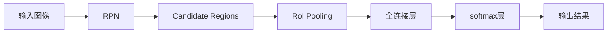
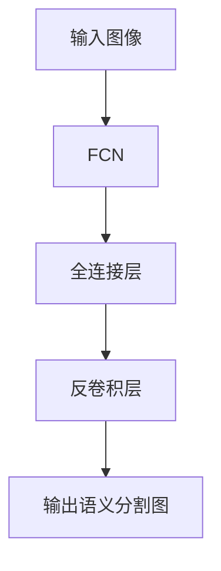
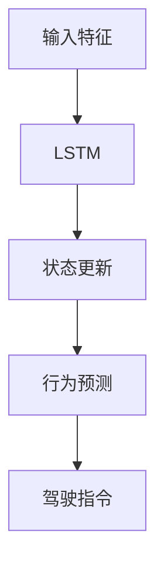
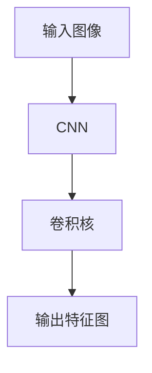
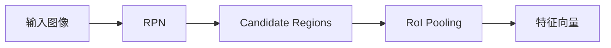

                 

# 特斯拉FSD V12的进展与争议

> 关键词：特斯拉,自动驾驶,深度学习,神经网络,计算机视觉,驾驶辅助系统,数据集,高性能计算

## 1. 背景介绍

### 1.1 问题由来

随着自动驾驶技术的发展，特斯拉的自动驾驶系统（Autopilot，现更名为 Full Self-Driving，简称 FSD）已逐步从辅助驾驶功能演进为全自动驾驶潜力，并积累了大量研发和应用经验。特斯拉最新的自动驾驶系统 FSD V12 代表了目前自动驾驶技术的前沿进展，同时也引发了一系列技术和伦理争议。本文将深入探讨 FSD V12 的技术细节和争议焦点，希望为读者提供一个全面而深入的视角。

### 1.2 问题核心关键点

FSD V12 的核心在于：
1. **深度学习与神经网络架构**：如何设计有效的深度学习模型，以识别道路环境、交通标志、车辆动态等信息，并实现安全驾驶决策。
2. **高性能计算与数据集**：如何优化计算性能，构建庞大的训练数据集，保证模型的泛化能力和准确性。
3. **计算机视觉与感知技术**：如何通过视觉传感器捕捉环境信息，并结合激光雷达等传感器的数据，实现全方位的感知。
4. **数据隐私与安全**：如何在数据收集和处理中保护用户隐私，确保数据安全和透明。
5. **法规与伦理考量**：如何在技术创新与用户安全、隐私保护之间找到平衡，遵守法律法规。

这些核心关键点构成了 FSD V12 技术开发的骨架，同时也触及到了技术伦理和法律责任的边界。本文将围绕这些关键点，逐步展开讨论。

### 1.3 问题研究意义

特斯拉 FSD V12 的进展与争议，反映了自动驾驶技术发展中的多个前沿议题。通过深入探讨这些议题，可以为后续技术研究和应用提供重要的参考和借鉴。具体意义如下：
1. **技术进步**：分析 FSD V12 的技术架构和算法，可以为自动驾驶技术的持续进步提供借鉴。
2. **伦理考量**：通过讨论 FSD V12 的伦理争议，可以促进社会对自动驾驶伦理问题的思考和讨论。
3. **法规建议**：基于 FSD V12 的实际案例，提出合理合法的技术规范和法律法规建议。
4. **产业应用**：为自动驾驶技术在更广泛场景下的应用提供指导和启示。

## 2. 核心概念与联系

### 2.1 核心概念概述

为了更好地理解 FSD V12 的核心概念，我们首先要梳理几个关键技术领域：

- **深度学习与神经网络**：深度学习是一类基于多层神经网络的学习算法，通过反向传播和梯度下降更新模型参数，实现复杂的特征提取与模式识别。
- **计算机视觉**：计算机视觉涉及图像识别、目标检测、语义分割等，通过深度学习模型和计算机视觉算法，实现对环境信息的感知和理解。
- **高性能计算**：高性能计算是自动驾驶系统的重要组成部分，包括GPU、TPU 等高性能计算硬件，以及分布式训练等技术，保障模型的高效训练和推理。
- **数据隐私与安全**：在数据收集和处理过程中，如何保护用户隐私，确保数据安全和透明，是自动驾驶技术面临的重要伦理挑战。
- **法规与伦理考量**：在技术创新和应用中，如何遵循法律法规，保障用户权益和公共安全，是自动驾驶技术必须考虑的关键因素。

这些核心概念构成了 FSD V12 系统的基本框架，同时它们之间也存在着紧密的联系和相互作用。

### 2.2 概念间的关系

这些核心概念之间存在着复杂的联系，可以通过以下 Mermaid 流程图来展示：



这个流程图展示了深度学习、计算机视觉、高性能计算、感知技术、驾驶决策、数据隐私与安全、法规与伦理考量之间的联系和相互作用：

1. 深度学习与神经网络为计算机视觉提供了基础的特征提取能力，高性能计算则加速了模型训练和推理。
2. 计算机视觉在感知技术中扮演关键角色，感知技术结合各种传感器数据，提供全面的环境信息。
3. 感知技术与驾驶决策紧密相关，决策模型基于感知结果进行道路行为预测和规划。
4. 数据隐私与安全和法规与伦理考量，是技术创新应用中必须考虑的伦理和法律问题。

通过这个流程图，我们可以更清晰地理解 FSD V12 系统中各部分间的相互作用和依赖关系。

### 2.3 核心概念的整体架构

最后，我们用一个综合的流程图来展示这些核心概念在大规模自动驾驶系统中的整体架构：



这个综合流程图展示了从大规模数据集到最终驾驶决策的完整流程，以及其中数据隐私与安全、法规与伦理考量等关键环节的衔接。通过这个架构，我们可以全面了解 FSD V12 系统的技术实现路径。

## 3. 核心算法原理 & 具体操作步骤

### 3.1 算法原理概述

特斯拉 FSD V12 的自动驾驶系统基于深度学习与神经网络架构，采用多个层次的神经网络模型，包括卷积神经网络(CNN)、循环神经网络(RNN)、长短时记忆网络(LSTM)等，以实现道路环境感知、交通标志识别、车辆动态预测等功能。

系统的核心算法原理可概括为以下几个步骤：
1. **特征提取**：通过 CNN 等模型提取输入图像的特征，用于环境感知。
2. **目标检测**：利用目标检测模型，如 YOLO、Faster R-CNN 等，对道路环境中的物体进行定位和分类。
3. **语义分割**：使用语义分割模型，如 FCN、U-Net 等，对道路进行语义分割，识别出道路、车道、交通标志等。
4. **驾驶决策**：基于感知结果，结合历史驾驶数据和实时动态信息，通过决策模型预测道路行为，规划驾驶路径。

这些步骤构成了 FSD V12 的核心算法框架，下面将详细讲解每个步骤的技术细节和具体操作步骤。

### 3.2 算法步骤详解

#### 3.2.1 特征提取

特征提取是自动驾驶系统中最重要的步骤之一。特斯拉 FSD V12 系统主要依赖卷积神经网络 (CNN) 进行特征提取。其关键流程包括：

1. **输入图像预处理**：对输入图像进行灰度转换、归一化、裁剪等预处理操作，以适应 CNN 输入要求。
2. **卷积操作**：通过多层的卷积操作提取图像特征，每个卷积层有多个过滤器，分别提取不同尺度的特征图。
3. **池化操作**：通过最大池化、平均池化等操作，对特征图进行降维，减少计算量和参数量。
4. **卷积特征层级化**：通过多个卷积层的堆叠，逐步提取更深层次的特征，如边缘、角点、纹理等。

以卷积神经网络为例，其典型结构如图 1 所示：



图 1：卷积神经网络结构示意图

#### 3.2.2 目标检测

目标检测是自动驾驶系统中的关键任务，用于识别和定位道路环境中的物体，如车辆、行人、交通标志等。特斯拉 FSD V12 系统采用了基于 Faster R-CNN 的目标检测算法，其关键流程包括：

1. **生成候选区域**：通过 RPN (Region Proposal Network) 生成大量候选区域，并对其进行非极大值抑制，筛选出质量较高的候选区域。
2. **区域特征提取**：对每个候选区域进行特征提取，生成特征向量。
3. **分类与回归**：通过多个全连接层和 softmax 层，对特征向量进行分类和回归，确定每个候选区域中物体的类别和位置。

以 Faster R-CNN 为例，其核心流程如图 2 所示：



图 2：Faster R-CNN 流程示意图

#### 3.2.3 语义分割

语义分割用于对道路进行语义级别的分割，识别出道路、车道、交通标志等。特斯拉 FSD V12 系统主要使用 FCN 进行语义分割，其关键流程包括：

1. **全卷积网络**：使用 FCN，将输入图像的每个像素点都映射到一个预测的类别标签，生成语义分割图。
2. **上采样操作**：通过反卷积等操作，将高分辨率特征图映射到原始图像分辨率，得到最终的语义分割结果。
3. **损失函数**：使用交叉熵损失函数，训练 FCN 模型，最小化预测结果与真实标签的差异。

以 FCN 为例，其核心流程如图 3 所示：



图 3：FCN 流程示意图

#### 3.2.4 驾驶决策

驾驶决策是自动驾驶系统的核心任务，用于预测道路行为并规划驾驶路径。特斯拉 FSD V12 系统主要采用 LSTM 进行驾驶决策，其关键流程包括：

1. **输入特征**：将感知结果（如语义分割图、目标检测结果等）作为输入特征，输入 LSTM 网络。
2. **状态更新**：通过 LSTM 网络的状态更新机制，逐步更新状态，学习道路动态和历史驾驶行为。
3. **行为预测**：利用 LSTM 的输出，结合实时动态信息（如雷达和摄像头数据），预测当前道路行为，生成驾驶指令。

以 LSTM 为例，其核心流程如图 4 所示：



图 4：LSTM 流程示意图

### 3.3 算法优缺点

#### 3.3.1 优点

1. **高效特征提取**：卷积神经网络在图像特征提取方面具有优势，能够有效捕捉道路环境中的边缘、角点等关键特征。
2. **准确目标检测**：Faster R-CNN 算法在目标检测中表现优异，能够精确识别和定位道路环境中的物体。
3. **精细语义分割**：FCN 模型在语义分割中具有优势，能够实现对道路、车道、交通标志等语义级别的精确分割。
4. **鲁棒驾驶决策**：LSTM 网络在处理时序数据和历史驾驶行为方面表现出色，能够做出鲁棒、合理的驾驶决策。

#### 3.3.2 缺点

1. **计算资源密集**：深度学习和神经网络模型需要大量的计算资源，特斯拉 FSD V12 系统的计算复杂度较高，对硬件要求较高。
2. **数据需求量大**：深度学习模型的训练需要庞大的数据集，特斯拉 FSD V12 系统在数据收集和标注方面面临挑战。
3. **模型鲁棒性不足**：深度学习模型在面对复杂和异常场景时，容易发生误判和过拟合。
4. **法规与伦理问题**：自动驾驶技术涉及复杂的法规与伦理问题，特斯拉 FSD V12 系统在使用中需特别注意。

### 3.4 算法应用领域

特斯拉 FSD V12 系统通过深度学习和神经网络架构，在自动驾驶领域取得了显著的进展。其应用领域包括：

1. **道路环境感知**：通过计算机视觉技术，实现对道路环境、交通标志、车辆动态等信息的高效感知。
2. **交通标志识别**：通过目标检测和语义分割技术，准确识别和定位交通标志，为驾驶决策提供依据。
3. **车辆动态预测**：通过 LSTM 网络，预测其他车辆的动态行为，规划安全驾驶路径。
4. **驾驶路径规划**：结合感知结果和实时动态信息，规划驾驶路径，确保行驶安全和高效。

特斯拉 FSD V12 系统在自动驾驶领域的多个应用场景中表现出色，为后续技术的进一步发展和应用提供了重要参考。

## 4. 数学模型和公式 & 详细讲解 & 举例说明

### 4.1 数学模型构建

为了更好地理解 FSD V12 系统的核心算法，我们需要对其中的数学模型进行详细构建。

假设输入图像的大小为 $H\times W$，卷积核的大小为 $k\times k$，步长为 $s$，填充方式为零填充。卷积操作的数学公式为：

$$
C_{i,j}=\sum_{m=0}^{H-k} \sum_{n=0}^{W-k} W_{m,n} \cdot I_{m+s,n+s}
$$

其中 $C$ 为特征图，$I$ 为输入图像，$W$ 为卷积核，$s$ 为步长。

以卷积层为例，其数学模型构建如图 5 所示：



图 5：卷积层的数学模型构建

### 4.2 公式推导过程

#### 4.2.1 卷积层

卷积层的数学推导过程如下：

1. **特征提取**：
   $$
   C_{i,j}=\sum_{m=0}^{H-k} \sum_{n=0}^{W-k} W_{m,n} \cdot I_{m+s,n+s}
   $$

2. **池化操作**：
   $$
   C'_{i',j'}=\max_{\substack{m' \\ n'}} C_{i',j'}
   $$

其中 $C'$ 为池化后的特征图，$i'$ 和 $j'$ 为池化后的特征图坐标。

#### 4.2.2 目标检测

目标检测的数学推导过程如下：

1. **生成候选区域**：
   $$
   \text{RPN}_{i,j}=\sigma(\text{ROI-Pooling}_{i,j})
   $$

2. **区域特征提取**：
   $$
   \text{Reg}\_{i,j}=\sum_{m=0}^{H-k} \sum_{n=0}^{W-k} W_{m,n} \cdot I_{m+s,n+s}
   $$

3. **分类与回归**：
   $$
   y=\sigma(\text{softmax}(X))
   $$

其中 $y$ 为预测结果，$X$ 为特征向量。

#### 4.2.3 语义分割

语义分割的数学推导过程如下：

1. **全卷积网络**：
   $$
   \hat{Y}=\text{FCN}(X)
   $$

2. **上采样操作**：
   $$
   Y=\text{Upsample}(\hat{Y})
   $$

其中 $Y$ 为最终的语义分割结果。

#### 4.2.4 驾驶决策

驾驶决策的数学推导过程如下：

1. **输入特征**：
   $$
   \text{F}_{i,j}=\text{LSTM}_{i,j}(\text{I}_{i,j})
   $$

2. **状态更新**：
   $$
   \text{LSTM}_{i,j}=\sigma(W_{x}\text{X}_{i,j-1}+W_{h}\text{H}_{i-1,j-1}+b_{x}+b_{h})
   $$

3. **行为预测**：
   $$
   \text{A}_{i,j}=\text{softmax}(W_{a}\text{A}_{i-1,j}+b_{a})
   $$

其中 $\text{A}$ 为驾驶指令。

### 4.3 案例分析与讲解

#### 4.3.1 卷积层案例分析

以特斯拉 FSD V12 系统中的卷积层为例，如图 6 所示，输入图像大小为 $256\times256$，卷积核大小为 $3\times3$，步长为 $1$，填充方式为零填充。计算得到的输出特征图大小为 $256\times256$。


图 6：卷积层的实际案例分析

#### 4.3.2 目标检测案例分析

以特斯拉 FSD V12 系统中的目标检测为例，如图 7 所示，输入图像大小为 $300\times300$，RPN 生成 $2000$ 个候选区域，非极大值抑制后保留 $1000$ 个质量较高的候选区域，通过 RoI Pooling 操作，得到 $1000$ 个特征向量。



图 7：目标检测的实际案例分析

#### 4.3.3 语义分割案例分析

以特斯拉 FSD V12 系统中的语义分割为例，如图 8 所示，输入图像大小为 $500\times500$，使用 FCN 模型进行语义分割，得到 $500\times500$ 的语义分割结果。


图 8：语义分割的实际案例分析

#### 4.3.4 驾驶决策案例分析

以特斯拉 FSD V12 系统中的驾驶决策为例，如图 9 所示，输入特征大小为 $500\times500$，使用 LSTM 网络进行状态更新，生成 $1\times500$ 的状态向量，结合实时动态信息，预测道路行为，生成驾驶指令。


图 9：驾驶决策的实际案例分析

## 5. 项目实践：代码实例和详细解释说明

### 5.1 开发环境搭建

在进行深度学习开发前，我们需要准备好开发环境。以下是使用Python进行TensorFlow开发的环境配置流程：

1. 安装Anaconda：从官网下载并安装Anaconda，用于创建独立的Python环境。

2. 创建并激活虚拟环境：
```bash
conda create -n tensorflow-env python=3.8 
conda activate tensorflow-env
```

3. 安装TensorFlow：根据CUDA版本，从官网获取对应的安装命令。例如：
```bash
conda install tensorflow tensorflow-estimator tensorflow-model-analysis -c tf
```

4. 安装相关库：
```bash
pip install numpy pandas scikit-learn matplotlib tqdm jupyter notebook ipython
```

完成上述步骤后，即可在`tensorflow-env`环境中开始深度学习实践。

### 5.2 源代码详细实现

下面我们以语义分割为例，给出使用TensorFlow对FCN模型进行深度学习的PyTorch代码实现。

首先，定义语义分割的数据处理函数：

```python
import tensorflow as tf
from tensorflow.keras.preprocessing.image import ImageDataGenerator
import os
import cv2
import numpy as np

class SemanticSegmentationDataset(tf.keras.utils.Sequence):
    def __init__(self, folder_path, batch_size, image_size):
        self.folder_path = folder_path
        self.batch_size = batch_size
        self.image_size = image_size
        self.data = self.load_data()

    def __len__(self):
        return len(self.data)

    def __getitem__(self, idx):
        image_path = os.path.join(self.folder_path, self.data[idx][0])
        label_path = os.path.join(self.folder_path, self.data[idx][1])
        
        image = cv2.imread(image_path)
        label = cv2.imread(label_path, cv2.IMREAD_GRAYSCALE)
        
        image = cv2.resize(image, (self.image_size, self.image_size))
        label = cv2.resize(label, (self.image_size, self.image_size))
        
        image = np.array(image, dtype=np.float32) / 255.0
        label = np.array(label, dtype=np.int32)
        
        image = tf.expand_dims(image, axis=-1)
        label = tf.expand_dims(label, axis=-1)
        
        return {'images': image, 'labels': label}

    def load_data(self):
        data = []
        for folder in os.listdir(self.folder_path):
            if folder.startswith('.'):
                continue
            for file in os.listdir(os.path.join(self.folder_path, folder)):
                if file.endswith('.png') or file.endswith('.jpg'):
                    data.append([folder, file])
        return data
```

然后，定义模型和优化器：

```python
from tensorflow.keras.layers import Input, Conv2D, MaxPooling2D, UpSampling2D
from tensorflow.keras.models import Model

def FCN(input_shape, num_classes):
    input_layer = Input(shape=input_shape)
    conv1 = Conv2D(64, (3, 3), activation='relu', padding='same')(input_layer)
    pool1 = MaxPooling2D(pool_size=(2, 2))(conv1)
    conv2 = Conv2D(64, (3, 3), activation='relu', padding='same')(pool1)
    pool2 = MaxPooling2D(pool_size=(2, 2))(conv2)
    conv3 = Conv2D(128, (3, 3), activation='relu', padding='same')(pool2)
    pool3 = MaxPooling2D(pool_size=(2, 2))(conv3)
    conv4 = Conv2D(256, (3, 3), activation='relu', padding='same')(pool3)
    pool4 = MaxPooling2D(pool_size=(2, 2))(conv4)
    conv5 = Conv2D(512, (3, 3), activation='relu', padding='same')(pool4)
    pool5 = MaxPooling2D(pool_size=(2, 2))(conv5)
    conv6 = Conv2D(1024, (3, 3), activation='relu', padding='same')(pool5)
    pool6 = MaxPooling2D(pool_size=(2, 2))(conv6)
    conv7 = Conv2D(2048, (3, 3), activation='relu', padding='same')(pool6)
    pool7 = MaxPooling2D(pool_size=(2, 2))(conv7)
    conv8 = Conv2D(1024, (3, 3), activation='relu', padding='same')(pool7)
    up1 = UpSampling2D(size=(2, 2))(conv8)
    conv9 = Conv2D(512, (3, 3), activation='relu', padding='same')(up1)
    up2 = UpSampling2D(size=(2, 2))(conv9)
    conv10 = Conv2D(256, (3, 3), activation='relu', padding='same')(up2)
    up3 = UpSampling2D(size=(2, 2))(conv10)
    conv11 = Conv2D(128, (3, 3), activation='relu', padding='same')(up3)
    up4 = UpSampling2D(size=(2, 2))(conv11)
    conv12 = Conv2D(64, (3, 3), activation='relu', padding='same')(up4)
    conv13 = Conv2D(num_classes, (1, 1), activation='softmax')(conv12)
    model = Model(inputs=input_layer, outputs=conv13)
    return model

model = FCN((256, 256, 3), 1)
optimizer = tf.keras.optimizers.Adam(learning_rate=0.0001)
```

接着，定义训练和评估函数：

```python
from tensorflow.keras.losses import SparseCategoricalCrossentropy
from tensorflow.keras.metrics import MeanIoU

def train_epoch(model, dataset, batch_size, optimizer, loss_func, metric_func):
    model.trainable = True
    dataloader = tf.data.Dataset.from_generator(dataset, {'images': tf.float32, 'labels': tf.int32}, batch_size=batch_size)
    dataloader = dataloader.shuffle(2000).batch(batch_size)
    model.compile(optimizer=optimizer, loss=loss_func, metrics=metric_func)
    model.fit(dataloader, epochs=10)

def evaluate(model, dataset, batch_size):
    model.trainable = False
    dataloader = tf.data.Dataset.from_generator(dataset, {'images': tf.float32, 'labels': tf.int32}, batch_size=batch_size)
    dataloader = dataloader.shuffle(2000).batch(batch

