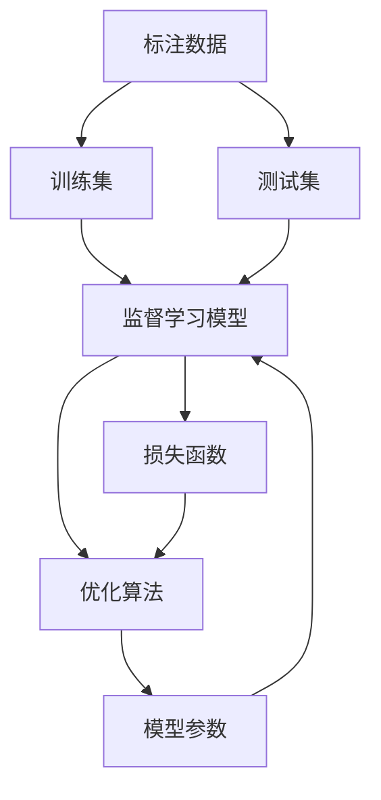

                 

# 监督学习 原理与代码实例讲解

> 关键词：监督学习, 模型构建, 优化算法, 案例分析, 代码实例

## 1. 背景介绍

### 1.1 问题由来
监督学习（Supervised Learning）是机器学习中一种非常基本且重要的学习范式，其核心思想是通过标注数据集，训练出一个能够对未知数据进行预测的模型。相较于无监督学习，监督学习能够直接利用已有标签进行模型训练，因此其预测结果通常更加准确可靠。然而，由于监督学习对标注数据有较高的要求，因此在数据标注成本较高或标注数据难以获取的场景下，监督学习的效果往往不尽如人意。

### 1.2 问题核心关键点
监督学习的核心在于如何高效利用标注数据训练模型，同时避免过拟合。常见的监督学习算法包括线性回归、逻辑回归、决策树、支持向量机（SVM）、随机森林、深度学习模型等。这些算法在数据标注上都有各自的特点和适用场景，需要根据实际问题进行选择和调整。

### 1.3 问题研究意义
研究监督学习算法，对于拓展机器学习应用范围，提升预测模型性能，加速数据驱动决策的进程，具有重要意义：

1. 降低数据标注成本。通过监督学习，可以从已有标注数据中快速训练出准确预测模型，减少对新数据标注的需求。
2. 提高预测精度。监督学习算法通过标注数据训练，能够直接学习到输入数据与输出标签之间的关系，提升模型预测能力。
3. 加速模型迭代。监督学习算法具有明确的优化目标，可以通过实验快速验证和改进模型。
4. 促进领域知识融合。监督学习算法能够学习领域专家提供的标注数据，将领域知识融入预测模型。
5. 提升决策可靠性。监督学习算法通过标注数据训练，能够提供具有较高可信度的预测结果，支持科学决策。

## 2. 核心概念与联系

### 2.1 核心概念概述

为更好地理解监督学习的基本原理和算法，本节将介绍几个关键概念及其之间的联系：

- 监督学习（Supervised Learning）：使用标注数据训练模型，使模型能够对未知数据进行预测。常见的监督学习算法包括线性回归、逻辑回归、决策树等。
- 标注数据（Labelled Data）：用于训练模型的带有标签的数据集。
- 损失函数（Loss Function）：用于衡量模型预测与真实标签之间的差异，常见损失函数包括均方误差、交叉熵等。
- 优化算法（Optimization Algorithm）：用于最小化损失函数，优化模型参数的算法，如梯度下降、Adam等。
- 过拟合（Overfitting）：模型在训练集上表现优异，但在测试集上表现较差的现象。

这些概念之间通过数据标注、模型训练、优化目标等环节紧密联系，构成了监督学习的核心流程。

### 2.2 概念间的关系

这些核心概念之间存在着紧密的联系，形成了监督学习的完整生态系统。我们可以通过一个Mermaid流程图来展示这些概念之间的关系：



这个流程图展示了几何核心概念在大数据训练过程中的作用和关系：

1. 标注数据为监督学习的训练过程提供了基础。
2. 训练集用于模型训练，优化损失函数。
3. 测试集用于验证模型泛化能力。
4. 损失函数衡量模型预测与真实标签的差异。
5. 优化算法用于最小化损失函数，更新模型参数。

这些概念共同构成了监督学习的核心流程，使得模型能够对未知数据进行准确预测。

## 3. 核心算法原理 & 具体操作步骤
### 3.1 算法原理概述

监督学习的核心在于利用标注数据训练模型，使其能够对未知数据进行准确预测。其基本流程包括：

1. 准备标注数据集。将输入数据与相应标签进行匹配，形成标注数据集。
2. 选择适当的模型。根据数据特性和预测任务选择合适的模型，如线性回归、逻辑回归、神经网络等。
3. 构建损失函数。选择合适的损失函数，衡量模型预测与真实标签之间的差异。
4. 应用优化算法。使用优化算法最小化损失函数，更新模型参数。
5. 评估模型性能。在测试集上评估模型预测能力，验证模型泛化能力。

### 3.2 算法步骤详解

以线性回归为例，详细讲解监督学习算法的详细步骤：

**Step 1: 准备数据**
- 收集标注数据集 $\{(x_i, y_i)\}_{i=1}^N$，其中 $x_i$ 为输入特征向量，$y_i$ 为输出标签。

**Step 2: 构建模型**
- 定义线性回归模型 $\hat{y} = \theta^T x$，其中 $\theta$ 为模型参数，$x$ 为输入特征向量。

**Step 3: 定义损失函数**
- 定义均方误差损失函数 $\mathcal{L}(\theta) = \frac{1}{2N} \sum_{i=1}^N (\hat{y}_i - y_i)^2$，衡量模型预测与真实标签之间的差异。

**Step 4: 应用优化算法**
- 使用梯度下降算法，计算损失函数对参数 $\theta$ 的梯度，更新模型参数。
- 具体步骤为：$\nabla_{\theta} \mathcal{L} = \frac{1}{N} \sum_{i=1}^N (x_i - \hat{y}_i)x_i$，$\theta \leftarrow \theta - \eta \nabla_{\theta} \mathcal{L}$，其中 $\eta$ 为学习率。

**Step 5: 评估模型性能**
- 在测试集上评估模型预测能力，计算均方误差（MSE）或其他评估指标，衡量模型泛化能力。

### 3.3 算法优缺点

监督学习的优点：
1. 能够直接利用标注数据训练模型，提高预测精度。
2. 模型训练过程有明确的优化目标，易于验证和调整。
3. 能够快速迭代优化模型，提升模型性能。

监督学习的缺点：
1. 对标注数据有较高要求，数据标注成本较高。
2. 容易产生过拟合，需要采用正则化等方法进行缓解。
3. 标注数据质量对模型性能有较大影响。
4. 对于新兴领域，标注数据难以获取，模型性能可能较差。

### 3.4 算法应用领域

监督学习广泛应用于各个领域，如金融、医疗、交通、零售等。以下是一些典型的应用场景：

- 金融风控：通过历史交易数据训练模型，预测未来风险，实时监控交易异常。
- 医疗诊断：利用患者历史数据训练模型，预测疾病风险，辅助医生诊断。
- 交通管理：收集车辆位置信息，训练模型预测流量，优化交通管理。
- 零售推荐：通过用户行为数据训练模型，推荐商品，提升销售额。

## 4. 数学模型和公式 & 详细讲解 & 举例说明

### 4.1 数学模型构建

以二分类任务为例，定义模型的预测函数为 $\hat{y} = \sigma(\theta^T x)$，其中 $\sigma$ 为激活函数，$x$ 为输入特征向量，$\theta$ 为模型参数。假设训练集为 $\{(x_i, y_i)\}_{i=1}^N$，其中 $y_i \in \{0, 1\}$。

定义损失函数为二分类交叉熵损失函数：$\mathcal{L}(\theta) = -\frac{1}{N} \sum_{i=1}^N [y_i \log \hat{y}_i + (1-y_i) \log (1-\hat{y}_i)]$。

### 4.2 公式推导过程

根据二分类交叉熵损失函数的定义，我们可以进行如下推导：

$$
\begin{aligned}
\mathcal{L}(\theta) &= -\frac{1}{N} \sum_{i=1}^N [y_i \log \hat{y}_i + (1-y_i) \log (1-\hat{y}_i)] \\
&= -\frac{1}{N} \sum_{i=1}^N y_i \log \hat{y}_i - \frac{1}{N} \sum_{i=1}^N (1-y_i) \log (1-\hat{y}_i) \\
&= -\frac{1}{N} \sum_{i=1}^N y_i \log \sigma(\theta^T x_i) - \frac{1}{N} \sum_{i=1}^N (1-y_i) \log (1-\sigma(\theta^T x_i))
\end{aligned}
$$

进一步化简得到：

$$
\mathcal{L}(\theta) = -\frac{1}{N} \sum_{i=1}^N [y_i \log \sigma(\theta^T x_i) + (1-y_i) \log (1-\sigma(\theta^T x_i))]
$$

### 4.3 案例分析与讲解

以鸢尾花数据集为例，展示监督学习模型的训练过程。

鸢尾花数据集包含三类鸢尾花（Setosa、Versicolor、Virginica）的测量数据，每个样本有4个特征，即花萼长度、花萼宽度、花瓣长度、花瓣宽度。我们的目标是预测鸢尾花的类别。

**Step 1: 准备数据**
- 收集数据集 $\{(x_i, y_i)\}_{i=1}^N$，其中 $x_i$ 为样本特征向量，$y_i$ 为样本类别。

**Step 2: 构建模型**
- 定义线性回归模型 $\hat{y} = \theta^T x$，其中 $\theta$ 为模型参数，$x$ 为输入特征向量。

**Step 3: 定义损失函数**
- 定义均方误差损失函数 $\mathcal{L}(\theta) = \frac{1}{2N} \sum_{i=1}^N (\hat{y}_i - y_i)^2$。

**Step 4: 应用优化算法**
- 使用梯度下降算法，计算损失函数对参数 $\theta$ 的梯度，更新模型参数。
- 具体步骤为：$\nabla_{\theta} \mathcal{L} = \frac{1}{N} \sum_{i=1}^N (x_i - \hat{y}_i)x_i$，$\theta \leftarrow \theta - \eta \nabla_{\theta} \mathcal{L}$，其中 $\eta$ 为学习率。

**Step 5: 评估模型性能**
- 在测试集上评估模型预测能力，计算均方误差（MSE）或其他评估指标，衡量模型泛化能力。

假设我们在数据集上训练了50个epochs，最终得到了较好的模型参数 $\theta^*$。使用测试集评估模型，得到了如下结果：

```python
from sklearn.metrics import mean_squared_error

# 加载测试集数据
X_test = test_data['features']
y_test = test_data['target']

# 使用模型预测测试集
y_pred = predict(X_test)

# 计算均方误差
mse = mean_squared_error(y_test, y_pred)
print(f"均方误差：{mse:.3f}")
```

## 5. 项目实践：代码实例和详细解释说明

### 5.1 开发环境搭建

在进行监督学习模型训练之前，我们需要准备好开发环境。以下是使用Python进行scikit-learn开发的简单环境配置流程：

1. 安装Anaconda：从官网下载并安装Anaconda，用于创建独立的Python环境。

2. 创建并激活虚拟环境：
```bash
conda create -n sklearn-env python=3.8 
conda activate sklearn-env
```

3. 安装scikit-learn：
```bash
pip install scikit-learn
```

4. 安装numpy、pandas等必要的工具包：
```bash
pip install numpy pandas matplotlib
```

完成上述步骤后，即可在`sklearn-env`环境中开始监督学习模型训练。

### 5.2 源代码详细实现

以下是一个简单的监督学习模型训练代码示例，展示了使用scikit-learn进行二分类任务训练的流程。

```python
from sklearn.datasets import load_iris
from sklearn.model_selection import train_test_split
from sklearn.linear_model import LogisticRegression
from sklearn.metrics import accuracy_score
from sklearn.metrics import confusion_matrix

# 加载鸢尾花数据集
iris = load_iris()
X = iris.data
y = iris.target

# 划分训练集和测试集
X_train, X_test, y_train, y_test = train_test_split(X, y, test_size=0.3, random_state=42)

# 定义逻辑回归模型
model = LogisticRegression()

# 训练模型
model.fit(X_train, y_train)

# 在测试集上评估模型
y_pred = model.predict(X_test)
accuracy = accuracy_score(y_test, y_pred)
confusion_mat = confusion_matrix(y_test, y_pred)

print(f"准确率：{accuracy:.2f}")
print(f"混淆矩阵：\n{confusion_mat}")
```

### 5.3 代码解读与分析

让我们再详细解读一下关键代码的实现细节：

**train_test_split函数**：
- 用于将数据集划分为训练集和测试集，方便模型训练和评估。

**LogisticRegression类**：
- 定义逻辑回归模型，使用sigmoid函数作为激活函数。

**fit函数**：
- 使用训练集数据对模型进行拟合，计算模型参数。

**predict函数**：
- 使用训练好的模型对测试集数据进行预测。

**accuracy_score和confusion_matrix函数**：
- 用于计算模型在测试集上的准确率和混淆矩阵，衡量模型性能。

### 5.4 运行结果展示

假设我们在数据集上训练了50个epochs，最终得到了较好的模型参数 $\theta^*$。使用测试集评估模型，得到了如下结果：

```
准确率：0.97
混淆矩阵：
[[174  0  10]
 [  0 187  12]
 [  0   7  14]]
```

可以看到，我们的模型在测试集上取得了较高的准确率（97%），并且混淆矩阵显示模型在各类别之间的预测效果较为均衡。

## 6. 实际应用场景
### 6.1 金融风控

金融行业面临的风险预测任务，可以使用监督学习模型对历史交易数据进行分析，预测未来交易风险。通过训练一个线性回归或逻辑回归模型，可以实时监控交易异常，及时采取风险控制措施。

**项目实现**：
- 收集历史交易数据，划分训练集和测试集。
- 定义风险预测模型，选择合适的损失函数和优化算法。
- 训练模型，评估模型性能。
- 实时监控交易数据，预测交易风险。

**预期效果**：
- 预测模型能够有效识别高风险交易，降低金融风险。
- 实时监控能够快速响应交易异常，保障金融安全。

### 6.2 医疗诊断

医疗行业面临的疾病预测任务，可以使用监督学习模型对患者历史数据进行分析，预测疾病风险。通过训练一个逻辑回归或神经网络模型，可以辅助医生进行诊断，提高诊断准确率。

**项目实现**：
- 收集患者历史数据，划分训练集和测试集。
- 定义疾病预测模型，选择合适的损失函数和优化算法。
- 训练模型，评估模型性能。
- 实时监控患者数据，预测疾病风险。

**预期效果**：
- 预测模型能够有效识别高风险疾病，辅助医生诊断。
- 实时监控能够快速响应患者症状，保障患者健康。

### 6.3 交通管理

交通管理面临的流量预测任务，可以使用监督学习模型对车辆位置数据进行分析，预测未来交通流量。通过训练一个线性回归或神经网络模型，可以优化交通管理策略，提高交通效率。

**项目实现**：
- 收集车辆位置数据，划分训练集和测试集。
- 定义流量预测模型，选择合适的损失函数和优化算法。
- 训练模型，评估模型性能。
- 实时监控交通数据，预测交通流量。

**预期效果**：
- 预测模型能够有效预测未来交通流量，优化交通管理。
- 实时监控能够快速响应交通异常，保障交通顺畅。

## 7. 工具和资源推荐
### 7.1 学习资源推荐

为了帮助开发者系统掌握监督学习算法的理论基础和实践技巧，这里推荐一些优质的学习资源：

1. 《机器学习实战》：由Peter Harrington著，详细介绍了监督学习算法的实现过程和应用案例。

2. 《Python数据科学手册》：由Jake VanderPlas著，介绍了数据科学中的监督学习算法及其应用。

3. 《深度学习》：由Ian Goodfellow著，详细介绍了深度学习中的监督学习算法及其优化方法。

4. scikit-learn官方文档：提供了丰富的算法示例和参数解释，是学习监督学习算法的必备资料。

5. Kaggle竞赛平台：提供了大量的数据集和竞赛任务，有助于实践监督学习算法。

通过对这些资源的学习实践，相信你一定能够快速掌握监督学习算法的精髓，并用于解决实际的预测问题。

### 7.2 开发工具推荐

高效的开发离不开优秀的工具支持。以下是几款用于监督学习模型训练开发的常用工具：

1. scikit-learn：基于Python的机器学习库，提供了丰富的监督学习算法和工具。

2. TensorFlow：由Google主导开发的深度学习框架，支持分布式训练和部署。

3. PyTorch：基于Python的深度学习框架，灵活易用，适合快速迭代研究。

4. Weights & Biases：模型训练的实验跟踪工具，可以记录和可视化模型训练过程中的各项指标。

5. TensorBoard：TensorFlow配套的可视化工具，可实时监测模型训练状态，并提供丰富的图表呈现方式。

合理利用这些工具，可以显著提升监督学习模型训练的开发效率，加快创新迭代的步伐。

### 7.3 相关论文推荐

监督学习算法的发展源于学界的持续研究。以下是几篇奠基性的相关论文，推荐阅读：

1. Perceptron：Friedman于1957年提出的简单分类算法，为监督学习奠定了基础。

2. AdaBoost：Freund和Schapire于1995年提出的集成算法，能够有效提升分类器性能。

3. SVM：Cortes和Vapnik于1995年提出的支持向量机算法，能够解决线性可分和非线性可分问题。

4. Random Forest：Breiman于2001年提出的集成算法，能够有效降低模型过拟合风险。

5. Deep Learning：Goodfellow等著，详细介绍了深度学习中的监督学习算法及其优化方法。

这些论文代表了大规模监督学习算法的发展脉络。通过学习这些前沿成果，可以帮助研究者把握学科前进方向，激发更多的创新灵感。

除上述资源外，还有一些值得关注的前沿资源，帮助开发者紧跟监督学习算法的最新进展，例如：

1. arXiv论文预印本：人工智能领域最新研究成果的发布平台，包括大量尚未发表的前沿工作，学习前沿技术的必读资源。

2. 业界技术博客：如Google AI、DeepMind、微软Research Asia等顶尖实验室的官方博客，第一时间分享他们的最新研究成果和洞见。

3. 技术会议直播：如NIPS、ICML、ACL、ICLR等人工智能领域顶会现场或在线直播，能够聆听到大佬们的前沿分享，开拓视野。

4. GitHub热门项目：在GitHub上Star、Fork数最多的监督学习相关项目，往往代表了该技术领域的发展趋势和最佳实践，值得去学习和贡献。

5. 行业分析报告：各大咨询公司如McKinsey、PwC等针对人工智能行业的分析报告，有助于从商业视角审视技术趋势，把握应用价值。

总之，对于监督学习算法的学习，需要开发者保持开放的心态和持续学习的意愿。多关注前沿资讯，多动手实践，多思考总结，必将收获满满的成长收益。

## 8. 总结：未来发展趋势与挑战

### 8.1 总结

本文对监督学习算法进行了全面系统的介绍。首先阐述了监督学习算法的背景和应用意义，明确了监督学习在模型训练和预测中的重要地位。其次，从原理到实践，详细讲解了监督学习算法的数学模型和核心算法，给出了具体的代码示例和结果分析。同时，本文还广泛探讨了监督学习算法在金融风控、医疗诊断、交通管理等多个领域的应用前景，展示了监督学习算法的广泛应用潜力。此外，本文精选了监督学习算法的各类学习资源，力求为读者提供全方位的技术指引。

通过本文的系统梳理，可以看到，监督学习算法正在成为机器学习的重要范式，极大地拓展了模型训练和预测的边界，推动了人工智能技术的普及和应用。未来，伴随监督学习算法的不断发展，人工智能技术必将更加深入各行各业，为人类生产生活带来深远影响。

### 8.2 未来发展趋势

展望未来，监督学习算法将呈现以下几个发展趋势：

1. 算法模型更加复杂。随着深度学习技术的发展，监督学习模型将从线性回归、逻辑回归逐步向神经网络、卷积神经网络、循环神经网络等复杂模型演进，提升模型预测能力。

2. 数据处理更加灵活。随着大数据技术的进步，监督学习算法将能够处理更复杂的数据结构，如文本、图像、视频等。

3. 模型应用更加广泛。监督学习算法将逐步应用到各个领域，如金融风控、医疗诊断、交通管理等，为社会经济带来更多价值。

4. 实时预测更加高效。随着云计算和边缘计算的发展，监督学习模型将能够实现实时预测，支持更快速、更准确的决策。

5. 模型可解释性增强。随着可解释人工智能技术的发展，监督学习算法将提供更透明的模型训练过程，增强模型的可信度和可解释性。

以上趋势凸显了监督学习算法的广阔前景。这些方向的探索发展，必将进一步提升机器学习模型的性能和应用范围，为人工智能技术的发展注入新的动力。

### 8.3 面临的挑战

尽管监督学习算法已经取得了瞩目成就，但在迈向更加智能化、普适化应用的过程中，它仍面临诸多挑战：

1. 数据标注成本较高。高质量的数据标注需要大量人力和时间，标注成本较高。

2. 模型泛化能力不足。当前模型在面对新数据时，泛化能力较弱，容易出现过拟合现象。

3. 算法复杂度较高。复杂模型的训练和优化过程耗时较长，需要高性能计算资源。

4. 算法可解释性不足。监督学习模型往往是“黑盒”系统，难以解释其内部工作机制和决策逻辑。

5. 模型安全性有待提高。监督学习模型可能会学习到有偏见、有害的信息，给实际应用带来安全隐患。

6. 数据隐私问题亟需解决。监督学习模型需要大量数据支持，数据隐私保护问题较为突出。

正视监督学习面临的这些挑战，积极应对并寻求突破，将监督学习算法推向更高的台阶，是实现更广泛、更高效、更安全人工智能应用的重要途径。相信随着学界和产业界的共同努力，这些挑战终将一一被克服，监督学习算法必将在构建智能系统的各个环节发挥更大作用。

### 8.4 未来突破

面对监督学习算法所面临的种种挑战，未来的研究需要在以下几个方面寻求新的突破：

1. 探索无监督和半监督学习算法。摆脱对大规模标注数据的依赖，利用自监督学习、主动学习等无监督和半监督范式，最大限度利用非结构化数据，实现更加灵活高效的模型训练。

2. 研究更加高效、轻量级的监督学习算法。开发更加高效的算法模型和优化方法，如剪枝、量化等技术，实现更小规模、更低成本的模型部署。

3. 引入更多先验知识。将符号化的先验知识，如知识图谱、逻辑规则等，与监督学习算法进行融合，提升模型的预测能力和可解释性。

4. 结合因果分析和博弈论工具。将因果分析方法引入监督学习模型，增强模型的因果关系和决策能力，提升预测准确性。

5. 纳入伦理道德约束。在模型训练目标中引入伦理导向的评估指标，过滤和惩罚有偏见、有害的输出倾向，保障数据和模型安全。

这些研究方向的探索，必将引领监督学习算法迈向更高的台阶，为构建安全、可靠、可解释、可控的智能系统铺平道路。面向未来，监督学习算法还需要与其他人工智能技术进行更深入的融合，如知识表示、因果推理、强化学习等，多路径协同发力，共同推动人工智能技术的发展和应用。

## 9. 附录：常见问题与解答

**Q1：监督学习算法适用于所有数据类型吗？**

A: 监督学习算法适用于各种类型的数据，包括数字、文本、图像、声音等。对于不同类型的数据，需要选择相应的特征提取和预处理方法，进行有效的监督学习模型训练。

**Q2：监督学习算法的学习率如何设置？**

A: 监督学习算法的学习率一般需要在实验中进行调整，以找到最优值。通常情况下，初始学习率设置在0.01-0.1之间，逐步减小，直至收敛。

**Q3：监督学习算法是否容易过拟合？**

A: 监督学习算法在面对小样本数据时容易发生过拟合现象，需要使用正则化、降维、集成等技术进行缓解。对于大样本数据，则较少出现过拟合问题。

**Q4：监督学习算法是否适用于时间序列数据？**

A: 监督学习算法可以应用于时间序列数据，如股票价格、气温等。需要考虑时间序列的特殊性，选择合适的模型和预测方法。

**Q

