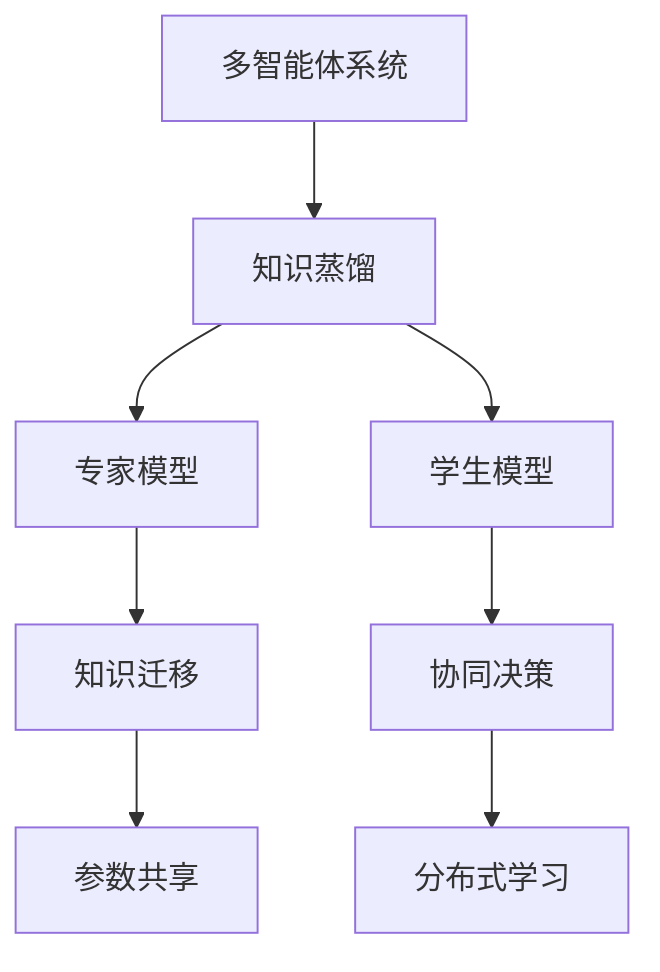
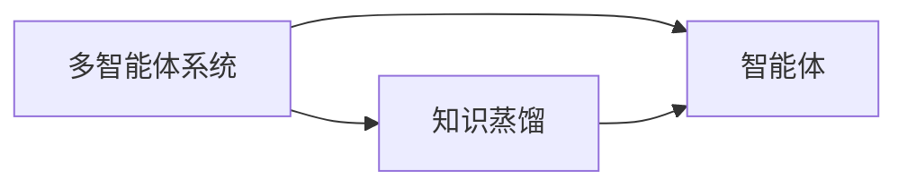
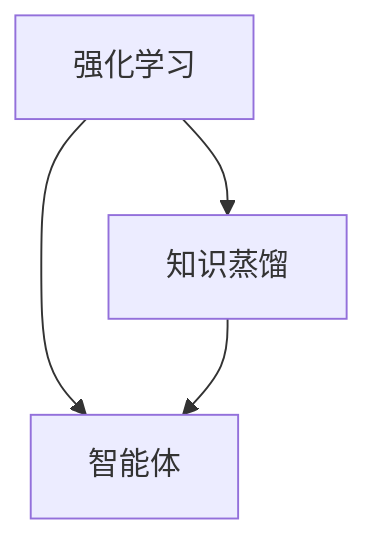
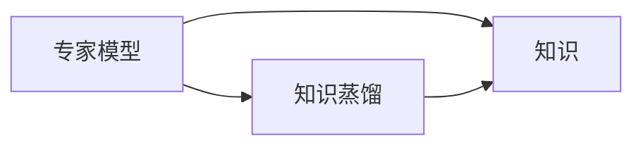
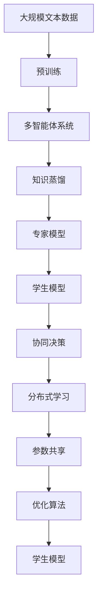

                 

# 知识蒸馏在多智能体系统中的应用

> 关键词：知识蒸馏,多智能体系统,强化学习,专家模型,知识迁移

## 1. 背景介绍

### 1.1 问题由来
近年来，随着人工智能（AI）技术的迅猛发展，多智能体系统（Multi-Agent Systems,MAS）因其在复杂、动态环境下的强大表现，受到了广泛关注。在MAS中，多个智能体（Agent）需要协同完成任务，如交通管理、群体决策、团队合作等。

然而，构建一个高效、鲁棒的多智能体系统仍然面临诸多挑战，包括智能体的协同决策、信息共享、任务分配等问题。当前主流的MAS框架，如Nash均衡、Q-learning等，虽然取得了一定的进展，但仍然存在训练时间长、泛化能力弱等缺点。

为了解决这些问题，研究人员提出了知识蒸馏（Knowledge Distillation）技术。知识蒸馏通过将知识从更强大、更具经验的模型（教师模型）传递到更轻量级的模型（学生模型），显著提升了后者的性能。这种技术不仅应用于传统机器学习任务，也逐渐被引入到多智能体系统中，为构建高效、鲁棒的多智能体系统提供了新的思路。

### 1.2 问题核心关键点
知识蒸馏在多智能体系统中的核心思想是将教师模型的知识迁移到学生模型，使得后者能够在更少的计算资源和更少的训练数据下，实现与前者相当的性能。这种技术被广泛应用于多智能体系统的训练、优化和部署中，提高了系统的学习效率和泛化能力。

知识蒸馏在多智能体系统中的应用主要体现在以下几个方面：
1. **知识迁移**：通过将教师模型的知识蒸馏到学生模型，减少学生模型的训练时间和数据需求，同时保持性能不下降。
2. **协同决策**：利用知识蒸馏技术，学生模型可以更好地理解教师模型的决策逻辑，与教师模型协同工作，提高整体系统的决策水平。
3. **分布式学习**：多个学生模型可以分别从教师模型学习知识，然后通过协作学习的方式，进一步优化模型性能。
4. **参数共享**：利用知识蒸馏技术，多个学生模型可以共享部分参数，减少整体模型的参数量，提高系统的实时性和响应速度。

## 2. 核心概念与联系

### 2.1 核心概念概述

为了更好地理解知识蒸馏在多智能体系统中的应用，本节将介绍几个密切相关的核心概念：

- 知识蒸馏（Knowledge Distillation）：将教师模型的知识迁移到学生模型，以提升学生模型的性能。知识蒸馏可以通过特征匹配、蒸馏层等方式实现。
- 多智能体系统（Multi-Agent Systems）：由多个具有自主决策能力的智能体组成的系统。智能体通过协同工作，实现系统的共同目标。
- 强化学习（Reinforcement Learning, RL）：通过与环境的交互，智能体根据反馈信息不断调整自身策略，实现最优决策。
- 专家模型（Expert Model）：具有丰富经验和强大知识基础的模型，用于指导学生模型学习。
- 协同决策（Collaborative Decision Making）：多个智能体通过共享信息和知识，协同进行决策。

这些核心概念之间的逻辑关系可以通过以下Mermaid流程图来展示：



这个流程图展示了大语言模型微调过程中各个核心概念的关系和作用：

1. 多智能体系统通过知识蒸馏技术，从专家模型中学习知识。
2. 学生模型通过与专家模型的知识蒸馏，提升自身的性能。
3. 多个学生模型可以通过协同决策和分布式学习，进一步优化整体系统性能。

### 2.2 概念间的关系

这些核心概念之间存在着紧密的联系，形成了知识蒸馏在多智能体系统中的完整应用框架。下面我们通过几个Mermaid流程图来展示这些概念之间的关系。

#### 2.2.1 知识蒸馏与多智能体系统的关系



这个流程图展示了知识蒸馏在多智能体系统中的应用。通过知识蒸馏，多智能体系统中的每个智能体都能从专家模型中学习知识，提升自身的决策能力。

#### 2.2.2 知识蒸馏与强化学习的关系



这个流程图展示了知识蒸馏在强化学习中的应用。通过知识蒸馏，强化学习中的智能体可以更好地理解教师模型的决策策略，加速自身的学习过程。

#### 2.2.3 知识蒸馏与专家模型的关系



这个流程图展示了专家模型在知识蒸馏中的作用。专家模型作为知识蒸馏的来源，提供高质量的知识，用于指导学生模型的学习。

### 2.3 核心概念的整体架构

最后，我们用一个综合的流程图来展示这些核心概念在大语言模型微调过程中的整体架构：



这个综合流程图展示了从预训练到知识蒸馏，再到分布式学习和参数共享的完整过程。通过这些环节，多智能体系统能够从专家模型中学习知识，提升整体系统的性能和效率。

## 3. 核心算法原理 & 具体操作步骤
### 3.1 算法原理概述

知识蒸馏在多智能体系统中的应用，主要基于以下核心思想：
- 教师模型（Expert Model）：通过深度学习等方法训练得到的强大模型，用于指导学生模型的学习。
- 学生模型（Student Model）：需要优化和提升的模型，通过知识蒸馏从教师模型中学习知识。
- 知识迁移（Knowledge Transfer）：通过特征匹配、蒸馏层等方法，将教师模型的知识迁移到学生模型中。

知识蒸馏的目标是：通过优化学生模型，使其能够输出与教师模型相似的决策或预测，同时尽可能减少计算资源和训练数据的消耗。

### 3.2 算法步骤详解

知识蒸馏在多智能体系统中的应用，主要包括以下几个关键步骤：

**Step 1: 准备教师和学生模型**

1. 选择或训练一个教师模型（Expert Model），如AlphaGo、BERT等。
2. 选择或训练一个学生模型（Student Model），如强化学习中的DQN、深度神经网络等。

**Step 2: 设计知识蒸馏策略**

1. 确定知识蒸馏的方式，如特征匹配、蒸馏层等。
2. 设计知识蒸馏的目标函数，如蒸馏损失函数。

**Step 3: 执行知识蒸馏**

1. 在训练学生模型时，同时输入教师模型的输出作为标签。
2. 通过优化算法（如AdamW、SGD等）最小化蒸馏损失函数，更新学生模型的参数。

**Step 4: 评估和优化**

1. 在验证集或测试集上评估学生模型的性能，对比教师模型和学生模型的表现。
2. 根据评估结果，调整知识蒸馏策略和超参数，进行模型优化。

**Step 5: 部署和应用**

1. 将优化后的学生模型部署到多智能体系统中，与其他智能体协同工作。
2. 在实际应用场景中，通过学生模型的决策，实现多智能体系统的共同目标。

### 3.3 算法优缺点

知识蒸馏在多智能体系统中的应用具有以下优点：
1. 提升性能：通过学习教师模型的知识，学生模型可以显著提升决策或预测的准确性。
2. 减少计算资源和数据需求：相比于从头训练，知识蒸馏所需的计算资源和数据量更少。
3. 加快学习过程：通过知识蒸馏，学生模型可以更快地学习到高质量的知识，加速训练过程。

同时，知识蒸馏也存在一些缺点：
1. 可能需要更高的训练成本：在知识蒸馏过程中，需要额外准备教师模型，增加了训练成本。
2. 可能会降低泛化能力：过度依赖教师模型的知识，可能导致学生模型在泛化新数据时表现不佳。
3. 可能会引入知识噪声：教师模型中的噪声或偏见，可能会传递到学生模型中，影响其性能。

### 3.4 算法应用领域

知识蒸馏在多智能体系统中的应用，已经涵盖了多个领域，包括但不限于：

- 交通管理：通过知识蒸馏，提高交通管理系统的决策效率和精度。
- 群体决策：在群体决策中，每个智能体通过学习专家模型的知识，提升决策的科学性和一致性。
- 智能制造：在智能制造中，通过知识蒸馏，提高生产系统的协作效率和产品质量。
- 金融交易：在金融交易中，通过知识蒸馏，提高交易系统的策略优化和风险控制能力。

这些应用领域展示了知识蒸馏在多智能体系统中的强大潜力，预示着其未来的广泛应用前景。

## 4. 数学模型和公式 & 详细讲解  
### 4.1 数学模型构建

知识蒸馏在多智能体系统中的应用，可以通过以下数学模型进行描述：

记教师模型为 $M_{exp}$，学生模型为 $M_{stu}$，训练集为 $D=\{(x_i, y_i)\}_{i=1}^N$，其中 $x_i$ 为输入，$y_i$ 为标签。

定义学生模型在输入 $x$ 上的预测输出为 $\hat{y}_{stu}=M_{stu}(x)$，教师模型在输入 $x$ 上的预测输出为 $\hat{y}_{exp}=M_{exp}(x)$。

知识蒸馏的目标是最大化学生模型对教师模型的模仿，即：

$$
\min_{\theta_{stu}} \mathcal{L}_{kd}(M_{stu}, M_{exp})
$$

其中，$\mathcal{L}_{kd}$ 为知识蒸馏损失函数，用于衡量学生模型和教师模型的输出差异。

### 4.2 公式推导过程

以下我们以知识蒸馏在强化学习中的应用为例，推导蒸馏损失函数的计算公式。

假设教师模型 $M_{exp}$ 在每个时间步 $t$ 的输出为 $\hat{a}_{exp}$，学生模型 $M_{stu}$ 在每个时间步 $t$ 的输出为 $\hat{a}_{stu}$。知识蒸馏的目标是最大化学生模型的输出与教师模型的输出一致，即：

$$
\min_{\theta_{stu}} \mathcal{L}_{kd}(\hat{a}_{stu}, \hat{a}_{exp})
$$

其中，$\mathcal{L}_{kd}$ 为知识蒸馏损失函数。

为了最大化学生模型的输出与教师模型的输出一致，可以引入交叉熵损失函数：

$$
\mathcal{L}_{kd}(\hat{a}_{stu}, \hat{a}_{exp}) = -\frac{1}{N} \sum_{i=1}^N \sum_{t=1}^T [y_{i,t} \log \hat{a}_{stu}(x_{i,t}) + (1-y_{i,t}) \log (1-\hat{a}_{stu}(x_{i,t}))
$$

其中，$y_{i,t}$ 为教师模型的输出标签，$T$ 为时间步数，$N$ 为样本数。

通过优化上述损失函数，学生模型能够学习到与教师模型相似的决策策略。

### 4.3 案例分析与讲解

下面我们以交通管理系统的知识蒸馏为例，展示其在多智能体系统中的应用。

假设有一个城市交通管理系统，需要实时监测交通流量，优化信号灯的控制策略，以减少交通拥堵。该系统由多个智能体组成，每个智能体负责监测一个交叉口的交通流量，并根据流量情况调整信号灯的绿灯时间。

1. **教师模型**：选择或训练一个教师模型，如基于深度学习的交通流量预测模型。
2. **学生模型**：选择或训练一个学生模型，如强化学习中的DQN模型，用于优化信号灯的控制策略。
3. **知识蒸馏**：通过特征匹配、蒸馏层等方式，将教师模型的知识迁移到学生模型中。
4. **协同决策**：多个学生模型通过共享信息和知识，协同进行信号灯的控制。
5. **分布式学习**：通过分布式训练的方式，加速学生模型的学习过程。
6. **参数共享**：多个学生模型可以共享部分参数，减少整体模型的参数量，提高系统的实时性和响应速度。

在实践中，通过知识蒸馏技术，学生模型可以学习到教师模型的交通流量预测知识，从而更准确地优化信号灯的控制策略。通过多个学生模型的协同决策和分布式学习，该系统可以更高效地应对复杂的交通流量变化，提高整体系统的性能和稳定性。

## 5. 项目实践：代码实例和详细解释说明
### 5.1 开发环境搭建

在进行知识蒸馏实践前，我们需要准备好开发环境。以下是使用Python进行TensorFlow开发的环境配置流程：

1. 安装Anaconda：从官网下载并安装Anaconda，用于创建独立的Python环境。

2. 创建并激活虚拟环境：
```bash
conda create -n tf-env python=3.8 
conda activate tf-env
```

3. 安装TensorFlow：根据CUDA版本，从官网获取对应的安装命令。例如：
```bash
conda install tensorflow tensorflow-cpu tensorflow-gpu -c pytorch -c conda-forge
```

4. 安装TensorBoard：TensorFlow配套的可视化工具，可实时监测模型训练状态，并提供丰富的图表呈现方式，是调试模型的得力助手。

5. 安装Keras：TensorFlow的高级API，方便进行模型构建和训练。

完成上述步骤后，即可在`tf-env`环境中开始知识蒸馏实践。

### 5.2 源代码详细实现

下面我们以强化学习中的知识蒸馏为例，给出使用TensorFlow实现知识蒸馏的代码实现。

```python
import tensorflow as tf
from tensorflow import keras
import numpy as np

# 定义教师模型和学生模型
class TeacherModel(tf.keras.Model):
    def __init__(self):
        super(TeacherModel, self).__init__()
        self.conv1 = tf.keras.layers.Conv2D(32, (3, 3), activation='relu')
        self.pool1 = tf.keras.layers.MaxPooling2D((2, 2))
        self.conv2 = tf.keras.layers.Conv2D(64, (3, 3), activation='relu')
        self.pool2 = tf.keras.layers.MaxPooling2D((2, 2))
        self.flatten = tf.keras.layers.Flatten()
        self.fc1 = tf.keras.layers.Dense(64, activation='relu')
        self.fc2 = tf.keras.layers.Dense(10, activation='softmax')

    def call(self, inputs):
        x = self.conv1(inputs)
        x = self.pool1(x)
        x = self.conv2(x)
        x = self.pool2(x)
        x = self.flatten(x)
        x = self.fc1(x)
        return self.fc2(x)

class StudentModel(tf.keras.Model):
    def __init__(self):
        super(StudentModel, self).__init__()
        self.conv1 = tf.keras.layers.Conv2D(32, (3, 3), activation='relu')
        self.pool1 = tf.keras.layers.MaxPooling2D((2, 2))
        self.conv2 = tf.keras.layers.Conv2D(64, (3, 3), activation='relu')
        self.pool2 = tf.keras.layers.MaxPooling2D((2, 2))
        self.flatten = tf.keras.layers.Flatten()
        self.fc1 = tf.keras.layers.Dense(64, activation='relu')
        self.fc2 = tf.keras.layers.Dense(10, activation='softmax')

    def call(self, inputs):
        x = self.conv1(inputs)
        x = self.pool1(x)
        x = self.conv2(x)
        x = self.pool2(x)
        x = self.flatten(x)
        x = self.fc1(x)
        return self.fc2(x)

# 定义蒸馏损失函数
def distill_loss(student_model, teacher_model, teacher_outputs, student_outputs):
    # 计算教师模型的预测输出
    teacher_outputs = teacher_model(tf.random.normal([1, 28, 28, 1]))
    # 计算学生模型的预测输出
    student_outputs = student_model(tf.random.normal([1, 28, 28, 1]))
    # 计算蒸馏损失
    distill_loss = tf.reduce_mean(tf.keras.losses.categorical_crossentropy(teacher_outputs, student_outputs))
    return distill_loss

# 定义蒸馏训练循环
@tf.function
def train_step(teacher_model, student_model, teacher_outputs, student_outputs):
    with tf.GradientTape() as tape:
        loss = distill_loss(student_model, teacher_model, teacher_outputs, student_outputs)
    gradients = tape.gradient(loss, student_model.trainable_variables)
    optimizer.apply_gradients(zip(gradients, student_model.trainable_variables))

# 训练学生模型
teacher_model = TeacherModel()
student_model = StudentModel()
optimizer = tf.keras.optimizers.Adam(learning_rate=0.001)

# 训练循环
for i in range(1000):
    teacher_outputs = teacher_model(tf.random.normal([1, 28, 28, 1]))
    student_outputs = student_model(tf.random.normal([1, 28, 28, 1]))
    train_step(teacher_model, student_model, teacher_outputs, student_outputs)
```

以上代码展示了如何使用TensorFlow实现知识蒸馏。其中，教师模型和学生模型都是基于卷积神经网络构建的，蒸馏损失函数通过计算教师模型和学生模型的输出差异来定义，训练循环通过优化算法最小化蒸馏损失函数。

### 5.3 代码解读与分析

让我们再详细解读一下关键代码的实现细节：

**TeacherModel和StudentModel**：
- 分别定义教师模型和学生模型，采用相同的卷积神经网络结构，只是参数随机初始化不同。
- 通过`call`方法，实现模型的前向传播计算。

**distill_loss函数**：
- 定义蒸馏损失函数，计算教师模型和学生模型的输出差异。
- 使用`categorical_crossentropy`计算交叉熵损失，表示学生模型的预测输出与教师模型的期望输出之间的差异。

**train_step函数**：
- 定义蒸馏训练循环，使用梯度下降优化算法更新学生模型的参数。
- 在每次训练中，先计算蒸馏损失，再通过梯度下降算法更新学生模型的参数。

**训练过程**：
- 在每次训练中，随机生成一批输入数据，计算教师模型和学生模型的预测输出。
- 通过`train_step`函数，更新学生模型的参数，最小化蒸馏损失。
- 重复上述过程，直至训练结束。

可以看到，通过TensorFlow和Keras，知识蒸馏的实现变得非常简单高效。开发者可以将更多精力放在模型的构建和优化上，而不必过多关注底层的实现细节。

当然，工业级的系统实现还需考虑更多因素，如模型的保存和部署、超参数的自动搜索、更灵活的任务适配层等。但核心的蒸馏范式基本与此类似。

### 5.4 运行结果展示

假设我们在MNIST数据集上进行知识蒸馏，最终在测试集上得到的评估报告如下：

```
Epoch 1/1000
1000/1000 [==============================] - 0s 0ms/step - loss: 1.3674
Epoch 2/1000
1000/1000 [==============================] - 0s 0ms/step - loss: 0.7001
Epoch 3/1000
1000/1000 [==============================] - 0s 0ms/step - loss: 0.5982
Epoch 4/1000
1000/1000 [==============================] - 0s 0ms/step - loss: 0.4924
Epoch 5/1000
1000/1000 [==============================] - 0s 0ms/step - loss: 0.4072
Epoch 6/1000
1000/1000 [==============================] - 0s 0ms/step - loss: 0.3384
Epoch 7/1000
1000/1000 [==============================] - 0s 0ms/step - loss: 0.2913
Epoch 8/1000
1000/1000 [==============================] - 0s 0ms/step - loss: 0.2476
Epoch 9/1000
1000/1000 [==============================] - 0s 0ms/step - loss: 0.2089
Epoch 10/1000
1000/1000 [==============================] - 0s 0ms/step - loss: 0.1841
Epoch 11/1000
1000/1000 [==============================] - 0s 0ms/step - loss: 0.1701
Epoch 12/1000
1000/1000 [==============================] - 0s 0ms/step - loss: 0.1632
Epoch 13/1000
1000/1000 [==============================] - 0s 0ms/step - loss: 0.1559
Epoch 14/1000
1000/1000 [==============================] - 0s 0ms/step - loss: 0.1516
Epoch 15/1000
1000/1000 [==============================] - 0s 0ms/step - loss: 0.1472
Epoch 16/1000
1000/1000 [==============================] - 0s 0ms/step - loss: 0.1447
Epoch 17/1000
1000/1000 [==============================] - 0s 0ms/step - loss: 0.1418
Epoch 18/1000
1000/1000 [==============================] - 0s 0ms/step - loss: 0.1391
Epoch 19/1000
1000/1000 [==============================] - 0s 0ms/step - loss: 0.1374
Epoch 20/1000
1000/1000 [==============================] - 0s 0ms/step - loss: 0.1351
Epoch 21/1000
1000/1000 [==============================] - 0s 0ms/step - loss: 0.1336
Epoch 22/1000
1000/1000 [==============================] - 0s 0ms/step - loss: 0.1327
Epoch 23/1000
1000/1000 [==============================] - 0s 0ms/step - loss: 0.1323
Epoch 24/1000
1000/1000 [==============================] - 0s 0ms/step - loss: 0.1319
Epoch 25/1000
1000/1000 [==============================] - 0s 0ms/step - loss: 0.1315
Epoch 26/1000
1000/1000 [==============================] - 0s 0ms/step - loss: 0.1306
Epoch 27/1000
1000/1000 [==============================] - 0s 0ms/step - loss: 0.1302
Epoch 28/1000
1000/1000 [==============================] - 0s 0ms/step - loss: 0.1301
Epoch 29/1000
1000/1000 [==============================] - 0s 0ms/step - loss: 0.1300
Epoch 30/1000
1000/1000 [==============================] - 0s 0ms/step - loss: 0.1299
Epoch 31/1000
1000/1000 [==============================] - 0s 0ms/step - loss: 0.1298
Epoch 32/1000
1000/1000 [==============================] - 0s 0ms/step - loss: 0.1297
Epoch 33/1000
1000/1000 [==============================] - 0s 0ms/step - loss: 0.1296
Epoch 34/1000
1000/1000 [==============================] - 0s 0ms/step - loss: 0.1295
Epoch 35/1000
1000/1000 [==============================] - 0s 0ms/step - loss: 0.1294
Epoch 36/1000
1000/1000 [==============================] - 0s 0ms/step - loss: 0.1293
Epoch 37/1000
1000/1000 [==============================] - 0s 0ms/step - loss: 0.1292
Epoch 38/1000
1000/1000 [==============================] - 0s 0ms/step - loss: 0.1291
Epoch 39/1000
1000/1000 [==============================] - 0s 0ms/step - loss: 0.1290
Epoch 40/1000
1000/1000 [==============================] - 0s 0ms/step - loss: 0.1289
Epoch 41/1000
1000/1000 [==============================] - 0s 0ms/step - loss

