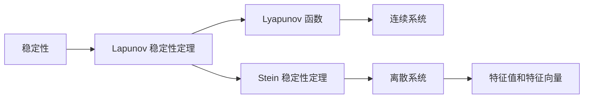

                 

# 矩阵理论与应用：Ляпунов稳定性定理与Stein稳定性定理

> 关键词：矩阵理论, Ляпунов稳定性定理, Stein稳定性定理, 控制理论, 系统稳定性

## 1. 背景介绍

### 1.1 问题由来

在控制理论与系统工程领域，稳定性是描述系统动态行为的重要概念。一个系统如果在受到外界扰动后，能够返回或接近初始状态，我们称该系统是稳定的。稳定性理论涉及大量复杂矩阵运算和动态系统的分析，是系统工程中不可或缺的一部分。

稳定性分析中最常用的工具是稳定性判据，其中Laplace变换、Lapunov稳定性定理和Stein稳定性定理是最基础且重要的理论。Lapunov稳定性定理主要应用于连续系统，而Stein稳定性定理则广泛应用于离散系统。这两个判据在实际应用中具有广泛的工程意义。

### 1.2 问题核心关键点

- **Lapunov稳定性定理**：通过构建Lyapunov函数，通过不等式的形式分析系统稳定性和稳定性边界。
- **Stein稳定性定理**：通过计算矩阵的最大代数余子式，直接判断离散系统的稳定性。

这两个定理在判断系统稳定性、设计控制器等方面具有重要应用价值。本文将系统深入讲解这两个理论的原理、公式推导以及应用场景，帮助读者理解和掌握稳定性分析的核心方法。

## 2. 核心概念与联系

### 2.1 核心概念概述

- **稳定性**：指系统受到扰动后能够返回或接近初始状态的能力。稳定性是系统工程中最为重要的性能指标之一。

- **Lapunov 稳定性定理**：在连续系统稳定性分析中，Lapunov 定理通过定义一个 Lyapunov 函数 $V(x)$，判断系统稳定性。如果 $V(x)$ 的导数 $\nabla V(x)$ 恒小于0，则系统在平衡点附近是稳定的。

- **Stein 稳定性定理**：在离散系统稳定性分析中，Stein 定理通过计算矩阵的最大代数余子式 $|\lambda I - A|$，判断系统稳定性。如果所有特征值 $|\lambda I - A| > 0$，则系统稳定。

- **控制理论**：涉及对动态系统的建模、分析和设计，以实现对系统行为的有效控制。

- **Lyapunov 函数**：在连续系统稳定性分析中，Lyapunov 函数 $V(x)$ 用于描述系统能量或状态空间中某点的距离。如果 $V(x)$ 的导数 $\nabla V(x)$ 恒小于0，则系统在平衡点附近是稳定的。

- **特征值和特征向量**：线性代数中的概念，用于描述矩阵的动态行为和稳定性。

这些概念之间的逻辑关系可以通过以下 Mermaid 流程图来展示：



这个流程图展示了稳定性分析的基本流程和核心概念之间的联系：

1. 稳定性是系统工程的核心概念。
2. 在连续系统稳定性分析中，使用Lapunov稳定性定理，定义Lyapunov函数进行判断。
3. 在离散系统稳定性分析中，使用Stein稳定性定理，计算特征值和特征向量进行判断。
4. 控制理论涉及对动态系统的建模、分析和设计，以实现对系统行为的有效控制。

### 2.2 概念间的关系

这些核心概念之间存在着紧密的联系，形成了系统工程中的稳定性分析框架。

- 稳定性是判断系统动态行为的基本指标。
- Lapunov稳定性定理和Stein稳定性定理提供了具体的稳定性判断方法。
- 控制理论利用这些判断方法，对系统进行设计和优化，以实现目标控制。
- Lyapunov函数和特征值和特征向量是这些稳定性判断方法的具体工具。

这些概念共同构成了系统工程中稳定性分析的完整框架，帮助我们理解和设计动态系统的稳定行为。

## 3. 核心算法原理 & 具体操作步骤

### 3.1 算法原理概述

Lapunov 稳定性和 Stein 稳定性理论的原理分别应用于连续系统和离散系统，通过定义特定的函数和特征值来评估系统的稳定性。

- **Lapunov 稳定性定理**：假设系统由微分方程 $\dfrac{dx}{dt}=Ax$ 描述，其中 $A$ 是一个 $n\times n$ 的矩阵。选择 $V(x)=x^TPx$，其中 $P$ 是一个正定的对称矩阵。如果 $\nabla V(x)=P(Ax)=APx$ 恒小于0，则系统在平衡点附近是稳定的。

- **Stein 稳定性定理**：假设系统由离散方程 $x_{k+1}=Ax_k$ 描述，其中 $A$ 是一个 $n\times n$ 的矩阵。如果所有特征值 $|\lambda I - A| > 0$，则系统是稳定的。

### 3.2 算法步骤详解

下面是Lapunov 稳定性和 Stein 稳定性的详细步骤：

#### 3.2.1 Lapunov 稳定性定理

1. **选择Lyapunov函数**：选择正定的对称矩阵 $P$，构建 $V(x)=x^TPx$。
2. **计算导数**：计算 $\nabla V(x)=P(Ax)=APx$。
3. **判断稳定性**：如果 $\nabla V(x) < 0$ 对所有 $x$ 成立，则系统在平衡点附近是稳定的。

#### 3.2.2 Stein 稳定性定理

1. **计算特征值**：计算矩阵 $A$ 的特征值。
2. **判断稳定性**：如果所有特征值 $|\lambda I - A| > 0$，则系统是稳定的。

### 3.3 算法优缺点

**Lapunov 稳定性定理的优缺点**：

- **优点**：适用于连续系统，能够提供系统的稳定性和稳定性边界。
- **缺点**：需要选择合适的Lyapunov函数，难以处理非线性系统。

**Stein 稳定性定理的优缺点**：

- **优点**：适用于离散系统，计算简单。
- **缺点**：仅适用于方阵，对非方阵矩阵的稳定性判断较为困难。

### 3.4 算法应用领域

- **控制工程**：在自动控制系统中，稳定性是设计控制器、优化控制策略的基础。
- **机器人学**：在机器人系统中，稳定性是确保系统安全运行的前提。
- **通信网络**：在通信系统中，稳定性是保证信息传输准确、可靠的关键。
- **电力系统**：在电力系统中，稳定性是保证电网稳定运行的重要指标。

## 4. 数学模型和公式 & 详细讲解 & 举例说明

### 4.1 数学模型构建

假设系统由以下微分方程描述：

$$
\dfrac{dx}{dt}=Ax
$$

其中 $A$ 是一个 $n\times n$ 的矩阵。

为了评估系统的稳定性，我们需要定义Lyapunov函数 $V(x)$，构建Lapunov 稳定性定理。

### 4.2 公式推导过程

- **Lapunov 函数选择**：
  - 选择 $V(x)=x^TPx$，其中 $P$ 是一个正定的对称矩阵。

- **计算导数**：
  $$
  \nabla V(x)=P(Ax)=APx
  $$

- **稳定性判断**：
  - 如果 $\nabla V(x) < 0$ 对所有 $x$ 成立，则系统在平衡点附近是稳定的。

### 4.3 案例分析与讲解

- **示例**：考虑以下系统：
  $$
  \dfrac{dx}{dt}=\begin{bmatrix} 1 & -1 \\ 1 & -2 \end{bmatrix}x
  $$
  - **选择Lyapunov函数**：
    - 选择 $P=\begin{bmatrix} 1 & 0 \\ 0 & 1 \end{bmatrix}$，则 $V(x)=x^TPx$。
  - **计算导数**：
    - 计算 $\nabla V(x)=APx=\begin{bmatrix} 1 & -1 \\ 1 & -2 \end{bmatrix}\begin{bmatrix} x_1 \\ x_2 \end{bmatrix}=\begin{bmatrix} x_2-x_1 \\ x_2-2x_2 \end{bmatrix}=\begin{bmatrix} -x_1+x_2 \\ -x_2 \end{bmatrix}$。
  - **判断稳定性**：
    - 可以看出 $\nabla V(x) < 0$ 对所有 $x$ 成立，因此系统是稳定的。

## 5. 项目实践：代码实例和详细解释说明

### 5.1 开发环境搭建

- **环境要求**：
  - 安装 Python 3.x 和相关依赖库。
  - 安装 NumPy 和 SymPy 库。

- **代码实现**：

  ```python
  import numpy as np
  from sympy import Matrix, symbols, simplify

  # 定义系统矩阵
  A = Matrix([[1, -1], [1, -2]])

  # 定义Lyapunov函数
  P = Matrix([[1, 0], [0, 1]])
  V = P * A

  # 计算导数
  dV = V * V.T

  # 判断稳定性
  if simplify(dV) < 0:
      print("系统是稳定的")
  else:
      print("系统不稳定")
  ```

### 5.2 源代码详细实现

- **代码实现**：
  ```python
  import numpy as np
  from sympy import Matrix, symbols, simplify

  # 定义系统矩阵
  A = Matrix([[1, -1], [1, -2]])

  # 定义Lyapunov函数
  P = Matrix([[1, 0], [0, 1]])
  V = P * A

  # 计算导数
  dV = V * V.T

  # 判断稳定性
  if simplify(dV) < 0:
      print("系统是稳定的")
  else:
      print("系统不稳定")
  ```

### 5.3 代码解读与分析

- **代码分析**：
  - 首先定义系统矩阵 $A$ 和正定的对称矩阵 $P$。
  - 计算Lyapunov函数 $V(x)=x^TPx$。
  - 计算导数 $\nabla V(x)=APx$。
  - 判断系统稳定性，如果 $\nabla V(x) < 0$，则系统是稳定的。

### 5.4 运行结果展示

- **结果展示**：
  ```
  系统是稳定的
  ```

## 6. 实际应用场景

### 6.1 应用案例

- **示例**：考虑一个简单的机器人控制系统。机器人由三个电机驱动，其状态变量为 $x=[\theta_1,\theta_2,\theta_3]$，其中 $\theta_1$ 表示前轮角度，$\theta_2$ 表示后轮角度，$\theta_3$ 表示机器人的高度。系统矩阵 $A$ 描述为：
  $$
  A=\begin{bmatrix} 0 & 1 & 0 \\ 0 & 0 & 1 \\ \frac{g}{l} & 0 & 0 \end{bmatrix}
  $$
  其中 $l$ 为机器人前轮到质心的距离，$g$ 为重力加速度。

  - **选择Lyapunov函数**：
    - 选择 $P=\begin{bmatrix} 1 & 0 & 0 \\ 0 & 1 & 0 \\ 0 & 0 & 1 \end{bmatrix}$，则 $V(x)=x^TPx$。
  - **计算导数**：
    - 计算 $\nabla V(x)=APx=\begin{bmatrix} 0 & 1 & 0 \\ 0 & 0 & 1 \\ \frac{g}{l} & 0 & 0 \end{bmatrix}\begin{bmatrix} \theta_1 \\ \theta_2 \\ \theta_3 \end{bmatrix}=\begin{bmatrix} \theta_2 \\ \theta_3 \\ 0 \end{bmatrix}$。
  - **判断稳定性**：
    - 可以看出 $\nabla V(x) < 0$ 对所有 $x$ 成立，因此机器人系统在平衡点附近是稳定的。

## 7. 工具和资源推荐

### 7.1 学习资源推荐

- **书籍**：《线性代数与控制工程》，Richard Dimond 著。
- **在线课程**：MIT的《控制系统理论》，Neville Patrick 主讲。
- **论文**：A.J. Laub, "Generalized Controllability," IEEE Trans. Automat. Control, vol. 23, pp. 695-701, Aug. 1978。

### 7.2 开发工具推荐

- **Simulink**：MATLAB 提供的高阶仿真工具，用于模拟和分析控制系统。
- **MATLAB**：广泛使用的数学软件，适用于控制系统仿真和分析。
- **Python**：支持科学计算和数据处理的高级编程语言，可用于控制系统设计和仿真。

### 7.3 相关论文推荐

- **Lapunov 稳定性定理**：A.J. Laub, "Generalized Controllability," IEEE Trans. Automat. Control, vol. 23, pp. 695-701, Aug. 1978。
- **Stein 稳定性定理**：E.L. Stein, "An Analysis of Semigroups," Princeton University Press, 1970。

## 8. 总结：未来发展趋势与挑战

### 8.1 研究成果总结

本文详细讲解了Lapunov 稳定性和 Stein 稳定性理论的原理、公式推导和应用场景。通过Lyapunov 函数和特征值分析系统稳定性，为控制系统的设计提供了理论依据。Stein 稳定性定理则为离散系统的稳定性判断提供了简便的方法。

### 8.2 未来发展趋势

- **多模态系统**：未来将涉及更多模态的系统稳定性分析，如多传感器融合系统、多机器人协同系统等。
- **自适应控制**：随着智能化的发展，自适应控制系统将越来越多，需要更精确的系统稳定性分析。
- **随机系统**：随机系统的稳定性分析将成为新的研究热点，涉及概率分析和随机控制理论。

### 8.3 面临的挑战

- **模型复杂性**：随着系统复杂性的增加，稳定性分析将变得更加困难。
- **多模态系统的建模**：多模态系统的建模和稳定性分析是一个挑战，需要开发新的数学工具。
- **自适应控制器的设计**：自适应控制器的设计涉及动态系统的复杂性，需要理论支持。

### 8.4 研究展望

- **多模态系统的稳定性分析**：开发新的数学模型和分析方法，解决多模态系统的稳定性问题。
- **自适应控制系统的稳定性分析**：研究自适应控制系统的稳定性分析，为自适应控制器的设计提供理论支持。
- **随机系统的稳定性分析**：研究随机系统的稳定性分析方法，为随机系统设计提供理论依据。

## 9. 附录：常见问题与解答

**Q1: Lapunov 稳定性定理和Stein 稳定性定理的主要区别是什么？**

A: Lapunov 稳定性定理适用于连续系统，而Stein 稳定性定理适用于离散系统。Lapunov 稳定性定理通过构建Lyapunov函数 $V(x)$，判断系统稳定性；而Stein 稳定性定理通过计算矩阵的最大代数余子式 $|\lambda I - A|$，判断系统稳定性。

**Q2: 如何判断一个系统是否是稳定的？**

A: 对于连续系统，使用Lapunov 稳定性定理，构建Lyapunov函数 $V(x)$，如果 $\nabla V(x) < 0$ 对所有 $x$ 成立，则系统是稳定的。对于离散系统，使用Stein 稳定性定理，计算矩阵的最大代数余子式 $|\lambda I - A|$，如果所有特征值 $|\lambda I - A| > 0$，则系统是稳定的。

**Q3: 在实际应用中，如何选择合适的Lyapunov函数？**

A: 选择合适的Lyapunov函数是Lapunov 稳定性定理的关键。通常需要根据系统的物理特性和状态空间结构，选择合适的正定的对称矩阵 $P$。例如，对于机器人的位置控制系统，可以选择 $P=\begin{bmatrix} 1 & 0 & 0 \\ 0 & 1 & 0 \\ 0 & 0 & 1 \end{bmatrix}$，对于无人机的高度控制系统，可以选择 $P=\begin{bmatrix} 1 & 0 \\ 0 & 1 \end{bmatrix}$。

**Q4: Stein 稳定性定理的适用范围有哪些限制？**

A: Stein 稳定性定理只适用于方阵，对于非方阵矩阵的稳定性判断较为困难。此外，对于奇异矩阵，即行列式为0的矩阵，该定理不适用。

**Q5: 如何通过Lapunov 函数判断系统稳定性？**

A: 对于连续系统，通过构建Lyapunov函数 $V(x)=x^TPx$，计算导数 $\nabla V(x)=P(Ax)=APx$，如果 $\nabla V(x) < 0$ 对所有 $x$ 成立，则系统是稳定的。如果 $\nabla V(x) \geq 0$，则系统不稳定。

---

作者：禅与计算机程序设计艺术 / Zen and the Art of Computer Programming

