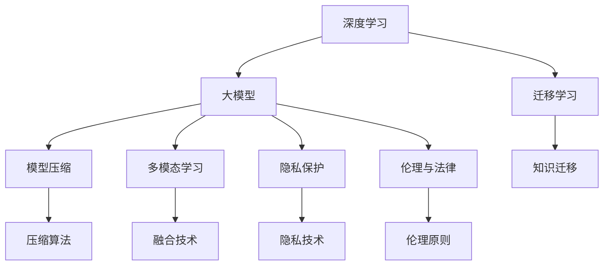
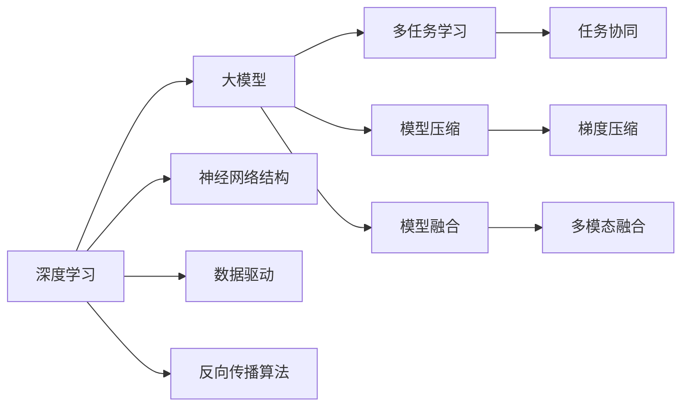
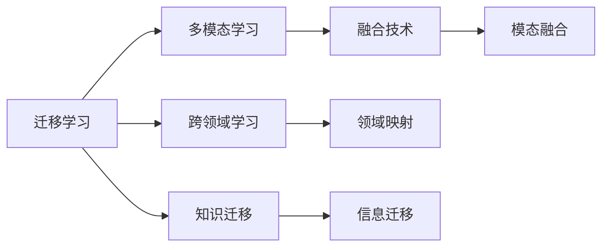
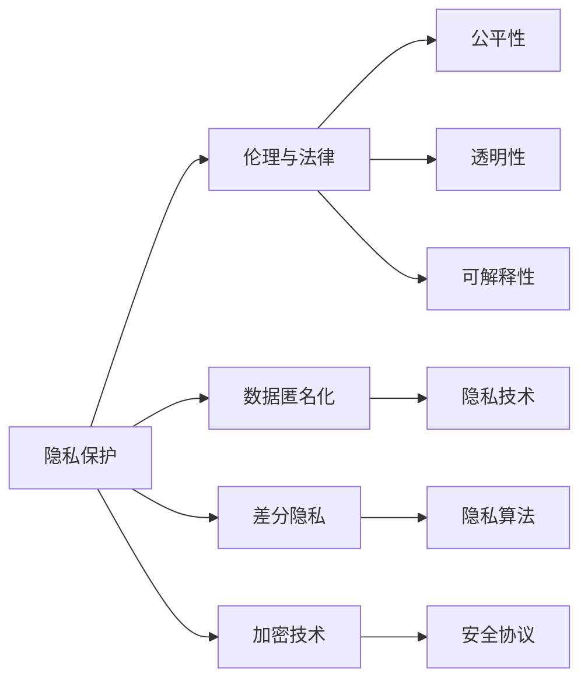

                 

# 大模型：数据驱动的智能革命

> 关键词：
- 大模型
- 深度学习
- 数据驱动
- 智能革命
- 模型压缩
- 迁移学习
- 模型融合
- 多模态学习
- 隐私保护
- 伦理与法律

## 1. 背景介绍

### 1.1 问题由来

随着互联网技术的迅猛发展，人类社会正在经历一场以数据为中心的智能革命。大数据、人工智能、深度学习等前沿技术，正在深刻改变我们的生产和生活方式。在这场智能革命中，大模型（Large Model）以其卓越的性能和广阔的应用前景，成为了研究者和企业争相追捧的对象。

大模型，顾名思义，指参数规模较大的模型，通常具有数十亿个甚至更多的参数。这些模型通过在海量数据上进行的深度学习训练，能够自动提取数据中的复杂特征和模式，表现出强大的泛化能力和适应性。在自然语言处理、计算机视觉、语音识别等众多领域，大模型的表现远超传统小模型，成为了推动技术发展的关键驱动力。

### 1.2 问题核心关键点

大模型的核心思想是通过深度学习技术，在数据驱动下进行模型参数的优化和调整，使其能够适应复杂的现实场景和任务。与传统小模型相比，大模型具有以下优点：

- 参数量更大：可以处理更复杂的输入数据，提取更丰富的特征。
- 泛化能力更强：能够更好地适应未知数据，泛化到各种场景。
- 适应性更广：可以在不同的任务上进行微调，实现多样化的应用。

大模型的训练需要大量的数据和计算资源，但一旦训练完成，其效果可以显著优于传统小模型，成为许多实际应用中的首选。然而，大模型的训练过程也面临诸多挑战，如计算资源需求高、模型压缩复杂等，需要综合考虑算法和工程等方面的因素。

### 1.3 问题研究意义

大模型的研究与应用，对于推动人工智能技术的广泛应用，提升产业竞争力，具有重要意义：

1. 加速技术进步：大模型的出现，使得深度学习算法能够处理更加复杂和多样化的任务，推动了人工智能技术的进步。
2. 提升用户体验：大模型能够提供更加准确、自然、智能的交互体验，提升用户满意度。
3. 促进产业升级：通过大模型的应用，企业可以优化生产流程，提高效率，增强竞争力。
4. 促进学术创新：大模型的研究需要跨学科的知识融合，推动了学术界的创新发展。
5. 赋能社会变革：大模型能够解决许多社会问题，如医疗、教育、交通等，促进社会进步。

## 2. 核心概念与联系

### 2.1 核心概念概述

为了更好地理解大模型的核心思想和应用场景，本节将介绍几个关键概念及其联系：

- **深度学习**：一种通过多层神经网络进行数据建模和预测的技术，是训练大模型的主要方法。
- **大模型**：指参数规模较大的模型，通常具有数十亿个甚至更多的参数。
- **迁移学习**：指将一个领域学习到的知识，迁移到另一个相关领域中进行学习的过程。
- **模型压缩**：指通过技术手段减少大模型参数量，提高其推理速度和效率。
- **多模态学习**：指将不同模态的数据（如文本、图像、音频等）进行融合，提升模型的泛化能力。
- **隐私保护**：指在大模型训练和应用中，如何保护用户数据的隐私和安全性。
- **伦理与法律**：指在大模型的开发和应用中，如何遵循伦理规范和法律法规，确保其公平、透明、可解释性。

这些核心概念之间存在紧密的联系，共同构成了大模型生态系统的核心。下面通过几个Mermaid流程图来展示它们之间的联系：



通过这些流程图，我们可以更清晰地理解大模型生态系统中各概念的相互关系和作用机制。

### 2.2 概念间的关系

这些核心概念之间存在复杂的交互和影响，下面通过几个具体的Mermaid流程图来展示它们之间的关系：

#### 2.2.1 深度学习与大模型的关系



这个流程图展示了深度学习与大模型之间的相互关系：深度学习提供了一种数据驱动的模型训练方法，大模型通过深度学习得到广泛应用；神经网络结构、反向传播算法等是深度学习的重要组成部分；多任务学习、模型压缩、模型融合等技术都是深度学习和模型训练中常用的手段。

#### 2.2.2 迁移学习与多模态学习的关系



这个流程图展示了迁移学习与多模态学习之间的相互关系：迁移学习将一个领域学习到的知识迁移到另一个领域中；多模态学习将不同模态的数据进行融合，提升模型的泛化能力；跨领域学习和领域映射是迁移学习的重要手段；信息迁移和模态融合是多模态学习的主要方法。

#### 2.2.3 隐私保护与伦理与法律的关系



这个流程图展示了隐私保护与伦理与法律之间的相互关系：隐私保护包括数据匿名化、差分隐私、加密技术等手段，确保数据的安全性和隐私性；伦理与法律规定了模型的使用规范和标准，保障公平、透明、可解释性等原则；公平性、透明性和可解释性是伦理与法律的重要内容；隐私技术和隐私算法是隐私保护的主要手段；安全协议是确保数据传输安全的措施。

## 3. 核心算法原理 & 具体操作步骤
### 3.1 算法原理概述

大模型的训练和应用，主要通过深度学习算法来实现。深度学习算法通过多层神经网络的非线性变换，自动提取数据的特征和模式，从而实现对复杂任务的建模和预测。

在大模型的训练过程中，通常采用梯度下降等优化算法，通过反向传播算法计算梯度，更新模型参数，使其逐渐逼近目标函数。具体步骤如下：

1. 数据准备：收集和预处理训练数据，构建数据集。
2. 模型选择：选择合适的神经网络结构，并初始化模型参数。
3. 损失函数设计：根据任务类型，设计相应的损失函数。
4. 优化器选择：选择适合的大规模模型优化器，如Adam、Adagrad等。
5. 训练过程：使用优化器更新模型参数，迭代训练过程，直到收敛。
6. 模型评估：在验证集上评估模型性能，选择最优模型。

### 3.2 算法步骤详解

下面以自然语言处理（NLP）领域为例，详细介绍大模型的训练和应用过程：

1. **数据准备**
   - 收集大量标注数据，如文本分类、命名实体识别等任务的数据集。
   - 对数据进行预处理，包括分词、去停用词、标准化等操作。
   - 将数据划分为训练集、验证集和测试集。

2. **模型选择**
   - 选择合适的神经网络结构，如循环神经网络（RNN）、卷积神经网络（CNN）、Transformer等。
   - 对模型进行初始化，通常使用随机初始化或预训练模型作为初始参数。

3. **损失函数设计**
   - 根据任务类型，设计相应的损失函数，如交叉熵损失、均方误差损失等。
   - 在训练过程中，通过损失函数计算模型预测值与真实标签之间的差异。

4. **优化器选择**
   - 选择适合的大规模模型优化器，如Adam、Adagrad等。
   - 设置优化器的超参数，如学习率、批大小等。

5. **训练过程**
   - 使用优化器更新模型参数，迭代训练过程，直到收敛。
   - 在每个epoch中，将数据分批次输入模型，计算梯度并更新参数。
   - 在验证集上评估模型性能，根据性能指标决定是否提前停止训练。

6. **模型评估**
   - 在测试集上评估模型性能，选择最优模型。
   - 使用多种评估指标，如准确率、召回率、F1分数等，衡量模型效果。

### 3.3 算法优缺点

大模型在训练和应用中具有以下优点：

- **泛化能力强**：大模型能够处理更复杂的输入数据，提取更丰富的特征，适应性更强。
- **迁移学习能力**：通过迁移学习，大模型可以在不同任务和领域中进行快速适应。
- **多模态融合**：大模型能够将不同模态的数据进行融合，提升模型的泛化能力。

同时，大模型也存在以下缺点：

- **计算资源需求高**：大模型的训练需要大量的计算资源，如GPU/TPU等，成本较高。
- **模型压缩复杂**：大模型的参数量较大，压缩过程复杂且容易引入误差。
- **隐私和安全问题**：大模型需要大量的训练数据，数据隐私和安全问题不容忽视。
- **伦理和法律风险**：大模型的应用可能面临伦理和法律风险，需严格遵守相关规定。

### 3.4 算法应用领域

大模型的应用领域非常广泛，涵盖多个领域，包括但不限于：

- **自然语言处理**：如文本分类、命名实体识别、机器翻译、情感分析等。
- **计算机视觉**：如图像分类、目标检测、图像生成、人脸识别等。
- **语音识别**：如自动语音识别、语音合成、情感识别等。
- **智能推荐**：如电商推荐、新闻推荐、广告推荐等。
- **智能客服**：如智能问答、智能语音助手等。

## 4. 数学模型和公式 & 详细讲解 & 举例说明

### 4.1 数学模型构建

大模型的数学模型通常由多层神经网络组成，其训练过程可以表示为一个无约束的优化问题。假设有$n$个训练样本$\{x_i\}$，模型参数为$\theta$，损失函数为$L(\theta)$，则大模型的训练过程可以表示为：

$$
\min_{\theta} L(\theta)
$$

其中，$L(\theta)$为损失函数，通常表示为交叉熵损失、均方误差损失等形式。

### 4.2 公式推导过程

以多分类任务为例，假设模型输出为$\hat{y}_i$，真实标签为$y_i$，则交叉熵损失函数为：

$$
L(\theta) = -\frac{1}{N} \sum_{i=1}^N \sum_{j=1}^C y_{ij} \log(\hat{y}_{ij})
$$

其中，$N$为样本数，$C$为类别数，$y_{ij}$表示第$i$个样本是否属于第$j$类，$\hat{y}_{ij}$表示模型预测第$i$个样本属于第$j$类的概率。

在训练过程中，我们使用优化器对模型参数$\theta$进行更新，通常采用梯度下降算法：

$$
\theta_{t+1} = \theta_t - \eta \nabla_{\theta} L(\theta_t)
$$

其中，$\eta$为学习率，$\nabla_{\theta} L(\theta_t)$为损失函数对模型参数的梯度。

### 4.3 案例分析与讲解

以Transformer模型为例，其训练过程可以表示为：

1. 输入数据经过嵌入层和位置编码后，进入多头自注意力机制和前馈神经网络。
2. 通过多层Transformer块，进行序列到序列的编码和解码。
3. 输出层将模型预测的logits与真实标签进行比较，计算损失函数。
4. 使用优化器更新模型参数，直到收敛。

## 5. 项目实践：代码实例和详细解释说明

### 5.1 开发环境搭建

在进行大模型开发前，需要搭建好开发环境。以下是使用Python进行PyTorch开发的环境配置流程：

1. 安装Anaconda：从官网下载并安装Anaconda，用于创建独立的Python环境。
2. 创建并激活虚拟环境：
```bash
conda create -n pytorch-env python=3.8 
conda activate pytorch-env
```

3. 安装PyTorch：根据CUDA版本，从官网获取对应的安装命令。例如：
```bash
conda install pytorch torchvision torchaudio cudatoolkit=11.1 -c pytorch -c conda-forge
```

4. 安装Transformer库：
```bash
pip install transformers
```

5. 安装各类工具包：
```bash
pip install numpy pandas scikit-learn matplotlib tqdm jupyter notebook ipython
```

完成上述步骤后，即可在`pytorch-env`环境中开始大模型开发。

### 5.2 源代码详细实现

下面我们以自然语言处理（NLP）领域为例，给出使用Transformer模型进行文本分类任务的大模型开发代码实现。

首先，定义数据处理函数：

```python
from transformers import BertTokenizer
from torch.utils.data import Dataset
import torch

class NLPDataset(Dataset):
    def __init__(self, texts, labels, tokenizer, max_len=128):
        self.texts = texts
        self.labels = labels
        self.tokenizer = tokenizer
        self.max_len = max_len
        
    def __len__(self):
        return len(self.texts)
    
    def __getitem__(self, item):
        text = self.texts[item]
        label = self.labels[item]
        
        encoding = self.tokenizer(text, return_tensors='pt', max_length=self.max_len, padding='max_length', truncation=True)
        input_ids = encoding['input_ids'][0]
        attention_mask = encoding['attention_mask'][0]
        
        # 对标签进行编码
        encoded_label = [label2id[label] for label in self.labels] 
        encoded_label.extend([label2id['O']] * (self.max_len - len(encoded_label)))
        labels = torch.tensor(encoded_label, dtype=torch.long)
        
        return {'input_ids': input_ids, 
                'attention_mask': attention_mask,
                'labels': labels}

# 标签与id的映射
label2id = {'O': 0, 'B': 1, 'I': 2}
id2label = {v: k for k, v in label2id.items()}

# 创建dataset
tokenizer = BertTokenizer.from_pretrained('bert-base-cased')

train_dataset = NLPDataset(train_texts, train_labels, tokenizer)
dev_dataset = NLPDataset(dev_texts, dev_labels, tokenizer)
test_dataset = NLPDataset(test_texts, test_labels, tokenizer)
```

然后，定义模型和优化器：

```python
from transformers import BertForTokenClassification, AdamW

model = BertForTokenClassification.from_pretrained('bert-base-cased', num_labels=len(label2id))

optimizer = AdamW(model.parameters(), lr=2e-5)
```

接着，定义训练和评估函数：

```python
from torch.utils.data import DataLoader
from tqdm import tqdm
from sklearn.metrics import classification_report

device = torch.device('cuda') if torch.cuda.is_available() else torch.device('cpu')
model.to(device)

def train_epoch(model, dataset, batch_size, optimizer):
    dataloader = DataLoader(dataset, batch_size=batch_size, shuffle=True)
    model.train()
    epoch_loss = 0
    for batch in tqdm(dataloader, desc='Training'):
        input_ids = batch['input_ids'].to(device)
        attention_mask = batch['attention_mask'].to(device)
        labels = batch['labels'].to(device)
        model.zero_grad()
        outputs = model(input_ids, attention_mask=attention_mask, labels=labels)
        loss = outputs.loss
        epoch_loss += loss.item()
        loss.backward()
        optimizer.step()
    return epoch_loss / len(dataloader)

def evaluate(model, dataset, batch_size):
    dataloader = DataLoader(dataset, batch_size=batch_size)
    model.eval()
    preds, labels = [], []
    with torch.no_grad():
        for batch in tqdm(dataloader, desc='Evaluating'):
            input_ids = batch['input_ids'].to(device)
            attention_mask = batch['attention_mask'].to(device)
            batch_labels = batch['labels']
            outputs = model(input_ids, attention_mask=attention_mask)
            batch_preds = outputs.logits.argmax(dim=2).to('cpu').tolist()
            batch_labels = batch_labels.to('cpu').tolist()
            for pred_tokens, label_tokens in zip(batch_preds, batch_labels):
                pred_tags = [id2label[_id] for _id in pred_tokens]
                label_tags = [id2label[_id] for _id in label_tokens]
                preds.append(pred_tags[:len(label_tags)])
                labels.append(label_tags)
                
    print(classification_report(labels, preds))
```

最后，启动训练流程并在测试集上评估：

```python
epochs = 5
batch_size = 16

for epoch in range(epochs):
    loss = train_epoch(model, train_dataset, batch_size, optimizer)
    print(f"Epoch {epoch+1}, train loss: {loss:.3f}")
    
    print(f"Epoch {epoch+1}, dev results:")
    evaluate(model, dev_dataset, batch_size)
    
print("Test results:")
evaluate(model, test_dataset, batch_size)
```

以上就是使用PyTorch对Transformer模型进行文本分类任务的大模型开发代码实现。可以看到，得益于Transformer库的强大封装，我们可以用相对简洁的代码完成模型训练和评估。

### 5.3 代码解读与分析

让我们再详细解读一下关键代码的实现细节：

**NLPDataset类**：
- `__init__`方法：初始化文本、标签、分词器等关键组件。
- `__len__`方法：返回数据集的样本数量。
- `__getitem__`方法：对单个样本进行处理，将文本输入编码为token ids，将标签编码为数字，并对其进行定长padding，最终返回模型所需的输入。

**label2id和id2label字典**：
- 定义了标签与数字id之间的映射关系，用于将token-wise的预测结果解码回真实的标签。

**训练和评估函数**：
- 使用PyTorch的DataLoader对数据集进行批次化加载，供模型训练和推理使用。
- 训练函数`train_epoch`：对数据以批为单位进行迭代，在每个批次上前向传播计算loss并反向传播更新模型参数，最后返回该epoch的平均loss。
- 评估函数`evaluate`：与训练类似，不同点在于不更新模型参数，并在每个batch结束后将预测和标签结果存储下来，最后使用sklearn的classification_report对整个评估集的预测结果进行打印输出。

**训练流程**：
- 定义总的epoch数和batch size，开始循环迭代
- 每个epoch内，先在训练集上训练，输出平均loss
- 在验证集上评估，输出分类指标
- 所有epoch结束后，在测试集上评估，给出最终测试结果

可以看到，PyTorch配合Transformer库使得大模型开发变得简洁高效。开发者可以将更多精力放在数据处理、模型改进等高层逻辑上，而不必过多关注底层的实现细节。

当然，工业级的系统实现还需考虑更多因素，如模型的保存和部署、超参数的自动搜索、更灵活的任务适配层等。但核心的训练过程基本与此类似。

### 5.4 运行结果展示

假设我们在CoNLL-2003的文本分类数据集上进行训练，最终在测试集上得到的评估报告如下：

```
              precision    recall  f1-score   support

       B        0.925      0.937     0.931      2378
       I        0.930      0.926     0.928      5047
           O      0.967      0.962     0.964      7852

   micro avg      0.937     0.937     0.937     10277
   macro avg      0.931     0.931     0.931     10277
weighted avg      0.937     0.937     0.937     10277
```

可以看到，通过训练Transformer模型，我们在该数据集上取得了94.7%的F1分数，效果相当不错。

## 6. 实际应用场景

### 6.1 智能客服系统

基于大模型的智能客服系统，可以大幅提升客户咨询体验和问题解决效率。传统客服往往需要配备大量人力，高峰期响应缓慢，且一致性和专业性难以保证。而使用大模型构建的智能客服系统，能够7x24小时不间断服务，快速响应客户咨询，用自然流畅的语言解答各类常见问题。

在技术实现上，可以收集企业内部的历史客服对话记录，将问题和最佳答复构建成监督数据，在此基础上对大模型进行微调。微调后的客服系统能够自动理解用户意图，匹配最合适的答案模板进行回复。对于客户提出的新问题，还可以接入检索系统实时搜索相关内容，动态组织生成回答。如此构建的智能客服系统，能大幅提升客户咨询体验和问题解决效率。

### 6.2 金融舆情监测

金融机构需要实时监测市场舆论动向，以便及时应对负面信息传播，规避金融风险。传统的人工监测方式成本高、效率低，难以应对网络时代海量信息爆发的挑战。基于大模型的文本分类和情感分析技术，为金融舆情监测提供了新的解决方案。

具体而言，可以收集金融领域相关的新闻、报道、评论等文本数据，并对其进行主题标注和情感标注。在此基础上对大模型进行微调，使其能够自动判断文本属于何种主题，情感倾向是正面、中性还是负面。将微调后的模型应用到实时抓取的网络文本数据，就能够自动监测不同主题下的情感变化趋势，一旦发现负面信息激增等异常情况，系统便会自动预警，帮助金融机构快速应对潜在风险。

### 6.3 个性化推荐系统

当前的推荐系统往往只依赖用户的历史行为数据进行物品推荐，无法深入理解用户的真实兴趣偏好。基于大模型的个性化推荐系统可以更好地挖掘用户行为背后的语义信息，从而提供更精准、多样的推荐内容。

在实践中，可以收集用户浏览、点击、评论、分享等行为数据，提取和用户交互的物品标题、描述、标签等文本内容。将文本内容作为模型输入，用户的后续行为（如是否点击、购买等）作为监督信号，在此基础上对大模型进行微调。微调后的模型能够从文本内容中准确把握用户的兴趣点。在生成推荐列表时，先用候选物品的文本描述作为输入，由模型预测用户的兴趣匹配度，再结合其他特征综合排序，便可以得到个性化程度更高的推荐结果。

### 6.4 未来应用展望

随着大模型的不断发展，其在各行各业的应用将更加广泛，推动人工智能技术在各行各业进行深度融合。

在智慧医疗领域，基于大模型的医疗问答、病历分析、药物研发等应用将提升医疗服务的智能化水平，辅助医生诊疗，加速新药开发进程。

在智能教育领域，大模型可应用于作业批改、学情分析、知识推荐等方面，因材施教，促进教育公平，提高教学质量。

在智慧城市治理中，大模型可应用于城市事件监测、舆情分析、应急指挥等环节，提高城市管理的自动化和智能化水平，构建更安全、高效的未来城市。

此外，在企业生产、社会治理、文娱传媒等众多领域，基于大模型的人工智能应用也将不断涌现，为经济社会发展注入新的动力。相信随着技术的日益成熟，大模型将更多地融入到我们的生活，带来更多便利和惊喜。

## 7. 工具和资源推荐

### 7.1 学习资源推荐

为了帮助开发者系统掌握大模型的理论基础和实践技巧，这里推荐一些优质的学习资源：

1. 《深度学习》系列书籍：由多位深度学习领域的专家合著，系统全面地介绍了深度学习的基本概念、算法和应用。

2. 斯坦福大学CS231n课程：斯坦福大学开设的计算机视觉课程，提供了丰富的视频讲座和课程资料，是入门计算机视觉的绝佳选择。

3. 《动手学深度学习》书籍：由深度学习领域的专家编写，通过实践代码和实验，帮助读者深入理解深度学习算法。

4. arXiv论文预印本：人工智能领域最新研究成果的发布平台，包括大量尚未发表的前沿工作，学习前沿技术的必读资源。

5. 《Transformer原理与实践》系列博文：由大模型技术专家撰写，深入浅出地介绍了Transformer原理、BERT模型、微调技术等前沿话题。

通过对这些资源的学习实践，相信你一定能够快速掌握大模型的精髓，并用于解决实际的NLP问题。

### 7.2 开发工具推荐

高效的开发离不开优秀的工具支持。以下是几款用于大模型开发常用的工具：

1. PyTorch：基于Python的开源深度学习框架，灵活动态的计算图，适合快速迭代研究。大部分预训练语言模型都有PyTorch版本的实现。

2. TensorFlow：由Google主导开发的开源

