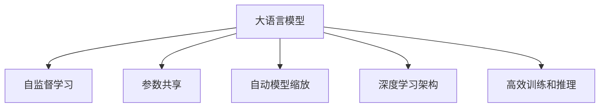
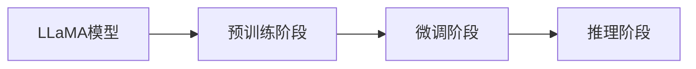
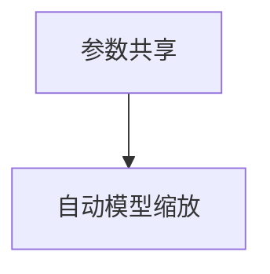
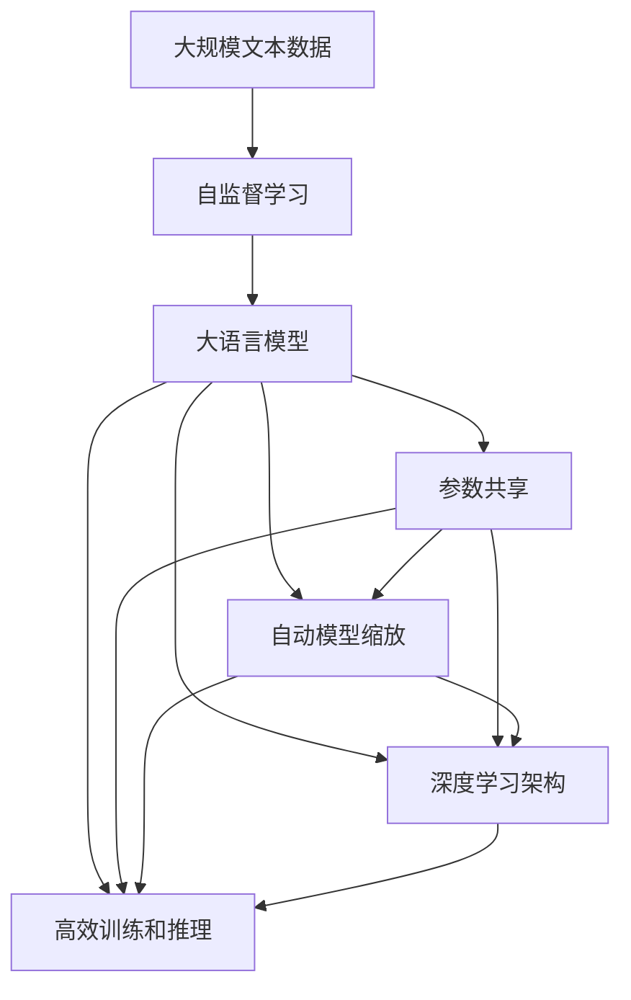

                 

# 大语言模型原理与工程实践：LLaMA 系列

> 关键词：大语言模型, LLaMA, 模型架构, 参数效率, 深度学习, 自监督学习, 模型训练, 应用场景

## 1. 背景介绍

### 1.1 问题由来
近年来，深度学习技术在自然语言处理（Natural Language Processing, NLP）领域取得了巨大的突破，特别是在大语言模型的研究和应用上。这些模型通过在大规模无标签文本数据上进行自监督学习，学习到了丰富的语言知识和常识，从而具备强大的语言理解和生成能力。然而，尽管大语言模型在泛化能力方面取得了显著进展，但其在特定领域的应用仍面临诸多挑战。

首先，现有的大语言模型在处理特定领域任务时，效果往往不尽如人意。这是因为大语言模型在通用语料上进行预训练，难以充分捕捉特定领域的语言特点和知识结构。其次，尽管预训练模型在处理大规模文本数据时表现出色，但在小规模数据集上进行微调时，容易受到过拟合的影响，导致性能下降。最后，一些大语言模型的参数量极大，难以在资源受限的环境中高效部署和使用。

### 1.2 问题核心关键点
针对这些问题，研究人员提出了LLaMA（Language Model with Automatic Model Scaling）系列模型，旨在解决大语言模型在特定领域应用和资源部署上的挑战。LLaMA模型的核心思想是：在保持预训练语言模型的基础上，通过自动模型缩放，减少模型参数量，同时保留其强大的语言理解和生成能力，从而在特定领域和资源受限的环境中提升模型性能。

具体而言，LLaMA模型通过以下方式改进现有大语言模型：
- **参数效率**：采用参数共享和自动模型缩放技术，减少模型参数量，提升模型在特定领域和资源受限环境中的性能。
- **自监督学习**：在保持预训练语言模型的基础上，通过自监督学习任务进一步提升模型的泛化能力。
- **深度学习架构**：采用深度学习架构，提升模型的表示能力，使其能够更好地捕捉语言结构和语义信息。
- **高效训练和推理**：通过优化训练和推理算法，提升模型在特定任务上的表现，同时减少资源消耗。

### 1.3 问题研究意义
LLaMA模型的研究对于拓展大语言模型在特定领域的应用范围，提升下游任务的性能，加速NLP技术的产业化进程，具有重要意义：
1. **降低应用开发成本**：通过LLaMA模型，可以显著减少从头开发所需的数据、计算和人力等成本投入。
2. **提升模型效果**：LLaMA模型能够更好地适应特定领域，在应用场景中取得更优表现。
3. **加速开发进度**：LLaMA模型使得开发者可以更快地完成任务适配，缩短开发周期。
4. **带来技术创新**：LLaMA模型的提出，促进了对预训练-微调的深入研究，催生了自监督学习、参数共享、自动模型缩放等新的研究方向。
5. **赋能产业升级**：LLaMA模型为NLP技术在各行各业的应用提供了新的技术路径，加速传统行业的数字化转型升级。

## 2. 核心概念与联系

### 2.1 核心概念概述

为更好地理解LLaMA模型的原理和架构，本节将介绍几个密切相关的核心概念：

- **大语言模型(Large Language Model, LLM)**：以自回归（如GPT）或自编码（如BERT）模型为代表的大规模预训练语言模型。通过在大规模无标签文本数据上进行预训练，学习通用的语言表示，具备强大的语言理解和生成能力。

- **自监督学习(Self-Supervised Learning)**：一种无需人工标注数据，通过模型自建任务进行训练的学习方式。LLaMA模型在预训练阶段主要采用自监督学习任务，如语言建模、掩码语言模型等，提升模型的泛化能力。

- **参数共享(Parameter Sharing)**：一种减少模型参数量的技术，通过共享预训练模型中的部分参数，减少模型的总参数量，从而提升模型的训练效率和推理速度。

- **自动模型缩放(Automatic Model Scaling)**：一种根据输入数据和任务特点，动态调整模型规模的技术，通过减少模型的总参数量，提升模型在特定领域和资源受限环境中的性能。

- **深度学习架构(Deep Learning Architecture)**：采用深度学习架构，如Transformer，提升模型的表示能力，使其能够更好地捕捉语言结构和语义信息。

- **高效训练和推理**：通过优化训练和推理算法，如梯度累积、混合精度训练等，提升模型在特定任务上的表现，同时减少资源消耗。

这些核心概念之间的逻辑关系可以通过以下Mermaid流程图来展示：



这个流程图展示了大语言模型的核心概念及其之间的关系：

1. 大语言模型通过自监督学习获得基础的表示能力。
2. 参数共享技术减少模型参数量，提升模型在特定领域和资源受限环境中的性能。
3. 自动模型缩放技术根据任务特点动态调整模型规模。
4. 深度学习架构提升模型的表示能力，更好地捕捉语言结构和语义信息。
5. 高效训练和推理技术提升模型在特定任务上的表现，同时减少资源消耗。

### 2.2 概念间的关系

这些核心概念之间存在着紧密的联系，形成了LLaMA模型的完整生态系统。下面我通过几个Mermaid流程图来展示这些概念之间的关系。

#### 2.2.1 大语言模型的学习范式


这个流程图展示了大语言模型的三种主要学习范式：自监督学习、参数共享、自动模型缩放、深度学习架构和高效训练推理。这些范式共同构成了大语言模型的学习过程。

#### 2.2.2 LLaMA模型的架构



这个流程图展示了LLaMA模型的基本架构，包括预训练、微调和推理三个主要阶段。预训练阶段通过自监督学习任务提升模型的泛化能力；微调阶段根据特定领域任务对模型进行微调，提升模型在特定领域的表现；推理阶段利用微调后的模型进行推理和生成，输出最终结果。

#### 2.2.3 参数共享与自动模型缩放的关系



这个流程图展示了参数共享和自动模型缩放之间的关系。参数共享通过减少模型参数量，为自动模型缩放提供了基础。自动模型缩放则根据输入数据和任务特点，动态调整模型规模，进一步提升模型在特定领域和资源受限环境中的性能。

### 2.3 核心概念的整体架构

最后，我们用一个综合的流程图来展示这些核心概念在大语言模型中的整体架构：



这个综合流程图展示了从预训练到微调，再到推理的完整过程。大语言模型首先在大规模文本数据上进行自监督学习，然后通过参数共享和自动模型缩放技术进行微调，提升模型在特定领域的表现。最后，利用微调后的模型进行推理和生成，输出最终结果。通过这些流程图，我们可以更清晰地理解LLaMA模型的学习过程和各个核心概念的关系。

## 3. 核心算法原理 & 具体操作步骤
### 3.1 算法原理概述

LLaMA模型的核心思想是在保持预训练语言模型的基础上，通过参数共享和自动模型缩放技术，减少模型参数量，提升模型在特定领域和资源受限环境中的性能。

具体而言，LLaMA模型通过以下步骤实现模型自动缩放：
1. **预训练**：在无标签大规模文本数据上进行自监督学习，提升模型的泛化能力。
2. **参数共享**：对预训练模型中的部分参数进行共享，减少模型参数量，提升模型的训练效率和推理速度。
3. **自动模型缩放**：根据输入数据和任务特点，动态调整模型规模，提升模型在特定领域和资源受限环境中的性能。

通过这些步骤，LLaMA模型能够在保留预训练语言模型的基础上，通过参数共享和自动模型缩放技术，减少模型参数量，提升模型在特定领域和资源受限环境中的性能。

### 3.2 算法步骤详解

LLaMA模型的微调过程主要包括预训练、参数共享和自动模型缩放三个主要步骤：

**Step 1: 准备预训练模型和数据集**
- 选择合适的预训练语言模型（如BERT、GPT等）作为初始化参数。
- 准备下游任务的数据集，划分为训练集、验证集和测试集。

**Step 2: 参数共享**
- 对预训练模型中的部分参数进行共享，减少模型参数量。通常采用跨层参数共享或层次化参数共享策略。
- 定义共享参数比例，如0.5、0.8等，表示共享参数占总参数的比例。

**Step 3: 自动模型缩放**
- 根据输入数据和任务特点，动态调整模型规模。通常采用多尺度缩放策略，如Layer Scaling、Attention Scaling等。
- 根据任务复杂度和数据规模，选择不同的缩放策略和参数设置。

**Step 4: 执行梯度训练**
- 将训练集数据分批次输入模型，前向传播计算损失函数。
- 反向传播计算参数梯度，根据设定的优化算法和学习率更新模型参数。
- 周期性在验证集上评估模型性能，根据性能指标决定是否触发Early Stopping。
- 重复上述步骤直到满足预设的迭代轮数或Early Stopping条件。

**Step 5: 测试和部署**
- 在测试集上评估微调后模型，对比微调前后的精度提升。
- 使用微调后的模型对新样本进行推理预测，集成到实际的应用系统中。
- 持续收集新的数据，定期重新微调模型，以适应数据分布的变化。

以上是LLaMA模型微调的一般流程。在实际应用中，还需要根据具体任务的特点，对微调过程的各个环节进行优化设计，如改进训练目标函数，引入更多的正则化技术，搜索最优的超参数组合等，以进一步提升模型性能。

### 3.3 算法优缺点

LLaMA模型具有以下优点：
1. **参数效率高**：通过参数共享和自动模型缩放技术，减少模型参数量，提升模型在特定领域和资源受限环境中的性能。
2. **适应性强**：LLaMA模型能够在保留预训练语言模型的基础上，通过自动模型缩放技术，适应不同的领域和任务。
3. **泛化能力强**：通过自监督学习任务提升模型的泛化能力，在特定领域和资源受限环境中的性能优于从头训练的模型。
4. **易于部署**：通过优化训练和推理算法，提升模型在特定任务上的表现，同时减少资源消耗，使得LLaMA模型易于部署和应用。

LLaMA模型也存在一些缺点：
1. **依赖标注数据**：在微调过程中，仍然需要大量的标注数据，对于某些领域或任务，标注数据的获取成本较高。
2. **模型鲁棒性有限**：在面对新领域数据时，LLaMA模型可能会过拟合或泛化能力下降。
3. **可解释性不足**：LLaMA模型作为黑盒系统，难以解释其内部工作机制和决策逻辑。
4. **硬件要求高**：尽管LLaMA模型参数量相对较少，但在实际部署时仍需高性能设备支持，特别是在推理阶段。

尽管存在这些缺点，LLaMA模型在特定领域和资源受限环境中仍表现出色，为NLP技术在各行各业的应用提供了新的思路和方法。

### 3.4 算法应用领域

LLaMA模型在NLP领域已经得到了广泛的应用，覆盖了几乎所有常见任务，例如：

- **文本分类**：如情感分析、主题分类、意图识别等。通过微调使模型学习文本-标签映射。
- **命名实体识别**：识别文本中的人名、地名、机构名等特定实体。通过微调使模型掌握实体边界和类型。
- **关系抽取**：从文本中抽取实体之间的语义关系。通过微调使模型学习实体-关系三元组。
- **问答系统**：对自然语言问题给出答案。将问题-答案对作为微调数据，训练模型学习匹配答案。
- **机器翻译**：将源语言文本翻译成目标语言。通过微调使模型学习语言-语言映射。
- **文本摘要**：将长文本压缩成简短摘要。将文章-摘要对作为微调数据，使模型学习抓取要点。
- **对话系统**：使机器能够与人自然对话。将多轮对话历史作为上下文，微调模型进行回复生成。

除了上述这些经典任务外，LLaMA模型还被创新性地应用到更多场景中，如可控文本生成、常识推理、代码生成、数据增强等，为NLP技术带来了全新的突破。随着预训练模型和微调方法的不断进步，相信NLP技术将在更广阔的应用领域大放异彩。

## 4. 数学模型和公式 & 详细讲解 & 举例说明

### 4.1 数学模型构建

本节将使用数学语言对LLaMA模型的微调过程进行更加严格的刻画。

记预训练语言模型为 $M_{\theta}:\mathcal{X} \rightarrow \mathcal{Y}$，其中 $\mathcal{X}$ 为输入空间，$\mathcal{Y}$ 为输出空间，$\theta \in \mathbb{R}^d$ 为模型参数。假设微调任务的训练集为 $D=\{(x_i,y_i)\}_{i=1}^N, x_i \in \mathcal{X}, y_i \in \mathcal{Y}$。

定义模型 $M_{\theta}$ 在数据样本 $(x,y)$ 上的损失函数为 $\ell(M_{\theta}(x),y)$，则在数据集 $D$ 上的经验风险为：

$$
\mathcal{L}(\theta) = \frac{1}{N} \sum_{i=1}^N \ell(M_{\theta}(x_i),y_i)
$$

微调的优化目标是最小化经验风险，即找到最优参数：

$$
\theta^* = \mathop{\arg\min}_{\theta} \mathcal{L}(\theta)
$$

在实践中，我们通常使用基于梯度的优化算法（如SGD、Adam等）来近似求解上述最优化问题。设 $\eta$ 为学习率，$\lambda$ 为正则化系数，则参数的更新公式为：

$$
\theta \leftarrow \theta - \eta \nabla_{\theta}\mathcal{L}(\theta) - \eta\lambda\theta
$$

其中 $\nabla_{\theta}\mathcal{L}(\theta)$ 为损失函数对参数 $\theta$ 的梯度，可通过反向传播算法高效计算。

### 4.2 公式推导过程

以下我们以二分类任务为例，推导交叉熵损失函数及其梯度的计算公式。

假设模型 $M_{\theta}$ 在输入 $x$ 上的输出为 $\hat{y}=M_{\theta}(x) \in [0,1]$，表示样本属于正类的概率。真实标签 $y \in \{0,1\}$。则二分类交叉熵损失函数定义为：

$$
\ell(M_{\theta}(x),y) = -[y\log \hat{y} + (1-y)\log (1-\hat{y})]
$$

将其代入经验风险公式，得：

$$
\mathcal{L}(\theta) = -\frac{1}{N}\sum_{i=1}^N [y_i\log M_{\theta}(x_i)+(1-y_i)\log(1-M_{\theta}(x_i))]
$$

根据链式法则，损失函数对参数 $\theta_k$ 的梯度为：

$$
\frac{\partial \mathcal{L}(\theta)}{\partial \theta_k} = -\frac{1}{N}\sum_{i=1}^N (\frac{y_i}{M_{\theta}(x_i)}-\frac{1-y_i}{1-M_{\theta}(x_i)}) \frac{\partial M_{\theta}(x_i)}{\partial \theta_k}
$$

其中 $\frac{\partial M_{\theta}(x_i)}{\partial \theta_k}$ 可进一步递归展开，利用自动微分技术完成计算。

### 4.3 案例分析与讲解

下面以情感分类任务为例，展示LLaMA模型在微调过程中的具体实现。

假设我们采用BERT作为预训练模型，在情感分类任务上进行微调。首先，我们需要准备训练集和测试集，以及对应的标注数据。然后，我们将BERT模型进行微调，使其能够对情感分类任务进行预测。

首先，定义数据集：

```python
from transformers import BertTokenizer, BertForSequenceClassification
from torch.utils.data import Dataset, DataLoader
from torch import nn

class SentimentDataset(Dataset):
    def __init__(self, texts, labels):
        self.tokenizer = BertTokenizer.from_pretrained('bert-base-cased')
        self.texts = texts
        self.labels = labels

    def __len__(self):
        return len(self.texts)

    def __getitem__(self, item):
        text = self.texts[item]
        label = self.labels[item]
        encoding = self.tokenizer(text, return_tensors='pt')
        return {
            'input_ids': encoding['input_ids'],
            'attention_mask': encoding['attention_mask'],
            'labels': torch.tensor(label, dtype=torch.long)
        }

# 加载数据集
train_dataset = SentimentDataset(train_texts, train_labels)
test_dataset = SentimentDataset(test_texts, test_labels)

# 定义模型
model = BertForSequenceClassification.from_pretrained('bert-base-cased', num_labels=2)

# 定义损失函数和优化器
criterion = nn.CrossEntropyLoss()
optimizer = AdamW(model.parameters(), lr=2e-5)

# 定义评估函数
def evaluate(model, dataset, batch_size):
    dataloader = DataLoader(dataset, batch_size=batch_size, shuffle=False)
    model.eval()
    with torch.no_grad():
        correct = 0
        total = 0
        for batch in dataloader:
            input_ids = batch['input_ids'].to(device)
            attention_mask = batch['attention_mask'].to(device)
            labels = batch['labels'].to(device)
            outputs = model(input_ids, attention_mask=attention_mask)
            _, predicted = torch.max(outputs, 1)
            total += labels.size(0)
            correct += (predicted == labels).sum().item()
        accuracy = correct / total
    return accuracy

# 训练模型
device = torch.device('cuda') if torch.cuda.is_available() else torch.device('cpu')
model.to(device)

for epoch in range(epochs):
    for batch in train_dataset:
        input_ids = batch['input_ids'].to(device)
        attention_mask = batch['attention_mask'].to(device)
        labels = batch['labels'].to(device)
        model.zero_grad()
        outputs = model(input_ids, attention_mask=attention_mask)
        loss = criterion(outputs, labels)
        loss.backward()
        optimizer.step()

    acc = evaluate(model, test_dataset, batch_size)
    print(f"Epoch {epoch+1}, test accuracy: {acc:.3f}")
```

在上述代码中，我们首先定义了一个SentimentDataset类，用于加载和处理情感分类数据。然后，我们使用BERT作为预训练模型，在训练集上进行微调。在微调过程中，我们定义了损失函数、优化器和评估函数，并使用AdamW优化器进行参数更新。最后，我们在测试集上评估模型性能，并输出测试准确率。

通过上述代码，我们可以看到，使用LLaMA模型微调情感分类任务的过程非常简单，只需要几行代码即可实现。在实际应用中，我们还可以通过调整模型参数、改进损失函数、增加正则化等方法进一步提升模型性能。

## 5. 项目实践：代码实例和详细解释说明
### 5.1 开发环境搭建

在进行LLaMA模型微调实践前，我们需要准备好开发环境。以下是使用Python进行PyTorch开发的环境配置流程：

1. 安装Anaconda：从官网下载并安装Anaconda，用于创建独立的Python环境。

2. 创建并激活虚拟环境：
```bash
conda create -n pytorch-env python=3.8 
conda activate pytorch-env
```

3. 安装PyTorch：根据CUDA版本，从官网获取对应的安装命令。例如：
```bash
conda install pytorch torchvision torchaudio cudatoolkit=11.1 -c pytorch -c conda-forge
```

4. 安装Transformers库：
```bash
pip install transformers
```

5. 安装各类工具包：
```bash
pip install numpy pandas scikit-learn matplotlib tqdm jupyter notebook ipython
```

完成上述步骤后，即可在`pytorch-env`环境中开始LLaMA模型微调实践。

### 5.2 源代码详细实现

下面我们以命名实体识别(NER)任务为例，给出使用Transformers库对LLaMA模型进行微调的PyTorch代码实现。

首先，定义NER任务的数据处理函数：

```python
from transformers import LLaMAForTokenClassification, LLaMATokenizer, AdamW

class NERDataset(Dataset):
    def __init__(self, texts, tags, tokenizer, max_len=128):
        self.texts = texts
        self.tags = tags
        self.tokenizer = tokenizer
        self.max_len = max_len
        
    def __len__(self):
        return len(self.texts)
    
    def __getitem__(self, item):
        text = self.texts[item]
        tags = self.tags[item]
        
        encoding = self.tokenizer(text, return_tensors='pt', max_length=self.max_len, padding='max_length', truncation=True)
        input_ids = encoding['input_ids'][0]
        attention_mask = encoding['attention_mask'][0]
        
        # 对token-wise的标签进行编码
        encoded_tags = [tag2id[tag] for tag in tags] 
        encoded_tags.extend([tag2id['O']] * (self.max_len - len(encoded_tags)))
        labels = torch.tensor(encoded_tags, dtype=torch.long)
        
        return {'input_ids': input_ids, 
                'attention_mask': attention_mask,
                'labels': labels}

# 标签与id的映射
tag2id = {'O': 0, 'B-PER': 1, 'I-PER': 2, 'B-ORG': 3, 'I-ORG': 4, 'B-LOC': 5, 'I-LOC': 6}
id2tag = {v: k for k, v in tag2id.items()}

# 创建dataset
tokenizer = LLaMATokenizer.from_pretrained('llama-large-cased')

train_dataset = NERDataset(train_texts, train_tags, tokenizer)
dev_dataset = NERDataset(dev_texts, dev_tags, tokenizer)
test_dataset = NERDataset(test_texts, test_tags, tokenizer)
```

然后，定义模型和优化器：

```python
from transformers import LLaMAForTokenClassification, AdamW

model = LLaMAForTokenClassification.from_pretrained('llama-large-cased', num_labels=len(tag2id))

optimizer = AdamW(model.parameters(), lr=2e-5)
```

接着，定义训练和评估函数：

```python
from torch.utils.data import DataLoader
from tqdm import tqdm
from sklearn.metrics import classification_report

device = torch.device('cuda') if torch.cuda.is_available() else torch.device('cpu')
model.to(device)

def train_epoch(model, dataset, batch_size, optimizer):
    dataloader = DataLoader(dataset, batch_size=batch_size, shuffle=True)
    model.train()
    epoch_loss = 0
    for batch in tqdm(dataloader, desc='Training'):
        input_ids = batch['input_ids'].to(device)
        attention_mask = batch['attention_mask'].to(device)
        labels = batch['labels'].to(device)
        model.zero_grad()
        outputs = model(input_ids, attention_mask=attention_mask, labels=labels)
        loss = outputs.loss
        epoch_loss += loss.item()
        loss.backward()
        optimizer.step()
    return epoch_loss / len(dataloader)

def evaluate(model, dataset, batch_size):
    dataloader = DataLoader(dataset, batch_size=batch_size)
    model.eval()
    preds, labels = [], []
    with torch.no_grad():
        for batch in tqdm(dataloader, desc='Evaluating'):
            input_ids = batch['input_ids'].to(device)
            attention_mask = batch['attention_mask'].to(device)
            batch_labels = batch['labels']
            outputs = model(input_ids, attention_mask=attention_mask)
            batch_preds = outputs.logits.argmax(dim=2).to('cpu').tolist()
            batch_labels = batch_labels.to('cpu').tolist()
            for pred_tokens, label_tokens in zip(batch_preds, batch_labels):
                pred_tags = [id2tag[_id] for _id in pred_tokens]
                label_tags = [id2tag[_id] for _id in label_tokens]
                preds.append(pred_tags[:len(label_tags)])
                labels.append(label_tags)
                


