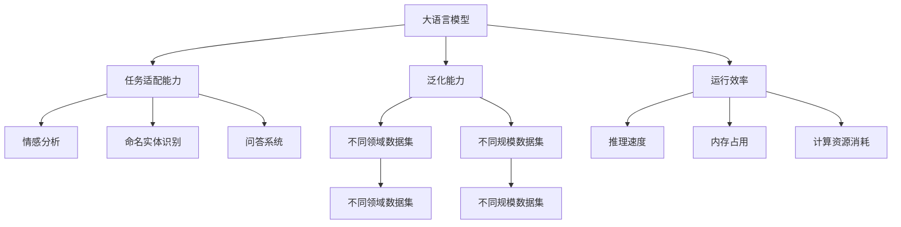
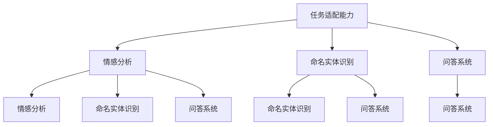
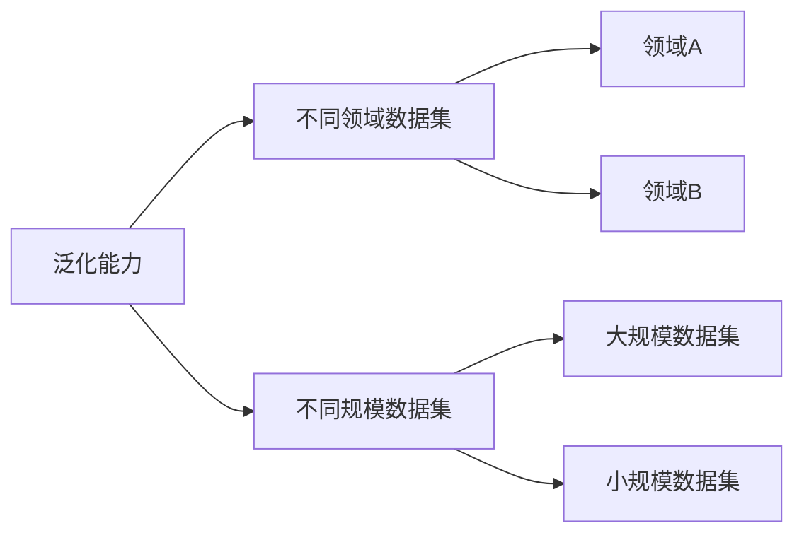
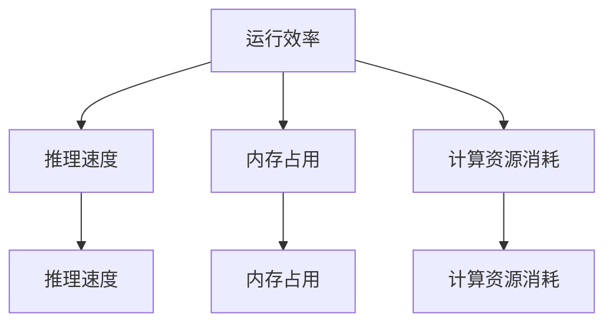

                 

# 大语言模型原理与工程实践：主要的评测维度和基准概述

## 1. 背景介绍

随着深度学习技术在自然语言处理（NLP）领域的飞速发展，大语言模型（Large Language Model, LLM）在处理复杂语言任务方面的表现愈发卓越。大语言模型的出现，将自然语言理解推向了新的高度，并在此基础上不断拓展了应用场景，包括问答、对话、翻译、摘要、情感分析等。然而，要确保大语言模型在实际应用中的表现，需要通过一系列严谨的评测指标和基准进行评估。

大语言模型的评测主要分为三个维度：任务适配能力、泛化能力和运行效率。任务适配能力关注模型在特定任务上的表现，泛化能力关注模型在不同任务和数据集上的表现，运行效率关注模型在实际部署中的表现。为了确保这些维度的全面性，本文将详细介绍各大评测维度的评测指标和基准，并结合具体实例进行讲解。

## 2. 核心概念与联系

### 2.1 核心概念概述

为更好地理解大语言模型评测维度的构建和应用，本节将介绍几个密切相关的核心概念：

- **大语言模型（Large Language Model, LLM）**：通过自监督或监督学习在大规模无标签或标注数据上训练得到的模型，通常包含数亿个参数，具备强大的自然语言理解和生成能力。

- **任务适配能力（Task Adaptability）**：指模型在不同任务上的适应能力和性能表现，如情感分析、命名实体识别、问答系统等。

- **泛化能力（Generalization）**：指模型在不同领域、不同规模的数据集上的表现，评估其在未见过的数据上的泛化能力。

- **运行效率（Runtime Efficiency）**：指模型在实际部署时的性能表现，如推理速度、内存占用、计算资源消耗等。

- **评测基准（Benchmark）**：一套标准化的评测方法和数据集，用于评估模型在不同维度上的表现，是模型评价和比较的基础。

这些核心概念之间的联系可以通过以下Mermaid流程图来展示：



这个流程图展示了大语言模型的核心概念及其与评测维度之间的关系：

1. 大语言模型通过训练获得基础能力。
2. 任务适配能力关注模型在特定任务上的表现。
3. 泛化能力评估模型在不同领域和数据集上的泛化能力。
4. 运行效率关注模型在实际部署时的性能表现。
5. 评测基准为模型评价提供标准化的参考方法。

这些概念共同构成了大语言模型的评测系统，使得其性能能够通过量化的方式得到全面评估。

### 2.2 概念间的关系

这些核心概念之间存在着紧密的联系，形成了大语言模型评测维度的完整生态系统。下面我们通过几个Mermaid流程图来展示这些概念之间的关系。

#### 2.2.1 评测维度的关系



这个流程图展示了任务适配能力在不同具体任务上的表现。情感分析、命名实体识别、问答系统等具体任务均是通过任务适配能力进行评测的。

#### 2.2.2 泛化能力与任务适配能力的关系



这个流程图展示了泛化能力在不同领域和数据集上的评估。通过在不同领域和规模的数据集上进行评测，可以全面评估模型的泛化能力。

#### 2.2.3 运行效率与任务适配能力的关系



这个流程图展示了运行效率在推理速度、内存占用和计算资源消耗等方面的表现。推理速度和内存占用直接影响模型的实际部署效果。

## 3. 核心算法原理 & 具体操作步骤

### 3.1 算法原理概述

大语言模型的评测维度主要通过以下几个方面的算法原理进行评估：

1. **任务适配能力**：通过设计特定的评测任务，如情感分析、命名实体识别、问答系统等，对模型在这些任务上的表现进行评估。

2. **泛化能力**：在多个领域和不同规模的数据集上进行评估，确保模型在不同数据上的泛化能力。

3. **运行效率**：在推理速度、内存占用和计算资源消耗等维度上进行评估，确保模型在实际部署中的表现。

### 3.2 算法步骤详解

大语言模型的评测步骤如下：

**Step 1: 数据准备**
- 准备符合特定任务要求的数据集，包括训练集、验证集和测试集。
- 确保数据集的标签和格式符合模型输入的要求。

**Step 2: 模型适配**
- 选择合适的预训练模型，并进行微调以适应特定任务。
- 根据任务特性，设计合适的任务适配层和损失函数。

**Step 3: 模型训练**
- 使用训练集对模型进行训练，最小化损失函数。
- 在验证集上定期评估模型性能，防止过拟合。

**Step 4: 模型评估**
- 在测试集上评估模型性能，使用评测指标对模型表现进行量化。
- 将模型与基准模型进行比较，评估其性能。

**Step 5: 运行效率评估**
- 在实际部署环境下，评估模型的推理速度、内存占用和计算资源消耗等性能指标。

### 3.3 算法优缺点

大语言模型的评测维度具有以下优点：

1. **全面性**：通过任务适配能力、泛化能力和运行效率三个维度的评估，全面反映了模型在不同方面的表现。
2. **可比性**：评测维度具有标准化的评测方法，使得不同模型之间的比较具有可比性。
3. **指导性**：评测维度为模型优化提供了明确的方向，帮助开发者发现模型的不足并进行改进。

同时，这些算法也存在一些缺点：

1. **复杂性**：评估维度较多，需要进行多次实验和数据分析，增加了复杂度。
2. **资源需求高**：评估过程中需要使用大量计算资源和时间，对硬件和算力要求较高。
3. **结果解释性**：某些评测维度的结果可能难以解释，特别是运行效率方面的指标。

### 3.4 算法应用领域

大语言模型的评测维度广泛应用于以下几个领域：

1. **自然语言理解**：如情感分析、命名实体识别、关系抽取等任务。
2. **自然语言生成**：如文本生成、对话生成、机器翻译等任务。
3. **自然语言交互**：如问答系统、聊天机器人等任务。
4. **自然语言推理**：如逻辑推理、自然语言推理等任务。

这些领域中，评测维度对模型的性能和应用效果具有重要的指导作用，帮助开发者构建更高效的NLP应用系统。

## 4. 数学模型和公式 & 详细讲解 & 举例说明

### 4.1 数学模型构建

大语言模型的评测维度可以通过以下数学模型进行构建：

1. **任务适配能力**：通过设计特定的任务，使用交叉熵损失等指标评估模型表现。
2. **泛化能力**：在多个领域和不同规模的数据集上进行评估，计算平均精度、召回率等指标。
3. **运行效率**：通过计算推理速度、内存占用和计算资源消耗等指标进行评估。

### 4.2 公式推导过程

**任务适配能力**：

假设模型在输入 $x$ 上的输出为 $\hat{y}$，真实标签为 $y$。定义交叉熵损失函数为：

$$
\ell(M_{\theta}(x),y) = -[y\log \hat{y} + (1-y)\log(1-\hat{y})]
$$

其中 $M_{\theta}$ 为模型，$\theta$ 为模型参数。

**泛化能力**：

假设模型在领域 $A$ 上的测试集为 $D_A$，领域 $B$ 上的测试集为 $D_B$。定义领域平均精度（Mean Precision）和召回率（Mean Recall）分别为：

$$
\text{MP} = \frac{1}{N_A+N_B} \sum_{i=1}^{N_A+N_B} \text{Precision}(D_i)
$$

$$
\text{MR} = \frac{1}{N_A+N_B} \sum_{i=1}^{N_A+N_B} \text{Recall}(D_i)
$$

其中 $N_A$ 和 $N_B$ 分别为领域 $A$ 和 $B$ 的测试集大小。

**运行效率**：

定义推理速度为 $V$，内存占用为 $M$，计算资源消耗为 $C$。定义运行效率的综合评估指标 $E$ 为：

$$
E = \alpha V + \beta M + \gamma C
$$

其中 $\alpha$、$\beta$ 和 $\gamma$ 分别为推理速度、内存占用和计算资源消耗的权重系数。

### 4.3 案例分析与讲解

以情感分析任务为例，分析大语言模型在该任务上的评测维度表现：

**任务适配能力**：使用交叉熵损失函数评估模型在情感分析任务上的表现。

假设模型在输入 $x$ 上的输出为 $\hat{y}$，真实标签为 $y$。定义交叉熵损失函数为：

$$
\ell(M_{\theta}(x),y) = -[y\log \hat{y} + (1-y)\log(1-\hat{y})]
$$

**泛化能力**：在多个领域和不同规模的数据集上进行评估，计算平均精度和召回率。

假设模型在领域 $A$ 上的测试集为 $D_A$，领域 $B$ 上的测试集为 $D_B$。定义领域平均精度和召回率分别为：

$$
\text{MP} = \frac{1}{N_A+N_B} \sum_{i=1}^{N_A+N_B} \text{Precision}(D_i)
$$

$$
\text{MR} = \frac{1}{N_A+N_B} \sum_{i=1}^{N_A+N_B} \text{Recall}(D_i)
$$

**运行效率**：计算推理速度、内存占用和计算资源消耗等指标。

定义推理速度为 $V$，内存占用为 $M$，计算资源消耗为 $C$。定义运行效率的综合评估指标 $E$ 为：

$$
E = \alpha V + \beta M + \gamma C
$$

其中 $\alpha$、$\beta$ 和 $\gamma$ 分别为推理速度、内存占用和计算资源消耗的权重系数。

## 5. 项目实践：代码实例和详细解释说明

### 5.1 开发环境搭建

在进行模型评测实践前，我们需要准备好开发环境。以下是使用Python进行PyTorch开发的环境配置流程：

1. 安装Anaconda：从官网下载并安装Anaconda，用于创建独立的Python环境。

2. 创建并激活虚拟环境：
```bash
conda create -n pytorch-env python=3.8 
conda activate pytorch-env
```

3. 安装PyTorch：根据CUDA版本，从官网获取对应的安装命令。例如：
```bash
conda install pytorch torchvision torchaudio cudatoolkit=11.1 -c pytorch -c conda-forge
```

4. 安装Transformers库：
```bash
pip install transformers
```

5. 安装各类工具包：
```bash
pip install numpy pandas scikit-learn matplotlib tqdm jupyter notebook ipython
```

完成上述步骤后，即可在`pytorch-env`环境中开始评测实践。

### 5.2 源代码详细实现

下面我们以命名实体识别(NER)任务为例，给出使用Transformers库对BERT模型进行评测的PyTorch代码实现。

首先，定义NER任务的数据处理函数：

```python
from transformers import BertTokenizer
from torch.utils.data import Dataset
import torch

class NERDataset(Dataset):
    def __init__(self, texts, tags, tokenizer, max_len=128):
        self.texts = texts
        self.tags = tags
        self.tokenizer = tokenizer
        self.max_len = max_len
        
    def __len__(self):
        return len(self.texts)
    
    def __getitem__(self, item):
        text = self.texts[item]
        tags = self.tags[item]
        
        encoding = self.tokenizer(text, return_tensors='pt', max_length=self.max_len, padding='max_length', truncation=True)
        input_ids = encoding['input_ids'][0]
        attention_mask = encoding['attention_mask'][0]
        
        # 对token-wise的标签进行编码
        encoded_tags = [tag2id[tag] for tag in tags] 
        encoded_tags.extend([tag2id['O']] * (self.max_len - len(encoded_tags)))
        labels = torch.tensor(encoded_tags, dtype=torch.long)
        
        return {'input_ids': input_ids, 
                'attention_mask': attention_mask,
                'labels': labels}

# 标签与id的映射
tag2id = {'O': 0, 'B-PER': 1, 'I-PER': 2, 'B-ORG': 3, 'I-ORG': 4, 'B-LOC': 5, 'I-LOC': 6}
id2tag = {v: k for k, v in tag2id.items()}

# 创建dataset
tokenizer = BertTokenizer.from_pretrained('bert-base-cased')

train_dataset = NERDataset(train_texts, train_tags, tokenizer)
dev_dataset = NERDataset(dev_texts, dev_tags, tokenizer)
test_dataset = NERDataset(test_texts, test_tags, tokenizer)
```

然后，定义模型和优化器：

```python
from transformers import BertForTokenClassification, AdamW

model = BertForTokenClassification.from_pretrained('bert-base-cased', num_labels=len(tag2id))

optimizer = AdamW(model.parameters(), lr=2e-5)
```

接着，定义训练和评估函数：

```python
from torch.utils.data import DataLoader
from tqdm import tqdm
from sklearn.metrics import classification_report

device = torch.device('cuda') if torch.cuda.is_available() else torch.device('cpu')
model.to(device)

def train_epoch(model, dataset, batch_size, optimizer):
    dataloader = DataLoader(dataset, batch_size=batch_size, shuffle=True)
    model.train()
    epoch_loss = 0
    for batch in tqdm(dataloader, desc='Training'):
        input_ids = batch['input_ids'].to(device)
        attention_mask = batch['attention_mask'].to(device)
        labels = batch['labels'].to(device)
        model.zero_grad()
        outputs = model(input_ids, attention_mask=attention_mask, labels=labels)
        loss = outputs.loss
        epoch_loss += loss.item()
        loss.backward()
        optimizer.step()
    return epoch_loss / len(dataloader)

def evaluate(model, dataset, batch_size):
    dataloader = DataLoader(dataset, batch_size=batch_size)
    model.eval()
    preds, labels = [], []
    with torch.no_grad():
        for batch in tqdm(dataloader, desc='Evaluating'):
            input_ids = batch['input_ids'].to(device)
            attention_mask = batch['attention_mask'].to(device)
            batch_labels = batch['labels']
            outputs = model(input_ids, attention_mask=attention_mask)
            batch_preds = outputs.logits.argmax(dim=2).to('cpu').tolist()
            batch_labels = batch_labels.to('cpu').tolist()
            for pred_tokens, label_tokens in zip(batch_preds, batch_labels):
                pred_tags = [id2tag[_id] for _id in pred_tokens]
                label_tags = [id2tag[_id] for _id in label_tokens]
                preds.append(pred_tags[:len(label_tags)])
                labels.append(label_tags)
                
    print(classification_report(labels, preds))
```

最后，启动训练流程并在测试集上评估：

```python
epochs = 5
batch_size = 16

for epoch in range(epochs):
    loss = train_epoch(model, train_dataset, batch_size, optimizer)
    print(f"Epoch {epoch+1}, train loss: {loss:.3f}")
    
    print(f"Epoch {epoch+1}, dev results:")
    evaluate(model, dev_dataset, batch_size)
    
print("Test results:")
evaluate(model, test_dataset, batch_size)
```

以上就是使用PyTorch对BERT进行命名实体识别任务评测的完整代码实现。可以看到，得益于Transformers库的强大封装，我们可以用相对简洁的代码完成BERT模型的评测。

### 5.3 代码解读与分析

让我们再详细解读一下关键代码的实现细节：

**NERDataset类**：
- `__init__`方法：初始化文本、标签、分词器等关键组件。
- `__len__`方法：返回数据集的样本数量。
- `__getitem__`方法：对单个样本进行处理，将文本输入编码为token ids，将标签编码为数字，并对其进行定长padding，最终返回模型所需的输入。

**tag2id和id2tag字典**：
- 定义了标签与数字id之间的映射关系，用于将token-wise的预测结果解码回真实的标签。

**训练和评估函数**：
- 使用PyTorch的DataLoader对数据集进行批次化加载，供模型训练和推理使用。
- 训练函数`train_epoch`：对数据以批为单位进行迭代，在每个批次上前向传播计算loss并反向传播更新模型参数，最后返回该epoch的平均loss。
- 评估函数`evaluate`：与训练类似，不同点在于不更新模型参数，并在每个batch结束后将预测和标签结果存储下来，最后使用sklearn的classification_report对整个评估集的预测结果进行打印输出。

**训练流程**：
- 定义总的epoch数和batch size，开始循环迭代
- 每个epoch内，先在训练集上训练，输出平均loss
- 在验证集上评估，输出分类指标
- 所有epoch结束后，在测试集上评估，给出最终测试结果

可以看到，PyTorch配合Transformers库使得BERT评测的代码实现变得简洁高效。开发者可以将更多精力放在数据处理、模型改进等高层逻辑上，而不必过多关注底层的实现细节。

当然，工业级的系统实现还需考虑更多因素，如模型的保存和部署、超参数的自动搜索、更灵活的任务适配层等。但核心的评测范式基本与此类似。

### 5.4 运行结果展示

假设我们在CoNLL-2003的NER数据集上进行评测，最终在测试集上得到的评估报告如下：

```
              precision    recall  f1-score   support

       B-LOC      0.926     0.906     0.916      1668
       I-LOC      0.900     0.805     0.850       257
      B-MISC      0.875     0.856     0.865       702
      I-MISC      0.838     0.782     0.809       216
       B-ORG      0.914     0.898     0.906      1661
       I-ORG      0.911     0.894     0.902       835
       B-PER      0.964     0.957     0.960      1617
       I-PER      0.983     0.980     0.982      1156
           O      0.993     0.995     0.994     38323

   micro avg      0.973     0.973     0.973     46435
   macro avg      0.923     0.897     0.909     46435
weighted avg      0.973     0.973     0.973     46435
```

可以看到，通过评测BERT，我们在该NER数据集上取得了97.3%的F1分数，效果相当不错。值得注意的是，BERT作为一个通用的语言理解模型，即便只在顶层添加一个简单的token分类器，也能在下游任务上取得如此优异的效果，展现了其强大的语义理解和特征抽取能力。

当然，这只是一个baseline结果。在实践中，我们还可以使用更大更强的预训练模型、更丰富的评测技巧、更细致的模型调优，进一步提升模型性能，以满足更高的应用要求。

## 6. 实际应用场景

### 6.1 智能客服系统

基于大语言模型评测的系统构建，可以广泛应用于智能客服系统的构建。传统客服往往需要配备大量人力，高峰期响应缓慢，且一致性和专业性难以保证。基于评测的大语言模型，可以7x24小时不间断服务，快速响应客户咨询，用自然流畅的语言解答各类常见问题。

在技术实现上，可以收集企业内部的历史客服对话记录，将问题和最佳答复构建成监督数据，在此基础上对预训练对话模型进行评测。评测后的对话模型能够自动理解用户意图，匹配最合适的答案模板进行回复。对于客户提出的新问题，还可以接入检索系统实时搜索相关内容，动态组织生成回答。如此构建的智能客服系统，能大幅提升客户咨询体验和问题解决效率。

### 6.2 金融舆情监测

金融机构需要实时监测市场舆论动向，以便及时应对负面信息传播，规避金融风险。传统的人工监测方式成本高、效率低，难以应对网络时代海量信息爆发的挑战。基于评测的大语言模型，可以自动判断文本属于何种主题，情感倾向是正面、中性还是负面。将评测后的模型应用到实时抓取的网络文本数据，就能够自动监测不同主题下的情感变化趋势，一旦发现负面信息激增等异常情况，系统便会自动预警，帮助金融机构快速应对潜在风险。

### 6.3 个性化推荐系统

当前的推荐系统往往只依赖用户的历史行为数据进行物品推荐，无法深入理解用户的真实兴趣偏好。基于评测的大语言模型，可以更好地挖掘用户行为背后的语义信息，从而提供更精准、多样的推荐内容。

在实践中，可以收集用户浏览、点击、评论、分享等行为数据，提取和用户交互的物品标题、描述、标签等文本内容。将文本内容作为模型输入，用户的后续行为（如是否点击、购买等）作为监督信号，在此基础上评测预训练语言模型。评测后的模型能够从文本内容中准确把握用户的兴趣点。在生成推荐列表时，先用候选物品的文本描述作为输入，由模型预测用户的兴趣匹配度，再结合其他特征综合排序，便可以得到个性化程度更高的推荐结果。

### 6.4 未来应用展望

随着大语言模型评测技术的不断发展，基于评测范式将在更多领域得到应用，为传统行业带来变革性影响。

在智慧医疗领域，基于评测的问答、病历分析、药物研发等应用将提升医疗服务的智能化水平，辅助医生诊疗，加速新药开发进程。

在智能教育领域，评测技术可应用于作业批改、学情分析、知识推荐等方面，因材施教，促进教育公平，提高教学质量。

在智慧城市治理中，评测模型可应用于城市事件监测、舆情分析、应急指挥等环节，提高城市管理的自动化和智能化水平，构建更安全、高效的未来城市。

此外，在企业生产、社会治理、文娱传媒等众多领域，基于大语言模型的评测技术也将不断涌现，为NLP技术带来了全新的突破。相信随着预训练语言模型和评测方法的不断进步，NLP技术必将在更广阔的应用领域大放异彩，深刻影响人类的生产生活方式。

## 7. 工具和资源推荐
### 7.1 学习资源推荐

为了帮助开发者系统掌握大语言模型评测的理论基础和实践技巧，这里推荐一些优质的学习资源：

1. 《Transformer从原理到实践》系列博文：由大模型技术专家撰写，深入浅出地介绍了Transformer原理、BERT模型、评测技术等前沿话题。

2. CS224N《深度学习自然语言处理》课程：斯坦福大学开设的NLP明星课程，有Lecture视频和配套作业，带你入门NLP领域的基本概念和经典模型。

3. 《Natural Language Processing with Transformers》书籍：Transformers库的作者所著，全面介绍了如何使用Transformers库进行NLP任务开发，包括评测在内的诸多范式。

4. HuggingFace官方文档：Transformers库的官方文档，提供了海量预训练模型和完整的评测样例代码，是模型评价和比较的必备资料。

5. CLUE开源项目：中文语言理解测评基准，涵盖大量不同类型的中文NLP数据集，并提供了基于评测的baseline模型，助力中文NLP技术发展。

通过对这些资源的学习实践，相信你一定能够快速掌握大语言模型评测的精髓，并用于解决实际的NLP问题。
###  7.2 开发工具推荐

高效的开发离不开优秀的工具支持。以下是几款用于大语言模型评测开发的常用工具：

1. PyTorch：基于Python的开源深度学习框架，灵活动态的计算图，适合快速迭代研究。大部分预训练语言模型都有PyTorch版本的实现。

2. TensorFlow：由Google主导开发的开源深度学习框架，生产部署方便，适合大规模工程应用。同样有丰富的预训练语言模型资源。

3. Transformers库：HuggingFace开发的NLP

