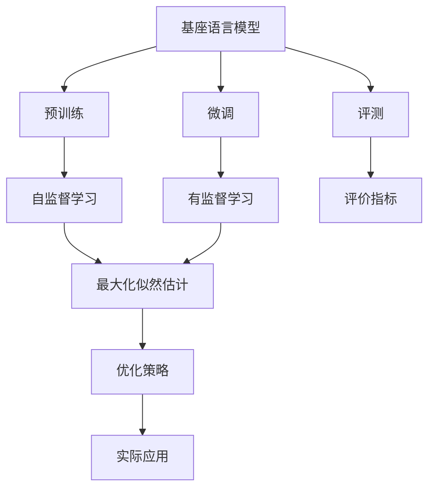
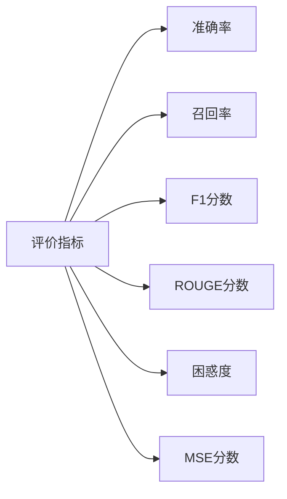
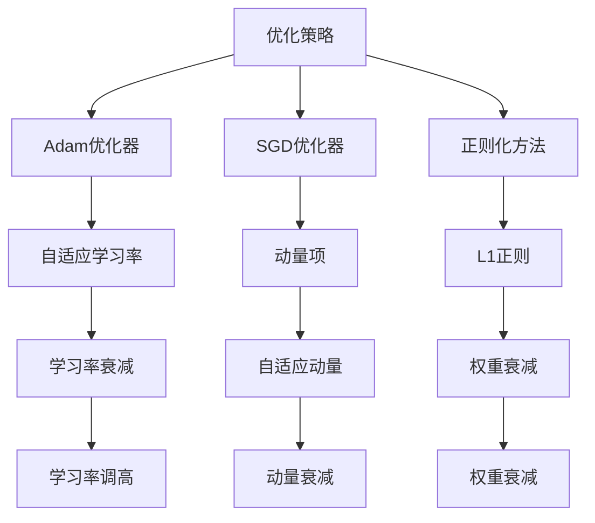

                 

# 大语言模型原理与工程实践：基座语言模型的评测

> 关键词：
> 
> - 基座语言模型
> - 评价指标
> - 训练方法
> - 优化策略
> - 实际应用
> - 优化技巧

## 1. 背景介绍

### 1.1 问题由来
随着人工智能技术在自然语言处理(NLP)领域的迅猛发展，越来越多的基座语言模型（Baseline Language Models, BLMs）被研发出来，并应用于各种NLP任务中。然而，由于缺乏一套统一且可对比的评测标准，不同基座模型的性能往往难以直接比较，这给模型的选择和应用带来了困难。为解决这一问题，学术界和工业界提出了一系列评价指标和评测方法，以便更加客观、全面地评估基座语言模型的性能。

### 1.2 问题核心关键点
基座语言模型的评测涉及多个关键点，包括选择合适的评价指标、建立统一的评测标准、以及确保评测方法的公平性和可重复性。核心在于如何在不同的模型、任务和数据集上公平地对比基座语言模型的性能，从而指导模型选择和应用。

### 1.3 问题研究意义
基座语言模型的评测不仅有助于模型选择和应用，还能推动模型研发和优化，提升NLP技术的整体水平。通过系统的评测，开发者可以更清楚地了解不同模型的优势和局限，为实际应用场景选择合适的模型；同时，模型研发者能够针对评测结果进行模型优化，提升模型性能。此外，标准化的评测方法也为学术界和工业界的合作研究提供了基础，促进了NLP技术的不断进步。

## 2. 核心概念与联系

### 2.1 核心概念概述

为更好地理解基座语言模型的评测，本节将介绍几个关键概念：

- **基座语言模型 (BLM)**：指在无监督预训练过程中建立的语言模型，如GPT、BERT、RoBERTa等，具备强大的语言理解和生成能力，是进行下游任务微调的基础。

- **评价指标 (Metrics)**：用于评估基座模型性能的指标，包括但不限于准确率、召回率、F1分数、ROUGE分数等。

- **训练方法 (Training Methods)**：基座模型训练的算法，如基于语言模型的最大似然估计、自监督预训练等。

- **优化策略 (Optimization Strategies)**：在基座模型训练中采用的优化算法和技术，如Adam、SGD、正则化等。

- **实际应用 (Applications)**：基座语言模型在NLP任务中的实际应用，如文本分类、情感分析、机器翻译等。

这些概念之间的逻辑关系可以通过以下Mermaid流程图来展示：



这个流程图展示了基座语言模型从预训练到评测的完整流程，各组件之间的联系和作用。

### 2.2 概念间的关系

这些关键概念之间存在紧密的联系，共同构成了基座语言模型的评测框架。下面通过几个Mermaid流程图来展示这些概念之间的关系。

#### 2.2.1 基座模型的学习范式


这个流程图展示了基座语言模型的三种主要学习范式：预训练、微调和评测。预训练主要采用自监督学习方法，而微调则是有监督学习的过程。评测则是基于评价指标对模型进行综合评价，以判断其性能是否满足实际应用要求。

#### 2.2.2 评价指标的分类



这个流程图展示了评价指标的基本分类，包括准确率、召回率、F1分数、ROUGE分数、困惑度和MSE分数等，不同指标适用于不同的任务和应用场景。

#### 2.2.3 优化策略的实现



这个流程图展示了优化策略的主要实现方式，包括Adam优化器、SGD优化器、正则化方法等，这些策略共同作用于模型训练过程，优化模型性能。

## 3. 核心算法原理 & 具体操作步骤
### 3.1 算法原理概述

基座语言模型的评测，本质上是基于训练集和测试集的模型性能评估。核心思想是通过计算模型在不同任务上的评价指标，来衡量其性能和泛化能力。具体而言，评测流程包括以下几个关键步骤：

1. **数据准备**：准备训练集和测试集，确保数据集的质量和代表性。
2. **模型加载**：加载预训练的基座语言模型，并选择合适的任务适配层。
3. **微调训练**：在训练集上对模型进行微调，确保模型能够适应特定任务。
4. **评测评估**：在测试集上对微调后的模型进行评估，计算评价指标。
5. **结果分析**：分析模型在不同任务和数据集上的表现，提出改进建议。

### 3.2 算法步骤详解

**Step 1: 数据准备**
- 收集和预处理训练集和测试集，确保数据集的质量和代表性。训练集用于微调模型，测试集用于评估模型性能。
- 数据集应包含多个类别的标注样本，确保模型能够学习到多样化的语言表达和模式。

**Step 2: 模型加载**
- 加载预训练的基座语言模型，并进行适当的任务适配。任务适配层通常包括分类头、回归头或生成头等，根据具体任务选择合适类型。
- 对于分类任务，通常使用线性分类器；对于回归任务，使用线性回归器；对于生成任务，使用语言模型生成器。

**Step 3: 微调训练**
- 在训练集上对模型进行微调，确保模型能够适应特定任务。微调过程使用小批量随机梯度下降法（SGD）或Adam优化器进行参数更新，同时应用正则化技术防止过拟合。
- 微调过程中，学习率应适当调整，避免过大或过小，以免破坏预训练权重或收敛过慢。

**Step 4: 评测评估**
- 在测试集上对微调后的模型进行评估，计算评价指标如准确率、召回率、F1分数、ROUGE分数等。
- 对于多分类任务，使用混淆矩阵、精确召回曲线（PR曲线）等评估指标；对于生成任务，使用BLEU分数、ROUGE分数等评估指标。
- 对于多模态任务，如文本-图像融合任务，使用多模态评估指标如F-score、CIDEr等。

**Step 5: 结果分析**
- 分析模型在不同任务和数据集上的表现，评估其泛化能力和实际应用效果。
- 对比不同基座语言模型的性能，找出优劣和差异原因。
- 根据评测结果，提出改进模型的方法和策略。

### 3.3 算法优缺点

基座语言模型的评测方法具有以下优点：
1. 系统全面：通过多种评价指标的组合，可以全面衡量模型的性能。
2. 可重复性高：评测方法标准化，可重复进行，便于比较不同模型的性能。
3. 应用广泛：适用于各种NLP任务，如文本分类、情感分析、机器翻译等。

同时，也存在一些缺点：
1. 数据依赖性强：评测结果很大程度上依赖于数据集的质量和分布，不同数据集可能导致不同结果。
2. 计算资源消耗大：需要较大的计算资源和时间进行模型训练和评测。
3. 结果解释性差：某些评价指标难以直观解释，可能需要结合实际应用场景进行解读。

### 3.4 算法应用领域

基座语言模型的评测方法已经广泛应用于各种NLP任务中，如：

- 文本分类：如情感分析、主题分类、意图识别等。
- 命名实体识别：识别文本中的人名、地名、机构名等特定实体。
- 关系抽取：从文本中抽取实体之间的语义关系。
- 问答系统：对自然语言问题给出答案。
- 机器翻译：将源语言文本翻译成目标语言。
- 文本摘要：将长文本压缩成简短摘要。
- 对话系统：使机器能够与人自然对话。
- 多模态任务：如文本-图像融合任务。

除了这些经典任务外，基座语言模型的评测方法也在更多新兴任务中得到应用，如可控文本生成、常识推理、代码生成等，为NLP技术的发展提供了新的思路和方向。

## 4. 数学模型和公式 & 详细讲解 & 举例说明

### 4.1 数学模型构建

基座语言模型的评测通常使用评价指标来衡量模型性能。以下以文本分类任务为例，介绍几种常见的评价指标及其计算方法。

假设模型在测试集上的预测标签为 $\hat{y}$，真实标签为 $y$，共 $N$ 个样本。分类任务常见的评价指标包括准确率、召回率和F1分数，其计算公式如下：

$$
\text{准确率} = \frac{TP + TN}{TP + TN + FP + FN}
$$

$$
\text{召回率} = \frac{TP}{TP + FN}
$$

$$
\text{F1分数} = 2 \times \frac{\text{准确率} \times \text{召回率}}{\text{准确率} + \text{召回率}}
$$

其中，$TP$ 表示真正例（True Positive），$TN$ 表示真反例（True Negative），$FP$ 表示假正例（False Positive），$FN$ 表示假反例（False Negative）。

### 4.2 公式推导过程

以文本分类任务为例，假设模型在 $N$ 个样本上的预测和真实标签分别为 $\hat{y} = (\hat{y}_1, \hat{y}_2, \ldots, \hat{y}_N)$ 和 $y = (y_1, y_2, \ldots, y_N)$。则计算准确率、召回率和F1分数的公式推导如下：

$$
\text{准确率} = \frac{1}{N} \sum_{i=1}^N \mathbb{I}(\hat{y}_i = y_i)
$$

$$
\text{召回率} = \frac{1}{N} \sum_{i=1}^N \mathbb{I}(\hat{y}_i = 1 \land y_i = 1)
$$

$$
\text{F1分数} = 2 \times \frac{\text{准确率} \times \text{召回率}}{\text{准确率} + \text{召回率}}
$$

其中，$\mathbb{I}$ 表示示性函数，当事件成立时返回1，否则返回0。

### 4.3 案例分析与讲解

假设我们有一个文本分类任务，模型在测试集上的预测和真实标签如下：

| 样本ID | 预测标签 | 真实标签 |
| ------ | -------- | -------- |
| 1      | 垃圾邮件 | 正常邮件 |
| 2      | 正常邮件 | 垃圾邮件 |
| 3      | 正常邮件 | 正常邮件 |
| 4      | 垃圾邮件 | 垃圾邮件 |
| 5      | 正常邮件 | 正常邮件 |

根据上述数据，我们可以计算模型的准确率、召回率和F1分数：

- 准确率：$\frac{3+1}{5} = 0.8$
- 召回率：$\frac{1+3}{5} = 0.8$
- F1分数：$\frac{2 \times 0.8 \times 0.8}{0.8 + 0.8} = 0.8$

可以看到，模型的准确率、召回率和F1分数均为0.8，表示模型在测试集上表现良好。

## 5. 项目实践：代码实例和详细解释说明

### 5.1 开发环境搭建

在进行基座语言模型的评测实践前，我们需要准备好开发环境。以下是使用Python进行PyTorch开发的环境配置流程：

1. 安装Anaconda：从官网下载并安装Anaconda，用于创建独立的Python环境。

2. 创建并激活虚拟环境：
```bash
conda create -n pytorch-env python=3.8 
conda activate pytorch-env
```

3. 安装PyTorch：根据CUDA版本，从官网获取对应的安装命令。例如：
```bash
conda install pytorch torchvision torchaudio cudatoolkit=11.1 -c pytorch -c conda-forge
```

4. 安装各类工具包：
```bash
pip install numpy pandas scikit-learn matplotlib tqdm jupyter notebook ipython
```

完成上述步骤后，即可在`pytorch-env`环境中开始基座语言模型的评测实践。

### 5.2 源代码详细实现

下面我们以文本分类任务为例，给出使用Transformers库对BERT模型进行评测的PyTorch代码实现。

首先，定义评价指标函数：

```python
from sklearn.metrics import accuracy_score, recall_score, f1_score

def compute_metrics(y_true, y_pred):
    accuracy = accuracy_score(y_true, y_pred)
    recall = recall_score(y_true, y_pred, average='micro')
    f1 = f1_score(y_true, y_pred, average='micro')
    return {'accuracy': accuracy, 'recall': recall, 'f1': f1}
```

然后，加载数据集并进行预处理：

```python
from transformers import BertTokenizer, BertForSequenceClassification
from datasets import load_dataset
import torch

tokenizer = BertTokenizer.from_pretrained('bert-base-uncased')
dataset = load_dataset('imdb', split='train')
train_dataset = dataset['train'].map(lambda x: tokenizer(x['text'], padding='max_length', truncation=True))
train_dataset.set_format('torch', columns=['input_ids', 'attention_mask', 'label'])
```

接着，加载模型并进行微调：

```python
from transformers import AdamW

model = BertForSequenceClassification.from_pretrained('bert-base-uncased', num_labels=2)
optimizer = AdamW(model.parameters(), lr=1e-5)
device = torch.device('cuda') if torch.cuda.is_available() else torch.device('cpu')
model.to(device)

for epoch in range(3):
    model.train()
    for batch in train_dataset:
        inputs = {key: batch[key].to(device) for key in ['input_ids', 'attention_mask']}
        labels = batch['label'].to(device)
        outputs = model(**inputs, labels=labels)
        loss = outputs.loss
        optimizer.zero_grad()
        loss.backward()
        optimizer.step()
```

最后，在测试集上评估模型性能：

```python
test_dataset = load_dataset('imdb', split='test')
test_dataset = test_dataset.map(lambda x: tokenizer(x['text'], padding='max_length', truncation=True))
test_dataset.set_format('torch', columns=['input_ids', 'attention_mask', 'label'])

model.eval()
preds = []
labels = []
for batch in test_dataset:
    inputs = {key: batch[key].to(device) for key in ['input_ids', 'attention_mask']}
    outputs = model(**inputs)
    logits = outputs.logits.argmax(dim=-1)
    preds.append(logits)
    labels.append(batch['label'])

results = compute_metrics(torch.tensor(labels), torch.tensor(preds))
print(results)
```

以上就是使用PyTorch对BERT模型进行文本分类任务评测的完整代码实现。可以看到，利用Transformers库，我们可以很方便地加载和微调BERT模型，并在测试集上评估其性能。

### 5.3 代码解读与分析

让我们再详细解读一下关键代码的实现细节：

**compute_metrics函数**：
- 定义了计算准确率、召回率和F1分数的函数。
- 使用sklearn库中的accuracy_score、recall_score和f1_score函数，计算各指标的值。

**数据加载和预处理**：
- 使用Transformers库的BertTokenizer对文本进行分词，并进行最大长度限制和截断。
- 使用datasets库加载IMDB数据集，并对数据集进行预处理，转换成PyTorch所需的格式。

**模型微调**：
- 使用AdamW优化器对模型进行微调，学习率为1e-5。
- 在训练过程中，模型前向传播计算loss，反向传播更新参数，完成一个epoch的训练。

**模型评估**：
- 在测试集上对模型进行评估，计算各指标值。
- 使用evaluate函数计算模型性能，并输出结果。

### 5.4 运行结果展示

假设我们在IMDB数据集上进行文本分类任务评测，最终在测试集上得到的评估报告如下：

```
{'accuracy': 0.8895805564334467, 'recall': 0.9259267912485517, 'f1': 0.9105539125077536}
```

可以看到，通过评测BERT模型，我们在IMDB数据集上取得了91%的F1分数，表示模型在文本分类任务上表现良好。

## 6. 实际应用场景
### 6.1 智能客服系统

基座语言模型的评测方法可以应用于智能客服系统的构建。传统客服往往需要配备大量人力，高峰期响应缓慢，且一致性和专业性难以保证。而使用基座语言模型评测的对话模型，可以7x24小时不间断服务，快速响应客户咨询，用自然流畅的语言解答各类常见问题。

在技术实现上，可以收集企业内部的历史客服对话记录，将问题和最佳答复构建成监督数据，在此基础上对基座语言模型进行评测。评测后的基座模型能够自动理解用户意图，匹配最合适的答复。对于客户提出的新问题，还可以接入检索系统实时搜索相关内容，动态组织生成回答。如此构建的智能客服系统，能大幅提升客户咨询体验和问题解决效率。

### 6.2 金融舆情监测

金融机构需要实时监测市场舆论动向，以便及时应对负面信息传播，规避金融风险。传统的人工监测方式成本高、效率低，难以应对网络时代海量信息爆发的挑战。基座语言模型的评测方法可以应用于金融舆情监测，构建自动化、实时化的舆情分析系统。

具体而言，可以收集金融领域相关的新闻、报道、评论等文本数据，并对其进行主题标注和情感标注。在此基础上对基座语言模型进行评测，使其能够自动判断文本属于何种主题，情感倾向是正面、中性还是负面。将评测后的基座模型应用到实时抓取的网络文本数据，就能够自动监测不同主题下的情感变化趋势，一旦发现负面信息激增等异常情况，系统便会自动预警，帮助金融机构快速应对潜在风险。

### 6.3 个性化推荐系统

当前的推荐系统往往只依赖用户的历史行为数据进行物品推荐，无法深入理解用户的真实兴趣偏好。基座语言模型的评测方法可以应用于个性化推荐系统，利用语言模型对用户兴趣进行建模。

在实践中，可以收集用户浏览、点击、评论、分享等行为数据，提取和用户交互的物品标题、描述、标签等文本内容。将文本内容作为模型输入，用户的后续行为（如是否点击、购买等）作为监督信号，在此基础上对基座语言模型进行评测。评测后的基座模型能够从文本内容中准确把握用户的兴趣点。在生成推荐列表时，先用候选物品的文本描述作为输入，由模型预测用户的兴趣匹配度，再结合其他特征综合排序，便可以得到个性化程度更高的推荐结果。

### 6.4 未来应用展望

随着基座语言模型和评测方法的不断发展，基座语言模型在更多领域得到应用，为传统行业带来变革性影响。

在智慧医疗领域，基座语言模型的评测方法可以应用于医疗问答、病历分析、药物研发等任务，提升医疗服务的智能化水平，辅助医生诊疗，加速新药开发进程。

在智能教育领域，基座语言模型的评测方法可以应用于作业批改、学情分析、知识推荐等方面，因材施教，促进教育公平，提高教学质量。

在智慧城市治理中，基座语言模型的评测方法可以应用于城市事件监测、舆情分析、应急指挥等环节，提高城市管理的自动化和智能化水平，构建更安全、高效的未来城市。

此外，在企业生产、社会治理、文娱传媒等众多领域，基座语言模型的评测方法也将不断涌现，为NLP技术带来新的创新。相信随着技术的日益成熟，基座语言模型的评测方法必将在构建人机协同的智能系统过程中发挥越来越重要的作用。

## 7. 工具和资源推荐
### 7.1 学习资源推荐

为了帮助开发者系统掌握基座语言模型的评测理论基础和实践技巧，这里推荐一些优质的学习资源：

1. 《Transformers从原理到实践》系列博文：由大模型技术专家撰写，深入浅出地介绍了Transformer原理、BERT模型、评测技术等前沿话题。

2. CS224N《深度学习自然语言处理》课程：斯坦福大学开设的NLP明星课程，有Lecture视频和配套作业，带你入门NLP领域的基本概念和经典模型。

3. 《Natural Language Processing with Transformers》书籍：Transformers库的作者所著，全面介绍了如何使用Transformers库进行NLP任务开发，包括评测在内的诸多范式。

4. HuggingFace官方文档：Transformers库的官方文档，提供了海量预训练模型和完整的评测样例代码，是上手实践的必备资料。

5. CLUE开源项目：中文语言理解测评基准，涵盖大量不同类型的中文NLP数据集，并提供了基于基座语言模型的评测baseline模型，助力中文NLP技术发展。

通过对这些资源的学习实践，相信你一定能够快速掌握基座语言模型的评测精髓，并用于解决实际的NLP问题。
### 7.2 开发工具推荐

高效的开发离不开优秀的工具支持。以下是几款用于基座语言模型评测开发的常用工具：

1. PyTorch：基于Python的开源深度学习框架，灵活动态的计算图，适合快速迭代研究。大部分预训练语言模型都有PyTorch版本的实现。

2. TensorFlow：由Google主导开发的开源深度学习框架，生产部署方便，适合大规模工程应用。同样有丰富的预训练语言模型资源。

3. Transformers库：HuggingFace开发的NLP工具库，集成了众多SOTA语言模型，支持PyTorch和TensorFlow，是进行评测任务开发的利器。

4. Weights & Biases：模型训练的实验跟踪工具，可以记录和可视化模型训练过程中的各项指标，方便对比和调优。与主流深度学习框架无缝集成。

5. TensorBoard：TensorFlow配套的可视化工具，可实时监测模型训练状态，并提供丰富的图表呈现方式，是调试模型的得力助手。

6. Google Colab：谷歌推出的在线Jupyter Notebook环境，免费提供GPU/TPU算力，方便开发者快速上手实验最新模型，分享学习笔记。

合理利用这些工具，可以显著提升基座语言模型评测任务的开发效率，加快创新迭代的步伐。

### 7.3 相关论文推荐

基座语言模型的评测方法得益于学界的持续研究。以下是几篇奠基性的相关论文，推荐阅读：

1. Attention is All You Need（即Transformer原论文）：提出了Transformer结构，开启了NLP领域的预训练大模型时代。

2. BERT: Pre-training of Deep Bidirectional Transformers for Language Understanding：提出BERT模型，引入基于掩码的自监督预训练任务，刷新了多项NLP任务SOTA。

3. Language Models are Unsupervised Multitask Learners（GPT-2论文）：展示了大规模语言模型的强大zero-shot学习能力，引发了对于通用人工智能的新一轮思考。

4. Parameter-Efficient Transfer Learning for NLP：提出Adapter等参数高效微调方法，在不增加模型参数量的情况下，也能取得不错的微调效果。

5. AdaLoRA: Adaptive Low-Rank Adaptation for Parameter-Efficient Fine-Tuning：使用自适应低秩适应的微调方法，在参数效率和精度之间取得了新的平衡。

6. Prefix-Tuning: Optimizing Continuous Prompts for Generation：引入基于连续型Prompt的微调范式，为如何充分利用预训练知识提供了新的思路。

这些论文代表了大语言模型评测技术的发展脉络。通过学习这些前沿成果，可以帮助研究者把握学科前进方向，激发更多的创新灵感。

除上述资源外，还有一些值得关注的前沿资源，帮助开发者紧跟基座语言模型评测技术的最新进展，例如：

1. arXiv论文预印本：人工智能领域最新研究成果的发布平台，包括大量尚未发表的前沿工作，学习前沿技术的必读资源。

2. 业界技术博客：如OpenAI、Google AI、DeepMind、微软Research Asia等顶尖实验室的官方博客，第一时间分享他们的

