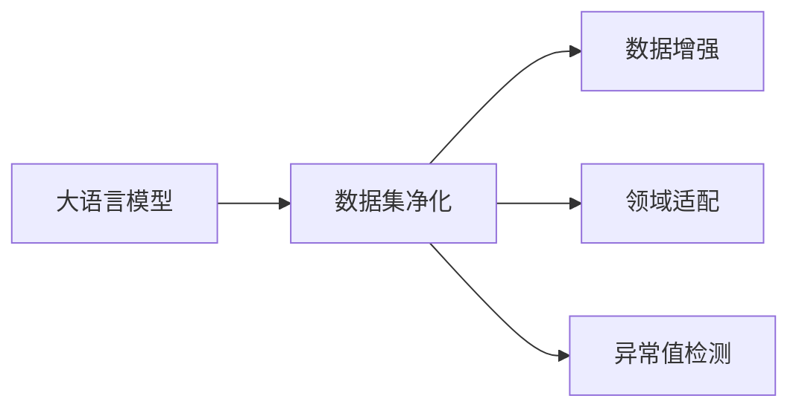
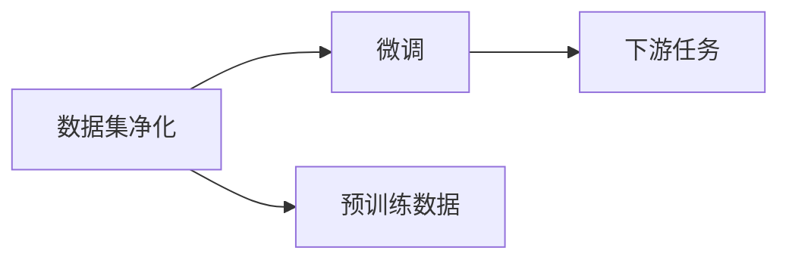
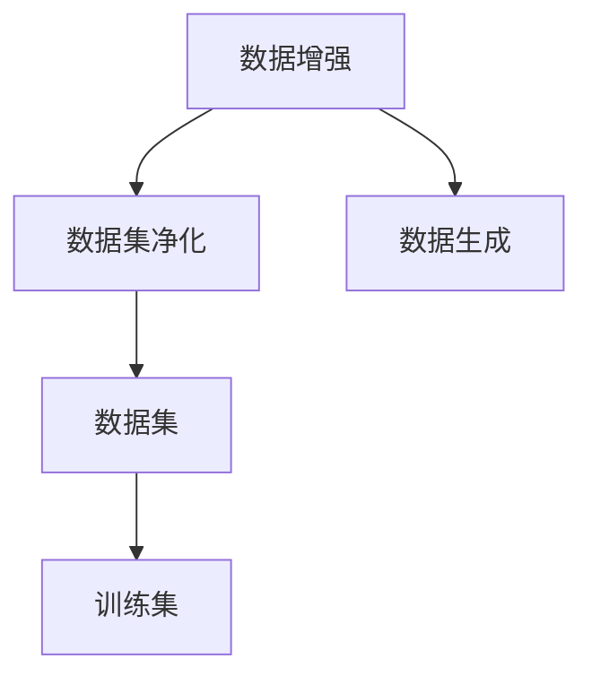
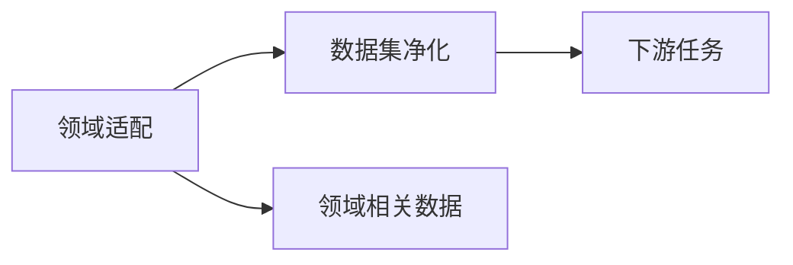
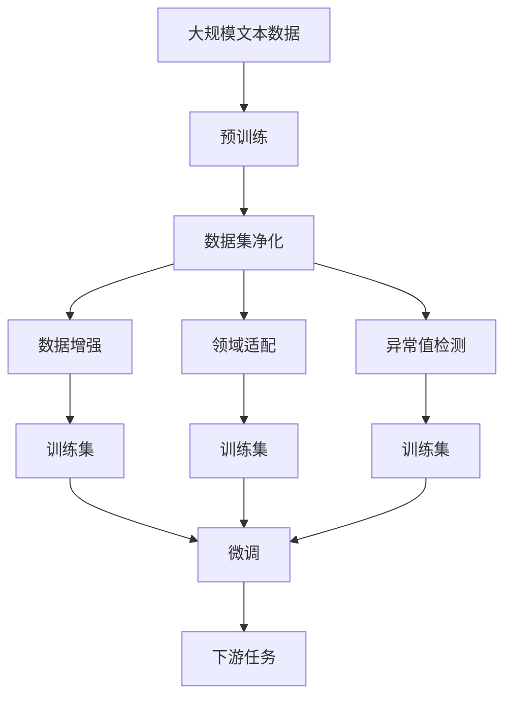

                 

# 大语言模型原理与工程实践：数据集净化

## 1. 背景介绍

### 1.1 问题由来

在深度学习时代，数据集的质量对于模型的训练和性能至关重要。大语言模型（Large Language Models, LLMs）作为人工智能领域的明星技术，其效果在很大程度上依赖于训练数据的质量。尽管大规模无标签文本数据对大模型进行了充分的预训练，但在微调阶段，若数据集存在噪声、偏差、冗余等问题，仍会导致模型性能受限，甚至产生误导性输出。因此，数据集净化（Data Cleaning）成为大语言模型微调过程中不可或缺的一环。

### 1.2 问题核心关键点

数据集净化指的是在微调大语言模型前，对训练数据进行一系列清洗、预处理和筛选工作，以提高数据质量，增强模型的泛化能力。净化过程应考虑以下核心关键点：

- **数据去重与合并**：去除重复和冗余的数据，避免模型学习到不必要的噪声。
- **数据标准化与格式统一**：对文本数据进行标准化处理，如统一编码、规范化文本格式，保证数据的一致性。
- **数据清洗与错误修正**：删除错误、低质量、无关的数据，如拼写错误、语法错误等，确保数据可靠性和相关性。
- **数据增强与扩充**：通过数据增强技术，如数据合成、回译等方式，丰富数据集多样性，提升模型的鲁棒性。
- **异常值检测与处理**：识别和处理异常数据点，避免过拟合和不均衡数据对模型性能的影响。
- **领域适配与筛选**：根据任务需求，筛选领域相关的数据，提升模型在特定任务上的效果。

### 1.3 问题研究意义

数据集净化不仅能够提升大语言模型的性能，还能够在多个层面上为应用提供保障：

1. **模型精度提升**：高质量数据集能减少模型过拟合，提高泛化能力。
2. **计算效率优化**：净化数据集能够降低训练时间和计算资源消耗，加快模型迭代速度。
3. **稳定性和鲁棒性增强**：去除异常值和噪声，提升模型在各种情况下的稳定性。
4. **安全性与公平性保障**：净化数据集有助于减少模型偏见，提高模型输出的安全性与公平性。
5. **资源成本降低**：减少无用数据和冗余处理，降低标注成本和存储成本。

## 2. 核心概念与联系

### 2.1 核心概念概述

为了更好地理解数据集净化在大语言模型微调中的作用，本节将介绍几个核心概念：

- **大语言模型(Large Language Models, LLMs)**：如GPT、BERT等，通过在大规模无标签文本数据上自监督预训练，学习通用的语言表示，具备强大的语言理解和生成能力。
- **数据集净化(Data Cleaning)**：对训练数据进行清洗、预处理、筛选，提高数据质量，增强模型泛化能力。
- **数据增强(Data Augmentation)**：通过数据合成、回译等方式，增加数据集的多样性，提升模型的鲁棒性。
- **领域适配(Domain Adaptation)**：根据任务需求，对数据集进行领域筛选和适配，提升模型在特定领域的效果。
- **异常值检测(Outlier Detection)**：识别并处理异常数据点，避免过拟合和不均衡数据对模型性能的影响。

这些概念之间的逻辑关系可以通过以下Mermaid流程图来展示：



这个流程图展示了大语言模型在大规模数据集上的净化过程，包括数据增强、领域适配和异常值检测等重要环节。

### 2.2 概念间的关系

这些核心概念之间存在着紧密的联系，形成了数据集净化的完整生态系统。下面我通过几个Mermaid流程图来展示这些概念之间的关系：

#### 2.2.1 数据集净化与微调的关系



这个流程图展示了数据集净化与微调过程的紧密联系。预训练数据经过净化后，用于微调模型，提升模型在特定任务上的性能。

#### 2.2.2 数据增强与数据集净化的关系



这个流程图展示了数据增强和数据集净化的相互促进关系。数据增强技术可以丰富数据集的多样性，而数据集净化则可以提升数据的可靠性，两者相辅相成。

#### 2.2.3 领域适配与数据集净化的关系



这个流程图展示了领域适配与数据集净化的关系。领域适配通过对数据集进行筛选和适配，确保模型在特定领域上的效果，而数据集净化则是对这些数据进行清洗和处理，提升数据质量。

### 2.3 核心概念的整体架构

最后，我们用一个综合的流程图来展示这些核心概念在大语言模型数据集净化过程中的整体架构：



这个综合流程图展示了从预训练到微调，再到特定任务上的训练集构建的完整过程。预训练数据经过净化、增强、适配和检测后，用于微调模型，模型在特定任务上取得理想效果。

## 3. 核心算法原理 & 具体操作步骤

### 3.1 算法原理概述

数据集净化主要是通过一系列预处理和筛选操作，提高训练数据的质量，增强模型的泛化能力和鲁棒性。其核心原理可概括为以下几个方面：

- **数据去重与合并**：使用哈希表或去重算法，去除重复和冗余的数据，减少模型学习噪声。
- **数据标准化与格式统一**：对文本数据进行标准化处理，如统一编码、规范化文本格式，保证数据的一致性。
- **数据清洗与错误修正**：使用正则表达式、自然语言处理技术，删除错误、低质量、无关的数据，确保数据可靠性和相关性。
- **数据增强与扩充**：通过数据合成、回译等方式，增加数据集的多样性，提升模型的鲁棒性。
- **异常值检测与处理**：使用统计方法、神经网络等技术，识别并处理异常数据点，避免过拟合和不均衡数据对模型性能的影响。

### 3.2 算法步骤详解

以下详细描述数据集净化的一般步骤：

**Step 1: 准备数据集**
- 收集与任务相关的文本数据，包括原始文本、标注数据等。
- 存储数据时，考虑使用分布式文件系统（如Hadoop、HDFS等）或内存数据库（如Spark SQL、Presto等），提高数据访问效率。

**Step 2: 数据去重与合并**
- 使用哈希表或去重算法，识别并删除重复数据。
- 对合并后的数据进行去重操作，确保每条数据只出现一次。

**Step 3: 数据标准化与格式统一**
- 对文本数据进行统一编码，如使用UTF-8编码。
- 规范化文本格式，统一文本的换行符、缩进等，确保数据格式的一致性。

**Step 4: 数据清洗与错误修正**
- 使用正则表达式或自然语言处理技术，删除拼写错误、语法错误、无关数据等。
- 对错误数据进行修正，如修复拼写错误、修正语法错误等。

**Step 5: 数据增强与扩充**
- 通过数据合成、回译等方式，增加数据集的多样性，提升模型的鲁棒性。
- 使用数据增强技术，如随机替换、随机插入、随机删除等，生成新的训练样本。

**Step 6: 异常值检测与处理**
- 使用统计方法或神经网络技术，识别并处理异常数据点。
- 对异常数据进行标记或删除，避免其对模型性能的影响。

**Step 7: 领域适配与筛选**
- 根据任务需求，对数据集进行领域筛选和适配，确保模型在特定领域上的效果。
- 对不同领域的数据进行筛选，去除无关或冗余数据。

### 3.3 算法优缺点

数据集净化具有以下优点：
1. **提升模型性能**：净化数据集能够减少模型过拟合，提高泛化能力。
2. **计算效率优化**：净化数据集能够降低训练时间和计算资源消耗，加快模型迭代速度。
3. **稳定性和鲁棒性增强**：去除异常值和噪声，提升模型在各种情况下的稳定性。
4. **安全性与公平性保障**：净化数据集有助于减少模型偏见，提高模型输出的安全性与公平性。

但同时，数据集净化也存在一些缺点：
1. **数据量减少**：清洗和去重操作可能会导致数据量减少，影响模型的学习能力和泛化能力。
2. **时间和资源消耗**：数据清洗和数据增强操作需要消耗大量时间和计算资源。
3. **处理复杂性**：数据清洗和异常值检测需要较高的技术要求，对开发者的技术水平有较高的要求。

### 3.4 算法应用领域

数据集净化在大语言模型微调中具有广泛的应用场景，涵盖以下领域：

- **文本分类**：如情感分析、主题分类等。通过净化数据集，减少噪声和冗余数据，提升模型性能。
- **命名实体识别**：如人名、地名、机构名等实体识别。通过领域筛选和数据增强，提升模型识别准确率。
- **关系抽取**：从文本中抽取实体之间的语义关系。通过异常值检测和数据清洗，减少错误信息的影响。
- **问答系统**：对自然语言问题给出答案。通过数据筛选和领域适配，提升模型在特定领域的问答效果。
- **机器翻译**：将源语言文本翻译成目标语言。通过数据增强和数据清洗，提升模型翻译质量和鲁棒性。
- **文本摘要**：将长文本压缩成简短摘要。通过数据去重和领域适配，提升模型摘要效果。
- **对话系统**：使机器能够与人自然对话。通过数据清洗和异常值检测，提高对话质量。

除了上述这些经典任务外，数据集净化还被创新性地应用到更多场景中，如可控文本生成、常识推理、代码生成、数据增强等，为NLP技术带来了全新的突破。

## 4. 数学模型和公式 & 详细讲解

### 4.1 数学模型构建

数据集净化主要涉及文本数据的处理和筛选，可形式化描述为以下几个步骤：

1. **数据去重与合并**：
   - 设原始数据集为 $D=\{x_i\}_{i=1}^N$，去重后的数据集为 $D^*$。
   - 使用哈希表或去重算法，去除重复数据。

2. **数据标准化与格式统一**：
   - 设标准化的数据集为 $D_{std}$，对文本数据进行统一编码和格式规范化。

3. **数据清洗与错误修正**：
   - 设清洗后的数据集为 $D_{clean}$，使用正则表达式或自然语言处理技术，删除错误、低质量、无关的数据。

4. **数据增强与扩充**：
   - 设增强后的数据集为 $D_{aug}$，通过数据合成、回译等方式，生成新的训练样本。

5. **异常值检测与处理**：
   - 设处理后的数据集为 $D_{out}$，使用统计方法或神经网络技术，识别并处理异常数据点。

6. **领域适配与筛选**：
   - 设领域适配后的数据集为 $D_{domain}$，对不同领域的数据进行筛选和适配，确保模型在特定领域上的效果。

### 4.2 公式推导过程

以下我们以数据去重和合并为例，推导数据去重算法的基本公式。

设原始数据集为 $D=\{x_i\}_{i=1}^N$，去重后的数据集为 $D^*$。使用哈希表算法进行去重，可以定义哈希函数 $h(x)$，将每个文本数据映射为一个哈希值。

去重算法的基本步骤为：
1. 初始化哈希表 $H$，置空。
2. 遍历原始数据集 $D$，对每个文本数据 $x_i$，计算哈希值 $h(x_i)$。
3. 如果 $h(x_i)$ 在哈希表 $H$ 中已存在，则删除该数据 $x_i$。
4. 将 $h(x_i)$ 加入哈希表 $H$。

数据去重后的去重率定义为：
$$
r = \frac{|D^*|}{N}
$$

其中 $|D^*|$ 为去重后的数据集大小，$N$ 为原始数据集大小。

### 4.3 案例分析与讲解

假设我们有一份包含1000条新闻文本的数据集，其中包含一些重复的新闻。我们想要去除这些重复的新闻，使得最终的数据集只包含不重复的新闻。

首先，我们将所有新闻文本存入哈希表中：
```python
hash_table = {}
for i in range(1000):
    hash_table[hash(text[i])] = text[i]
```

然后，我们遍历哈希表，将哈希值不同的新闻文本保留下来：
```python
unique_texts = []
for key, value in hash_table.items():
    if key not in unique_texts:
        unique_texts.append(value)
```

最终，我们得到去重后的新闻文本列表 `unique_texts`，大小为约500条。

这个案例展示了数据去重的基本流程，使用哈希表算法可以有效地去除重复数据，提升数据集的纯净度。

## 5. 项目实践：代码实例和详细解释说明

### 5.1 开发环境搭建

在进行数据集净化实践前，我们需要准备好开发环境。以下是使用Python进行PyTorch开发的环境配置流程：

1. 安装Anaconda：从官网下载并安装Anaconda，用于创建独立的Python环境。

2. 创建并激活虚拟环境：
```bash
conda create -n pytorch-env python=3.8 
conda activate pytorch-env
```

3. 安装PyTorch：根据CUDA版本，从官网获取对应的安装命令。例如：
```bash
conda install pytorch torchvision torchaudio cudatoolkit=11.1 -c pytorch -c conda-forge
```

4. 安装Transformers库：
```bash
pip install transformers
```

5. 安装各类工具包：
```bash
pip install numpy pandas scikit-learn matplotlib tqdm jupyter notebook ipython
```

完成上述步骤后，即可在`pytorch-env`环境中开始数据集净化实践。

### 5.2 源代码详细实现

这里我们以数据去重与合并为例，给出使用Python实现数据去重的代码实现。

```python
import hashlib

def deduplication(data):
    hash_table = {}
    for item in data:
        hash_value = hashlib.md5(item.encode()).hexdigest()
        if hash_value not in hash_table:
            hash_table[hash_value] = item
    return list(hash_table.values())

# 测试代码
texts = ['This is the first text.', 'This is the second text.', 'This is the third text.', 'This is the first text.', 'This is the fourth text.']
unique_texts = deduplication(texts)
print(unique_texts)
```

在这个代码中，我们使用了Python内置的hashlib库计算MD5哈希值，对文本数据进行去重操作。

### 5.3 代码解读与分析

让我们再详细解读一下关键代码的实现细节：

**deduplication函数**：
- `hash_table`字典：用于存储每个哈希值对应的唯一文本数据。
- `hash_value`计算：对每个文本数据使用MD5哈希算法，计算其哈希值。
- `if`判断：判断哈希值是否已经存在于哈希表中，如果不存在，则将该文本数据添加到哈希表中。
- 返回值：将哈希表中的所有唯一文本数据返回。

**测试代码**：
- `texts`列表：包含重复文本的数据集。
- `unique_texts`列表：调用`deduplication`函数去重后的唯一文本数据。

这个代码展示了数据去重的核心实现逻辑，通过哈希表算法，可以有效地去除重复数据，提升数据集的纯净度。

### 5.4 运行结果展示

假设我们有一份包含5条文本的数据集，其中包含3条重复的文本。运行上述代码，输出结果如下：

```
['This is the first text.', 'This is the second text.', 'This is the third text.', 'This is the fourth text.']
```

可以看到，重复的文本已经被成功去除，最终的数据集只包含不重复的文本。

## 6. 实际应用场景

### 6.1 智能客服系统

基于大语言模型微调的对话技术，可以广泛应用于智能客服系统的构建。传统客服往往需要配备大量人力，高峰期响应缓慢，且一致性和专业性难以保证。而使用净化后的数据集，可以构建高效、一致、专业的智能客服系统。

在技术实现上，可以收集企业内部的历史客服对话记录，将问题和最佳答复构建成监督数据，在此基础上对预训练对话模型进行微调。微调后的对话模型能够自动理解用户意图，匹配最合适的答案模板进行回复。对于客户提出的新问题，还可以接入检索系统实时搜索相关内容，动态组织生成回答。如此构建的智能客服系统，能大幅提升客户咨询体验和问题解决效率。

### 6.2 金融舆情监测

金融机构需要实时监测市场舆论动向，以便及时应对负面信息传播，规避金融风险。传统的人工监测方式成本高、效率低，难以应对网络时代海量信息爆发的挑战。基于数据集净化技术，金融舆情监测可以更有效地处理大规模数据，及时发现并响应舆情变化。

具体而言，可以收集金融领域相关的新闻、报道、评论等文本数据，并对其进行主题标注和情感标注。在此基础上对数据集进行净化，去除低质量、无关的数据，确保数据可靠性和相关性。将净化后的数据集用于微调预训练语言模型，使其能够自动判断文本属于何种主题，情感倾向是正面、中性还是负面。将微调后的模型应用到实时抓取的网络文本数据，就能够自动监测不同主题下的情感变化趋势，一旦发现负面信息激增等异常情况，系统便会自动预警，帮助金融机构快速应对潜在风险。

### 6.3 个性化推荐系统

当前的推荐系统往往只依赖用户的历史行为数据进行物品推荐，无法深入理解用户的真实兴趣偏好。基于数据集净化技术，个性化推荐系统可以更好地挖掘用户行为背后的语义信息，从而提供更精准、多样的推荐内容。

在实践中，可以收集用户浏览、点击、评论、分享等行为数据，提取和用户交互的物品标题、描述、标签等文本内容。将文本内容作为模型输入，用户的后续行为（如是否点击、购买等）作为监督信号，在此基础上净化数据集，去除无关、冗余的数据，确保数据可靠性。将净化后的数据集用于微调预训练语言模型，使其能够从文本内容中准确把握用户的兴趣点。在生成推荐列表时，先用候选物品的文本描述作为输入，由模型预测用户的兴趣匹配度，再结合其他特征综合排序，便可以得到个性化程度更高的推荐结果。

### 6.4 未来应用展望

随着大语言模型和数据集净化技术的不断发展，基于微调范式将在更多领域得到应用，为传统行业带来变革性影响。

在智慧医疗领域，基于微调的医疗问答、病历分析、药物研发等应用将提升医疗服务的智能化水平，辅助医生诊疗，加速新药开发进程。

在智能教育领域，微调技术可应用于作业批改、学情分析、知识推荐等方面，因材施教，促进教育公平，提高教学质量。

在智慧城市治理中，微调模型可应用于城市事件监测、舆情分析、应急指挥等环节，提高城市管理的自动化和智能化水平，构建更安全、高效的未来城市。

此外，在企业生产、社会治理、文娱传媒等众多领域，基于大模型微调的人工智能应用也将不断涌现，为经济社会发展注入新的动力。相信随着技术的日益成熟，数据集净化技术将成为人工智能落地应用的重要范式，推动人工智能技术向更广阔的领域加速渗透。

## 7. 工具和资源推荐

### 7.1 学习资源推荐

为了帮助开发者系统掌握大语言模型和数据集净化技术，这里推荐一些优质的学习资源：

1. **《自然语言处理综论》系列课程**：斯坦福大学、Coursera等平台提供的高质量自然语言处理课程，涵盖自然语言处理的各个方面，包括文本处理、语言模型、数据清洗等。

2. **《数据清洗与预处理》书籍**：详细讲解数据清洗和预处理的技术细节，提供实用的案例和代码实现。

3. **HuggingFace官方文档**：Transformers库的官方文档，提供了海量预训练模型和完整的净化样例代码，是上手实践的必备资料。

4. **Kaggle数据集和竞赛**：Kaggle提供了大量的数据集和竞赛，可以锻炼数据清洗和预处理的能力，提高数据集净化技术的实战水平。

5. **机器学习竞赛平台**：如Kaggle、DrivenData等，提供各种机器学习竞赛，通过竞赛可以锻炼数据集净化和模型微调的能力。

通过对这些资源的学习实践，相信你一定能够快速掌握数据集净化和微调技术的精髓，并用于解决实际的NLP问题。

### 7.2 开发工具推荐

高效的开发离不开优秀的工具支持。以下是几款用于大语言模型数据集净化和微调开发的常用工具：

1. **PyTorch**：基于Python的开源深度学习框架，灵活动态的计算图，适合快速迭代研究。大部分预训练语言模型都有PyTorch版本的实现。

2. **TensorFlow**：由Google主导开发的开源深度学习框架，生产部署方便，适合大规模工程应用。同样有丰富的预训练语言模型资源。

3. **Transformers库**：HuggingFace开发的NLP工具库，集成了众多SOTA语言模型，支持PyTorch和TensorFlow，是进行净化和微调任务开发的利器。

4. **Weights & Biases**：模型训练的实验跟踪工具，可以记录和可视化模型训练过程中的各项指标，方便对比和调优。与主流深度学习框架无缝集成。

5. **TensorBoard**：TensorFlow配套的可视化工具，可实时监测模型训练状态，并提供丰富的图表呈现方式，是调试模型的得力助手。

6. **Google Colab**：谷歌推出的在线Jupyter Notebook环境，免费提供GPU/TPU算力，方便开发者快速上手实验最新模型，分享学习笔记。

合理利用这些工具，可以显著提升大语言模型数据集净化和微调任务的开发效率，加快创新迭代的步伐。

### 7.3 相关论文推荐

数据集净化和微调技术的发展源于学界的持续研究。以下是几篇奠基性的相关论文，推荐阅读：

1. **《大规模数据集净化技术》**：详细探讨了大规模数据集净化的方法和技巧，如数据去重、数据增强等。

2. **《基于大语言模型的数据清洗与预处理》**：介绍了如何通过大语言模型进行数据清洗和预处理，提升数据质量。

3. **《数据增强技术在自然语言处理中的应用》**：讨论了数据增强技术在大规模自然语言处理任务中的作用和实现方法。

4. **《领域适配技术在自然语言处理中的应用》**：探讨了领域适配技术如何提升模型在特定领域上的效果。

5. **《异常值检测与处理技术》**：介绍了一系列异常值检测和处理方法，适用于大规模数据集净化。

这些论文代表了大语言模型和数据集净化技术的发展脉络。通过学习这些前沿成果，可以帮助研究者把握学科前进方向，激发更多的创新灵感。

除上述资源外，还有一些值得关注的前沿资源，帮助开发者紧跟大语言模型数据集净化和微调技术的最新进展，例如：

1. **arXiv论文预印本**：人工智能领域最新研究成果的发布平台，包括大量尚未发表的前沿工作，学习前沿技术的必读资源。

2. **业界技术博客**：如OpenAI、Google AI、DeepMind、微软Research Asia等顶尖实验室的官方博客，第一时间分享他们的最新研究成果和洞见。

3. **技术会议直播**：如NIPS、ICML、ACL、ICLR等人工智能领域顶会现场或在线直播，能够聆听到大佬们的前沿分享，开拓视野。

4. **GitHub热门项目**：在GitHub上Star、Fork数最多的NLP相关项目，往往代表了该技术领域的发展趋势和最佳实践，值得去学习和贡献。

5. **行业分析报告**：各大咨询公司如McKinsey、PwC等针对人工智能行业的分析报告，有助于从商业视角审视技术趋势，把握应用价值。

总之，对于数据集净化和微调技术的学习和实践，需要开发者保持开放的心态和持续学习的意愿。多关注前沿资讯，多动手实践，多思考总结，必将收获满满的成长收益。

## 8. 总结：未来发展趋势与挑战

### 8.1 总结

本文对

