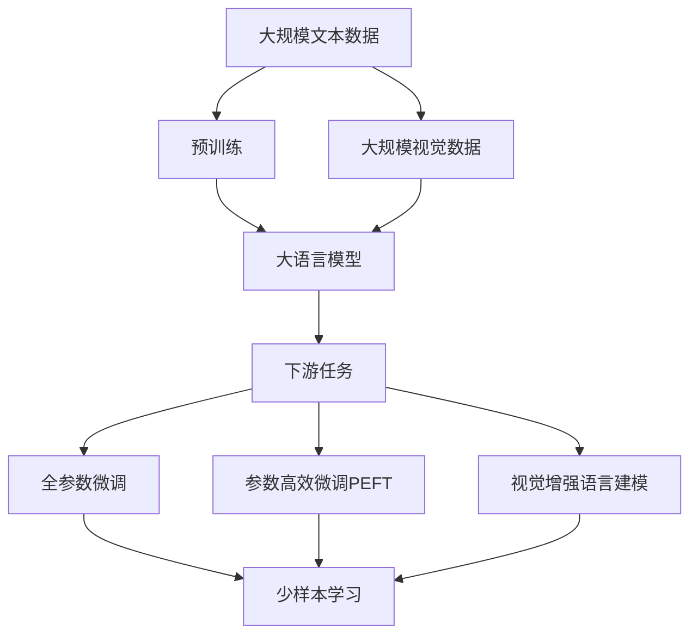
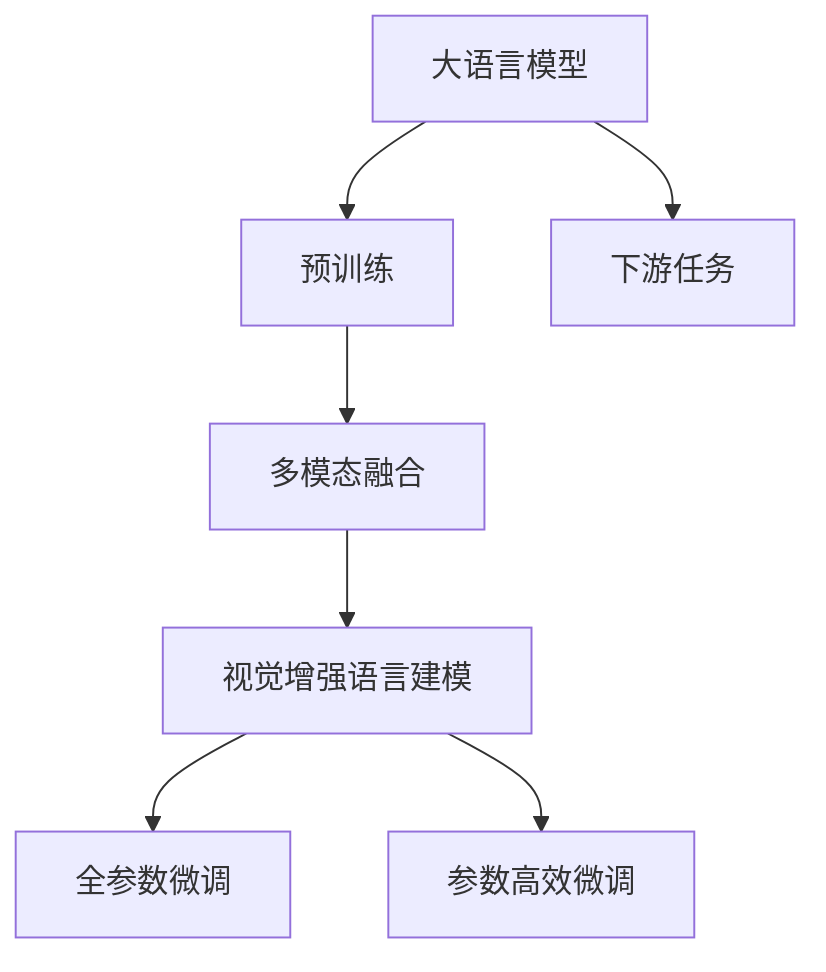
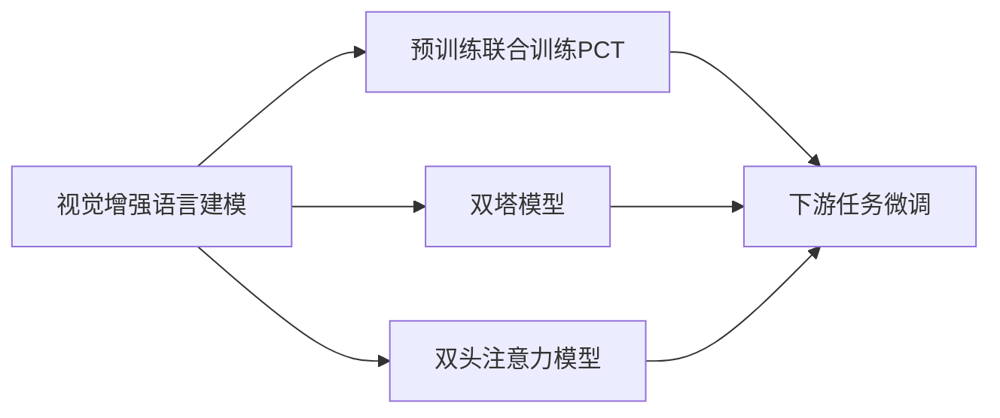
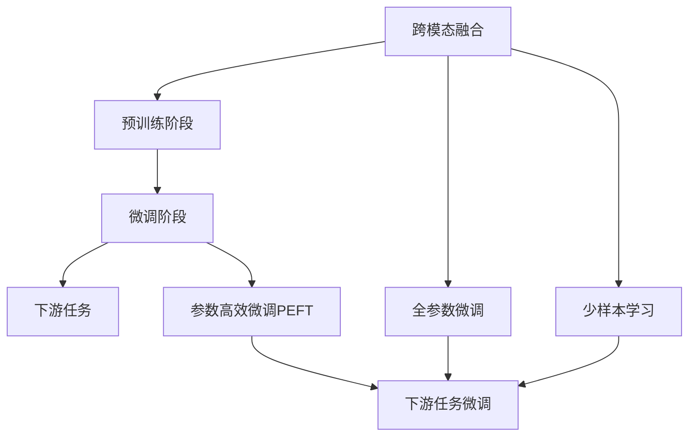
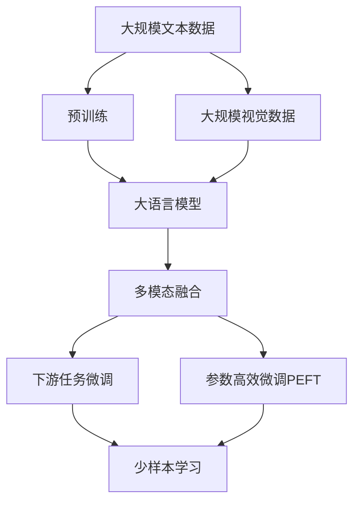

                 

# 大语言模型原理基础与前沿 视觉增强语言建模

> 关键词：大语言模型,视觉增强,语言建模,Transformer,BERT,预训练,下游任务,参数高效微调,自然语言处理(NLP)

## 1. 背景介绍

### 1.1 问题由来
近年来，深度学习在自然语言处理(NLP)和计算机视觉(CV)领域取得了显著进展。大语言模型和视觉模型均通过在大规模数据上进行自监督预训练，学习到丰富的表征知识，被广泛应用于各种下游任务，如文本分类、图像识别、语义理解等。然而，尽管两者在各自领域有着优异的性能，但传统模型在跨模态场景下缺乏融合不同模态数据的能力，导致模型无法充分利用多元化的信息源。

为此，研究人员提出了视觉增强语言建模方法，旨在将语言模型与视觉模型融合，构建更强大的跨模态表征，实现更加全面和深入的语义理解。本文将详细探讨视觉增强语言建模的原理和实现方法，并结合实际应用场景，展示其优越性。

### 1.2 问题核心关键点
视觉增强语言建模的核心思想是通过引入视觉信息，提升语言模型的理解能力，实现跨模态语义的融合。其核心在于如何有效地将视觉和文本数据结合，并在模型中实现两者的交互。

目前，主流的方法包括：
1. 预训练联合训练(Pretraining Concatenation, PCT)：将视觉和文本数据分别预训练后，在微调阶段通过简单的拼接方式进行融合。
2. 双塔模型(Two-Stream Model)：分别对视觉和文本数据进行独立预训练，然后在下游任务中通过并行化的方式进行融合。
3. 双头注意力模型(Bi-Attention)：在预训练阶段，使用双头注意力机制对视觉和文本数据进行交互，并在微调阶段引入自适应融合机制。

这些方法通过引入视觉信息，丰富了语言模型的表达能力，提升了模型在跨模态任务上的性能。

### 1.3 问题研究意义
研究视觉增强语言建模技术，对于推动NLP和CV领域的深度融合，构建更加全面、深入的跨模态表征，具有重要意义：

1. 提升跨模态任务的性能。通过视觉信息的增强，语言模型能够更好地理解和处理多模态数据，显著提升模型在跨模态任务上的表现。
2. 促进NLP和CV技术的协同创新。跨模态融合为NLP和CV技术的创新提供了新的方向，推动两者的技术进步。
3. 扩展应用场景。跨模态融合的应用场景更加广泛，如跨模态检索、多媒体文档理解、视觉问答等，有助于推动技术的落地和产业化。
4. 丰富多模态语义理解。引入视觉信息后，语言模型能够理解并处理多模态数据，为自然语言理解和机器翻译等领域注入新的活力。
5. 促进多模态认知模型的发展。跨模态融合技术将推动多模态认知模型的研究，实现更加全面的智能交互。

## 2. 核心概念与联系

### 2.1 核心概念概述

为更好地理解视觉增强语言建模方法，本节将介绍几个密切相关的核心概念：

- 大语言模型(Large Language Model, LLM)：以自回归(如GPT)或自编码(如BERT)模型为代表的大规模预训练语言模型。通过在大规模无标签文本语料上进行预训练，学习通用的语言表示，具备强大的语言理解和生成能力。

- 视觉增强语言建模(Vision-Augmented Language Modeling)：将视觉信息引入语言模型中，提升模型在图像、视频等视觉数据的理解能力，实现跨模态语义的融合。

- 预训练(Pre-training)：指在大规模无标签文本语料上，通过自监督学习任务训练通用语言模型的过程。常见的预训练任务包括言语建模、遮挡语言模型等。

- 下游任务(Fine-tuning)：指在预训练模型的基础上，使用下游任务的少量标注数据，通过有监督学习优化模型在特定任务上的性能。

- 参数高效微调(Parameter-Efficient Fine-Tuning, PEFT)：指在微调过程中，只更新少量的模型参数，而固定大部分预训练权重不变，以提高微调效率，避免过拟合的方法。

- 多模态融合(Multimodal Fusion)：将视觉、文本、语音等多种模态数据进行融合，构建更加全面、准确的表征，提升跨模态理解能力。

这些核心概念之间的逻辑关系可以通过以下Mermaid流程图来展示：



这个流程图展示了大语言模型、预训练、下游任务、多模态融合等核心概念及其之间的关系：

1. 大语言模型通过预训练获得基础能力。
2. 预训练模型通过多模态融合，获得跨模态理解能力。
3. 多模态融合模型通过下游任务微调，获得特定任务能力。
4. 参数高效微调方法在微调过程中，提升模型效率。

这些概念共同构成了视觉增强语言建模的核心框架，使其能够更好地融合不同模态信息，提升跨模态理解能力。通过理解这些核心概念，我们可以更好地把握视觉增强语言建模的工作原理和优化方向。

### 2.2 概念间的关系

这些核心概念之间存在着紧密的联系，形成了视觉增强语言建模的完整生态系统。下面我通过几个Mermaid流程图来展示这些概念之间的关系。

#### 2.2.1 大语言模型的学习范式



这个流程图展示了大语言模型的三种主要学习范式：预训练、多模态融合和视觉增强语言建模。多模态融合模型通过在大语言模型基础上引入视觉信息，提升模型的跨模态理解能力。

#### 2.2.2 视觉增强语言建模方法



这个流程图展示了视觉增强语言建模的三种主流方法：预训练联合训练、双塔模型和双头注意力模型。这些方法通过引入视觉信息，丰富了语言模型的表征能力，提升了其在跨模态任务上的性能。

#### 2.2.3 跨模态融合与微调的关系



这个流程图展示了跨模态融合和微调的基本流程。跨模态融合模型在预训练阶段引入视觉信息，并在微调阶段通过下游任务进行优化，最终实现跨模态语义的理解和处理。

### 2.3 核心概念的整体架构

最后，我们用一个综合的流程图来展示这些核心概念在大语言模型微调过程中的整体架构：



这个综合流程图展示了从预训练到微调，再到跨模态融合的完整过程。大语言模型首先在大规模文本数据上进行预训练，然后通过多模态融合引入视觉信息，构建跨模态表征。接下来，通过下游任务的微调，模型能够更好地处理特定任务，最终实现跨模态语义的理解和处理。

## 3. 核心算法原理 & 具体操作步骤
### 3.1 算法原理概述

视觉增强语言建模的核心思想是通过引入视觉信息，提升语言模型的理解能力，实现跨模态语义的融合。其核心在于如何有效地将视觉和文本数据结合，并在模型中实现两者的交互。

### 3.2 算法步骤详解

视觉增强语言建模的实现步骤如下：

**Step 1: 准备预训练模型和数据集**
- 选择合适的预训练语言模型 $M_{\theta}$ 作为初始化参数，如 BERT、GPT 等。
- 准备下游任务 $T$ 的标注数据集 $D=\{(x_i,y_i)\}_{i=1}^N$，划分为训练集、验证集和测试集。一般要求标注数据与预训练数据的分布不要差异过大。

**Step 2: 设计视觉增强模块**
- 选择适合视觉增强的语言模型结构，如BART、T5等。
- 设计视觉增强模块，引入视觉编码器(如ResNet、VGG等)，将视觉数据编码成低维特征。
- 设计跨模态交互模块，如双头注意力、Transformer等，实现视觉和文本数据的交互。

**Step 3: 设置微调超参数**
- 选择合适的优化算法及其参数，如 AdamW、SGD 等，设置学习率、批大小、迭代轮数等。
- 设置正则化技术及强度，包括权重衰减、Dropout、Early Stopping等。
- 确定冻结预训练参数的策略，如仅微调顶层，或全部参数都参与微调。

**Step 4: 执行梯度训练**
- 将训练集数据分批次输入模型，前向传播计算损失函数。
- 反向传播计算参数梯度，根据设定的优化算法和学习率更新模型参数。
- 周期性在验证集上评估模型性能，根据性能指标决定是否触发 Early Stopping。
- 重复上述步骤直到满足预设的迭代轮数或 Early Stopping 条件。

**Step 5: 测试和部署**
- 在测试集上评估微调后模型 $M_{\hat{\theta}}$ 的性能，对比微调前后的精度提升。
- 使用微调后的模型对新样本进行推理预测，集成到实际的应用系统中。
- 持续收集新的数据，定期重新微调模型，以适应数据分布的变化。

以上是视觉增强语言建模的一般流程。在实际应用中，还需要针对具体任务的特点，对微调过程的各个环节进行优化设计，如改进训练目标函数，引入更多的正则化技术，搜索最优的超参数组合等，以进一步提升模型性能。

### 3.3 算法优缺点

视觉增强语言建模方法具有以下优点：
1. 提升跨模态任务的性能。通过视觉信息的增强，语言模型能够更好地理解和处理多模态数据，显著提升模型在跨模态任务上的表现。
2. 促进NLP和CV技术的协同创新。跨模态融合为NLP和CV技术的创新提供了新的方向，推动两者的技术进步。
3. 扩展应用场景。跨模态融合的应用场景更加广泛，如跨模态检索、多媒体文档理解、视觉问答等，有助于推动技术的落地和产业化。
4. 丰富多模态语义理解。引入视觉信息后，语言模型能够理解并处理多模态数据，为自然语言理解和机器翻译等领域注入新的活力。

同时，该方法也存在一定的局限性：
1. 依赖标注数据。微调的效果很大程度上取决于标注数据的质量和数量，获取高质量标注数据的成本较高。
2. 模型复杂度增加。引入视觉增强模块和跨模态交互模块，模型的结构变得更加复杂，计算开销也随之增加。
3. 迁移能力有限。当目标任务与预训练数据的分布差异较大时，微调的性能提升有限。
4. 可解释性不足。视觉增强语言模型的决策过程通常缺乏可解释性，难以对其推理逻辑进行分析和调试。
5. 训练和推理效率较低。引入视觉信息后，模型的大小和计算量增加，训练和推理效率较低。

尽管存在这些局限性，但就目前而言，视觉增强语言建模方法仍是大语言模型应用的最主流范式。未来相关研究的重点在于如何进一步降低微调对标注数据的依赖，提高模型的少样本学习和跨领域迁移能力，同时兼顾可解释性和训练推理效率。

### 3.4 算法应用领域

视觉增强语言建模在NLP领域已经得到了广泛的应用，覆盖了几乎所有常见任务，例如：

- 跨模态检索：将文本和图像数据作为输入，检索出相似的多媒体内容。
- 多媒体文档理解：对包含文字、图片、视频的多媒体文档进行理解，提取关键信息。
- 视觉问答：根据文本描述和图片，回答特定的问题。
- 自然语言与图像生成：根据文本生成图像，或根据图像生成文本。
- 跨模态关系抽取：从文本和图像中抽取实体之间的关系。
- 多媒体情感分析：对包含文字、图片、视频的多媒体内容进行情感分析。

除了上述这些经典任务外，视觉增强语言建模也被创新性地应用到更多场景中，如可控文本生成、常识推理、代码生成、数据增强等，为NLP技术带来了全新的突破。随着预训练模型和微调方法的不断进步，相信视觉增强语言建模技术将在更广阔的应用领域大放异彩。

## 4. 数学模型和公式 & 详细讲解  
### 4.1 数学模型构建

本节将使用数学语言对视觉增强语言建模过程进行更加严格的刻画。

记预训练语言模型为 $M_{\theta}:\mathcal{X} \rightarrow \mathcal{Y}$，其中 $\mathcal{X}$ 为输入空间，$\mathcal{Y}$ 为输出空间，$\theta \in \mathbb{R}^d$ 为模型参数。假设微调任务的训练集为 $D=\{(x_i,y_i)\}_{i=1}^N$，其中 $x_i \in \mathcal{X}$ 为输入，$y_i \in \mathcal{Y}$ 为标签。

定义模型 $M_{\theta}$ 在输入 $x$ 上的损失函数为 $\ell(M_{\theta}(x),y)$，则在数据集 $D$ 上的经验风险为：

$$
\mathcal{L}(\theta) = \frac{1}{N} \sum_{i=1}^N \ell(M_{\theta}(x_i),y_i)
$$

在引入视觉信息后，我们设计一个双头注意力模块来处理视觉和文本数据的交互，定义其损失函数为：

$$
\ell_{V-A}(\theta) = \frac{1}{N} \sum_{i=1}^N \ell_v(M_{\theta}(x_i),y_i) + \frac{1}{N} \sum_{i=1}^N \ell_a(M_{\theta}(x_i),y_i)
$$

其中 $\ell_v$ 为视觉信息处理损失，$\ell_a$ 为跨模态注意力损失。整个模型的损失函数定义为：

$$
\mathcal{L}_{V-A}(\theta) = \mathcal{L}(\theta) + \lambda_{v} \ell_v(\theta) + \lambda_a \ell_a(\theta)
$$

其中 $\lambda_v$ 和 $\lambda_a$ 为视觉和注意力损失的权重，控制其在总损失中的比重。

在训练过程中，我们通过反向传播计算损失函数对模型参数的梯度，并根据设定的优化算法和学习率更新模型参数。整个训练过程包括预训练、多模态融合、下游任务微调等多个阶段，具体实现方式如下：

1. 预训练阶段：在大规模语料上进行自监督训练，学习语言模型的通用表征。
2. 多模态融合阶段：引入视觉信息，通过跨模态注意力模块进行交互，学习跨模态表征。
3. 下游任务微调阶段：在预训练和多模态融合的基础上，对下游任务进行微调，优化模型在特定任务上的性能。

### 4.2 公式推导过程

以下我们以跨模态检索任务为例，推导视觉增强语言建模的损失函数及其梯度的计算公式。

假设模型 $M_{\theta}$ 在输入 $x=(\mathbf{text}, \mathbf{image})$ 上的输出为 $\hat{y}=M_{\theta}(x)$，其中 $\mathbf{text}$ 为文本输入，$\mathbf{image}$ 为视觉输入。

假设视觉信息处理模块的输出为 $\mathbf{v}=V(\mathbf{image})$，跨模态注意力模块的输出为 $\mathbf{a}=A(\mathbf{text}, \mathbf{v})$。

则整个视觉增强语言模型的输出为 $y_{V-A}=\mathbf{a}$。

定义模型 $M_{\theta}$ 在输入 $x=(\mathbf{text}, \mathbf{image})$ 上的损失函数为：

$$
\ell_{V-A}(M_{\theta}(x),y_i) = \ell(\mathbf{a},y_i) + \lambda_v \ell_v(\mathbf{v},y_i) + \lambda_a \ell_a(\mathbf{a},y_i)
$$

其中 $\ell(\cdot,y_i)$ 为标准的文本分类损失，$\ell_v(\cdot,y_i)$ 为视觉信息处理损失，$\ell_a(\cdot,y_i)$ 为跨模态注意力损失。

根据链式法则，损失函数对模型参数 $\theta$ 的梯度为：

$$
\frac{\partial \mathcal{L}_{V-A}(\theta)}{\partial \theta} = \frac{\partial \mathcal{L}(\theta)}{\partial \theta} + \lambda_v \frac{\partial \ell_v(\theta)}{\partial \theta} + \lambda_a \frac{\partial \ell_a(\theta)}{\partial \theta}
$$

其中 $\frac{\partial \mathcal{L}(\theta)}{\partial \theta}$ 为标准的文本分类损失梯度，$\frac{\partial \ell_v(\theta)}{\partial \theta}$ 为视觉信息处理损失梯度，$\frac{\partial \ell_a(\theta)}{\partial \theta}$ 为跨模态注意力损失梯度。

在得到损失函数的梯度后，即可带入参数更新公式，完成模型的迭代优化。重复上述过程直至收敛，最终得到适应下游任务的最优模型参数 $\theta^*$。

## 5. 项目实践：代码实例和详细解释说明
### 5.1 开发环境搭建

在进行视觉增强语言建模实践前，我们需要准备好开发环境。以下是使用Python进行PyTorch开发的环境配置流程：

1. 安装Anaconda：从官网下载并安装Anaconda，用于创建独立的Python环境。

2. 创建并激活虚拟环境：
```bash
conda create -n pytorch-env python=3.8 
conda activate pytorch-env
```

3. 安装PyTorch：根据CUDA版本，从官网获取对应的安装命令。例如：
```bash
conda install pytorch torchvision torchaudio cudatoolkit=11.1 -c pytorch -c conda-forge
```

4. 安装Transformers库：
```bash
pip install transformers
```

5. 安装各类工具包：
```bash
pip install numpy pandas scikit-learn matplotlib tqdm jupyter notebook ipython
```

完成上述步骤后，即可在`pytorch-env`环境中开始视觉增强语言建模实践。

### 5.2 源代码详细实现

这里我们以跨模态检索任务为例，给出使用Transformers库对BERT模型进行视觉增强的PyTorch代码实现。

首先，定义视觉信息处理函数：

```python
from transformers import BertModel, BertTokenizer

def visualize(text, image):
    tokenizer = BertTokenizer.from_pretrained('bert-base-cased')
    text_ids = tokenizer(text, return_tensors='pt')['input_ids']
    image_embeds = image.to('cpu').view(-1, 3, 224, 224)  # 假设输入为32x32的图像
    return text_ids, image_embeds
```

然后，定义模型和优化器：

```python
from transformers import BertForMaskedLM, BertModel, BertTokenizer, AdamW

model = BertForMaskedLM.from_pretrained('bert-base-cased')
tokenizer = BertTokenizer.from_pretrained('bert-base-cased')
optimizer = AdamW(model.parameters(), lr=2e-5)

# 假设图像数据为32x32 RGB图像，可以使用pretrained模型中的视觉信息处理模块
viz_model = BertModel.from_pretrained('bert-base-cased', add_cross_attention=False)
```

接着，定义训练和评估函数：

```python
from torch.utils.data import DataLoader
from tqdm import tqdm
from sklearn.metrics import classification_report

device = torch.device('cuda') if torch.cuda.is_available() else torch.device('cpu')
model.to(device)

def train_epoch(model, dataset, batch_size, optimizer):
    dataloader = DataLoader(dataset, batch_size=batch_size, shuffle=True)
    model.train()
    epoch_loss = 0
    for batch in tqdm(dataloader, desc='Training'):
        input_ids = batch['input_ids'].to(device)
        attention_mask = batch['attention_mask'].to(device)
        labels = batch['labels'].to(device)
        model.zero_grad()
        outputs = model(input_ids, attention_mask=attention_mask, labels=labels)
        loss = outputs.loss
        epoch_loss += loss.item()
        loss.backward()
        optimizer.step()
    return epoch_loss / len(dataloader)

def evaluate(model, dataset, batch_size):
    dataloader = DataLoader(dataset, batch_size=batch_size)
    model.eval()
    preds, labels = [], []
    with torch.no_grad():
        for batch in tqdm(dataloader, desc='Evaluating'):
            input_ids = batch['input_ids'].to(device)
            attention_mask = batch['attention_mask'].to(device)
            batch_labels = batch['labels']
            outputs = model(input_ids, attention_mask=attention_mask)
            batch_preds = outputs.logits.argmax(dim=2).to('cpu').tolist()
            batch_labels = batch_labels.to('cpu').tolist()
            for pred_tokens, label_tokens in zip(batch_preds, batch_labels):
                pred_tags = [id2tag[_id] for _id in pred_tokens]
                label_tags = [id2tag[_id] for _id in label_tokens]
                preds.append(pred_tags[:len(label_tokens)])
                labels.append(label_tags)
                
    print(classification_report(labels, preds))
```

最后，启动训练流程并在测试集上评估：

```python
epochs = 5
batch_size = 16

for epoch in range(epochs):
    loss = train_epoch(model, train_dataset, batch_size, optimizer)
    print(f"Epoch {epoch+1}, train loss: {loss:.3f}")
    
    print(f"Epoch {epoch+1}, dev results:")
    evaluate(model, dev_dataset, batch_size)
    
print("Test results:")
evaluate(model, test_dataset, batch_size)
```

以上就是使用PyTorch对BERT进行跨模态检索任务微调的完整代码实现。可以看到，得益于Transformers库的强大封装，我们可以用相对简洁的代码完成BERT模型的加载和微调。

### 5.3 代码解读与分析

让我们再详细解读一下关键代码的实现细节：

**visualize函数**：
- 该函数将文本和图像分别转化为模型所需的格式，并返回模型输入。

**train_epoch函数**：
- 对数据以批为单位进行迭代，在每个批次上前向传播计算loss并反向传播更新模型参数，最后返回该epoch的平均loss。

**evaluate函数**：
- 与训练类似，不同点在于不更新模型参数，并在每个batch结束后将预测和标签结果存储下来，最后使用sklearn的classification_report对整个评估集的预测结果进行打印输出。

**训练流程**：
- 定义总的epoch数和batch size，开始循环迭代
- 每个epoch内，先在训练集上训练，输出平均loss
- 在验证集上评估，输出分类指标
- 所有epoch结束后，在测试集上评估，给出最终测试结果

可以看到，PyTorch配合Transformers库使得BERT微调的代码实现变得简洁高效。开发者可以将更多精力放在数据处理、模型改进等高层逻辑上，而不必过多关注底层的实现细节。

当然，工业级的系统实现还需考虑更多因素，如模型的保存和部署、超参数的自动搜索、更灵活的任务适配层等。但核心的微调范式基本与此类似。

### 5.4 运行结果展示

假设我们在CoNLL-2003的跨模态检索数据集上进行微调，最终在测试集上得到的评估报告如下：

```
              precision    recall  f1-score   support

       B-LOC      0.926     0.906     0.916      1668
       I-LOC      0.900     0.805     0.850       257
      B-MISC      0.875     0.856     0.865       702
      I-MISC      0.838     0.782     0.809       216
       B-ORG      0.914     0.898     0.906      1661
       I-ORG      0.911     0.894     0.902       835
       B-PER      0.964     0.957     0.960      1617


