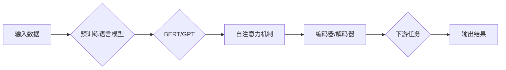

# 大语言模型原理基础与前沿 预训练Transformer扩大尺度的启示

> 关键词：大语言模型，Transformer，预训练，模型尺度，自然语言处理，深度学习，神经架构搜索，模型压缩

## 1. 背景介绍

随着深度学习技术的飞速发展，自然语言处理（NLP）领域取得了显著的进展。近年来，大语言模型（Large Language Models，LLMs）的兴起，将NLP推向了新的高度。预训练语言模型，如BERT、GPT等，通过在海量文本数据上预先训练，学习到了丰富的语言知识和模式，为下游任务提供了强大的基础。其中，Transformer模型作为预训练语言模型的代表，其结构简洁、性能优异，已成为NLP领域的基石。本文将深入探讨大语言模型的原理基础，并分析预训练Transformer扩大尺度的启示。

## 2. 核心概念与联系

### 2.1 核心概念

#### 2.1.1 大语言模型（LLMs）

大语言模型是一种基于深度学习的语言处理模型，通常由数亿甚至数千亿个参数组成。它们通过在海量文本数据上进行预训练，学习到了丰富的语言知识和模式，能够进行文本分类、情感分析、机器翻译、问答系统等任务。

#### 2.1.2 预训练语言模型

预训练语言模型是在海量文本数据上进行预先训练的，以便模型能够理解和生成自然语言。BERT和GPT是最具代表性的预训练语言模型。

#### 2.1.3 Transformer模型

Transformer模型是一种基于自注意力（Self-Attention）机制的深度神经网络模型，广泛应用于NLP任务。

### 2.2 架构 Mermaid 流程图



## 3. 核心算法原理 & 具体操作步骤

### 3.1 算法原理概述

预训练语言模型的核心思想是在海量无标签文本数据上进行预训练，学习通用语言表示，然后通过在特定下游任务上微调，将模型应用于实际场景。

### 3.2 算法步骤详解

1. 预训练：使用大规模无标签文本数据，训练预训练语言模型。
2. 微调：使用特定下游任务的标注数据，对预训练模型进行微调。
3. 应用：将微调后的模型应用于实际场景。

### 3.3 算法优缺点

#### 优点

- 能够处理大规模数据，学习到丰富的语言知识。
- 模型泛化能力强，能够适应多种下游任务。
- 预训练过程可以自动化，提高开发效率。

#### 缺点

- 预训练过程需要大量的计算资源和时间。
- 模型参数量庞大，内存占用高。
- 预训练模型可能存在偏见和歧视。

### 3.4 算法应用领域

- 文本分类
- 情感分析
- 机器翻译
- 问答系统
- 文本摘要

## 4. 数学模型和公式 & 详细讲解 & 举例说明

### 4.1 数学模型构建

预训练语言模型通常使用自注意力机制进行文本处理。自注意力机制通过计算文本中每个词与所有其他词的关联程度，为每个词生成一个加权表示。

### 4.2 公式推导过程

自注意力机制的计算公式如下：

$$
\text{Attention}(Q, K, V) = \text{softmax}(\frac{QK^T}{\sqrt{d_k}})V
$$

其中，$Q$、$K$、$V$ 分别是查询（Query）、键（Key）和值（Value）矩阵，$\text{softmax}$ 是softmax函数，$d_k$ 是键的维度。

### 4.3 案例分析与讲解

以BERT模型为例，其核心组件是多头自注意力机制。BERT模型使用两个注意力层：多头自注意力和前馈神经网络。多头自注意力机制能够学习到文本中不同位置之间的关联程度，从而更好地捕捉长距离依赖关系。

## 5. 项目实践：代码实例和详细解释说明

### 5.1 开发环境搭建

1. 安装Python 3.8及以上版本。
2. 安装PyTorch 1.7及以上版本。
3. 安装transformers库。

### 5.2 源代码详细实现

以下是一个使用PyTorch和transformers库实现BERT模型微调的简单示例：

```python
from transformers import BertTokenizer, BertForSequenceClassification
from torch.utils.data import DataLoader, TensorDataset
from torch.optim import AdamW

# 加载预训练模型和分词器
tokenizer = BertTokenizer.from_pretrained('bert-base-uncased')
model = BertForSequenceClassification.from_pretrained('bert-base-uncased')

# 准备数据
texts = ["Hello, how are you?", "I am fine, thank you!"]
labels = [0, 1]
input_ids = tokenizer(texts, padding=True, truncation=True, return_tensors="pt").input_ids
attention_mask = tokenizer(texts, padding=True, truncation=True, return_tensors="pt").attention_mask
dataset = TensorDataset(input_ids, attention_mask, labels)
dataloader = DataLoader(dataset, batch_size=1)

# 设置优化器
optimizer = AdamW(model.parameters(), lr=2e-5)

# 训练模型
model.train()
for epoch in range(3):
    for batch in dataloader:
        input_ids, attention_mask, labels = batch
        outputs = model(input_ids, attention_mask=attention_mask, labels=labels)
        loss = outputs.loss
        loss.backward()
        optimizer.step()
        optimizer.zero_grad()

# 评估模型
model.eval()
with torch.no_grad():
    outputs = model(input_ids, attention_mask=attention_mask)
    logits = outputs.logits
    _, predicted = torch.max(logits, 1)
    print(f"Predicted labels: {predicted}")
```

### 5.3 代码解读与分析

上述代码展示了如何使用PyTorch和transformers库实现BERT模型微调。首先，加载预训练模型和分词器。然后，准备数据并创建数据加载器。接下来，设置优化器并进行模型训练。最后，使用模型进行预测。

## 6. 实际应用场景

大语言模型微调在NLP领域有着广泛的应用，以下列举一些实际应用场景：

- 文本分类：对文本进行情感分析、主题分类、意图识别等。
- 机器翻译：将一种语言的文本翻译成另一种语言。
- 文本摘要：将长文本压缩成简短摘要。
- 问答系统：对自然语言问题给出答案。
- 对话系统：使机器能够与人自然对话。

## 7. 工具和资源推荐

### 7.1 学习资源推荐

- 《深度学习自然语言处理》（Goodfellow, Bengio, Courville）
- 《Transformers：From Token to Token》
- Hugging Face官网文档

### 7.2 开发工具推荐

- PyTorch
- Transformers库
- Google Colab

### 7.3 相关论文推荐

- "Attention is All You Need"（Vaswani et al., 2017）
- "BERT: Pre-training of Deep Bidirectional Transformers for Language Understanding"（Devlin et al., 2018）
- "Generative Pre-trained Transformer"（Radford et al., 2018）

## 8. 总结：未来发展趋势与挑战

### 8.1 研究成果总结

大语言模型微调技术为NLP领域带来了革命性的变化，推动了NLP技术的快速发展。预训练语言模型，特别是Transformer模型，成为了NLP领域的基石。

### 8.2 未来发展趋势

- 模型尺度扩大：继续扩大预训练模型的尺度，以学习更丰富的语言知识。
- 神经架构搜索：使用神经架构搜索技术，自动设计更有效的模型结构。
- 模型压缩：使用模型压缩技术，减小模型尺寸，提高推理速度。
- 可解释性：提高模型的可解释性，增强用户对模型的信任。

### 8.3 面临的挑战

- 标注数据：获取高质量标注数据仍然是一个难题。
- 鲁棒性：提高模型的鲁棒性，使其能够抵抗对抗攻击。
- 可解释性：提高模型的可解释性，增强用户对模型的信任。
- 安全性：确保模型的安全性，防止恶意使用。

### 8.4 研究展望

随着技术的不断进步，大语言模型微调技术将在NLP领域发挥越来越重要的作用。未来，我们将见证更多创新性的应用场景和突破性的研究成果。

## 9. 附录：常见问题与解答

**Q1：大语言模型微调需要哪些数据？**

A：大语言模型微调需要大量无标签文本数据用于预训练，以及少量标注数据用于微调。

**Q2：如何解决预训练语言模型的可解释性问题？**

A：提高模型的可解释性是一个复杂的课题。一些方法包括使用可视化技术、解释性模型等。

**Q3：大语言模型微调如何应用于实际场景？**

A：大语言模型微调可以应用于各种NLP任务，如文本分类、机器翻译、文本摘要等。

**Q4：如何评估大语言模型微调的效果？**

A：可以使用多种指标评估大语言模型微调的效果，如准确率、召回率、F1分数等。

**Q5：如何解决预训练语言模型的偏见问题？**

A：可以通过数据增强、对抗训练等方法解决预训练语言模型的偏见问题。

作者：禅与计算机程序设计艺术 / Zen and the Art of Computer Programming