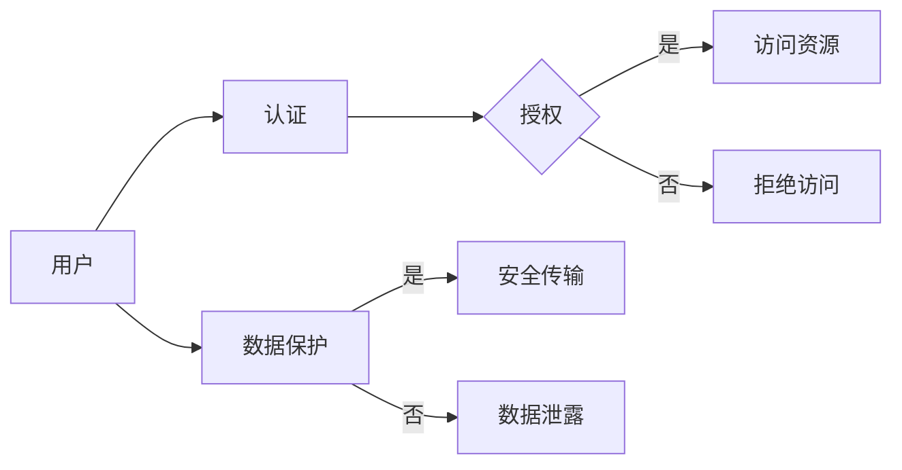

# 安全 API 设计的基本原则

> 关键词：API设计，安全原则，认证授权，数据保护，接口安全，安全编码，安全架构

## 1. 背景介绍

随着互联网的普及和数字化转型的发展，API（应用程序编程接口）已成为连接不同系统和服务的重要桥梁。一个安全可靠的API不仅能够保障数据传输的安全性，还能增强用户对服务的信任度。然而，API设计过程中存在许多安全风险，如认证授权问题、数据泄露、恶意攻击等。因此，了解并遵循安全API设计的基本原则至关重要。

## 2. 核心概念与联系

### 2.1 核心概念

#### 2.1.1 API

API是一套规则和定义，允许不同软件之间进行交互。它定义了请求的格式、数据传输的格式以及响应的结构。

#### 2.1.2 认证

认证是指验证用户或系统是否具有访问特定资源的权限。

#### 2.1.3 授权

授权是指确定用户或系统被授权执行哪些操作。

#### 2.1.4 数据保护

数据保护是指确保数据在存储、传输和处理过程中不被未授权访问、修改或泄露。

#### 2.1.5 接口安全

接口安全是指确保API接口不被恶意攻击者利用，如SQL注入、跨站脚本攻击等。

#### 2.1.6 安全编码

安全编码是指编写代码时遵循的安全最佳实践，以减少安全漏洞。

#### 2.1.7 安全架构

安全架构是指在整个系统中建立安全机制，以确保系统的整体安全性。

### 2.2 Mermaid 流程图



## 3. 核心算法原理 & 具体操作步骤

### 3.1 算法原理概述

安全API设计涉及多个层面的安全机制，包括：

- 认证机制：如OAuth 2.0、JWT（JSON Web Tokens）等。
- 授权机制：如RBAC（基于角色的访问控制）、ABAC（基于属性的访问控制）等。
- 数据加密：如SSL/TLS、AES等。
- 安全编码实践：如输入验证、错误处理等。

### 3.2 算法步骤详解

1. **需求分析**：明确API的功能、预期用户和访问场景。
2. **设计安全架构**：确定认证、授权、数据加密等安全机制。
3. **选择合适的技术栈**：选择支持安全机制的框架和库。
4. **实现认证和授权**：根据需求选择合适的认证和授权机制。
5. **实现数据加密**：确保敏感数据在传输和存储过程中的安全性。
6. **安全编码**：遵循安全编码实践，减少安全漏洞。
7. **测试**：进行安全测试，确保API的安全性。
8. **部署**：将API部署到生产环境。

### 3.3 算法优缺点

**优点**：

- 提高API的安全性，防止数据泄露和恶意攻击。
- 增强用户对服务的信任度。
- 促进API的广泛应用。

**缺点**：

- 增加了API的复杂度和开发成本。
- 可能影响API的性能。

### 3.4 算法应用领域

安全API设计适用于所有涉及API开发的场景，如移动应用、Web应用、企业服务、物联网等。

## 4. 数学模型和公式 & 详细讲解 & 举例说明

### 4.1 数学模型构建

安全API设计涉及多个数学模型，如：

- **加密算法**：如RSA、AES等。
- **哈希函数**：如SHA-256、MD5等。
- **随机数生成**：如均匀分布、正态分布等。

### 4.2 公式推导过程

以下以RSA加密算法为例进行推导：

**公钥**：

$$
\begin{align*}
n &= p \times q \\
e &= 65537
\end{align*}
$$

**私钥**：

$$
\begin{align*}
d &= e^{-1} \mod (\phi(n)) \\
\phi(n) &= (p-1) \times (q-1)
\end{align*}
$$

**加密**：

$$
c = m^e \mod n
$$

**解密**：

$$
m = c^d \mod n
$$

其中，$p$ 和 $q$ 为两个大素数，$n = p \times q$ 为模，$e$ 为公钥指数，$d$ 为私钥指数，$m$ 为明文，$c$ 为密文。

### 4.3 案例分析与讲解

以下是一个使用Python实现RSA加密的简单示例：

```python
def gcd(a, b):
    while b:
        a, b = b, a % b
    return a

def multiplicative_inverse(e, phi):
    d = 0
    x1 = 0
    x2 = 1
    y1 = phi
    while e > 0:
        q = e // b
        t = b
        b = a - q * b
        a = t
        x = x2 - q * x1
        x2 = x1
        x1 = x
        y = y1 - q * y2
        y2 = y1
        y1 = y
    if x < 0:
        x += phi
    return x

def generate_keys(bits):
    p = get_prime(bits)
    q = get_prime(bits)
    n = p * q
    phi = (p-1) * (q-1)
    e = 65537
    d = multiplicative_inverse(e, phi)
    return ((e, n), (d, n))

def encrypt(plain_text, public_key):
    e, n = public_key
    cipher_text = pow(plain_text, e, n)
    return cipher_text

def decrypt(cipher_text, private_key):
    d, n = private_key
    plain_text = pow(cipher_text, d, n)
    return plain_text
```

在这个例子中，我们首先生成两个大素数 $p$ 和 $q$，然后计算模 $n$ 和欧拉函数 $\phi(n)$。接着，我们选择公钥指数 $e = 65537$，并计算私钥指数 $d$。最后，我们定义了加密和解密函数，分别实现RSA加密和解密过程。

## 5. 项目实践：代码实例和详细解释说明

### 5.1 开发环境搭建

以下是一个简单的安全API开发项目环境搭建示例：

1. 安装Python 3.8及以上版本。
2. 安装Flask框架：
   ```bash
   pip install flask
   ```
3. 安装PyJWT库：
   ```bash
   pip install PyJWT
   ```

### 5.2 源代码详细实现

以下是一个简单的安全API示例，使用Flask框架和JWT实现用户认证：

```python
from flask import Flask, jsonify, request
from flask_jwt_extended import JWTManager, create_access_token, jwt_required, get_jwt_identity

app = Flask(__name__)
app.config['JWT_SECRET_KEY'] = 'your-secret-key'

jwt = JWTManager(app)

@app.route('/login', methods=['POST'])
def login():
    username = request.json.get('username')
    password = request.json.get('password')
    
    # 验证用户名和密码，此处简化处理
    if username == 'admin' and password == 'admin':
        access_token = create_access_token(identity=username)
        return jsonify(access_token=access_token), 200
    else:
        return jsonify({'message': 'Invalid credentials'}), 401

@app.route('/protected', methods=['GET'])
@jwt_required()
def protected():
    current_user = get_jwt_identity()
    return jsonify(logged_in_as=current_user), 200

if __name__ == '__main__':
    app.run(debug=True)
```

### 5.3 代码解读与分析

- 使用Flask框架创建Web应用。
- 使用PyJWT库实现JWT认证。
- `/login` 路由用于用户登录，验证用户名和密码后返回JWT令牌。
- `/protected` 路由需要JWT令牌才能访问，用于保护敏感数据。

### 5.4 运行结果展示

运行上述代码后，可以通过以下步骤测试API：

1. 访问 `/login` 路由，使用正确的用户名和密码获取JWT令牌。
2. 将JWT令牌添加到 `Authorization` 头部，访问 `/protected` 路由。

## 6. 实际应用场景

### 6.1 电子商务

在电子商务平台中，API可以用于处理订单、支付、库存等操作。安全API设计可以确保用户信息、订单数据和支付信息的安全性。

### 6.2 社交媒体

社交媒体平台可以使用API提供用户数据、内容分享等功能。安全API设计可以保护用户隐私和安全。

### 6.3 移动应用

移动应用可以使用API与服务器进行交互，实现数据同步、功能扩展等功能。安全API设计可以确保用户数据和应用程序的安全性。

## 7. 工具和资源推荐

### 7.1 学习资源推荐

- 《API设计最佳实践》
- 《OAuth 2.0身份验证与授权》
- 《Python Web开发：Flask实战》

### 7.2 开发工具推荐

- Flask：Python Web开发框架
- PyJWT：JWT库
- Postman：API测试工具

### 7.3 相关论文推荐

- OAuth 2.0身份验证与授权框架：http://oauth.net/2/
- JSON Web Tokens：https://tools.ietf.org/html/rfc7519

## 8. 总结：未来发展趋势与挑战

### 8.1 研究成果总结

本文介绍了安全API设计的基本原则，包括认证授权、数据保护、接口安全、安全编码和安全架构等方面。通过数学模型和公式，详细讲解了加密算法、哈希函数等安全机制。同时，通过项目实践，展示了如何使用Flask和PyJWT实现安全API。

### 8.2 未来发展趋势

- API安全将更加自动化和智能化。
- 跨平台和跨领域的API安全标准将不断涌现。
- 安全API设计将更加注重用户体验。

### 8.3 面临的挑战

- 安全API设计需要兼顾性能和安全性。
- 需要不断更新安全知识和技能。
- 需要建立完善的安全测试和审计机制。

### 8.4 研究展望

- 研究更加安全、高效的API设计方法。
- 探索新的安全机制和技术，如量子加密、可信执行环境等。
- 提高安全API设计的可解释性和可审计性。

## 9. 附录：常见问题与解答

**Q1：什么是API？**

A：API是一套规则和定义，允许不同软件之间进行交互。

**Q2：什么是OAuth 2.0？**

A：OAuth 2.0是一种授权框架，允许第三方应用程序在不需要用户密码的情况下访问用户信息。

**Q3：什么是JWT？**

A：JWT是一种轻量级的安全令牌，用于在网络上安全地传输信息。

**Q4：如何保护API免受SQL注入攻击？**

A：使用参数化查询或ORM（对象关系映射）技术，避免在SQL语句中直接拼接用户输入。

**Q5：如何保护API免受跨站脚本攻击？**

A：对用户输入进行验证和过滤，避免将恶意脚本注入到网页中。

**Q6：如何保护API免受DDoS攻击？**

A：使用防火墙、入侵检测系统等技术，限制非法请求流量。

作者：禅与计算机程序设计艺术 / Zen and the Art of Computer Programming