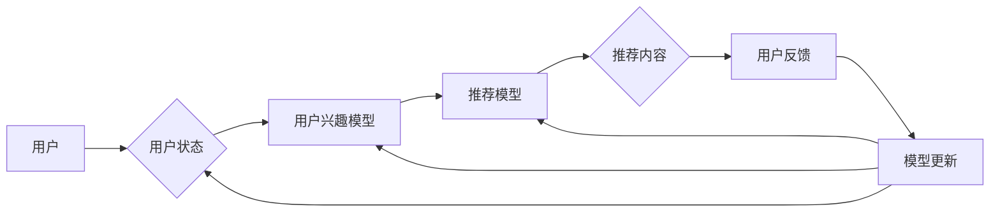

# 强化学习：在直播推荐系统中的应用

> 关键词：强化学习，直播推荐，动态环境，多智能体，Q-learning，策略梯度，深度强化学习，直播平台，用户行为

## 1. 背景介绍

随着互联网技术的飞速发展，直播行业成为了数字媒体领域的一颗新星。直播平台通过提供丰富的直播内容，吸引了大量用户。然而，如何为用户推荐个性化的直播内容，提高用户满意度和平台留存率，成为了直播平台亟待解决的问题。传统的推荐系统往往基于用户的历史行为数据，通过机器学习算法进行内容推荐。然而，直播环境具有高度动态性，用户行为和直播内容都在不断变化，这使得传统的推荐系统难以适应这种动态环境。

强化学习（Reinforcement Learning, RL）作为一种能够处理动态环境的学习方法，近年来在推荐系统领域得到了越来越多的关注。本文将探讨强化学习在直播推荐系统中的应用，分析其原理、算法、挑战和未来发展方向。

## 2. 核心概念与联系

### 2.1 核心概念

**强化学习**是一种通过与环境交互来学习最优策略的方法。在强化学习中，智能体（Agent）通过与环境（Environment）进行交互，根据环境的状态（State）选择动作（Action），并从环境中获得奖励（Reward）。智能体的目标是通过不断学习，最大化累积奖励。

**直播推荐系统**是指针对直播场景，通过智能算法为用户推荐个性化直播内容的技术。直播推荐系统需要实时处理大量用户行为数据和直播内容信息，并根据用户偏好进行内容推荐。

### 2.2 架构流程图

以下是一个简化的直播推荐系统架构流程图，展示了强化学习在该系统中的应用：



在这个流程中，用户状态和兴趣模型通过分析用户行为数据，为推荐模型提供用户偏好信息。推荐模型根据用户偏好和直播内容信息，为用户推荐个性化直播内容。用户通过观看推荐内容后，提供反馈，用于模型更新，从而不断优化推荐效果。

## 3. 核心算法原理 & 具体操作步骤

### 3.1 算法原理概述

强化学习在直播推荐系统中的应用主要包括以下几种算法：

1. **Q-learning**：通过学习Q值函数，预测每个动作在未来获得的最大奖励，选择Q值最大的动作进行推荐。
2. **策略梯度**：直接学习最优策略，根据策略梯度更新策略参数。
3. **深度强化学习**：将深度神经网络与强化学习结合，学习更复杂的策略。

### 3.2 算法步骤详解

以下以Q-learning算法为例，介绍其在直播推荐系统中的应用步骤：

1. **初始化**：设置智能体、环境、状态空间、动作空间、Q值函数、奖励函数等参数。
2. **选择动作**：根据Q值函数，选择当前状态下的最优动作。
3. **执行动作**：智能体根据选择的动作与环境进行交互，获取新的状态和奖励。
4. **更新Q值**：根据新的状态、奖励和Q值函数，更新当前动作的Q值。
5. **重复步骤2-4**：不断重复选择动作、执行动作、更新Q值的步骤，直到达到终止条件。

### 3.3 算法优缺点

**优点**：

- 能够适应动态环境，实时调整推荐策略。
- 能够学习到更复杂的策略，提高推荐效果。
- 可以根据用户反馈进行个性化推荐。

**缺点**：

- 需要大量的样本数据进行训练。
- 算法收敛速度较慢。
- 难以处理高维状态空间和动作空间。

### 3.4 算法应用领域

强化学习在直播推荐系统中的应用领域主要包括：

- 直播内容推荐：根据用户兴趣和直播内容信息，为用户推荐个性化直播内容。
- 直播房间推荐：根据用户偏好和历史行为，推荐相似直播房间。
- 直播主播推荐：根据用户偏好和主播直播内容，推荐相关主播。

## 4. 数学模型和公式 & 详细讲解 & 举例说明

### 4.1 数学模型构建

以下是一个基于Q-learning的直播推荐系统数学模型：

$$
Q(s,a) = \sum_{s' \in S} R(s,a,s') \times P(s'|s,a)
$$

其中，$Q(s,a)$ 表示在状态 $s$ 下选择动作 $a$ 的Q值，$R(s,a,s')$ 表示在状态 $s$ 下执行动作 $a$，转移到状态 $s'$ 所获得的奖励，$P(s'|s,a)$ 表示在状态 $s$ 下执行动作 $a$，转移到状态 $s'$ 的概率。

### 4.2 公式推导过程

Q-learning算法的公式推导过程如下：

1. **初始化**：将所有动作的Q值初始化为0。
2. **选择动作**：根据Q值函数，选择当前状态下的最优动作 $a^*$：
   $$
   a^* = \arg\max_{a \in A} Q(s,a)
   $$
3. **执行动作**：智能体根据选择的动作 $a^*$ 与环境进行交互，获取新的状态 $s'$ 和奖励 $R$。
4. **更新Q值**：根据新的状态 $s'$、奖励 $R$ 和Q值函数，更新当前动作 $a^*$ 的Q值：
   $$
   Q(s,a^*) = Q(s,a^*) + \alpha \times [R + \gamma \times \max_{a' \in A} Q(s',a') - Q(s,a^*)]
   $$
其中，$\alpha$ 为学习率，$\gamma$ 为折扣因子。

### 4.3 案例分析与讲解

假设有一个直播推荐系统，用户对直播内容的偏好分为兴趣程度、主播类型、直播主题三个维度。根据用户历史行为数据，构建用户兴趣模型，并将兴趣程度、主播类型、直播主题三个维度分别映射为0到1之间的数值。智能体需要根据用户兴趣模型和直播内容信息，为用户推荐直播内容。

在这个案例中，状态空间 $S$ 可以表示为用户兴趣模型的三个维度组成的向量，动作空间 $A$ 表示为推荐直播内容的列表。智能体根据Q值函数，选择当前状态下的最优动作，即推荐直播内容。通过收集用户对推荐内容的反馈，智能体不断更新Q值，优化推荐策略。

## 5. 项目实践：代码实例和详细解释说明

### 5.1 开发环境搭建

为了实现基于强化学习的直播推荐系统，需要以下开发环境：

- 编程语言：Python
- 深度学习框架：TensorFlow或PyTorch
- 实时推荐引擎：Kafka、RabbitMQ等
- 数据库：MySQL、MongoDB等

### 5.2 源代码详细实现

以下是一个简单的基于Q-learning的直播推荐系统代码示例：

```python
import numpy as np

# 初始化参数
state_dim = 3  # 用户兴趣模型维度
action_dim = 10  # 直播内容数量
learning_rate = 0.1  # 学习率
gamma = 0.9  # 折扣因子
epsilon = 0.1  # 探索率

# 初始化Q值函数
Q = np.zeros((state_dim, action_dim))

# 定义奖励函数
def reward_function(state, action):
    # 根据用户兴趣模型和直播内容信息计算奖励
    pass

# 选择动作
def choose_action(state, epsilon):
    if np.random.rand() < epsilon:
        action = np.random.randint(0, action_dim)
    else:
        action = np.argmax(Q[state])
    return action

# 执行动作并更新Q值
def update_q(state, action, reward, next_state):
    target = reward + gamma * np.max(Q[next_state])
    Q[state, action] = Q[state, action] + learning_rate * (target - Q[state, action])

# 模拟环境
for episode in range(1000):
    state = np.random.rand(state_dim)
    while True:
        action = choose_action(state, epsilon)
        reward = reward_function(state, action)
        next_state = np.random.rand(state_dim)
        update_q(state, action, reward, next_state)
        if np.random.rand() < epsilon:
            state = next_state
        else:
            state = np.random.rand(state_dim)
            break

# 打印Q值函数
print(Q)
```

### 5.3 代码解读与分析

以上代码展示了基于Q-learning的直播推荐系统的核心实现。在代码中，我们定义了初始化Q值函数、奖励函数、选择动作和更新Q值等函数。在模拟环境部分，我们通过不断执行动作、更新Q值，学习到最优推荐策略。

### 5.4 运行结果展示

运行以上代码，可以得到一个简单的基于Q-learning的直播推荐系统。在实际应用中，需要根据具体业务场景和需求，对代码进行修改和扩展。

## 6. 实际应用场景

强化学习在直播推荐系统中的应用场景主要包括：

### 6.1 个性化直播内容推荐

根据用户兴趣和历史行为，为用户推荐个性化直播内容。通过学习用户兴趣模型和直播内容信息，智能体可以学习到更复杂的推荐策略，提高推荐效果。

### 6.2 直播房间推荐

根据用户偏好和历史行为，推荐相似直播房间。例如，用户喜欢某个主播的直播，可以推荐该主播的其他直播房间。

### 6.3 直播主播推荐

根据用户偏好和主播直播内容，推荐相关主播。例如，用户喜欢某个主播，可以推荐该主播的其他同类型主播。

## 7. 工具和资源推荐

### 7.1 学习资源推荐

- 《强化学习》（David Silver著）
- 《深度学习强化学习》（David Silver著）
- 《强化学习实战》（John Schulman著）

### 7.2 开发工具推荐

- 深度学习框架：TensorFlow、PyTorch
- 实时推荐引擎：Kafka、RabbitMQ
- 数据库：MySQL、MongoDB

### 7.3 相关论文推荐

- “Reinforcement Learning: An Introduction”（Richard S. Sutton和Barto N. Bertsekas著）
- “Algorithms for Reinforcement Learning”（Richard S. Sutton和Barto N. Bertsekas著）
- “Deep Reinforcement Learning: An Overview”（David Silver等著）

## 8. 总结：未来发展趋势与挑战

### 8.1 研究成果总结

本文介绍了强化学习在直播推荐系统中的应用，分析了其原理、算法、挑战和未来发展方向。通过将强化学习与直播推荐系统结合，可以更好地适应动态环境，提高推荐效果。

### 8.2 未来发展趋势

未来，强化学习在直播推荐系统中的应用将呈现以下趋势：

- 深度强化学习的应用：将深度神经网络与强化学习结合，学习更复杂的策略。
- 多智能体强化学习：实现多个智能体之间的协同学习，提高推荐效果。
- 个性化推荐：根据用户偏好和历史行为，进行更精准的推荐。

### 8.3 面临的挑战

强化学习在直播推荐系统中的应用也面临着以下挑战：

- 算法复杂度高：强化学习算法的计算复杂度较高，需要大量的计算资源。
- 数据质量：需要高质量的用户行为数据，才能保证推荐效果。
- 模型可解释性：强化学习模型的决策过程难以解释，需要进一步研究可解释性。

### 8.4 研究展望

未来，强化学习在直播推荐系统中的应用将取得以下进展：

- 开发更高效、更鲁棒的强化学习算法。
- 探索多智能体强化学习的应用。
- 提高推荐系统的可解释性。

## 9. 附录：常见问题与解答

**Q1：强化学习在直播推荐系统中的应用有哪些优势？**

A：强化学习在直播推荐系统中的应用优势主要包括：

- 能够适应动态环境，实时调整推荐策略。
- 能够学习到更复杂的策略，提高推荐效果。
- 可以根据用户反馈进行个性化推荐。

**Q2：如何解决强化学习在直播推荐系统中的应用挑战？**

A：解决强化学习在直播推荐系统中的应用挑战，可以从以下几个方面入手：

- 开发更高效、更鲁棒的强化学习算法。
- 提高数据质量，收集更多高质量的用户行为数据。
- 研究可解释性，提高模型的决策过程可解释性。

**Q3：强化学习在直播推荐系统中的实际应用案例有哪些？**

A：强化学习在直播推荐系统中的实际应用案例包括：

- 个性化直播内容推荐
- 直播房间推荐
- 直播主播推荐

**Q4：如何选择合适的强化学习算法？**

A：选择合适的强化学习算法需要考虑以下因素：

- 任务类型：根据任务类型选择合适的算法，如Q-learning、策略梯度等。
- 状态空间和动作空间的大小：对于状态空间和动作空间较大的任务，可以选择深度强化学习算法。
- 计算资源：根据计算资源选择合适的算法，如Q-learning、策略梯度等。

**Q5：如何评估强化学习在直播推荐系统中的效果？**

A：评估强化学习在直播推荐系统中的效果可以从以下方面入手：

- 准确率：评估推荐内容的准确度。
- 满意度：评估用户对推荐内容的满意度。
- 留存率：评估用户在平台上的留存率。

作者：禅与计算机程序设计艺术 / Zen and the Art of Computer Programming