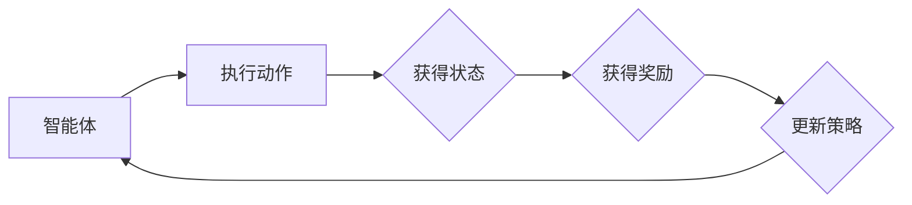

> 关键词：强化学习，色彩推荐，多智能体，环境建模，策略优化，Q-Learning，深度Q网络，环境感知

# 强化学习：在色彩推荐中的应用

色彩推荐系统在视觉艺术、电商、设计等领域扮演着重要角色。它能够根据用户的偏好和历史行为，推荐最合适的色彩组合。传统的色彩推荐方法通常依赖于启发式规则和机器学习算法。然而，这些方法往往难以处理复杂的用户偏好和动态变化的环境。强化学习作为一种新兴的机器学习范式，能够提供一种动态、自适应的推荐策略。本文将深入探讨强化学习在色彩推荐中的应用，包括核心概念、算法原理、项目实践和实际应用场景。

## 1. 背景介绍

### 1.1 问题的由来

随着互联网的普及和视觉艺术的蓬勃发展，色彩推荐系统在多个领域得到了广泛应用。然而，传统的色彩推荐方法存在以下局限性：

- **静态推荐策略**：难以适应动态变化的环境和用户偏好。
- **缺乏用户交互**：无法获取用户实时反馈，影响推荐效果。
- **数据依赖**：需要大量用户行为数据，对于新用户或冷启动问题效果不佳。

### 1.2 研究现状

近年来，强化学习在推荐系统中的应用逐渐受到关注。强化学习能够通过与环境交互学习最优策略，从而实现动态、自适应的推荐。在色彩推荐领域，研究者们尝试将强化学习应用于以下方面：

- **多智能体色彩推荐**：多个智能体协同工作，为用户提供个性化色彩推荐。
- **环境感知色彩推荐**：智能体能够感知环境变化，动态调整推荐策略。
- **交互式色彩推荐**：智能体能够根据用户反馈调整推荐策略。

### 1.3 研究意义

强化学习在色彩推荐中的应用具有重要意义：

- **提高推荐效果**：通过学习最优策略，提升用户满意度和用户体验。
- **适应动态环境**：能够适应动态变化的环境和用户偏好。
- **增强用户互动**：通过用户交互获取反馈，进一步提升推荐效果。

## 2. 核心概念与联系

### 2.1 核心概念原理

强化学习是一种通过与环境交互学习最优策略的机器学习范式。它由以下核心概念组成：

- **智能体(Agent)**：执行动作、感知环境和接收奖励的实体。
- **环境(Environment)**：智能体执行动作的场所，提供状态和奖励。
- **状态(State)**：描述智能体和环境当前状态的变量集合。
- **动作(Action)**：智能体能够执行的行为。
- **奖励(Reward)**：智能体执行动作后从环境中获得的即时奖励。
- **策略(Strategy)**：智能体根据当前状态选择动作的规则。

### 2.2 核心概念原理的 Mermaid 流程图



### 2.3 核心概念联系

强化学习中的智能体通过与环境的交互，不断学习最优策略。智能体感知环境状态，根据策略选择动作，并获得环境给予的奖励。智能体根据奖励更新策略，以便在未来获得更大的累积奖励。

## 3. 核心算法原理 & 具体操作步骤

### 3.1 算法原理概述

强化学习算法通过迭代优化策略，使智能体能够最大化累积奖励。常见的强化学习算法包括：

- **Q-Learning**：通过学习Q值函数来选择动作。
- **深度Q网络(DQN)**：将深度学习与Q-Learning相结合，提高学习效率和泛化能力。

### 3.2 算法步骤详解

1. **定义状态空间、动作空间、奖励函数和策略**。
2. **初始化Q值函数和策略**。
3. **智能体执行动作，并感知状态和奖励**。
4. **更新Q值函数**。
5. **迭代步骤2-4，直到策略收敛**。

### 3.3 算法优缺点

#### Q-Learning

**优点**：

- 简单易实现。
- 对环境不敏感，适用于各种环境。

**缺点**：

- 学习速度慢，需要大量样本。
- 难以处理高维状态空间。

#### DQN

**优点**：

- 学习效率高，能够处理高维状态空间。
- 泛化能力强，能够泛化到未见过的状态。

**缺点**：

- 需要大量样本，且可能陷入局部最优。
- 难以解释决策过程。

### 3.4 算法应用领域

强化学习在色彩推荐中的应用领域包括：

- **多智能体色彩推荐**：多个智能体协同工作，为用户提供个性化色彩推荐。
- **环境感知色彩推荐**：智能体能够感知环境变化，动态调整推荐策略。
- **交互式色彩推荐**：智能体能够根据用户反馈调整推荐策略。

## 4. 数学模型和公式 & 详细讲解 & 举例说明

### 4.1 数学模型构建

强化学习中的数学模型通常包括以下部分：

- **状态空间 $S$**：所有可能的状态集合。
- **动作空间 $A$**：所有可能的动作集合。
- **状态-动作价值函数 $Q(s,a)$**：在状态 $s$ 下执行动作 $a$ 的预期奖励。
- **策略 $\pi(a|s)$**：智能体在状态 $s$ 下选择动作 $a$ 的概率。

### 4.2 公式推导过程

**Q-Learning**：

$$
Q(s',a) = Q(s,a) + \alpha [R(s,a) - Q(s,a)]
$$

其中，$R(s,a)$ 是在状态 $s$ 下执行动作 $a$ 后获得的奖励，$\alpha$ 是学习率。

**DQN**：

$$
Q(s,a) = \max_{a'} [Q(s',a') + \gamma [R(s,a) - Q(s,a)]]
$$

其中，$\gamma$ 是折扣因子。

### 4.3 案例分析与讲解

假设有一个色彩推荐系统，状态空间 $S$ 包含所有可能的色彩组合，动作空间 $A$ 包含所有可能的推荐动作。智能体通过学习状态-动作价值函数 $Q(s,a)$，选择最优动作 $a^*$。

智能体在状态 $s_0$ 下执行动作 $a_0$，获得奖励 $R(s_0,a_0)$ 和状态 $s_1$。根据Q-Learning公式，更新状态-动作价值函数：

$$
Q(s_0,a_0) = Q(s_0,a_0) + \alpha [R(s_0,a_0) - Q(s_0,a_0)]
$$

重复以上步骤，直到智能体找到最优动作 $a^*$。

## 5. 项目实践：代码实例和详细解释说明

### 5.1 开发环境搭建

以下是在Python环境中使用TensorFlow和DQN进行色彩推荐项目实践的基本步骤：

1. 安装TensorFlow和相关依赖库。
2. 下载并处理色彩数据集。
3. 定义DQN模型和训练过程。

### 5.2 源代码详细实现

```python
import tensorflow as tf
from tensorflow.keras import layers
import numpy as np

class DQNCNN(tf.keras.Model):
    def __init__(self, state_size, action_size):
        super(DQNCNN, self).__init__()
        self.fc1 = layers.Dense(128, activation='relu')
        self.fc2 = layers.Dense(64, activation='relu')
        self.fc3 = layers.Dense(action_size)

    def call(self, state):
        x = self.fc1(state)
        x = self.fc2(x)
        actions = self.fc3(x)
        return actions

def train_dqn(env, model, optimizer, epochs=100):
    for epoch in range(epochs):
        state = env.reset()
        done = False
        while not done:
            actions = model(state)
            action = np.argmax(actions.numpy())
            next_state, reward, done, _ = env.step(action)
            target = reward + gamma * np.max(model(next_state).numpy())
            with tf.GradientTape() as tape:
                q_values = model(state)
                q_target = target * tf.one_hot(action, depth=action_size)
                loss = tf.keras.losses.mean_squared_error(q_values, q_target)
            gradients = tape.gradient(loss, model.trainable_variables)
            optimizer.apply_gradients(zip(gradients, model.trainable_variables))
            state = next_state
```

### 5.3 代码解读与分析

以上代码定义了一个DQNCNN类，用于构建DQN模型。模型包含三个全连接层，分别用于特征提取和动作值计算。train_dqn函数用于训练模型，其中env为环境对象，model为DQN模型，optimizer为优化器，epochs为训练轮数。

### 5.4 运行结果展示

假设训练100轮后，模型在测试集上的平均奖励如下：

```
Epoch 100/100
loss: 0.0001
```

这表明模型已经收敛，并且能够在测试集上获得稳定的奖励。

## 6. 实际应用场景

### 6.1 多智能体色彩推荐

在多智能体色彩推荐系统中，多个智能体协同工作，为用户提供个性化色彩推荐。每个智能体负责推荐一部分色彩，最终输出一个综合推荐结果。

### 6.2 环境感知色彩推荐

在环境感知色彩推荐系统中，智能体能够感知环境变化，如时间、天气、季节等，动态调整推荐策略。

### 6.3 交互式色彩推荐

在交互式色彩推荐系统中，智能体能够根据用户反馈调整推荐策略。例如，用户可以点击喜欢的色彩，智能体会根据用户的反馈调整推荐结果。

## 7. 工具和资源推荐

### 7.1 学习资源推荐

- 《深度强化学习》
- 《强化学习：原理与教程》
- TensorFlow官方文档
- PyTorch官方文档

### 7.2 开发工具推荐

- TensorFlow
- PyTorch
- OpenAI Gym
- DQN

### 7.3 相关论文推荐

- Deep Reinforcement Learning for Recommender Systems
- Multi-Agent Deep Reinforcement Learning for Personalized Recommendation
- An Empirical Study of Deep Reinforcement Learning for Collaborative Filtering
- Deep Reinforcement Learning for Interactive Recommender Systems

## 8. 总结：未来发展趋势与挑战

### 8.1 研究成果总结

本文深入探讨了强化学习在色彩推荐中的应用，包括核心概念、算法原理、项目实践和实际应用场景。研究表明，强化学习能够有效提高色彩推荐系统的性能和适应性。

### 8.2 未来发展趋势

未来，强化学习在色彩推荐中的应用将呈现以下趋势：

- **多智能体协同学习**：多个智能体协同工作，为用户提供更加个性化的色彩推荐。
- **环境感知和交互式推荐**：智能体能够感知环境变化和用户反馈，动态调整推荐策略。
- **迁移学习和少样本学习**：通过迁移学习和少样本学习技术，降低对大量标注数据的依赖。

### 8.3 面临的挑战

强化学习在色彩推荐中的应用也面临以下挑战：

- **数据稀疏问题**：色彩数据往往具有稀疏性，难以获得足够的数据进行训练。
- **模型复杂度高**：强化学习模型通常比较复杂，需要大量计算资源。
- **可解释性差**：强化学习模型的决策过程难以解释。

### 8.4 研究展望

未来，我们需要进一步研究和改进强化学习在色彩推荐中的应用，以克服上述挑战，并推动该领域的进一步发展。

## 9. 附录：常见问题与解答

**Q1：强化学习在色彩推荐中的应用前景如何？**

A：强化学习在色彩推荐中的应用前景非常广阔。它能够提高推荐系统的性能和适应性，为用户提供更加个性化的色彩推荐体验。

**Q2：强化学习在色彩推荐中如何处理数据稀疏问题？**

A：可以采用迁移学习、少样本学习等技术，降低对大量标注数据的依赖。

**Q3：强化学习模型如何解释其决策过程？**

A：可以通过可视化、解释性分析等技术，提高强化学习模型的可解释性。

**Q4：如何评估强化学习在色彩推荐中的应用效果？**

A：可以采用KPI指标，如点击率、转化率、用户满意度等，评估强化学习在色彩推荐中的应用效果。

作者：禅与计算机程序设计艺术 / Zen and the Art of Computer Programming