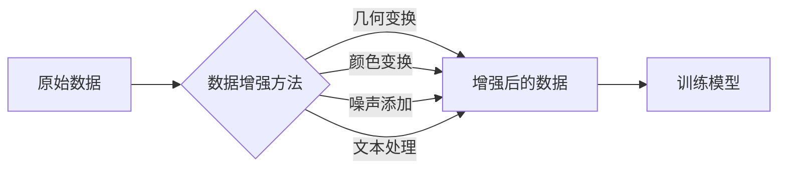

# 数据增强Data Augmentation原理与代码实例讲解

> 关键词：数据增强，机器学习，深度学习，图像识别，计算机视觉，增强方法，实例讲解，代码实践

## 1. 背景介绍

在机器学习和深度学习领域，数据是模型的基石。然而，高质量标注数据的获取往往成本高昂且耗时费力。为了缓解数据稀缺的问题，数据增强（Data Augmentation）技术应运而生。数据增强通过模拟数据生成的方式，在有限的数据集上创造出更多样化的样本，从而提升模型的泛化能力和鲁棒性。

## 2. 核心概念与联系

### 2.1 核心概念原理

数据增强的核心思想是通过对原始数据进行一系列随机变换，生成新的数据样本，以此来扩充训练集。这些变换可以是几何变换、颜色变换、噪声添加等，具体取决于数据的类型和任务。

以下是数据增强中常见的几种变换：

- **几何变换**：包括旋转、缩放、裁剪、翻转等，用于增加图像的视角多样性。
- **颜色变换**：包括调整亮度、对比度、饱和度等，用于增强图像的视觉多样性。
- **噪声添加**：在数据中添加随机噪声，提高模型对噪声数据的鲁棒性。
- **文本处理**：包括随机删除字符、替换字符、打乱顺序等，用于文本数据的增强。

### 2.2 架构的 Mermaid 流程图



## 3. 核心算法原理 & 具体操作步骤

### 3.1 算法原理概述

数据增强算法通常包括以下几个步骤：

1. 对原始数据进行预处理，如归一化、标准化等。
2. 根据预定的增强方法，对数据进行随机变换。
3. 将增强后的数据用于模型训练。

### 3.2 算法步骤详解

1. **数据预处理**：对原始数据进行预处理，例如归一化图像的像素值到[0,1]区间。
2. **选择增强方法**：根据任务和数据类型，选择合适的增强方法，如随机翻转、随机裁剪等。
3. **增强数据生成**：对每个样本应用选定的增强方法，生成新的数据样本。
4. **模型训练**：将原始数据和增强后的数据混合在一起，用于模型训练。

### 3.3 算法优缺点

**优点**：

- 扩充训练集，提高模型的泛化能力。
- 降低对大量标注数据的依赖。
- 提高模型对噪声和异常值的鲁棒性。

**缺点**：

- 增强方法的选择和参数设置对模型性能有较大影响。
- 可能引入不合理的样本，导致过拟合。
- 增强数据的质量可能低于原始数据。

### 3.4 算法应用领域

数据增强技术在图像识别、语音识别、文本分类等多个领域都有广泛应用。

## 4. 数学模型和公式 & 详细讲解 & 举例说明

### 4.1 数学模型构建

在图像增强中，常用的几何变换包括旋转、缩放、裁剪和翻转。以下是对这些变换的数学描述：

- **旋转**：将图像围绕中心点旋转一个角度 $\theta$：
  $$
  R(\theta) = \begin{bmatrix}
  \cos(\theta) & -\sin(\theta) \\
  \sin(\theta) & \cos(\theta)
  \end{bmatrix}
  $$
- **缩放**：将图像缩放一个比例 $s$：
  $$
  S(s) = \begin{bmatrix}
  s & 0 \\
  0 & s
  \end{bmatrix}
  $$
- **裁剪**：从图像中裁剪出一个大小为 $(w, h)$ 的矩形区域：
  $$
  C(x, y, w, h) = \begin{bmatrix}
  1 & 0 & 0 & 0 \\
  0 & 1 & 0 & 0 \\
  0 & 0 & 1 & 0 \\
  0 & 0 & 0 & 1
  \end{bmatrix}
  \begin{bmatrix}
  x & y & 0 & 0 \\
  0 & 0 & w & h \\
  0 & 0 & 0 & 0 \\
  0 & 0 & 0 & 1
  \end{bmatrix}
  $$
- **翻转**：沿x轴或y轴翻转图像：
  $$
  F_x = \begin{bmatrix}
  -1 & 0 \\
  0 & 1
  \end{bmatrix}, \quad F_y = \begin{bmatrix}
  1 & 0 \\
  0 & -1
  \end{bmatrix}
  $$

### 4.2 公式推导过程

以上公式的推导过程涉及到线性代数和图像处理的基本概念，具体推导过程可参考相关书籍和文献。

### 4.3 案例分析与讲解

以下是一个使用Python的OpenCV库进行图像旋转的示例：

```python
import cv2

# 读取图像
image = cv2.imread('image.jpg')

# 设置旋转中心，旋转角度和旋转矩阵
center = (image.shape[1] // 2, image.shape[0] // 2)
angle = 45
rotation_matrix = cv2.getRotationMatrix2D(center, angle, 1.0)

# 获取旋转后的图像大小
cos = np.abs(rotation_matrix[0, 0])
sin = np.abs(rotation_matrix[0, 1])

new_width = int((image.shape[1] * sin) + (image.shape[0] * cos))
new_height = int((image.shape[0] * cos) + (image.shape[1] * sin))

# 调整旋转矩阵以包含平移
rotation_matrix[0, 2] += (new_width / 2) - center[0]
rotation_matrix[1, 2] += (new_height / 2) - center[1]

# 应用旋转
rotated_image = cv2.warpAffine(image, rotation_matrix, (new_width, new_height))

# 保存或显示图像
cv2.imwrite('rotated_image.jpg', rotated_image)
cv2.imshow('Rotated Image', rotated_image)
cv2.waitKey(0)
cv2.destroyAllWindows()
```

## 5. 项目实践：代码实例和详细解释说明

### 5.1 开发环境搭建

为了进行数据增强的实践，你需要以下开发环境：

- Python 3.x
- OpenCV库
- NumPy库

你可以使用pip安装所需的库：

```bash
pip install opencv-python numpy
```

### 5.2 源代码详细实现

以下是一个使用OpenCV进行图像增强的Python代码示例：

```python
import cv2
import numpy as np

def rotate_image(image, angle):
    center = (image.shape[1] // 2, image.shape[0] // 2)
    rotation_matrix = cv2.getRotationMatrix2D(center, angle, 1.0)
    cos = np.abs(rotation_matrix[0, 0])
    sin = np.abs(rotation_matrix[0, 1])
    new_width = int((image.shape[1] * sin) + (image.shape[0] * cos))
    new_height = int((image.shape[0] * cos) + (image.shape[1] * sin))
    rotation_matrix[0, 2] += (new_width / 2) - center[0]
    rotation_matrix[1, 2] += (new_height / 2) - center[1]
    rotated_image = cv2.warpAffine(image, rotation_matrix, (new_width, new_height))
    return rotated_image

def flip_image(image, flip_code):
    if flip_code == 0:
        flipped_image = cv2.flip(image, 0)  # 翻转x轴
    elif flip_code == 1:
        flipped_image = cv2.flip(image, 1)  # 翻转y轴
    else:
        flipped_image = cv2.flip(image, -1)  # 翻转x轴和y轴
    return flipped_image

# 读取图像
image = cv2.imread('image.jpg')

# 应用增强方法
rotated_image = rotate_image(image, 45)
flipped_image = flip_image(image, 0)

# 显示结果
cv2.imshow('Original Image', image)
cv2.imshow('Rotated Image', rotated_image)
cv2.imshow('Flipped Image', flipped_image)
cv2.waitKey(0)
cv2.destroyAllWindows()
```

### 5.3 代码解读与分析

这段代码定义了两个函数：`rotate_image` 和 `flip_image`。`rotate_image` 函数根据指定的角度旋转图像，`flip_image` 函数根据指定的翻转代码翻转图像。

在 `rotate_image` 函数中，我们首先计算旋转中心、旋转角度和旋转矩阵。然后，我们计算旋转后的图像大小，并调整旋转矩阵以包含平移。最后，我们使用 `cv2.warpAffine` 函数应用旋转。

在 `flip_image` 函数中，我们根据指定的翻转代码使用 `cv2.flip` 函数翻转图像。

### 5.4 运行结果展示

运行上述代码后，你将看到三个窗口，分别显示原始图像、旋转后的图像和翻转后的图像。

## 6. 实际应用场景

数据增强技术在以下应用场景中非常有用：

- **图像识别**：通过增加图像的多样性，提高模型在图像识别任务中的性能。
- **语音识别**：通过增加语音的多样性，提高模型在语音识别任务中的鲁棒性。
- **文本分类**：通过增加文本的多样性，提高模型在文本分类任务中的泛化能力。
- **推荐系统**：通过增加用户的兴趣特征，提高推荐系统的个性化程度。

## 7. 工具和资源推荐

### 7.1 学习资源推荐

- 《Python图像处理实践》
- 《深度学习与计算机视觉》
- 《机器学习实战》

### 7.2 开发工具推荐

- OpenCV：用于图像处理
- NumPy：用于数值计算
- TensorFlow或PyTorch：用于深度学习

### 7.3 相关论文推荐

- Data Augmentation for Image Recognition

## 8. 总结：未来发展趋势与挑战

### 8.1 研究成果总结

数据增强技术是缓解数据稀缺问题的重要手段，通过增加数据的多样性和丰富度，提高模型的泛化能力和鲁棒性。

### 8.2 未来发展趋势

- 开发更加智能的数据增强方法，能够根据任务需求自动选择合适的增强方法。
- 结合深度学习技术，实现端到端的数据增强。
- 将数据增强技术应用于更多领域，如文本、语音、视频等。

### 8.3 面临的挑战

- 选择合适的增强方法需要经验和技巧。
- 增强数据的质量可能低于原始数据。
- 增强方法可能引入偏差，影响模型的公平性。

### 8.4 研究展望

数据增强技术在机器学习和深度学习领域具有广阔的应用前景，未来需要更多的研究和探索，以推动数据增强技术的进一步发展。

## 9. 附录：常见问题与解答

**Q1：数据增强是否适用于所有类型的任务？**

A1：数据增强适用于大多数图像识别、语音识别和文本分类等任务。但对于一些需要精确特征的任务，如医学图像分析，可能需要更加谨慎地使用数据增强。

**Q2：如何选择合适的增强方法？**

A2：选择合适的增强方法需要根据任务和数据的特性进行。一般来说，可以先尝试常用的增强方法，如旋转、缩放、裁剪等，然后根据实验结果进行调整。

**Q3：数据增强是否会降低模型性能？**

A3：适度使用数据增强可以提高模型性能。但如果增强方法不当或过度使用，可能会导致模型性能下降。

**Q4：数据增强是否会导致过拟合？**

A4：适度使用数据增强不会导致过拟合。但如果增强方法不当或过度使用，可能会引入偏差，导致过拟合。

**Q5：数据增强是否适用于所有数据类型？**

A5：数据增强主要适用于图像和视频等视觉数据。对于文本和音频等数据，可以使用其他类似的技术，如文本摘要、文本风格转换等。

作者：禅与计算机程序设计艺术 / Zen and the Art of Computer Programming