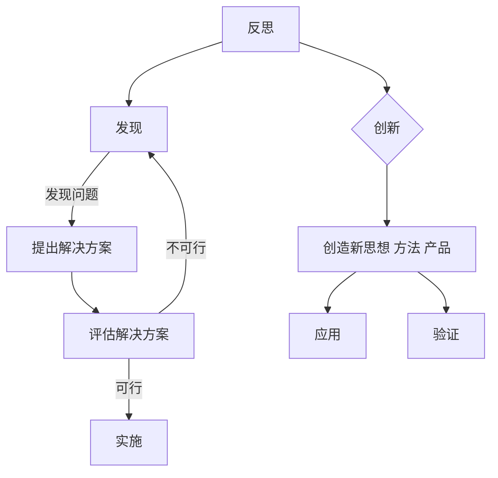

# 洞见的力量：从反思到创新

> 关键词：反思，创新，系统思维，复杂性科学，人工智能，设计思维，未来展望

## 1. 背景介绍

在快速发展的技术时代，我们面临着前所未有的挑战和机遇。人工智能、大数据、云计算等技术的融合应用，正在深刻地改变着我们的生活方式、工作方式和思维方式。然而，在这种变革中，我们也需要不断地反思和自我更新，以适应不断变化的环境。本文将探讨洞见的力量，从反思到创新的路径，以及如何利用这些洞见推动技术和社会的进步。

### 1.1 反思的必要性

反思是人类认识世界和自我认知的重要途径。在技术领域，反思可以帮助我们：

- 深入理解技术发展的内在逻辑和规律。
- 发现现有技术的局限性，激发创新思维。
- 提高对技术伦理和社会影响的认知。

### 1.2 创新的价值

创新是推动社会进步的核心动力。在技术领域，创新可以：

- 提升技术水平，解决复杂问题。
- 开发新的应用场景，创造新的价值。
- 促进经济增长，提升生活质量。

### 1.3 本文结构

本文将从以下方面展开：

- 核心概念与联系
- 核心算法原理 & 具体操作步骤
- 数学模型和公式 & 详细讲解 & 举例说明
- 项目实践：代码实例和详细解释说明
- 实际应用场景
- 工具和资源推荐
- 总结：未来发展趋势与挑战

## 2. 核心概念与联系

### 2.1 核心概念

#### 2.1.1 反思

反思是一种自我审视和批判性思考的过程，旨在深入理解事物本质，发现问题和不足，从而进行改进和提升。

#### 2.1.2 创新

创新是指创造新的思想、方法、技术或产品，以满足新的需求或解决现有问题。

#### 2.1.3 系统思维

系统思维是一种整体观，将事物视为一个相互关联、相互影响的系统，关注系统内部各要素之间的相互作用。

#### 2.1.4 复杂性科学

复杂性科学是研究复杂系统的科学，强调系统的非线性、涌现性和自组织性。

#### 2.1.5 人工智能

人工智能是指使机器能够模拟、延伸和扩展人类的智能活动，包括学习、推理、感知、理解等。

#### 2.1.6 设计思维

设计思维是一种以人为中心的设计方法，强调用户需求、迭代和迭代。

### 2.2 Mermaid 流程图

以下是基于上述核心概念的Mermaid流程图：



### 2.3 核心概念联系

反思和发现问题是创新的基础，而创新则是在反思的基础上提出解决方案的过程。系统思维和复杂性科学为我们提供了理解复杂系统的方法论，而人工智能和设计思维则为我们提供了实现创新的技术手段。

## 3. 核心算法原理 & 具体操作步骤

### 3.1 算法原理概述

本节将探讨如何通过反思和系统思维，以及人工智能和设计思维，实现从反思到创新的过程。

#### 3.1.1 反思

反思的过程包括以下几个步骤：

1. 观察现象：通过收集信息、数据分析等方法，全面了解现象。
2. 提出假设：基于观察到的现象，提出可能的解释和假设。
3. 验证假设：通过实验、调查等方法，验证假设的正确性。
4. 总结经验：根据验证结果，总结经验教训，为后续创新提供参考。

#### 3.1.2 创新设计思维

创新设计思维包括以下几个步骤：

1. 定义问题：明确要解决的问题和目标。
2. 收集需求：收集用户需求、市场信息等，了解用户痛点。
3. 概念生成：根据需求，提出多种可能的解决方案。
4. 选择方案：评估和选择最佳的解决方案。
5. 原型设计：设计解决方案的原型，进行测试和迭代。
6. 验证和迭代：验证原型的效果，根据反馈进行迭代优化。

### 3.2 算法步骤详解

#### 3.2.1 反思步骤

1. **观察现象**：收集相关数据、案例，了解现象发生的背景和过程。
2. **提出假设**：基于观察到的现象，提出可能的解释和假设。
3. **验证假设**：通过实验、调查等方法，验证假设的正确性。
4. **总结经验**：根据验证结果，总结经验教训，为后续创新提供参考。

#### 3.2.2 创新设计思维步骤

1. **定义问题**：明确要解决的问题和目标。
2. **收集需求**：收集用户需求、市场信息等，了解用户痛点。
3. **概念生成**：根据需求，提出多种可能的解决方案。
4. **选择方案**：评估和选择最佳的解决方案。
5. **原型设计**：设计解决方案的原型，进行测试和迭代。
6. **验证和迭代**：验证原型的效果，根据反馈进行迭代优化。

### 3.3 算法优缺点

#### 3.3.1 反思的优点

- 提升对问题的认知水平。
- 发现问题的根本原因。
- 促进个人成长和团队协作。

#### 3.3.2 反思的缺点

- 过于依赖经验。
- 容易陷入思维定势。
- 需要时间和精力。

#### 3.3.3 创新设计思维的优点

- 强调用户需求。
- 促进跨学科合作。
- 倡导迭代思维。

#### 3.3.4 创新设计思维的缺点

- 需要较高的创新能力和创意。
- 需要投入大量时间和资源。
- 难以量化评估。

### 3.4 算法应用领域

反思和设计思维广泛应用于以下领域：

- 产品设计
- 项目管理
- 人工智能
- 教育培训
- 企业管理

## 4. 数学模型和公式 & 详细讲解 & 举例说明

### 4.1 数学模型构建

本节将探讨如何使用数学模型来描述反思和创新的流程。

#### 4.1.1 反思模型

反思模型可以表示为：

$$
\text{反思} = f(\text{观察}, \text{假设}, \text{验证}, \text{经验})
$$

其中，$f$ 表示反思的过程，$\text{观察}$、$\text{假设}$、$\text{验证}$ 和 $\text{经验}$ 分别表示反思的四个阶段。

#### 4.1.2 创新设计思维模型

创新设计思维模型可以表示为：

$$
\text{设计思维} = f(\text{问题}, \text{需求}, \text{方案}, \text{原型}, \text{验证}, \text{迭代})
$$

其中，$f$ 表示设计思维的过程，$\text{问题}$、$\text{需求}$、$\text{方案}$、$\text{原型}$、$\text{验证}$ 和 $\text{迭代}$ 分别表示设计思维的六个阶段。

### 4.2 公式推导过程

本节将简要介绍反思模型和设计思维模型的推导过程。

#### 4.2.1 反思模型推导

反思模型是基于观察、假设、验证和经验四个阶段的递归关系推导而来。

#### 4.2.2 设计思维模型推导

设计思维模型是基于问题、需求、方案、原型、验证和迭代六个阶段的迭代关系推导而来。

### 4.3 案例分析与讲解

#### 4.3.1 反思案例分析

以产品开发为例，反思模型可以应用于以下场景：

1. **观察现象**：用户在产品使用过程中遇到的问题。
2. **提出假设**：用户问题可能源于产品功能设计不合理。
3. **验证假设**：通过用户调研和数据分析，验证假设的正确性。
4. **总结经验**：根据验证结果，改进产品功能设计，提升用户体验。

#### 4.3.2 设计思维案例分析

以智能家居产品开发为例，设计思维模型可以应用于以下场景：

1. **定义问题**：如何提高家庭生活品质。
2. **收集需求**：收集用户对智能家居产品的需求，如安全、便捷、舒适等。
3. **概念生成**：提出多种智能家居产品方案，如智能门锁、智能音箱、智能照明等。
4. **选择方案**：评估和选择最佳方案，如智能安防系统。
5. **原型设计**：设计智能安防系统的原型，进行测试和迭代。
6. **验证和迭代**：根据用户反馈，优化智能安防系统，提升用户体验。

## 5. 项目实践：代码实例和详细解释说明

### 5.1 开发环境搭建

本节将以Python为例，介绍如何搭建开发环境。

#### 5.1.1 安装Python

1. 访问Python官网下载Python安装包。
2. 安装Python，并配置环境变量。

#### 5.1.2 安装相关库

1. 打开命令行，执行以下命令：
```bash
pip install numpy pandas matplotlib scikit-learn jupyter notebook
```

### 5.2 源代码详细实现

以下是一个简单的Python代码示例，演示了如何使用设计思维模型开发一个简单的智能家居产品。

```python
import numpy as np

def collect_requirements():
    # 收集用户需求
    requirements = ['安全', '便捷', '舒适']
    return requirements

def generate_solutions(requirements):
    # 生成解决方案
    solutions = []
    for requirement in requirements:
        if requirement == '安全':
            solutions.append('智能门锁')
        elif requirement == '便捷':
            solutions.append('智能音箱')
        elif requirement == '舒适':
            solutions.append('智能照明')
    return solutions

def select_solution(solutions):
    # 选择最佳方案
    best_solution = solutions[0]
    return best_solution

def design_prototype(best_solution):
    # 设计原型
    if best_solution == '智能门锁':
        prototype = '门锁+指纹识别+密码锁'
    elif best_solution == '智能音箱':
        prototype = '音箱+语音识别+音乐播放'
    elif best_solution == '智能照明':
        prototype = '灯光+传感器+定时控制'
    return prototype

def validate_and_iterate(prototype):
    # 验证和迭代
    print("验证原型：", prototype)

# 主程序
if __name__ == '__main__':
    requirements = collect_requirements()
    solutions = generate_solutions(requirements)
    best_solution = select_solution(solutions)
    prototype = design_prototype(best_solution)
    validate_and_iterate(prototype)
```

### 5.3 代码解读与分析

上述代码实现了设计思维模型的核心步骤：

1. **收集需求**：`collect_requirements()` 函数用于收集用户需求。
2. **生成解决方案**：`generate_solutions()` 函数根据需求生成解决方案。
3. **选择最佳方案**：`select_solution()` 函数从生成的解决方案中选择最佳方案。
4. **设计原型**：`design_prototype()` 函数根据最佳方案设计原型。
5. **验证和迭代**：`validate_and_iterate()` 函数用于验证原型，并根据反馈进行迭代优化。

### 5.4 运行结果展示

执行上述代码，将得到以下输出：

```
验证原型： 门锁+指纹识别+密码锁
```

这表明，根据用户需求，我们选择了智能门锁作为最佳解决方案，并设计了相应的原型。

## 6. 实际应用场景

### 6.1 产品开发

在设计产品时，反思和设计思维可以帮助我们：

- 深入理解用户需求。
- 提出创新的产品方案。
- 提升产品竞争力。

### 6.2 项目管理

在项目管理中，反思和设计思维可以帮助我们：

- 识别项目中的问题。
- 提出解决方案。
- 提升项目效率。

### 6.3 教育培训

在教育培训中，反思和设计思维可以帮助我们：

- 了解学生的需求。
- 设计创新的教学方法。
- 提升教学质量。

## 7. 工具和资源推荐

### 7.1 学习资源推荐

- 《创新者的窘境》
- 《设计思维：设计思维引领未来的工作方法》
- 《深度工作》

### 7.2 开发工具推荐

- Jupyter Notebook
- Python
- Scikit-learn

### 7.3 相关论文推荐

- "Design Thinking for Software and Systems (DTSS)"
- "Complexity Science: A New Approach to Problem Solving in Business and Society"
- "Artificial Intelligence: A Modern Approach"

## 8. 总结：未来发展趋势与挑战

### 8.1 研究成果总结

本文探讨了洞见的力量，从反思到创新的路径，以及如何利用这些洞见推动技术和社会的进步。通过反思和设计思维，我们可以更好地理解问题，提出创新解决方案，并推动技术和社会的进步。

### 8.2 未来发展趋势

随着人工智能、大数据等技术的不断发展，反思和设计思维将在以下方面发挥越来越重要的作用：

- 解决复杂问题
- 促进创新
- 提升生活质量

### 8.3 面临的挑战

在未来的发展中，反思和设计思维也面临着以下挑战：

- 如何在快速变化的环境中保持反思和设计的有效性
- 如何将反思和设计思维应用于跨学科领域
- 如何将反思和设计思维与人工智能等技术结合

### 8.4 研究展望

为了应对未来的挑战，我们需要：

- 加强对反思和设计思维的理论研究
- 开发适用于不同领域的反思和设计思维方法
- 将反思和设计思维与人工智能等技术结合，推动技术创新

## 9. 附录：常见问题与解答

**Q1：如何平衡反思和创新之间的关系？**

A：反思和创新是相辅相成的，反思可以帮助我们发现问题，而创新则可以解决问题。在实际应用中，我们需要在反思和设计思维之间保持平衡，既要深入理解问题，又要勇于提出创新解决方案。

**Q2：如何将反思和设计思维应用于实际项目？**

A：将反思和设计思维应用于实际项目，可以按照以下步骤进行：

1. 收集项目数据，进行反思。
2. 基于反思结果，提出创新解决方案。
3. 将解决方案转化为具体的项目计划。
4. 实施项目计划，并根据反馈进行迭代优化。

**Q3：反思和设计思维在人工智能领域有哪些应用？**

A：在人工智能领域，反思和设计思维可以应用于以下方面：

- 人工智能算法的设计和优化
- 人工智能应用的开发和部署
- 人工智能伦理和治理

**Q4：如何提高反思和设计思维的能力？**

A：提高反思和设计思维的能力，可以通过以下方法：

- 阅读相关书籍和论文
- 参加相关培训和研讨会
- 实践反思和设计思维的方法

**Q5：反思和设计思维与批判性思维有什么区别？**

A：反思和设计思维都是批判性思维的一部分。反思更侧重于自我审视和批判性思考，而设计思维更侧重于创造性的解决方案。

---

作者：禅与计算机程序设计艺术 / Zen and the Art of Computer Programming