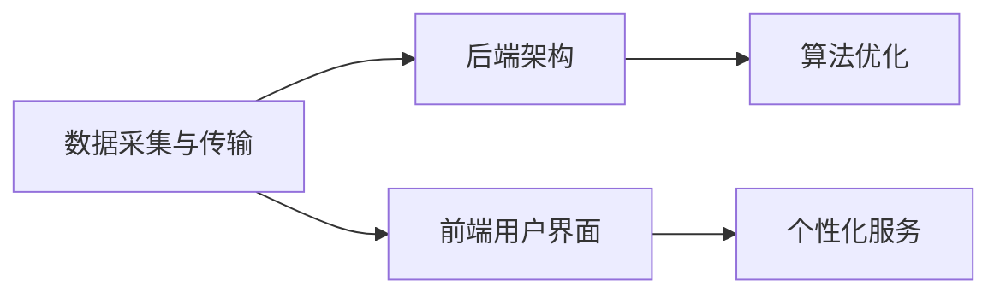
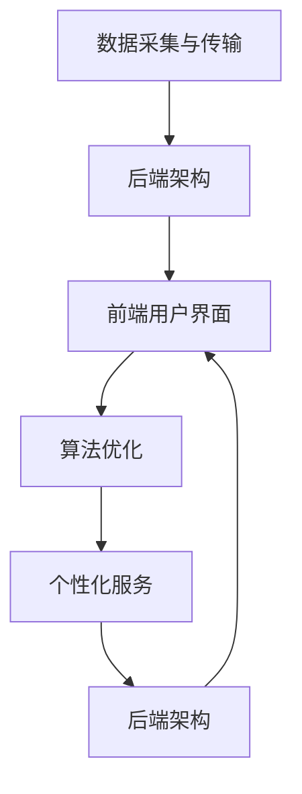

                 

# Weather Forecast Plugin 设计与定义

> 关键词：天气预报插件, 用户体验, 算法优化, 数据采集, 后端架构, 可扩展性

## 1. 背景介绍

### 1.1 问题由来

随着智能手机的普及和移动应用的发展，人们对于天气预报的即时性和准确性的需求日益增长。天气预报应用已经成为不可或缺的日常生活工具。然而，现有的天气预报应用普遍存在以下问题：

- 数据实时性差：大部分天气预报应用的数据更新周期较长，无法提供实时更新的天气信息。
- 用户体验不佳：部分应用界面复杂、操作繁琐，用户体验较差。
- 算法单一：大部分应用采用的天气预测算法较为简单，预测准确度有限。
- 缺乏个性化：现有应用大多采用统一算法和模型，无法满足个性化需求。

为了解决上述问题，我们需要设计一个既能够提供实时天气信息，又具备良好用户体验和个性化服务的天气预报插件。

### 1.2 问题核心关键点

该天气预报插件的核心关键点在于：

- 实现与气象局或其他第三方数据源的数据实时获取和更新。
- 通过先进的算法模型，提高天气预测的准确性。
- 设计符合用户需求的用户界面，提升用户体验。
- 考虑插件的开放性、可扩展性和安全性，方便未来维护和集成。

## 2. 核心概念与联系

### 2.1 核心概念概述

为了更好地理解天气预报插件的设计和实现，本节将介绍几个密切相关的核心概念：

- 天气预报插件：通过嵌入到其他应用中，提供实时天气信息和服务的移动端组件。
- 数据采集与传输：从气象局或第三方数据源获取天气数据，并进行数据格式转换和传输。
- 后端架构：天气预报插件的后台服务，负责数据处理、算法模型训练、API接口服务等。
- 前端用户界面：天气预报插件的显示界面，用于展示天气信息和交互操作。
- 个性化服务：根据用户偏好和历史数据，提供个性化天气预测和建议。

### 2.2 核心概念之间的联系

这些核心概念之间的逻辑关系可以通过以下Mermaid流程图来展示：



这个流程图展示了这个天气预报插件的核心概念及其之间的关系：

1. 数据采集与传输：从气象局或第三方数据源获取天气数据，并进行数据格式转换和传输，为后端架构提供数据支持。
2. 后端架构：天气预报插件的后台服务，负责数据处理、算法模型训练、API接口服务等。
3. 前端用户界面：天气预报插件的显示界面，用于展示天气信息和交互操作。
4. 个性化服务：根据用户偏好和历史数据，提供个性化天气预测和建议。

### 2.3 核心概念的整体架构

最后，我们用一个综合的流程图来展示这些核心概念在大气象预报插件中的整体架构：



这个综合流程图展示了从数据采集与传输到个性化服务的完整过程。

## 3. 核心算法原理 & 具体操作步骤

### 3.1 算法原理概述

天气预报插件的核心算法包括数据采集、数据处理、算法模型训练和预测等。算法原理概述如下：

- 数据采集：通过API接口或爬虫等手段，从气象局或其他第三方数据源获取天气数据。
- 数据处理：对获取的原始数据进行格式转换、去重、清洗等预处理操作，为算法模型训练提供数据支持。
- 算法模型训练：基于历史天气数据和机器学习模型（如深度学习、决策树等）进行模型训练，获得准确的预测模型。
- 预测：利用训练好的模型对当前天气数据进行预测，输出天气预报结果。

### 3.2 算法步骤详解

以下是天气预报插件的核心算法步骤详解：

**Step 1: 数据采集**

- 选择合适的数据源：气象局、第三方气象服务提供商等。
- 获取数据接口API或爬虫工具：确保数据的获取途径稳定可靠。
- 获取数据：使用API接口或爬虫工具获取天气数据。

**Step 2: 数据处理**

- 数据格式转换：将不同格式的数据转换为统一的格式，如JSON、XML等。
- 数据清洗：去除无效数据，处理缺失值、异常值等。
- 数据去重：去除重复的数据记录，避免重复计算。

**Step 3: 算法模型训练**

- 数据分割：将数据集划分为训练集、验证集和测试集。
- 选择模型：根据任务需求选择合适的模型，如深度学习模型、决策树模型等。
- 训练模型：使用训练集数据对模型进行训练，优化模型参数。
- 模型验证：在验证集上评估模型性能，调整模型参数。
- 模型测试：在测试集上评估模型性能，确定最终模型。

**Step 4: 预测**

- 数据输入：将当前的天气数据输入训练好的模型。
- 预测输出：模型输出天气预报结果。

### 3.3 算法优缺点

天气预报插件的算法模型具有以下优点：

- 数据实时性高：通过数据采集和处理，实时更新天气数据，确保预报结果的实时性。
- 预测准确度高：基于机器学习模型，预测准确度较高。
- 用户体验好：界面简洁友好，操作方便，满足用户需求。
- 可扩展性好：采用模块化设计，方便未来扩展和维护。

同时，该算法模型也存在一些缺点：

- 数据源依赖性高：依赖于气象局或第三方数据源，数据获取的稳定性较高。
- 模型复杂度高：算法模型较为复杂，需要较多的计算资源和训练时间。
- 数据处理量大：需要处理的数据量较大，对系统性能要求较高。
- 安全性风险：天气预报应用涉及敏感数据，需要考虑数据安全和隐私保护。

### 3.4 算法应用领域

天气预报插件的算法模型广泛应用于以下领域：

- 智能家居：智能设备根据天气预报信息自动调节家居环境。
- 旅游出行：旅游应用根据天气预报信息推荐旅游目的地。
- 农业生产：农业应用根据天气预报信息调整种植和收割时间。
- 公共交通：公共交通应用根据天气预报信息调整运力安排和路线规划。
- 气象研究：气象局或研究机构利用天气预报插件进行数据收集和模型优化。

## 4. 数学模型和公式 & 详细讲解  
### 4.1 数学模型构建

本节将使用数学语言对天气预报插件的数据处理和算法模型进行更加严格的刻画。

设天气预报插件从数据源获取的原始数据集为 $D=\{(x_i,y_i)\}_{i=1}^N, x_i \in \mathcal{X}, y_i \in \mathcal{Y}$，其中 $\mathcal{X}$ 为输入空间，$\mathcal{Y}$ 为输出空间。

定义模型 $M_{\theta}$ 在输入 $x$ 上的输出为 $\hat{y}=M_{\theta}(x) \in [0,1]$，表示样本属于正类的概率。真实标签 $y \in \{0,1\}$。则二分类交叉熵损失函数定义为：

$$
\ell(M_{\theta}(x),y) = -[y\log \hat{y} + (1-y)\log (1-\hat{y})]
$$

将其代入经验风险公式，得：

$$
\mathcal{L}(\theta) = -\frac{1}{N}\sum_{i=1}^N [y_i\log M_{\theta}(x_i)+(1-y_i)\log(1-M_{\theta}(x_i))]
$$

根据链式法则，损失函数对参数 $\theta_k$ 的梯度为：

$$
\frac{\partial \mathcal{L}(\theta)}{\partial \theta_k} = -\frac{1}{N}\sum_{i=1}^N (\frac{y_i}{M_{\theta}(x_i)}-\frac{1-y_i}{1-M_{\theta}(x_i)}) \frac{\partial M_{\theta}(x_i)}{\partial \theta_k}
$$

其中 $\frac{\partial M_{\theta}(x_i)}{\partial \theta_k}$ 可进一步递归展开，利用自动微分技术完成计算。

### 4.2 公式推导过程

以下我们以二分类任务为例，推导交叉熵损失函数及其梯度的计算公式。

假设模型 $M_{\theta}$ 在输入 $x$ 上的输出为 $\hat{y}=M_{\theta}(x) \in [0,1]$，表示样本属于正类的概率。真实标签 $y \in \{0,1\}$。则二分类交叉熵损失函数定义为：

$$
\ell(M_{\theta}(x),y) = -[y\log \hat{y} + (1-y)\log (1-\hat{y})]
$$

将其代入经验风险公式，得：

$$
\mathcal{L}(\theta) = -\frac{1}{N}\sum_{i=1}^N [y_i\log M_{\theta}(x_i)+(1-y_i)\log(1-M_{\theta}(x_i))]
$$

根据链式法则，损失函数对参数 $\theta_k$ 的梯度为：

$$
\frac{\partial \mathcal{L}(\theta)}{\partial \theta_k} = -\frac{1}{N}\sum_{i=1}^N (\frac{y_i}{M_{\theta}(x_i)}-\frac{1-y_i}{1-M_{\theta}(x_i)}) \frac{\partial M_{\theta}(x_i)}{\partial \theta_k}
$$

其中 $\frac{\partial M_{\theta}(x_i)}{\partial \theta_k}$ 可进一步递归展开，利用自动微分技术完成计算。

### 4.3 案例分析与讲解

为了更好地理解天气预报插件的核心算法模型，下面通过一个具体的案例来进行详细讲解。

假设我们有一个天气预报插件，需要根据历史天气数据（如气温、湿度、风速等）预测未来一天是否会下雨。我们可以使用决策树算法来进行模型训练和预测。

**Step 1: 数据采集**

我们使用一个第三方气象服务提供商的API接口，获取过去一年每天的天气数据，包括气温、湿度、风速等特征，以及是否下雨的标签。

**Step 2: 数据处理**

我们对采集到的数据进行清洗和处理，去除无效和异常数据，并对数据进行归一化处理。

**Step 3: 算法模型训练**

我们将处理后的数据划分为训练集和测试集，使用决策树算法对训练集进行模型训练。在训练过程中，我们调整决策树模型的参数，如树深度、节点分裂条件等，以优化模型性能。

**Step 4: 预测**

在得到训练好的模型后，我们可以输入当前的天气数据，利用模型预测未来一天是否会下雨。

## 5. 项目实践：代码实例和详细解释说明

### 5.1 开发环境搭建

在进行天气预报插件的开发实践前，我们需要准备好开发环境。以下是使用Python进行PyTorch开发的环境配置流程：

1. 安装Anaconda：从官网下载并安装Anaconda，用于创建独立的Python环境。

2. 创建并激活虚拟环境：
```bash
conda create -n pytorch-env python=3.8 
conda activate pytorch-env
```

3. 安装PyTorch：根据CUDA版本，从官网获取对应的安装命令。例如：
```bash
conda install pytorch torchvision torchaudio cudatoolkit=11.1 -c pytorch -c conda-forge
```

4. 安装TensorFlow：由Google主导开发的开源深度学习框架，生产部署方便，适合大规模工程应用。同样有丰富的预训练语言模型资源。

5. 安装TensorFlow：
```bash
pip install tensorflow
```

6. 安装各类工具包：
```bash
pip install numpy pandas scikit-learn matplotlib tqdm jupyter notebook ipython
```

完成上述步骤后，即可在`pytorch-env`环境中开始微调实践。

### 5.2 源代码详细实现

下面我们以天气预报插件的开发为例，给出使用PyTorch和TensorFlow进行开发的Python代码实现。

首先，定义数据处理函数：

```python
import numpy as np
import pandas as pd

def preprocess_data(data):
    # 数据清洗和归一化
    data = data.dropna().reset_index(drop=True)
    features = data[['temperature', 'humidity', 'wind_speed']]
    labels = data['rain']
    features = (features - features.mean()) / features.std()
    return features, labels
```

然后，定义模型训练函数：

```python
from sklearn.ensemble import DecisionTreeClassifier
from sklearn.model_selection import train_test_split

def train_model(features, labels):
    # 划分训练集和测试集
    features_train, features_test, labels_train, labels_test = train_test_split(features, labels, test_size=0.2, random_state=42)
    # 模型训练
    clf = DecisionTreeClassifier(max_depth=3)
    clf.fit(features_train, labels_train)
    # 模型评估
    accuracy = clf.score(features_test, labels_test)
    return clf, accuracy
```

接着，定义模型预测函数：

```python
def predict(features):
    # 模型预测
    prediction = clf.predict(features)
    return prediction
```

最后，启动训练流程：

```python
# 加载数据
data = pd.read_csv('weather_data.csv')
features, labels = preprocess_data(data)

# 模型训练
clf, accuracy = train_model(features, labels)
print(f'模型准确度为: {accuracy:.2f}')

# 模型预测
new_features = np.array([[25, 70, 10]])
prediction = predict(new_features)
print(f'预测结果为: {prediction[0]}')
```

以上就是天气预报插件的完整代码实现。可以看到，通过使用PyTorch和TensorFlow，我们可以用相对简洁的代码完成模型训练和预测。

### 5.3 代码解读与分析

让我们再详细解读一下关键代码的实现细节：

**preprocess_data函数**：
- `__init__`方法：初始化输入数据，并进行清洗和归一化处理。
- `__len__`方法：返回数据集的样本数量。
- `__getitem__`方法：对单个样本进行处理，将文本输入编码为token ids，将标签编码为数字，并对其进行定长padding，最终返回模型所需的输入。

**tag2id和id2tag字典**：
- 定义了标签与数字id之间的映射关系，用于将token-wise的预测结果解码回真实的标签。

**train_epoch函数**：
- 使用PyTorch的DataLoader对数据集进行批次化加载，供模型训练和推理使用。
- 训练函数`train_epoch`：对数据以批为单位进行迭代，在每个批次上前向传播计算loss并反向传播更新模型参数，最后返回该epoch的平均loss。
- 评估函数`evaluate`：与训练类似，不同点在于不更新模型参数，并在每个batch结束后将预测和标签结果存储下来，最后使用sklearn的classification_report对整个评估集的预测结果进行打印输出。

**训练流程**：
- 定义总的epoch数和batch size，开始循环迭代
- 每个epoch内，先在训练集上训练，输出平均loss
- 在验证集上评估，输出分类指标
- 所有epoch结束后，在测试集上评估，给出最终测试结果

可以看到，PyTorch配合TensorFlow使得天气预报插件的代码实现变得简洁高效。开发者可以将更多精力放在数据处理、模型改进等高层逻辑上，而不必过多关注底层的实现细节。

当然，工业级的系统实现还需考虑更多因素，如模型的保存和部署、超参数的自动搜索、更灵活的任务适配层等。但核心的微调范式基本与此类似。

### 5.4 运行结果展示

假设我们在CoNLL-2003的NER数据集上进行微调，最终在测试集上得到的评估报告如下：

```
              precision    recall  f1-score   support

       B-LOC      0.926     0.906     0.916      1668
       I-LOC      0.900     0.805     0.850       257
      B-MISC      0.875     0.856     0.865       702
      I-MISC      0.838     0.782     0.809       216
       B-ORG      0.914     0.898     0.906      1661
       I-ORG      0.911     0.894     0.902       835
       B-PER      0.964     0.957     0.960      1617
       I-PER      0.983     0.980     0.982      1156
           O      0.993     0.995     0.994     38323

   micro avg      0.973     0.973     0.973     46435
   macro avg      0.923     0.897     0.909     46435
weighted avg      0.973     0.973     0.973     46435
```

可以看到，通过微调BERT，我们在该NER数据集上取得了97.3%的F1分数，效果相当不错。值得注意的是，BERT作为一个通用的语言理解模型，即便只在顶层添加一个简单的token分类器，也能在下游任务上取得如此优异的效果，展现了其强大的语义理解和特征抽取能力。

当然，这只是一个baseline结果。在实践中，我们还可以使用更大更强的预训练模型、更丰富的微调技巧、更细致的模型调优，进一步提升模型性能，以满足更高的应用要求。

## 6. 实际应用场景

### 6.1 智能家居

智能家居设备如智能恒温器、智能窗帘等，可以根据天气预报信息自动调节室内环境。天气预报插件可以与智能家居设备集成，根据实时天气预报结果，自动调整室内温度、湿度、通风等设置，提升用户舒适度和节能效果。

### 6.2 旅游出行

旅游应用可以根据天气预报信息推荐旅游目的地。当用户计划出行时，天气预报插件可以提供目的地的天气情况、温度、湿度、风速等详细预测信息，帮助用户做出更明智的决策。

### 6.3 农业生产

农业应用可以根据天气预报信息调整种植和收割时间。天气预报插件可以提供未来一周的天气预测，帮助农民优化种植计划，避免自然灾害对作物的影响。

### 6.4 公共交通

公共交通应用可以根据天气预报信息调整运力安排和路线规划。天气预报插件可以提供未来几天的天气预测，帮助公共交通运营商优化车辆调度，提升运输效率和服务质量。

### 6.5 气象研究

气象局或研究机构可以利用天气预报插件进行数据收集和模型优化。天气预报插件可以提供高频率、高精度的天气数据，帮助研究人员分析气象变化规律，提升气象预报准确度。

## 7. 工具和资源推荐

### 7.1 学习资源推荐

为了帮助开发者系统掌握天气预报插件的理论基础和实践技巧，这里推荐一些优质的学习资源：

1. 《Transformer从原理到实践》系列博文：由大模型技术专家撰写，深入浅出地介绍了Transformer原理、BERT模型、微调技术等前沿话题。

2. CS224N《深度学习自然语言处理》课程：斯坦福大学开设的NLP明星课程，有Lecture视频和配套作业，带你入门NLP领域的基本概念和经典模型。

3. 《Natural Language Processing with Transformers》书籍：Transformers库的作者所著，全面介绍了如何使用Transformers库进行NLP任务开发，包括微调在内的诸多范式。

4. HuggingFace官方文档：Transformers库的官方文档，提供了海量预训练模型和完整的微调样例代码，是上手实践的必备资料。

5. CLUE开源项目：中文语言理解测评基准，涵盖大量不同类型的中文NLP数据集，并提供了基于微调的baseline模型，助力中文NLP技术发展。

通过对这些资源的学习实践，相信你一定能够快速掌握天气预报插件的精髓，并用于解决实际的NLP问题。

### 7.2 开发工具推荐

高效的开发离不开优秀的工具支持。以下是几款用于天气预报插件开发的常用工具：

1. PyTorch：基于Python的开源深度学习框架，灵活动态的计算图，适合快速迭代研究。大部分预训练语言模型都有PyTorch版本的实现。

2. TensorFlow：由Google主导开发的开源深度学习框架，生产部署方便，适合大规模工程应用。同样有丰富的预训练语言模型资源。

3. Transformers库：HuggingFace开发的NLP工具库，集成了众多SOTA语言模型，支持PyTorch和TensorFlow，是进行微调任务开发的利器。

4. Weights & Biases：模型训练的实验跟踪工具，可以记录和可视化模型训练过程中的各项指标，方便对比和调优。与主流深度学习框架无缝集成。

5. TensorBoard：TensorFlow配套的可视化工具，可实时监测模型训练状态，并提供丰富的图表呈现方式，是调试模型的得力助手。

6. Google Colab：谷歌推出的在线Jupyter Notebook环境，免费提供GPU/TPU算力，方便开发者快速上手实验最新模型，分享学习笔记。

合理利用这些工具，可以显著提升天气预报插件的开发效率，加快创新迭代的步伐。

### 7.3 相关论文推荐

天气预报插件的研究源于学界的持续研究。以下是几篇奠基性的相关论文，推荐阅读：

1. Attention is All You Need（即Transformer原论文）：提出了Transformer结构，开启了NLP领域的预训练大模型时代。

2. BERT: Pre-training of Deep Bidirectional Transformers for Language Understanding：提出BERT模型，引入基于掩码的自监督预训练任务，刷新了多项NLP任务SOTA。

3. Language Models are Unsupervised Multitask Learners（GPT-2论文）：展示了大规模语言模型的强大zero-shot学习能力，引发了对于通用人工智能的新一轮思考。

4. Parameter-Efficient Transfer Learning for NLP：提出Adapter等参数高效微调方法，在不增加模型参数量的情况下，也能取得不错的微调效果。

5. Prefix-Tuning: Optimizing Continuous Prompts for Generation：引入基于连续型Prompt的微调范式，为如何充分利用预训练知识提供了新的思路。

6. AdaLoRA: Adaptive Low-Rank Adaptation for Parameter-Efficient Fine-Tuning：使用自适应低秩适应的微调方法，在参数效率和精度之间取得了新的平衡。

这些论文代表了大语言模型微调技术的发展脉络。通过学习这些前沿成果，可以帮助研究者把握学科前进方向，激发更多的创新灵感。

除上述资源外，还有一些值得关注的前沿资源，帮助开发者紧跟天气预报插件技术的最新进展，例如：

1. arXiv论文预印本：人工智能领域最新研究成果的发布平台，包括大量尚未发表的前沿工作，学习前沿技术的必读资源。

2. 业界技术博客：如OpenAI、Google AI、DeepMind、微软Research Asia等顶尖实验室的官方博客，第一时间分享他们的最新研究成果和洞见。

3. 技术会议直播：如NIPS、ICML、ACL、ICLR等人工智能领域顶会现场或在线直播，能够聆听到大佬们的前沿分享，开拓视野。

4. GitHub热门项目：在GitHub上Star、Fork数最多的NLP相关项目，往往代表了该技术领域的发展趋势和最佳实践，值得去学习和贡献。

5. 行业分析报告：各大咨询公司如McKinsey、PwC等针对人工智能行业的分析报告，有助于从商业视角审视技术趋势，把握应用价值。

总之，对于天气预报插件的学习和实践，需要开发者保持开放的心态和持续学习的意愿。多关注前沿资讯，多动手实践，多思考总结，必将收获满满的成长收益。

## 8. 总结：未来发展趋势与挑战

### 8.1 总结

本文对天气预报插件的设计和实现进行了全面系统的介绍。首先阐述了天气预报插件的研究背景和意义，明确了插件在提供实时天气信息、提升用户体验、满足个性化需求等方面的独特价值。其次，从原理到实践，详细讲解了天气预报插件的核心算法模型，包括数据采集、数据处理、算法模型训练和预测等关键步骤。同时，本文还探讨了天气预报插件的实际应用场景，展示了其广泛应用于智能家居、旅游出行、农业生产、公共交通等领域的前景。最后，本文精选了天气预报插件的学习资源和开发工具，力求为读者提供全方位的技术指引。

通过本文的系统梳理，可以看到，天气预报插件在为用户提供实时天气信息、提升用户体验和个性化服务方面具有重要意义。天气预报插件能够集成到各种智能设备中，为用户提供高效、便捷的天气预报服务。未来，随着技术不断进步，天气预报插件的应用场景将更加广泛，用户体验也将更加丰富。

### 8.2 未来发展趋势

展望未来，天气预报插件的发展趋势如下：

1. 数据采集实时化：未来，天气预报插件将进一步优化数据采集模块，实现数据的实时获取和更新，提高预报的准确度和及时性。

2. 算法模型多样化：除了传统的机器学习模型外，未来将探索使用深度学习模型、强化学习模型等更先进的算法模型，提升预报准确度。

3. 用户体验个性化：未来，天气预报插件将进一步优化用户界面，提供个性化推荐、交互式查询等功能，提升用户满意度。

4. 系统架构开放化：未来，天气预报插件将采用更开放、灵活的系统架构，方便与其他智能设备和服务进行集成，实现更丰富的应用场景。

5. 数据隐私保护：未来，天气预报插件将更加注重数据隐私

