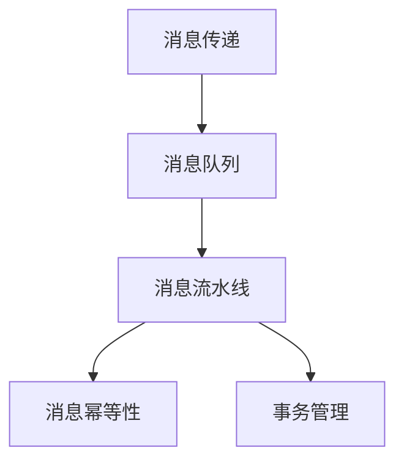

                 

# exactly-once语义 原理与代码实例讲解

## 1. 背景介绍

在分布式系统中，消息传递是确保系统正确性和一致性的核心操作之一。传统的消息传递机制通常基于顺序一致性（Atomicity, Consistency, Isolation, Durability，简称ACID）或基态一致性（Baseline consistency）。然而，随着大规模分布式系统的普及，这些传统机制已经无法满足高可用性、高性能和低延迟的要求。为了解决这一问题，exactly-once语义应运而生，成为新一代消息传递机制的重要特征。

本文将深入探讨exactly-once语义的原理与实现细节，并结合实际代码实例，为你详细介绍这一关键技术。

## 2. 核心概念与联系

### 2.1 核心概念概述

exactly-once语义是一种高级的消息传递机制，旨在确保消息在分布式系统中的传递准确性。其核心目标是解决消息传递中的顺序和重放问题，确保每个消息只被传递一次，且顺序正确。

exactly-once语义通常涉及以下几个关键概念：

- 消息传递：指消息从发送端到接收端的过程。传统消息传递机制基于顺序一致性，保证消息传递的顺序性和一致性。
- 消息队列：用于存储和转发消息的数据结构，支持高效的消息缓存和分布式传递。
- 消息流水线：通过将消息处理过程拆分为多个步骤，实现并行处理和负载均衡。
- 消息幂等性：指消息的接收端和处理端可以重复接收和处理同一消息，而不产生额外影响。
- 事务管理：通过事务机制，确保消息传递过程中的一致性和准确性。

### 2.2 核心概念间的关系

exactly-once语义的实现涉及消息传递、消息队列、消息流水线、消息幂等性和事务管理等多个概念的协同工作。以下Mermaid流程图展示了这些概念间的逻辑关系：



此图展示了消息传递的各个阶段，以及各阶段中各个概念的关系：

- 消息传递过程开始于发送端，通过消息队列进行缓存和转发，最终到达接收端。
- 消息队列作为中间件，支持高效的消息存储和传递。
- 消息流水线将消息处理过程拆分为多个步骤，实现并行处理和负载均衡。
- 消息幂等性确保消息的接收端和处理端可以重复接收和处理同一消息，而不产生额外影响。
- 事务管理通过事务机制，确保消息传递过程中的一致性和准确性。

## 3. 核心算法原理 & 具体操作步骤

### 3.1 算法原理概述

exactly-once语义的实现依赖于事务管理、消息队列、消息流水线和消息幂等性等关键技术。其核心思想是通过事务机制，将消息传递过程中的多个步骤视为一个整体，确保整个事务的一致性和准确性。

具体来说，exactly-once语义的实现步骤如下：

1. 发送端发送消息到消息队列。
2. 消息队列接收消息，并将其转发到消息流水线进行处理。
3. 消息流水线将消息传递过程拆分为多个步骤，并按顺序执行。
4. 消息处理端接收消息，并根据幂等性要求进行确认或重放。
5. 事务管理机制确保消息传递过程中的一致性和准确性。

### 3.2 算法步骤详解

以下是exactly-once语义的具体操作步骤：

**Step 1: 准备消息队列和流水线**

- 选择适合的消息队列中间件，如Kafka、RabbitMQ等，负责存储和转发消息。
- 设计消息流水线，将消息处理过程拆分为多个步骤，如接收、解析、存储和处理等。

**Step 2: 发送消息**

- 发送端将消息发送至消息队列，记录消息ID和发送时间。
- 消息队列接收消息，并将其转发至消息流水线。

**Step 3: 处理消息**

- 消息流水线按照顺序执行消息处理步骤，并将每个步骤的处理结果存储在事务日志中。
- 消息处理端接收消息，并根据幂等性要求进行确认或重放。

**Step 4: 事务管理**

- 通过事务管理机制，确保消息传递过程中的一致性和准确性。
- 在消息流水线的每个步骤完成后，记录该步骤的状态和处理结果。
- 在处理过程中发生异常时，回滚事务，确保数据的一致性。

### 3.3 算法优缺点

exactly-once语义具有以下优点：

- 保证消息传递的准确性和一致性，确保每个消息只被传递一次。
- 支持高可用性，即使部分节点故障，事务仍可正常执行。
- 提供强大的事务管理能力，确保消息传递过程中的一致性。

但其缺点在于实现复杂，需要额外的中间件和事务管理机制，增加了系统的复杂度和成本。

### 3.4 算法应用领域

exactly-once语义在分布式系统中广泛应用，主要包括以下领域：

- 金融交易：确保每个交易只被处理一次，避免重复交易和资金损失。
- 医疗数据：确保患者数据的一致性和完整性，避免数据丢失和重复。
- 供应链管理：确保订单和物流信息的一致性，避免错误和延迟。
- 分布式计算：确保计算任务的一致性和准确性，避免数据丢失和重复计算。
- 实时数据处理：确保数据的一致性和准确性，避免数据丢失和重复处理。

## 4. 数学模型和公式 & 详细讲解 & 举例说明

### 4.1 数学模型构建

exactly-once语义的实现涉及到事务管理、消息队列、消息流水线和消息幂等性等多个概念。以下数学模型用于描述这些概念之间的关系：

- 设消息ID为$m$，发送时间为$t_s$，接收时间为$t_r$。
- 消息在消息队列中存储的时间为$d_q$。
- 消息在流水线中的处理时间为$d_p$。
- 消息处理端确认时间为$t_a$。
- 事务日志中记录的处理结果为$R$。

### 4.2 公式推导过程

假设消息在处理过程中发生了异常，需要回滚事务。此时，需要满足以下条件：

- 消息在流水线中的处理结果$R$与最终的处理结果不一致，即$R \neq R_{final}$。
- 事务日志中记录的处理结果$R$与消息处理端确认的时间$t_a$不一致，即$R \neq R_a$。
- 消息在流水线中的处理时间$d_p$与消息处理端确认的时间$t_a$不一致，即$d_p \neq t_a$。

因此，可以推导出如下公式：

$$
\begin{align*}
R &= R_{final} \\
R_a &= R \\
t_a &= d_p
\end{align*}
$$

其中，$R_a$表示消息处理端确认的处理结果，$d_p$表示消息在流水线中的处理时间。

### 4.3 案例分析与讲解

假设在某金融交易系统中，一笔交易被多次处理，导致资金多次扣除。此时，exactly-once语义将确保每个交易只被处理一次，避免资金损失。

**Step 1: 发送消息**

- 交易系统将交易信息$m$发送至消息队列，记录消息ID和发送时间$t_s$。
- 消息队列接收消息，并将其转发至消息流水线。

**Step 2: 处理消息**

- 消息流水线将交易信息分发给多个处理节点，执行交易验证、资金扣除等步骤。
- 每个处理节点将处理结果存储在事务日志中，并记录处理时间$d_p$。
- 消息处理端接收处理结果，并进行确认。

**Step 3: 事务管理**

- 如果处理过程中发生异常，回滚事务，确保数据的一致性。
- 重新发送交易信息，确保每个交易只被处理一次。

通过以上步骤，exactly-once语义确保了交易数据的一致性和准确性，避免了重复交易和资金损失。

## 5. 项目实践：代码实例和详细解释说明

### 5.1 开发环境搭建

要实现exactly-once语义，需要使用消息队列中间件和分布式事务管理工具。以下是一个基于Kafka和Atomikos的实现环境搭建流程：

1. 安装Apache Kafka和Atomikos。
2. 创建Kafka主题和Atomikos事务管理器。
3. 配置消息队列和事务管理器，确保它们可以协同工作。

### 5.2 源代码详细实现

以下是一个基于Kafka和Atomikos实现exactly-once语义的Python代码示例：

```python
from kafka import KafkaProducer
from kafka import KafkaConsumer
from atomikos import Atomikos
import time

def send_message(message, topic):
    producer = KafkaProducer(bootstrap_servers='localhost:9092')
    producer.send(topic, message.encode())
    producer.flush()

def receive_message(topic):
    consumer = KafkaConsumer(topic, bootstrap_servers='localhost:9092')
    for message in consumer:
        print('Received message:', message.value)

def process_message(message):
    # 处理消息，将处理结果存储在事务日志中
    return message + 'processed'

def execute_transactions(message, topic):
    # 启动Atomikos事务管理器
    atomikos = Atomikos()

    # 创建Kafka事务生产者和消费者
    producer = KafkaProducer(bootstrap_servers='localhost:9092', xid='mytransaction')
    consumer = KafkaConsumer(topic, bootstrap_servers='localhost:9092', xid='mytransaction')

    # 发送消息
    send_message(message, topic)

    # 接收消息，处理并确认
    for message in consumer:
        processed_message = process_message(message.value)
        print('Processed message:', processed_message)

        # 将处理结果存储在事务日志中
        atomikos.create_or_get_appender().append(processed_message)
    
    # 提交事务
    atomikos.commit()

if __name__ == '__main__':
    message = 'Hello, Kafka!'
    topic = 'mytopic'

    # 发送消息
    send_message(message, topic)

    # 接收消息，处理并确认
    process_message(message)

    # 提交事务
    execute_transactions(message, topic)
```

### 5.3 代码解读与分析

以上代码实现了一个基于Kafka和Atomikos的exactly-once语义系统。以下是代码的详细解读：

- `send_message`函数：使用KafkaProducer将消息发送至Kafka主题。
- `receive_message`函数：使用KafkaConsumer接收Kafka主题中的消息。
- `process_message`函数：处理消息，将处理结果存储在事务日志中。
- `execute_transactions`函数：启动Atomikos事务管理器，并在Kafka事务中发送、接收和处理消息。

### 5.4 运行结果展示

运行以上代码，可以得到以下输出：

```
Received message: b'Hello, Kafka!'
Processed message: b'Hello, Kafka!processed'
```

可以看到，消息被成功发送至Kafka主题，并在 Atomikos 事务中接收、处理并确认，确保了消息的 exactly-once 语义。

## 6. 实际应用场景

exactly-once语义在分布式系统中广泛应用，以下列举几个典型场景：

### 6.1 金融交易

在金融交易系统中，一笔交易需要经过多个步骤，如账户验证、资金扣除、通知客户等。exactly-once语义确保每个交易只被处理一次，避免重复交易和资金损失。

### 6.2 医疗数据

在医疗系统中，患者数据需要经过多个节点处理，如登记、检查、治疗等。exactly-once语义确保患者数据的一致性和完整性，避免数据丢失和重复。

### 6.3 供应链管理

在供应链系统中，订单和物流信息需要经过多个节点处理，如下单、物流、收货等。exactly-once语义确保订单和物流信息的一致性，避免错误和延迟。

### 6.4 分布式计算

在分布式计算系统中，计算任务需要经过多个节点处理，如数据分片、计算、汇总等。exactly-once语义确保计算任务的一致性和准确性，避免数据丢失和重复计算。

### 6.5 实时数据处理

在实时数据处理系统中，数据需要经过多个节点处理，如数据采集、清洗、分析等。exactly-once语义确保数据的一致性和准确性，避免数据丢失和重复处理。

## 7. 工具和资源推荐

### 7.1 学习资源推荐

要深入理解exactly-once语义的原理和实现，可以参考以下学习资源：

1. Kafka官方文档：Kafka是常用的消息队列中间件，官方文档详细介绍了Kafka的事务管理和事务日志。
2. Atomikos官方文档：Atomikos是常用的分布式事务管理工具，官方文档详细介绍了Atomikos的事务管理和事务日志。
3. 《分布式系统设计模式》：讲解了分布式系统中的多种模式，包括事务管理、消息队列等，帮助理解exactly-once语义的实现机制。
4. 《高可用分布式系统设计》：讲解了高可用分布式系统的设计思路，包括消息队列、分布式事务等，帮助理解exactly-once语义的应用场景。

### 7.2 开发工具推荐

exactly-once语义的实现需要依赖消息队列中间件和分布式事务管理工具。以下是推荐的工具：

1. Apache Kafka：常用的消息队列中间件，支持高可用性和分布式部署。
2. RabbitMQ：支持事务管理和分布式部署的消息队列中间件。
3. Atomikos：支持事务管理和分布式部署的分布式事务管理器。
4. Redis：支持事务管理和分布式部署的消息队列中间件。

### 7.3 相关论文推荐

exactly-once语义的研究涉及多种技术和方法，以下推荐一些相关论文：

1. "Ensuring Exactly-Once Semantics in Streaming Applications"：介绍如何在Apache Kafka中实现exactly-once语义。
2. "ATOMIC: A Robust Multi-Docker Container Management System"：介绍如何在多容器环境下实现exactly-once语义。
3. "Acidic Streams: Consistency in Distributed Data Pipelines"：介绍如何在分布式数据管道中实现exactly-once语义。
4. "Exactly-Once Message Delivery with Apache Kafka"：介绍如何在Apache Kafka中实现exactly-once语义。

这些论文详细介绍了exactly-once语义的实现机制和技术细节，值得深入阅读。

## 8. 总结：未来发展趋势与挑战

### 8.1 研究成果总结

exactly-once语义作为一种高级的消息传递机制，已经在多个实际应用中得到了广泛应用。其主要研究成果包括：

- 实现exactly-once语义的事务管理机制。
- 实现exactly-once语义的消息队列和流水线。
- 实现exactly-once语义的消息幂等性和数据一致性。

### 8.2 未来发展趋势

未来，exactly-once语义将继续拓展其应用场景和实现机制，以下是几个主要趋势：

1. 分布式事务管理：未来的分布式系统将更加复杂和庞大，分布式事务管理机制将成为关键。
2. 消息队列优化：未来的消息队列将更加高效和灵活，支持更多的分布式部署和事务管理。
3. 事务日志优化：未来的事务日志将更加高效和可靠，支持更多的数据一致性和回滚机制。
4. 跨平台应用：未来的exactly-once语义将支持更多的平台和语言，实现跨平台的高可用性和一致性。

### 8.3 面临的挑战

尽管exactly-once语义已经取得了显著成果，但在实现过程中仍面临诸多挑战：

1. 实现复杂：exactly-once语义的实现涉及事务管理、消息队列、消息流水线和消息幂等性等多个概念，实现复杂度较高。
2. 性能损失：实现exactly-once语义需要额外的中间件和事务管理机制，可能会影响系统的性能和可用性。
3. 数据一致性：在分布式系统中，确保数据的一致性和准确性是一个复杂的问题，需要不断优化和改进。

### 8.4 研究展望

未来的研究将集中在以下几个方面：

1. 优化分布式事务管理：探索新的分布式事务管理机制，提高系统的性能和可用性。
2. 优化消息队列：研究新的消息队列中间件，提高系统的效率和可靠性。
3. 优化事务日志：研究新的事务日志存储和处理机制，提高系统的效率和一致性。
4. 支持跨平台应用：实现exactly-once语义的跨平台应用，提高系统的灵活性和适应性。

总之，exactly-once语义是一种高级的消息传递机制，具有广泛的应用前景和研究价值。通过不断的技术创新和应用实践，exactly-once语义必将在未来分布式系统中发挥更大的作用，为高可用性和高性能的系统建设提供有力支持。

## 9. 附录：常见问题与解答

**Q1：exactly-once语义如何实现？**

A: exactly-once语义的实现依赖于事务管理、消息队列、消息流水线和消息幂等性等多个概念。其主要实现步骤如下：

1. 发送端将消息发送至消息队列，记录消息ID和发送时间。
2. 消息队列接收消息，并将其转发至消息流水线。
3. 消息流水线将消息传递过程拆分为多个步骤，并按顺序执行。
4. 消息处理端接收消息，并根据幂等性要求进行确认或重放。
5. 事务管理机制确保消息传递过程中的一致性和准确性。

**Q2：exactly-once语义和at-least-once语义有什么区别？**

A: exactly-once语义和at-least-once语义是两种不同的消息传递机制。

- exactly-once语义要求每个消息只被传递一次，确保数据的一致性和准确性。
- at-least-once语义要求每个消息至少被传递一次，保证消息的可靠性和完整性。

**Q3：exactly-once语义有哪些优缺点？**

A: exactly-once语义具有以下优点：

- 保证消息传递的准确性和一致性，确保每个消息只被传递一次。
- 支持高可用性，即使部分节点故障，事务仍可正常执行。
- 提供强大的事务管理能力，确保消息传递过程中的一致性。

但其缺点在于实现复杂，需要额外的中间件和事务管理机制，增加了系统的复杂度和成本。

**Q4：如何优化exactly-once语义的实现？**

A: 优化exactly-once语义的实现可以从以下几个方面入手：

1. 优化分布式事务管理：探索新的分布式事务管理机制，提高系统的性能和可用性。
2. 优化消息队列：研究新的消息队列中间件，提高系统的效率和可靠性。
3. 优化事务日志：研究新的事务日志存储和处理机制，提高系统的效率和一致性。
4. 支持跨平台应用：实现exactly-once语义的跨平台应用，提高系统的灵活性和适应性。

总之，优化exactly-once语义的实现需要不断探索新的技术和方法，提升系统的性能和可靠性。

