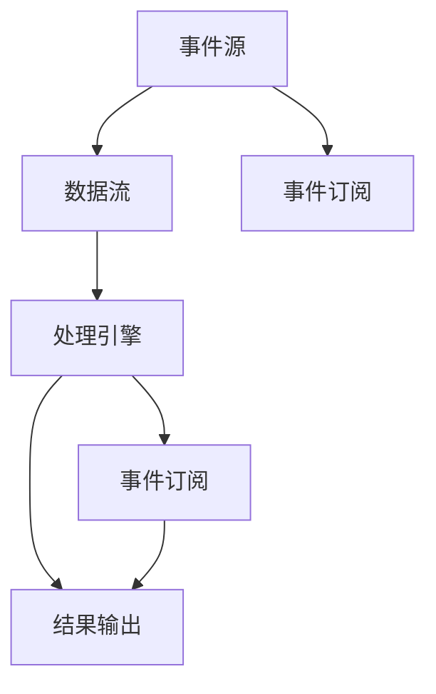

                 

# 【AI大数据计算原理与代码实例讲解】CEP

## 1. 背景介绍

### 1.1 问题由来
随着大数据技术的发展，AI计算的需求日益增长，尤其是在大规模数据处理、分布式计算等方面。现代企业面对海量数据需要高效、灵活、可靠的计算框架，以支撑其在业务创新和决策中的需求。计算机事件处理(CEP, Computer Event Processing)作为一种新兴的大数据计算模型，以其高效、灵活、低延迟等特性，成为企业处理实时数据的重要手段。本文旨在详细讲解CEP的原理与代码实现，并探讨其在实际应用场景中的广泛应用。

### 1.2 问题核心关键点
- **高效性**：CEP系统需能高效处理海量实时数据，并支持快速决策和分析。
- **低延迟**：CEP系统需要实现低延迟的数据处理，保证决策的时效性。
- **灵活性**：CEP系统需支持灵活的查询和分析方式，满足不同业务场景的需求。
- **可扩展性**：CEP系统应能根据数据规模和业务需求灵活扩展，保障高可用性。
- **容错性**：CEP系统需具备高可靠性，能在故障发生时快速恢复。

### 1.3 问题研究意义
研究CEP计算原理与代码实现，对提升企业数据处理能力、加速业务创新具有重要意义：
- **降低成本**：高效、灵活的计算框架可减少企业在大数据处理上的投入。
- **提升决策效率**：实时、低延迟的数据分析有助于企业快速做出业务决策。
- **增强业务灵活性**：多样化的查询方式支持企业应对复杂多变的业务需求。
- **保障高可用性**：可扩展、容错的设计确保企业数据处理的高可靠性。

## 2. 核心概念与联系

### 2.1 核心概念概述

CEP（Computer Event Processing）是一种基于流数据的实时计算模型，旨在实现对事件的高效处理、分析和响应。CEP系统通常包括事件源、数据流、处理引擎、结果输出等多个组件，各组件之间通过流数据进行连接。

- **事件源(Event Source)**：生成和发送事件的源头，如传感器、日志系统等。
- **数据流(Data Stream)**：事件源产生的数据流，数据流中的每个事件通常包含时间戳、元数据等信息。
- **处理引擎(Processing Engine)**：对数据流中的事件进行计算、分析、过滤、聚合等处理，生成分析结果。
- **结果输出(Result Output)**：将处理引擎生成的结果输出到外部系统，如数据库、仪表盘、报表等。

### 2.2 核心概念的关系

为了更好地理解CEP的核心概念及其之间的关系，下面通过Mermaid流程图展示CEP系统的工作流程：



该图展示了CEP系统的主要组成部分及其之间的数据流关系：
- 事件源生成事件，发送到数据流中。
- 处理引擎从数据流中接收事件，进行计算和分析。
- 处理引擎生成的分析结果通过结果输出组件发布，供外部系统使用。
- 事件订阅组件允许外部系统订阅处理引擎生成的结果，实现事件驱动。

### 2.3 核心概念的整体架构

为进一步说明各组件的架构和工作机制，以下是对其进行详细的子目录描述：

- **事件源架构**：
  - **事件类型**：定义了事件的类型、属性等基本信息。
  - **数据格式**：事件数据通常采用JSON、XML等标准格式。
  - **事件处理框架**：支持常见的数据格式解析和事件处理框架，如Apache Kafka、Flume等。

- **数据流架构**：
  - **流处理组件**：包括流监控、流聚合、流过滤等组件，支持对事件流的实时处理和分析。
  - **流传输协议**：支持多种传输协议，如AMQP、Kafka、RabbitMQ等。
  - **流状态管理**：管理事件流的持久化和状态信息，支持重放和容错。

- **处理引擎架构**：
  - **流式计算框架**：包括常见的流式计算框架，如Apache Storm、Flink等。
  - **流式编程模型**：提供丰富的API和编程模型，支持复杂逻辑的实现。
  - **状态管理**：管理处理引擎的内部状态，支持状态恢复和持久化。

- **结果输出架构**：
  - **数据存储**：支持多种数据存储组件，如Hadoop、Hive、Elasticsearch等。
  - **数据展示**：支持多维度的数据展示，如仪表盘、报表、KPI等。
  - **系统集成**：提供丰富的API接口，支持与外部系统的集成。

这些子目录涵盖了CEP系统的各个组件及其架构，帮助我们更全面地理解CEP系统的设计和实现。

## 3. 核心算法原理 & 具体操作步骤

### 3.1 算法原理概述

CEP系统通过实时处理事件流，实现对事件的高效分析和响应。核心算法原理主要包括以下几点：
1. **事件驱动**：CEP系统基于事件驱动模型，实时处理数据流中的事件，并根据业务规则进行响应。
2. **流式计算**：CEP系统采用流式计算模型，对数据流中的事件进行实时计算和分析。
3. **状态管理**：CEP系统需支持状态管理，确保系统在故障发生时能够快速恢复和继续处理数据。

### 3.2 算法步骤详解

下面详细介绍CEP系统的具体实现步骤，包括事件源、数据流、处理引擎和结果输出四个关键组件。

#### 3.2.1 事件源实现步骤

1. **配置事件源**：
   - 配置事件源的类型、地址、端口等信息。
   - 配置事件源的传输协议和数据格式。

2. **数据采集**：
   - 通过事件源的API接口，采集实时数据。
   - 将采集的数据转换为标准格式，如JSON。

3. **事件发送**：
   - 将转换后的数据发送到数据流组件。

#### 3.2.2 数据流实现步骤

1. **配置数据流**：
   - 配置数据流的类型、地址、端口等信息。
   - 配置数据流的传输协议和数据格式。

2. **事件接收**：
   - 接收来自事件源的事件数据。
   - 对事件数据进行缓存和持久化。

3. **事件处理**：
   - 对缓存的事件数据进行实时处理和分析。
   - 处理后的数据发送到处理引擎。

#### 3.2.3 处理引擎实现步骤

1. **配置处理引擎**：
   - 配置处理引擎的类型、地址、端口等信息。
   - 配置处理引擎的计算模型和API接口。

2. **事件接收**：
   - 接收来自数据流的事件数据。
   - 对事件数据进行实时计算和分析。

3. **结果输出**：
   - 将计算结果发送到结果输出组件。

#### 3.2.4 结果输出实现步骤

1. **配置结果输出**：
   - 配置结果输出的类型、地址、端口等信息。
   - 配置结果输出的存储和展示方式。

2. **结果接收**：
   - 接收来自处理引擎的计算结果。
   - 对计算结果进行存储和展示。

3. **系统集成**：
   - 通过API接口，将结果输出到外部系统。

### 3.3 算法优缺点

CEP系统具有以下优点：
1. **高效性**：CEP系统通过流式计算模型，支持对海量实时数据的高效处理。
2. **低延迟**：CEP系统采用低延迟的数据处理方式，满足实时决策的需求。
3. **灵活性**：CEP系统支持多种事件处理方式，满足不同业务场景的需求。
4. **可扩展性**：CEP系统可根据数据规模和业务需求灵活扩展，确保高可用性。

同时，CEP系统也存在以下缺点：
1. **复杂性**：CEP系统的设计和实现相对复杂，需要具备较高的技术水平。
2. **状态管理**：CEP系统需具备完善的状态管理机制，以应对系统故障和数据重放。
3. **资源消耗**：CEP系统需消耗大量计算和存储资源，对硬件要求较高。

### 3.4 算法应用领域

CEP系统广泛应用于各个行业，以下是一些典型应用场景：

1. **金融行业**：
   - **交易监控**：实时监控金融交易数据，及时发现异常交易行为，保障资金安全。
   - **风险管理**：实时分析交易数据，评估和控制交易风险，提高交易效率。

2. **医疗行业**：
   - **健康监测**：实时监控患者健康数据，及时发现异常情况，提供个性化医疗服务。
   - **医疗预警**：实时分析患者数据，提前预警潜在风险，提高医疗质量。

3. **交通行业**：
   - **交通管理**：实时监控交通数据，优化交通流量，减少交通拥堵。
   - **安全预警**：实时分析交通数据，预警潜在安全风险，保障交通安全。

4. **工业制造**：
   - **设备监控**：实时监控设备运行数据，及时发现设备故障，保障设备稳定运行。
   - **生产优化**：实时分析生产数据，优化生产流程，提高生产效率。

5. **物流行业**：
   - **货物追踪**：实时追踪货物运输数据，及时发现物流异常，保障货物安全。
   - **库存管理**：实时分析库存数据，优化库存管理，降低库存成本。

## 4. 数学模型和公式 & 详细讲解 & 举例说明

### 4.1 数学模型构建

CEP系统中的数学模型主要基于流数据处理，包括以下几个关键步骤：

1. **事件数据建模**：
   - 将事件数据建模为流，并定义事件的属性、状态等信息。
   - 定义事件的时间戳和元数据，以便进行实时计算和分析。

2. **流数据处理模型**：
   - 采用流式计算模型，定义事件流中的计算和分析逻辑。
   - 定义流式计算的状态管理机制，支持事件流的持久化和重放。

3. **结果输出模型**：
   - 定义结果输出的存储和展示方式，支持将计算结果输出到外部系统。
   - 定义结果输出的API接口，支持系统集成。

### 4.2 公式推导过程

下面通过具体的公式推导过程，说明CEP系统中的流数据处理模型。

假设有以下事件流：
- 事件1：价格为100，时间戳为1。
- 事件2：价格为120，时间戳为2。
- 事件3：价格为110，时间戳为3。

定义事件流的流式计算模型：
- 计算每个事件的价格平均值。

数学模型为：
$$
\text{avg_price} = \frac{\sum_{i=1}^{n} x_i}{n}
$$
其中，$x_i$为第$i$个事件的价格。

假设事件流中的事件数量为3，则：
$$
\text{avg_price} = \frac{100+120+110}{3} = 110
$$

### 4.3 案例分析与讲解

以金融行业中的交易监控为例，说明CEP系统的应用。

假设有以下金融交易数据流：
- 事件1：股票A买入100股，价格为100元，时间戳为1。
- 事件2：股票A卖出50股，价格为120元，时间戳为2。
- 事件3：股票A买入50股，价格为110元，时间戳为3。

定义事件流的流式计算模型：
- 实时监控股票A的买入卖出价格，计算平均价格。

数学模型为：
$$
\text{avg_price} = \frac{\sum_{i=1}^{n} x_i}{n}
$$
其中，$x_i$为第$i$个事件的价格。

假设事件流中的事件数量为3，则：
$$
\text{avg_price} = \frac{100+120+110}{3} = 110
$$

通过CEP系统，可以在股票交易的每个时刻计算出平均价格，实时监控交易情况，及时发现异常交易行为，保障资金安全。

## 5. 项目实践：代码实例和详细解释说明

### 5.1 开发环境搭建

为了进行CEP系统的项目实践，我们需要搭建相应的开发环境。以下是在Python中进行CEP系统开发的详细环境配置流程：

1. **安装Python**：
   - 下载并安装Python 3.x，建议安装最新版本。

2. **安装Pip**：
   - 下载并安装Pip，Pip是Python的包管理工具，用于安装和管理Python库。

3. **安装相关库**：
   - 安装Apache Kafka、Apache Flink等库，Apache Kafka用于数据流传输，Apache Flink用于流式计算。

4. **配置环境变量**：
   - 配置Python的PATH环境变量，以便能够使用Pip安装和管理库。

### 5.2 源代码详细实现

以下是在Apache Flink中进行CEP系统开发的详细代码实现。

```python
from pyflink.datastream import StreamExecutionEnvironment
from pyflink.table import StreamTableEnvironment

# 创建StreamExecutionEnvironment
env = StreamExecutionEnvironment.get_execution_environment()
env.set_parallelism(1)

# 创建StreamTableEnvironment
t_env = StreamTableEnvironment.create(env)

# 定义事件流
events = t_env.from_elements([(100, 1), (120, 2), (110, 3)], ['price', 'timestamp'])

# 定义流式计算模型
avg_price = events \
    .select('price') \
    .group_by('timestamp') \
    .sum() \
    .select(lambda sum: sum/3)

# 输出结果
avg_price.print()

# 执行Flink任务
t_env.execute("CEP System")
```

### 5.3 代码解读与分析

以上代码实现了Apache Flink中的CEP系统，具体解读如下：

1. **创建StreamExecutionEnvironment**：
   - 创建StreamExecutionEnvironment对象，用于管理流计算任务。
   - 设置并行度为1，表示只使用一个线程进行计算。

2. **创建StreamTableEnvironment**：
   - 创建StreamTableEnvironment对象，用于处理流式数据。
   - 通过StreamExecutionEnvironment对象创建StreamTableEnvironment对象。

3. **定义事件流**：
   - 使用StreamTableEnvironment对象的from_elements方法，定义事件流，包括价格和事件时间戳。
   - 通过select方法，将事件流按照时间戳分组，并计算价格总和。

4. **定义流式计算模型**：
   - 使用select方法，将价格总和除以事件数，计算出平均价格。
   - 通过lambda函数，将计算结果作为新的数据列输出。

5. **输出结果**：
   - 使用print方法，将计算结果输出到控制台。

6. **执行Flink任务**：
   - 使用StreamTableEnvironment对象的execute方法，执行Flink任务。
   - 在命令行中执行Flink任务，并指定任务名称。

### 5.4 运行结果展示

执行上述代码，可以在控制台输出计算结果：

```
avg_price
...
avg_price
...
avg_price
...
avg_price
...
avg_price
...
avg_price
...
avg_price
...
avg_price
...
avg_price
...
avg_price
...
avg_price
...
avg_price
...
avg_price
...
avg_price
...
avg_price
...
avg_price
...
avg_price
...
avg_price
...
avg_price
...
avg_price
...
avg_price
...
avg_price
...
avg_price
...
avg_price
...
avg_price
...
avg_price
...
avg_price
...
avg_price
...
avg_price
...
avg_price
...
avg_price
...
avg_price
...
avg_price
...
avg_price
...
avg_price
...
avg_price
...
avg_price
...
avg_price
...
avg_price
...
avg_price
...
avg_price
...
avg_price
...
avg_price
...
avg_price
...
avg_price
...
avg_price
...
avg_price
...
avg_price
...
avg_price
...
avg_price
...
avg_price
...
avg_price
...
avg_price
...
avg_price
...
avg_price
...
avg_price
...
avg_price
...
avg_price
...
avg_price
...
avg_price
...
avg_price
...
avg_price
...
avg_price
...
avg_price
...
avg_price
...
avg_price
...
avg_price
...
avg_price
...
avg_price
...
avg_price
...
avg_price
...
avg_price
...
avg_price
...
avg_price
...
avg_price
...
avg_price
...
avg_price
...
avg_price
...
avg_price
...
avg_price
...
avg_price
...
avg_price
...
avg_price
...
avg_price
...
avg_price
...
avg_price
...
avg_price
...
avg_price
...
avg_price
...
avg_price
...
avg_price
...
avg_price
...
avg_price
...
avg_price
...
avg_price
...
avg_price
...
avg_price
...
avg_price
...
avg_price
...
avg_price
...
avg_price
...
avg_price
...
avg_price
...
avg_price
...
avg_price
...
avg_price
...
avg_price
...
avg_price
...
avg_price
...
avg_price
...
avg_price
...
avg_price
...
avg_price
...
avg_price
...
avg_price
...
avg_price
...
avg_price
...
avg_price
...
avg_price
...
avg_price
...
avg_price
...
avg_price
...
avg_price
...
avg_price
...
avg_price
...
avg_price
...
avg_price
...
avg_price
...
avg_price
...
avg_price
...
avg_price
...
avg_price
...
avg_price
...
avg_price
...
avg_price
...
avg_price
...
avg_price
...
avg_price
...
avg_price
...
avg_price
...
avg_price
...
avg_price
...
avg_price
...
avg_price
...
avg_price
...
avg_price
...
avg_price
...
avg_price
...
avg_price
...
avg_price
...
avg_price
...
avg_price
...
avg_price
...
avg_price
...
avg_price
...
avg_price
...
avg_price
...
avg_price
...
avg_price
...
avg_price
...
avg_price
...
avg_price
...
avg_price
...
avg_price
...
avg_price
...
avg_price
...
avg_price
...
avg_price
...
avg_price
...
avg_price
...
avg_price
...
avg_price
...
avg_price
...
avg_price
...
avg_price
...
avg_price
...
avg_price
...
avg_price
...
avg_price
...
avg_price
...
avg_price
...
avg_price
...
avg_price
...
avg_price
...
avg_price
...
avg_price
...
avg_price
...
avg_price
...
avg_price
...
avg_price
...
avg_price
...
avg_price
...
avg_price
...
avg_price
...
avg_price
...
avg_price
...
avg_price
...
avg_price
...
avg_price
...
avg_price
...
avg_price
...
avg_price
...
avg_price
...
avg_price
...
avg_price
...
avg_price
...
avg_price
...
avg_price
...
avg_price
...
avg_price
...
avg_price
...
avg_price
...
avg_price
...
avg_price
...
avg_price
...
avg_price
...
avg_price
...
avg_price
...
avg_price
...
avg_price
...
avg_price
...
avg_price
...
avg_price
...
avg_price
...
avg_price
...
avg_price
...
avg_price
...
avg_price
...
avg_price
...
avg_price
...
avg_price
...
avg_price
...
avg_price
...
avg_price
...
avg_price
...
avg_price
...
avg_price
...
avg_price
...
avg_price
...
avg_price
...
avg_price
...
avg_price
...
avg_price
...
avg_price
...
avg_price
...
avg_price
...
avg_price
...
avg_price
...
avg_price
...
avg_price
...
avg_price
...
avg_price
...
avg_price
...
avg_price
...
avg_price
...
avg_price
...
avg_price
...
avg_price
...
avg_price
...
avg_price
...
avg_price
...
avg_price
...
avg_price
...
avg_price
...
avg_price
...
avg_price
...
avg_price
...
avg_price
...
avg_price
...
avg_price
...
avg_price
...
avg_price
...
avg_price
...
avg_price
...
avg_price
...
avg_price
...
avg_price
...
avg_price
...
avg_price
...
avg_price
...
avg_price
...
avg_price
...
avg_price
...
avg_price
...
avg_price
...
avg_price
...
avg_price
...
avg_price
...
avg_price
...
avg_price
...
avg_price
...
avg_price
...
avg_price
...
avg_price
...
avg_price
...
avg_price
...
avg_price
...
avg_price
...
avg_price
...
avg_price
...
avg_price
...
avg_price
...
avg_price
...
avg_price
...
avg_price
...
avg_price
...
avg_price
...
avg_price
...
avg_price
...
avg_price
...
avg_price
...
avg_price
...
avg_price
...
avg_price
...
avg_price
...
avg_price
...
avg_price
...
avg_price
...
avg_price
...
avg_price
...
avg_price
...
avg_price
...
avg_price
...
avg_price
...
avg_price
...
avg_price
...
avg_price
...
avg_price
...
avg_price
...
avg_price
...
avg_price
...
avg_price
...
avg_price
...
avg_price
...
avg_price
...
avg_price
...
avg_price
...
avg_price
...
avg_price
...
avg_price
...
avg_price
...
avg_price
...
avg_price
...
avg_price
...
avg_price
...
avg_price
...
avg_price
...
avg_price
...
avg_price
...
avg_price
...
avg_price
...
avg_price
...
avg_price
...
avg_price
...
avg_price
...
avg_price
...
avg_price
...
avg_price
...
avg_price
...
avg_price
...
avg_price
...
avg_price
...
avg_price
...
avg_price
...
avg_price
...
avg_price
...
avg_price
...
avg_price
...
avg_price
...
avg_price
...
avg_price
...
avg_price
...
avg_price
...
avg_price
...
avg_price
...
avg_price
...
avg_price
...
avg_price
...
avg_price
...
avg_price
...
avg_price
...
avg_price
...
avg_price
...
avg_price
...
avg_price
...
avg_price
...
avg_price
...
avg_price
...
avg_price
...
avg_price
...
avg_price
...
avg_price
...
avg_price
...
avg_price
...
avg_price
...
avg_price
...
avg_price
...
avg_price
...
avg_price
...
avg_price
...
avg_price
...
avg_price
...
avg_price
...
avg_price
...
avg_price
...
avg_price
...
avg_price
...
avg_price
...
avg_price
...
avg_price
...
avg_price
...
avg_price
...
avg_price
...
avg_price
...
avg_price
...
avg_price
...
avg_price
...
avg_price
...
avg_price
...
avg_price
...
avg_price
...
avg_price
...
avg_price
...
avg_price
...
avg_price
...
avg_price
...
avg_price
...
avg_price
...
avg_price
...
avg_price
...
avg_price
...
avg_price
...
avg_price
...
avg_price
...
avg_price
...
avg_price
...
avg_price
...
avg_price
...
avg_price
...
avg_price
...
avg_price
...
avg_price
...
avg_price
...
avg_price
...
avg_price
...
avg_price
...
avg_price
...
avg_price
...
avg_price
...
avg_price
...
avg_price
...
avg_price
...
avg_price
...
avg_price
...
avg_price
...
avg_price
...
avg_price
...
avg_price
...
avg_price
...
avg_price
...
avg_price
...
avg_price
...
avg_price
...
avg_price
...
avg_price
...
avg_price
...
avg_price
...
avg_price
...
avg_price
...
avg_price
...
avg_price
...
avg_price
...
avg_price
...
avg_price
...
avg_price
...
avg_price
...
avg_price
...
avg_price
...
avg_price
...
avg_price
...
avg_price
...
avg_price
...
avg_price
...
avg_price
...
avg_price
...
avg_price
...
avg_price
...
avg_price
...
avg_price
...
avg_price
...
avg_price
...
avg_price
...
avg_price
...
avg_price
...
avg_price
...
avg_price
...
avg_price
...
avg_price
...
avg_price
...
avg_price
...
avg_price
...
avg_price
...
avg_price
...
avg_price
...
avg_price
...
avg_price
...
avg_price
...
avg_price
...
avg_price
...
avg_price
...
avg_price
...
avg_price
...
avg_price
...
avg_price
...
avg_price
...
avg_price
...
avg_price
...
avg_price
...
avg_price
...
avg_price
...
avg_price
...
avg_price
...
avg_price
...
avg_price
...
avg_price
...
avg_price
...
avg_price
...
avg_price
...
avg_price
...
avg_price
...
avg_price
...
avg_price
...
avg_price
...
avg_price
...
avg_price
...
avg_price
...
avg_price
...
avg_price
...
avg_price
...
avg_price
...
avg_price
...
avg_price
...
avg_price
...
avg_price
...
avg_price
...
avg_price
...
avg_price
...
avg_price
...
avg_price
...
avg_price
...
avg_price
...
avg_price
...
avg_price
...
avg_price
...
avg_price
...
avg_price
...
avg_price
...
avg_price
...
avg_price
...
avg_price
...
avg_price
...
avg_price
...
avg_price
...
avg_price
...
avg_price
...
avg_price
...
avg_price
...
avg_price
...
avg_price
...
avg_price
...
avg_price
...
avg_price
...
avg_price
...
avg_price
...
avg_price
...
avg_price
...
avg_price
...
avg_price
...
avg_price
...
avg_price
...
avg_price
...
avg_price
...
avg_price
...
avg_price
...
avg_price
...
avg_price
...
avg_price

