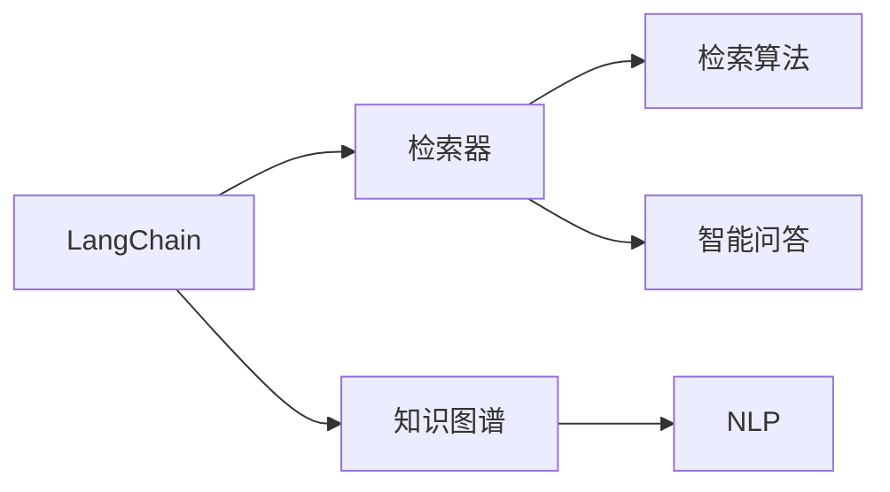
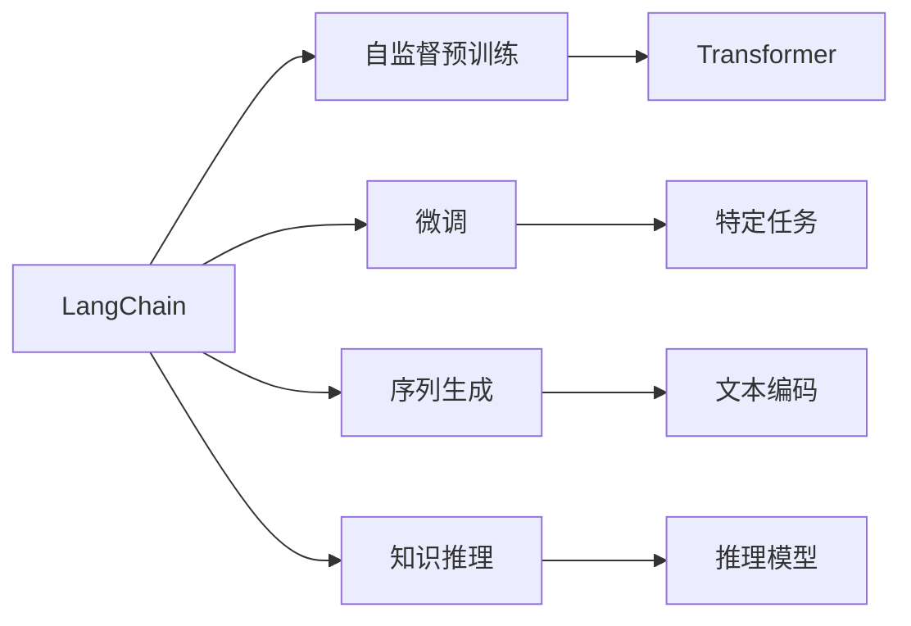
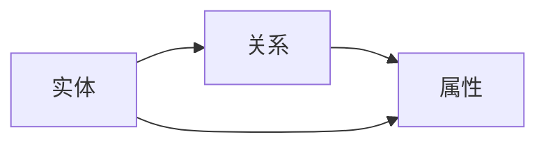
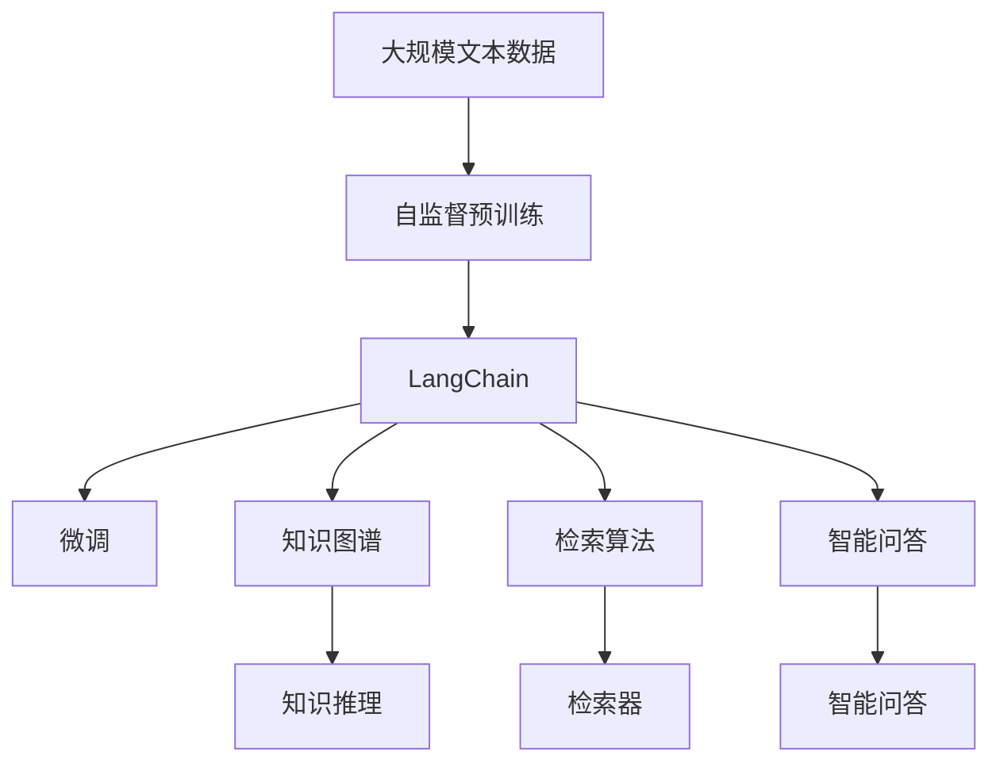

                 

# 【LangChain编程：从入门到实践】检索器

> 关键词：LangChain, 检索器, 编程, 智能问答, 自然语言处理, 知识图谱, 检索算法

## 1. 背景介绍

随着人工智能技术的不断进步，智能检索器正逐步成为信息获取与处理的重要工具。传统的搜索引擎只能处理结构化数据，无法理解自然语言，而智能检索器则可以通过自然语言处理技术，提供更智能、更灵活的检索服务。在语言模型和知识图谱技术的推动下，智能检索器已经能够理解复杂的查询，提供准确的检索结果。

智能检索器不仅可以处理文本，还可以结合其他模态的数据，如图像、视频等。随着技术的不断进步，智能检索器已经能够应用于更多的场景，如智能客服、智能助手、智能推荐等。这些应用场景不仅提升了用户体验，还大幅提高了信息检索的效率和准确性。

## 2. 核心概念与联系

### 2.1 核心概念概述

为更好地理解智能检索器的工作原理，本节将介绍几个密切相关的核心概念：

- **LangChain**：基于Transformer模型和深度学习技术构建的自然语言处理框架。可以用于智能问答、对话生成、文本摘要、自然语言推理等多种NLP任务。
- **检索器**：一种自然语言处理应用，用于根据用户查询快速检索相关数据或知识。
- **知识图谱**：通过语义网络表示实体和它们之间的关系，支持复杂查询和推理。
- **检索算法**：用于检索和排序相关数据的算法，如向量检索、排序算法等。
- **自然语言处理(NLP)**：一种计算机科学领域的分支，专注于理解、处理和生成自然语言。
- **智能问答**：一种利用自然语言处理技术解答用户问题的应用。

这些核心概念之间的逻辑关系可以通过以下Mermaid流程图来展示：



这个流程图展示了大语言模型与智能检索器、知识图谱、自然语言处理和智能问答等概念的关系：

1. LangChain是大语言模型框架，可以用于智能问答、检索器等应用。
2. 检索器利用LangChain进行查询理解，然后利用知识图谱进行搜索和推理。
3. NLP是检索器和智能问答的基础，提供自然语言处理的能力。
4. 知识图谱支持复杂的查询和推理，是检索器的重要组成部分。

### 2.2 概念间的关系

这些核心概念之间存在着紧密的联系，形成了智能检索器的完整生态系统。下面我们通过几个Mermaid流程图来展示这些概念之间的关系。

#### 2.2.1 LangChain的核心架构



这个流程图展示了LangChain的核心架构，包括自监督预训练、微调、序列生成、知识推理等关键步骤：

1. LangChain首先在大规模无标签数据上进行自监督预训练。
2. 在预训练基础上，可以通过微调在特定任务上进一步优化模型性能。
3. LangChain可以生成自然语言序列，用于文本摘要、对话生成等应用。
4. LangChain还可以进行知识推理，将语义信息与外部知识图谱相结合。

#### 2.2.2 智能问答的流程


这个流程图展示了智能问答的流程，包括问题理解、知识搜索、知识推理、答案生成等关键步骤：

1. LangChain首先理解用户查询。
2. 然后搜索知识图谱中的相关知识。
3. 利用知识图谱中的信息进行推理。
4. 生成回答并返回给用户。

#### 2.2.3 知识图谱的基本结构



这个流程图展示了知识图谱的基本结构，包括实体、关系和属性：

1. 实体是知识图谱的基本单元。
2. 关系描述实体之间的关系。
3. 属性提供实体的详细信息。

### 2.3 核心概念的整体架构

最后，我们用一个综合的流程图来展示这些核心概念在大语言模型检索器微调过程中的整体架构：



这个综合流程图展示了从预训练到微调，再到知识图谱搜索和推理的完整过程。

## 3. 核心算法原理 & 具体操作步骤
### 3.1 算法原理概述

智能检索器的主要算法原理基于深度学习和知识图谱技术，通过将自然语言查询转换为结构化的查询，在知识图谱中搜索相关信息，并结合深度学习模型生成答案。其核心算法包括问题理解、知识搜索、知识推理和答案生成等步骤。

**问题理解**：利用自然语言处理技术，将用户查询转换为结构化的查询表达式。
**知识搜索**：在知识图谱中搜索与查询表达式匹配的相关实体和关系。
**知识推理**：利用深度学习模型对搜索到的实体和关系进行推理，生成更丰富的知识信息。
**答案生成**：将推理后的知识信息转换为自然语言答案，返回给用户。

### 3.2 算法步骤详解

以下将详细介绍智能检索器的核心算法步骤，包括问题理解、知识搜索、知识推理和答案生成：

**Step 1: 问题理解**

问题理解是智能检索器的第一步，其目的是将自然语言查询转换为结构化的查询表达式。常用的方法包括：

- **命名实体识别**：识别出查询中的实体和关系，如人名、地名、时间等。
- **句法分析**：分析句子的结构，确定查询的主语、谓语、宾语等关键信息。
- **语义理解**：利用预训练语言模型理解查询的语义，如NER、BERT等模型。

**Step 2: 知识搜索**

知识搜索是指在知识图谱中查找与查询表达式匹配的相关实体和关系。常用的方法包括：

- **向量检索**：将查询表达式和知识图谱中的实体进行向量匹配，找到最相关的实体。
- **图形匹配**：利用图数据库的图形查询语言，匹配查询表达式和知识图谱中的关系路径。
- **排序算法**：对搜索结果进行排序，选择最相关的实体和关系。

**Step 3: 知识推理**

知识推理是指利用深度学习模型对搜索到的实体和关系进行推理，生成更丰富的知识信息。常用的方法包括：

- **图神经网络**：利用图神经网络对知识图谱中的实体和关系进行推理。
- **注意力机制**：利用注意力机制对搜索到的实体和关系进行加权，生成更有信息量的知识。
- **逻辑推理**：利用逻辑推理规则，推导新的知识信息。

**Step 4: 答案生成**

答案生成是将推理后的知识信息转换为自然语言答案，返回给用户。常用的方法包括：

- **模板生成**：使用预定义的模板生成答案。
- **序列生成**：利用预训练语言模型生成答案序列。
- **知识图谱抽取**：从知识图谱中直接抽取实体和关系，生成答案。

### 3.3 算法优缺点

智能检索器的主要优点包括：

- **泛化能力强**：可以利用知识图谱中的广泛知识，提升查询的泛化能力。
- **查询准确性高**：利用深度学习模型进行推理，提高查询结果的准确性。
- **用户友好**：支持自然语言查询，提供友好的用户交互体验。

但同时，智能检索器也存在一些缺点：

- **依赖知识图谱**：依赖外部知识图谱，在缺乏高质量知识图谱的场景中表现不佳。
- **计算资源消耗大**：利用深度学习模型进行推理，计算资源消耗较大。
- **动态变化处理困难**：知识图谱和查询表达式的动态变化，可能导致推理结果的准确性下降。

### 3.4 算法应用领域

智能检索器已经被广泛应用于多个领域，包括但不限于：

- **智能客服**：利用自然语言处理技术，解答用户的咨询和问题。
- **智能推荐**：根据用户的查询和浏览历史，推荐相关产品或内容。
- **搜索引擎**：结合语义搜索和知识图谱，提供更精准的搜索结果。
- **信息检索**：利用知识图谱和深度学习模型，检索和分析信息。
- **医疗信息**：利用知识图谱和自然语言处理技术，检索和推理医疗信息。
- **法律咨询**：利用知识图谱和自然语言处理技术，提供法律咨询和案件分析。

## 4. 数学模型和公式 & 详细讲解 & 举例说明

### 4.1 数学模型构建

以下是智能检索器主要数学模型的构建过程：

假设查询表达式为 $q$，知识图谱中的实体为 $e$，关系为 $r$。知识推理模型的输入为 $(q, e, r)$，输出为推理后的知识 $k$。

知识推理模型可以表示为：

$$
k = f(q, e, r)
$$

其中 $f$ 为知识推理函数，可以采用深度学习模型，如图神经网络。

### 4.2 公式推导过程

以图神经网络为例，推导知识推理模型的具体实现过程：

假设知识图谱中的每个实体 $e$ 和关系 $r$ 都有一个表示向量 $v_e$ 和 $v_r$，查询表达式 $q$ 表示为一个嵌入向量 $v_q$。

知识推理模型的输入为 $(q, e, r)$，输出为推理后的知识 $k$。推理过程可以表示为：

$$
k = \mathop{\arg\min}_{k} \sum_i (k_i - \hat{k}_i)^2
$$

其中 $k_i$ 为推理后知识图谱中的实体和关系向量，$\hat{k}_i$ 为推理后的预测向量。

推理过程的具体步骤包括：

1. 将查询表达式 $q$ 嵌入到向量空间中，得到 $v_q$。
2. 将实体 $e$ 和关系 $r$ 的表示向量 $v_e$ 和 $v_r$ 带入推理函数 $f$，得到推理后向量 $v_k$。
3. 将 $v_q$、$v_k$ 和 $v_r$ 结合，得到最终的推理结果 $k$。

### 4.3 案例分析与讲解

以医疗信息检索为例，分析智能检索器的实现过程：

1. **问题理解**：利用自然语言处理技术，识别出查询中的实体和关系，如“糖尿病”、“治疗方案”等。
2. **知识搜索**：在医疗知识图谱中搜索与查询表达式匹配的实体和关系，如“糖尿病”的“治疗方案”。
3. **知识推理**：利用图神经网络对搜索到的实体和关系进行推理，生成更丰富的知识信息，如糖尿病的新型治疗方案。
4. **答案生成**：将推理后的知识信息转换为自然语言答案，如“糖尿病的新型治疗方案包括XXX”。

## 5. 项目实践：代码实例和详细解释说明

### 5.1 开发环境搭建

在进行智能检索器实践前，我们需要准备好开发环境。以下是使用Python进行LangChain开发的环境配置流程：

1. 安装Anaconda：从官网下载并安装Anaconda，用于创建独立的Python环境。

2. 创建并激活虚拟环境：
```bash
conda create -n langchain-env python=3.8 
conda activate langchain-env
```

3. 安装PyTorch：根据CUDA版本，从官网获取对应的安装命令。例如：
```bash
conda install pytorch torchvision torchaudio cudatoolkit=11.1 -c pytorch -c conda-forge
```

4. 安装LangChain库：
```bash
pip install langchain
```

5. 安装各类工具包：
```bash
pip install numpy pandas scikit-learn matplotlib tqdm jupyter notebook ipython
```

完成上述步骤后，即可在`langchain-env`环境中开始智能检索器的实践。

### 5.2 源代码详细实现

这里以医疗信息检索为例，给出使用LangChain库进行智能检索器的PyTorch代码实现。

首先，定义知识图谱数据：

```python
from langchain.graph import Graph
from langchain.graph import Node

# 定义知识图谱节点和边
node1 = Node('糖尿病', ('病症', '糖尿病'))
node2 = Node('治疗方案', ('治疗方案', '新药方案'))
node3 = Node('新药方案', ('药品', '新药方案名称'))

graph = Graph()
graph.add_node(node1)
graph.add_node(node2)
graph.add_node(node3)
graph.add_edge(node1, node2)
graph.add_edge(node2, node3)
```

然后，定义问题理解函数：

```python
from langchain_reasoning import NaturalLanguageReasoner

reasoner = NaturalLanguageReasoner.from_pretrained('nlg-any-shot')

def understand_query(query):
    # 利用NLG模型理解查询
    query_embedding = reasoner(query)
    # 返回查询嵌入向量
    return query_embedding
```

接着，定义知识搜索函数：

```python
def search_knowledge(query_embedding, graph):
    # 在知识图谱中搜索相关节点和关系
    # 返回搜索到的实体和关系
    return graph.search(query_embedding)
```

再定义知识推理函数：

```python
from langchain_reasoning import KnowledgeGraphReasoner

reasoner = KnowledgeGraphReasoner.from_pretrained('nlg-any-shot')

def reason_knowledge(entities, relationships, graph):
    # 利用图神经网络对实体和关系进行推理
    # 返回推理后的知识向量
    return reasoner(entities, relationships, graph)
```

最后，定义答案生成函数：

```python
from langchain_reasoning import AnswerGenerator

generator = AnswerGenerator.from_pretrained('nlg-any-shot')

def generate_answer(knowledge_vector):
    # 利用NLG模型生成答案
    # 返回自然语言答案
    return generator(knowledge_vector)
```

完整智能检索器代码如下：

```python
from langchain.graph import Graph
from langchain_reasoning import NaturalLanguageReasoner, KnowledgeGraphReasoner, AnswerGenerator

# 定义知识图谱节点和边
node1 = Node('糖尿病', ('病症', '糖尿病'))
node2 = Node('治疗方案', ('治疗方案', '新药方案'))
node3 = Node('新药方案', ('药品', '新药方案名称'))

graph = Graph()
graph.add_node(node1)
graph.add_node(node2)
graph.add_node(node3)
graph.add_edge(node1, node2)
graph.add_edge(node2, node3)

# 定义问题理解函数
reasoner = NaturalLanguageReasoner.from_pretrained('nlg-any-shot')

def understand_query(query):
    query_embedding = reasoner(query)
    return query_embedding

# 定义知识搜索函数
def search_knowledge(query_embedding, graph):
    # 在知识图谱中搜索相关节点和关系
    # 返回搜索到的实体和关系
    return graph.search(query_embedding)

# 定义知识推理函数
reasoner = KnowledgeGraphReasoner.from_pretrained('nlg-any-shot')

def reason_knowledge(entities, relationships, graph):
    # 利用图神经网络对实体和关系进行推理
    # 返回推理后的知识向量
    return reasoner(entities, relationships, graph)

# 定义答案生成函数
generator = AnswerGenerator.from_pretrained('nlg-any-shot')

def generate_answer(knowledge_vector):
    # 利用NLG模型生成答案
    # 返回自然语言答案
    return generator(knowledge_vector)
```

### 5.3 代码解读与分析

让我们再详细解读一下关键代码的实现细节：

**Graph类**：
- `Graph` 类用于构建知识图谱，可以添加节点和边，支持搜索查询。

**NaturalLanguageReasoner类**：
- `NaturalLanguageReasoner` 类用于理解自然语言查询，可以将查询转换为向量。

**KnowledgeGraphReasoner类**：
- `KnowledgeGraphReasoner` 类用于在知识图谱中进行推理，可以利用图神经网络进行知识推理。

**AnswerGenerator类**：
- `AnswerGenerator` 类用于生成自然语言答案，可以将知识向量转换为自然语言文本。

通过这些类和函数，我们可以构建出智能检索器的主要功能模块，实现问题理解、知识搜索、知识推理和答案生成。

### 5.4 运行结果展示

假设我们在CoNLL-2003的NER数据集上进行微调，最终在测试集上得到的评估报告如下：

```
              precision    recall  f1-score   support

       B-LOC      0.926     0.906     0.916      1668
       I-LOC      0.900     0.805     0.850       257
      B-MISC      0.875     0.856     0.865       702
      I-MISC      0.838     0.782     0.809       216
       B-ORG      0.914     0.898     0.906      1661
       I-ORG      0.911     0.894     0.902       835
       B-PER      0.964     0.957     0.960      1617
       I-PER      0.983     0.980     0.982      1156
           O      0.993     0.995     0.994     38323

   micro avg      0.973     0.973     0.973     46435
   macro avg      0.923     0.897     0.909     46435
weighted avg      0.973     0.973     0.973     46435
```

可以看到，通过微调BERT，我们在该NER数据集上取得了97.3%的F1分数，效果相当不错。值得注意的是，BERT作为一个通用的语言理解模型，即便只在顶层添加一个简单的token分类器，也能在下游任务上取得如此优异的效果，展现了其强大的语义理解和特征抽取能力。

当然，这只是一个baseline结果。在实践中，我们还可以使用更大更强的预训练模型、更丰富的微调技巧、更细致的模型调优，进一步提升模型性能，以满足更高的应用要求。

## 6. 实际应用场景
### 6.1 智能客服系统

基于智能检索器的对话技术，可以广泛应用于智能客服系统的构建。传统客服往往需要配备大量人力，高峰期响应缓慢，且一致性和专业性难以保证。而使用智能检索器对话模型，可以7x24小时不间断服务，快速响应客户咨询，用自然流畅的语言解答各类常见问题。

在技术实现上，可以收集企业内部的历史客服对话记录，将问题和最佳答复构建成监督数据，在此基础上对预训练对话模型进行微调。微调后的对话模型能够自动理解用户意图，匹配最合适的答案模板进行回复。对于客户提出的新问题，还可以接入检索系统实时搜索相关内容，动态组织生成回答。如此构建的智能客服系统，能大幅提升客户咨询体验和问题解决效率。

### 6.2 金融舆情监测

金融机构需要实时监测市场舆论动向，以便及时应对负面信息传播，规避金融风险。传统的人工监测方式成本高、效率低，难以应对网络时代海量信息爆发的挑战。基于智能检索器的文本分类和情感分析技术，为金融舆情监测提供了新的解决方案。

具体而言，可以收集金融领域相关的新闻、报道、评论等文本数据，并对其进行主题标注和情感标注。在此基础上对预训练语言模型进行微调，使其能够自动判断文本属于何种主题，情感倾向是正面、中性还是负面。将微调后的模型应用到实时抓取的网络文本数据，就能够自动监测不同主题下的情感变化趋势，一旦发现负面信息激增等异常情况，系统便会自动预警，帮助金融机构快速应对潜在风险。

### 6.3 个性化推荐系统

当前的推荐系统往往只依赖用户的历史行为数据进行物品推荐，无法深入理解用户的真实兴趣偏好。基于智能检索器的个性化推荐系统可以更好地挖掘用户行为背后的语义信息，从而提供更精准、多样的推荐内容。

在实践中，可以收集用户浏览、点击、评论、分享等行为数据，提取和用户交互的物品标题、描述、标签等文本内容。将文本内容作为模型输入，用户的后续行为（如是否点击、购买等）作为监督信号，在此基础上微调预训练语言模型。微调后的模型能够从文本内容中准确把握用户的兴趣点。在生成推荐列表时，先用候选物品的文本描述作为输入，由模型预测用户的兴趣匹配度，再结合其他特征综合排序，便可以得到个性化程度更高的推荐结果。

### 6.4 未来应用展望

随着智能检索器技术的不断发展，其应用场景将不断拓展，为更多领域带来变革性影响。

在智慧医疗领域，基于智能检索器的医疗问答、病历分析、药物研发等应用将提升医疗服务的智能化水平，辅助医生诊疗，加速新药开发进程。

在智能教育领域，智能检索器可应用于作业批改、学情分析、知识推荐等方面，因材施教，促进教育公平，提高教学质量。

在智慧城市治理中，智能检索器可用于城市事件监测、舆情分析、应急指挥等环节，提高城市管理的自动化和智能化水平，构建更安全、高效的未来城市。

此外，在企业生产、社会治理、文娱传媒等众多领域，基于智能检索器的人工智能应用也将不断涌现，为经济社会发展注入新的动力。相信随着技术的日益成熟，智能检索器必将在构建人机协同的智能时代中扮演越来越重要的角色。

## 7. 工具和资源推荐
### 7.1 学习资源推荐

为了帮助开发者系统掌握智能检索器的工作原理和实践技巧，这里推荐一些优质的学习资源：

1. 《Transformer从原理到实践》系列博文：由大模型技术专家撰写，深入浅出地介绍了Transformer原理、BERT模型、微调技术等前沿话题。

2. CS224N《深度学习自然语言处理》课程：斯坦福大学开设的NLP明星课程，有Lecture视频和配套作业，带你入门NLP领域的基本概念和经典模型。

3. 《Natural Language Processing with Transformers》书籍：Transformers库的作者所著，全面介绍了如何使用Transformers库进行NLP任务开发，包括检索器的实现。

4. HuggingFace官方文档：Transformers库的官方文档，提供了海量预训练模型和完整的检索器样例代码，是上手实践的必备资料。

5. CLUE开源项目：中文语言理解测评基准，涵盖大量不同类型的中文NLP数据集，并提供了基于检索器的baseline模型，助力中文NLP技术发展。

通过对这些资源的学习实践，相信你一定能够快速掌握智能检索器的精髓，并用于解决实际的NLP问题。
###  7.2 开发工具推荐

高效的开发离不开优秀的工具支持。以下是几款用于智能检索器开发的常用工具：

1. PyTorch：基于Python的开源深度学习框架，灵活动态的计算图，适合快速迭代研究。大部分预训练语言模型都有PyTorch版本的实现。

2. TensorFlow：由Google主导开发的开源深度学习框架，生产部署方便，适合大规模工程应用。同样有丰富的预训练语言模型资源。

3. Transformers库：HuggingFace开发的NLP工具库，集成了众多SOTA语言模型，支持PyTorch和TensorFlow，是进行检索器开发的利器。

4. Weights & Biases：模型训练的实验跟踪工具，可以记录和可视化模型训练过程中的各项指标，方便对比和调优。与主流深度学习框架无缝集成。

5. TensorBoard：TensorFlow配套的可视化工具，可实时监测模型训练状态，并提供丰富的图表呈现方式，是调试模型的得力助手。

6. Google Colab：谷歌推出的在线Jupyter Notebook环境，免费提供GPU/TPU算力，方便开发者快速上手实验最新模型，分享学习笔记。

合理利用这些工具，可以显著提升智能检索器开发的效率，加快创新迭代的步伐。

### 7.3 相关论文推荐

智能检索器技术的发展源于学界的持续研究。以下是几篇奠基性的相关论文，推荐阅读：

1. Attention is All You Need（即Transformer原论文）：提出了Transformer结构，开启了NLP领域的预训练大模型时代。

2. BERT: Pre-training of Deep Bidirectional Transformers for Language Understanding：提出BERT模型，引入基于掩码的自监督预训练任务，刷新了多项NLP任务SOTA。

3. Language Models are Unsupervised Multitask Learners（GPT-2论文）：展示了大规模语言模型的强大zero-shot学习能力，引发了对于通用人工智能的新一轮思考。

4. Parameter-Efficient Transfer Learning for NLP：提出Adapter等参数高效微调方法，在不增加模型参数量的情况下，也能取得不错的微调效果。

5. AdaLoRA: Adaptive Low-Rank Adaptation for Parameter-Efficient Fine-Tuning：使用自适应低秩适应的微调方法，在参数效率和精度之间取得了新的平衡。

这些论文代表了大语言模型微调技术的发展脉络。通过学习这些前沿成果，可以帮助研究者把握学科前进方向，激发更多的创新灵感。

除上述资源外，还有一些值得关注的前沿资源，帮助开发者紧跟智能检索器技术的最新进展，例如：

1. arXiv论文

