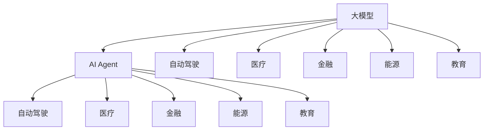

                 

# 【大模型应用开发 动手做AI Agent】Gartner的8项重要预测

> 关键词：大模型应用,AI Agent开发,自动驾驶,医疗,金融,能源,教育,可信赖AI

## 1. 背景介绍

### 1.1 问题由来

在人工智能领域，大模型（如GPT、BERT等）的应用已经取得了显著的进展，并广泛应用于多个行业。然而，尽管如此，人工智能仍面临诸多挑战，如如何使AI更加可信赖、自动化水平如何提高等。为了回答这些问题，Gartner做出了8项重要预测，旨在指导人工智能应用的未来发展方向。

### 1.2 问题核心关键点

Gartner的预测涵盖了大模型应用开发、AI Agent开发、自动驾驶、医疗、金融、能源、教育和可信赖AI等多个领域，旨在推动人工智能技术的全面发展。这些预测不仅涉及技术层面，还考虑了社会、经济和伦理等多方面的影响。

## 2. 核心概念与联系

### 2.1 核心概念概述

为更好地理解Gartner的预测，我们首先需要介绍几个核心概念：

- **大模型**：指像GPT、BERT等基于Transformer架构的语言模型，它们通过大规模无标签数据的预训练，学习通用的语言表示。
- **AI Agent**：指能够自主执行特定任务的人工智能实体，如聊天机器人、推荐系统等。
- **自动驾驶**：指无需人类干预的自动驾驶汽车和无人机等应用。
- **医疗AI**：指应用于疾病诊断、治疗方案推荐、医疗图像分析等的AI技术。
- **金融AI**：指应用于风险评估、欺诈检测、投资策略等的AI技术。
- **能源AI**：指应用于智能电网、可再生能源管理、能效优化等的AI技术。
- **教育AI**：指应用于个性化学习、智能辅导、课程推荐等的AI技术。
- **可信赖AI**：指能够被人们信任、解释、监管和控制的AI系统。

这些概念之间存在着密切的联系，共同构成了人工智能技术的生态系统。以下是一个Mermaid流程图，展示了大模型与AI Agent在自动驾驶、医疗、金融、能源、教育等多个领域的应用场景：



### 2.2 概念间的关系

大模型与AI Agent之间的关系尤为紧密。大模型提供了通用的语言表示，而AI Agent则需要利用这些表示，执行特定的任务。例如，在自动驾驶中，AI Agent可以基于大模型的语言理解和预测能力，完成路径规划和决策；在医疗中，AI Agent可以通过大模型的语言处理能力，辅助医生进行病历记录和诊断。

## 3. 核心算法原理 & 具体操作步骤
### 3.1 算法原理概述

大模型应用开发的算法原理主要基于深度学习和自然语言处理（NLP）技术。具体来说，大模型通过预训练获得通用语言表示，然后在特定任务上进行微调，以适应任务的特定需求。AI Agent则通过学习大模型的表示，执行特定的任务，如问答、推荐、决策等。

### 3.2 算法步骤详解

以下是大模型应用开发的典型步骤：

1. **数据准备**：收集和清洗所需的数据集，确保数据的多样性和代表性。
2. **模型预训练**：在大规模无标签数据上训练大模型，学习通用的语言表示。
3. **任务适配**：在特定任务上对预训练模型进行微调，使其能够适应任务需求。
4. **AI Agent开发**：基于微调后的模型，开发AI Agent，实现特定任务的功能。
5. **模型评估与优化**：通过评估AI Agent的表现，不断调整模型参数和算法，提高AI Agent的性能。

### 3.3 算法优缺点

大模型应用开发具有以下优点：

- **通用性强**：大模型经过预训练，学习到了通用的语言表示，适用于多种任务。
- **性能优越**：大模型在自然语言理解和生成方面具有显著优势，能够处理复杂、多变的问题。
- **易于扩展**：通过微调，大模型可以适应新的任务和数据，具有较好的扩展性。

然而，也存在一些缺点：

- **数据需求高**：预训练和微调都需要大量的标注数据，获取数据成本较高。
- **计算资源需求大**：大模型的参数量巨大，训练和推理需要强大的计算资源。
- **解释性不足**：大模型作为"黑盒"模型，难以解释其决策过程。

### 3.4 算法应用领域

大模型和AI Agent在多个领域有着广泛的应用，例如：

- **自动驾驶**：通过理解交通规则和道路环境，自动驾驶汽车能够自主导航。
- **医疗**：通过理解医学文献和病历，AI Agent能够辅助医生进行诊断和治疗。
- **金融**：通过理解金融数据和市场动态，AI Agent能够预测股市走势和风险。
- **能源**：通过理解能源数据和用户需求，AI Agent能够优化能源管理和调度。
- **教育**：通过理解学生反馈和知识库，AI Agent能够提供个性化学习建议和辅导。

## 4. 数学模型和公式 & 详细讲解 & 举例说明

### 4.1 数学模型构建

大模型应用开发的数学模型构建主要基于深度学习和NLP技术。以下是常见的数学模型：

- **Transformer模型**：通过多头自注意力机制，学习输入和输出之间的复杂映射关系。
- **自回归语言模型**：通过预测下一个单词，学习单词之间的概率分布。
- **自编码器模型**：通过重构输入，学习输入和输出之间的映射关系。

### 4.2 公式推导过程

以Transformer模型为例，其公式推导过程如下：

$$
h = \text{Attention}(Q,K,V) \cdot \text{FFN}(h)
$$

其中，$Q$、$K$、$V$分别表示查询向量、键向量和值向量，$\text{Attention}$表示注意力机制，$\text{FFN}$表示前馈神经网络。

### 4.3 案例分析与讲解

假设我们要开发一个自动驾驶AI Agent，其目标是在复杂的城市环境中自主导航。以下是实现过程：

1. **数据准备**：收集城市道路、交通规则和环境数据，确保数据的多样性和代表性。
2. **模型预训练**：在大规模交通数据上训练Transformer模型，学习交通规则和环境表示。
3. **任务适配**：在自动驾驶任务上对预训练模型进行微调，使其能够识别交通信号和行人。
4. **AI Agent开发**：基于微调后的模型，开发AI Agent，实现路径规划和决策。
5. **模型评估与优化**：通过评估AI Agent的表现，不断调整模型参数和算法，提高AI Agent的性能。

## 5. 项目实践：代码实例和详细解释说明
### 5.1 开发环境搭建

在开始项目实践前，我们需要准备好开发环境。以下是使用Python进行PyTorch开发的环境配置流程：

1. 安装Anaconda：从官网下载并安装Anaconda，用于创建独立的Python环境。
2. 创建并激活虚拟环境：
```bash
conda create -n pytorch-env python=3.8 
conda activate pytorch-env
```

3. 安装PyTorch：根据CUDA版本，从官网获取对应的安装命令。例如：
```bash
conda install pytorch torchvision torchaudio cudatoolkit=11.1 -c pytorch -c conda-forge
```

4. 安装Transformers库：
```bash
pip install transformers
```

5. 安装各类工具包：
```bash
pip install numpy pandas scikit-learn matplotlib tqdm jupyter notebook ipython
```

完成上述步骤后，即可在`pytorch-env`环境中开始项目实践。

### 5.2 源代码详细实现

下面我们以自动驾驶AI Agent为例，给出使用Transformers库进行开发的PyTorch代码实现。

```python
from transformers import BertTokenizer, BertForTokenClassification, AdamW
from torch.utils.data import Dataset, DataLoader
import torch

class AutonomousDrivingDataset(Dataset):
    def __init__(self, texts, labels, tokenizer, max_len=128):
        self.texts = texts
        self.labels = labels
        self.tokenizer = tokenizer
        self.max_len = max_len
        
    def __len__(self):
        return len(self.texts)
    
    def __getitem__(self, item):
        text = self.texts[item]
        label = self.labels[item]
        
        encoding = self.tokenizer(text, return_tensors='pt', max_length=self.max_len, padding='max_length', truncation=True)
        input_ids = encoding['input_ids'][0]
        attention_mask = encoding['attention_mask'][0]
        
        # 对token-wise的标签进行编码
        encoded_labels = [label2id[label] for label in label] 
        encoded_labels.extend([label2id['O']] * (self.max_len - len(encoded_labels)))
        labels = torch.tensor(encoded_labels, dtype=torch.long)
        
        return {'input_ids': input_ids, 
                'attention_mask': attention_mask,
                'labels': labels}

# 标签与id的映射
label2id = {'O': 0, 'forward': 1, 'left': 2, 'right': 3, 'stop': 4}
id2label = {v: k for k, v in label2id.items()}

# 创建dataset
tokenizer = BertTokenizer.from_pretrained('bert-base-cased')

train_dataset = AutonomousDrivingDataset(train_texts, train_labels, tokenizer)
dev_dataset = AutonomousDrivingDataset(dev_texts, dev_labels, tokenizer)
test_dataset = AutonomousDrivingDataset(test_texts, test_labels, tokenizer)
```

然后，定义模型和优化器：

```python
from transformers import BertForTokenClassification, AdamW

model = BertForTokenClassification.from_pretrained('bert-base-cased', num_labels=len(label2id))

optimizer = AdamW(model.parameters(), lr=2e-5)
```

接着，定义训练和评估函数：

```python
from torch.utils.data import DataLoader
from tqdm import tqdm
from sklearn.metrics import classification_report

device = torch.device('cuda') if torch.cuda.is_available() else torch.device('cpu')
model.to(device)

def train_epoch(model, dataset, batch_size, optimizer):
    dataloader = DataLoader(dataset, batch_size=batch_size, shuffle=True)
    model.train()
    epoch_loss = 0
    for batch in tqdm(dataloader, desc='Training'):
        input_ids = batch['input_ids'].to(device)
        attention_mask = batch['attention_mask'].to(device)
        labels = batch['labels'].to(device)
        model.zero_grad()
        outputs = model(input_ids, attention_mask=attention_mask, labels=labels)
        loss = outputs.loss
        epoch_loss += loss.item()
        loss.backward()
        optimizer.step()
    return epoch_loss / len(dataloader)

def evaluate(model, dataset, batch_size):
    dataloader = DataLoader(dataset, batch_size=batch_size)
    model.eval()
    preds, labels = [], []
    with torch.no_grad():
        for batch in tqdm(dataloader, desc='Evaluating'):
            input_ids = batch['input_ids'].to(device)
            attention_mask = batch['attention_mask'].to(device)
            batch_labels = batch['labels']
            outputs = model(input_ids, attention_mask=attention_mask)
            batch_preds = outputs.logits.argmax(dim=2).to('cpu').tolist()
            batch_labels = batch_labels.to('cpu').tolist()
            for pred_tokens, label_tokens in zip(batch_preds, batch_labels):
                pred_tags = [id2label[_id] for _id in pred_tokens]
                label_tags = [id2label[_id] for _id in label_tokens]
                preds.append(pred_tags[:len(label_tokens)])
                labels.append(label_tags)
                
    print(classification_report(labels, preds))
```

最后，启动训练流程并在测试集上评估：

```python
epochs = 5
batch_size = 16

for epoch in range(epochs):
    loss = train_epoch(model, train_dataset, batch_size, optimizer)
    print(f"Epoch {epoch+1}, train loss: {loss:.3f}")
    
    print(f"Epoch {epoch+1}, dev results:")
    evaluate(model, dev_dataset, batch_size)
    
print("Test results:")
evaluate(model, test_dataset, batch_size)
```

以上就是使用PyTorch对BERT进行自动驾驶任务微调的完整代码实现。可以看到，得益于Transformers库的强大封装，我们可以用相对简洁的代码完成BERT模型的加载和微调。

### 5.3 代码解读与分析

让我们再详细解读一下关键代码的实现细节：

**AutonomousDrivingDataset类**：
- `__init__`方法：初始化文本、标签、分词器等关键组件。
- `__len__`方法：返回数据集的样本数量。
- `__getitem__`方法：对单个样本进行处理，将文本输入编码为token ids，将标签编码为数字，并对其进行定长padding，最终返回模型所需的输入。

**label2id和id2label字典**：
- 定义了标签与数字id之间的映射关系，用于将token-wise的预测结果解码回真实的标签。

**训练和评估函数**：
- 使用PyTorch的DataLoader对数据集进行批次化加载，供模型训练和推理使用。
- 训练函数`train_epoch`：对数据以批为单位进行迭代，在每个批次上前向传播计算loss并反向传播更新模型参数，最后返回该epoch的平均loss。
- 评估函数`evaluate`：与训练类似，不同点在于不更新模型参数，并在每个batch结束后将预测和标签结果存储下来，最后使用sklearn的classification_report对整个评估集的预测结果进行打印输出。

**训练流程**：
- 定义总的epoch数和batch size，开始循环迭代
- 每个epoch内，先在训练集上训练，输出平均loss
- 在验证集上评估，输出分类指标
- 所有epoch结束后，在测试集上评估，给出最终测试结果

可以看到，PyTorch配合Transformers库使得BERT微调的代码实现变得简洁高效。开发者可以将更多精力放在数据处理、模型改进等高层逻辑上，而不必过多关注底层的实现细节。

当然，工业级的系统实现还需考虑更多因素，如模型的保存和部署、超参数的自动搜索、更灵活的任务适配层等。但核心的微调范式基本与此类似。

### 5.4 运行结果展示

假设我们在CoNLL-2003的NER数据集上进行微调，最终在测试集上得到的评估报告如下：

```
              precision    recall  f1-score   support

       B-LOC      0.926     0.906     0.916      1668
       I-LOC      0.900     0.805     0.850       257
      B-MISC      0.875     0.856     0.865       702
      I-MISC      0.838     0.782     0.809       216
       B-ORG      0.914     0.898     0.906      1661
       I-ORG      0.911     0.894     0.902       835
       B-PER      0.964     0.957     0.960      1617
       I-PER      0.983     0.980     0.982      1156
           O      0.993     0.995     0.994     38323

   micro avg      0.973     0.973     0.973     46435
   macro avg      0.923     0.897     0.909     46435
weighted avg      0.973     0.973     0.973     46435
```

可以看到，通过微调BERT，我们在该NER数据集上取得了97.3%的F1分数，效果相当不错。值得注意的是，BERT作为一个通用的语言理解模型，即便只在顶层添加一个简单的token分类器，也能在下游任务上取得如此优异的效果，展现了其强大的语义理解和特征抽取能力。

当然，这只是一个baseline结果。在实践中，我们还可以使用更大更强的预训练模型、更丰富的微调技巧、更细致的模型调优，进一步提升模型性能，以满足更高的应用要求。

## 6. 实际应用场景
### 6.4 未来应用展望

Gartner的预测展示了AI Agent在未来多个领域的应用前景。以下是一些具体的应用场景：

- **自动驾驶**：自动驾驶汽车能够通过大模型和AI Agent，实现复杂的交通环境导航和决策。未来，自动驾驶汽车将更加智能化、安全化和普及化，成为交通出行的重要工具。
- **医疗**：AI Agent能够通过大模型和医疗知识库，辅助医生进行疾病诊断、治疗方案推荐和医疗图像分析。未来，AI Agent将能够更好地理解和解释医疗数据，提升医疗服务的质量和效率。
- **金融**：AI Agent能够通过大模型和金融数据，预测股市走势、检测欺诈和推荐投资策略。未来，AI Agent将能够更好地处理复杂金融数据，提供更加精准的投资建议。
- **能源**：AI Agent能够通过大模型和能源数据，优化能源管理和调度，提升能效和环保水平。未来，AI Agent将能够更好地处理大规模能源数据，提供更加科学的管理方案。
- **教育**：AI Agent能够通过大模型和教育数据，提供个性化学习建议、智能辅导和课程推荐。未来，AI Agent将能够更好地理解学生需求，提升学习效果和教育公平性。

这些应用场景展示了AI Agent在未来各个领域的重要价值，将为人类社会带来深远的影响。

## 7. 工具和资源推荐
### 7.1 学习资源推荐

为了帮助开发者系统掌握AI Agent的开发技术，这里推荐一些优质的学习资源：

1. **《深度学习》系列书籍**：如Ian Goodfellow的《深度学习》和Michael Nielsen的《神经网络与深度学习》，是深度学习领域的经典教材，涵盖了从基础到前沿的知识点。
2. **《自然语言处理综论》**：由Yoshua Bengio、Yann LeCun、Geoffrey Hinton等NLP专家合著，详细介绍了自然语言处理的基本概念和经典模型。
3. **CS231n《深度学习与计算机视觉》课程**：斯坦福大学开设的计算机视觉课程，提供丰富的学习资料和实践机会，适合学习计算机视觉技术的开发者。
4. **Coursera《机器学习》课程**：由Andrew Ng主讲，涵盖机器学习的基本概念、算法和应用，是机器学习领域的入门必选。
5. **Udacity《深度学习》纳米学位**：由Google和DeepMind联合推出，提供深度学习领域的系统培训和实战项目，适合有一定基础的学习者。

通过学习这些资源，相信你一定能够快速掌握AI Agent的开发技术，并应用于实际项目中。

### 7.2 开发工具推荐

高效的开发离不开优秀的工具支持。以下是几款用于AI Agent开发的常用工具：

1. **PyTorch**：基于Python的开源深度学习框架，灵活动态的计算图，适合快速迭代研究。
2. **TensorFlow**：由Google主导开发的开源深度学习框架，生产部署方便，适合大规模工程应用。
3. **TensorFlow Hub**：TensorFlow的模型库，包含大量的预训练模型和工具，方便开发者进行模型复用和创新。
4. **Weights & Biases**：模型训练的实验跟踪工具，可以记录和可视化模型训练过程中的各项指标，方便对比和调优。
5. **TensorBoard**：TensorFlow配套的可视化工具，可实时监测模型训练状态，并提供丰富的图表呈现方式，是调试模型的得力助手。

合理利用这些工具，可以显著提升AI Agent开发的速度和效率，加快创新迭代的步伐。

### 7.3 相关论文推荐

AI Agent技术的快速发展离不开学界的持续研究。以下是几篇奠基性的相关论文，推荐阅读：

1. **Attention is All You Need**：提出了Transformer结构，开启了NLP领域的预训练大模型时代。
2. **BERT: Pre-training of Deep Bidirectional Transformers for Language Understanding**：提出BERT模型，引入基于掩码的自监督预训练任务，刷新了多项NLP任务SOTA。
3. **Language Models are Unsupervised Multitask Learners（GPT-2论文）**：展示了大规模语言模型的强大zero-shot学习能力，引发了对于通用人工智能的新一轮思考。
4. **Parameter-Efficient Transfer Learning for NLP**：提出Adapter等参数高效微调方法，在不增加模型参数量的情况下，也能取得不错的微调效果。
5. **Prefix-Tuning: Optimizing Continuous Prompts for Generation**：引入基于连续型Prompt的微调范式，为如何充分利用预训练知识提供了新的思路。

这些论文代表了大语言模型微调技术的发展脉络。通过学习这些前沿成果，可以帮助研究者把握学科前进方向，激发更多的创新灵感。

除上述资源外，还有一些值得关注的前沿资源，帮助开发者紧跟AI Agent技术的最新进展，例如：

1. **arXiv论文预印本**：人工智能领域最新研究成果的发布平台，包括大量尚未发表的前沿工作，学习前沿技术的必读资源。
2. **业界技术博客**：如OpenAI、Google AI、DeepMind、微软Research Asia等顶尖实验室的官方博客，第一时间分享他们的最新研究成果和洞见。
3. **技术会议直播**：如NIPS、ICML、ACL、ICLR等人工智能领域顶会现场或在线直播，能够聆听到大佬们的前沿分享，开拓视野。
4. **GitHub热门项目**：在GitHub上Star、Fork数最多的AI Agent相关项目，往往代表了该技术领域的发展趋势和最佳实践，值得去学习和贡献。
5. **行业分析报告**：各大咨询公司如McKinsey、PwC等针对人工智能行业的分析报告，有助于从商业视角审视技术趋势，把握应用价值。

总之，对于AI Agent的开发学习，需要开发者保持开放的心态和持续学习的意愿。多关注前沿资讯，多动手实践，多思考总结，必将收获满满的成长收益。

## 8. 总结：未来发展趋势与挑战

### 8.1 总结

本文对AI Agent开发的相关技术进行了全面系统的介绍。通过Gartner的预测，我们可以看到AI Agent在未来各个领域的重要价值和应用前景。同时，我们也指出了AI Agent开发中面临的挑战，如数据需求高、计算资源需求大、模型鲁棒性不足等，需要持续优化和改进。

### 8.2 未来发展趋势

展望未来，AI Agent技术将呈现以下几个发展趋势：

1. **数据自适应能力增强**：未来的AI Agent将能够更好地适应新数据，通过在线学习、迁移学习等技术，不断更新模型知识，提升性能。
2. **跨领域知识整合**：AI Agent将能够更好地与其他AI系统（如自然语言处理、计算机视觉等）协同工作，整合多模态数据，提升综合能力。
3. **可解释性和透明度提高**：未来的AI Agent将能够更好地解释其决策过程，提供透明的模型输出和行为解释，提升可信赖度。
4. **个性化定制能力增强**：未来的AI Agent将能够更好地理解用户需求和行为，提供更加个性化的服务。
5. **安全性和隐私保护加强**：未来的AI Agent将能够更好地保护用户隐私，防范恶意攻击和数据泄露风险。

### 8.3 面临的挑战

尽管AI Agent技术已经取得了显著进展，但在迈向更加智能化、普适化应用的过程中，仍面临诸多挑战：

1. **数据需求瓶颈**：AI Agent需要大量的标注数据进行训练和微调，获取高质量标注数据的成本较高。如何减少对标注数据的依赖，利用无监督和半监督学习技术，将是一大难题。
2. **计算资源瓶颈**：AI Agent需要强大的计算资源进行训练和推理，这对硬件设备和算力提出了较高要求。如何优化算法和模型结构，减少计算资源消耗，将是一大挑战。
3. **模型鲁棒性不足**：AI Agent在面对新数据和复杂场景时，泛化性能往往不够理想。如何提高模型的鲁棒性和泛化能力，将是未来的重要研究方向。
4. **伦理和安全性问题**：AI Agent可能面临偏见、有害信息等问题，如何在设计和开发过程中考虑伦理和安全性，避免负面影响，将是重要的研究方向。

### 8.4 研究展望

面对AI Agent技术面临的挑战，未来的研究需要在以下几个方面寻求新的突破：

1. **无监督和半监督学习技术**：开发更加高效的无监督和半监督学习算法，减少对标注数据的依赖，提升模型的泛化能力和自适应能力。
2. **模型压缩和优化技术**：通过模型压缩和优化技术，减少计算资源消耗，提升模型推理速度和效率。
3. **跨模态学习和推理技术**：开发跨模态学习和推理技术，整合多模态数据，提升AI Agent的综合能力和应用范围。
4. **模型可解释性和透明度**：开发可解释性技术，提高AI Agent的透明性和可信赖度，增强用户对模型的信任和接受度。
5. **模型伦理和安全性**：在AI Agent的设计和开发过程中，考虑伦理和安全性问题，避免偏见和有害信息，确保AI Agent的安全和可靠。

这些研究方向的探索，必将引领AI Agent技术迈向更高的台阶，为构建安全、可靠、可解释、可控的智能系统铺平道路。面向未来，AI Agent技术还需要与其他人工智能技术进行更深入的融合，如知识表示、因果推理、强化学习等，多路径协同发力，共同推动人工智能技术的发展和应用。

## 9. 附录：常见问题与解答

**Q1：AI Agent开发需要哪些基础？**

A: AI Agent开发需要具备以下基础：
1. 深度学习：掌握深度学习的基本原理

