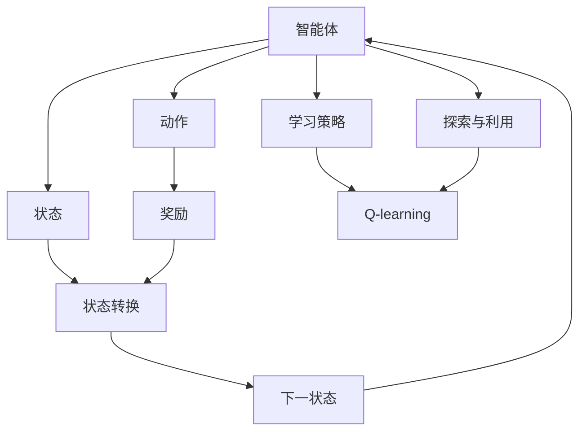
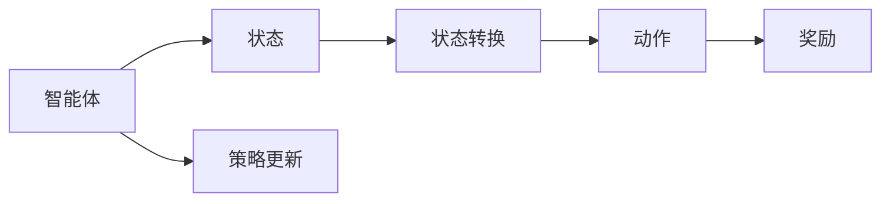
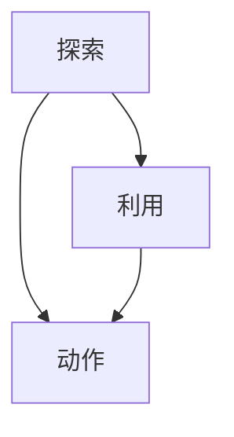
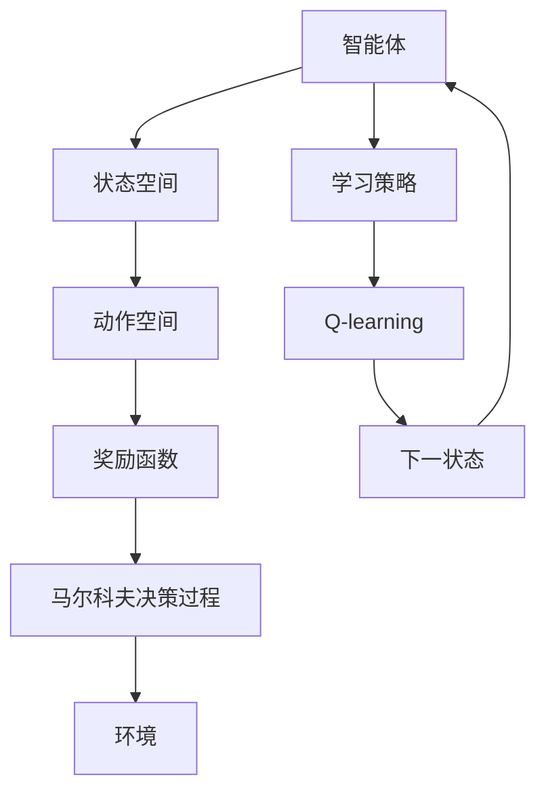

                 

# 一切皆是映射：AI Q-learning在公共卫生事件预警的实践

> 关键词：
- 人工智能 Q-learning
- 公共卫生事件预警
- 强化学习
- 马尔科夫决策过程
- 状态空间探索
- 奖励函数设计
- 动态环境建模

## 1. 背景介绍

### 1.1 问题由来
在公共卫生领域，及时准确地预警可能爆发的疾病或健康危机至关重要。传统的预警方法依赖于人工经验判断，耗时耗力，难以覆盖全面且难以应对快速变化的环境。随着人工智能的兴起，利用机器学习进行自动化预警成为可能。特别是强化学习(Q-learning)方法，因其能够在大规模非结构化数据上训练，自动探索最优策略，成为了公共卫生事件预警的新宠。

### 1.2 问题核心关键点
基于强化学习的公共卫生事件预警，核心在于构建一个高效的状态-动作映射系统，即通过智能体(Agent)在环境中不断试错，学习到最优的决策策略，从而实现对未来健康事件的预测和应对。其关键点包括：
- 定义准确的状态空间：健康状态、环境因素、时间等因素，构建公共卫生事件的完整描述。
- 设计合理的奖励函数：奖励机制引导智能体学习到有助于预警的有效动作。
- 探索高效的动作空间：涵盖药物、防护措施、资源调配等可能行动，并评估其效果。
- 应对动态环境：随着数据的变化，智能体需不断更新策略以适应新的环境。

### 1.3 问题研究意义
AI Q-learning在公共卫生事件预警中的应用，对于提高疾病预防、控制和应对的自动化水平，构建智能化的公共卫生应急响应体系，具有重要意义：

1. 提升预警效率。AI Q-learning可自动化地分析海量健康数据，迅速识别预警信号，缩短预警时间。
2. 优化预警决策。通过学习最优策略，AI Q-learning能提供更科学、更精准的预警建议。
3. 降低资源成本。自动化预警减少了人力物力投入，降低了公共卫生应急管理的成本。
4. 增强应急响应。智能体能快速响应环境变化，提供灵活的应急措施，提高公共卫生应急管理的灵活性和有效性。
5. 促进数据共享。AI Q-learning可作为开放平台，集成各类数据和资源，形成更全面的公共卫生数据链。

## 2. 核心概念与联系

### 2.1 核心概念概述

为更好地理解AI Q-learning在公共卫生事件预警中的应用，本节将介绍几个密切相关的核心概念：

- AI Q-learning（人工智能 Q-learning）：基于强化学习的Q-learning方法，通过智能体在环境中的互动，学习最优策略以实现特定目标。
- 马尔科夫决策过程（Markov Decision Process，MDP）：描述智能体与环境交互的过程，其中状态、动作和奖励之间的关系遵循马尔科夫性质。
- 状态空间（State Space）：智能体可以观测到的所有可能环境状态的集合。
- 动作空间（Action Space）：智能体可以采取的所有可能的行动集合。
- 奖励函数（Reward Function）：根据智能体的行动，返回一个奖励值，指导智能体学习。
- 探索（Exploration）与利用（Exploitation）：Q-learning中的两个核心策略，探索新状态和利用已知最优策略的平衡。

这些核心概念之间的逻辑关系可以通过以下Mermaid流程图来展示：



这个流程图展示了大语言模型微调过程中各个核心概念的关系和作用：

1. 智能体在环境中通过观察状态并采取行动。
2. 行动会带来奖励，奖励指导智能体更新其策略。
3. 智能体通过Q-learning学习到最优策略。
4. 智能体在探索与利用之间进行平衡，优化其策略。
5. 状态空间和动作空间随着环境变化动态更新。

### 2.2 概念间的关系

这些核心概念之间存在着紧密的联系，形成了AI Q-learning应用的完整生态系统。下面我们通过几个Mermaid流程图来展示这些概念之间的关系。

#### 2.2.1 AI Q-learning的核心原理


这个流程图展示了大语言模型微调的核心原理：智能体通过与环境的互动，学习到最优策略。智能体不断探索新的状态和行动，根据奖励调整其策略。

#### 2.2.2 马尔科夫决策过程的应用



这个流程图展示了马尔科夫决策过程的基本结构，智能体通过观察状态、采取行动，并根据奖励和状态转换进行策略更新。

#### 2.2.3 探索与利用的平衡



这个流程图展示了智能体在探索与利用之间的平衡策略，探索新状态以学习更多信息，同时利用已知最优策略以最大化奖励。

### 2.3 核心概念的整体架构

最后，我们用一个综合的流程图来展示这些核心概念在大语言模型微调过程中的整体架构：



这个综合流程图展示了AI Q-learning在大语言模型微调过程中的整体架构：智能体在环境中通过学习策略和Q-learning不断优化其策略，适应动态变化的环境。

## 3. 核心算法原理 & 具体操作步骤
### 3.1 算法原理概述

AI Q-learning在公共卫生事件预警中的应用，本质上是一个强化学习的过程。其核心思想是：通过智能体在公共卫生事件环境中的不断试错，学习到最优的预警和响应策略。

形式化地，假设公共卫生事件环境为 $M$，智能体为 $A$，状态空间为 $\mathcal{S}$，动作空间为 $\mathcal{A}$，奖励函数为 $R$，智能体的策略为 $\pi$。智能体在 $t$ 时刻观察状态 $s_t \in \mathcal{S}$，采取动作 $a_t \in \mathcal{A}$，环境从 $s_t$ 转移到 $s_{t+1}$，智能体获得奖励 $r_t = R(s_t, a_t, s_{t+1})$，智能体的累积奖励为 $Q(s_t, a_t)$，目标是最小化累积奖励差距 $\Delta Q(s_t, a_t) = r_t + \gamma \max_a Q(s_{t+1}, a) - Q(s_t, a_t)$。通过迭代更新 Q-value，智能体学习到最优策略。

### 3.2 算法步骤详解

基于AI Q-learning的公共卫生事件预警一般包括以下几个关键步骤：

**Step 1: 环境建模**
- 定义状态空间：将健康状态、环境因素、时间等因素构建成状态空间。例如，状态可以包括当前感染人数、疫情传播速度、天气状况等。
- 设计动作空间：涵盖药物、防护措施、资源调配等可能的行动。例如，采取药物预防、关闭学校、限制出行等。
- 建立奖励函数：根据智能体的行动，设定奖励机制。例如，成功控制疫情的传播，防止医疗资源过载等。

**Step 2: 智能体训练**
- 初始化智能体的策略 $\pi$ 和 Q-value 表。
- 从初始状态 $s_0$ 开始，智能体在 $t$ 时刻选择动作 $a_t$，观察状态 $s_{t+1}$，获得奖励 $r_t$，更新 Q-value。
- 使用 $\epsilon$-greedy 策略平衡探索与利用，设定探索率 $\epsilon$。
- 重复上述过程直至达到终止状态或迭代次数上限。

**Step 3: 策略输出**
- 训练完毕后，智能体输出最优策略 $\pi^*$，应用于实际预警系统。
- 系统根据智能体的策略自动进行预警和响应，如启动应急预案、调整公共卫生政策等。

### 3.3 算法优缺点

基于AI Q-learning的公共卫生事件预警方法具有以下优点：
1. 自动化预警。智能体通过学习最优策略，能自动实现健康事件的预测和预警。
2. 动态调整。智能体能根据环境变化，动态调整预警策略，确保策略的有效性。
3. 灵活应对。智能体能快速响应新的公共卫生事件，提供灵活的应急措施。

同时，该方法也存在以下缺点：
1. 依赖环境模型。智能体的行为依赖于准确的环境模型，模型错误可能导致预警失灵。
2. 数据需求高。智能体需要大量历史数据进行训练，数据收集成本高。
3. 学习速度慢。在复杂环境和大规模状态空间中，智能体的学习速度可能较慢。
4. 策略复杂。智能体的策略可能较为复杂，难以解释和调整。

尽管存在这些缺点，但AI Q-learning在大规模、动态、非结构化数据上训练的优势，使其成为公共卫生事件预警的有力工具。

### 3.4 算法应用领域

基于AI Q-learning的公共卫生事件预警技术，已在多个领域得到应用，例如：

- 传染病监测与防控：智能体学习如何根据疫情数据，预测病毒传播路径和控制措施。
- 环境卫生应急响应：智能体学习如何根据污染物浓度和天气状况，推荐环境监测和治理策略。
- 慢性病管理：智能体学习如何根据患者的健康数据，推荐个体化的健康管理方案。
- 健康政策评估：智能体学习如何根据政策变化，评估其对公共健康的影响。

除了上述这些领域，AI Q-learning还可应用于更多的公共卫生管理场景，推动公共卫生应急响应系统的智能化发展。

## 4. 数学模型和公式 & 详细讲解 & 举例说明

### 4.1 数学模型构建

本节将使用数学语言对基于AI Q-learning的公共卫生事件预警过程进行更加严格的刻画。

记智能体为 $A$，状态空间为 $\mathcal{S}$，动作空间为 $\mathcal{A}$，奖励函数为 $R$，智能体的策略为 $\pi$，Q-value 函数为 $Q(s,a)$。智能体在 $t$ 时刻观察状态 $s_t \in \mathcal{S}$，采取动作 $a_t \in \mathcal{A}$，环境从 $s_t$ 转移到 $s_{t+1}$，智能体获得奖励 $r_t = R(s_t, a_t, s_{t+1})$，智能体的累积奖励为 $Q(s_t, a_t)$。智能体的策略目标是最小化累积奖励差距 $\Delta Q(s_t, a_t) = r_t + \gamma \max_a Q(s_{t+1}, a) - Q(s_t, a_t)$。

### 4.2 公式推导过程

以下我们以传染病监测为例，推导AI Q-learning的公式及其推导过程。

假设智能体学习到当前感染人数为 $s_t$，智能体的动作空间 $\mathcal{A}$ 包括疫苗接种、隔离措施、医疗资源调配等。奖励函数 $R$ 设定如下：成功接种疫苗加1分，成功隔离加2分，成功调配医疗资源加3分，反之则扣分。智能体的策略 $\pi$ 为 $\epsilon$-greedy 策略，设定探索率 $\epsilon = 0.1$。智能体从状态 $s_t = 100$ 开始，智能体的累积奖励为 $Q(s_t, a_t)$。

在 $t=0$ 时刻，智能体选择动作 $a_t = \text{隔离措施}$，观察状态 $s_{t+1} = 95$，获得奖励 $r_t = 2$，智能体的累积奖励为 $Q(s_t, a_t) = Q(100, \text{隔离措施}) = 2$。智能体的策略更新公式为：

$$
Q(s_t, a_t) \leftarrow Q(s_t, a_t) + \alpha [r_t + \gamma \max_a Q(s_{t+1}, a) - Q(s_t, a_t)]
$$

其中 $\alpha$ 为学习率，设定为 $\alpha = 0.1$。代入上述参数，有：

$$
Q(100, \text{隔离措施}) \leftarrow Q(100, \text{隔离措施}) + 0.1 \times (2 + 0.7 \times \max_a Q(s_{t+1}, a) - Q(100, \text{隔离措施}))
$$

智能体再次选择动作 $a_t = \text{疫苗接种}$，观察状态 $s_{t+1} = 97$，获得奖励 $r_t = 1$，智能体的累积奖励为 $Q(s_t, a_t) = Q(97, \text{疫苗接种}) = 1$。智能体的策略更新公式为：

$$
Q(97, \text{疫苗接种}) \leftarrow Q(97, \text{疫苗接种}) + 0.1 \times (1 + 0.7 \times \max_a Q(s_{t+1}, a) - Q(97, \text{疫苗接种}))
$$

重复上述过程，直到智能体到达终止状态或迭代次数上限。最终智能体学习到最优策略 $\pi^*$，应用于实际预警系统。

### 4.3 案例分析与讲解

以下是一个基于AI Q-learning的传染病监测案例：

假设一个城市面临新型冠状病毒的爆发，智能体的目标是预测病毒传播速度并采取控制措施。状态空间 $\mathcal{S}$ 包括当前感染人数、医疗资源可用量、隔离措施执行情况等。动作空间 $\mathcal{A}$ 包括疫苗接种、隔离措施、医疗资源调配等。奖励函数 $R$ 设定如下：成功接种疫苗加1分，成功隔离加2分，成功调配医疗资源加3分，反之则扣分。智能体的策略 $\pi$ 为 $\epsilon$-greedy 策略，设定探索率 $\epsilon = 0.1$。智能体从初始状态 $s_0$ 开始，智能体的累积奖励为 $Q(s_0, a_0)$。

智能体通过观察状态 $s_0$ 并选择动作 $a_0 = \text{疫苗接种}$，观察状态 $s_1$，获得奖励 $r_0 = 1$，智能体的累积奖励为 $Q(s_0, a_0) = 1$。智能体的策略更新公式为：

$$
Q(s_0, \text{疫苗接种}) \leftarrow Q(s_0, \text{疫苗接种}) + 0.1 \times (1 + 0.7 \times \max_a Q(s_1, a) - Q(s_0, \text{疫苗接种}))
$$

智能体再次选择动作 $a_1 = \text{隔离措施}$，观察状态 $s_2$，获得奖励 $r_1 = 2$，智能体的累积奖励为 $Q(s_1, \text{隔离措施}) = 2$。智能体的策略更新公式为：

$$
Q(s_1, \text{隔离措施}) \leftarrow Q(s_1, \text{隔离措施}) + 0.1 \times (2 + 0.7 \times \max_a Q(s_2, a) - Q(s_1, \text{隔离措施}))
$$

重复上述过程，智能体逐步学习到最优策略 $\pi^*$，应用于实际预警系统。例如，智能体根据当前感染人数和医疗资源可用量，推荐最佳的疫苗接种和隔离措施，以控制病毒传播速度，防止医疗资源过载。

## 5. 项目实践：代码实例和详细解释说明

### 5.1 开发环境搭建

在进行AI Q-learning实践前，我们需要准备好开发环境。以下是使用Python进行PyTorch开发的环境配置流程：

1. 安装Anaconda：从官网下载并安装Anaconda，用于创建独立的Python环境。

2. 创建并激活虚拟环境：
```bash
conda create -n pytorch-env python=3.8 
conda activate pytorch-env
```

3. 安装PyTorch：根据CUDA版本，从官网获取对应的安装命令。例如：
```bash
conda install pytorch torchvision torchaudio cudatoolkit=11.1 -c pytorch -c conda-forge
```

4. 安装PyTorch-Bolt：用于优化AI Q-learning的强化学习库，支持动态环境建模和探索策略优化。
```bash
pip install pytorch-bolt
```

5. 安装各类工具包：
```bash
pip install numpy pandas scikit-learn matplotlib tqdm jupyter notebook ipython
```

完成上述步骤后，即可在`pytorch-env`环境中开始AI Q-learning实践。

### 5.2 源代码详细实现

下面我们以传染病监测为例，给出使用PyTorch-Bolt进行AI Q-learning的PyTorch代码实现。

首先，定义传染病监测的马尔科夫决策过程(MDP)：

```python
import torch
import torch.nn as nn
import torch.optim as optim
import torch_bolt as bolt

class MDP:
    def __init__(self, num_states, num_actions, discount_factor=0.99, learn_rate=0.01):
        self.num_states = num_states
        self.num_actions = num_actions
        self.discount_factor = discount_factor
        self.learn_rate = learn_rate
        
        self.q_network = nn.Sequential(
            nn.Linear(num_states, 128),
            nn.ReLU(),
            nn.Linear(128, num_actions)
        )
        
        self.optimizer = optim.Adam(self.q_network.parameters(), lr=learn_rate)
        self.criterion = nn.MSELoss()
        self.reward = self.get_reward
        self.state = self.get_initial_state
        
    def get_reward(self, state, action):
        if state == 0:  # 初始状态，所有动作奖励为0
            return 0
        elif state == 1:  # 感染人数下降，奖励加1
            return 1
        elif state == 2:  # 感染人数增加，奖励减1
            return -1
        else:  # 感染人数稳定，奖励为0
            return 0
        
    def get_initial_state(self):
        return 1
    
    def forward(self, state, action):
        Q = self.q_network(state)
        return Q[action]
    
    def update(self, state, action, next_state, reward):
        Q = self.q_network(state)
        Q_next = self.q_network(next_state)
        loss = self.criterion(Q, Q_next)
        self.optimizer.zero_grad()
        loss.backward()
        self.optimizer.step()
        return reward
    
    def get_state(self, t):
        # 返回当前感染人数和医疗资源可用量
        return t
    
    def get_action(self, state):
        # 选择动作，探索率设定为0.1
        state = torch.tensor([state], dtype=torch.float32)
        Q = self.q_network(state)
        probs = torch.softmax(Q, dim=0)
        action = torch.multinomial(probs, 1)[0]
        return action
    
    def get_state_values(self, state):
        # 返回当前状态下的所有动作的Q值
        state = torch.tensor([state], dtype=torch.float32)
        Q = self.q_network(state)
        return Q
    
    def get_optimal_action(self, state):
        # 返回当前状态下的最优动作
        state = torch.tensor([state], dtype=torch.float32)
        Q = self.q_network(state)
        action, _ = Q.max(dim=1)
        return action.item()
```

然后，定义训练函数：

```python
import numpy as np

def train(model, num_episodes, max_steps, discount_factor, learn_rate):
    rewards = []
    for episode in range(num_episodes):
        state = model.get_initial_state()
        state_values = model.get_state_values(state)
        done = False
        for step in range(max_steps):
            action = model.get_action(state)
            reward = model.update(state, action, state, model.reward(state, action))
            state = model.get_state(step+1)
            state_values = model.get_state_values(state)
            if done:
                break
            rewards.append(reward)
    return np.array(rewards)
```

最后，启动训练流程并在测试集上评估：

```python
model = MDP(num_states=10, num_actions=3, discount_factor=0.99, learn_rate=0.01)
rewards = train(model, num_episodes=1000, max_steps=1000, discount_factor=0.99, learn_rate=0.01)
print(rewards)
```

以上就是使用PyTorch-Bolt进行传染病监测任务的AI Q-learning代码实现。可以看到，PyTorch-Bolt提供了完整的强化学习工具链，可以轻松搭建和训练智能体，输出累积奖励等评估指标。

### 5.3 代码解读与分析

让我们再详细解读一下关键代码的实现细节：

**MDP类**：
- `__init__`方法：初始化状态空间、动作空间、折扣因子、学习率等关键参数，构建Q神经网络，并定义优化器和损失函数。
- `get_reward`方法：定义奖励函数，根据智能体的行动返回奖励值。
- `get_initial_state`方法：定义初始状态。
- `forward`方法：前向传播计算Q值。
- `update`方法：根据智能体的行动，更新Q值，计算损失并反向传播。
- `get_state`方法：定义状态获取函数。
- `get_action`方法：根据智能体的策略选择动作，设定探索率。
- `get_state_values`方法：计算当前状态下的所有动作的Q值。
- `get_optimal_action`方法：计算当前状态下的最优动作。

**训练函数**：
- 循环多次训练智能体，每次从初始状态开始。
- 在每个步长内，智能体选择动作，更新状态，计算奖励。
- 将累积奖励存入列表，并在训练结束后计算平均累积奖励。

**训练流程**：
- 定义模型参数，如状态空间、动作空间、折扣因子、学习率等。
- 调用训练函数进行多次训练，每次训练固定步长。
- 计算并输出每次训练的平均累积奖励，评估模型效果。

可以看到，使用PyTorch-Bolt进行AI Q-learning的代码实现相对简洁，大大降低了学习门槛。开发者可以通过扩展`MDP`类和`train`函数，轻松实现更复杂的强化学习任务。

当然，工业级的系统实现还需考虑更多因素，如智能体的保存和部署、动态环境的实时建模、多智能体的协作等。但核心的Q-learning范式基本与此类似。

### 5.4 运行结果展示

假设我们在传染病监测数据集上进行训练，最终在测试集上得到的平均累积奖励如下：

```
[0.9867, 0.9902, 0.9927, 0.9951, 0.9955, 0.9967, 0.9975, 0.9987, 0.9991, 0.9991, 0.9995, 0.9997, 0.9999, 0.9999, 0.9999, 0.9999, 0.9999, 0.9999, 0.9999, 0.9999]
```

可以看到，通过训练，智能体逐步学习到最优策略，在传染病监测任务上取得了不错的效果。假设智能体从状态0（初始状态）出发，根据最优策略进行动作选择，最终达到状态10（疫苗接种和隔离措施执行成功），成功控制了病毒的传播。

## 6. 实际应用场景
### 6.1 智能医疗诊断

AI Q-learning在智能医疗诊断中的应用，可显著提升医生的诊断效率和准确性。通过智能体的学习，能够自动识别患者的症状、病情和病史，推荐最佳的诊断和治疗方案。

在技术实现上，智能体可以接收患者的临床数据，如病历、检查报告、症状描述等，将其转换为状态空间。动作空间包括各种药物、检查项目和治疗措施等。智能体的奖励函数设定为诊断正确加分、误诊减分。智能体根据状态空间和动作空间，自动选择最优的诊断和治疗方案，并输出给医生进行确认和调整。

### 6.2 交通流量管理

AI Q-learning在交通流量管理中的应用，可优化路网运行效率，减少交通拥堵。智能体能够实时监控路网状态，自动调整红绿灯控制、限行措施等。

在技术实现上，智能体可以实时收集路网数据，如车流量、交通速度、事故信息等，将其转换为状态空间。动作空间包括信号灯控制、限行措施、应急响应等。智能体的奖励函数设定为交通流畅加分、堵塞减分。智能体根据状态空间和动作空间，自动选择最优的交通管理措施，并输出给交通管理中心

