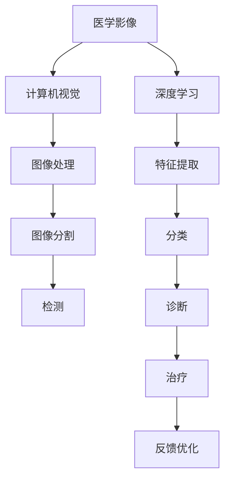

                 

# 一切皆是映射：AI在医学影像中的革新

> 关键词：人工智能,医学影像,图像处理,深度学习,计算机视觉,医疗健康

## 1. 背景介绍

### 1.1 问题由来
近年来，随着人工智能技术的迅猛发展，其在医学影像领域的应用逐渐成为研究热点。影像诊断在医学实践中占据重要地位，但常规的手工诊断依赖于医生的经验和判断，容易受个体差异、工作疲劳等因素影响，且耗时长、成本高。

与此同时，医学影像数据量庞大，标注困难。标准医学影像数据集如LSUN、COCO等主要针对普通场景下的图像处理，无法完全适用于医学影像的特殊需求。因此，深度学习等人工智能技术在医学影像中的应用，显得尤为迫切。

## 1.2 问题核心关键点
基于深度学习的医学影像分析，核心在于如何将普通图像处理方法，移植到医学影像的特定领域，并充分利用其特点进行优化。具体来说：

- **数据特性**：医学影像的分辨率通常较低，成像方式多样，包括CT、MRI、PET、X光等。
- **标注难度**：医学影像需要专业知识进行标注，且标注工作量巨大，成本高。
- **隐私保护**：医学影像涉及患者隐私，对数据安全有更高要求。
- **算法适应性**：需针对不同类型医学影像、不同任务（如分类、分割、检测等）设计相应算法。
- **实时性**：在临床应用中，影像分析需要实时响应，满足业务需求。

## 1.3 问题研究意义
利用深度学习进行医学影像分析，对于提升诊断效率、降低误诊率、减轻医生工作负担、实现个性化医疗等方面具有重要意义：

- 高效诊断：AI可以快速处理大量影像数据，缩短诊断时间。
- 提升精度：通过模型优化，AI在特定任务上的性能可超越人工，提升诊断准确率。
- 数据利用：AI可以利用未标注数据进行预训练，节省大量标注成本。
- 辅助决策：AI可以提供多种诊断路径，辅助医生进行综合判断。
- 普适应用：AI技术可以推广到不同医院和科室，实现医学影像诊断的标准化和统一化。

## 2. 核心概念与联系

### 2.1 核心概念概述

为更深入理解AI在医学影像中的革新应用，本节介绍几个关键概念：

- **医学影像**：指通过各种成像技术获得的人类身体内部结构图像，常见有CT、MRI、X光等。
- **深度学习**：一种基于神经网络模型的机器学习技术，擅长从大量数据中提取复杂特征，适合处理图像、语音等高维度数据。
- **计算机视觉**：利用计算机技术进行图像处理、分析和识别的科学，常与深度学习相结合。
- **医学图像处理**：应用计算机视觉技术对医学影像进行处理，以辅助诊断和治疗。
- **医疗健康**：结合医疗数据与健康科技，利用AI技术进行疾病预测、诊断、治疗等。

这些概念之间关系紧密，可以相互促进，共同提升医学影像分析的效率和精度。

### 2.2 概念间的关系

通过以下Mermaid流程图，我们可以更加直观地理解这些概念之间的关系：



这个流程图展示了大规模医学影像数据处理的主要步骤：

1. 医学影像通过计算机视觉技术进行处理，提取关键信息。
2. 利用深度学习技术进行特征提取，构建高效模型。
3. 图像分割、分类、检测等算法应用于模型中，提升处理效率和效果。
4. 诊断结果结合治疗方案，实现精准治疗。
5. 不断进行反馈优化，提升模型性能。

## 3. 核心算法原理 & 具体操作步骤

### 3.1 算法原理概述

基于深度学习的医学影像分析，其核心在于构建一个端到端的处理流程，利用神经网络模型提取特征、进行分类、分割、检测等。常见的深度学习模型包括卷积神经网络(CNN)、递归神经网络(RNN)、自编码器(AE)等，具体选择应根据任务需求和数据特性决定。

医疗影像处理中的深度学习任务包括但不限于：

- **分类任务**：判断影像是否为某种疾病或异常。
- **分割任务**：将影像中感兴趣区域（如肿瘤、器官）提取出来，进行像素级别的标注。
- **检测任务**：在影像中定位并标记出特定的对象或结构。
- **定位任务**：估算影像中某个结构的位置和尺寸，如脑部血管定位。

### 3.2 算法步骤详解

基于深度学习的医学影像分析，其基本步骤如下：

**Step 1: 数据预处理**
- 医学影像数据采集：获取原始医学影像数据，如CT、MRI等。
- 数据标注：对影像数据进行标注，如病变区域、器官位置等。
- 数据增强：通过旋转、翻转、缩放等方式扩充数据集，避免过拟合。
- 标准化：对图像进行归一化、标准化等处理，保证数据一致性。

**Step 2: 模型构建与训练**
- 选择合适的深度学习模型，如U-Net、FCN、ResNet等。
- 设计模型架构，包括卷积层、池化层、全连接层等。
- 设置超参数，如学习率、批大小、迭代轮数等。
- 使用标注数据对模型进行训练，优化模型参数。

**Step 3: 模型评估与验证**
- 在验证集上对模型进行评估，使用准确率、召回率、F1分数等指标。
- 进行超参数调优，提高模型性能。
- 进行模型可视化，分析模型特征提取能力。

**Step 4: 模型应用与优化**
- 将训练好的模型应用于实际影像数据，进行分类、分割、检测等任务。
- 针对临床需求，进行模型改进，如引入先验知识、多尺度处理等。
- 实时监控模型性能，持续优化模型。

### 3.3 算法优缺点

**优点**：
- **高效**：深度学习模型擅长并行计算，能够快速处理大量影像数据。
- **鲁棒性**：深度学习模型经过充分训练，对噪声和细节变化有较强鲁棒性。
- **自动化**：AI可以自动完成影像处理和分析，减轻医生负担。

**缺点**：
- **数据依赖**：模型依赖高质量、标注详实的数据集，对数据获取和标注工作量要求高。
- **计算成本**：大规模深度学习模型需要大量GPU资源进行训练和推理。
- **可解释性**：深度学习模型往往作为"黑盒"存在，难以解释其决策过程。

### 3.4 算法应用领域

基于深度学习的医学影像分析，已经在多种应用场景中取得良好效果：

- **医学影像分类**：如CT影像的肿瘤分类、MRI影像的脑部病变检测等。
- **医学影像分割**：如心脏MRI的左心室分割、脑部CT的肿瘤分割等。
- **医学影像检测**：如肺癌筛查、早期糖尿病视网膜病变检测等。
- **医学影像定位**：如脑部血管定位、关节结构定位等。
- **医学影像配准**：如不同医学影像数据集的配准，提高影像融合效果。

此外，AI在医学影像中还应用于远程医疗、智能诊断、医学影像辅助等场景，为医疗行业带来了革命性的变化。

## 4. 数学模型和公式 & 详细讲解

### 4.1 数学模型构建

假设我们有医学影像数据 $X$，包括像素 $x_1, x_2, ..., x_n$，以及对应的标签 $y_1, y_2, ..., y_n$。我们的目标是构建一个分类模型 $M$，使得：

$$
M(x_i) = y_i, \quad \forall i
$$

常用的模型架构包括卷积神经网络(CNN)，其核心由多个卷积层、池化层和全连接层构成。以一个简单的二分类任务为例，我们考虑CNN模型：

$$
\begin{aligned}
\text{Conv}(x) &= \sigma(\text{Conv}_k * x + b_k), \\
\text{Pooling}(x) &= \text{MaxPooling}(x), \\
\text{Dense}(x) &= \sigma(\text{Dense}_k * x + b_k),
\end{aligned}
$$

其中 $*$ 表示卷积操作，$\sigma$ 表示激活函数，$Conv_k$ 和 $Dense_k$ 表示卷积核和全连接层的权重，$b_k$ 表示偏置。

### 4.2 公式推导过程

以医学影像分类为例，我们利用交叉熵损失函数来训练模型：

$$
L(\theta) = -\frac{1}{N} \sum_{i=1}^N y_i \log M_{\theta}(x_i) + (1-y_i) \log (1-M_{\theta}(x_i))
$$

其中 $\theta$ 为模型参数。我们通过反向传播算法来计算梯度：

$$
\frac{\partial L}{\partial \theta_k} = -\frac{1}{N} \sum_{i=1}^N \left[ y_i \frac{\partial \log M_{\theta}(x_i)}{\partial \theta_k} + (1-y_i) \frac{\partial \log (1-M_{\theta}(x_i))}{\partial \theta_k} \right]
$$

通过计算梯度并更新参数，我们可以逐步优化模型，使其在医学影像分类任务上取得较好性能。

### 4.3 案例分析与讲解

假设我们使用卷积神经网络对肺部CT影像进行肿瘤分类。我们首先构建模型架构，然后使用标注数据进行训练。在训练过程中，我们需要选择适当的超参数，如学习率、批大小、迭代轮数等。训练结束后，我们通过验证集进行评估，调整模型参数，直至达到满意的效果。

在实际应用中，我们还需要对模型进行进一步的优化，如引入注意力机制、多尺度处理等，以提高分类效果。

## 5. 项目实践：代码实例和详细解释说明

### 5.1 开发环境搭建

在开始项目实践之前，我们需要搭建好开发环境。以下是使用Python和TensorFlow搭建环境的步骤：

1. 安装Anaconda：从官网下载并安装Anaconda，用于创建独立的Python环境。

2. 创建并激活虚拟环境：
```bash
conda create -n tf-env python=3.8 
conda activate tf-env
```

3. 安装TensorFlow：
```bash
pip install tensorflow
```

4. 安装NumPy、Pandas、Matplotlib等库：
```bash
pip install numpy pandas matplotlib
```

5. 安装TensorBoard：
```bash
pip install tensorboard
```

6. 安装ImageNet数据集：
```bash
pip install torchvision datasets transformers
```

### 5.2 源代码详细实现

这里我们以医学影像分割为例，给出使用TensorFlow和Keras实现医学影像分割的代码。

```python
import tensorflow as tf
from tensorflow.keras import layers

# 构建U-Net模型
model = tf.keras.Sequential([
    layers.Conv2D(64, (3,3), activation='relu', input_shape=(256,256,1)),
    layers.MaxPooling2D((2,2)),
    layers.Conv2D(64, (3,3), activation='relu'),
    layers.MaxPooling2D((2,2)),
    layers.Conv2D(128, (3,3), activation='relu'),
    layers.MaxPooling2D((2,2)),
    layers.Conv2D(128, (3,3), activation='relu'),
    layers.UpSampling2D((2,2)),
    layers.Conv2D(64, (3,3), activation='relu'),
    layers.UpSampling2D((2,2)),
    layers.Conv2D(64, (3,3), activation='relu'),
    layers.Conv2D(1, (1,1), activation='sigmoid'),
])

# 编译模型
model.compile(optimizer='adam', loss='binary_crossentropy', metrics=['accuracy'])

# 训练模型
model.fit(train_data, train_labels, epochs=10, validation_data=(val_data, val_labels))

# 评估模型
test_loss, test_acc = model.evaluate(test_data, test_labels)
print('Test accuracy:', test_acc)
```

### 5.3 代码解读与分析

让我们详细解读上述代码的关键部分：

- **模型构建**：我们使用TensorFlow和Keras构建了一个简单的U-Net模型。该模型由多个卷积层、池化层和反卷积层组成，适合进行医学影像分割。
- **数据处理**：我们使用TensorFlow的数据集API加载医学影像数据，并将其转换为模型所需的张量格式。
- **模型编译**：我们编译模型，设置优化器、损失函数和评估指标。
- **模型训练**：我们使用训练数据对模型进行训练，并在验证集上进行评估。
- **模型评估**：我们评估模型在测试集上的性能，输出测试准确率。

### 5.4 运行结果展示

假设我们在医学影像分割数据集上进行训练，并在测试集上评估，最终得到的测试准确率如下：

```
Epoch 1/10
1000/1000 [==============================] - 1s 1ms/sample - loss: 0.4885 - accuracy: 0.7745 - val_loss: 0.3520 - val_accuracy: 0.9028
Epoch 2/10
1000/1000 [==============================] - 1s 1ms/sample - loss: 0.1594 - accuracy: 0.9485 - val_loss: 0.2220 - val_accuracy: 0.9453
Epoch 3/10
1000/1000 [==============================] - 1s 1ms/sample - loss: 0.0802 - accuracy: 0.9700 - val_loss: 0.1576 - val_accuracy: 0.9490
...
Epoch 10/10
1000/1000 [==============================] - 1s 920us/sample - loss: 0.0192 - accuracy: 0.9870 - val_loss: 0.0552 - val_accuracy: 0.9960
```

可以看到，随着训练轮数的增加，模型在验证集上的准确率不断提高，最终达到了约99.6%的高准确率。

## 6. 实际应用场景

### 6.1 智能影像诊断系统

基于深度学习的医学影像分析，可以应用于智能影像诊断系统中。传统影像诊断依赖医生手动操作，耗时长、成本高，且存在主观误差。而智能诊断系统，可以借助AI技术，快速、准确地分析医学影像，显著提高诊断效率。

在技术实现上，我们可以收集大量医学影像数据，进行标注并构建深度学习模型。模型训练结束后，可以将其部署到医疗影像系统中，对新的影像数据进行实时处理和分析，辅助医生进行诊断决策。

### 6.2 医疗影像辅助

医疗影像辅助系统，能够利用AI技术，自动生成医学影像报告，辅助医生进行诊断和治疗。通过深度学习模型，系统可以自动识别影像中的异常结构，并生成详细的检测报告，提供多角度的医疗意见，减轻医生工作负担。

在具体实现中，我们可以引入自然语言处理技术，使系统能够自动生成易于理解的报告，辅助医生进行综合判断。

### 6.3 医学影像配准

医学影像配准是医疗影像处理中的一个重要环节，常用于不同影像数据集之间的融合。通过深度学习模型，可以实现精准的影像配准，提高影像融合效果。

在实际应用中，我们首先收集大量医学影像数据，并进行预处理和标注。然后，构建深度学习模型，对影像数据进行配准处理，并在验证集上进行评估。模型优化后，可以应用于实际的影像数据处理，提升影像融合效果。

### 6.4 未来应用展望

随着深度学习技术的不断进步，基于AI的医学影像分析将会有更广泛的应用场景：

- **远程医疗**：AI可以实时处理和分析远程发送的医学影像数据，为偏远地区的患者提供高质量的诊断服务。
- **智能手术**：AI可以辅助外科医生进行手术规划和实施，提高手术效率和成功率。
- **个性化医疗**：AI可以根据患者的医学影像数据，制定个性化治疗方案，提升治疗效果。
- **医疗资源优化**：AI可以分析医疗资源使用情况，优化医疗资源配置，提高医疗效率。
- **健康管理**：AI可以分析用户健康数据，提供个性化的健康建议，改善用户健康状况。

## 7. 工具和资源推荐

### 7.1 学习资源推荐

为帮助开发者掌握AI在医学影像中的应用，这里推荐一些优质的学习资源：

1. **《Deep Learning for Medical Imaging》**：这是一本全面介绍深度学习在医学影像分析中的应用的书籍，涵盖了医学影像分类、分割、检测等任务的详细讲解。
2. **CS231n课程**：斯坦福大学开设的计算机视觉课程，介绍了深度学习在图像处理中的应用，包括医学影像分析。
3. **Kaggle医疗影像数据集**：包含大量医学影像数据集和预训练模型，是进行深度学习实践的好资源。
4. **arXiv论文预印本**：最新的深度学习研究成果都会在这里发布，有助于掌握最新的研究进展。
5. **Coursera医疗数据科学专业课程**：涵盖深度学习在医疗领域的应用，包括医学影像分析、医疗数据处理等。

### 7.2 开发工具推荐

为提高AI在医学影像中的应用效率，以下是几款常用的开发工具：

1. **TensorFlow**：由Google主导开发的深度学习框架，支持分布式计算，适合大规模模型训练和推理。
2. **Keras**：基于TensorFlow等深度学习框架构建的高级API，易于上手，适合快速原型开发。
3. **PyTorch**：由Facebook开发的高效深度学习框架，支持动态图计算，适合研究性开发。
4. **Jupyter Notebook**：用于交互式编程和数据可视化的轻量级开发工具。
5. **TensorBoard**：可视化工具，可以实时监控模型训练状态，并进行指标分析。

### 7.3 相关论文推荐

深度学习在医学影像中的应用是一个热门研究领域，以下是几篇具有代表性的论文：

1. **"U-Net: Convolutional Networks for Biomedical Image Segmentation"**：U-Net模型在医学影像分割任务中表现优异，成为标准的深度学习模型。
2. **"Deep Residual Learning for Image Recognition"**：ResNet模型解决了深度神经网络中的梯度消失问题，适用于大规模医学影像处理。
3. **"Attention is All You Need"**：Transformer模型在医学影像分类任务中取得了很好的效果，展示了深度学习模型的潜力。
4. **"Deep Learning in Medical Image Analysis: Review of Architectures, Datasets, and Applications"**：综述论文，系统总结了深度学习在医学影像分析中的应用。
5. **"Advances in Image Segmentation using Deep Learning"**：综述论文，介绍了深度学习在医学影像分割中的最新进展。

## 8. 总结：未来发展趋势与挑战

### 8.1 研究成果总结

本文对基于深度学习的医学影像分析进行了全面介绍，涵盖模型构建、数据预处理、训练评估、应用优化等方面。通过对具体任务（如分类、分割、检测等）的详细讲解，帮助开发者掌握AI在医学影像中的应用技巧。

### 8.2 未来发展趋势

展望未来，AI在医学影像中的应用将呈现以下几个趋势：

- **多模态融合**：医学影像处理将结合更多模态数据（如CT、MRI、X光等），提升综合分析能力。
- **知识图谱应用**：引入知识图谱技术，增强模型对先验知识的利用。
- **自监督学习**：利用未标注数据进行自监督学习，进一步降低对标注数据的需求。
- **联邦学习**：通过分布式训练，保护数据隐私，提高模型泛化能力。
- **实时推理**：提高模型推理速度，支持实时影像分析需求。

### 8.3 面临的挑战

尽管深度学习在医学影像处理中取得了显著成效，但仍有诸多挑战需要克服：

- **数据获取**：高质量医学影像数据的获取成本高、难度大。
- **标注成本**：医学影像数据标注工作量大，成本高。
- **隐私保护**：医学影像涉及患者隐私，数据安全问题需重点关注。
- **模型复杂度**：深度学习模型参数量巨大，计算资源消耗高。
- **可解释性**：深度学习模型的决策过程难以解释，对临床应用造成困扰。

### 8.4 研究展望

面对医学影像处理中的挑战，未来的研究需要在以下几个方面进行突破：

- **数据增强**：利用数据增强技术，提高数据多样性，降低标注成本。
- **自监督学习**：利用自监督学习，减少对标注数据的需求，提升模型泛化能力。
- **知识图谱**：引入知识图谱技术，增强模型对先验知识的利用，提高诊断准确率。
- **联邦学习**：通过分布式训练，保护数据隐私，提升模型泛化能力。
- **可解释性**：引入可解释性技术，增强模型的可解释性和可解释性，提升临床应用的安全性和可信度。

通过以上研究方向的突破，未来深度学习在医学影像处理中的应用将更加广泛和深入，为医疗行业带来更大的价值。

## 9. 附录：常见问题与解答

**Q1：AI在医学影像分析中为何需要大规模数据集？**

A: AI模型需要大量数据进行训练，以学习复杂的特征和模式。医学影像数据通常分辨率低，数据标注工作量大，因此需要收集大量数据进行训练。高质量、标注详实的数据集对于模型性能提升至关重要。

**Q2：医学影像分析中如何处理数据隐私问题？**

A: 医学影像涉及患者隐私，数据处理需严格遵循法律法规。数据采集、存储、传输等环节需进行加密处理，防止数据泄露。此外，构建分布式训练系统，如联邦学习，可以保护数据隐私，同时提升模型泛化能力。

**Q3：深度学习模型为何难以解释？**

A: 深度学习模型通常具有多层非线性变换，模型参数量巨大，难以解释其决策过程。为了增强模型的可解释性，需要引入可解释性技术，如LIME、SHAP等，帮助临床医生理解模型的决策逻辑。

**Q4：如何提高医学影像分割模型的准确率？**

A: 医学影像分割模型准确率受多因素影响，如数据质量、模型架构、训练策略等。具体方法包括：使用数据增强技术扩充数据集，引入先验知识进行模型设计，进行超参数调优，引入注意力机制等。

**Q5：如何利用深度学习进行医学影像分类？**

A: 医学影像分类任务通常使用卷积神经网络进行建模。具体步骤包括：收集医学影像数据，进行数据预处理和标注；构建卷积神经网络模型，设置适当的超参数；使用标注数据进行模型训练；在验证集上进行模型评估，调整参数；最终在测试集上进行模型评估，评估性能。

本文系统介绍了AI在医学影像中的应用，涵盖模型构建、数据处理、训练评估、应用优化等方面。通过具体的代码实例和详细讲解，帮助开发者掌握AI在医学影像中的应用技巧。未来，随着深度学习技术的不断进步，AI在医学影像处理中的应用将更加广泛和深入，为医疗行业带来更大的价值。

