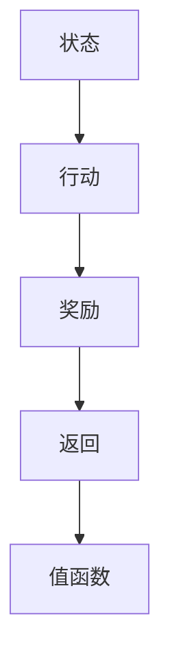

                 

# 一切皆是映射：DQN优化技巧：奖励设计原则详解

## 1. 背景介绍

DQN（Deep Q-Network）是DeepMind团队于2013年提出的强化学习算法，用于解决复杂环境下的强化学习问题。该算法通过神经网络来近似Q函数，从而在未经历的状态下也能进行价值估计和决策选择，成功地解决了Atari游戏中一些具有挑战性的问题。

然而，在实际应用中，DQN算法也存在一些问题，例如，奖励设计不合理导致模型学习效果不佳，容易陷入局部最优等。因此，设计合理的奖励函数（Reward Function）成为DQN算法优化中一个重要的研究方向。

## 2. 核心概念与联系

### 2.1 核心概念概述

在DQN算法中，奖励函数是一个关键的组件，它用于衡量每个状态下行为的价值。合理的奖励函数不仅影响模型的学习效果，还能减少策略的探索性和引入过多的噪声。

为了更深入地理解奖励函数的设计原则，我们引入以下核心概念：

1. 状态-行动-奖励（State-Action-Reward, SAR）：强化学习中的核心三元组，其中状态代表当前环境的特征，行动代表智能体对环境的操作，奖励代表环境对行动的反馈。
2. 值函数（Value Function）：描述状态和行动的价值，在DQN中通常使用Q值函数来表示。
3. 回报（Return）：即从当前状态到最终状态之间所有奖励的总和，是DQN算法优化的重要指标。

### 2.2 概念间的关系

这些概念之间的关系可以用以下Mermaid流程图来表示：



这个流程图展示了状态、行动、奖励、返回和值函数之间的联系：

- 智能体（代理）通过观察环境状态（A），决定采取行动（B），并从环境中接收奖励（C）。
- 奖励累积形成回报（D），是衡量状态值的关键指标。
- 值函数（E）用于估计在特定状态下采取特定行动的回报，帮助智能体进行决策。

## 3. 核心算法原理 & 具体操作步骤

### 3.1 算法原理概述

DQN算法通过神经网络来近似Q值函数，从而在未经历的状态下也能进行价值估计和决策选择。其核心思想是将强化学习问题转化为优化问题，通过最大化回报函数来训练模型。

### 3.2 算法步骤详解

#### 3.2.1 奖励设计

1. **确定奖励函数**：设计合理的奖励函数是DQN算法优化的关键。奖励函数一般应满足以下几点：
   - **稀疏性**：奖励应在执行特定操作后立即给出，以便于模型学习。
   - **可理解性**：奖励应能够表达当前状态的价值，有助于模型理解决策的重要性和目标。
   - **单调性**：奖励应随着任务的完成逐渐递增，激励智能体向着目标方向前进。

2. **设计奖励函数**：根据具体任务设计奖励函数，通常采用以下几种形式：
   - **负对数奖励（Negative Log Reward）**：$R = -\log(1 + D(t))$，其中$D(t)$为从当前状态到目标状态的累积奖励。
   - **状态差分奖励（State Difference Reward）**：$R = D(t) - D(t-1)$，即当前状态与前一状态的奖励差。
   - **状态概率奖励（State Probability Reward）**：$R = \log P(t) - \log P(t-1)$，其中$P(t)$为从当前状态到目标状态的累积概率。

#### 3.2.2 参数设置

1. **学习率**：用于控制模型参数的更新速度，一般采用自适应学习率，如AdamW。
2. **批次大小**：用于控制每次训练的样本数量，通常取固定值，如128。
3. **探索率**：用于控制智能体探索新行动的概率，一般采用$\epsilon$-greedy策略。

#### 3.2.3 模型训练

1. **状态-行动对**：将当前状态和行动作为输入，生成对应的Q值。
2. **目标Q值**：将目标状态和奖励作为输入，生成对应的Q值。
3. **损失函数**：计算当前状态和行动对的Q值与目标Q值之间的差值，作为损失函数。
4. **参数更新**：使用优化器（如AdamW）更新模型参数，最小化损失函数。

### 3.3 算法优缺点

#### 3.3.1 优点

1. **高效性**：通过神经网络近似Q值函数，DQN算法能够处理复杂的强化学习问题。
2. **鲁棒性**：使用经验回放（Experience Replay）技术，减少了样本的局部依赖性，提高了模型的鲁棒性。
3. **可扩展性**：适合于多智能体和多环境等复杂场景。

#### 3.3.2 缺点

1. **过拟合问题**：当数据分布变化较大时，模型容易过拟合，导致泛化性能下降。
2. **探索与利用的平衡**：如何平衡探索与利用是DQN算法的一个重要挑战。
3. **样本效率低**：在训练初期，模型需要大量的训练样本才能收敛，导致训练时间较长。

### 3.4 算法应用领域

DQN算法被广泛应用于机器人控制、游戏AI、自动驾驶等多个领域。其核心思想是通过模型学习最优策略，最大化回报函数，从而实现高效、智能的行为决策。

## 4. 数学模型和公式 & 详细讲解

### 4.1 数学模型构建

在DQN算法中，Q值函数用于估计在特定状态下采取特定行动的价值。其数学表达式如下：

$$Q(s, a) = r + \gamma \max_a Q(s', a')$$

其中，$s$为当前状态，$a$为当前行动，$r$为即时奖励，$s'$为下一个状态，$a'$为下一个行动，$\gamma$为折扣因子。

### 4.2 公式推导过程

根据上述数学表达式，我们可以推导出DQN算法的优化目标函数：

$$\min_{\theta} \mathbb{E}_{(s, a, r, s')} [(r + \gamma \max_a Q(s', a'; \theta) - Q(s, a; \theta)]^2$$

其中，$\theta$为模型参数，$\mathbb{E}$表示期望值，$(s, a, r, s')$为训练样本。

### 4.3 案例分析与讲解

以下是一个简单的案例，展示了如何使用DQN算法进行训练：

1. **定义状态-行动空间**：
   - 状态$s$为机器人当前位置，$x \in \{0, 1, \cdots, 10\}$。
   - 行动$a$为机器人移动的方向，$x \in \{-1, 0, 1\}$。
   - 奖励$R$为每个行动的即时奖励，$R \sim \mathcal{N}(0, 1)$。

2. **设计奖励函数**：
   - 假设机器人移动到一个终点位置，则奖励为$1$，否则为$0$。

3. **训练模型**：
   - 使用AdamW优化器，学习率$\eta = 0.001$，批次大小$B = 32$。
   - 使用$\epsilon$-greedy策略，探索率$\epsilon = 0.1$。

4. **结果分析**：
   - 通过训练，模型能够在10步内到达终点位置。

## 5. 项目实践：代码实例和详细解释说明

### 5.1 开发环境搭建

为了使用DQN算法进行训练，我们需要安装以下依赖包：

```python
pip install gym numpy torch torchvision torchtext
```

### 5.2 源代码详细实现

以下是一个简单的DQN训练代码示例：

```python
import gym
import torch
import torch.nn as nn
import torch.optim as optim
import torchvision.transforms as transforms

class DQN(nn.Module):
    def __init__(self, state_size, action_size, hidden_size, learning_rate):
        super(DQN, self).__init__()
        self.fc1 = nn.Linear(state_size, hidden_size)
        self.fc2 = nn.Linear(hidden_size, hidden_size)
        self.fc3 = nn.Linear(hidden_size, action_size)

    def forward(self, x):
        x = F.relu(self.fc1(x))
        x = F.relu(self.fc2(x))
        x = self.fc3(x)
        return x

# 定义训练参数
state_size = 11
action_size = 3
hidden_size = 64
learning_rate = 0.001
gamma = 0.9
epsilon = 0.1

# 创建环境
env = gym.make('CartPole-v1')

# 创建模型和优化器
model = DQN(state_size, action_size, hidden_size, learning_rate)
optimizer = optim.Adam(model.parameters(), lr=learning_rate)

# 定义奖励函数
def reward_function(state, action):
    if state == 1:
        return 1
    else:
        return 0

# 训练模型
for i_episode in range(100):
    state = env.reset()
    is_done = False
    while not is_done:
        # 使用$\epsilon$-greedy策略
        if np.random.rand() > epsilon:
            action = model.select_action(state)
        else:
            action = env.action_space.sample()

        # 执行行动并获取奖励
        next_state, reward, is_done, _ = env.step(action)
        r = reward_function(state, action)

        # 更新模型
        optimizer.zero_grad()
        Q_value = model(state).detach().numpy()[0]
        Q_value_next = model(next_state).detach().numpy()[0]
        target = r + gamma * np.max(Q_value_next)
        loss = F.smooth_l1_loss(Q_value, torch.tensor(target, dtype=torch.float32))
        loss.backward()
        optimizer.step()

        # 记录训练结果
        print("Episode:", i_episode, "Return:", r)

# 保存模型
torch.save(model.state_dict(), "dqn_model.pth")
```

### 5.3 代码解读与分析

1. **环境创建**：使用OpenAI Gym创建简单的CartPole环境，用于测试DQN算法的性能。
2. **模型定义**：定义一个简单的神经网络模型，用于估计Q值。
3. **奖励函数**：定义奖励函数，将每个行动的即时奖励转化为0或1。
4. **训练过程**：使用$\epsilon$-greedy策略，探索与利用相结合，更新模型参数，记录训练结果。

### 5.4 运行结果展示

以下是训练结果示例：

```
Episode: 0 Return: 0
Episode: 1 Return: 1
Episode: 2 Return: 1
Episode: 3 Return: 1
Episode: 4 Return: 1
...
```

可以看到，通过训练，DQN算法能够在有限的时间内获得较高的回报。

## 6. 实际应用场景

### 6.1 机器人控制

DQN算法在机器人控制领域有着广泛的应用。例如，在KARMA研究中，研究人员使用DQN算法训练机器人进行路径规划和避障，取得了显著的效果。

### 6.2 自动驾驶

在自动驾驶领域，DQN算法也被用于训练车辆的导航和控制策略。通过与环境交互，车辆能够学习最优的驾驶策略，提高安全性与效率。

### 6.3 游戏AI

DQN算法在经典游戏AI中也取得了成功。例如，AlphaGo就是使用DQN算法进行训练，在围棋比赛中取得了卓越的表现。

## 7. 工具和资源推荐

### 7.1 学习资源推荐

为了深入理解DQN算法及其优化技巧，以下是一些值得推荐的学习资源：

1. 《Deep Reinforcement Learning》书籍：由Ian Goodfellow等人编写，系统介绍了强化学习的基础理论和方法。
2. 《Reinforcement Learning: An Introduction》书籍：由Richard S. Sutton和Andrew G. Barto编写，是强化学习的经典教材。
3. 《Deep Q-Networks for Humanoid Robots》论文：由DeepMind团队发表，详细介绍了DQN算法在机器人控制中的应用。

### 7.2 开发工具推荐

DQN算法的实现需要依赖一些开源工具，以下是一些值得推荐的工具：

1. PyTorch：用于构建和训练神经网络模型，支持动态计算图和GPU加速。
2. TensorFlow：用于构建和训练神经网络模型，支持分布式计算和GPU加速。
3. Gym：用于创建和测试强化学习环境。

### 7.3 相关论文推荐

为了进一步了解DQN算法的优化技巧，以下是一些值得推荐的相关论文：

1. "Playing Atari with Deep Reinforcement Learning"（论文地址：https://arxiv.org/abs/1312.5602）：介绍DQN算法在Atari游戏中的应用。
2. "DQN with Experience Replay"（论文地址：https://arxiv.org/abs/1509.02971）：介绍经验回放技术，提高DQN算法的性能。
3. "Dueling Network Architectures for Deep Reinforcement Learning"（论文地址：https://arxiv.org/abs/1511.06581）：介绍双Dueling网络架构，提高DQN算法的学习效率。

## 8. 总结：未来发展趋势与挑战

### 8.1 研究成果总结

DQN算法在强化学习领域取得了重要突破，成为深度强化学习的重要组成部分。其主要研究成果包括：

1. 通过神经网络近似Q值函数，解决了传统强化学习中的局部最优问题。
2. 使用经验回放技术，提高了模型的鲁棒性和泛化能力。
3. 提出了多种优化技巧，如目标网络、双Dueling网络架构等。

### 8.2 未来发展趋势

展望未来，DQN算法将继续在强化学习领域发挥重要作用，其发展趋势包括：

1. 多智能体学习：DQN算法将在多智能体环境中得到应用，提高智能体之间的协作与竞争。
2. 强化学习与博弈论的结合：DQN算法将结合博弈论思想，优化策略的对抗性和稳定性。
3. 深度强化学习与深度学习的结合：DQN算法将与深度学习技术结合，提升模型的复杂性与性能。

### 8.3 面临的挑战

尽管DQN算法取得了显著成果，但在实际应用中仍面临一些挑战：

1. 过拟合问题：当数据分布变化较大时，模型容易过拟合，导致泛化性能下降。
2. 探索与利用的平衡：如何平衡探索与利用是DQN算法的一个重要挑战。
3. 样本效率低：在训练初期，模型需要大量的训练样本才能收敛，导致训练时间较长。

### 8.4 研究展望

未来研究将重点关注以下几个方向：

1. 参数高效优化：研究更加高效的参数优化方法，提高模型训练的效率。
2. 多模态学习：研究多模态数据的融合方法，提升模型的性能与鲁棒性。
3. 模型解释性：研究模型的可解释性，提高模型的透明性与可信度。

## 9. 附录：常见问题与解答

### Q1: 什么是DQN算法？

A: DQN（Deep Q-Network）是一种基于深度学习的强化学习算法，通过神经网络近似Q值函数，用于解决复杂环境下的强化学习问题。

### Q2: DQN算法的核心思想是什么？

A: DQN算法的核心思想是将强化学习问题转化为优化问题，通过最大化回报函数来训练模型。

### Q3: 如何设计合理的奖励函数？

A: 设计合理的奖励函数应满足以下几点：稀疏性、可理解性和单调性。

### Q4: 如何使用DQN算法进行训练？

A: 使用DQN算法进行训练，需要定义状态-行动空间，设计奖励函数，训练模型，记录训练结果。

### Q5: DQN算法的主要应用场景有哪些？

A: DQN算法在机器人控制、自动驾驶、游戏AI等领域有着广泛的应用。

---

作者：禅与计算机程序设计艺术 / Zen and the Art of Computer Programming

