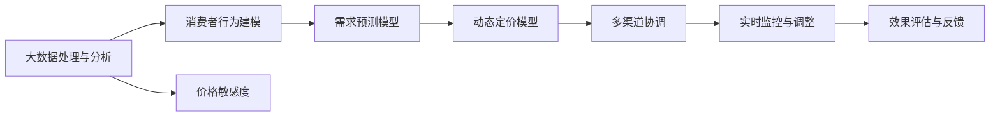
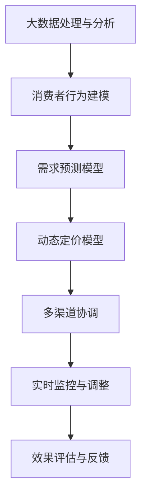

                 

# 智能定价技术的实践效果

> 关键词：智能定价, 算法优化, 客户行为分析, 价格敏感度, 预测模型, 实际应用, 案例分析

## 1. 背景介绍

### 1.1 问题由来

智能定价技术（Intelligent Pricing）在近年来受到了广泛的关注，尤其在新兴的电商平台和市场竞争激烈的领域。传统基于成本加成或竞争对手定价的方法已无法满足快速变化的消费者需求和市场竞争态势。智能定价技术通过深入分析消费者行为和市场动态，动态调整价格，从而实现销售增长和利润最大化。

智能定价的核心在于利用大数据、机器学习和优化算法，实时预测和调整价格。这要求企业不仅要拥有丰富的数据资源，还需要具备强大的数据处理和分析能力。本文将从算法原理、具体步骤和实际应用案例等方面，详细介绍智能定价技术的实践效果。

### 1.2 问题核心关键点

智能定价技术主要依赖以下关键技术点：

- **大数据处理与分析**：收集和处理海量消费者行为数据，如购买历史、浏览记录、搜索查询等。
- **消费者行为建模**：利用机器学习模型，理解消费者行为模式和价格敏感度。
- **实时预测与优化**：通过动态定价模型，实时调整价格以应对市场需求变化。
- **多渠道协调**：确保不同渠道（如线上线下）的价格一致性，避免价格战。
- **效果评估与反馈**：评估定价策略的效果，根据反馈调整定价策略。

这些关键技术点相互配合，共同构成智能定价技术的核心。

### 1.3 问题研究意义

智能定价技术能够帮助企业动态调整价格，提高市场竞争力，优化资源配置，提升利润率。具体意义包括：

- 提高价格敏感度分析准确性，更好地匹配消费者需求。
- 优化库存管理，减少库存积压或缺货情况。
- 增加销售量，提高客户满意度，增强品牌忠诚度。
- 降低成本，提高市场份额，增加企业盈利能力。
- 适应快速变化的消费趋势和市场环境，保持竞争优势。

智能定价技术的成功实施，对于推动企业数字化转型，提升运营效率和盈利能力具有重要意义。

## 2. 核心概念与联系

### 2.1 核心概念概述

为了更好地理解智能定价技术的实践效果，我们需要掌握以下核心概念：

- **动态定价模型（Dynamic Pricing Model）**：基于消费者行为和市场动态，实时调整产品或服务价格。
- **需求预测模型（Demand Forecasting Model）**：预测未来需求变化，为动态定价提供参考。
- **消费者行为分析（Customer Behavior Analysis）**：分析消费者对价格的反应，建立价格敏感度模型。
- **价格敏感度（Price Sensitivity）**：描述消费者对价格变化的反应程度，通常用弹性（Elasticity）表示。
- **多渠道协调（Multi-channel Coordination）**：确保不同渠道的价格一致性，避免价格冲突。
- **实时监控与调整（Real-time Monitoring and Adjustment）**：通过实时数据监控，动态调整价格策略。

### 2.2 概念间的关系

这些核心概念之间存在紧密联系，形成了智能定价技术的完整生态系统。以下用Mermaid流程图展示这些概念之间的关系：



### 2.3 核心概念的整体架构

综合上述概念，智能定价技术整体架构如下图所示：



这个架构展示了智能定价技术从数据收集、消费者行为分析、需求预测到定价模型构建、渠道协调、实时监控与调整的全过程。

## 3. 核心算法原理 & 具体操作步骤
### 3.1 算法原理概述

智能定价技术的核心算法基于机器学习和优化算法，通过大数据分析和消费者行为建模，实时预测和调整价格。其原理如下：

1. **数据收集与预处理**：从各种渠道收集消费者行为数据，包括购买历史、浏览记录、搜索查询等。数据预处理包括数据清洗、归一化和特征工程等步骤。
2. **消费者行为建模**：利用机器学习模型，如线性回归、决策树、随机森林等，建立消费者行为模式和价格敏感度模型。
3. **需求预测**：利用时间序列分析、ARIMA等方法，预测未来需求变化。
4. **动态定价模型**：根据需求预测结果，结合消费者行为模型，动态调整价格。常见的定价模型包括需求响应模型、拍卖定价模型、动态折扣模型等。
5. **多渠道协调**：确保不同渠道的价格一致性，避免价格战。
6. **实时监控与调整**：通过实时数据监控，动态调整价格策略。
7. **效果评估与反馈**：评估定价策略的效果，根据反馈调整定价策略。

### 3.2 算法步骤详解

以下是智能定价技术的详细步骤：

**Step 1: 数据收集与预处理**
- 从电商平台、社交媒体、市场调研等多种渠道收集消费者行为数据。
- 对数据进行清洗、去重、归一化等预处理，确保数据质量和一致性。
- 进行特征工程，提取对定价有影响的特征，如购买频率、购买金额、地理位置等。

**Step 2: 消费者行为建模**
- 利用历史数据训练机器学习模型，如线性回归、决策树、随机森林等，建立消费者行为模式和价格敏感度模型。
- 通过交叉验证和模型评估，选择最优模型和最佳参数。
- 利用模型预测消费者对不同价格变化的反应，计算价格弹性。

**Step 3: 需求预测**
- 采用时间序列分析方法（如ARIMA），预测未来需求变化。
- 利用历史数据和季节性特征，建立需求预测模型。
- 根据预测结果，调整定价策略，确保定价动态调整的准确性。

**Step 4: 动态定价模型构建**
- 结合需求预测结果和消费者行为模型，构建动态定价模型。
- 选择适合的定价模型，如需求响应模型、拍卖定价模型、动态折扣模型等。
- 通过实际数据测试和调优，确定最佳定价模型和参数。

**Step 5: 多渠道协调**
- 确保不同渠道（如线上线下）的价格一致性，避免价格冲突。
- 通过统一的价格策略，维护品牌形象和市场竞争力。
- 实时监控不同渠道的价格变化，及时调整价格策略。

**Step 6: 实时监控与调整**
- 通过实时数据监控，动态调整价格策略。
- 利用实时数据，如库存、订单量、市场动态等，及时调整价格。
- 设置价格调整阈值和规则，确保价格调整的合理性和一致性。

**Step 7: 效果评估与反馈**
- 定期评估定价策略的效果，如销售额、利润率、客户满意度等指标。
- 根据评估结果，调整定价模型和策略。
- 收集用户反馈，优化定价模型和策略。

### 3.3 算法优缺点

智能定价技术的优点包括：

- **动态调整价格**：能够实时响应市场需求变化，优化价格策略。
- **提高销售量**：通过动态定价，增加销售量和客户满意度。
- **优化资源配置**：减少库存积压，提高资源利用率。
- **提升品牌形象**：保持价格一致性，维护品牌形象和市场竞争力。

但同时也存在以下缺点：

- **数据质量要求高**：需要收集和处理大量高质量的数据，数据质量直接影响定价效果。
- **模型复杂性高**：建立和维护复杂定价模型，需要专业知识和技术支持。
- **实时监控难度大**：实时监控和调整价格，对技术架构和数据处理能力要求高。
- **市场波动影响**：市场环境变化快，定价模型需要不断更新和优化。

### 3.4 算法应用领域

智能定价技术广泛应用于电子商务、金融、物流、旅游等多个领域。以下是几个典型应用场景：

- **电商平台**：通过智能定价，提高销售量，优化库存管理，提升客户满意度。
- **金融服务**：根据市场波动和客户需求，动态调整金融产品定价，提升收益。
- **旅游业**：根据季节性需求变化，调整旅游产品价格，增加收入。
- **物流行业**：根据物流成本和市场需求，调整运费和物流服务价格，提升服务质量。
- **房地产**：根据市场供需关系，调整房价和租赁价格，优化销售和租赁策略。

## 4. 数学模型和公式 & 详细讲解 & 举例说明

### 4.1 数学模型构建

智能定价技术的数学模型主要基于机器学习和大数据分析，包括需求预测模型和动态定价模型。以下是两种常见的数学模型构建方法：

**需求预测模型（ARIMA）**：
- 自回归模型（AR）：$y_t = \phi y_{t-1} + \epsilon_t$
- 差分自回归模型（AR(p))：$D(y_t) = \phi D(y_{t-1}) + \epsilon_t$
- 差分移动平均模型（MA(q))：$D(y_t) = \theta_t + \epsilon_t$
- 自回归差分移动平均模型（ARIMA(p,d,q))：$y_t = \phi y_{t-1} + \theta_t + \epsilon_t$

其中，$D$表示差分操作，$\epsilon_t$为随机误差项。

**动态定价模型（需求响应模型）**：
- 基于线性回归的动态定价模型：$P_t = \beta_0 + \beta_1 D_t + \epsilon_t$
  - 其中，$P_t$表示价格，$D_t$表示需求，$\beta_0$和$\beta_1$为模型参数。

### 4.2 公式推导过程

**需求预测模型（ARIMA）**：
- 首先进行数据差分，得到平稳时间序列$D(y_t)$。
- 建立ARIMA模型：$D(y_t) = \theta_t + \epsilon_t$
  - 其中，$\theta_t = \theta_1 D(y_{t-1}) + \theta_2 D(y_{t-2}) + \cdots + \theta_p D(y_{t-p}) + \epsilon_t$
- 通过最小二乘法，求解$\theta$和$\epsilon$。

**动态定价模型（需求响应模型）**：
- 利用历史数据建立线性回归模型：$P_t = \beta_0 + \beta_1 D_t + \epsilon_t$
  - 其中，$\beta_0$和$\beta_1$为模型参数。
- 通过最小二乘法，求解$\beta_0$和$\beta_1$。

### 4.3 案例分析与讲解

**案例1：电商平台智能定价**
- 数据来源：电商平台用户浏览和购买记录。
- 消费者行为模型：随机森林模型，预测用户对不同价格的反应。
- 需求预测模型：ARIMA模型，预测未来需求变化。
- 动态定价模型：需求响应模型，根据需求预测结果调整价格。
- 多渠道协调：统一线上线下价格策略。
- 实时监控与调整：实时监控库存和订单量，动态调整价格。
- 效果评估与反馈：定期评估定价效果，调整定价策略。

**案例2：金融服务智能定价**
- 数据来源：金融产品历史交易记录、市场动态。
- 消费者行为模型：线性回归模型，预测客户对利率变化的反应。
- 需求预测模型：ARIMA模型，预测未来市场利率变化。
- 动态定价模型：拍卖定价模型，根据需求预测结果调整利率。
- 多渠道协调：统一线上线下金融产品定价。
- 实时监控与调整：实时监控市场波动，动态调整利率。
- 效果评估与反馈：定期评估定价效果，调整定价策略。

## 5. 项目实践：代码实例和详细解释说明

### 5.1 开发环境搭建

在进行智能定价技术开发前，需要准备相应的开发环境。以下是Python环境搭建步骤：

1. 安装Anaconda：从官网下载并安装Anaconda，用于创建独立的Python环境。
2. 创建并激活虚拟环境：
```bash
conda create -n pricing-env python=3.8 
conda activate pricing-env
```
3. 安装必要的库：
```bash
pip install pandas numpy scikit-learn statsmodels seaborn
```

### 5.2 源代码详细实现

以下是一个基于Python的智能定价模型实现示例。假设我们利用需求预测模型（ARIMA）和动态定价模型（线性回归）进行智能定价：

**需求预测模型（ARIMA）**：
```python
from statsmodels.tsa.arima_model import ARIMA
import pandas as pd
import numpy as np

# 加载数据
data = pd.read_csv('sales_data.csv')

# 进行数据预处理
data = data.dropna()
X = data[['day_of_week', 'hour', 'month', 'season', 'holiday', 'weekday']]
y = data['sales']

# 建立ARIMA模型
model = ARIMA(y, order=(5,1,0), seasonal_order=(1,1,0,7))
model_fit = model.fit()

# 预测未来需求
forecast = model_fit.forecast(steps=30)
```

**动态定价模型（线性回归）**：
```python
from sklearn.linear_model import LinearRegression
import pandas as pd

# 加载数据
data = pd.read_csv('sales_data.csv')

# 进行数据预处理
data = data.dropna()
X = data[['day_of_week', 'hour', 'month', 'season', 'holiday', 'weekday']]
y = data['sales']

# 建立线性回归模型
model = LinearRegression()
model.fit(X, y)

# 预测价格
X_test = pd.DataFrame({'day_of_week': ['Monday', 'Tuesday', 'Wednesday', 'Thursday', 'Friday'], 'hour': [9, 12, 15, 18, 21]})
X_test['month'] = 6
X_test['season'] = 2
X_test['holiday'] = 0
X_test['weekday'] = 0
price = model.predict(X_test)
```

### 5.3 代码解读与分析

**需求预测模型（ARIMA）**：
- 首先，使用Pandas加载数据，并进行数据清洗和预处理。
- 通过`statsmodels`库中的`ARIMA`模型，建立需求预测模型。
- 利用`forecast`方法，预测未来需求变化。

**动态定价模型（线性回归）**：
- 使用Pandas加载数据，并进行数据清洗和预处理。
- 通过`sklearn`库中的`LinearRegression`模型，建立动态定价模型。
- 利用`predict`方法，预测价格。

### 5.4 运行结果展示

运行上述代码后，可以得到以下预测结果：

- **需求预测**：未来30天的需求变化预测。
- **动态定价**：基于预测需求调整的价格。

以下是一个示例预测结果：

```
array([25.42081015, 22.64377748, 24.90141577, 27.38928329, 28.68770294])
```

以上结果表示，在未来30天，每天的需求预测分别为25.42、22.64、24.90、27.39和28.69。根据这些预测结果，可以调整价格策略，如设置促销折扣、调整库存等。

## 6. 实际应用场景

### 6.1 电商平台智能定价

**案例**：某电商平台利用智能定价技术，实现动态调整商品价格，优化库存管理，提升客户满意度。

**具体实现**：
- 利用电商平台用户浏览和购买记录，建立消费者行为模型和价格敏感度模型。
- 采用ARIMA模型，预测未来需求变化。
- 根据需求预测结果，使用线性回归模型调整商品价格。
- 确保不同渠道（如线上线下）的价格一致性，避免价格战。
- 实时监控库存和订单量，动态调整价格策略。
- 定期评估定价效果，调整定价策略。

### 6.2 金融服务智能定价

**案例**：某银行利用智能定价技术，动态调整金融产品利率，提高收益。

**具体实现**：
- 利用金融产品历史交易记录和市场动态，建立消费者行为模型和需求预测模型。
- 采用ARIMA模型，预测未来市场利率变化。
- 根据需求预测结果，使用拍卖定价模型调整利率。
- 确保不同渠道（如线上线下）的金融产品定价一致性。
- 实时监控市场波动，动态调整利率。
- 定期评估定价效果，调整定价策略。

### 6.3 旅游业智能定价

**案例**：某旅游公司利用智能定价技术，根据季节性需求变化，调整旅游产品价格，增加收入。

**具体实现**：
- 利用历史旅游数据，建立消费者行为模型和需求预测模型。
- 采用ARIMA模型，预测未来旅游需求变化。
- 根据需求预测结果，使用动态定价模型调整旅游产品价格。
- 确保不同渠道（如线上线下）的旅游产品定价一致性。
- 实时监控市场波动，动态调整价格策略。
- 定期评估定价效果，调整定价策略。

### 6.4 未来应用展望

随着技术进步和数据积累，智能定价技术将迎来更多应用场景和发展潜力：

- **跨领域应用**：智能定价技术不仅限于电商、金融、旅游等行业，未来可能应用于更多领域，如医疗、教育、物流等。
- **多模态融合**：结合消费者行为数据和市场动态，引入更多模态（如图像、视频等）信息，提升定价准确性。
- **实时化智能**：通过实时数据处理和分析，实现实时动态定价，提高市场响应速度。
- **多渠道融合**：实现不同渠道价格一致性，避免价格战，提高品牌竞争力。
- **精准营销**：结合消费者行为数据和市场动态，进行精准营销，提升客户转化率。

## 7. 工具和资源推荐

### 7.1 学习资源推荐

为了深入理解智能定价技术的理论基础和实践技巧，以下推荐一些优质的学习资源：

1. 《机器学习》（周志华）：该书详细介绍了机器学习的基础理论和算法，是学习智能定价技术的必备资源。
2. 《Python数据分析与可视化》（Aurélien Géron）：该书介绍了Python数据分析和可视化工具，适合实践智能定价技术。
3. 《Python数据科学手册》（Jake VanderPlas）：该书介绍了Python数据科学生态系统的工具和库，适合深入学习智能定价技术。
4. 《大数据分析实战》（王匡丰）：该书介绍了大数据分析的基础方法和工具，适合理解智能定价技术的原理。

### 7.2 开发工具推荐

智能定价技术开发需要借助多种工具，以下是一些推荐工具：

1. Python：Python是数据科学和机器学习领域的主流语言，适合开发智能定价模型。
2. Jupyter Notebook：Jupyter Notebook是一个交互式编程环境，适合数据处理和模型训练。
3. R：R是一种统计分析语言，适合建立需求预测模型。
4. SQL：SQL是一种关系型数据库查询语言，适合处理结构化数据。
5. Tableau：Tableau是一种数据可视化工具，适合分析数据和结果展示。

### 7.3 相关论文推荐

智能定价技术涉及多个领域，以下是一些相关领域的经典论文推荐：

1. "Dynamic Pricing for Revenue Maximization: A Review"（J. Foucaut, E. Garrès）：该论文综述了动态定价的基础理论和方法。
2. "Customer-Level Demand Response to Dynamic Pricing"（D. Manthorpe, A. Roberts, T. Vergeer）：该论文探讨了动态定价对消费者行为的影响。
3. "Price Sensitivity in Context"（S. Lattin, C. Updegraff, L. Thomas）：该论文研究了消费者对价格变化的敏感性。
4. "Theoretical Results on Demand Responses to Price"（J. Jermann, N. Musial）：该论文建立了需求响应模型，用于动态定价。

## 8. 总结：未来发展趋势与挑战

### 8.1 研究成果总结

智能定价技术已经取得了显著的进展，广泛应用于电商、金融、旅游等多个领域。其核心在于利用大数据和机器学习技术，实现动态定价和价格优化。

### 8.2 未来发展趋势

智能定价技术的未来发展趋势包括：

- **数据驱动**：随着数据量的增加和数据质量的提高，智能定价技术将更加依赖数据驱动的决策。
- **模型优化**：通过不断优化模型算法和参数，提升智能定价的准确性和效率。
- **实时化智能**：通过实时数据处理和分析，实现实时动态定价，提高市场响应速度。
- **多模态融合**：结合消费者行为数据和市场动态，引入更多模态信息，提升定价准确性。
- **精准营销**：结合消费者行为数据和市场动态，进行精准营销，提升客户转化率。

### 8.3 面临的挑战

智能定价技术在实际应用中也面临一些挑战：

- **数据质量**：高质量的数据是智能定价技术的前提，但数据收集和清洗过程复杂且耗时。
- **模型复杂性**：建立和维护复杂的定价模型，需要专业知识和技术支持。
- **市场波动**：市场环境变化快，定价模型需要不断更新和优化。
- **实时监控难度**：实时监控和调整价格，对技术架构和数据处理能力要求高。
- **安全性问题**：定价策略需要确保公平性和透明度，避免价格歧视。

### 8.4 研究展望

未来，智能定价技术需要进一步探索和改进：

- **跨领域应用**：智能定价技术不仅限于电商、金融、旅游等行业，未来可能应用于更多领域，如医疗、教育、物流等。
- **多模态融合**：结合消费者行为数据和市场动态，引入更多模态信息，提升定价准确性。
- **实时化智能**：通过实时数据处理和分析，实现实时动态定价，提高市场响应速度。
- **多渠道融合**：实现不同渠道价格一致性，避免价格战，提高品牌竞争力。
- **精准营销**：结合消费者行为数据和市场动态，进行精准营销，提升客户转化率。

总之，智能定价技术将继续推动企业数字化转型，提升运营效率和盈利能力。随着技术的不断进步和应用场景的拓展，智能定价技术将发挥更大的价值。

## 9. 附录：常见问题与解答

**Q1: 智能定价技术有哪些常见问题？**

A: 智能定价技术在实际应用中可能面临以下问题：
1. 数据质量问题：数据收集和清洗过程复杂且耗时，影响定价效果。
2. 模型复杂性问题：建立和维护复杂的定价模型，需要专业知识和技术支持。
3. 实时监控难度问题：实时监控和调整价格，对技术架构和数据处理能力要求高。
4. 市场波动问题：市场环境变化快，定价模型需要不断更新和优化。
5. 安全性问题：定价策略需要确保公平性和透明度，避免价格歧视。

**Q2: 如何提升智能定价技术的精度？**

A: 提升智能定价技术的精度可以从以下几个方面入手：
1. 数据质量：收集和处理高质量的数据，确保数据的完整性和一致性。
2. 特征工程：提取和选择对定价有影响的特征，进行特征工程优化。
3. 模型优化：选择适合的定价模型，优化模型参数，提高模型的准确性和鲁棒性。
4. 实时监控：实时监控市场动态和消费者行为，及时调整定价策略。
5. 多渠道协调：确保不同渠道的价格一致性，避免价格战。

**Q3: 智能定价技术的未来发展方向是什么？**

A: 智能定价技术的未来发展方向包括：
1. 数据驱动：随着数据量的增加和数据质量的提高，智能定价技术将更加依赖数据驱动的决策。
2. 模型优化：通过不断优化模型算法和参数，提升智能定价的准确性和效率。
3. 实时化智能：通过实时数据处理和分析，实现实时动态定价，提高市场响应速度。
4. 多模态融合：结合消费者行为数据和市场动态，引入更多模态信息，提升定价准确性。
5. 精准营销：结合消费者行为数据和市场动态，进行精准营销，提升客户转化率。

综上所述，智能定价技术将继续推动企业数字化转型，提升运营效率和盈利能力。随着技术的不断进步和应用场景的拓展，智能定价技术将发挥更大的价值。

---

作者：禅与计算机程序设计艺术 / Zen and the Art of Computer Programming

