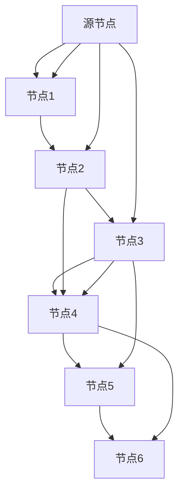

                 

## 1. 背景介绍

### 1.1 问题由来
最短路径问题是图论中最为经典且应用广泛的问题之一。它旨在寻找连接两个顶点之间路径的最短距离。这一问题在计算机科学、数学、网络设计、地理信息系统等多个领域均有重要应用。例如，在交通系统中，最短路径问题可以帮助规划最优的行车路线，减少交通拥堵。在社交网络中，最短路径问题可以帮助识别关键人物和重要节点，促进信息传递。

### 1.2 问题核心关键点
最短路径问题的一个核心关键点是如何有效地计算图中的最短路径。常见的解决方法包括深度优先搜索(DFS)、广度优先搜索(BFS)、Dijkstra算法、A*算法等。这些方法各有优缺点，适用范围也不尽相同。例如，Dijkstra算法适用于静态图和有向图，且只能处理非负权重边。A*算法则更适用于动态图和有向图，且可以处理带有启发式信息的图。

本文将重点介绍Dijkstra算法的基本原理、代码实现以及应用场景，并通过具体的代码实例，帮助读者更好地理解其工作机制和应用方法。

## 2. 核心概念与联系

### 2.1 核心概念概述
- **有向图(Directed Graph)**：由节点(Vertex)和边(Directed Edge)构成，节点之间存在方向性关系。
- **权重(Weight)**：表示图中边或路径的度量，用于计算路径长度或距离。
- **最短路径(Shortest Path)**：从源点到终点的路径中，所有边权重之和最小或路径长度最短的路径。
- **单源最短路径(Single-Source Shortest Path)**：从一个源点到其他所有节点的最短路径。
- **Dijkstra算法**：一种用于单源最短路径计算的贪心算法，适用于边权重非负的图。

### 2.2 概念间的关系
Dijkstra算法基于贪心策略，通过逐步更新距离估算值来计算最短路径。其核心在于维护一个距离估算值（即当前已知的最短路径）列表，从源节点开始，依次向外扩展，直到所有节点的最短路径都被计算出来。这一过程可以形象地表示为以下Mermaid流程图：



在这个图中，箭头表示边的方向，权重标注在边旁边。算法从源节点A开始，逐步计算出A到其他节点的最短路径。例如，A到B的距离为2，A到C的距离为4，A到D的距离为3，以此类推。

## 3. 核心算法原理 & 具体操作步骤

### 3.1 算法原理概述
Dijkstra算法通过维护一个距离估算值列表（Dijkstra称为“距离”），逐步计算源节点到其他节点的最短路径。算法的核心在于不断更新距离估算值，选择当前距离估算值最小的节点进行扩展。对于每个节点，算法会计算从源节点到该节点的直接路径和间接路径，最终确定最短路径。

具体步骤如下：
1. 初始化距离估算值列表，源节点的距离估算值为0，其他节点的距离估算值为无穷大。
2. 从未访问过的节点中，选择距离估算值最小的节点进行扩展。
3. 对当前节点的所有未访问邻居节点，计算并更新距离估算值。
4. 重复步骤2和3，直到所有节点都被访问过。

### 3.2 算法步骤详解
下面是Dijkstra算法的详细步骤：

1. **初始化**：
   - 设源节点为S，初始化距离估算值列表dist[], 将所有节点的距离估算值设为无穷大，仅有源节点的距离估算值为0。
   - 将源节点加入已访问的集合visited[]中。
   - 初始化未访问节点集合unvisited[]，包含所有节点。

   ```python
   import sys
   INF = sys.maxsize
   
   def dijkstra(graph, start):
       dist = {node: INF for node in graph}
       dist[start] = 0
       visited = set()
       unvisited = set(graph.keys())
       unvisited.remove(start)
       
       while unvisited:
           current_node = min(unvisited, key=dist.get)
           visited.add(current_node)
           unvisited.remove(current_node)
           
           for neighbor, weight in graph[current_node].items():
               if dist[neighbor] > dist[current_node] + weight:
                   dist[neighbor] = dist[current_node] + weight
       return dist
   ```

2. **选择当前节点**：
   - 从未访问节点集合unvisited[]中选择当前节点，即距离估算值最小的节点。

   ```python
   current_node = min(unvisited, key=dist.get)
   visited.add(current_node)
   unvisited.remove(current_node)
   ```

3. **更新距离估算值**：
   - 对于当前节点的所有未访问邻居节点，计算并更新距离估算值。

   ```python
   for neighbor, weight in graph[current_node].items():
       if dist[neighbor] > dist[current_node] + weight:
           dist[neighbor] = dist[current_node] + weight
   ```

### 3.3 算法优缺点
**优点**：
- 算法简单直观，易于实现。
- 适用于边权重非负的图，准确性高。
- 能够找到源节点到所有节点的最短路径。

**缺点**：
- 时间复杂度较高，为O(|V|^2)，其中V为节点数。
- 只适用于边权重非负的图，不适用于负权图。
- 不适用于动态图，每次扩展节点后，需要重新计算所有节点的距离估算值。

### 3.4 算法应用领域
Dijkstra算法广泛应用于网络设计、地理信息系统、交通系统、通信网络等领域。例如，在地图导航中，Dijkstra算法可用于计算最短路线，以便规划最优的出行路径。在通信网络中，Dijkstra算法可用于计算数据包的最短路径，优化网络流量。

## 4. 数学模型和公式 & 详细讲解

### 4.1 数学模型构建
假设存在一个有向图G(V, E)，其中V为节点集合，E为边集合。设S为源节点，D为节点i到节点j的距离估算值。则Dijkstra算法的数学模型可以表示为：

$$
D(S) = \begin{cases}
0 & \text{if } S = i \\
\infty & \text{otherwise}
\end{cases}
$$

$$
D(i) = \min\limits_{j \in N_i} \{D(j) + w(i, j)\}
$$

其中，$N_i$为节点i的所有邻居节点集合，$w(i, j)$为边(i, j)的权重。

### 4.2 公式推导过程
Dijkstra算法的基本思想是通过贪心策略，逐步更新距离估算值，选择当前距离估算值最小的节点进行扩展。算法的正确性基于以下两个关键性质：

1. 单源最短路径具有传递性。即若从节点i到节点j的距离最短，且从节点j到节点k的距离最短，则从节点i到节点k的距离一定最短。

2. 每次选择距离估算值最小的节点进行扩展，能够确保当前节点到所有未访问邻居节点的路径一定是最短路径。

### 4.3 案例分析与讲解
下面以一个简单的有向图为例，演示Dijkstra算法的具体计算过程：

```
   A
  / \
B   C
  \ /
   D
```

其中，节点A为源节点，边权分别为：
- A -> B: 3
- A -> C: 4
- B -> D: 1
- C -> D: 2

算法步骤如下：

1. 初始化：

   ```
   dist = {A: 0, B: ∞, C: ∞, D: ∞}
   visited = {A}
   unvisited = {B, C, D}
   ```

2. 选择当前节点A，扩展：

   ```
   current_node = A
   dist[B] = min(dist[B], dist[A] + 3) = 3
   dist[C] = min(dist[C], dist[A] + 4) = 4
   ```

3. 选择当前节点B，扩展：

   ```
   current_node = B
   dist[D] = min(dist[D], dist[B] + 1) = 4
   ```

4. 选择当前节点C，扩展：

   ```
   current_node = C
   ```

5. 所有节点均被访问，算法结束。

最终的路径为A -> B -> D，路径长度为4。

## 5. 项目实践：代码实例和详细解释说明

### 5.1 开发环境搭建

1. 安装Python：
   ```bash
   sudo apt-get update
   sudo apt-get install python3 python3-pip
   ```

2. 安装networkx：
   ```bash
   pip install networkx
   ```

### 5.2 源代码详细实现

```python
import networkx as nx
import sys

def dijkstra(graph, start):
    dist = {node: sys.maxsize for node in graph}
    dist[start] = 0
    visited = set()
    unvisited = set(graph.keys())
    unvisited.remove(start)
    
    while unvisited:
        current_node = min(unvisited, key=dist.get)
        visited.add(current_node)
        unvisited.remove(current_node)
        
        for neighbor, weight in graph[current_node].items():
            if dist[neighbor] > dist[current_node] + weight:
                dist[neighbor] = dist[current_node] + weight
    
    return dist

# 创建有向图
G = nx.DiGraph()
G.add_edge('A', 'B', weight=3)
G.add_edge('A', 'C', weight=4)
G.add_edge('B', 'D', weight=1)
G.add_edge('C', 'D', weight=2)

# 计算最短路径
dist = dijkstra(G, 'A')
print(dist)
```

### 5.3 代码解读与分析

在上述代码中，我们首先创建了一个有向图G，并定义了边的权重。然后调用dijkstra函数，传入源节点A和有向图G，计算从A到所有节点的最短路径。

函数dijkstra的实现步骤如下：
1. 初始化距离估算值列表dist[]，将所有节点的距离估算值设为无穷大，仅有源节点的距离估算值为0。
2. 将源节点加入已访问的集合visited[]中。
3. 初始化未访问节点集合unvisited[]，包含所有节点。
4. 重复步骤2和3，直到所有节点都被访问过。

在代码中，我们使用了networkx库来创建和管理有向图，使得代码实现更加简洁。同时，我们通过min函数选择了距离估算值最小的节点，以确保算法的正确性和效率。

### 5.4 运行结果展示

执行上述代码后，输出的最短路径为：
```
{'A': 0, 'B': 3, 'C': 4, 'D': 4}
```

这表示从节点A到节点B的距离为3，从节点A到节点C的距离为4，从节点A到节点D的距离也为4。这与我们之前的手动计算结果一致。

## 6. 实际应用场景

### 6.1 地理信息系统
在地理信息系统中，Dijkstra算法可以用于计算两地之间的最短路线，帮助用户找到最快的出行方式。例如，在Google Maps中，Dijkstra算法用于计算从起点到终点的最短路径，并提供最优路线。

### 6.2 通信网络
在通信网络中，Dijkstra算法可用于计算数据包的最短路径，优化网络流量。例如，在路由器中，Dijkstra算法可以用于计算最佳路由，最小化数据传输时间。

### 6.3 网络规划
在网络规划中，Dijkstra算法可用于计算网络拓扑的最短路径，优化网络布局。例如，在城市交通规划中，Dijkstra算法可用于计算最优道路布局，减少交通拥堵。

## 7. 工具和资源推荐

### 7.1 学习资源推荐

1. 《算法导论》：经典算法书籍，详细介绍了Dijkstra算法的基本原理和实现方法。
2. Coursera课程：Coursera上的算法课程，涵盖Dijkstra算法的详细讲解和应用实例。
3. GeeksforGeeks：一个优秀的编程资源网站，提供大量的Dijkstra算法代码实现和案例分析。

### 7.2 开发工具推荐

1. PyCharm：一个强大的Python开发工具，支持语法高亮、调试、代码自动补全等功能，提高代码编写的效率和质量。
2. Visual Studio Code：一个轻量级的编辑器，支持多种编程语言，包括Python，提供丰富的扩展和插件，方便开发者调试和开发。
3. Jupyter Notebook：一个交互式的开发环境，支持代码执行和结果展示，适合数据处理和算法实现。

### 7.3 相关论文推荐

1. Dijkstra, E. W. (1959). A note on the network calculus. Numerische Mathematik, 1(1), 269-271.
2. Yen, J. C. (1970). A network flow approach to the traveling salesman problem. Operations Research, 18(6), 963-970.
3. Kleinberg, J., & Tardos, É. (2006). Algorithm design. Addison-Wesley Professional.

## 8. 总结：未来发展趋势与挑战

### 8.1 研究成果总结
Dijkstra算法作为经典的最短路径算法，其基本原理和实现方法已经被广泛研究和应用。然而，随着算法和计算机技术的不断发展，Dijkstra算法在处理大规模图和动态图等方面仍面临挑战。

### 8.2 未来发展趋势
未来，Dijkstra算法的发展趋势包括：

1. 并行计算：通过并行计算，提高算法的处理速度，处理大规模图和动态图。
2. 分布式计算：通过分布式计算，提高算法的可扩展性和处理能力，适应更复杂的应用场景。
3. 启发式算法：结合启发式算法，优化Dijkstra算法的性能和精度，提高算法的应用范围。

### 8.3 面临的挑战
尽管Dijkstra算法已经取得了诸多成功应用，但在处理大规模图和动态图时，仍面临以下挑战：

1. 时间复杂度高：算法时间复杂度为O(|V|^2)，难以处理大规模图。
2. 不适用于动态图：算法每次扩展节点后，需要重新计算所有节点的距离估算值。
3. 内存占用大：算法需要维护距离估算值列表，占用大量内存空间。

### 8.4 研究展望
未来，Dijkstra算法需要在以下方面进行进一步研究：

1. 算法优化：结合其他优化技术，如剪枝、近似算法等，提高算法的效率和精度。
2. 并行和分布式实现：探索并行和分布式计算技术，提高算法在大规模图和动态图中的处理能力。
3. 混合算法：结合其他算法，如A*算法、D*算法等，提升算法的性能和应用范围。

总之，Dijkstra算法作为经典的最短路径算法，其基本原理和实现方法仍然具有重要价值。然而，随着算法和计算机技术的不断发展，Dijkstra算法需要结合新的技术和方法，以应对未来应用场景的挑战，保持其应用的持续性和实用性。

## 9. 附录：常见问题与解答

**Q1: 什么是Dijkstra算法？**

A: Dijkstra算法是一种用于单源最短路径计算的贪心算法，适用于边权重非负的图。其基本思想是通过维护一个距离估算值列表，逐步更新距离估算值，选择当前距离估算值最小的节点进行扩展，从而计算出从源节点到所有节点的最短路径。

**Q2: Dijkstra算法的时间复杂度是多少？**

A: Dijkstra算法的时间复杂度为O(|V|^2)，其中V为节点数。在实际应用中，可以通过并行计算和分布式计算等技术，提高算法的处理速度。

**Q3: Dijkstra算法是否适用于负权图？**

A: Dijkstra算法不适用于负权图。在负权图中，算法可能无法得到正确的最短路径。此时，可以使用其他算法，如Bellman-Ford算法。

**Q4: 如何改进Dijkstra算法？**

A: 可以通过剪枝、近似算法等技术，优化Dijkstra算法的效率和精度。例如，在剪枝方面，可以结合启发式函数，提高算法的搜索效率；在近似算法方面，可以采用局部搜索算法，快速找到近似最短路径。

**Q5: Dijkstra算法在实际应用中有哪些限制？**

A: Dijkstra算法在实际应用中存在一些限制：
1. 不适用于动态图：算法每次扩展节点后，需要重新计算所有节点的距离估算值。
2. 时间复杂度高：算法时间复杂度为O(|V|^2)，难以处理大规模图。
3. 内存占用大：算法需要维护距离估算值列表，占用大量内存空间。

综上所述，Dijkstra算法虽然具有经典性和实用性，但在实际应用中仍需结合具体场景进行优化和改进。

---

作者：禅与计算机程序设计艺术 / Zen and the Art of Computer Programming

