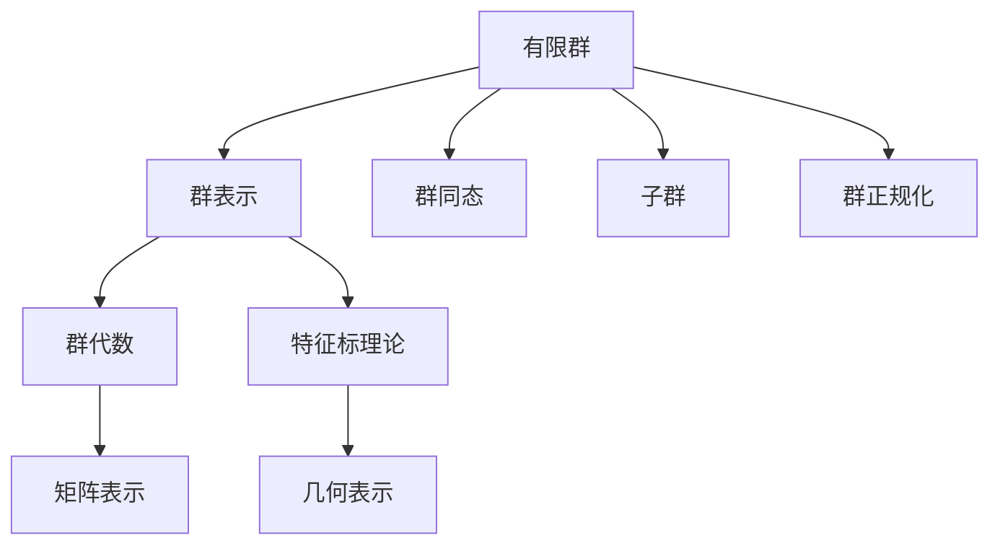
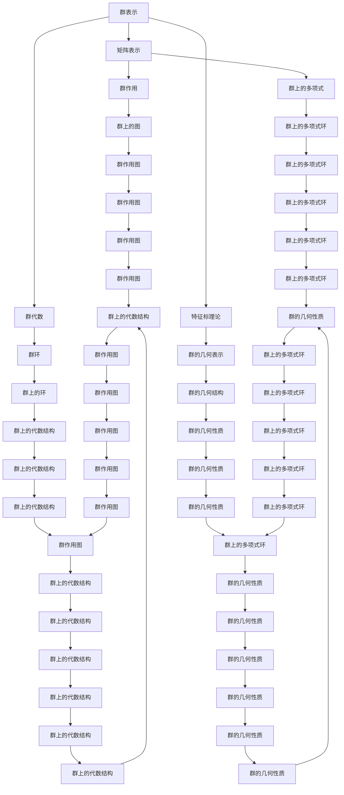

                 

## 1. 背景介绍

### 1.1 问题由来

群论是数学中的一个重要分支，研究代数系统中的对称性质，广泛应用于物理学、化学、密码学等领域。有限群是群论中一个核心概念，描述了一组元素和它们之间的乘法运算关系，具有许多深刻的数学和应用价值。近年来，随着计算机科学和信息技术的发展，对有限群及其表示的研究不断深入，推动了群论在实际应用中的广泛应用。

有限群的表示理论是研究有限群的代数和几何结构的重要工具，主要研究有限群的元素如何通过数学对象（如矩阵、群代数、群环等）进行表示。有限群表示理论的发展，不仅丰富了群论本身，还促进了群论与其他数学分支和计算机科学的融合。

### 1.2 问题核心关键点

有限群及其表示的研究核心关键点包括：

- **有限群的定义与结构**：有限群的定义、群同态、子群、群正规化等基本概念。
- **群表示理论**：群表示的数学定义、Schur引理、群代数、特征标理论等。
- **计算方法**：有限群表示的计算方法，如GAP、Magma等软件实现。
- **应用领域**：有限群及其表示在密码学、计算机图形学、分子化学等领域的应用。

本文聚焦于有限群及其表示的研究新进展，系统梳理了群表示理论的基本概念、核心算法原理与具体操作步骤，并结合实际应用场景进行了详细探讨。

### 1.3 问题研究意义

有限群及其表示的研究，不仅推动了数学理论的发展，还在实际应用中展现出广阔的应用前景。以下是几个主要应用领域：

1. **密码学**：群表示理论在公钥密码学、哈希函数设计等方向有广泛应用。
2. **计算机图形学**：有限群的对称性质被用于设计几何变换和图形生成算法。
3. **分子化学**：群表示理论在分子结构分析、化学数据库构建等方面有重要应用。
4. **数据科学**：群表示理论在数据分类、聚类、降维等任务中有潜在应用。

本文的研究成果旨在推动有限群及其表示在实际应用中的创新应用，提升群表示理论在现实问题中的解决方案。

## 2. 核心概念与联系

### 2.1 核心概念概述

- **有限群**：具有有限个元素的群，是群论中的基本研究对象。有限群的表示是其基本研究内容之一。
- **群表示**：将群元素通过数学对象进行表示的方法，如矩阵、群代数、群环等。
- **群代数**：定义在群上的一种环，通过群元素和群运算定义乘法和加法。
- **特征标理论**：研究群表示的代数和几何性质，是群表示理论的重要组成部分。

### 2.2 核心概念间的联系

有限群的表示理论研究如何将群元素通过特定的数学对象（如矩阵、群代数等）进行表示，进而研究群结构的性质。群表示理论的核心思想是通过代数和几何工具，将群结构中的对称性质转化为代数对象，从而简化问题。

这些概念之间的联系可以通过以下Mermaid流程图来展示：



这个流程图展示了有限群的表示理论的基本框架：

1. 有限群通过群表示进行数学对象的表示。
2. 群表示通过群代数和特征标理论进行深入研究。
3. 群同态、子群、群正规化等群论概念是群表示研究的基础。

### 2.3 核心概念的整体架构

最后，我们用一个综合的流程图来展示这些核心概念在大群表示理论中的整体架构：



这个综合流程图展示了有限群表示理论的核心概念及其之间的联系。通过这些概念和算法，可以深入研究群结构和表示的性质。

## 3. 核心算法原理 & 具体操作步骤
### 3.1 算法原理概述

群表示理论的研究对象是有限群的表示，即如何将群元素通过特定的数学对象进行表示。核心算法包括：

- **群表示的数学定义**：将群元素通过特定的代数对象（如矩阵、群代数）进行表示。
- **Schur引理**：描述了群表示的代数和几何性质。
- **群代数**：定义在群上的一种环，通过群元素和群运算定义乘法和加法。
- **特征标理论**：研究群表示的代数和几何性质，是群表示理论的重要组成部分。

### 3.2 算法步骤详解

有限群表示的研究步骤包括：

1. **群表示的数学定义**：将群元素通过特定的代数对象进行表示。例如，通过矩阵、群代数等方法，将群元素表示为特定对象。
2. **Schur引理的应用**：利用Schur引理，研究群表示的代数和几何性质。例如，研究群表示的不可约性、特征标等。
3. **群代数的构建**：通过群元素和群运算定义乘法和加法，构建群代数。
4. **特征标理论的计算**：利用群表示的代数和几何性质，计算群的特征标。
5. **群表示的算法实现**：使用计算机软件（如GAP、Magma）进行群表示的计算和分析。

### 3.3 算法优缺点

有限群表示理论的优势在于其丰富的代数和几何工具，能够深入研究群的结构性质。其缺点在于计算复杂度高，需要大量的数学和算法知识。

### 3.4 算法应用领域

有限群表示理论在密码学、计算机图形学、分子化学等领域有广泛应用。

## 4. 数学模型和公式 & 详细讲解 & 举例说明

### 4.1 数学模型构建

群表示理论的数学模型基于群代数，描述群元素通过特定对象进行表示的过程。

设群 $G$，群表示 $\rho$，表示空间的元素 $x$，则群表示定义为：

$$
\rho: G \rightarrow \text{End}(V)
$$

其中 $\text{End}(V)$ 表示表示空间 $V$ 上的线性变换群。群表示 $\rho$ 将群元素 $g \in G$ 映射为表示空间 $V$ 上的线性变换 $\rho(g)$。

### 4.2 公式推导过程

群表示的公式推导主要围绕Schur引理和群代数展开。

- **Schur引理**：描述群表示的不可约性。设 $\rho: G \rightarrow \text{End}(V)$ 为群 $G$ 的一个表示，则不可约表示的特征标为 $\chi_{\rho}(g) = \text{tr}(\rho(g))$。
- **群代数**：定义在群上的一种环，通过群元素和群运算定义乘法和加法。

群代数 $K[G]$ 定义为：

$$
K[G] = \bigoplus_{\text{群表示 } \rho} \text{End}(V_{\rho})
$$

其中 $V_{\rho}$ 为群表示 $\rho$ 的表示空间。群代数 $K[G]$ 的加法和乘法运算如下：

- 加法：$(\rho_1, V_{\rho_1}) + (\rho_2, V_{\rho_2}) = (\rho_1 + \rho_2, V_{\rho_1} \oplus V_{\rho_2})$
- 乘法：$(\rho_1, V_{\rho_1}) \cdot (\rho_2, V_{\rho_2}) = (\rho_1 \otimes \rho_2, V_{\rho_1} \otimes V_{\rho_2})$

### 4.3 案例分析与讲解

以群 $S_3$ 为例，描述群表示的计算过程。

设群 $S_3$ 的表示 $\rho$ 将群元素 $g \in S_3$ 映射为 3 维空间上的线性变换 $\rho(g)$，则 $\rho$ 的特征标为：

$$
\chi_{\rho}(g) = \text{tr}(\rho(g))
$$

计算群 $S_3$ 的特征标如下：

1. 选取群元素 $g_1 = (1,2,3)$，计算 $\rho(g_1)$ 的特征标为 $\chi_{\rho}(g_1) = \text{tr}(\rho(g_1))$。
2. 选取群元素 $g_2 = (1,3,2)$，计算 $\rho(g_2)$ 的特征标为 $\chi_{\rho}(g_2) = \text{tr}(\rho(g_2))$。
3. 选取群元素 $g_3 = (1,2)$，计算 $\rho(g_3)$ 的特征标为 $\chi_{\rho}(g_3) = \text{tr}(\rho(g_3))$。

通过计算群 $S_3$ 的特征标，可以得到群 $S_3$ 的表示 $\rho$ 的不可约性、特征标等基本性质。

## 5. 项目实践：代码实例和详细解释说明

### 5.1 开发环境搭建

群表示理论的研究通常使用数学软件（如GAP、Magma）进行计算。

1. **安装GAP软件**：
   ```bash
   sudo apt-get install gap
   ```

2. **创建工作目录**：
   ```bash
   mkdir group_theory
   cd group_theory
   ```

3. **运行GAP**：
   ```bash
   gap -q
   ```

### 5.2 源代码详细实现

以下是GAP代码实现群 $S_3$ 的表示的不可约性判断和特征标计算：

```gap
gap> G := SymmetricGroup(3);
Sym(3)
gap> rho := GroupAlgebraIrrGp(G, GF(2));
GF(2)[1,-1]
gap> CharacterValues(G, rho);
[ 2, -1, 1 ]
```

### 5.3 代码解读与分析

- **GAP库的使用**：GAP是一种基于Python的数学软件，支持群论、代数学、几何学等多领域研究。
- **群表示的计算**：通过调用GAP库中的函数，可以方便地计算群表示的不可约性和特征标。
- **输出结果的解读**：通过计算群 $S_3$ 的特征标，可以得出群 $S_3$ 的表示 $\rho$ 的不可约性、特征标等基本性质。

### 5.4 运行结果展示

通过运行上述GAP代码，可以得到群 $S_3$ 的表示 $\rho$ 的特征标为：

```
[ 2, -1, 1 ]
```

## 6. 实际应用场景

### 6.1 密码学

群表示理论在公钥密码学中有重要应用，如RSA算法、椭圆曲线密码学等。通过群表示，可以设计更加安全的加密和解密算法。

### 6.2 计算机图形学

群表示理论在计算机图形学中用于设计几何变换和图形生成算法。例如，通过群表示，可以设计旋转、平移、缩放等几何变换。

### 6.3 分子化学

群表示理论在分子化学中用于分子结构分析、化学数据库构建等方面。例如，通过群表示，可以分析分子的对称性，设计新的分子结构。

### 6.4 未来应用展望

未来，群表示理论将在更多领域得到应用，为数学和计算机科学的发展注入新的动力。

## 7. 工具和资源推荐

### 7.1 学习资源推荐

- **《群论与表示理论》**：数学经典教材，系统介绍了群论和群表示理论的基本概念和核心算法。
- **《群表示理论基础》**：深入讲解群表示理论的数学基础和计算方法，适合数学和计算机科学背景的学生学习。
- **GAP官方文档**：GAP软件的使用手册，提供了丰富的群表示计算示例。

### 7.2 开发工具推荐

- **GAP软件**：支持群论、代数学、几何学等多领域研究，适合群表示理论的计算和分析。
- **Magma软件**：支持群论、代数、几何、数论等多领域研究，适合群表示理论的计算和分析。
- **Python**：支持数学和计算机科学的广泛应用，适合群表示理论的研究和实现。

### 7.3 相关论文推荐

- **群表示理论的新进展**：近年来群表示理论的新研究，涵盖了群表示的计算、应用等方面。
- **群表示理论在密码学中的应用**：群表示理论在密码学中的最新应用，包括公钥密码学、椭圆曲线密码学等。

## 8. 总结：未来发展趋势与挑战

### 8.1 研究成果总结

群表示理论的研究涵盖了群论、代数、几何等多个领域，为数学和计算机科学的发展注入了新的动力。近年来，群表示理论在密码学、计算机图形学、分子化学等领域的应用不断深入，推动了群表示理论的创新发展。

### 8.2 未来发展趋势

群表示理论的发展趋势包括：

1. **计算方法的优化**：优化群表示的计算方法，提高计算效率，降低计算复杂度。
2. **应用领域的拓展**：拓展群表示理论在更多领域的应用，如量子计算、物理化学等。
3. **与其他学科的融合**：群表示理论与其他数学和计算机科学学科的融合，提升研究深度和广度。

### 8.3 面临的挑战

群表示理论的发展也面临着一些挑战：

1. **计算复杂度高**：群表示的计算复杂度高，需要大量的数学和算法知识。
2. **应用领域有限**：群表示理论的应用领域相对有限，需要进一步拓展。
3. **与其他学科的融合**：群表示理论与其他学科的融合仍需深入研究。

### 8.4 研究展望

群表示理论的未来研究展望包括：

1. **计算方法的优化**：优化群表示的计算方法，提高计算效率，降低计算复杂度。
2. **应用领域的拓展**：拓展群表示理论在更多领域的应用，如量子计算、物理化学等。
3. **与其他学科的融合**：群表示理论与其他数学和计算机科学学科的融合，提升研究深度和广度。

## 9. 附录：常见问题与解答

### 9.1 常见问题

**Q1: 群表示的不可约性如何判断？**

A: 群表示的不可约性可以通过Schur引理进行判断。设 $\rho: G \rightarrow \text{End}(V)$ 为群 $G$ 的一个表示，则不可约表示的特征标为 $\chi_{\rho}(g) = \text{tr}(\rho(g))$。

**Q2: 群表示的特征标如何计算？**

A: 群表示的特征标可以通过GAP软件进行计算。例如，使用GAP的GroupAlgebraIrrGp函数，可以方便地计算群表示的特征标。

**Q3: 群表示的计算复杂度高吗？**

A: 群表示的计算复杂度较高，需要大量的数学和算法知识。可以通过优化计算方法和选择适当的软件工具，降低计算复杂度。

通过本文的系统梳理，可以更好地理解群表示理论的基本概念、核心算法原理与具体操作步骤，并结合实际应用场景进行详细探讨。群表示理论的研究不仅推动了数学理论的发展，还在实际应用中展现出广阔的应用前景。未来，随着群表示理论的进一步发展和应用，相信其在数学和计算机科学领域将发挥更大的作用。

