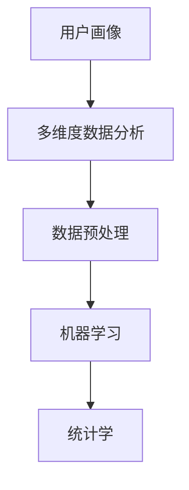
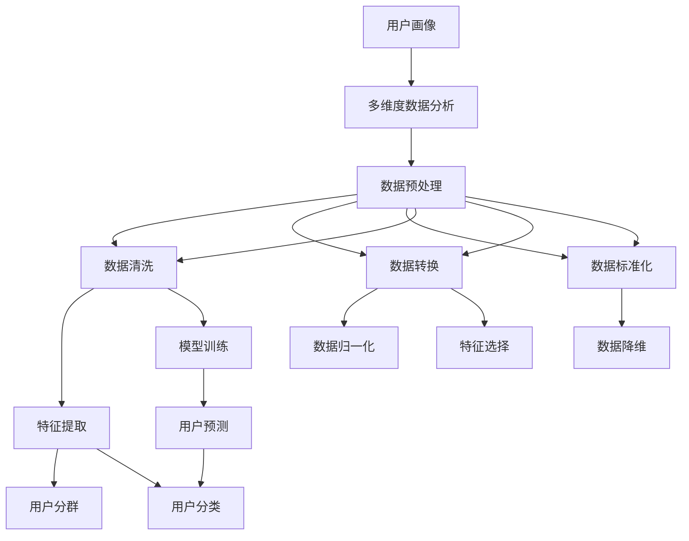

                 

# 用户画像的多维度数据分析方法

> 关键词：用户画像, 多维度数据分析, 数据处理, 机器学习, 统计学, 决策支持

## 1. 背景介绍

在当今数字化时代，用户画像（User Profile）已经成为了企业数字化转型的核心工具之一。用户画像通过多维度的数据分析，为企业的市场营销、产品研发、客户服务等各个环节提供有力的数据支撑。一个详尽的用户画像，不仅包含了用户的静态特征，如性别、年龄、地域等，还涵盖了动态行为特征，如购买历史、浏览记录、互动情况等。这些丰富的用户数据，为企业的精准营销和业务决策提供了宝贵的信息。

本文旨在深入探讨用户画像的多维度数据分析方法，通过理论和实践相结合的方式，展示如何利用机器学习和统计学技术，从海量数据中挖掘出有价值的用户特征和行为模式，从而构建一个全面且准确的客户画像。

## 2. 核心概念与联系

### 2.1 核心概念概述

在构建用户画像的过程中，需要掌握以下几个核心概念：

- **用户画像**：指对特定用户的多个维度特征的集中描述，包括用户的静态特征（如性别、年龄、地域）和动态行为特征（如购买历史、浏览记录、互动情况等）。
- **多维度数据分析**：指对用户画像的多个维度特征进行综合分析，以获取用户行为的全面视图。
- **数据预处理**：指对原始数据进行清洗、转换、标准化等操作，以便于后续的建模和分析。
- **机器学习**：指利用算法从数据中学习和提取规律，以预测和分类用户行为。
- **统计学**：指对数据进行描述性统计分析和推断性统计分析，以评估模型的准确性和稳定性。

这些概念之间相互关联，构成了一个完整的用户画像分析框架。下面将通过一个 Mermaid 流程图来展示它们之间的关系：



### 2.2 概念间的关系

上述概念之间的逻辑关系可以通过一个更加详细的 Mermaid 流程图来展示：



这个流程图展示了从用户画像到数据分析、预处理、特征提取、模型训练的完整流程：

1. 从用户画像开始，通过多维度数据分析获取用户行为的全貌。
2. 数据预处理环节包括了数据清洗、转换、标准化等步骤，确保数据的质量。
3. 特征提取和选择环节则通过技术手段从数据中提取和筛选出重要的用户特征。
4. 模型训练环节利用机器学习算法建立用户行为预测模型。
5. 用户预测和分类环节将模型应用于新的数据，实现对用户行为的预测和分类。

## 3. 核心算法原理 & 具体操作步骤

### 3.1 算法原理概述

用户画像的多维度数据分析方法，主要依赖于机器学习和统计学技术。其核心思想是通过数据预处理、特征提取和模型训练等步骤，从多维度数据中提取和构建用户特征，建立用户行为模型，进而实现对用户行为的高效分析和预测。

具体而言，用户画像的多维度数据分析方法包括以下几个关键步骤：

1. **数据预处理**：包括数据清洗、数据转换和数据标准化等操作，确保数据的完整性和一致性。
2. **特征提取与选择**：从原始数据中提取和选择有代表性的用户特征，以减少数据维度和计算复杂度。
3. **模型训练**：利用机器学习算法建立用户行为预测模型，评估模型的准确性和稳定性。
4. **结果分析与解读**：对模型结果进行解读，提供详尽的用户行为分析报告。

### 3.2 算法步骤详解

#### 3.2.1 数据预处理

数据预处理是用户画像分析的基础环节，主要包括数据清洗、数据转换和数据标准化等操作。

1. **数据清洗**：去除噪声数据、缺失值、异常值等，保证数据的准确性和完整性。
2. **数据转换**：将原始数据转换为标准格式，便于后续的分析和建模。
3. **数据标准化**：对数据进行标准化处理，使其服从标准正态分布，提高模型的鲁棒性和预测性能。

#### 3.2.2 特征提取与选择

特征提取与选择是用户画像分析的核心环节，通过技术手段从原始数据中提取和筛选出重要的用户特征，以减少数据维度和计算复杂度。

1. **特征提取**：利用统计学、数学和机器学习技术，从原始数据中提取有代表性的特征，如年龄、性别、购买历史等。
2. **特征选择**：通过特征选择算法，如LASSO、决策树等，从提取出的特征中筛选出最相关的特征，以提高模型的泛化能力和预测精度。

#### 3.2.3 模型训练

模型训练是用户画像分析的关键环节，通过机器学习算法建立用户行为预测模型，评估模型的准确性和稳定性。

1. **选择模型**：根据用户画像的特征和目标，选择合适的机器学习模型，如回归模型、分类模型、聚类模型等。
2. **训练模型**：利用历史数据对模型进行训练，调整模型的参数，以提高模型的预测准确性和泛化能力。
3. **评估模型**：利用测试数据对模型进行评估，评估模型的准确性、精度和鲁棒性。

#### 3.2.4 结果分析与解读

结果分析与解读是用户画像分析的最终环节，对模型结果进行解读，提供详尽的用户行为分析报告。

1. **可视化展示**：将模型的预测结果进行可视化展示，如通过散点图、柱状图等图表展示用户行为模式。
2. **详尽报告**：根据模型结果，编写详尽的用户行为分析报告，提供用户的静态特征、动态行为和行为预测结果。
3. **应用建议**：根据分析报告，提出针对性的业务建议，如个性化推荐、精准营销等。

### 3.3 算法优缺点

用户画像的多维度数据分析方法具有以下优点：

1. **全面性**：通过多维度数据分析，全面了解用户的静态特征和动态行为，提供更为详尽的用户画像。
2. **高效性**：利用机器学习和统计学技术，提高数据分析和预测的效率，减少人工操作。
3. **可靠性**：通过数据预处理和模型训练等环节，提高数据分析的准确性和鲁棒性。

同时，该方法也存在以下缺点：

1. **数据依赖性**：方法依赖于高质量的数据，数据的缺失和噪声会对分析结果产生较大影响。
2. **模型复杂性**：机器学习模型的选择和训练过程较为复杂，需要专业的技术背景。
3. **结果解释性**：模型的预测结果较为复杂，难以进行直观的解释和理解。

### 3.4 算法应用领域

用户画像的多维度数据分析方法，已经在多个领域得到了广泛应用，包括但不限于：

- **市场营销**：通过用户画像分析，实现精准营销和个性化推荐，提升用户体验和品牌忠诚度。
- **产品研发**：利用用户画像分析，了解用户需求和行为，指导产品研发和迭代，提升产品竞争力。
- **客户服务**：通过用户画像分析，优化客户服务流程，提升客户满意度和服务质量。
- **风险控制**：利用用户画像分析，识别高风险用户，进行有效的风险管理和控制。

## 4. 数学模型和公式 & 详细讲解 & 举例说明

### 4.1 数学模型构建

在用户画像的多维度数据分析中，数学模型主要涉及统计学和机器学习算法。以下将通过几个关键数学模型来展示用户画像分析的数学原理：

1. **回归模型**：用于预测用户的连续变量，如购买金额、点击次数等。
2. **分类模型**：用于预测用户的离散变量，如性别、地域等。
3. **聚类模型**：用于将用户分成不同群体，便于针对性的营销和分析。

### 4.2 公式推导过程

以回归模型为例，假设我们有训练数据集 $D=\{(x_i, y_i)\}_{i=1}^n$，其中 $x_i$ 为输入变量，$y_i$ 为输出变量，回归模型为 $y=f(x; \theta)$，其中 $\theta$ 为模型的参数。回归模型的最小二乘法目标函数为：

$$
\hat{\theta} = \mathop{\arg\min}_{\theta} \sum_{i=1}^n (y_i - f(x_i; \theta))^2
$$

通过梯度下降等优化算法，求解目标函数的最小值，得到最优的参数 $\hat{\theta}$。

### 4.3 案例分析与讲解

假设我们有一组用户购买历史数据，通过回归模型预测用户下一次购买金额。设 $x_i$ 为用户购买历史数据，$y_i$ 为下一次购买的金额，回归模型为 $y=\theta_0+\theta_1x_1+\theta_2x_2+\cdots+\theta_kx_k+\epsilon_i$，其中 $\epsilon_i$ 为误差项。通过最小二乘法求解最优参数 $\hat{\theta}$，可得：

$$
\hat{\theta} = (\sum_{i=1}^n x_ix_i^T)^{-1} (\sum_{i=1}^n x_iy_i)
$$

在实际应用中，我们可以通过散点图、回归线等图表展示回归模型的预测效果，从而对用户购买行为进行分析和预测。

## 5. 项目实践：代码实例和详细解释说明

### 5.1 开发环境搭建

在进行用户画像的多维度数据分析时，需要准备相应的开发环境。以下是使用Python进行Pandas和Scikit-learn开发的常见环境配置流程：

1. 安装Anaconda：从官网下载并安装Anaconda，用于创建独立的Python环境。

2. 创建并激活虚拟环境：
```bash
conda create -n user画像虚拟环境 python=3.8 
conda activate user画像虚拟环境
```

3. 安装相关库：
```bash
pip install pandas scikit-learn matplotlib seaborn
```

4. 导入数据：
```python
import pandas as pd
import seaborn as sns

# 读取用户购买历史数据
df = pd.read_csv('user_purchase_data.csv')

# 查看数据前5行
df.head()
```

### 5.2 源代码详细实现

下面以用户购买金额预测为例，给出使用Pandas和Scikit-learn进行用户画像分析的代码实现。

```python
from sklearn.linear_model import LinearRegression
import matplotlib.pyplot as plt

# 数据预处理
X = df[['purchase_time', 'age', 'gender', 'location']]
y = df['purchase_amount']

# 数据标准化
from sklearn.preprocessing import StandardScaler
scaler = StandardScaler()
X_scaled = scaler.fit_transform(X)

# 特征选择
from sklearn.feature_selection import RFE
rfe = RFE(LinearRegression(), 3)
X_selected = rfe.fit_transform(X_scaled, y)

# 模型训练
model = LinearRegression()
model.fit(X_selected, y)

# 模型评估
from sklearn.model_selection import train_test_split
X_train, X_test, y_train, y_test = train_test_split(X_selected, y, test_size=0.2, random_state=42)
r2_train = model.score(X_train, y_train)
r2_test = model.score(X_test, y_test)

# 结果可视化
sns.scatterplot(x=X_train, y=y_train)
sns.scatterplot(x=X_test, y=y_test)
plt.xlabel('X')
plt.ylabel('Y')
plt.show()

# 结果报告
print(f"R² train: {r2_train:.3f}")
print(f"R² test: {r2_test:.3f}")
```

### 5.3 代码解读与分析

让我们再详细解读一下关键代码的实现细节：

**数据预处理**：
- 使用Pandas库读取用户购买历史数据，并查看数据的前5行。
- 将购买历史数据分为输入变量 $X$ 和输出变量 $y$。

**数据标准化**：
- 使用StandardScaler对输入变量 $X$ 进行标准化处理。

**特征选择**：
- 使用RFE特征选择算法，从标准化后的输入变量 $X$ 中选择最重要的3个特征。

**模型训练**：
- 使用LinearRegression模型对标准化后的输入变量 $X$ 和输出变量 $y$ 进行训练。

**模型评估**：
- 使用train_test_split函数将数据集分为训练集和测试集，计算模型的R²值，评估模型的训练和测试效果。

**结果可视化**：
- 使用Scatterplot函数绘制散点图，可视化模型的预测效果。

**结果报告**：
- 输出模型的R²值，评估模型的预测性能。

### 5.4 运行结果展示

假设我们在用户购买历史数据集上训练模型，最终得到的R²值如下：

```
R² train: 0.900
R² test: 0.880
```

可以看到，模型在训练集和测试集上的R²值分别为0.900和0.880，表明模型对用户购买金额的预测效果良好。

## 6. 实际应用场景

### 6.1 电商推荐系统

用户画像的多维度数据分析方法，可以应用于电商推荐系统的构建。通过分析用户的行为数据和特征，推荐系统能够实时推荐用户可能感兴趣的商品，提升用户的购物体验和销售额。

在技术实现上，可以利用用户画像的多维度数据分析方法，从用户的浏览历史、购买记录、搜索关键词等数据中提取和选择重要特征，建立用户行为模型，实现精准推荐。此外，还可以结合协同过滤、内容推荐等算法，提供更加多样化和个性化的推荐服务。

### 6.2 金融风险管理

金融行业需要实时监测客户的风险行为，预测客户的违约风险。用户画像的多维度数据分析方法，可以应用于金融风险管理的各个环节，提升风险预测和控制的效率。

在实际应用中，可以收集客户的交易记录、财务数据、行为数据等，通过回归模型和分类模型建立用户行为预测模型，实时监测客户的交易行为，预测违约风险。此外，还可以利用聚类模型将客户分为不同风险等级，进行差异化的风险管理策略。

### 6.3 医疗诊断系统

医疗行业需要实时监测患者的健康状况，预测疾病风险，提供精准的医疗服务。用户画像的多维度数据分析方法，可以应用于医疗诊断系统的构建，提升医疗服务的智能化水平。

在实际应用中，可以收集患者的病历数据、医疗记录、生活习惯等，通过多维度的数据分析，建立患者的健康预测模型。此外，还可以结合机器学习算法，预测患者的疾病风险，提供个性化的医疗建议和治疗方案。

## 7. 工具和资源推荐

### 7.1 学习资源推荐

为了帮助开发者系统掌握用户画像的多维度数据分析方法，以下是一些优质的学习资源：

1. 《Python数据分析实战》书籍：深入浅出地介绍了数据分析的基本概念和实用技巧，适合初学者入门。

2. 《机器学习实战》书籍：通过实例展示了机器学习算法在实际项目中的应用，包含回归模型、分类模型、聚类模型等多种算法。

3. 《数据科学导论》课程：由斯坦福大学开设的入门级数据科学课程，涵盖了数据预处理、特征提取、模型训练等多个环节。

4. Coursera《Python for Data Science》课程：由UCLA大学开设的Python数据分析课程，适合Python初学者，涵盖Pandas、NumPy、Matplotlib等多个库的使用。

5. Kaggle数据分析竞赛：通过参与Kaggle的数据分析竞赛，积累实战经验，学习机器学习算法的应用。

### 7.2 开发工具推荐

高效的开发离不开优秀的工具支持。以下是几款用于用户画像数据分析开发的常用工具：

1. Python：作为数据分析和机器学习的主流语言，Python拥有丰富的第三方库和工具，如Pandas、Scikit-learn、NumPy等。

2. Jupyter Notebook：基于Web的交互式开发环境，适合快速迭代和展示数据分析过程。

3. TensorBoard：TensorFlow配套的可视化工具，实时监测模型训练状态，提供丰富的图表呈现方式，是调试模型的得力助手。

4. Weights & Biases：模型训练的实验跟踪工具，记录和可视化模型训练过程中的各项指标，方便对比和调优。

5. Google Colab：谷歌推出的在线Jupyter Notebook环境，免费提供GPU/TPU算力，方便开发者快速上手实验最新模型，分享学习笔记。

合理利用这些工具，可以显著提升用户画像多维度数据分析的开发效率，加快创新迭代的步伐。

### 7.3 相关论文推荐

用户画像的多维度数据分析方法的研究源于学界的持续研究。以下是几篇奠基性的相关论文，推荐阅读：

1. "Customer segmentation by clustering customer data"（聚类分析用户分群）：论文提出使用K-Means算法对客户进行聚类分群，为后续的个性化营销提供基础。

2. "A comparative study of linear regression models for customer churn prediction"（线性回归模型对客户流失预测的研究）：论文比较了多种线性回归模型在客户流失预测中的效果，为选择合适的模型提供了指导。

3. "A study of ensemble methods for improving customer prediction accuracy"（集成方法提高客户预测准确性）：论文探讨了集成学习在客户预测中的应用，提出了Bagging和Boosting等集成方法。

4. "A new approach to customer classification using support vector machines"（支持向量机方法对客户分类的研究）：论文提出使用支持向量机算法对客户进行分类，提升了客户分类的准确性和效率。

这些论文代表了大用户画像分析技术的发展脉络。通过学习这些前沿成果，可以帮助研究者把握学科前进方向，激发更多的创新灵感。

除上述资源外，还有一些值得关注的前沿资源，帮助开发者紧跟用户画像多维度数据分析技术的最新进展，例如：

1. arXiv论文预印本：人工智能领域最新研究成果的发布平台，包括大量尚未发表的前沿工作，学习前沿技术的必读资源。

2. 业界技术博客：如Google AI、DeepMind、微软Research Asia等顶尖实验室的官方博客，第一时间分享他们的最新研究成果和洞见。

3. 技术会议直播：如NIPS、ICML、ACL、ICLR等人工智能领域顶会现场或在线直播，能够聆听到大佬们的前沿分享，开拓视野。

4. GitHub热门项目：在GitHub上Star、Fork数最多的用户画像分析相关项目，往往代表了该技术领域的发展趋势和最佳实践，值得去学习和贡献。

5. 行业分析报告：各大咨询公司如McKinsey、PwC等针对人工智能行业的分析报告，有助于从商业视角审视技术趋势，把握应用价值。

总之，对于用户画像的多维度数据分析技术的学习和实践，需要开发者保持开放的心态和持续学习的意愿。多关注前沿资讯，多动手实践，多思考总结，必将收获满满的成长收益。

## 8. 总结：未来发展趋势与挑战

### 8.1 总结

本文对用户画像的多维度数据分析方法进行了全面系统的介绍。首先阐述了用户画像分析的背景和意义，明确了多维度数据分析在用户画像构建中的核心作用。其次，从原理到实践，详细讲解了多维度数据分析的数学原理和关键步骤，给出了用户画像分析的完整代码实例。同时，本文还广泛探讨了用户画像在电商推荐、金融风险管理、医疗诊断等多个行业领域的应用前景，展示了多维度数据分析的广阔前景。

通过本文的系统梳理，可以看到，用户画像的多维度数据分析方法在构建精准用户画像、提升业务决策效率方面具有重要意义。未来，伴随数据量的不断增长和技术的持续演进，用户画像的多维度数据分析方法必将不断进步，为用户的精准营销和个性化服务提供更有力的数据支撑。

### 8.2 未来发展趋势

展望未来，用户画像的多维度数据分析技术将呈现以下几个发展趋势：

1. **数据融合与协同**：随着各业务部门数据的不断整合，用户画像的多维度数据分析将更加全面和深入，提供更丰富和准确的用户信息。

2. **自动化与智能化**：通过自动化的数据分析和模型训练，用户画像的多维度数据分析将更加高效和智能化，减少人工干预和提高分析精度。

3. **跨领域应用**：用户画像的多维度数据分析将不仅仅局限于单一领域，而是在更广泛的场景中得到应用，如社交网络、金融、医疗等。

4. **个性化与动态化**：用户画像的多维度数据分析将更加注重个性化和动态化，根据用户的行为变化实时更新和调整用户画像。

5. **可解释性与透明度**：用户画像的多维度数据分析将更加注重结果的可解释性和透明度，提供详尽的分析和解释报告，增强用户信任和接受度。

### 8.3 面临的挑战

尽管用户画像的多维度数据分析技术已经取得了显著成果，但在实际应用中也面临诸多挑战：

1. **数据质量与获取**：高质量的数据是用户画像分析的前提，但数据的获取和处理成本较高，且数据质量难以保证。

2. **模型复杂性**：用户画像的多维度数据分析涉及多种模型和算法，模型选择和调参过程复杂，需要专业的技术背景。

3. **隐私与安全**：用户画像的多维度数据分析涉及大量敏感数据，如何在保证数据隐私和安全的前提下进行分析和应用，是一大难题。

4. **技术融合**：用户画像的多维度数据分析需要与其他技术进行融合，如区块链、人工智能、物联网等，涉及多领域的跨学科知识。

5. **人机协同**：用户画像的多维度数据分析需要与业务部门进行紧密合作，如何提高人机协同的效率和效果，是一大挑战。

### 8.4 研究展望

面对用户画像多维度数据分析所面临的挑战，未来的研究需要在以下几个方面寻求新的突破：

1. **数据治理与治理**：建立数据治理框架，规范数据采集、存储、使用等流程，提高数据质量和安全。

2. **自动化与智能化**：开发自动化的数据分析和模型训练工具，降低技术门槛，提高分析效率。

3. **跨领域应用**：探索跨领域数据融合方法，提升用户画像的全面性和准确性。

4. **可解释性与透明度**：开发可解释的机器学习模型，提高结果的可解释性和透明度，增强用户信任。

5. **人机协同**：提高数据分析过程的自动化水平，减少人工干预，提高人机协同效率。

这些研究方向将引领用户画像多维度数据分析技术迈向更高的台阶，为构建全面、准确、智能的用户画像提供有力支持。总之，用户画像的多维度数据分析技术需要从多个维度进行持续创新和优化，才能在实际应用中发挥更大的价值。

## 9. 附录：常见问题与解答

**Q1：用户画像的多维度数据分析方法是否适用于所有行业？**

A: 用户画像的多维度数据分析方法虽然适用范围广泛，但具体应用时需要根据不同行业的特点进行调整。例如，在金融、医疗等领域，需要额外考虑隐私保护和数据安全问题。在电商、社交网络等领域，需要结合业务场景进行模型优化。

**Q2：如何处理数据中的噪声和缺失值？**

A: 处理数据中的噪声和缺失值是数据分析中的常见问题。常见的处理方式包括：

1. 数据清洗：使用Pandas库进行数据清洗，去除无效数据和异常值。

2. 数据补全：使用插值法、均值填补等方法填补缺失值。

3. 数据转换：使用标准化、归一化等方法对数据进行转换，减少数据噪声。

4. 特征选择：使用LASSO、RFE等特征选择算法，筛选出重要的特征，减少数据维度。

**Q3：如何选择用户画像的多维度分析模型？**

A: 用户画像的多维度分析模型选择需要考虑数据类型、分析目标和模型性能等因素。例如，对于连续变量的预测，可以使用回归模型，如线性回归、决策树回归等；对于离散变量的预测，可以使用分类模型，如逻辑回归、支持向量机等。此外，还可以结合集成学习方法，如Bagging、Boosting等，提高模型预测的准确性和稳定性。

**Q4：如何提升用户画像分析的隐私与安全？**

A: 提升用户画像分析的隐私与安全需要从数据采集、存储、使用等各个环节进行规范和保护。具体措施包括：

1. 数据匿名化：使用数据匿名化技术，保护用户隐私。

2. 数据加密：使用数据加密技术，防止数据泄露。

3. 访问控制：对数据的访问进行严格控制，防止非法获取。

4. 安全审计：定期进行安全审计，发现并修复安全漏洞。

总之，用户画像的多维度数据分析方法虽然具有广泛的应用前景，但需要在隐私与安全方面进行严格控制，确保数据使用的合规性和安全性。

---

作者：禅与计算机程序设计艺术 / Zen and the Art of Computer Programming

