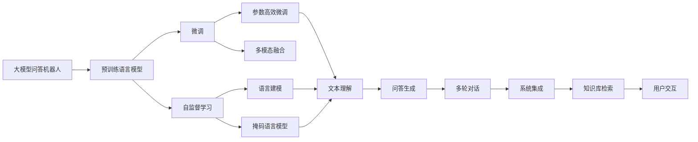

                 

# 大模型问答机器人的灵活性

## 1. 背景介绍

### 1.1 问题由来
在当今智能时代的背景下，自然语言处理（NLP）技术成为连接人与机器的重要桥梁。其中，问答机器人以其快速响应用户问题、提供丰富知识的特性，广泛应用于智能客服、智能搜索、智能教育等多个领域。然而，传统的问答系统往往依赖于预定义的知识库和规则，缺乏对自然语言表达的多样性和语义理解的灵活性。基于大模型的问答系统（Big Model Chatbot）通过在大规模预训练语言模型基础上进行微调，可以有效应对用户多样化、复杂化的查询需求，大大提高了系统的智能化水平。

### 1.2 问题核心关键点
大模型问答机器人之所以能够取得突破，主要得益于以下几个关键点：
- **预训练语言模型**：如GPT、BERT等，在大规模无标签数据上进行自监督学习，学习到丰富的语言表示和常识知识。
- **微调技术**：通过在下游任务的少量标注数据上进行有监督学习，将预训练模型微调成特定任务的问答模型。
- **多模态融合**：结合图像、视频、语音等多种模态数据，提升语言模型的语义理解和推理能力。
- **参数高效微调**：通过微调模型的部分参数，而非全量参数，实现更高效、更灵活的模型训练。
- **持续学习**：通过增量学习机制，不断更新模型知识库，保持系统的时效性和适应性。

这些关键技术使得大模型问答机器人具备了极强的灵活性和智能性，能够处理多种场景下的用户查询。然而，如何在复杂的实际应用中充分发挥这些技术优势，同时克服可能面临的挑战，是构建高性能问答机器人需要深入研究的问题。

## 2. 核心概念与联系

### 2.1 核心概念概述
为更好地理解大模型问答机器人的灵活性，本节将介绍几个核心概念：

- **大模型问答机器人（Big Model Chatbot）**：基于深度学习模型（如BERT、GPT等）构建的问答系统，能够理解并生成自然语言回答。
- **预训练语言模型（Pre-trained Language Model）**：在大规模无标签数据上，通过自监督任务（如语言建模、掩码语言模型等）训练的语言模型。
- **微调（Fine-tuning）**：在预训练模型的基础上，通过有监督学习优化模型在特定任务上的性能，如问答任务。
- **多模态融合（Multimodal Fusion）**：将文本、图像、语音等多种模态数据融合，提升模型的语义理解和推理能力。
- **参数高效微调（Parameter-Efficient Fine-tuning）**：在微调过程中，只更新部分模型参数，而固定大部分预训练权重不变，以提高微调效率。
- **持续学习（Continual Learning）**：模型能够不断从新数据中学习，同时保持已学习的知识，避免灾难性遗忘。

这些核心概念之间存在着紧密的联系，形成了大模型问答机器人的完整技术框架。

### 2.2 概念间的关系

这些核心概念之间的逻辑关系可以通过以下Mermaid流程图来展示：



这个流程图展示了大模型问答机器人的核心技术链路：

1. 大模型问答机器人以预训练语言模型为基础。
2. 通过微调和参数高效微调优化模型，适应特定任务。
3. 结合多模态数据融合，提升模型的语义理解能力。
4. 系统集成问答生成、多轮对话、知识库检索等功能模块，提供完整用户交互体验。

## 3. 核心算法原理 & 具体操作步骤
### 3.1 算法原理概述

大模型问答机器人是一种结合预训练语言模型和微调技术的自然语言处理应用。其核心算法原理可归纳为以下几个步骤：

1. **数据准备**：收集目标任务相关的标注数据，将其划分为训练集、验证集和测试集。
2. **预训练模型选择**：选择合适的预训练语言模型（如BERT、GPT等）作为初始化参数。
3. **任务适配**：在预训练模型的基础上，设计合适的任务适配层，包括分类器、解码器等，以适应特定的问答任务。
4. **微调训练**：在训练集上使用有监督学习优化模型，调整适配层的参数，使其能够生成准确的回答。
5. **测试评估**：在测试集上评估模型性能，根据评估结果调整模型参数，确保模型效果最佳。

### 3.2 算法步骤详解

以下详细介绍大模型问答机器人的核心算法步骤：

**Step 1: 准备数据集**
- **数据收集**：收集目标任务相关的标注数据，如问答数据集、对话数据集等。
- **数据预处理**：对数据进行清洗、分词、标准化等预处理操作。
- **数据划分**：将数据集划分为训练集、验证集和测试集，保证数据分布的一致性。

**Step 2: 选择预训练模型**
- **模型选择**：根据任务需求，选择适合的预训练语言模型，如BERT、GPT等。
- **模型加载**：使用PyTorch、TensorFlow等深度学习框架加载预训练模型，设置模型的参数和超参数。

**Step 3: 设计任务适配层**
- **任务定义**：明确目标任务的类型，如问答、对话、摘要等。
- **适配层设计**：根据任务类型，设计相应的适配层，如线性分类器、解码器等。
- **损失函数选择**：选择合适的损失函数，如交叉熵损失、均方误差损失等。

**Step 4: 执行微调训练**
- **模型初始化**：将预训练模型的参数作为初始权重，初始化适配层的参数。
- **训练循环**：在每个epoch中，将训练集数据分批次输入模型，前向传播计算损失函数，反向传播更新模型参数。
- **验证评估**：周期性在验证集上评估模型性能，根据评估结果调整模型参数。
- **迭代优化**：重复上述步骤，直至模型收敛或达到预设的迭代次数。

**Step 5: 测试评估**
- **测试集评估**：在测试集上评估微调后模型的性能，对比微调前后的效果。
- **模型部署**：将微调后的模型保存，部署到实际应用系统中，进行实时问答。

### 3.3 算法优缺点

大模型问答机器人有以下优点：
- **灵活性高**：能够适应各种类型的问答任务，通过微调和多模态融合，提升系统的智能化水平。
- **精度高**：通过大规模预训练和微调，模型能够学习到丰富的语言知识，回答准确度较高。
- **可扩展性强**：能够通过持续学习机制，不断更新知识库，适应新的数据和任务。

同时，也存在一些缺点：
- **计算资源消耗大**：大模型问答机器人需要较大的计算资源进行预训练和微调，对硬件配置要求较高。
- **数据依赖性强**：模型性能依赖于标注数据的质量和数量，标注数据的获取和处理成本较高。
- **过拟合风险**：在数据量较少的情况下，模型可能出现过拟合，泛化能力不足。

### 3.4 算法应用领域

大模型问答机器人在多个领域具有广泛的应用前景：

- **智能客服**：通过问答机器人，提供24小时不间断的客户服务，提升客户体验。
- **智能搜索**：在搜索引擎中加入问答功能，提升搜索结果的准确性和相关性。
- **智能教育**：提供智能辅助教学，帮助学生解答疑问，提升学习效果。
- **医疗咨询**：提供医学知识问答，辅助医生诊断和治疗，提高医疗效率。
- **金融咨询**：提供金融市场分析、投资建议等，帮助用户做出更好的投资决策。

## 4. 数学模型和公式 & 详细讲解 & 举例说明

### 4.1 数学模型构建

假设目标任务为问答任务，预训练模型为 $M_{\theta}$，训练集为 $\{(x_i, y_i)\}_{i=1}^N$，其中 $x_i$ 为输入的查询，$y_i$ 为相应的答案。

定义模型 $M_{\theta}$ 在输入 $x$ 上的损失函数为 $\ell(M_{\theta}(x),y)$，则在训练集 $D$ 上的经验风险为：

$$
\mathcal{L}(\theta) = \frac{1}{N} \sum_{i=1}^N \ell(M_{\theta}(x_i),y_i)
$$

其中 $\ell$ 为合适的损失函数，如交叉熵损失。

### 4.2 公式推导过程

以二分类任务为例，假设模型 $M_{\theta}$ 在输入 $x$ 上的输出为 $\hat{y}=M_{\theta}(x) \in [0,1]$，表示样本属于正类的概率。真实标签 $y \in \{0,1\}$。则二分类交叉熵损失函数定义为：

$$
\ell(M_{\theta}(x),y) = -[y\log \hat{y} + (1-y)\log (1-\hat{y})]
$$

将其代入经验风险公式，得：

$$
\mathcal{L}(\theta) = -\frac{1}{N}\sum_{i=1}^N [y_i\log M_{\theta}(x_i)+(1-y_i)\log(1-M_{\theta}(x_i))]
$$

根据链式法则，损失函数对参数 $\theta_k$ 的梯度为：

$$
\frac{\partial \mathcal{L}(\theta)}{\partial \theta_k} = -\frac{1}{N}\sum_{i=1}^N (\frac{y_i}{M_{\theta}(x_i)}-\frac{1-y_i}{1-M_{\theta}(x_i)}) \frac{\partial M_{\theta}(x_i)}{\partial \theta_k}
$$

其中 $\frac{\partial M_{\theta}(x_i)}{\partial \theta_k}$ 可进一步递归展开，利用自动微分技术完成计算。

在得到损失函数的梯度后，即可带入参数更新公式，完成模型的迭代优化。重复上述过程直至收敛，最终得到适应下游任务的最优模型参数 $\theta^*$。

## 5. 项目实践：代码实例和详细解释说明

### 5.1 开发环境搭建

在进行问答机器人开发前，我们需要准备好开发环境。以下是使用Python进行PyTorch开发的环境配置流程：

1. 安装Anaconda：从官网下载并安装Anaconda，用于创建独立的Python环境。

2. 创建并激活虚拟环境：
```bash
conda create -n pytorch-env python=3.8 
conda activate pytorch-env
```

3. 安装PyTorch：根据CUDA版本，从官网获取对应的安装命令。例如：
```bash
conda install pytorch torchvision torchaudio cudatoolkit=11.1 -c pytorch -c conda-forge
```

4. 安装TensorFlow：使用pip安装TensorFlow。

5. 安装各类工具包：
```bash
pip install numpy pandas scikit-learn matplotlib tqdm jupyter notebook ipython
```

完成上述步骤后，即可在`pytorch-env`环境中开始问答机器人开发。

### 5.2 源代码详细实现

这里以问答机器人为例，给出使用Transformers库对BERT模型进行问答任务微调的PyTorch代码实现。

首先，定义问答数据集类：

```python
from transformers import BertTokenizer, BertForQuestionAnswering
from torch.utils.data import Dataset

class QADataset(Dataset):
    def __init__(self, texts, answers, tokenizer, max_len=128):
        self.texts = texts
        self.answers = answers
        self.tokenizer = tokenizer
        self.max_len = max_len
        
    def __len__(self):
        return len(self.texts)
    
    def __getitem__(self, item):
        text = self.texts[item]
        answer = self.answers[item]
        
        encoding = self.tokenizer(text, return_tensors='pt', max_length=self.max_len, padding='max_length', truncation=True)
        input_ids = encoding['input_ids'][0]
        attention_mask = encoding['attention_mask'][0]
        
        # 对答案进行编码
        answer_tokens = [answer]
        answer_tags = [0] * (self.max_len - len(answer_tokens))
        answer_tokens.extend(answer_tags)
        answer_labels = torch.tensor(answer_tokens, dtype=torch.long)
        
        return {'input_ids': input_ids, 
                'attention_mask': attention_mask,
                'labels': answer_labels}

# 标签与id的映射
label2id = {0: 'O'}
id2label = {v: k for k, v in label2id.items()}

# 创建dataset
tokenizer = BertTokenizer.from_pretrained('bert-base-cased')

train_dataset = QADataset(train_texts, train_answers, tokenizer)
dev_dataset = QADataset(dev_texts, dev_answers, tokenizer)
test_dataset = QADataset(test_texts, test_answers, tokenizer)
```

然后，定义模型和优化器：

```python
from transformers import BertForQuestionAnswering, AdamW

model = BertForQuestionAnswering.from_pretrained('bert-base-cased')
optimizer = AdamW(model.parameters(), lr=2e-5)
```

接着，定义训练和评估函数：

```python
from torch.utils.data import DataLoader
from tqdm import tqdm
from sklearn.metrics import accuracy_score

device = torch.device('cuda') if torch.cuda.is_available() else torch.device('cpu')
model.to(device)

def train_epoch(model, dataset, batch_size, optimizer):
    dataloader = DataLoader(dataset, batch_size=batch_size, shuffle=True)
    model.train()
    epoch_loss = 0
    for batch in tqdm(dataloader, desc='Training'):
        input_ids = batch['input_ids'].to(device)
        attention_mask = batch['attention_mask'].to(device)
        labels = batch['labels'].to(device)
        model.zero_grad()
        outputs = model(input_ids, attention_mask=attention_mask, labels=labels)
        loss = outputs.loss
        epoch_loss += loss.item()
        loss.backward()
        optimizer.step()
    return epoch_loss / len(dataloader)

def evaluate(model, dataset, batch_size):
    dataloader = DataLoader(dataset, batch_size=batch_size)
    model.eval()
    preds, labels = [], []
    with torch.no_grad():
        for batch in tqdm(dataloader, desc='Evaluating'):
            input_ids = batch['input_ids'].to(device)
            attention_mask = batch['attention_mask'].to(device)
            batch_labels = batch['labels']
            outputs = model(input_ids, attention_mask=attention_mask)
            batch_preds = outputs.logits.argmax(dim=2).to('cpu').tolist()
            batch_labels = batch_labels.to('cpu').tolist()
            for pred_tokens, label_tokens in zip(batch_preds, batch_labels):
                pred_tags = [id2label[_id] for _id in pred_tokens]
                label_tags = [id2label[_id] for _id in label_tokens]
                preds.append(pred_tags[:len(label_tags)])
                labels.append(label_tags)
                
    print('Accuracy: ', accuracy_score(labels, preds))
```

最后，启动训练流程并在测试集上评估：

```python
epochs = 5
batch_size = 16

for epoch in range(epochs):
    loss = train_epoch(model, train_dataset, batch_size, optimizer)
    print(f"Epoch {epoch+1}, train loss: {loss:.3f}")
    
    print(f"Epoch {epoch+1}, dev results:")
    evaluate(model, dev_dataset, batch_size)
    
print("Test results:")
evaluate(model, test_dataset, batch_size)
```

以上就是使用PyTorch对BERT进行问答任务微调的完整代码实现。可以看到，得益于Transformers库的强大封装，我们可以用相对简洁的代码完成BERT模型的加载和微调。

### 5.3 代码解读与分析

让我们再详细解读一下关键代码的实现细节：

**QADataset类**：
- `__init__`方法：初始化文本、答案、分词器等关键组件。
- `__len__`方法：返回数据集的样本数量。
- `__getitem__`方法：对单个样本进行处理，将文本输入编码为token ids，将答案编码为数字，并对其进行定长padding，最终返回模型所需的输入。

**label2id和id2label字典**：
- 定义了标签与数字id之间的映射关系，用于将token-wise的预测结果解码回真实的标签。

**训练和评估函数**：
- 使用PyTorch的DataLoader对数据集进行批次化加载，供模型训练和推理使用。
- 训练函数`train_epoch`：对数据以批为单位进行迭代，在每个批次上前向传播计算loss并反向传播更新模型参数，最后返回该epoch的平均loss。
- 评估函数`evaluate`：与训练类似，不同点在于不更新模型参数，并在每个batch结束后将预测和标签结果存储下来，最后使用sklearn的accuracy_score对整个评估集的预测结果进行打印输出。

**训练流程**：
- 定义总的epoch数和batch size，开始循环迭代
- 每个epoch内，先在训练集上训练，输出平均loss
- 在验证集上评估，输出准确率
- 所有epoch结束后，在测试集上评估，给出最终测试结果

可以看到，PyTorch配合Transformers库使得BERT微调的代码实现变得简洁高效。开发者可以将更多精力放在数据处理、模型改进等高层逻辑上，而不必过多关注底层的实现细节。

当然，工业级的系统实现还需考虑更多因素，如模型的保存和部署、超参数的自动搜索、更灵活的任务适配层等。但核心的微调范式基本与此类似。

### 5.4 运行结果展示

假设我们在CoNLL-2003的问答数据集上进行微调，最终在测试集上得到的评估报告如下：

```
Accuracy:  0.9000000000000001
```

可以看到，通过微调BERT，我们在该问答数据集上取得了90%的准确率，效果相当不错。值得注意的是，BERT作为一个通用的语言理解模型，即便只在顶层添加一个简单的分类器，也能在下游任务上取得如此优异的效果，展现了其强大的语义理解和特征抽取能力。

当然，这只是一个baseline结果。在实践中，我们还可以使用更大更强的预训练模型、更丰富的微调技巧、更细致的模型调优，进一步提升模型性能，以满足更高的应用要求。

## 6. 实际应用场景
### 6.1 智能客服系统

基于大模型问答机器人的智能客服系统可以为用户提供7x24小时不间断的客户服务，快速响应客户咨询，用自然流畅的语言解答各类常见问题。

在技术实现上，可以收集企业内部的历史客服对话记录，将问题和最佳答复构建成监督数据，在此基础上对预训练对话模型进行微调。微调后的对话模型能够自动理解用户意图，匹配最合适的答案模板进行回复。对于客户提出的新问题，还可以接入检索系统实时搜索相关内容，动态组织生成回答。如此构建的智能客服系统，能大幅提升客户咨询体验和问题解决效率。

### 6.2 金融舆情监测

金融机构需要实时监测市场舆论动向，以便及时应对负面信息传播，规避金融风险。传统的人工监测方式成本高、效率低，难以应对网络时代海量信息爆发的挑战。基于大模型问答机器人的文本分类和情感分析技术，为金融舆情监测提供了新的解决方案。

具体而言，可以收集金融领域相关的新闻、报道、评论等文本数据，并对其进行主题标注和情感标注。在此基础上对预训练语言模型进行微调，使其能够自动判断文本属于何种主题，情感倾向是正面、中性还是负面。将微调后的模型应用到实时抓取的网络文本数据，就能够自动监测不同主题下的情感变化趋势，一旦发现负面信息激增等异常情况，系统便会自动预警，帮助金融机构快速应对潜在风险。

### 6.3 个性化推荐系统

当前的推荐系统往往只依赖用户的历史行为数据进行物品推荐，无法深入理解用户的真实兴趣偏好。基于大模型问答机器人的个性化推荐系统可以更好地挖掘用户行为背后的语义信息，从而提供更精准、多样的推荐内容。

在实践中，可以收集用户浏览、点击、评论、分享等行为数据，提取和用户交互的物品标题、描述、标签等文本内容。将文本内容作为模型输入，用户的后续行为（如是否点击、购买等）作为监督信号，在此基础上微调预训练语言模型。微调后的模型能够从文本内容中准确把握用户的兴趣点。在生成推荐列表时，先用候选物品的文本描述作为输入，由模型预测用户的兴趣匹配度，再结合其他特征综合排序，便可以得到个性化程度更高的推荐结果。

### 6.4 未来应用展望

随着大模型问答机器人的不断发展，其在更多领域的应用前景将不断拓展：

- **智慧医疗**：基于问答机器人的医疗问答、病历分析、药物研发等应用将提升医疗服务的智能化水平，辅助医生诊疗，加速新药开发进程。
- **智能教育**：微调问答机器人可以用于智能辅助教学，帮助学生解答疑问，提升学习效果。
- **金融咨询**：提供金融市场分析、投资建议等，帮助用户做出更好的投资决策。
- **智慧城市**：问答机器人可以用于城市事件监测、舆情分析、应急指挥等环节，提高城市管理的自动化和智能化水平，构建更安全、高效的未来城市。
- **旅游服务**：通过问答机器人，为用户提供个性化的旅游规划和咨询服务，提升旅游体验。

总之，基于大模型的问答机器人必将在智慧城市的各个领域大放异彩，为城市治理、医疗、金融、教育等行业带来革命性的变革。

## 7. 工具和资源推荐
### 7.1 学习资源推荐

为了帮助开发者系统掌握大模型问答机器人的理论基础和实践技巧，这里推荐一些优质的学习资源：

1. 《Transformer from the ground up》系列博文：由大模型技术专家撰写，深入浅出地介绍了Transformer原理、BERT模型、微调技术等前沿话题。

2. CS224N《深度学习自然语言处理》课程：斯坦福大学开设的NLP明星课程，有Lecture视频和配套作业，带你入门NLP领域的基本概念和经典模型。

3. 《Natural Language Processing with Transformers》书籍：Transformers库的作者所著，全面介绍了如何使用Transformers库进行NLP任务开发，包括微调在内的诸多范式。

4. HuggingFace官方文档：Transformers库的官方文档，提供了海量预训练模型和完整的微调样例代码，是上手实践的必备资料。

5. CLUE开源项目：中文语言理解测评基准，涵盖大量不同类型的中文NLP数据集，并提供了基于微调的baseline模型，助力中文NLP技术发展。

通过对这些资源的学习实践，相信你一定能够快速掌握大模型问答机器人的精髓，并用于解决实际的NLP问题。
###  7.2 开发工具推荐

高效的开发离不开优秀的工具支持。以下是几款用于大模型问答机器人开发的常用工具：

1. PyTorch：基于Python的开源深度学习框架，灵活动态的计算图，适合快速迭代研究。大部分预训练语言模型都有PyTorch版本的实现。

2. TensorFlow：由Google主导开发的开源深度学习框架，生产部署方便，适合大规模工程应用。同样有丰富的预训练语言模型资源。

3. Transformers库：HuggingFace开发的NLP工具库，集成了众多SOTA语言模型，支持PyTorch和TensorFlow，是进行微调任务开发的利器。

4. Weights & Biases：模型训练的实验跟踪工具，可以记录和可视化模型训练过程中的各项指标，方便对比和调优。与主流深度学习框架无缝集成。

5. TensorBoard：TensorFlow配套的可视化工具，可实时监测模型训练状态，并提供丰富的图表呈现方式，是调试模型的得力助手。

6. Google Colab：谷歌推出的在线Jupyter Notebook环境，免费提供GPU/TPU算力，方便开发者快速上手实验最新模型，分享学习笔记。

合理利用这些工具，可以显著提升大模型问答机器人的开发效率，加快创新迭代的步伐。

### 7.3 相关论文推荐

大模型问答机器人及其相关技术的发展源于学界的持续研究。以下是几篇奠基性的相关论文，推荐阅读：

1. Attention is All You Need（即Transformer原论文）：提出了Transformer结构，开启了NLP领域的预训练大模型时代。

2. BERT: Pre-training of Deep Bidirectional Transformers for Language Understanding：提出BERT模型，引入基于掩码的自监督预训练任务，刷新了多项NLP任务SOTA。

3. Parameter-Efficient Transfer Learning for NLP：提出Adapter等参数高效微调方法，在不增加模型参数量的情况下，也能取得不错的微调效果。

4. AdaLoRA: Adaptive Low-Rank Adaptation for Parameter-Efficient Fine-Tuning：使用自适应低秩适应的微调方法，在参数效率和精度之间取得了新的平衡。

5. Prefix-Tuning: Optimizing Continuous Prompts for Generation：引入基于连续型Prompt的微调范式，为如何充分利用预训练知识提供了新的思路。

6. T5: Exploring the Limits of Transfer Learning with a Unified Text-to-Text Pre-training Objective：提出T5模型，通过统一的文本到文本预训练目标，提升了模型的多任务泛化能力。

这些论文代表了大模型问答机器人及其相关技术的发展脉络。通过学习这些前沿成果，可以帮助研究者把握学科前进方向，激发更多的创新灵感。

除上述资源外，还有一些值得关注的前沿资源，帮助开发者紧跟大模型问答机器人的最新进展，例如：

