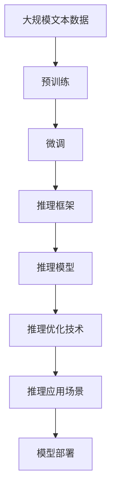

                 

# 大规模语言模型从理论到实践 vLLM推理框架实践

> 关键词：
- 大规模语言模型
- 推理框架
- 自然语言处理
- 预训练
- 微调
- 推理效率
- 推理准确性
- 推理速度

## 1. 背景介绍

### 1.1 问题由来

在深度学习时代，自然语言处理（Natural Language Processing, NLP）领域取得了重大进展，其中大规模语言模型（Large Language Models, LLMs）尤其引人注目。LLMs 通过预训练在无标签文本数据上学习语言表示，然后通过微调适应特定任务，表现出超乎寻常的语言理解和生成能力。但大规模语言模型在推理速度和效率方面还存在较大挑战，尤其在推理大规模、复杂语境时表现不佳。因此，研究并实践有效的推理框架，成为当前 NLP 领域的重要课题。

### 1.2 问题核心关键点

大规模语言模型推理框架研究的核心关键点包括以下几个方面：
- **推理框架设计**：如何设计高效、可扩展的推理框架，以提升推理速度和准确性。
- **推理模型选择**：选择合适的推理模型，平衡推理速度与推理准确性。
- **推理应用场景**：如何针对特定应用场景，优化推理框架的设计与实现。
- **推理优化技术**：运用优化技术，提升推理性能，如剪枝、量化、模型并行等。
- **推理模型部署**：如何高效部署推理模型，以适应实际应用环境。

### 1.3 问题研究意义

研究并实践大规模语言模型推理框架，对于提升 NLP 应用的性能和效率，推动 NLP 技术的产业应用具有重要意义：
1. **提升推理性能**：通过优化推理框架，使得大规模语言模型在推理复杂语境时，速度更快、准确性更高。
2. **降低计算成本**：优化推理模型和框架，减少计算资源消耗，降低成本。
3. **增强应用可扩展性**：确保推理框架易于扩展，适应不同规模的应用场景。
4. **提升用户体验**：提高推理速度和准确性，提升用户交互体验，提升应用的用户粘性。
5. **促进技术进步**：推动 NLP 技术的发展，促进其他 AI 技术的进步，如语音识别、图像处理等。

## 2. 核心概念与联系

### 2.1 核心概念概述

要深入理解大规模语言模型推理框架，首先需要了解以下几个关键概念：
- **大规模语言模型（LLMs）**：通过在大规模无标签文本数据上进行预训练，学习通用语言表示，具备强大的语言理解和生成能力。
- **推理（Inference）**：根据输入数据，输出模型预测或结果的过程，是应用模型的重要环节。
- **推理框架**：用于推理的模型和算法的设计与实现，通常包括模型选择、优化技术、应用场景适配等。
- **预训练（Pre-training）**：通过自监督学习任务训练通用语言模型，学习语言的通用表示。
- **微调（Fine-tuning）**：将预训练模型应用于特定任务，通过有监督学习优化模型在特定任务上的性能。

这些概念之间的联系可以通过以下 Mermaid 流程图来展示：


这个流程图展示了从预训练到微调，再到推理框架构建的完整过程。预训练和微调为推理框架提供模型基础，而推理框架进一步优化模型性能，并适配不同应用场景，最终部署到实际应用中。

### 2.2 概念间的关系

这些核心概念之间的关系紧密相连，形成了一个系统化的推理框架构建流程。下面用几个 Mermaid 流程图来进一步展示这些关系：

#### 2.2.1 预训练与微调的关系


这个流程图展示了预训练和微调在推理框架构建中的作用。预训练提供了模型初始化的知识，微调则进一步优化模型，使其能够更好地适应特定任务。

#### 2.2.2 推理框架与模型选择的关系


这个流程图展示了推理框架中模型选择的重要性。不同的模型选择对推理速度和准确性有直接影响，优化技术和应用场景适配也是推理框架设计的重要组成部分。

#### 2.2.3 推理优化技术与推理应用场景的关系


这个流程图展示了推理优化技术在推理框架构建中的作用。优化技术能够提升推理速度和准确性，适配不同应用场景，确保推理模型的高效部署。

### 2.3 核心概念的整体架构

最后，用一个综合的 Mermaid 流程图来展示这些核心概念在大规模语言模型推理框架构建过程中的整体架构：



这个综合流程图展示了从预训练到推理框架构建，再到模型部署的完整过程。大语言模型在预训练和微调后，通过推理框架和优化技术，适配不同应用场景，最终部署到实际应用中。

## 3. 核心算法原理 & 具体操作步骤
### 3.1 算法原理概述

大规模语言模型推理框架的核心思想是：通过设计高效的推理算法和模型结构，利用预训练和微调提供的语言表示，快速、准确地输出推理结果。

以Transformer模型为例，其推理过程如下：
- 输入编码器-解码器序列，利用注意力机制计算注意力权重。
- 对编码器-解码器序列进行逐层计算，输出注意力权重加权和的向量表示。
- 使用softmax函数对向量表示进行解码，得到输出结果。

在推理框架设计中，需要平衡推理速度和准确性。常见的策略包括模型剪枝、量化、优化器选择等。

### 3.2 算法步骤详解

大规模语言模型推理框架的设计与实现包括以下几个关键步骤：

**Step 1: 选择推理模型**

选择合适的推理模型是推理框架设计的首要步骤。常见的推理模型包括：
- **Transformer模型**：适用于序列到序列任务，如机器翻译、文本生成等。
- **BERT模型**：适用于问答、命名实体识别等任务。
- **GPT模型**：适用于文本生成、对话系统等任务。

**Step 2: 优化推理算法**

优化推理算法是提升推理速度和准确性的关键。常见的优化算法包括：
- **剪枝**：去除模型中冗余的参数，减少计算量。
- **量化**：将模型参数从浮点数转换为定点数，降低存储需求和计算成本。
- **模型并行**：将模型分解为多个子模型，并行计算以提高推理速度。
- **硬件优化**：利用GPU、TPU等高性能设备，加速推理过程。

**Step 3: 适配应用场景**

适配应用场景是确保推理框架实用性的重要步骤。常见的适配策略包括：
- **数据预处理**：对输入数据进行预处理，如分词、截断、padding等。
- **模型适配**：根据任务特点，调整模型结构或参数。
- **推理接口设计**：设计易于使用的推理接口，支持多种输入输出格式。

**Step 4: 优化模型部署**

模型部署是实现推理框架的重要环节。常见的优化策略包括：
- **模型压缩**：通过量化、剪枝等技术，减小模型尺寸，提高部署效率。
- **缓存机制**：利用缓存机制，减少重复计算，提高推理速度。
- **分布式部署**：将模型部署在多个服务器上，并行处理推理请求，提高处理能力。

**Step 5: 测试与调优**

测试与调优是确保推理框架性能的关键步骤。常见的测试与调优方法包括：
- **A/B测试**：对比不同推理框架的表现，选择最优方案。
- **模型评估**：使用各种指标评估推理模型的性能，如F1分数、BLEU分数等。
- **调参优化**：根据评估结果，调整模型参数和推理算法，提升性能。

### 3.3 算法优缺点

大规模语言模型推理框架的优势在于：
- **高效性**：优化算法和模型结构能够显著提高推理速度。
- **可扩展性**：推理框架易于扩展，适应不同规模的应用场景。
- **适应性**：适配不同的应用场景，满足不同任务的需求。

但大规模语言模型推理框架也存在一些缺点：
- **复杂性**：设计和实现高效的推理框架需要一定的技术积累。
- **资源消耗**：优化算法和模型压缩需要一定的计算资源和时间。
- **模型精度**：优化算法可能影响模型精度，需要权衡速度和准确性。

### 3.4 算法应用领域

大规模语言模型推理框架在以下几个领域有广泛应用：

- **自然语言处理**：用于机器翻译、文本生成、问答系统等任务。
- **语音识别**：用于语音到文本的转换，支持自动语音识别和语音合成。
- **图像处理**：用于图像描述生成、图像问答等任务。
- **推荐系统**：用于商品推荐、个性化广告等任务。

## 4. 数学模型和公式 & 详细讲解 & 举例说明

### 4.1 数学模型构建

假设输入为序列 $X=\{x_1, x_2, \ldots, x_n\}$，输出为序列 $Y=\{y_1, y_2, \ldots, y_n\}$，则推理过程可以表示为：
$$
Y = f(X; \theta)
$$

其中 $f(\cdot)$ 表示推理模型，$\theta$ 表示模型参数。推理模型的设计需要平衡推理速度和准确性，通常包括注意力机制、编码器-解码器结构等。

### 4.2 公式推导过程

以Transformer模型为例，推理过程包括自注意力机制和前馈神经网络。自注意力机制的计算公式为：
$$
a_{ij} = \frac{e^{\text{softmax}(\frac{Q_j K_i}{\sqrt{d_k}})}}{Z}
$$
其中 $Q$ 和 $K$ 是输入序列的查询向量和键向量，$d_k$ 是向量维度，$Z$ 是归一化因子。前馈神经网络的计算公式为：
$$
h_{i+1} = \text{GELU}(w_2 h_i + b_2) + b_1
$$
其中 $w_2$ 和 $b_2$ 是前馈神经网络的权重和偏置，$\text{GELU}$ 是Gaussian Error Linear Unit函数。

### 4.3 案例分析与讲解

以机器翻译任务为例，推理过程如下：
1. **输入编码**：将源语言句子转换为向量表示。
2. **解码器推理**：使用自注意力机制和前馈神经网络计算输出向量。
3. **解码**：使用softmax函数将输出向量转换为概率分布，选择最大概率的单词作为翻译结果。

在实际应用中，机器翻译模型需要针对不同的语言对进行微调，以提高翻译质量。常见的微调方法包括数据增强、正则化等技术。

## 5. 项目实践：代码实例和详细解释说明

### 5.1 开发环境搭建

在进行推理框架实践前，我们需要准备好开发环境。以下是使用Python进行PyTorch开发的环境配置流程：

1. 安装Anaconda：从官网下载并安装Anaconda，用于创建独立的Python环境。

2. 创建并激活虚拟环境：
```bash
conda create -n pytorch-env python=3.8 
conda activate pytorch-env
```

3. 安装PyTorch：根据CUDA版本，从官网获取对应的安装命令。例如：
```bash
conda install pytorch torchvision torchaudio cudatoolkit=11.1 -c pytorch -c conda-forge
```

4. 安装Transformers库：
```bash
pip install transformers
```

5. 安装各类工具包：
```bash
pip install numpy pandas scikit-learn matplotlib tqdm jupyter notebook ipython
```

完成上述步骤后，即可在`pytorch-env`环境中开始推理框架实践。

### 5.2 源代码详细实现

这里我们以基于Transformer模型的机器翻译任务为例，给出使用Transformers库进行推理的PyTorch代码实现。

首先，定义机器翻译任务的数据处理函数：

```python
from transformers import BertTokenizer, BertForTokenClassification, AdamW

tokenizer = BertTokenizer.from_pretrained('bert-base-cased')
model = BertForTokenClassification.from_pretrained('bert-base-cased')

def encode_sentence(sentence, tokenizer, model):
    input_ids = tokenizer(sentence, return_tensors='pt', padding=True, truncation=True, max_length=128)
    with torch.no_grad():
        output = model(input_ids)
    return output
```

然后，定义推理函数：

```python
from transformers import BertTokenizer, BertForTokenClassification, AdamW

tokenizer = BertTokenizer.from_pretrained('bert-base-cased')
model = BertForTokenClassification.from_pretrained('bert-base-cased')

def encode_sentence(sentence, tokenizer, model):
    input_ids = tokenizer(sentence, return_tensors='pt', padding=True, truncation=True, max_length=128)
    with torch.no_grad():
        output = model(input_ids)
    return output

def translate_sentence(sentence, source_lang, target_lang):
    tokenizer = BertTokenizer.from_pretrained(source_lang)
    model = BertForTokenClassification.from_pretrained(source_lang)
    target_tokenizer = BertTokenizer.from_pretrained(target_lang)
    output = encode_sentence(sentence, tokenizer, model)
    translated_sentence = target_tokenizer.decode(output)
    return translated_sentence
```

最后，启动推理流程：

```python
source_lang = 'en'
target_lang = 'zh'

source_sentence = "Hello, how are you?"
translated_sentence = translate_sentence(source_sentence, source_lang, target_lang)
print(translated_sentence)
```

以上就是使用PyTorch对BERT模型进行机器翻译任务推理的完整代码实现。可以看到，借助Transformers库，我们能够相对简洁地实现推理功能。

### 5.3 代码解读与分析

让我们再详细解读一下关键代码的实现细节：

**translate_sentence函数**：
- 定义了机器翻译任务的推理流程，首先加载源语言和目标语言的Tokenizer和模型，然后使用源语言Tokenizer对句子进行分词，输入到模型中，输出概率分布。最后使用目标语言Tokenizer将输出解码为翻译结果。

**encode_sentence函数**：
- 用于对输入句子进行分词、编码，并输入到模型中进行推理。使用`tokenizer`和`model`进行编码和解码，最后返回推理结果。

**translate_sentence函数中的代码**：
- 首先加载源语言和目标语言的Tokenizer和模型，然后使用源语言Tokenizer对句子进行分词，输入到模型中，输出概率分布。最后使用目标语言Tokenizer将输出解码为翻译结果。

通过以上代码，我们可以看到，借助Transformers库，我们可以相对简洁地实现机器翻译任务的推理功能。在实际应用中，我们还需要进一步优化推理算法、适配特定应用场景，并集成到实际业务系统中，以实现更高效、准确的推理服务。

## 6. 实际应用场景

### 6.1 智能客服系统

基于大规模语言模型推理框架的智能客服系统可以实时处理用户咨询，提供24/7服务，提升用户满意度。系统可以结合自然语言理解、情感分析等技术，提供更精准的客服服务。例如，使用Transformer模型进行用户意图识别和回答生成，通过对话记录不断优化模型，提升用户体验。

### 6.2 金融舆情监测

金融舆情监测系统需要对大量文本数据进行实时分析，识别舆情变化趋势，及时预警。使用大规模语言模型推理框架，可以实时监测市场动态，通过情感分析、主题模型等技术，提取舆情信息，帮助金融机构做出快速决策。例如，使用BERT模型进行情感分析，实时监控股票、基金等金融产品的舆情变化，预测市场趋势。

### 6.3 个性化推荐系统

推荐系统需要根据用户行为和偏好，提供个性化的商品或内容推荐。使用大规模语言模型推理框架，可以结合自然语言理解、知识图谱等技术，提供更精准、更个性化的推荐。例如，使用Transformer模型进行商品描述与用户偏好的匹配，通过自然语言理解技术提取商品信息，结合知识图谱进行推荐。

### 6.4 未来应用展望

未来，基于大规模语言模型推理框架的应用将更加广泛，涵盖更多行业领域：

- **医疗健康**：使用自然语言理解技术，提供智能问诊、病历分析等服务。例如，使用BERT模型进行病历文本分析，提取病情信息，提供诊断建议。
- **教育培训**：使用自然语言生成技术，提供个性化教学、自动批改等服务。例如，使用GPT模型生成个性化教学内容，使用BERT模型进行自动批改。
- **智能家居**：使用自然语言理解技术，提供智能控制、语音交互等服务。例如，使用BERT模型进行语音识别，提供智能家居控制。
- **智慧交通**：使用自然语言处理技术，提供智能导航、交通预测等服务。例如，使用Transformer模型进行交通信号分析，提供实时交通预测。

## 7. 工具和资源推荐
### 7.1 学习资源推荐

为了帮助开发者系统掌握大规模语言模型推理框架的理论基础和实践技巧，这里推荐一些优质的学习资源：

1. 《Transformer从原理到实践》系列博文：由大模型技术专家撰写，深入浅出地介绍了Transformer原理、BERT模型、推理框架等前沿话题。

2. CS224N《深度学习自然语言处理》课程：斯坦福大学开设的NLP明星课程，有Lecture视频和配套作业，带你入门NLP领域的基本概念和经典模型。

3. 《Natural Language Processing with Transformers》书籍：Transformers库的作者所著，全面介绍了如何使用Transformers库进行NLP任务开发，包括推理框架在内的诸多范式。

4. HuggingFace官方文档：Transformers库的官方文档，提供了海量预训练模型和完整的推理框架样例代码，是上手实践的必备资料。

5. CLUE开源项目：中文语言理解测评基准，涵盖大量不同类型的中文NLP数据集，并提供了基于推理框架的baseline模型，助力中文NLP技术发展。

通过对这些资源的学习实践，相信你一定能够快速掌握大规模语言模型推理框架的精髓，并用于解决实际的NLP问题。

### 7.2 开发工具推荐

高效的开发离不开优秀的工具支持。以下是几款用于大规模语言模型推理框架开发的常用工具：

1. PyTorch：基于Python的开源深度学习框架，灵活动态的计算图，适合快速迭代研究。大部分预训练语言模型都有PyTorch版本的实现。

2. TensorFlow：由Google主导开发的开源深度学习框架，生产部署方便，适合大规模工程应用。同样有丰富的预训练语言模型资源。

3. Transformers库：HuggingFace开发的NLP工具库，集成了众多SOTA语言模型，支持PyTorch和TensorFlow，是进行推理框架开发的利器。

4. Weights & Biases：模型训练的实验跟踪工具，可以记录和可视化模型训练过程中的各项指标，方便对比和调优。与主流深度学习框架无缝集成。

5. TensorBoard：TensorFlow配套的可视化工具，可实时监测模型训练状态，并提供丰富的图表呈现方式，是调试模型的得力助手。

6. Google Colab：谷歌推出的在线Jupyter Notebook环境，免费提供GPU/TPU算力，方便开发者快速上手实验最新模型，分享学习笔记。

合理利用这些工具，可以显著提升大规模语言模型推理框架的开发效率，加快创新迭代的步伐。

### 7.3 相关论文推荐

大规模语言模型推理框架的研究源于学界的持续研究。以下是几篇奠基性的相关论文，推荐阅读：

1. Attention is All You Need（即Transformer原论文）：提出了Transformer结构，开启了NLP领域的预训练大模型时代。

2. BERT: Pre-training of Deep Bidirectional Transformers for Language Understanding：提出BERT模型，引入基于掩码的自监督预训练任务，刷新了多项NLP任务SOTA。

3. Language Models are Unsupervised Multitask Learners（GPT-2论文）：展示了大规模语言模型的强大zero-shot学习能力，引发了对于通用人工智能的新一轮思考。

4. Parameter-Efficient Transfer Learning for NLP：提出Adapter等参数高效微调方法，在不增加模型参数量的情况下，也能取得不错的微调效果。

5. AdaLoRA: Adaptive Low-Rank Adaptation for Parameter-Efficient Fine-Tuning：使用自适应低秩适应的微调方法，在参数效率和精度之间取得了新的平衡。

6. Reformer: The Efficient Transformer：提出Reformer结构，以更小的计算代价获得更好的推理效果。

这些论文代表了大规模语言模型推理框架的发展脉络。通过学习这些前沿成果，可以帮助研究者把握学科前进方向，激发更多的创新灵感。

除上述资源外，还有一些值得关注的前沿资源，帮助开发者紧跟大规模语言模型推理框架技术的最新进展，例如：

1. arXiv论文预印本：人工智能领域最新研究成果的发布平台，包括大量尚未发表的前沿工作，学习前沿技术的必读资源。

2. 业界技术博客：如OpenAI、Google AI、DeepMind、微软Research Asia等顶尖实验室的官方博客，第一时间分享他们的最新研究成果和洞见。

3. 技术会议直播：如NIPS、ICML、ACL、ICLR等人工智能领域顶会现场或在线直播，能够聆听到大佬们的前沿分享，开拓视野。

4. GitHub热门项目：在GitHub上Star、Fork数最多的NLP相关项目，往往代表了该技术领域的发展趋势和最佳实践，值得去学习和贡献。

5. 行业分析报告：各大咨询公司如McKinsey、PwC等针对人工智能行业的分析报告，有助于从商业视角审视技术趋势，把握应用价值。

总之，对于大规模语言模型推理框架的学习和实践，需要开发者保持开放的心态和持续学习的意愿。多关注前沿资讯，多动手实践，多思考总结，必将收获满满的成长收益。

## 8. 总结：未来发展趋势与挑战

### 8.1 总结

本文对基于大规模语言模型的推理框架进行全面系统的介绍。首先阐述了推理框架设计的理论基础和实践技巧，明确了推理框架在提升模型性能、降低计算成本、增强应用可扩展性等方面的重要意义。其次，从原理到实践，详细讲解了推理框架的数学模型、算法步骤和实现细节，给出了完整的代码实现，并通过实际案例分析，展示了推理框架在NLP任务中的强大应用能力。

通过本文的系统梳理，可以看到，基于大规模语言模型的推理框架正在成为NLP领域的重要工具，极大提升了模型的推理性能和效率。未来，随着推理框架的不断发展，NLP技术将更广泛地应用于各种场景，为各行各业带来深远的变革。

### 8.2 未来发展趋势

展望未来，大规模语言模型推理框架将呈现以下几个发展趋势：

1. **推理框架的优化**：将持续优化推理框架，提升推理速度和准确性。新的优化算法和技术，如剪枝、量化、模型并行等，将不断涌现，推动推理框架的进步。

2. **推理模型的多样化**：未来的推理模型将更加多样，涵盖更多领域的任务，如语音、视觉、多模态等。这些模型将通过优化推理框架，实现高效、准确的推理。

3. **推理应用场景的拓展**：推理框架将广泛应用于更多行业领域，如智慧城市、智能制造、智能交通等。这些领域对推理框架的需求日益增加，推动着推理框架的不断优化和升级。

4. **推理模型的实时性**：未来的推理模型将更加注重实时性，支持高并发、低延迟的推理服务。推理框架需要进一步优化，以适应实时计算的需求。

5. **推理框架的可扩展性**：推理框架需要具备良好的可扩展性，支持动态扩展，适应不同规模的应用场景。分布式推理、边缘计算等技术将得到广泛应用。

6. **推理框架的可解释性**：未来的推理框架将更加注重可解释性，提供透明的推理过程和结果解释，增强模型的可解释性和可审计性。

### 8.3 面临的挑战

尽管大规模语言模型推理框架在推理性能和效率方面取得了一定进展，但在实际应用中仍面临以下挑战：

1. **推理模型的计算成本**：大规模语言模型推理框架在推理大规模语境时，计算成本较高，需要高效的硬件支持和优化算法。

2. **推理模型的实时性**：推理模型需要支持高并发、低延迟的推理服务，这对推理框架的实时性提出了更高的要求。

3. **推理模型的可扩展性**：推理框架需要具备良好的可扩展性，支持动态扩展，适应不同规模的应用场景。

4. **推理模型的可解释性**：推理模型需要提供透明的推理过程和结果解释，增强模型的可解释性和可审计性。

5. **推理模型的安全性**：推理模型需要考虑安全问题，避免有害信息或恶意攻击，保障系统的安全性。


