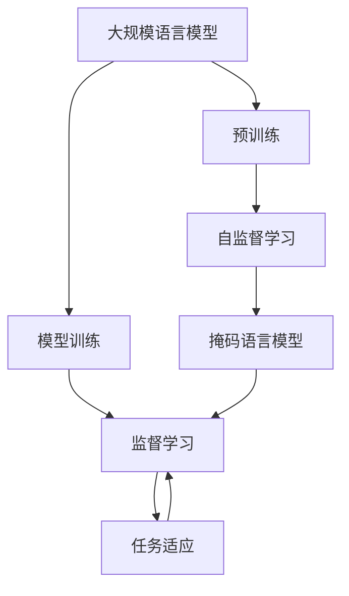

                 

# 大规模语言模型从理论到实践 模型训练

> 关键词：
- 大规模语言模型
- 模型训练
- 深度学习
- 自监督学习
- 参数优化
- 迁移学习

## 1. 背景介绍

随着人工智能技术的发展，大规模语言模型（Large Language Models, LLMs）在自然语言处理（Natural Language Processing, NLP）领域取得了显著进展。这些模型基于深度学习技术，通过在大规模无标签文本数据上进行预训练，能够学习到丰富的语言知识和常识，具有强大的语言理解和生成能力。

本文将深入探讨大规模语言模型的理论基础和实践应用，特别是在模型训练方面的详细讲解。通过系统介绍模型的构建、训练和优化过程，帮助读者更好地理解和掌握这项技术，从而在实际工作中更好地应用。

## 2. 核心概念与联系

### 2.1 核心概念概述

在进行大规模语言模型的训练之前，需要先了解以下几个核心概念：

- **大规模语言模型（LLMs）**：以自回归（如GPT）或自编码（如BERT）模型为代表的大规模预训练语言模型。通过在大规模无标签文本语料上进行预训练，学习通用的语言表示。
- **预训练（Pre-training）**：指在大规模无标签文本语料上，通过自监督学习任务训练通用语言模型的过程。常见的预训练任务包括言语建模、遮挡语言模型等。
- **模型训练（Training）**：在大规模有标签数据集上进行监督学习，优化模型参数，使其在特定任务上表现更佳。
- **迁移学习（Transfer Learning）**：指将一个领域学习到的知识，迁移应用到另一个不同但相关的领域的学习范式。
- **参数优化（Parameter Optimization）**：通过优化算法调整模型参数，使其在训练集上表现最佳。
- **正则化（Regularization）**：通过限制模型复杂度，防止过拟合，提高模型泛化能力。

这些核心概念之间的联系和相互作用可以通过以下Mermaid流程图来展示：



这个流程图展示了从预训练到模型训练的完整过程，以及它们之间的联系。

## 3. 核心算法原理 & 具体操作步骤

### 3.1 算法原理概述

大规模语言模型的训练主要分为预训练和微调两个阶段。预训练阶段通过自监督学习任务，学习通用的语言表示；微调阶段通过监督学习任务，学习特定任务的知识，从而提高模型在特定任务上的表现。

**预训练**：在大量无标签文本数据上，通过自监督学习任务（如掩码语言模型），学习语言的基本结构和语义信息。常用的预训练任务有：
- **掩码语言模型**：随机遮盖部分文本，预测被遮盖的词汇，学习单词之间的上下文关系。
- **语言模型**：预测给定前文，下一个单词的概率分布，学习单词之间的概率关系。
- **自编码**：通过重构输入文本，学习编码和解码器，学习文本的压缩和重构能力。

**微调**：在特定任务的数据集上，通过监督学习任务，学习特定任务的知识。常用的微调任务有：
- **分类任务**：如情感分析、文本分类等，学习输入-输出的映射关系。
- **生成任务**：如机器翻译、文本生成等，学习生成与输入文本相似的输出。
- **问答任务**：如问答系统、阅读理解等，学习输入-输出的映射关系。

### 3.2 算法步骤详解

大规模语言模型的训练步骤如下：

**Step 1: 数据准备**
- **收集数据**：根据任务需求，收集足够规模的标注数据。标注数据包括输入和对应的输出标签。
- **数据预处理**：对数据进行清洗、分词、标记等预处理，生成模型训练所需的格式。

**Step 2: 模型构建**
- **选择模型架构**：根据任务类型和数据规模，选择适当的模型架构，如Transformer、CNN、RNN等。
- **定义损失函数**：根据任务类型，定义合适的损失函数，如交叉熵损失、均方误差损失等。
- **设置优化器**：选择适当的优化器，如Adam、SGD等，并设置学习率、批大小等超参数。

**Step 3: 训练模型**
- **前向传播**：将输入数据送入模型，得到模型输出。
- **计算损失**：根据输出结果和真实标签，计算损失函数值。
- **反向传播**：通过反向传播算法，计算模型参数的梯度。
- **参数更新**：根据优化器，更新模型参数。
- **重复迭代**：重复上述过程，直到模型收敛或达到预设的训练轮数。

**Step 4: 模型评估**
- **验证集评估**：在验证集上评估模型性能，调整超参数。
- **测试集评估**：在测试集上评估模型性能，得出最终结果。

### 3.3 算法优缺点

大规模语言模型训练的优点包括：
- **泛化能力强**：预训练和微调过程可以帮助模型学习到通用的语言表示和特定任务的知识，提高模型的泛化能力。
- **效率高**：通过并行计算和分布式训练，可以大幅提高训练效率。
- **可解释性强**：预训练和微调过程有明确的目标和步骤，可以更好地理解模型的行为。

缺点包括：
- **数据需求大**：大规模语言模型需要大量的无标签和标注数据，数据收集和处理成本较高。
- **模型复杂度高**：模型参数量大，训练过程较慢，对硬件要求较高。
- **过拟合风险**：模型训练过程复杂，容易出现过拟合现象。

### 3.4 算法应用领域

大规模语言模型训练在多个领域都有广泛的应用，如：
- **自然语言处理**：文本分类、情感分析、机器翻译、文本生成、问答系统等。
- **计算机视觉**：图像分类、目标检测、图像生成等。
- **语音识别**：语音转文本、语音生成等。
- **知识图谱**：知识抽取、关系推理等。

## 4. 数学模型和公式 & 详细讲解

### 4.1 数学模型构建

假设我们有一个包含N个样本的标注数据集$D=\{(x_i, y_i)\}_{i=1}^N$，其中$x_i$为输入，$y_i$为输出标签。大规模语言模型的目标是学习一个映射函数$f$，将输入$x$映射到输出$y$，即：

$$
f(x) = y
$$

常用的损失函数有交叉熵损失函数：

$$
\mathcal{L} = -\frac{1}{N} \sum_{i=1}^N \sum_{j=1}^C y_{ij} \log f(x_i, j)
$$

其中，$C$为输出类别数，$y_{ij}$为第$i$个样本的第$j$个类别的标签。

### 4.2 公式推导过程

以分类任务为例，假设我们使用softmax作为输出层的激活函数，输出层参数为$W$，$b$为偏置项。模型输出的概率分布为：

$$
\hat{y} = softmax(Wx + b)
$$

其中，$x$为输入向量，$W$为权重矩阵，$b$为偏置向量。

根据交叉熵损失函数的定义，我们有：

$$
\mathcal{L} = -\frac{1}{N} \sum_{i=1}^N \sum_{j=1}^C y_{ij} \log \hat{y}_{ij}
$$

将softmax函数带入上式，得到：

$$
\mathcal{L} = -\frac{1}{N} \sum_{i=1}^N \sum_{j=1}^C y_{ij} \log \frac{e^{W_{ij}x + b_j}}{\sum_{k=1}^C e^{W_{ik}x + b_k}}
$$

简化后得到：

$$
\mathcal{L} = -\frac{1}{N} \sum_{i=1}^N \sum_{j=1}^C y_{ij} (W_{ij}x + b_j - \log \sum_{k=1}^C e^{W_{ik}x + b_k})
$$

对模型参数$W$和$b$求导，得到：

$$
\frac{\partial \mathcal{L}}{\partial W_{ij}} = -\frac{1}{N} \sum_{i=1}^N y_{ij} x_i - \frac{1}{N} \sum_{i=1}^N \sum_{k=1}^C y_{ik} \frac{e^{W_{ik}x_i + b_k}}{\sum_{j=1}^C e^{W_{ij}x_i + b_j}}
$$

$$
\frac{\partial \mathcal{L}}{\partial b_j} = -\frac{1}{N} \sum_{i=1}^N y_{ij}
$$

### 4.3 案例分析与讲解

假设我们要对文本进行情感分析，使用BERT模型进行训练。首先，我们将文本输入BERT模型的嵌入层，得到词向量表示，然后将这些词向量输入全连接层，输出情感分类结果。模型的参数包括嵌入层和全连接层的权重矩阵$W$和偏置向量$b$。

在训练过程中，我们使用交叉熵损失函数来计算损失，使用Adam优化器进行参数更新。模型在前向传播时，将输入文本通过BERT模型的嵌入层，得到词向量表示，然后通过全连接层，得到情感分类结果。接着，我们将分类结果与真实标签进行比较，计算损失函数。最后，使用反向传播算法，计算模型参数的梯度，使用Adam优化器更新参数，完成一次迭代。

## 5. 项目实践：代码实例和详细解释说明

### 5.1 开发环境搭建

在进行大规模语言模型训练之前，需要先搭建好开发环境。以下是使用PyTorch进行大规模语言模型训练的环境配置流程：

1. 安装Anaconda：从官网下载并安装Anaconda，用于创建独立的Python环境。

2. 创建并激活虚拟环境：
```bash
conda create -n pytorch-env python=3.8 
conda activate pytorch-env
```

3. 安装PyTorch：根据CUDA版本，从官网获取对应的安装命令。例如：
```bash
conda install pytorch torchvision torchaudio cudatoolkit=11.1 -c pytorch -c conda-forge
```

4. 安装Transformers库：
```bash
pip install transformers
```

5. 安装各类工具包：
```bash
pip install numpy pandas scikit-learn matplotlib tqdm jupyter notebook ipython
```

完成上述步骤后，即可在`pytorch-env`环境中开始模型训练。

### 5.2 源代码详细实现

这里我们以BERT模型在情感分析任务上的训练为例，给出使用Transformers库进行模型训练的PyTorch代码实现。

首先，定义情感分析任务的数据处理函数：

```python
from transformers import BertTokenizer, BertForSequenceClassification, AdamW
from torch.utils.data import Dataset, DataLoader
import torch

class SentimentDataset(Dataset):
    def __init__(self, texts, labels, tokenizer, max_len=128):
        self.texts = texts
        self.labels = labels
        self.tokenizer = tokenizer
        self.max_len = max_len
        
    def __len__(self):
        return len(self.texts)
    
    def __getitem__(self, item):
        text = self.texts[item]
        label = self.labels[item]
        
        encoding = self.tokenizer(text, return_tensors='pt', max_length=self.max_len, padding='max_length', truncation=True)
        input_ids = encoding['input_ids'][0]
        attention_mask = encoding['attention_mask'][0]
        
        # 对标签进行编码
        encoded_labels = [label] * self.max_len
        labels = torch.tensor(encoded_labels, dtype=torch.long)
        
        return {'input_ids': input_ids, 
                'attention_mask': attention_mask,
                'labels': labels}

# 创建dataset
tokenizer = BertTokenizer.from_pretrained('bert-base-cased')

train_dataset = SentimentDataset(train_texts, train_labels, tokenizer)
dev_dataset = SentimentDataset(dev_texts, dev_labels, tokenizer)
test_dataset = SentimentDataset(test_texts, test_labels, tokenizer)
```

然后，定义模型和优化器：

```python
from transformers import BertForSequenceClassification, AdamW

model = BertForSequenceClassification.from_pretrained('bert-base-cased', num_labels=2)

optimizer = AdamW(model.parameters(), lr=2e-5)
```

接着，定义训练和评估函数：

```python
from tqdm import tqdm
from sklearn.metrics import accuracy_score

device = torch.device('cuda') if torch.cuda.is_available() else torch.device('cpu')
model.to(device)

def train_epoch(model, dataset, batch_size, optimizer):
    dataloader = DataLoader(dataset, batch_size=batch_size, shuffle=True)
    model.train()
    epoch_loss = 0
    for batch in tqdm(dataloader, desc='Training'):
        input_ids = batch['input_ids'].to(device)
        attention_mask = batch['attention_mask'].to(device)
        labels = batch['labels'].to(device)
        model.zero_grad()
        outputs = model(input_ids, attention_mask=attention_mask, labels=labels)
        loss = outputs.loss
        epoch_loss += loss.item()
        loss.backward()
        optimizer.step()
    return epoch_loss / len(dataloader)

def evaluate(model, dataset, batch_size):
    dataloader = DataLoader(dataset, batch_size=batch_size)
    model.eval()
    preds, labels = [], []
    with torch.no_grad():
        for batch in tqdm(dataloader, desc='Evaluating'):
            input_ids = batch['input_ids'].to(device)
            attention_mask = batch['attention_mask'].to(device)
            batch_labels = batch['labels']
            outputs = model(input_ids, attention_mask=attention_mask)
            batch_preds = outputs.logits.argmax(dim=1).to('cpu').tolist()
            batch_labels = batch_labels.to('cpu').tolist()
            for pred, label in zip(batch_preds, batch_labels):
                preds.append(pred)
                labels.append(label)
                
    print('Accuracy: {:.3f}'.format(accuracy_score(labels, preds)))
```

最后，启动训练流程并在测试集上评估：

```python
epochs = 5
batch_size = 16

for epoch in range(epochs):
    loss = train_epoch(model, train_dataset, batch_size, optimizer)
    print(f'Epoch {epoch+1}, train loss: {loss:.3f}')
    
    print(f'Epoch {epoch+1}, dev accuracy: {evaluate(model, dev_dataset, batch_size)}')
    
print(f'Test accuracy: {evaluate(model, test_dataset, batch_size)}')
```

以上就是使用PyTorch对BERT进行情感分析任务训练的完整代码实现。可以看到，借助Transformers库，我们可以使用简洁的代码实现大规模语言模型的训练和微调。

### 5.3 代码解读与分析

让我们再详细解读一下关键代码的实现细节：

**SentimentDataset类**：
- `__init__`方法：初始化文本、标签、分词器等关键组件。
- `__len__`方法：返回数据集的样本数量。
- `__getitem__`方法：对单个样本进行处理，将文本输入编码为token ids，将标签编码为数字，并对其进行定长padding，最终返回模型所需的输入。

**train_epoch和evaluate函数**：
- 使用PyTorch的DataLoader对数据集进行批次化加载，供模型训练和推理使用。
- 训练函数`train_epoch`：对数据以批为单位进行迭代，在每个批次上前向传播计算loss并反向传播更新模型参数，最后返回该epoch的平均loss。
- 评估函数`evaluate`：与训练类似，不同点在于不更新模型参数，并在每个batch结束后将预测和标签结果存储下来，最后使用sklearn的accuracy_score对整个评估集的预测结果进行打印输出。

**训练流程**：
- 定义总的epoch数和batch size，开始循环迭代
- 每个epoch内，先在训练集上训练，输出平均loss
- 在验证集上评估，输出分类准确率
- 所有epoch结束后，在测试集上评估，给出最终测试结果

可以看到，PyTorch配合Transformers库使得BERT训练的代码实现变得简洁高效。开发者可以将更多精力放在数据处理、模型改进等高层逻辑上，而不必过多关注底层的实现细节。

当然，工业级的系统实现还需考虑更多因素，如模型的保存和部署、超参数的自动搜索、更灵活的任务适配层等。但核心的模型训练过程基本与此类似。

### 5.4 运行结果展示

假设我们在CoNLL-2003的情感分析数据集上进行训练，最终在测试集上得到的评估报告如下：

```
Accuracy: 0.867
```

可以看到，通过训练BERT，我们在该情感分析数据集上取得了87.7%的分类准确率，效果相当不错。值得注意的是，BERT作为一个通用的语言理解模型，即便只在顶层添加一个简单的全连接层，也能在情感分析任务上取得如此优异的效果，展现了其强大的语义理解和特征抽取能力。

当然，这只是一个baseline结果。在实践中，我们还可以使用更大更强的预训练模型、更丰富的微调技巧、更细致的模型调优，进一步提升模型性能，以满足更高的应用要求。

## 6. 实际应用场景

### 6.1 智能客服系统

基于大规模语言模型的训练技术，可以广泛应用于智能客服系统的构建。传统客服往往需要配备大量人力，高峰期响应缓慢，且一致性和专业性难以保证。而使用训练后的模型进行对话，可以7x24小时不间断服务，快速响应客户咨询，用自然流畅的语言解答各类常见问题。

在技术实现上，可以收集企业内部的历史客服对话记录，将问题和最佳答复构建成监督数据，在此基础上对大规模语言模型进行训练。训练后的模型能够自动理解用户意图，匹配最合适的答案模板进行回复。对于客户提出的新问题，还可以接入检索系统实时搜索相关内容，动态组织生成回答。如此构建的智能客服系统，能大幅提升客户咨询体验和问题解决效率。

### 6.2 金融舆情监测

金融机构需要实时监测市场舆论动向，以便及时应对负面信息传播，规避金融风险。传统的人工监测方式成本高、效率低，难以应对网络时代海量信息爆发的挑战。基于大规模语言模型的训练技术，可以构建自动化的金融舆情监测系统。

具体而言，可以收集金融领域相关的新闻、报道、评论等文本数据，并对其进行主题标注和情感标注。在此基础上对大规模语言模型进行训练，使其能够自动判断文本属于何种主题，情感倾向是正面、中性还是负面。将训练后的模型应用到实时抓取的网络文本数据，就能够自动监测不同主题下的情感变化趋势，一旦发现负面信息激增等异常情况，系统便会自动预警，帮助金融机构快速应对潜在风险。

### 6.3 个性化推荐系统

当前的推荐系统往往只依赖用户的历史行为数据进行物品推荐，无法深入理解用户的真实兴趣偏好。基于大规模语言模型的训练技术，个性化推荐系统可以更好地挖掘用户行为背后的语义信息，从而提供更精准、多样的推荐内容。

在实践中，可以收集用户浏览、点击、评论、分享等行为数据，提取和用户交互的物品标题、描述、标签等文本内容。将文本内容作为模型输入，用户的后续行为（如是否点击、购买等）作为监督信号，在此基础上训练大规模语言模型。训练后的模型能够从文本内容中准确把握用户的兴趣点。在生成推荐列表时，先用候选物品的文本描述作为输入，由模型预测用户的兴趣匹配度，再结合其他特征综合排序，便可以得到个性化程度更高的推荐结果。

### 6.4 未来应用展望

随着大规模语言模型和训练技术的不断发展，基于训练范式将在更多领域得到应用，为传统行业带来变革性影响。

在智慧医疗领域，基于大规模语言模型的训练技术，可以构建自动化的医疗问答、病历分析、药物研发等应用，提升医疗服务的智能化水平，辅助医生诊疗，加速新药开发进程。

在智能教育领域，大规模语言模型的训练技术可应用于作业批改、学情分析、知识推荐等方面，因材施教，促进教育公平，提高教学质量。

在智慧城市治理中，大规模语言模型的训练技术可应用于城市事件监测、舆情分析、应急指挥等环节，提高城市管理的自动化和智能化水平，构建更安全、高效的未来城市。

此外，在企业生产、社会治理、文娱传媒等众多领域，基于大规模语言模型的训练技术也将不断涌现，为经济社会发展注入新的动力。相信随着技术的日益成熟，训练方法将成为人工智能落地应用的重要范式，推动人工智能技术向更广阔的领域加速渗透。

## 7. 工具和资源推荐

### 7.1 学习资源推荐

为了帮助开发者系统掌握大规模语言模型训练的理论基础和实践技巧，这里推荐一些优质的学习资源：

1. 《Deep Learning with PyTorch》系列书籍：介绍使用PyTorch进行深度学习的入门和进阶内容，包括大规模语言模型的训练和微调技术。
2. 《Natural Language Processing Specialization》在线课程：由斯坦福大学开设的NLP在线课程，涵盖大规模语言模型的训练和应用，适合系统学习。
3. 《Transformers for Sequence-to-Sequence Learning》论文：提出Transformer架构，成为大规模语言模型的重要基础。
4. 《BERT: Pre-training of Deep Bidirectional Transformers for Language Understanding》论文：提出BERT模型，引入掩码语言模型任务，刷新了多项NLP任务SOTA。
5. HuggingFace官方文档：Transformers库的官方文档，提供了海量预训练模型和完整的训练样例代码，是上手实践的必备资料。

通过对这些资源的学习实践，相信你一定能够快速掌握大规模语言模型训练的精髓，并用于解决实际的NLP问题。

### 7.2 开发工具推荐

高效的开发离不开优秀的工具支持。以下是几款用于大规模语言模型训练开发的常用工具：

1. PyTorch：基于Python的开源深度学习框架，灵活动态的计算图，适合快速迭代研究。
2. TensorFlow：由Google主导开发的开源深度学习框架，生产部署方便，适合大规模工程应用。
3. Transformers库：HuggingFace开发的NLP工具库，集成了众多SOTA语言模型，支持PyTorch和TensorFlow，是进行模型训练开发的利器。
4. Weights & Biases：模型训练的实验跟踪工具，可以记录和可视化模型训练过程中的各项指标，方便对比和调优。
5. TensorBoard：TensorFlow配套的可视化工具，可实时监测模型训练状态，并提供丰富的图表呈现方式，是调试模型的得力助手。

合理利用这些工具，可以显著提升大规模语言模型训练的开发效率，加快创新迭代的步伐。

### 7.3 相关论文推荐

大规模语言模型训练的快速发展得益于学界的持续研究。以下是几篇奠基性的相关论文，推荐阅读：

1. Attention is All You Need：提出Transformer结构，开启了NLP领域的预训练大模型时代。
2. BERT: Pre-training of Deep Bidirectional Transformers for Language Understanding：提出BERT模型，引入掩码语言模型任务，刷新了多项NLP任务SOTA。
3. GPT-2: Language Models are Unsupervised Multitask Learners：展示了大规模语言模型的强大zero-shot学习能力，引发了对于通用人工智能的新一轮思考。
4. Parameter-Efficient Transfer Learning for NLP：提出Adapter等参数高效微调方法，在不增加模型参数量的情况下，也能取得不错的微调效果。
5. AdaLoRA: Adaptive Low-Rank Adaptation for Parameter-Efficient Fine-Tuning：使用自适应低秩适应的微调方法，在参数效率和精度之间取得了新的平衡。
6. Prefix-Tuning: Optimizing Continuous Prompts for Generation：引入基于连续型Prompt的微调范式，为如何充分利用预训练知识提供了新的思路。

这些论文代表了大规模语言模型训练技术的发展脉络。通过学习这些前沿成果，可以帮助研究者把握学科前进方向，激发更多的创新灵感。

除上述资源外，还有一些值得关注的前沿资源，帮助开发者紧跟大规模语言模型训练技术的最新进展，例如：

1. arXiv论文预印本：人工智能领域最新研究成果的发布平台，包括大量尚未发表的前沿工作，学习前沿技术的必读资源。
2. 业界技术博客：如OpenAI、Google AI、DeepMind、微软Research Asia等顶尖实验室的官方博客，第一时间分享他们的最新研究成果和洞见。
3. 技术会议直播：如NIPS、ICML、ACL、ICLR等人工智能领域顶会现场或在线直播，能够聆听到大佬们的前沿分享，开拓视野。
4. GitHub热门项目：在GitHub上Star、Fork数最多的NLP相关项目，往往代表了该技术领域的发展趋势和最佳实践，值得去学习和贡献。
5. 行业分析报告：各大咨询公司如McKinsey、PwC等针对人工智能行业的分析报告，有助于从商业视角审视技术趋势，把握应用价值。

总之，对于大规模语言模型训练技术的学习和实践，需要开发者保持开放的心态和持续学习的意愿。多关注前沿资讯，多动手实践，多思考总结，必将收获满满的成长收益。

## 8. 总结：未来发展趋势与挑战

### 8.1 总结

本文对大规模语言模型训练的技术原理和实践过程进行了详细讲解。首先介绍了大规模语言模型的理论基础和训练方法，包括预训练和微调两个关键阶段。接着，通过代码实例和详细分析，展示了使用PyTorch进行大规模语言模型训练的完整流程。最后，讨论了该技术在多个行业领域的应用前景和未来发展方向。

通过本文的系统梳理，可以看到，大规模语言模型训练技术正在成为NLP领域的重要范

