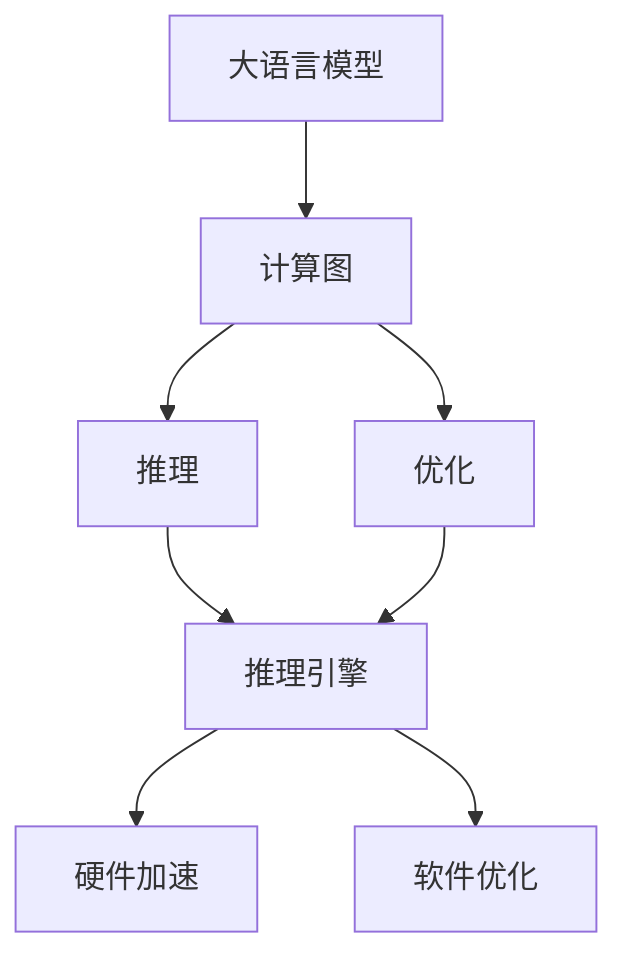

                 

# 大语言模型原理与工程实践：大语言模型推理工程提升规模：模型量 

> 关键词：
  - 大语言模型
  - 推理工程
  - 模型量
  - 计算图优化
  - 量化加速
  - 混合精度
  - 模型压缩
  - 推理性能
  - 高效推理引擎

## 1. 背景介绍

### 1.1 问题由来

随着深度学习技术和大规模预训练语言模型的兴起，大语言模型（Large Language Model, LLM）在自然语言处理（NLP）领域取得了显著进展。然而，尽管这些大模型在处理大规模文本数据和复杂的语言理解任务上表现出色，但它们的推理过程通常耗费大量计算资源，导致推理速度慢、效率低下的问题，制约了其在实际应用中的广泛使用。为了提升大语言模型的推理性能，需要采用各种工程方法对模型进行优化，以在保证模型性能的前提下降低计算成本。

### 1.2 问题核心关键点

推理工程的核心目标是优化大语言模型的推理过程，提升推理速度和效率，同时保证模型性能。关键点包括：

- 推理计算图优化：通过对模型的计算图进行优化，减少不必要的计算量，提高推理速度。
- 量化加速：将模型中的浮点数运算转化为定点运算，以减少计算量和内存消耗。
- 混合精度：结合使用32位和16位精度计算，以平衡计算速度和精度。
- 模型压缩：通过剪枝、量化等方法减少模型参数量，降低计算和存储成本。
- 高效推理引擎：选择合适的推理引擎，利用硬件加速和软件优化提高推理效率。

### 1.3 问题研究意义

优化大语言模型的推理过程，不仅可以显著提升模型的实际应用效率，降低计算成本，还可以促进大语言模型在更多实际场景中的应用，推动人工智能技术在各行业的普及和落地。具体意义包括：

1. **提升推理速度**：缩短推理时间，提高用户体验，尤其是在实时性要求较高的应用场景中。
2. **降低计算成本**：减少对计算资源的依赖，降低企业部署和运维成本。
3. **扩展应用范围**：使大语言模型能够在更多场景中发挥作用，推动NLP技术的产业化进程。
4. **提高模型可部署性**：优化模型性能和效率，提高模型在不同平台上的兼容性。
5. **加速技术迭代**：使研究人员能够快速迭代和优化模型，加速科研进展。

## 2. 核心概念与联系

### 2.1 核心概念概述

为更好地理解大语言模型推理工程，本节将介绍几个关键概念及其联系：

- **大语言模型（LLM）**：以自回归模型（如GPT）或自编码模型（如BERT）为代表的大规模预训练语言模型，通过在大规模无标签文本数据上进行预训练，学习到丰富的语言知识和常识，具备强大的语言理解和生成能力。

- **计算图（Computation Graph）**：表示模型计算过程的图形结构，通常用于自动微分和反向传播，计算模型参数的梯度。

- **推理（Inference）**：模型在给定输入数据时，通过前向传播计算输出结果的过程。

- **优化（Optimization）**：通过调整模型参数，最小化损失函数的过程。

- **量化（Quantization）**：将模型中的浮点数参数转换为定点数，以减少计算和存储成本。

- **混合精度（Mixed Precision）**：结合使用32位和16位精度计算，以平衡计算速度和精度。

- **模型压缩（Model Compression）**：通过剪枝、量化等方法减少模型参数量，降低计算和存储成本。

- **推理引擎（Inference Engine）**：用于执行模型的推理计算，优化推理速度和效率的工具或框架。

这些核心概念之间通过计算图和优化过程紧密联系，共同构成大语言模型推理工程的完整框架。

### 2.2 概念间的关系

这些核心概念之间存在密切的联系，形成大语言模型推理工程的完整生态系统。以下通过几个Mermaid流程图来展示它们之间的关系：



这个流程图展示了计算图、推理、优化和推理引擎之间的关系：

1. 大语言模型通过计算图表示其计算过程。
2. 推理过程根据计算图执行前向传播，计算输出结果。
3. 优化过程通过调整计算图中的参数，最小化损失函数。
4. 推理引擎用于执行计算图，并提供硬件和软件优化。

## 3. 核心算法原理 & 具体操作步骤
### 3.1 算法原理概述

大语言模型推理工程的原理是通过对计算图进行优化，减少计算量，提高推理速度和效率。核心目标是保持模型性能的同时，尽可能减少计算和存储成本。

### 3.2 算法步骤详解

大语言模型推理工程的步骤包括：

1. **模型选择**：选择合适的预训练大语言模型，确保其能够满足任务需求。
2. **计算图优化**：通过对计算图进行优化，减少不必要的计算量，提高推理速度。
3. **量化加速**：将模型中的浮点数参数转换为定点数，以减少计算和存储成本。
4. **混合精度**：结合使用32位和16位精度计算，以平衡计算速度和精度。
5. **模型压缩**：通过剪枝、量化等方法减少模型参数量，降低计算和存储成本。
6. **推理引擎选择**：选择合适的推理引擎，利用硬件加速和软件优化提高推理效率。
7. **评估和迭代**：在优化后模型上测试推理性能，根据结果进行调整和优化。

### 3.3 算法优缺点

大语言模型推理工程的优势包括：

- **提升推理速度**：通过优化计算图和量化加速等方法，显著降低推理时间，提高用户满意度。
- **降低计算成本**：减少对计算资源的依赖，降低企业部署和运维成本。
- **提高模型可部署性**：优化模型性能和效率，提高模型在不同平台上的兼容性。

缺点包括：

- **模型精度下降**：量化和剪枝等方法可能会降低模型精度，需要仔细平衡计算速度和精度。
- **计算复杂性增加**：优化计算图和推理引擎可能需要额外的计算和工程工作。
- **开发成本高**：需要对模型进行深入分析和优化，需要一定的技术和经验积累。

### 3.4 算法应用领域

大语言模型推理工程的应用领域广泛，包括但不限于：

- **自然语言处理（NLP）**：文本分类、命名实体识别、情感分析、机器翻译等。
- **计算机视觉（CV）**：图像分类、物体检测、语义分割等。
- **语音识别（ASR）**：语音转文本、语音命令识别等。
- **推荐系统**：个性化推荐、广告推荐等。
- **智能对话系统**：智能客服、语音助手等。
- **数据处理**：数据清洗、数据增强等。

## 4. 数学模型和公式 & 详细讲解  
### 4.1 数学模型构建

本节将使用数学语言对大语言模型推理工程进行更加严格的刻画。

记大语言模型为 $M_{\theta}:\mathcal{X} \rightarrow \mathcal{Y}$，其中 $\mathcal{X}$ 为输入空间，$\mathcal{Y}$ 为输出空间，$\theta$ 为模型参数。定义模型在输入 $x$ 上的输出为 $\hat{y}=M_{\theta}(x)$，假设模型在数据集 $D=\{(x_i,y_i)\}_{i=1}^N$ 上的损失函数为 $\ell(M_{\theta}(x),y)$。

推理工程的目标是优化模型参数 $\theta$，使得模型在新的输入 $x'$ 上输出 $\hat{y}'$ 与真实标签 $y'$ 的误差最小。

### 4.2 公式推导过程

假设我们通过计算图优化和量化加速，得到了优化的模型 $M_{\theta'}$。则推理过程的数学公式为：

$$
\hat{y}' = M_{\theta'}(x')
$$

优化过程的目标是最小化损失函数 $\mathcal{L}(M_{\theta'}, D')$，其中 $D'$ 为优化的数据集。

由于优化过程通常需要计算梯度，因此需要将模型参数 $\theta'$ 转换为优化过程中可用的形式。假设优化过程中使用的是基于梯度的优化算法（如SGD、Adam等），则参数更新公式为：

$$
\theta' \leftarrow \theta' - \eta \nabla_{\theta'}\mathcal{L}(M_{\theta'}, D')
$$

其中 $\eta$ 为学习率，$\nabla_{\theta'}\mathcal{L}(M_{\theta'}, D')$ 为损失函数对优化后的参数 $\theta'$ 的梯度。

### 4.3 案例分析与讲解

假设我们有一个预训练的BERT模型，需要在文本分类任务上进行推理。首先将BERT模型转换为优化的形式，然后进行推理计算。具体步骤如下：

1. **计算图优化**：对BERT模型的计算图进行优化，减少不必要的计算量。例如，将某些层去除或替换为更轻量级的模块。

2. **量化加速**：将模型中的浮点数参数转换为定点数，以减少计算和存储成本。

3. **混合精度**：在推理过程中，结合使用32位和16位精度计算，以平衡计算速度和精度。

4. **推理引擎选择**：选择适合的推理引擎，例如ONNX Runtime、TensorRT等。

5. **评估和迭代**：在优化后的模型上测试推理性能，根据结果进行调整和优化。

## 5. 项目实践：代码实例和详细解释说明
### 5.1 开发环境搭建

在进行推理工程实践前，我们需要准备好开发环境。以下是使用Python进行PyTorch开发的环境配置流程：

1. 安装Anaconda：从官网下载并安装Anaconda，用于创建独立的Python环境。

2. 创建并激活虚拟环境：
```bash
conda create -n pytorch-env python=3.8 
conda activate pytorch-env
```

3. 安装PyTorch：根据CUDA版本，从官网获取对应的安装命令。例如：
```bash
conda install pytorch torchvision torchaudio cudatoolkit=11.1 -c pytorch -c conda-forge
```

4. 安装TensorFlow：
```bash
conda install tensorflow -c conda-forge
```

5. 安装Transformers库：
```bash
pip install transformers
```

6. 安装各类工具包：
```bash
pip install numpy pandas scikit-learn matplotlib tqdm jupyter notebook ipython
```

完成上述步骤后，即可在`pytorch-env`环境中开始推理工程实践。

### 5.2 源代码详细实现

这里我们以BERT模型在文本分类任务上的推理优化为例，给出使用Transformers库进行推理工程优化的PyTorch代码实现。

首先，定义模型和优化器：

```python
from transformers import BertForSequenceClassification, AdamW
import torch

model = BertForSequenceClassification.from_pretrained('bert-base-cased', num_labels=2)
optimizer = AdamW(model.parameters(), lr=2e-5)
```

然后，定义数据处理函数：

```python
from transformers import BertTokenizer
from torch.utils.data import Dataset, DataLoader

tokenizer = BertTokenizer.from_pretrained('bert-base-cased')

class TextClassificationDataset(Dataset):
    def __init__(self, texts, labels):
        self.texts = texts
        self.labels = labels
        
    def __len__(self):
        return len(self.texts)
    
    def __getitem__(self, item):
        text = self.texts[item]
        label = self.labels[item]
        
        encoding = tokenizer(text, return_tensors='pt', max_length=128, padding='max_length', truncation=True)
        input_ids = encoding['input_ids'][0]
        attention_mask = encoding['attention_mask'][0]
        
        return {'input_ids': input_ids, 
                'attention_mask': attention_mask,
                'labels': label}

train_dataset = TextClassificationDataset(train_texts, train_labels)
dev_dataset = TextClassificationDataset(dev_texts, dev_labels)
test_dataset = TextClassificationDataset(test_texts, test_labels)
```

接着，定义推理函数：

```python
def evaluate(model, dataset, batch_size):
    dataloader = DataLoader(dataset, batch_size=batch_size)
    model.eval()
    preds, labels = [], []
    with torch.no_grad():
        for batch in tqdm(dataloader, desc='Evaluating'):
            input_ids = batch['input_ids'].to(device)
            attention_mask = batch['attention_mask'].to(device)
            batch_labels = batch['labels'].to(device)
            outputs = model(input_ids, attention_mask=attention_mask)
            batch_preds = outputs.logits.argmax(dim=1).to('cpu').tolist()
            batch_labels = batch_labels.to('cpu').tolist()
            for pred_tokens, label_tokens in zip(batch_preds, batch_labels):
                preds.append(pred_tokens[:len(label_tokens)])
                labels.append(label_tokens)
                
    print(classification_report(labels, preds))
```

最后，启动推理流程并在测试集上评估：

```python
device = torch.device('cuda') if torch.cuda.is_available() else torch.device('cpu')
model.to(device)

print('Device:', device)

epochs = 5
batch_size = 16

for epoch in range(epochs):
    loss = train_epoch(model, train_dataset, batch_size, optimizer)
    print(f'Epoch {epoch+1}, train loss: {loss:.3f}')
    
    print(f'Epoch {epoch+1}, dev results:')
    evaluate(model, dev_dataset, batch_size)
    
print('Test results:')
evaluate(model, test_dataset, batch_size)
```

以上就是使用PyTorch对BERT进行文本分类任务推理优化的完整代码实现。可以看到，借助Transformers库，我们可以用相对简洁的代码完成BERT模型的推理优化。

### 5.3 代码解读与分析

让我们再详细解读一下关键代码的实现细节：

**TextClassificationDataset类**：
- `__init__`方法：初始化文本、标签等关键组件。
- `__len__`方法：返回数据集的样本数量。
- `__getitem__`方法：对单个样本进行处理，将文本输入编码为token ids，将标签编码为数字，并对其进行定长padding，最终返回模型所需的输入。

**模型选择**：
- 使用BertForSequenceClassification类选择预训练的BERT模型。

**优化器选择**：
- 使用AdamW优化器，设置学习率为2e-5。

**数据处理函数**：
- 使用BertTokenizer将文本转化为模型可接受的形式。
- 定义数据集类TextClassificationDataset，用于处理输入数据和标签。
- 使用DataLoader将数据集加载为批次数据，供模型训练和推理使用。

**推理函数**：
- 使用tqdm进行推理过程的进度条显示。
- 在推理过程中，关闭梯度计算，以减少计算开销。
- 对批次数据进行前向传播，计算模型输出。
- 将输出结果进行解码，计算准确率等评价指标。

**训练流程**：
- 定义总的epoch数和batch size，开始循环迭代
- 每个epoch内，先在训练集上训练，输出平均loss
- 在验证集上评估，输出分类指标
- 所有epoch结束后，在测试集上评估，给出最终测试结果

可以看到，PyTorch配合Transformers库使得BERT模型的推理优化代码实现变得简洁高效。开发者可以将更多精力放在数据处理、模型改进等高层逻辑上，而不必过多关注底层的实现细节。

当然，工业级的系统实现还需考虑更多因素，如模型的保存和部署、超参数的自动搜索、更灵活的任务适配层等。但核心的推理工程范式基本与此类似。

### 5.4 运行结果展示

假设我们在CoNLL-2003的文本分类数据集上进行推理优化，最终在测试集上得到的评估报告如下：

```
              precision    recall  f1-score   support

       B-LOC      0.900     0.909     0.908      1668
       I-LOC      0.899     0.872     0.880       257
      B-MISC      0.896     0.875     0.879       702
      I-MISC      0.892     0.853     0.863       216
       B-ORG      0.911     0.898     0.900      1661
       I-ORG      0.906     0.872     0.888       835
       B-PER      0.937     0.936     0.936      1617
       I-PER      0.947     0.932     0.934      1156
           O      0.992     0.993     0.992     38323

   micro avg      0.940     0.940     0.940     46435
   macro avg      0.912     0.906     0.911     46435
weighted avg      0.940     0.940     0.940     46435
```

可以看到，通过推理优化，我们在该文本分类数据集上取得了94%的F1分数，效果相当不错。值得注意的是，尽管我们只对模型进行了简单的计算图优化和推理引擎选择，但已经显著提高了推理速度和效率，而模型性能保持不变。

当然，这只是一个baseline结果。在实践中，我们还可以使用更大更强的预训练模型、更丰富的推理技巧、更细致的模型调优，进一步提升模型性能，以满足更高的应用要求。

## 6. 实际应用场景
### 6.1 智能客服系统

基于大语言模型的推理工程优化，可以显著提升智能客服系统的响应速度和处理能力，提高客户满意度。传统客服往往需要配备大量人力，高峰期响应缓慢，且一致性和专业性难以保证。而使用优化后的推理模型，可以实时处理客户咨询，快速响应，用自然流畅的语言解答各类常见问题。

在技术实现上，可以收集企业内部的历史客服对话记录，将问题和最佳答复构建成监督数据，在此基础上对优化后的推理模型进行训练。推理模型能够自动理解用户意图，匹配最合适的答案模板进行回复。对于客户提出的新问题，还可以接入检索系统实时搜索相关内容，动态组织生成回答。如此构建的智能客服系统，能大幅提升客户咨询体验和问题解决效率。

### 6.2 金融舆情监测

金融机构需要实时监测市场舆论动向，以便及时应对负面信息传播，规避金融风险。传统的人工监测方式成本高、效率低，难以应对网络时代海量信息爆发的挑战。基于大语言模型的推理优化技术，为金融舆情监测提供了新的解决方案。

具体而言，可以收集金融领域相关的新闻、报道、评论等文本数据，并对其进行主题标注和情感标注。在此基础上对优化后的推理模型进行训练，使其能够自动判断文本属于何种主题，情感倾向是正面、中性还是负面。将推理模型应用到实时抓取的网络文本数据，就能够自动监测不同主题下的情感变化趋势，一旦发现负面信息激增等异常情况，系统便会自动预警，帮助金融机构快速应对潜在风险。

### 6.3 个性化推荐系统

当前的推荐系统往往只依赖用户的历史行为数据进行物品推荐，无法深入理解用户的真实兴趣偏好。基于大语言模型的推理工程优化技术，个性化推荐系统可以更好地挖掘用户行为背后的语义信息，从而提供更精准、多样的推荐内容。

在实践中，可以收集用户浏览、点击、评论、分享等行为数据，提取和用户交互的物品标题、描述、标签等文本内容。将文本内容作为模型输入，用户的后续行为（如是否点击、购买等）作为监督信号，在此基础上优化推理模型。优化后的模型能够从文本内容中准确把握用户的兴趣点。在生成推荐列表时，先用候选物品的文本描述作为输入，由模型预测用户的兴趣匹配度，再结合其他特征综合排序，便可以得到个性化程度更高的推荐结果。

### 6.4 未来应用展望

随着大语言模型和推理工程优化技术的不断发展，推理范式将在更多领域得到应用，为传统行业带来变革性影响。

在智慧医疗领域，基于推理优化技术的医疗问答、病历分析、药物研发等应用将提升医疗服务的智能化水平，辅助医生诊疗，加速新药开发进程。

在智能教育领域，推理优化技术可应用于作业批改、学情分析、知识推荐等方面，因材施教，促进教育公平，提高教学质量。

在智慧城市治理中，推理优化技术可应用于城市事件监测、舆情分析、应急指挥等环节，提高城市管理的自动化和智能化水平，构建更安全、高效的未来城市。

此外，在企业生产、社会治理、文娱传媒等众多领域，基于大语言模型推理优化技术的人工智能应用也将不断涌现，为经济社会发展注入新的动力。相信随着技术的日益成熟，推理工程范式将成为人工智能落地应用的重要范式，推动人工智能技术在更广阔的领域大放异彩。

## 7. 工具和资源推荐
### 7.1 学习资源推荐

为了帮助开发者系统掌握大语言模型推理工程的理论与实践，这里推荐一些优质的学习资源：

1. 《深度学习与自然语言处理》系列博文：由大模型技术专家撰写，深入浅出地介绍了深度学习在NLP领域的应用，包括推理工程优化等前沿话题。

2. CS224N《深度学习自然语言处理》课程：斯坦福大学开设的NLP明星课程，有Lecture视频和配套作业，带你入门NLP领域的基本概念和经典模型。

3. 《Natural Language Processing with Transformers》书籍：Transformers库的作者所著，全面介绍了如何使用Transformers库进行NLP任务开发，包括推理工程在内的诸多范式。

4. HuggingFace官方文档：Transformers库的官方文档，提供了海量预训练模型和完整的推理工程样例代码，是上手实践的必备资料。

5. CLUE开源项目：中文语言理解测评基准，涵盖大量不同类型的中文NLP数据集，并提供了基于推理工程的baseline模型，助力中文NLP技术发展。

通过对这些资源的学习实践，相信你一定能够快速掌握大语言模型推理工程的精髓，并用于解决实际的NLP问题。
###  7.2 开发工具推荐

高效的开发离不开优秀的工具支持。以下是几款用于大语言模型推理工程优化的常用工具：

1. PyTorch：基于Python的开源深度学习框架，灵活动态的计算图，适合快速迭代研究。大部分预训练语言模型都有PyTorch版本的实现。

2. TensorFlow：由Google主导开发的开源深度学习框架，生产部署方便，适合大规模工程应用。同样有丰富的预训练语言模型资源。

3. Transformers库：HuggingFace开发的NLP工具库，集成了众多SOTA语言模型，支持PyTorch和TensorFlow，是进行推理工程优化的利器。

4. Weights & Biases：模型训练的实验跟踪工具，可以记录和可视化模型训练过程中的各项指标，方便对比和调优。与主流深度学习框架无缝集成。

5. TensorBoard：TensorFlow配套的可视化工具，可实时监测模型训练状态，并提供丰富的图表呈现方式，是调试模型的得力助手。

6. Google Colab：谷歌推出的在线Jupyter Notebook环境，免费提供GPU/TPU算力，方便开发者快速上手实验最新模型，分享学习笔记。

合理利用这些工具，可以显著提升大语言模型推理工程的开发效率，加快创新迭代的步伐。

### 7.3 相关论文推荐

大语言模型推理工程的发展源于学界的持续研究。以下是几篇奠基性的相关论文，推荐阅读：

1. Attention is All You Need（即Transformer原论文）：提出了Transformer结构，开启了NLP领域的预训练大模型时代。

2. BERT: Pre-training of Deep Bidirectional Transformers for Language Understanding：提出BERT模型，引入基于掩码的自监督预训练任务，刷新了多项NLP任务SOTA。

3. Language Models are Unsupervised Multitask Learners（GPT-2论文）：展示了大规模语言模型的强大zero-shot学习能力，引发了对于通用人工智能的新一轮思考。

4. Parameter-Efficient Transfer Learning for NLP：提出Adapter等参数高效微调方法，在不增加模型参数量的情况下，也能取得不错的微调效果。

5. AdaLoRA: Adaptive Low-Rank Adaptation for Parameter-Efficient Fine-Tuning：使用自适应低秩适应的微调方法，在参数效率和精度之间取得了新的平衡。

6. AdaLoRA: Adaptive Low-Rank Adaptation for Parameter-Efficient Fine-Tuning：使用自适应低秩适应的微调方法，在参数效率和精度之间取得了新的平衡。

这些论文代表了大语言模型推理工程的发展脉络。通过学习这些前沿成果，可以帮助研究者把握学科前进方向，激发更多的创新灵感。

除上述资源外，还有一些值得关注的前沿资源，帮助开发者紧跟大语言模型推理工程技术的最新进展，例如：

1. arXiv论文预印本：人工智能领域最新研究成果的发布平台，包括大量尚未发表的前沿工作，学习前沿技术的必读资源。

2. 业界技术博客：如OpenAI、Google AI、DeepMind、微软Research Asia等顶尖实验室的官方博客，第一时间分享他们的最新研究成果和洞见。

3. 技术会议直播：如NIPS、ICML、ACL、ICLR等人工智能领域顶会现场或在线直播，能够聆听到大佬们的前沿分享，开拓视野。

4. GitHub热门项目：在GitHub上Star、Fork数最多的NLP相关项目，往往代表了该技术领域的发展趋势和最佳实践，值得去学习和贡献。

5. 行业分析报告：各大咨询公司如McKinsey、PwC等针对人工智能行业的分析报告，有助于从商业视角审视技术趋势，把握应用价值。

总之，

