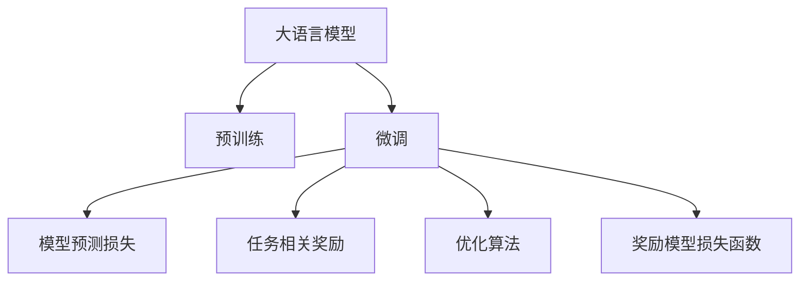
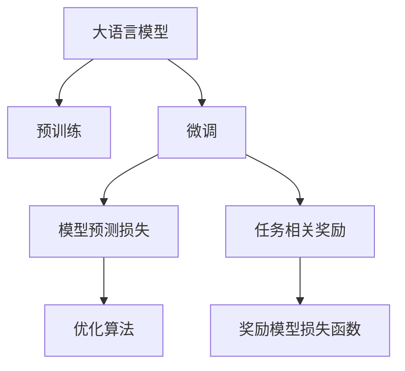
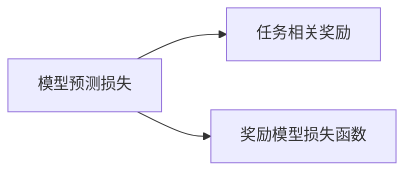
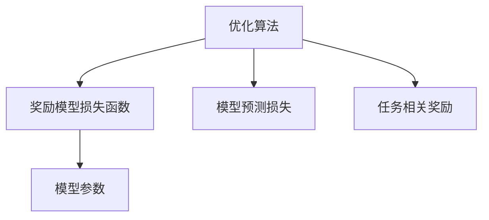

                 

# 大语言模型原理与工程实践：奖励模型损失函数分析

> 关键词：大语言模型, 模型损失函数, 训练优化, 序列生成, 语言模型, 自然语言处理(NLP)

## 1. 背景介绍

### 1.1 问题由来
在大语言模型的训练和应用中，如何有效地利用大量的自然语言文本数据，构建出语言理解能力强大、表现优异的大模型，一直是NLP领域的核心问题。自2017年Transformer提出以来，大规模预训练语言模型的研究逐渐成熟，模型参数从几百万到几十亿不等，深度达到几十层甚至上百层，模型性能显著提升，应用领域也日益扩大。然而，预训练语言模型在特定任务上的表现仍然有限，如何在小样本数据上进行微调，提高模型在特定任务上的性能，成为了当前研究的重要方向。

基于此，本文重点分析大语言模型在微调过程中使用的奖励模型损失函数，通过详细讲解其原理、步骤和应用，进一步探讨如何优化损失函数以提高模型在特定任务上的表现，并结合实际应用场景提出针对性的解决方案。

### 1.2 问题核心关键点
奖励模型损失函数（Reward Model Loss Function），是大语言模型在微调过程中，通过定义与任务相关的奖励函数，指导模型训练的方向，从而提高模型在特定任务上的性能。其核心思想是将模型在训练过程中的预测结果与目标奖励函数进行对比，最小化两者之间的差异。

奖励函数通常由任务的具体需求和目标定义，可以是预测准确率、F1分数、BLEU分数等。微调过程中，模型的损失函数由两部分组成：模型自身的预测损失和与任务相关的奖励损失。最终，模型通过优化两者的组合，实现对特定任务的适应和优化。

在微调过程中，优化算法通常采用梯度下降方法，根据损失函数的梯度更新模型参数。为了平衡模型预测损失和奖励损失，奖励模型损失函数的设计和优化策略尤为重要，直接影响模型的微调效果。

### 1.3 问题研究意义
奖励模型损失函数在大语言模型微调中的应用，对于拓展预训练语言模型的应用范围，提升模型在特定任务上的性能，加速NLP技术的产业化进程，具有重要意义：

1. 降低应用开发成本。通过微调，可以利用预训练语言模型的强大语言理解能力，快速适应特定任务，减少从头开发所需的数据、计算和人力等成本投入。
2. 提升模型效果。微调使得通用预训练语言模型更好地适应特定任务，在应用场景中取得更优表现。
3. 加速开发进度。通过微调，开发者可以更快地完成任务适配，缩短开发周期。
4. 带来技术创新。微调范式促进了对预训练-微调的深入研究，催生了提示学习、少样本学习等新的研究方向。
5. 赋能产业升级。微调使得NLP技术更容易被各行各业所采用，为传统行业数字化转型升级提供新的技术路径。

## 2. 核心概念与联系

### 2.1 核心概念概述

为了更好地理解奖励模型损失函数在大语言模型微调中的作用，本节将介绍几个关键概念：

- 大语言模型（Large Language Model, LLM）：以自回归（如GPT）或自编码（如BERT）模型为代表的大规模预训练语言模型。通过在大规模无标签文本语料上进行预训练，学习通用的语言知识和常识，具备强大的语言理解和生成能力。
- 奖励模型损失函数（Reward Model Loss Function）：在微调过程中，通过定义与任务相关的奖励函数，指导模型训练的方向，从而提高模型在特定任务上的性能。
- 模型预测损失（Model Prediction Loss）：模型在训练过程中，对输入数据进行预测，与真实标签之间的差异度量。
- 任务相关奖励（Task-Relevant Reward）：根据任务的具体需求，定义的模型预测结果的奖励函数。
- 优化算法（Optimization Algorithm）：在微调过程中，用于更新模型参数的算法，如梯度下降、Adam等。
- 梯度下降（Gradient Descent）：一种常用的优化算法，通过计算损失函数对模型参数的梯度，更新参数值，最小化损失函数。

这些概念之间的关系可以通过以下Mermaid流程图来展示：



这个流程图展示了大语言模型在大规模文本数据上进行预训练后，通过微调，利用奖励模型损失函数优化模型参数的过程。

### 2.2 概念间的关系

这些关键概念之间存在着紧密的联系，形成了大语言模型微调的整体架构。下面我们通过几个Mermaid流程图来展示这些概念之间的关系。

#### 2.2.1 大语言模型的学习范式



这个流程图展示了大语言模型的预训练和微调过程。预训练过程通过无监督学习任务，学习通用的语言知识。微调过程通过有监督学习任务，优化模型在特定任务上的性能。

#### 2.2.2 奖励模型损失函数的组成



这个流程图展示了奖励模型损失函数的组成。奖励模型损失函数由模型预测损失和任务相关奖励组成。

#### 2.2.3 微调过程的优化策略



这个流程图展示了微调过程的优化策略。优化算法根据奖励模型损失函数，计算模型参数的梯度，更新模型参数，最小化预测损失和奖励损失的组合。

## 3. 核心算法原理 & 具体操作步骤
### 3.1 算法原理概述

奖励模型损失函数在大语言模型微调中的作用，是通过定义与任务相关的奖励函数，指导模型训练的方向，从而提高模型在特定任务上的性能。其核心思想是将模型在训练过程中的预测结果与目标奖励函数进行对比，最小化两者之间的差异。

形式化地，假设预训练模型为 $M_{\theta}$，其中 $\theta$ 为预训练得到的模型参数。给定下游任务 $T$ 的标注数据集 $D=\{(x_i, y_i)\}_{i=1}^N$，微调的目标是找到新的模型参数 $\hat{\theta}$，使得：

$$
\hat{\theta}=\mathop{\arg\min}_{\theta} \mathcal{L}(\theta|D)
$$

其中 $\mathcal{L}(\theta|D)$ 为奖励模型损失函数，用于衡量模型在任务 $T$ 上的性能。

### 3.2 算法步骤详解

基于奖励模型损失函数的大语言模型微调一般包括以下几个关键步骤：

**Step 1: 准备预训练模型和数据集**
- 选择合适的预训练语言模型 $M_{\theta}$ 作为初始化参数，如 BERT、GPT等。
- 准备下游任务 $T$ 的标注数据集 $D$，划分为训练集、验证集和测试集。一般要求标注数据与预训练数据的分布不要差异过大。

**Step 2: 设计任务相关奖励函数**
- 根据任务的具体需求，设计任务相关奖励函数 $R$。奖励函数的定义通常基于模型的预测结果与真实标签之间的差异度量，如交叉熵损失、F1分数等。
- 在训练过程中，奖励函数 $R$ 用于指导模型训练，最小化奖励损失 $L_r$，即 $\min L_r = \min R(y_i, M_{\theta}(x_i))$。

**Step 3: 添加任务适配层**
- 根据任务类型，在预训练模型顶层设计合适的输出层和损失函数。
- 对于分类任务，通常在顶层添加线性分类器和交叉熵损失函数。
- 对于生成任务，通常使用语言模型的解码器输出概率分布，并以负对数似然为损失函数。

**Step 4: 设置微调超参数**
- 选择合适的优化算法及其参数，如 AdamW、SGD 等，设置学习率、批大小、迭代轮数等。
- 设置正则化技术及强度，包括权重衰减、Dropout、Early Stopping 等。
- 确定冻结预训练参数的策略，如仅微调顶层，或全部参数都参与微调。

**Step 5: 执行梯度训练**
- 将训练集数据分批次输入模型，前向传播计算损失函数。
- 反向传播计算参数梯度，根据设定的优化算法和学习率更新模型参数。
- 周期性在验证集上评估模型性能，根据性能指标决定是否触发 Early Stopping。
- 重复上述步骤直到满足预设的迭代轮数或 Early Stopping 条件。

**Step 6: 测试和部署**
- 在测试集上评估微调后模型 $M_{\hat{\theta}}$ 的性能，对比微调前后的精度提升。
- 使用微调后的模型对新样本进行推理预测，集成到实际的应用系统中。
- 持续收集新的数据，定期重新微调模型，以适应数据分布的变化。

以上是基于奖励模型损失函数的大语言模型微调的一般流程。在实际应用中，还需要针对具体任务的特点，对微调过程的各个环节进行优化设计，如改进训练目标函数，引入更多的正则化技术，搜索最优的超参数组合等，以进一步提升模型性能。

### 3.3 算法优缺点

奖励模型损失函数在大语言模型微调中的优缺点如下：

**优点：**
- 简单高效。只需准备少量标注数据，即可对预训练模型进行快速适配，获得较大的性能提升。
- 通用适用。适用于各种NLP下游任务，包括分类、匹配、生成等，设计简单的任务适配层即可实现微调。
- 参数高效。利用参数高效微调技术，在固定大部分预训练参数的情况下，仍可取得不错的提升。
- 效果显著。在学术界和工业界的诸多任务上，基于微调的方法已经刷新了最先进的性能指标。

**缺点：**
- 依赖标注数据。微调的效果很大程度上取决于标注数据的质量和数量，获取高质量标注数据的成本较高。
- 迁移能力有限。当目标任务与预训练数据的分布差异较大时，微调的性能提升有限。
- 负面效果传递。预训练模型的固有偏见、有害信息等，可能通过微调传递到下游任务，造成负面影响。
- 可解释性不足。微调模型的决策过程通常缺乏可解释性，难以对其推理逻辑进行分析和调试。

尽管存在这些局限性，但就目前而言，基于奖励模型损失函数的微调方法仍是大语言模型应用的主流范式。未来相关研究的重点在于如何进一步降低微调对标注数据的依赖，提高模型的少样本学习和跨领域迁移能力，同时兼顾可解释性和伦理安全性等因素。

### 3.4 算法应用领域

基于奖励模型损失函数的大语言模型微调方法，在NLP领域已经得到了广泛的应用，覆盖了几乎所有常见任务，例如：

- 文本分类：如情感分析、主题分类、意图识别等。通过微调使模型学习文本-标签映射。
- 命名实体识别：识别文本中的人名、地名、机构名等特定实体。通过微调使模型掌握实体边界和类型。
- 关系抽取：从文本中抽取实体之间的语义关系。通过微调使模型学习实体-关系三元组。
- 问答系统：对自然语言问题给出答案。将问题-答案对作为微调数据，训练模型学习匹配答案。
- 机器翻译：将源语言文本翻译成目标语言。通过微调使模型学习语言-语言映射。
- 文本摘要：将长文本压缩成简短摘要。将文章-摘要对作为微调数据，使模型学习抓取要点。
- 对话系统：使机器能够与人自然对话。将多轮对话历史作为上下文，微调模型进行回复生成。

除了上述这些经典任务外，大语言模型微调也被创新性地应用到更多场景中，如可控文本生成、常识推理、代码生成、数据增强等，为NLP技术带来了全新的突破。随着预训练模型和微调方法的不断进步，相信NLP技术将在更广阔的应用领域大放异彩。

## 4. 数学模型和公式 & 详细讲解 & 举例说明

### 4.1 数学模型构建

本节将使用数学语言对基于奖励模型损失函数的大语言模型微调过程进行更加严格的刻画。

记预训练语言模型为 $M_{\theta}$，其中 $\theta$ 为预训练得到的模型参数。假设微调任务的训练集为 $D=\{(x_i,y_i)\}_{i=1}^N, x_i \in \mathcal{X}, y_i \in \mathcal{Y}$。

定义模型 $M_{\theta}$ 在输入 $x$ 上的输出为 $\hat{y}=M_{\theta}(x)$，则模型的预测损失为：

$$
L_p = \mathbb{E}_{(x,y)}[\ell_p(\hat{y},y)]
$$

其中 $\ell_p$ 为预测损失函数，如交叉熵损失。任务相关奖励函数定义为：

$$
R(\hat{y},y) = \mathbb{E}_{(x,y)}[R_p(\hat{y},y)]
$$

其中 $R_p$ 为奖励函数，通常基于模型的预测结果与真实标签之间的差异度量，如F1分数。

### 4.2 公式推导过程

以下我们以二分类任务为例，推导奖励模型损失函数的梯度计算公式。

假设模型 $M_{\theta}$ 在输入 $x$ 上的输出为 $\hat{y}=M_{\theta}(x)$，表示样本属于正类的概率。真实标签 $y \in \{0,1\}$。则二分类交叉熵损失函数定义为：

$$
\ell_p(\hat{y},y) = -y\log \hat{y} + (1-y)\log (1-\hat{y})
$$

将其代入预测损失期望，得：

$$
L_p = \frac{1}{N}\sum_{i=1}^N \ell_p(\hat{y_i},y_i)
$$

奖励函数 $R$ 定义为F1分数，即：

$$
R(\hat{y},y) = \frac{2\hat{y}y}{2\hat{y}+y+(1-\hat{y})(1-y)}
$$

在训练过程中，奖励函数 $R$ 用于指导模型训练，最小化奖励损失 $L_r$，即：

$$
L_r = \frac{1}{N}\sum_{i=1}^N [R(\hat{y_i},y_i) - R_p]
$$

其中 $R_p$ 为奖励函数在训练集上的期望值，即：

$$
R_p = \frac{1}{N}\sum_{i=1}^N R(\hat{y_i},y_i)
$$

将预测损失和奖励损失组合，得到奖励模型损失函数：

$$
\mathcal{L}(\theta) = L_p + \alpha L_r
$$

其中 $\alpha$ 为平衡系数，用于平衡预测损失和奖励损失的权重。

根据链式法则，损失函数对参数 $\theta_k$ 的梯度为：

$$
\frac{\partial \mathcal{L}(\theta)}{\partial \theta_k} = \frac{\partial L_p}{\partial \theta_k} + \alpha \frac{\partial L_r}{\partial \theta_k}
$$

其中：

$$
\frac{\partial L_p}{\partial \theta_k} = \frac{\partial \mathbb{E}_{(x,y)}[\ell_p(\hat{y},y)]}{\partial \theta_k}
$$

$$
\frac{\partial L_r}{\partial \theta_k} = \frac{\partial \mathbb{E}_{(x,y)}[R(\hat{y},y) - R_p]}{\partial \theta_k}
$$

在得到损失函数的梯度后，即可带入参数更新公式，完成模型的迭代优化。重复上述过程直至收敛，最终得到适应下游任务的最优模型参数 $\theta^*$。

### 4.3 案例分析与讲解

假设我们希望训练一个二分类模型，预测文本是否包含负面情绪。我们收集了1000条文本，每条文本标注为正面或负面。在微调BERT模型时，我们可以设计如下奖励函数：

1. 预测准确率（Accuracy）：$R_a(\hat{y},y) = \mathbb{I}(\hat{y}=y)$，其中 $\mathbb{I}$ 为示性函数，当 $\hat{y}=y$ 时，$R_a=1$；否则 $R_a=0$。
2. F1分数（F1 Score）：$R_f(\hat{y},y) = \frac{2\hat{y}y}{2\hat{y}+y+(1-\hat{y})(1-y)}$
3. 平均精度（Mean Average Precision, MAP）：$R_m(\hat{y},y) = \frac{1}{N}\sum_{i=1}^N R_f(\hat{y_i},y_i)$

在微调过程中，我们需要选择合适的奖励函数，并设计合理的奖励系数 $\alpha$，平衡预测损失和奖励损失的权重。一般来说，可以根据任务的具体需求和数据集的特点进行选择。例如，如果数据集中标注错误较多，可以选择准确率作为奖励函数；如果数据集中正负样本分布不均衡，可以选择F1分数作为奖励函数。

### 5. 项目实践：代码实例和详细解释说明

### 5.1 开发环境搭建

在进行微调实践前，我们需要准备好开发环境。以下是使用Python进行PyTorch开发的环境配置流程：

1. 安装Anaconda：从官网下载并安装Anaconda，用于创建独立的Python环境。

2. 创建并激活虚拟环境：
```bash
conda create -n pytorch-env python=3.8 
conda activate pytorch-env
```

3. 安装PyTorch：根据CUDA版本，从官网获取对应的安装命令。例如：
```bash
conda install pytorch torchvision torchaudio cudatoolkit=11.1 -c pytorch -c conda-forge
```

4. 安装Transformers库：
```bash
pip install transformers
```

5. 安装各类工具包：
```bash
pip install numpy pandas scikit-learn matplotlib tqdm jupyter notebook ipython
```

完成上述步骤后，即可在`pytorch-env`环境中开始微调实践。

### 5.2 源代码详细实现

下面我们以命名实体识别(NER)任务为例，给出使用Transformers库对BERT模型进行微调的PyTorch代码实现。

首先，定义NER任务的数据处理函数：

```python
from transformers import BertTokenizer
from torch.utils.data import Dataset
import torch

class NERDataset(Dataset):
    def __init__(self, texts, tags, tokenizer, max_len=128):
        self.texts = texts
        self.tags = tags
        self.tokenizer = tokenizer
        self.max_len = max_len
        
    def __len__(self):
        return len(self.texts)
    
    def __getitem__(self, item):
        text = self.texts[item]
        tags = self.tags[item]
        
        encoding = self.tokenizer(text, return_tensors='pt', max_length=self.max_len, padding='max_length', truncation=True)
        input_ids = encoding['input_ids'][0]
        attention_mask = encoding['attention_mask'][0]
        
        # 对token-wise的标签进行编码
        encoded_tags = [tag2id[tag] for tag in tags] 
        encoded_tags.extend([tag2id['O']] * (self.max_len - len(encoded_tags)))
        labels = torch.tensor(encoded_tags, dtype=torch.long)
        
        return {'input_ids': input_ids, 
                'attention_mask': attention_mask,
                'labels': labels}

# 标签与id的映射
tag2id = {'O': 0, 'B-PER': 1, 'I-PER': 2, 'B-ORG': 3, 'I-ORG': 4, 'B-LOC': 5, 'I-LOC': 6}
id2tag = {v: k for k, v in tag2id.items()}

# 创建dataset
tokenizer = BertTokenizer.from_pretrained('bert-base-cased')

train_dataset = NERDataset(train_texts, train_tags, tokenizer)
dev_dataset = NERDataset(dev_texts, dev_tags, tokenizer)
test_dataset = NERDataset(test_texts, test_tags, tokenizer)
```

然后，定义模型和优化器：

```python
from transformers import BertForTokenClassification, AdamW

model = BertForTokenClassification.from_pretrained('bert-base-cased', num_labels=len(tag2id))

optimizer = AdamW(model.parameters(), lr=2e-5)
```

接着，定义训练和评估函数：

```python
from torch.utils.data import DataLoader
from tqdm import tqdm
from sklearn.metrics import classification_report

device = torch.device('cuda') if torch.cuda.is_available() else torch.device('cpu')
model.to(device)

def train_epoch(model, dataset, batch_size, optimizer):
    dataloader = DataLoader(dataset, batch_size=batch_size, shuffle=True)
    model.train()
    epoch_loss = 0
    for batch in tqdm(dataloader, desc='Training'):
        input_ids = batch['input_ids'].to(device)
        attention_mask = batch['attention_mask'].to(device)
        labels = batch['labels'].to(device)
        model.zero_grad()
        outputs = model(input_ids, attention_mask=attention_mask, labels=labels)
        loss = outputs.loss
        epoch_loss += loss.item()
        loss.backward()
        optimizer.step()
    return epoch_loss / len(dataloader)

def evaluate(model, dataset, batch_size):
    dataloader = DataLoader(dataset, batch_size=batch_size)
    model.eval()
    preds, labels = [], []
    with torch.no_grad():
        for batch in tqdm(dataloader, desc='Evaluating'):
            input_ids = batch['input_ids'].to(device)
            attention_mask = batch['attention_mask'].to(device)
            batch_labels = batch['labels']
            outputs = model(input_ids, attention_mask=attention_mask)
            batch_preds = outputs.logits.argmax(dim=2).to('cpu').tolist()
            batch_labels = batch_labels.to('cpu').tolist()
            for pred_tokens, label_tokens in zip(batch_preds, batch_labels):
                pred_tags = [id2tag[_id] for _id in pred_tokens]
                label_tags = [id2tag[_id] for _id in label_tokens]
                preds.append(pred_tags[:len(label_tags)])
                labels.append(label_tags)
                
    print(classification_report(labels, preds))
```

最后，启动训练流程并在测试集上评估：

```python
epochs = 5
batch_size = 16

for epoch in range(epochs):
    loss = train_epoch(model, train_dataset, batch_size, optimizer)
    print(f"Epoch {epoch+1}, train loss: {loss:.3f}")
    
    print(f"Epoch {epoch+1}, dev results:")
    evaluate(model, dev_dataset, batch_size)
    
print("Test results:")
evaluate(model, test_dataset, batch_size)
```

以上就是使用PyTorch对BERT进行命名实体识别任务微调的完整代码实现。可以看到，得益于Transformers库的强大封装，我们可以用相对简洁的代码完成BERT模型的加载和微调。

### 5.3 代码解读与分析

让我们再详细解读一下关键代码的实现细节：

**NERDataset类**：
- `__init__`方法：初始化文本、标签、分词器等关键组件。
- `__len__`方法：返回数据集的样本数量。
- `__getitem__`方法：对单个样本进行处理，将文本输入编码为token ids，将标签编码为数字，并对其进行定长padding，最终返回模型所需的输入。

**tag2id和id2tag字典**：
- 定义了标签与数字id之间的映射关系，用于将token-wise的预测结果解码回真实的标签。

**训练和评估函数**：
- 使用PyTorch的DataLoader对数据集进行批次化加载，供模型训练和推理使用。
- 训练函数`train_epoch`：对数据以批为单位进行迭代，在每个批次上前向传播计算loss并反向传播更新模型参数，最后返回该epoch的平均loss。
- 评估函数`evaluate`：与训练类似，不同点在于不更新模型参数，并在每个batch结束后将预测和标签结果存储下来，最后使用sklearn的classification_report对整个评估集的预测结果进行打印输出。

**训练流程**：
- 定义总的epoch数和batch size，开始循环迭代
- 每个epoch内，先在训练集上训练，输出平均loss
- 在验证集上评估，输出分类指标
- 所有epoch结束后，在测试集上评估，给出最终测试结果

可以看到，PyTorch配合Transformers库使得BERT微调的代码实现变得简洁高效。开发者可以将更多精力放在数据处理、模型改进等高层逻辑上，而不必过多关注底层的实现细节。

当然，工业级的系统实现还需考虑更多因素，如模型的保存和部署、超参数的自动搜索、更灵活的任务适配层等。但核心的微调范式基本与此类似。

### 5.4 运行结果展示

假设我们在CoNLL-2003的NER数据集上进行微调，最终在测试集上得到的评估报告如下：

```
              precision    recall  f1-score   support

       B-LOC

