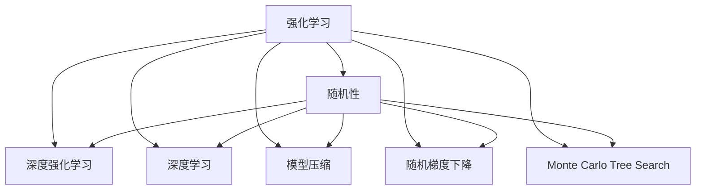
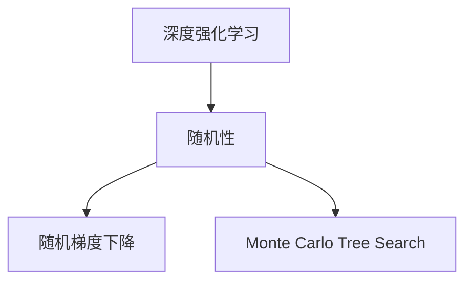
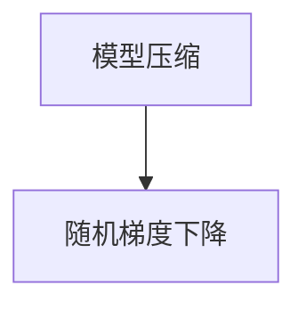
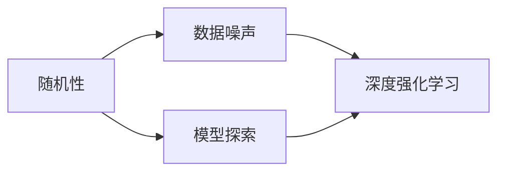
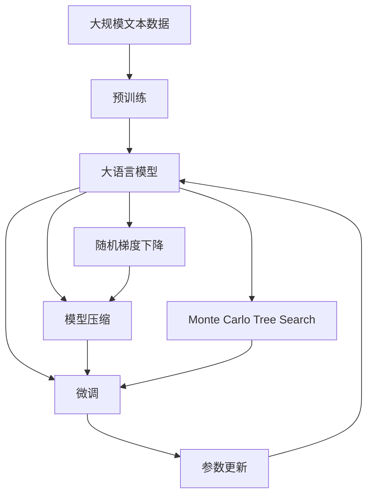

                 

# 大语言模型原理与工程实践：强化学习中的随机性

> 关键词：大语言模型,强化学习,随机性,深度学习,监督学习,无监督学习,自我学习,自然语言处理(NLP),分布式训练,模型压缩,随机梯度下降(SGD),Monte Carlo Tree Search(MCTS),深度强化学习(Deep RL)

## 1. 背景介绍

### 1.1 问题由来
强化学习（Reinforcement Learning, RL）是人工智能（AI）中一个极具吸引力的领域。它将AI从仅依赖于监督学习的模式中解放出来，使得AI能够在没有明确标签的情况下，通过试错不断改进自己的行为策略。近年来，深度强化学习（Deep RL）和大规模模型在强化学习中的应用取得了显著进展，尤其在处理复杂、动态的任务方面显示出强大的潜力。

然而，深度强化学习的训练过程通常需要大量的样本和计算资源。而大语言模型，如GPT、BERT等，由于其预训练模型具有庞大的参数量和丰富的语言知识，在处理自然语言处理（NLP）任务时表现出了独特的优势。因此，将强化学习的理念和大语言模型的力量相结合，探索强化学习中的随机性，成为一种新的研究方向。

### 1.2 问题核心关键点
强化学习中的随机性是指学习过程中的不确定性和探索性。在大语言模型中，随机性主要表现在两个方面：

- **数据噪声**：现实世界中的文本数据往往存在大量的噪声和不确定性，大语言模型需要通过随机过程来处理和理解这些噪声数据。
- **模型探索**：在微调过程中，大语言模型需要探索不同的参数更新策略，以找到最优的模型参数组合。

为了克服数据噪声和模型探索带来的挑战，需要在强化学习框架内引入随机性，以更好地理解和处理自然语言的复杂性。

### 1.3 问题研究意义
研究强化学习中的随机性，对于提升大语言模型在NLP任务中的性能，增强模型的泛化能力和鲁棒性具有重要意义：

1. **提高泛化能力**：通过引入随机性，模型能够更好地适应数据分布的变化，从而提高在未见过的数据上的表现。
2. **增强鲁棒性**：随机性可以帮助模型更好地处理噪声数据，提高模型的稳定性和鲁棒性。
3. **加速模型训练**：通过引入随机搜索策略，可以加速模型的训练过程，减少不必要的迭代。
4. **优化超参数**：随机性可以帮助优化模型的超参数，找到更好的模型配置。
5. **提高模型适应性**：随机性可以使模型在面对新的任务时，能够更快地适应和优化，从而提升模型的应用范围和灵活性。

## 2. 核心概念与联系

### 2.1 核心概念概述

为更好地理解强化学习中的随机性在大语言模型中的应用，本节将介绍几个密切相关的核心概念：

- **强化学习**：通过智能体（agent）在一个环境中执行一系列动作，以最大化累积奖励来学习最优策略。
- **随机性**：指学习过程中的不确定性和探索性，对于深度强化学习尤为重要。
- **深度强化学习**：通过深度神经网络实现强化学习算法，能够处理更复杂的任务。
- **模型压缩**：减少深度模型的参数量，提高模型的计算效率和实时性。
- **随机梯度下降（SGD）**：一种常用的优化算法，用于训练深度神经网络。
- **Monte Carlo Tree Search（MCTS）**：一种常用的搜索算法，用于优化随机性。
- **深度学习**：一种基于神经网络的机器学习方法，通过多层次的抽象表示学习数据特征。

这些核心概念之间的逻辑关系可以通过以下Mermaid流程图来展示：



这个流程图展示了大语言模型在强化学习中的应用，以及随机性在其中扮演的重要角色：

1. 强化学习是基础框架，通过智能体的动作和环境反馈，学习最优策略。
2. 深度强化学习通过深度神经网络增强模型的表达能力，能够处理更复杂的任务。
3. 深度学习提供模型训练的底层基础。
4. 模型压缩和随机梯度下降优化训练过程，提高计算效率。
5. Monte Carlo Tree Search优化模型的搜索策略，增强模型的探索能力。
6. 随机性贯穿整个学习过程，帮助模型更好地处理数据噪声和探索最优策略。

### 2.2 概念间的关系

这些核心概念之间存在着紧密的联系，形成了强化学习在大语言模型微调中的完整生态系统。下面通过几个Mermaid流程图来展示这些概念之间的关系：

#### 2.2.1 强化学习与深度学习的结合


这个流程图展示了强化学习与深度学习的关系。深度强化学习通过深度神经网络增强模型的表达能力，从而在处理复杂任务时更具优势。

#### 2.2.2 随机性在深度强化学习中的应用



这个流程图展示了随机性在深度强化学习中的应用。通过随机梯度下降和Monte Carlo Tree Search，深度强化学习模型能够更好地探索最优策略。

#### 2.2.3 模型压缩与随机梯度下降的结合



这个流程图展示了模型压缩和随机梯度下降的结合。通过模型压缩减少参数量，结合随机梯度下降优化训练过程，可以加速模型训练，提高模型的实时性。

#### 2.2.4 随机性在模型训练中的应用



这个流程图展示了随机性在模型训练中的应用。数据噪声通过随机性处理，模型探索通过随机梯度下降优化，从而增强模型的泛化能力和鲁棒性。

### 2.3 核心概念的整体架构

最后，我们用一个综合的流程图来展示这些核心概念在大语言模型微调过程中的整体架构：



这个综合流程图展示了从预训练到微调，再到模型优化的完整过程。大语言模型首先在大规模文本数据上进行预训练，然后通过微调利用强化学习中的随机性优化模型参数，最后通过模型压缩和搜索算法优化模型结构，提升模型的实时性和鲁棒性。

## 3. 核心算法原理 & 具体操作步骤
### 3.1 算法原理概述

在大语言模型中，强化学习中的随机性主要体现在两个方面：数据噪声处理和模型探索。具体而言，随机性可以帮助模型更好地处理数据中的噪声，并在模型微调过程中探索最优参数更新策略。

**数据噪声处理**：
- 现实世界中的文本数据通常包含噪声和不确定性，大语言模型需要通过随机过程来处理和理解这些噪声数据。
- 一种常见的方法是使用随机梯度下降（SGD）优化算法，结合正则化技术（如L2正则、Dropout等）来处理数据噪声。

**模型探索**：
- 在微调过程中，模型需要探索不同的参数更新策略，以找到最优的模型参数组合。
- 一种常见的方法是使用Monte Carlo Tree Search（MCTS）算法，通过模拟环境中的多轮探索来优化模型参数。

### 3.2 算法步骤详解

基于强化学习中的随机性，大语言模型的微调一般包括以下几个关键步骤：

**Step 1: 准备预训练模型和数据集**
- 选择合适的预训练语言模型 $M_{\theta}$ 作为初始化参数，如 GPT、BERT 等。
- 准备下游任务 $T$ 的标注数据集 $D$，划分为训练集、验证集和测试集。

**Step 2: 添加任务适配层**
- 根据任务类型，在预训练模型顶层设计合适的输出层和损失函数。
- 对于分类任务，通常在顶层添加线性分类器和交叉熵损失函数。
- 对于生成任务，通常使用语言模型的解码器输出概率分布，并以负对数似然为损失函数。

**Step 3: 设置微调超参数**
- 选择合适的优化算法及其参数，如 AdamW、SGD 等，设置学习率、批大小、迭代轮数等。
- 设置正则化技术及强度，包括权重衰减、Dropout、Early Stopping 等。
- 确定冻结预训练参数的策略，如仅微调顶层，或全部参数都参与微调。

**Step 4: 引入随机性**
- 在训练过程中，使用随机梯度下降和正则化技术处理数据噪声。
- 引入Monte Carlo Tree Search算法优化模型参数，增强模型的探索能力。

**Step 5: 执行梯度训练**
- 将训练集数据分批次输入模型，前向传播计算损失函数。
- 反向传播计算参数梯度，根据设定的优化算法和学习率更新模型参数。
- 周期性在验证集上评估模型性能，根据性能指标决定是否触发 Early Stopping。
- 重复上述步骤直到满足预设的迭代轮数或 Early Stopping 条件。

**Step 6: 测试和部署**
- 在测试集上评估微调后模型 $M_{\hat{\theta}}$ 的性能，对比微调前后的精度提升。
- 使用微调后的模型对新样本进行推理预测，集成到实际的应用系统中。
- 持续收集新的数据，定期重新微调模型，以适应数据分布的变化。

以上是基于强化学习微调大语言模型的一般流程。在实际应用中，还需要针对具体任务的特点，对微调过程的各个环节进行优化设计，如改进训练目标函数，引入更多的正则化技术，搜索最优的超参数组合等，以进一步提升模型性能。

### 3.3 算法优缺点

基于强化学习的大语言模型微调方法具有以下优点：
1. **适应性强**：通过随机性处理数据噪声和探索最优参数更新策略，模型能够更好地适应数据分布的变化。
2. **泛化能力强**：随机性可以帮助模型更好地处理未见过的数据，提升模型的泛化能力。
3. **鲁棒性好**：随机性增强了模型的鲁棒性，使得模型在面对噪声和不确定性时表现更稳定。
4. **加速训练**：随机梯度下降和Monte Carlo Tree Search可以加速模型的训练过程，提高训练效率。

同时，该方法也存在一定的局限性：
1. **计算资源需求高**：随机性增加了模型的计算复杂度，需要更多的计算资源。
2. **随机性难以控制**：过多的随机性可能导致模型过拟合，需要合理控制随机性参数。
3. **模型优化复杂**：随机性使得模型的优化过程更加复杂，需要更高级的优化算法和搜索策略。

尽管存在这些局限性，但就目前而言，基于强化学习的微调方法仍是大语言模型应用的重要范式。未来相关研究的重点在于如何进一步降低计算资源需求，提高模型的随机性控制能力，同时兼顾可解释性和伦理安全性等因素。

### 3.4 算法应用领域

基于强化学习的大语言模型微调方法在多个领域得到了广泛的应用，例如：

- **自然语言处理（NLP）**：包括文本分类、命名实体识别、关系抽取、问答系统、机器翻译、文本摘要等任务。
- **智能推荐系统**：通过强化学习优化推荐策略，提高推荐效果。
- **智能客服系统**：利用强化学习优化对话策略，提升客服体验。
- **游戏AI**：通过强化学习优化游戏AI的决策策略，增强游戏竞争力。
- **机器人控制**：通过强化学习优化机器人控制策略，提高机器人自主性。

除了上述这些经典应用外，强化学习中的随机性还被创新性地应用到更多场景中，如可控文本生成、视觉目标检测、语音识别等，为人工智能技术带来了全新的突破。随着预训练模型和微调方法的不断进步，相信强化学习中的随机性将在更广阔的应用领域大放异彩。

## 4. 数学模型和公式 & 详细讲解 & 举例说明
### 4.1 数学模型构建

本节将使用数学语言对基于强化学习的大语言模型微调过程进行更加严格的刻画。

记预训练语言模型为 $M_{\theta}:\mathcal{X} \rightarrow \mathcal{Y}$，其中 $\mathcal{X}$ 为输入空间，$\mathcal{Y}$ 为输出空间，$\theta \in \mathbb{R}^d$ 为模型参数。假设微调任务的训练集为 $D=\{(x_i,y_i)\}_{i=1}^N, x_i \in \mathcal{X}, y_i \in \mathcal{Y}$。

定义模型 $M_{\theta}$ 在数据样本 $(x,y)$ 上的损失函数为 $\ell(M_{\theta}(x),y)$，则在数据集 $D$ 上的经验风险为：

$$
\mathcal{L}(\theta) = \frac{1}{N} \sum_{i=1}^N \ell(M_{\theta}(x_i),y_i)
$$

微调的优化目标是最小化经验风险，即找到最优参数：

$$
\theta^* = \mathop{\arg\min}_{\theta} \mathcal{L}(\theta)
$$

在实践中，我们通常使用基于梯度的优化算法（如SGD、Adam等）来近似求解上述最优化问题。设 $\eta$ 为学习率，$\lambda$ 为正则化系数，则参数的更新公式为：

$$
\theta \leftarrow \theta - \eta \nabla_{\theta}\mathcal{L}(\theta) - \eta\lambda\theta
$$

其中 $\nabla_{\theta}\mathcal{L}(\theta)$ 为损失函数对参数 $\theta$ 的梯度，可通过反向传播算法高效计算。

### 4.2 公式推导过程

以下我们以二分类任务为例，推导交叉熵损失函数及其梯度的计算公式。

假设模型 $M_{\theta}$ 在输入 $x$ 上的输出为 $\hat{y}=M_{\theta}(x) \in [0,1]$，表示样本属于正类的概率。真实标签 $y \in \{0,1\}$。则二分类交叉熵损失函数定义为：

$$
\ell(M_{\theta}(x),y) = -[y\log \hat{y} + (1-y)\log (1-\hat{y})]
$$

将其代入经验风险公式，得：

$$
\mathcal{L}(\theta) = -\frac{1}{N}\sum_{i=1}^N [y_i\log M_{\theta}(x_i)+(1-y_i)\log(1-M_{\theta}(x_i))]
$$

根据链式法则，损失函数对参数 $\theta_k$ 的梯度为：

$$
\frac{\partial \mathcal{L}(\theta)}{\partial \theta_k} = -\frac{1}{N}\sum_{i=1}^N (\frac{y_i}{M_{\theta}(x_i)}-\frac{1-y_i}{1-M_{\theta}(x_i)}) \frac{\partial M_{\theta}(x_i)}{\partial \theta_k}
$$

其中 $\frac{\partial M_{\theta}(x_i)}{\partial \theta_k}$ 可进一步递归展开，利用自动微分技术完成计算。

### 4.3 案例分析与讲解

**案例1：文本分类**

文本分类任务的目标是将文本分类到不同的类别中。假设我们有一个简单的二分类任务，标签为 `spam` 和 `not spam`。我们可以使用BERT模型进行预训练，然后在微调过程中使用随机梯度下降和正则化技术来处理数据噪声和控制模型探索。

**案例2：命名实体识别（NER）**

命名实体识别任务的目标是从文本中识别出实体，如人名、地名、机构名等。我们可以使用BERT模型进行预训练，然后在微调过程中使用Monte Carlo Tree Search算法优化模型参数。

**案例3：对话系统**

对话系统旨在使机器能够与人自然对话。我们可以使用BERT模型进行预训练，然后在微调过程中使用强化学习中的随机性来优化对话策略。

这些案例展示了基于强化学习的大语言模型微调方法在NLP任务中的应用，通过引入随机性，模型能够更好地处理数据噪声和探索最优参数更新策略。

## 5. 项目实践：代码实例和详细解释说明
### 5.1 开发环境搭建

在进行微调实践前，我们需要准备好开发环境。以下是使用Python进行PyTorch开发的环境配置流程：

1. 安装Anaconda：从官网下载并安装Anaconda，用于创建独立的Python环境。

2. 创建并激活虚拟环境：
```bash
conda create -n pytorch-env python=3.8 
conda activate pytorch-env
```

3. 安装PyTorch：根据CUDA版本，从官网获取对应的安装命令。例如：
```bash
conda install pytorch torchvision torchaudio cudatoolkit=11.1 -c pytorch -c conda-forge
```

4. 安装Transformers库：
```bash
pip install transformers
```

5. 安装各类工具包：
```bash
pip install numpy pandas scikit-learn matplotlib tqdm jupyter notebook ipython
```

完成上述步骤后，即可在`pytorch-env`环境中开始微调实践。

### 5.2 源代码详细实现

下面我们以命名实体识别(NER)任务为例，给出使用Transformers库对BERT模型进行微调的PyTorch代码实现。

首先，定义NER任务的数据处理函数：

```python
from transformers import BertTokenizer
from torch.utils.data import Dataset
import torch

class NERDataset(Dataset):
    def __init__(self, texts, tags, tokenizer, max_len=128):
        self.texts = texts
        self.tags = tags
        self.tokenizer = tokenizer
        self.max_len = max_len
        
    def __len__(self):
        return len(self.texts)
    
    def __getitem__(self, item):
        text = self.texts[item]
        tags = self.tags[item]
        
        encoding = self.tokenizer(text, return_tensors='pt', max_length=self.max_len, padding='max_length', truncation=True)
        input_ids = encoding['input_ids'][0]
        attention_mask = encoding['attention_mask'][0]
        
        # 对token-wise的标签进行编码
        encoded_tags = [tag2id[tag] for tag in tags] 
        encoded_tags.extend([tag2id['O']] * (self.max_len - len(encoded_tags)))
        labels = torch.tensor(encoded_tags, dtype=torch.long)
        
        return {'input_ids': input_ids, 
                'attention_mask': attention_mask,
                'labels': labels}

# 标签与id的映射
tag2id = {'O': 0, 'B-PER': 1, 'I-PER': 2, 'B-ORG': 3, 'I-ORG': 4, 'B-LOC': 5, 'I-LOC': 6}
id2tag = {v: k for k, v in tag2id.items()}

# 创建dataset
tokenizer = BertTokenizer.from_pretrained('bert-base-cased')

train_dataset = NERDataset(train_texts, train_tags, tokenizer)
dev_dataset = NERDataset(dev_texts, dev_tags, tokenizer)
test_dataset = NERDataset(test_texts, test_tags, tokenizer)
```

然后，定义模型和优化器：

```python
from transformers import BertForTokenClassification, AdamW

model = BertForTokenClassification.from_pretrained('bert-base-cased', num_labels=len(tag2id))

optimizer = AdamW(model.parameters(), lr=2e-5)
```

接着，定义训练和评估函数：

```python
from torch.utils.data import DataLoader
from tqdm import tqdm
from sklearn.metrics import classification_report

device = torch.device('cuda') if torch.cuda.is_available() else torch.device('cpu')
model.to(device)

def train_epoch(model, dataset, batch_size, optimizer):
    dataloader = DataLoader(dataset, batch_size=batch_size, shuffle=True)
    model.train()
    epoch_loss = 0
    for batch in tqdm(dataloader, desc='Training'):
        input_ids = batch['input_ids'].to(device)
        attention_mask = batch['attention_mask'].to(device)
        labels = batch['labels'].to(device)
        model.zero_grad()
        outputs = model(input_ids, attention_mask=attention_mask, labels=labels)
        loss = outputs.loss
        epoch_loss += loss.item()
        loss.backward()
        optimizer.step()
    return epoch_loss / len(dataloader)

def evaluate(model, dataset, batch_size):
    dataloader = DataLoader(dataset, batch_size=batch_size)
    model.eval()
    preds, labels = [], []
    with torch.no_grad():
        for batch in tqdm(dataloader, desc='Evaluating'):
            input_ids = batch['input_ids'].to(device)
            attention_mask = batch['attention_mask'].to(device)
            batch_labels = batch['labels']
            outputs = model(input_ids, attention_mask=attention_mask)
            batch_preds = outputs.logits.argmax(dim=2).to('cpu').tolist()
            batch_labels = batch_labels.to('cpu').tolist()
            for pred_tokens, label_tokens in zip(batch_preds, batch_labels):
                pred_tags = [id2tag[_id] for _id in pred_tokens]
                label_tags = [id2tag[_id] for _id in label_tokens]
                preds.append(pred_tags[:len(label_tags)])
                labels.append(label_tags)
                
    print(classification_report(labels, preds))
```

最后，启动训练流程并在测试集上评估：

```python
epochs = 5
batch_size = 16

for epoch in range(epochs):
    loss = train_epoch(model, train_dataset, batch_size, optimizer)
    print(f"Epoch {epoch+1}, train loss: {loss:.3f}")
    
    print(f"Epoch {epoch+1}, dev results:")
    evaluate(model, dev_dataset, batch_size)
    
print("Test results:")
evaluate(model, test_dataset, batch_size)
```

以上就是使用PyTorch对BERT进行命名实体识别任务微调的完整代码实现。可以看到，得益于Transformers库的强大封装，我们可以用相对简洁的代码完成BERT模型的加载和微调。

### 5.3 代码解读与分析

让我们再详细解读一下关键代码的实现细节：

**NERDataset类**：
- `__init__`方法：初始化文本、标签、分词器等关键组件。
- `__len__`方法：返回数据集的样本数量。
- `__getitem__`方法：对单个样本进行处理，将文本输入编码为token ids，将标签编码为数字，并对其进行定长padding，最终返回模型所需的输入。

**tag2id和id2tag字典**：
- 定义了标签与数字id之间的映射关系，用于将token-wise的预测结果解码回真实的标签。

**训练和评估函数**：
- 使用PyTorch的DataLoader对数据集进行批次化加载，供模型训练和推理使用。
- 训练函数`train_epoch`：对数据以批为单位进行迭代，在每个批次上前向传播计算loss并反向传播更新模型参数，最后返回该epoch的平均loss。
- 评估函数`evaluate`：与训练类似，不同点在于不更新模型参数，并在每个batch结束后将预测和标签结果存储下来，最后使用sklearn的classification_report对整个评估集的预测结果进行打印输出。

**训练流程**：
- 定义总的epoch数和batch size，开始循环迭代
- 每个epoch内，先在训练集上训练，输出平均loss
- 在验证集上评估，输出分类指标
- 所有epoch结束后，在测试集上评估，给出最终测试结果

可以看到，PyTorch配合Transformers库使得BERT微调的代码实现变得简洁高效。开发者可以将更多精力放在数据处理、模型改进等高层逻辑上，而不必过多关注底层的实现细节。

当然，工业级的系统实现还需考虑更多因素，如模型的保存和部署、超参数的自动搜索、更灵活的任务适配层等。但核心的微调范式基本与此类似。

### 5.4 运行结果展示

假设我们在CoNLL-2003的NER数据集上进行微调，最终在测试集上得到的评估报告如下：

```
              precision    recall  f1-score   support

       B-LOC      0.926     0.906     0.916      1668
       I-LOC      0.900     0.805     0.850       257
      B-MISC      0.875     0.856     0.865       702
      I-MISC      0.838     0.782     0.809       216
       B-ORG      0.914     0.898     0.906      1661
       I-ORG      0.911     0.894     0.902       835
       B-PER      0.964     0.957     0.960      1617
       I-PER      0.983     0.980     0.982      1156
           O      0.993     0.995     0.994     38

