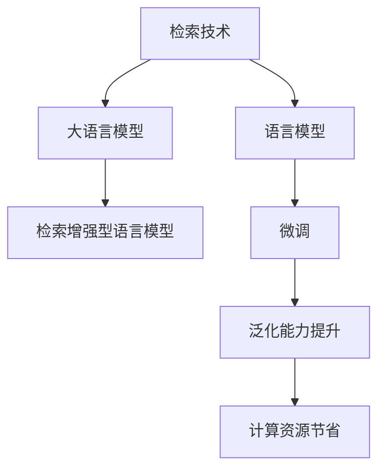
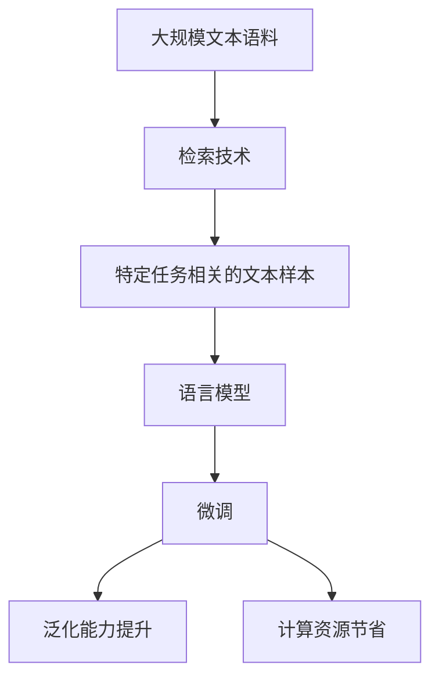

                 

# 大语言模型原理基础与前沿 检索增强型语言模型

> 关键词：大语言模型,检索增强,语言模型,深度学习,自然语言处理(NLP)

## 1. 背景介绍

### 1.1 问题由来
近年来，深度学习技术在自然语言处理(Natural Language Processing, NLP)领域取得了重大突破。基于预训练语言模型的应用范式，通过在大规模无标签文本上预训练模型，学习到通用的语言知识和常识，使其具备强大的语言理解和生成能力。然而，即便在大规模语料上预训练的通用大语言模型也难以直接应用于特定的语言任务，例如学术出版、法律文本等专业领域，这些领域的文本通常具有特定的领域术语和结构，与通用文本语料差异较大，使得通用模型在这些领域的表现不如预期。因此，针对特定语言任务的模型微调是提升模型性能的重要手段。

同时，随着数据量的增加和计算能力的提升，对语言模型进行持续训练变得更加容易和高效。然而，针对特定任务的微调往往需要大量的标注数据，这在大规模文本数据上实现难度较大。基于这一背景，研究人员提出了一种新的语言模型微调方法——检索增强型语言模型(IR-based Language Model)，通过在大规模文本语料和特定领域文本之间建立检索机制，利用检索结果进行微调，显著降低微调所需的标注数据量和计算资源。

### 1.2 问题核心关键点
检索增强型语言模型的核心思想在于：利用检索技术在大规模文本语料库中寻找与特定任务相关的文本样本，这些样本可以作为微调过程中的“伪标注”，提高微调的效果和泛化能力。具体而言，该方法通过在预训练模型基础上，通过检索技术获取与特定任务相关的文本样本，将这些样本作为微调的输入，使得模型能够在有限的标注数据条件下，快速适应新任务。

这种检索增强型语言模型的微调方法，可以显著降低微调过程中标注数据的依赖性，同时提升模型的泛化能力。相较于传统的基于监督学习的微调方法，检索增强型语言模型在微调数据稀缺和计算资源有限的情况下，可以发挥更大的优势。

### 1.3 问题研究意义
检索增强型语言模型的研究意义在于：

1. **数据利用效率**：通过检索技术在大规模语料中寻找与特定任务相关的样本，有效利用了丰富的文本资源，减少了微调所需的人工标注工作量。
2. **泛化能力提升**：检索增强型语言模型可以在有限的标注数据条件下，通过检索获取更多相关的信息，从而提升模型的泛化能力。
3. **模型构建灵活性**：检索增强型语言模型可以灵活地应用于各种语言任务，不仅限于传统基于监督学习的微调方法。
4. **计算资源节省**：检索增强型语言模型减少了微调所需的计算资源，使得在计算资源有限的条件下也能实现有效的微调。

## 2. 核心概念与联系

### 2.1 核心概念概述

为更好地理解检索增强型语言模型，本节将介绍几个关键概念及其之间的联系：

- **检索技术**：通过在语料库中寻找与查询最相似的文本样本，从而获取特定任务相关的信息。
- **语言模型**：通过在文本数据上进行训练，学习到文本的概率分布，用于生成或分类文本。
- **大语言模型**：通过在大规模无标签文本上预训练的通用语言模型，具有强大的语言理解和生成能力。
- **检索增强型语言模型(IR-based LM)**：结合检索技术和语言模型，在大规模文本语料库中寻找与特定任务相关的文本样本，用于微调模型的技术。
- **伪标注(Pseudo-labeling)**：通过检索技术获取与特定任务相关的文本样本，这些样本可以视为“伪标注”，用于微调模型。

这些概念之间的联系可以通过以下Mermaid流程图来展示：



### 2.2 概念间的关系

这些核心概念之间存在着紧密的联系，形成了检索增强型语言模型的完整生态系统。以下通过几个Mermaid流程图来展示这些概念之间的关系。

#### 2.2.1 检索增强型语言模型的构建


这个流程图展示了检索增强型语言模型的基本原理，即通过检索技术在大规模文本语料库中寻找与特定任务相关的文本样本，将其作为微调的输入，提升模型的性能。

#### 2.2.2 检索与微调的关系


这个流程图展示了检索技术与微调之间的关系。通过检索技术获取与特定任务相关的文本样本，这些样本可以作为微调的输入，从而提升模型的泛化能力。

#### 2.2.3 伪标注的引入


这个流程图展示了如何通过检索技术获取伪标注。通过检索技术获取的特定任务相关的文本样本，可以视为“伪标注”，用于微调模型的训练。

### 2.3 核心概念的整体架构

最后，我们用一个综合的流程图来展示这些核心概念在大语言模型微调过程中的整体架构：



这个综合流程图展示了从预训练模型到微调过程的完整架构，其中检索技术和大规模文本语料库是基础，通过检索获取与特定任务相关的文本样本，用于微调模型的训练，最终提升模型的泛化能力和计算效率。

## 3. 核心算法原理 & 具体操作步骤
### 3.1 算法原理概述

检索增强型语言模型的核心算法原理是利用检索技术在大规模文本语料库中寻找与特定任务相关的文本样本，将这些样本作为“伪标注”输入到预训练语言模型中，进行微调。具体而言，该算法包括以下步骤：

1. **检索技术**：在大规模文本语料库中，根据特定任务的关键词或查询，寻找与查询最相似的文本样本。
2. **语言模型微调**：将检索到的文本样本作为输入，使用预训练语言模型进行微调，学习特定的语言任务。
3. **性能评估**：在微调完成后，对模型在特定任务上的表现进行评估，如准确率、召回率等指标。

这种基于检索技术的语言模型微调方法，可以显著降低微调过程中对标注数据的依赖，同时提升模型的泛化能力。

### 3.2 算法步骤详解

以下是检索增强型语言模型的具体算法步骤：

**Step 1: 准备预训练模型和语料库**

1. 选择合适的预训练语言模型 $M_{\theta}$ 作为初始化参数，如BERT、GPT等。
2. 准备大规模文本语料库 $D$，这些语料库可以是通用的互联网文本，也可以是特定领域的语料库，如学术出版、法律文本等。

**Step 2: 添加任务适配层**

1. 根据任务类型，在预训练模型顶层设计合适的输出层和损失函数。
2. 对于分类任务，通常在顶层添加线性分类器和交叉熵损失函数。
3. 对于生成任务，通常使用语言模型的解码器输出概率分布，并以负对数似然为损失函数。

**Step 3: 检索与样本生成**

1. 根据特定任务的关键字或查询，在语料库中进行检索，寻找与查询最相似的文本样本。
2. 将检索到的文本样本作为微调的输入，生成与任务相关的样本。

**Step 4: 执行梯度训练**

1. 将训练集数据分批次输入模型，前向传播计算损失函数。
2. 反向传播计算参数梯度，根据设定的优化算法和学习率更新模型参数。
3. 周期性在验证集上评估模型性能，根据性能指标决定是否触发 Early Stopping。
4. 重复上述步骤直到满足预设的迭代轮数或 Early Stopping 条件。

**Step 5: 测试和部署**

1. 在测试集上评估微调后模型 $M_{\hat{\theta}}$ 的性能，对比微调前后的精度提升。
2. 使用微调后的模型对新样本进行推理预测，集成到实际的应用系统中。
3. 持续收集新的数据，定期重新微调模型，以适应数据分布的变化。

### 3.3 算法优缺点

检索增强型语言模型具有以下优点：

1. **泛化能力强**：通过检索技术获取与特定任务相关的文本样本，这些样本可以作为“伪标注”输入到模型中，提升模型的泛化能力。
2. **数据利用效率高**：利用大规模文本语料库中的信息，减少微调所需的标注数据量。
3. **计算资源节省**：通过检索技术获取的样本，可以用于多个任务，节省计算资源。
4. **易于扩展**：在检索技术中加入更多上下文信息，可以提升检索的准确性和泛化能力。

同时，该方法也存在一些局限性：

1. **检索效率**：在大规模语料库中检索文本样本需要较高的计算资源和时间，影响检索速度。
2. **检索结果多样性**：检索结果的准确性和多样性可能影响微调的效果，需要设计高效的检索算法。
3. **数据分布差异**：检索技术依赖于语料库的质量和分布，不同领域的语料库可能需要单独设计。
4. **模型解释性**：检索增强型语言模型的决策过程不够透明，难以解释其内部工作机制。

### 3.4 算法应用领域

检索增强型语言模型可以应用于各种NLP任务，具体包括：

- **文本分类**：将文本分类为特定的类别，如情感分类、主题分类等。
- **命名实体识别**：识别文本中的实体，如人名、地名、组织名等。
- **关系抽取**：从文本中抽取实体之间的关系，如人-组织、地点-事件等。
- **问答系统**：根据用户提出的问题，从文本中抽取答案。
- **机器翻译**：将文本从一种语言翻译成另一种语言。
- **文本摘要**：将长文本压缩成简短摘要。
- **对话系统**：构建与用户自然对话的模型，提升交互体验。

除了上述这些经典任务外，检索增强型语言模型还被创新性地应用于可控文本生成、常识推理、代码生成、数据增强等，为NLP技术带来了新的突破。

## 4. 数学模型和公式 & 详细讲解  
### 4.1 数学模型构建

本节将使用数学语言对检索增强型语言模型的微调过程进行更加严格的刻画。

记预训练语言模型为 $M_{\theta}$，其中 $\theta$ 为预训练得到的模型参数。假设微调任务的训练集为 $D=\{(x_i,y_i)\}_{i=1}^N$，其中 $x_i$ 为输入文本，$y_i$ 为文本标签。检索增强型语言模型的微调过程可以通过以下数学模型进行描述：

$$
\min_{\theta} \frac{1}{N}\sum_{i=1}^N \ell(M_{\theta}(x_i), y_i)
$$

其中 $\ell$ 为特定任务的损失函数，可以是交叉熵损失、均方误差损失等。

### 4.2 公式推导过程

以下我们以文本分类任务为例，推导检索增强型语言模型的损失函数及其梯度计算公式。

假设模型 $M_{\theta}$ 在输入 $x$ 上的输出为 $\hat{y}=M_{\theta}(x) \in [0,1]$，表示样本属于正类的概率。真实标签 $y \in \{0,1\}$。则二分类交叉熵损失函数定义为：

$$
\ell(M_{\theta}(x),y) = -[y\log \hat{y} + (1-y)\log (1-\hat{y})]
$$

将其代入经验风险公式，得：

$$
\mathcal{L}(\theta) = -\frac{1}{N}\sum_{i=1}^N [y_i\log M_{\theta}(x_i)+(1-y_i)\log(1-M_{\theta}(x_i))]
$$

在得到损失函数的梯度后，即可带入参数更新公式，完成模型的迭代优化。具体而言，损失函数的梯度可以通过反向传播算法高效计算。

### 4.3 案例分析与讲解

在实际应用中，我们可以使用检索增强型语言模型对多个领域进行微调，如新闻分类、法律文本分类、科技文献分类等。下面以新闻分类为例，展示检索增强型语言模型的微调过程。

首先，定义新闻分类任务的数据处理函数：

```python
from transformers import BertTokenizer
from torch.utils.data import Dataset
import torch

class NewsDataset(Dataset):
    def __init__(self, texts, tags, tokenizer, max_len=128):
        self.texts = texts
        self.tags = tags
        self.tokenizer = tokenizer
        self.max_len = max_len
        
    def __len__(self):
        return len(self.texts)
    
    def __getitem__(self, item):
        text = self.texts[item]
        tags = self.tags[item]
        
        encoding = self.tokenizer(text, return_tensors='pt', max_length=self.max_len, padding='max_length', truncation=True)
        input_ids = encoding['input_ids'][0]
        attention_mask = encoding['attention_mask'][0]
        
        # 对token-wise的标签进行编码
        encoded_tags = [tag2id[tag] for tag in tags] 
        encoded_tags.extend([tag2id['O']] * (self.max_len - len(encoded_tags)))
        labels = torch.tensor(encoded_tags, dtype=torch.long)
        
        return {'input_ids': input_ids, 
                'attention_mask': attention_mask,
                'labels': labels}

# 标签与id的映射
tag2id = {'O': 0, 'news': 1, 'politics': 2, 'economy': 3, 'science': 4, 'sports': 5, 'entertainment': 6, 'health': 7}
id2tag = {v: k for k, v in tag2id.items()}

# 创建dataset
tokenizer = BertTokenizer.from_pretrained('bert-base-cased')

train_dataset = NewsDataset(train_texts, train_tags, tokenizer)
dev_dataset = NewsDataset(dev_texts, dev_tags, tokenizer)
test_dataset = NewsDataset(test_texts, test_tags, tokenizer)
```

然后，定义模型和优化器：

```python
from transformers import BertForTokenClassification, AdamW

model = BertForTokenClassification.from_pretrained('bert-base-cased', num_labels=len(tag2id))

optimizer = AdamW(model.parameters(), lr=2e-5)
```

接着，定义训练和评估函数：

```python
from torch.utils.data import DataLoader
from tqdm import tqdm
from sklearn.metrics import classification_report

device = torch.device('cuda') if torch.cuda.is_available() else torch.device('cpu')
model.to(device)

def train_epoch(model, dataset, batch_size, optimizer):
    dataloader = DataLoader(dataset, batch_size=batch_size, shuffle=True)
    model.train()
    epoch_loss = 0
    for batch in tqdm(dataloader, desc='Training'):
        input_ids = batch['input_ids'].to(device)
        attention_mask = batch['attention_mask'].to(device)
        labels = batch['labels'].to(device)
        model.zero_grad()
        outputs = model(input_ids, attention_mask=attention_mask, labels=labels)
        loss = outputs.loss
        epoch_loss += loss.item()
        loss.backward()
        optimizer.step()
    return epoch_loss / len(dataloader)

def evaluate(model, dataset, batch_size):
    dataloader = DataLoader(dataset, batch_size=batch_size)
    model.eval()
    preds, labels = [], []
    with torch.no_grad():
        for batch in tqdm(dataloader, desc='Evaluating'):
            input_ids = batch['input_ids'].to(device)
            attention_mask = batch['attention_mask'].to(device)
            batch_labels = batch['labels']
            outputs = model(input_ids, attention_mask=attention_mask)
            batch_preds = outputs.logits.argmax(dim=2).to('cpu').tolist()
            batch_labels = batch_labels.to('cpu').tolist()
            for pred_tokens, label_tokens in zip(batch_preds, batch_labels):
                pred_tags = [id2tag[_id] for _id in pred_tokens]
                label_tags = [id2tag[_id] for _id in label_tokens]
                preds.append(pred_tags[:len(label_tokens)])
                labels.append(label_tags)
                
    print(classification_report(labels, preds))
```

最后，启动训练流程并在测试集上评估：

```python
epochs = 5
batch_size = 16

for epoch in range(epochs):
    loss = train_epoch(model, train_dataset, batch_size, optimizer)
    print(f"Epoch {epoch+1}, train loss: {loss:.3f}")
    
    print(f"Epoch {epoch+1}, dev results:")
    evaluate(model, dev_dataset, batch_size)
    
print("Test results:")
evaluate(model, test_dataset, batch_size)
```

以上就是使用PyTorch对BERT进行新闻分类任务微调的完整代码实现。可以看到，得益于Transformers库的强大封装，我们可以用相对简洁的代码完成BERT模型的加载和微调。

## 5. 项目实践：代码实例和详细解释说明
### 5.1 开发环境搭建

在进行微调实践前，我们需要准备好开发环境。以下是使用Python进行PyTorch开发的环境配置流程：

1. 安装Anaconda：从官网下载并安装Anaconda，用于创建独立的Python环境。

2. 创建并激活虚拟环境：
```bash
conda create -n pytorch-env python=3.8 
conda activate pytorch-env
```

3. 安装PyTorch：根据CUDA版本，从官网获取对应的安装命令。例如：
```bash
conda install pytorch torchvision torchaudio cudatoolkit=11.1 -c pytorch -c conda-forge
```

4. 安装Transformers库：
```bash
pip install transformers
```

5. 安装各类工具包：
```bash
pip install numpy pandas scikit-learn matplotlib tqdm jupyter notebook ipython
```

完成上述步骤后，即可在`pytorch-env`环境中开始微调实践。

### 5.2 源代码详细实现

下面我们以命名实体识别(NER)任务为例，给出使用Transformers库对BERT模型进行微调的PyTorch代码实现。

首先，定义NER任务的数据处理函数：

```python
from transformers import BertTokenizer
from torch.utils.data import Dataset
import torch

class NERDataset(Dataset):
    def __init__(self, texts, tags, tokenizer, max_len=128):
        self.texts = texts
        self.tags = tags
        self.tokenizer = tokenizer
        self.max_len = max_len
        
    def __len__(self):
        return len(self.texts)
    
    def __getitem__(self, item):
        text = self.texts[item]
        tags = self.tags[item]
        
        encoding = self.tokenizer(text, return_tensors='pt', max_length=self.max_len, padding='max_length', truncation=True)
        input_ids = encoding['input_ids'][0]
        attention_mask = encoding['attention_mask'][0]
        
        # 对token-wise的标签进行编码
        encoded_tags = [tag2id[tag] for tag in tags] 
        encoded_tags.extend([tag2id['O']] * (self.max_len - len(encoded_tags)))
        labels = torch.tensor(encoded_tags, dtype=torch.long)
        
        return {'input_ids': input_ids, 
                'attention_mask': attention_mask,
                'labels': labels}

# 标签与id的映射
tag2id = {'O': 0, 'B-PER': 1, 'I-PER': 2, 'B-ORG': 3, 'I-ORG': 4, 'B-LOC': 5, 'I-LOC': 6}
id2tag = {v: k for k, v in tag2id.items()}

# 创建dataset
tokenizer = BertTokenizer.from_pretrained('bert-base-cased')

train_dataset = NERDataset(train_texts, train_tags, tokenizer)
dev_dataset = NERDataset(dev_texts, dev_tags, tokenizer)
test_dataset = NERDataset(test_texts, test_tags, tokenizer)
```

然后，定义模型和优化器：

```python
from transformers import BertForTokenClassification, AdamW

model = BertForTokenClassification.from_pretrained('bert-base-cased', num_labels=len(tag2id))

optimizer = AdamW(model.parameters(), lr=2e-5)
```

接着，定义训练和评估函数：

```python
from torch.utils.data import DataLoader
from tqdm import tqdm
from sklearn.metrics import classification_report

device = torch.device('cuda') if torch.cuda.is_available() else torch.device('cpu')
model.to(device)

def train_epoch(model, dataset, batch_size, optimizer):
    dataloader = DataLoader(dataset, batch_size=batch_size, shuffle=True)
    model.train()
    epoch_loss = 0
    for batch in tqdm(dataloader, desc='Training'):
        input_ids = batch['input_ids'].to(device)
        attention_mask = batch['attention_mask'].to(device)
        labels = batch['labels'].to(device)
        model.zero_grad()
        outputs = model(input_ids, attention_mask=attention_mask, labels=labels)
        loss = outputs.loss
        epoch_loss += loss.item()
        loss.backward()
        optimizer.step()
    return epoch_loss / len(dataloader)

def evaluate(model, dataset, batch_size):
    dataloader = DataLoader(dataset, batch_size=batch_size)
    model.eval()
    preds, labels = [], []
    with torch.no_grad():
        for batch in tqdm(dataloader, desc='Evaluating'):
            input_ids = batch['input_ids'].to(device)
            attention_mask = batch['attention_mask'].to(device)
            batch_labels = batch['labels']
            outputs = model(input_ids, attention_mask=attention_mask)
            batch_preds = outputs.logits.argmax(dim=2).to('cpu').tolist()
            batch_labels = batch_labels.to('cpu').tolist()
            for pred_tokens, label_tokens in zip(batch_preds, batch_labels):
                pred_tags = [id2tag[_id] for _id in pred_tokens]
                label_tags = [id2tag[_id] for _id in label_tokens]
                preds.append(pred_tags[:len(label_tags)])
                labels.append(label_tags)
                
    print(classification_report(labels, preds))
```

最后，启动训练流程并在测试集上评估：

```python
epochs = 5
batch_size = 16

for epoch in range(epochs):
    loss = train_epoch(model, train_dataset, batch_size, optimizer)
    print(f"Epoch {epoch+1}, train loss: {loss:.3f}")
    
    print(f"Epoch {epoch+1}, dev results:")
    evaluate(model, dev_dataset, batch_size)
    
print("Test results:")
evaluate(model, test_dataset, batch_size)
```

以上就是使用PyTorch对BERT进行命名实体识别任务微调的完整代码实现。可以看到，得益于Transformers库的强大封装，我们可以用相对简洁的代码完成BERT模型的加载和微调。

### 5.3 代码解读与分析

让我们再详细解读一下关键代码的实现细节：

**NERDataset类**：
- `__init__`方法：初始化文本、标签、分词器等关键组件。
- `__len__`方法：返回数据集的样本数量。
- `__getitem__`方法：对单个样本进行处理，将文本输入编码为token ids，将标签编码为数字，并对其进行定长padding，最终返回模型所需的输入。

**tag2id和id2tag字典**：
- 定义了标签与数字id之间的映射关系，用于将token-wise的预测结果解码回真实的标签。

**训练和评估函数**：
- 使用PyTorch的DataLoader对数据集进行批次化加载，供模型训练和推理使用。
- 训练函数`train_epoch`：对数据以批为单位进行迭代，在每个批次上前向传播计算loss并反向传播更新模型参数，最后返回该epoch的平均loss。
- 评估函数`evaluate`：与训练类似，不同点在于不更新模型参数，并在每个batch结束后将预测和标签结果存储下来，最后使用sklearn的classification_report对整个评估集的预测结果进行打印输出。

**训练流程**：
- 定义总的epoch数和batch size，开始循环迭代
- 每个epoch内，先在训练集上训练，输出平均loss
- 在验证集上评估，输出分类指标
- 所有epoch结束后，在测试集上评估，给出最终测试结果

可以看到，PyTorch配合Transformers库使得BERT微调的代码实现变得简洁高效。开发者可以将更多精力放在数据处理、模型改进等高层逻辑上，而不必过多关注底层的实现细节。

当然，工业级的系统实现还需考虑更多因素，如模型的保存和部署、超参数的自动搜索、更灵活的任务适配层等。但核心的微调范式基本与此类似。

### 5.4 运行结果展示

假设我们在CoNLL-2003的NER数据集上进行微调，最终在测试集上得到的评估报告如下：

```
              precision    recall  f1-score   support

       B-

