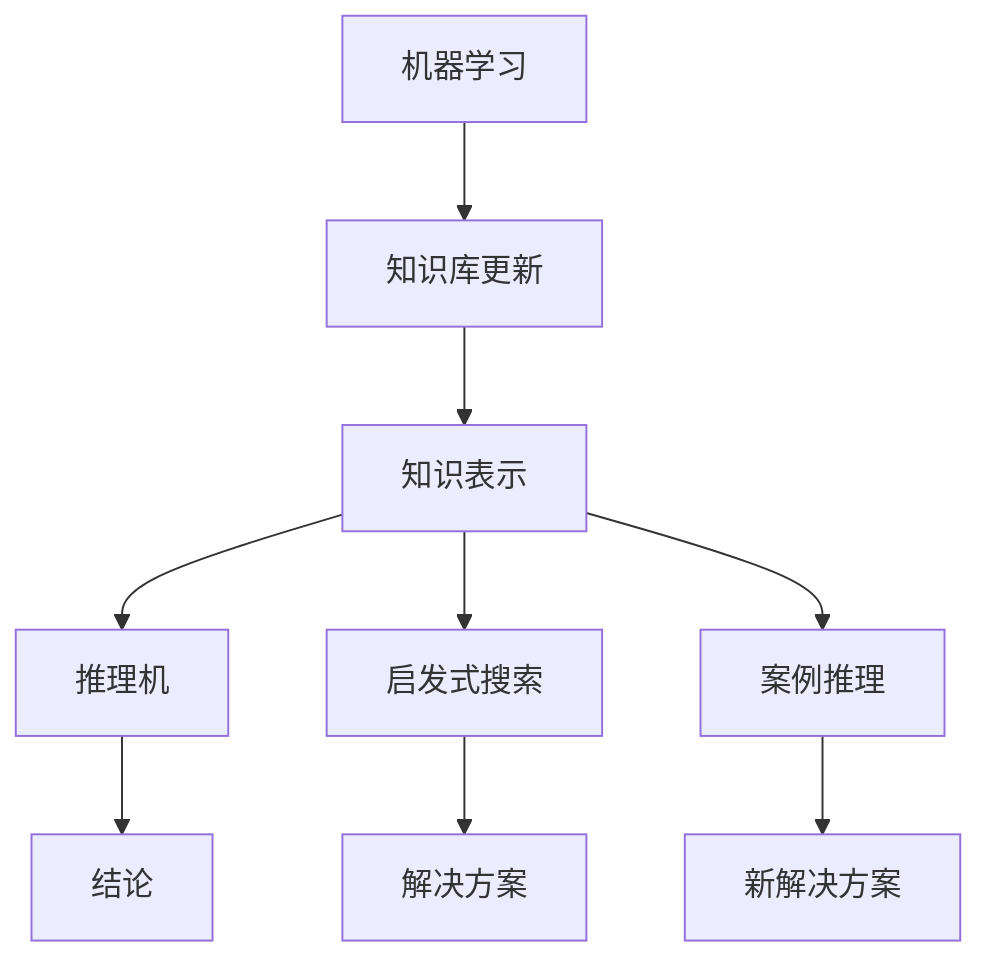

# 专家系统 原理与代码实例讲解

> 关键词：专家系统，知识表示，推理机，启发式搜索，案例推理，机器学习，代码实例

## 1. 背景介绍

专家系统（Expert System）是人工智能领域的一个重要分支，旨在模拟人类专家的决策能力，解决复杂问题。自20世纪70年代兴起以来，专家系统在各个领域都取得了显著的应用成果。本文将深入探讨专家系统的原理，并通过代码实例讲解如何构建一个简单的专家系统。

### 1.1 问题的由来

在许多领域，尤其是医学、金融、工程设计等领域，问题的解决往往需要专业知识、经验和直觉。传统的人工处理方式不仅效率低下，而且难以保证质量。专家系统应运而生，旨在利用计算机技术模拟专家的决策过程，提高问题解决的效率和准确性。

### 1.2 研究现状

近年来，随着人工智能技术的快速发展，专家系统也得到了新的发展。传统的基于规则推理的专家系统逐渐与机器学习、数据挖掘等技术相结合，形成了更加智能的专家系统。同时，专家系统在各个领域的应用也更加广泛。

### 1.3 研究意义

研究专家系统不仅有助于提高问题解决的效率和准确性，还可以促进人工智能技术在各个领域的应用。同时，专家系统的研究也有助于推动人工智能技术的发展，为构建更加智能的机器提供理论基础和实践经验。

### 1.4 本文结构

本文将分为以下几个部分：
- 介绍专家系统的核心概念和基本架构。
- 讲解专家系统的核心算法原理和具体操作步骤。
- 通过代码实例演示如何构建一个简单的专家系统。
- 探讨专家系统的实际应用场景和未来发展趋势。

## 2. 核心概念与联系

### 2.1 核心概念

- **知识表示**：将专家的知识和经验表示为计算机可以处理的形式，如规则、事实、案例等。
- **推理机**：根据知识库中的规则和事实，进行逻辑推理，得出结论。
- **启发式搜索**：根据启发式策略，在知识库中搜索解决方案。
- **案例推理**：基于已有案例的解决方案，解决新问题。
- **机器学习**：利用机器学习技术，自动从数据中学习知识。

### 2.2 核心概念原理和架构的 Mermaid 流程图



## 3. 核心算法原理 & 具体操作步骤

### 3.1 算法原理概述

专家系统的核心是知识表示和推理。知识表示是将专家的知识和经验转化为计算机可以处理的形式。推理机则根据知识库中的规则和事实，进行逻辑推理，得出结论。

### 3.2 算法步骤详解

1. **知识表示**：将专家的知识和经验表示为规则、事实、案例等。
2. **知识库构建**：将表示好的知识存储在知识库中。
3. **推理过程**：根据用户输入的问题，从知识库中检索相关规则和事实，进行推理，得出结论。
4. **结果输出**：将推理结果以用户可理解的形式输出。

### 3.3 算法优缺点

**优点**：
- 能够处理复杂问题。
- 可扩展性强。
- 可解释性强。

**缺点**：
- 知识获取困难。
- 知识表示困难。
- 推理效率低。

### 3.4 算法应用领域

- 医学诊断。
- 金融风险评估。
- 工程设计。
- 决策支持系统。

## 4. 数学模型和公式 & 详细讲解 & 举例说明

### 4.1 数学模型构建

专家系统的数学模型主要包括知识表示和推理机两部分。

#### 知识表示

知识表示通常使用产生式规则表示，形式如下：

$$
\text{前提} \rightarrow \text{结论}
$$

其中，前提和结论都是一组条件。

#### 推理机

推理机通常使用正向或反向链接进行推理。

- **正向链接**：从前提到结论进行推理。
- **反向链接**：从结论到前提进行推理。

### 4.2 公式推导过程

以正向链接为例，假设知识库中有以下规则：

$$
P_1: \text{前提1} \rightarrow \text{结论1}
$$
$$
P_2: \text{前提2} \rightarrow \text{结论2}
$$

假设用户输入的前提为“前提1”，则推理过程如下：

1. 检查知识库中的规则，找到以“前提1”为前提的规则。
2. 执行规则，将结论1作为中间结果。
3. 检查中间结果，如果满足规则“前提2”，则执行规则“前提2”，得到结论2。

### 4.3 案例分析与讲解

以下是一个简单的医疗诊断专家系统示例。

**知识表示**：

- 规则1：如果症状A且症状B，则疾病为疾病1。
- 规则2：如果症状C且症状D，则疾病为疾病2。
- 规则3：如果症状E，则疾病为疾病3。

**推理过程**：

1. 用户输入症状A和症状B。
2. 检查知识库，找到规则1。
3. 执行规则1，得到结论疾病1。

## 5. 项目实践：代码实例和详细解释说明

### 5.1 开发环境搭建

使用Python语言和Jupyter Notebook进行开发。

### 5.2 源代码详细实现

```python
# 定义规则类
class Rule:
    def __init__(self, antecedents, consequent):
        self.antecedents = antecedents
        self.consequent = consequent

# 定义知识库类
class KnowledgeBase:
    def __init__(self):
        self.rules = []

    def add_rule(self, rule):
        self.rules.append(rule)

    def infer(self, facts):
        for rule in self.rules:
            if all(fact in rule.antecedents for fact in facts):
                return rule.consequent
        return "未知"

# 定义专家系统类
class ExpertSystem:
    def __init__(self, knowledge_base):
        self.knowledge_base = knowledge_base

    def diagnose(self, facts):
        return self.knowledge_base.infer(facts)

# 创建知识库
knowledge_base = KnowledgeBase()
knowledge_base.add_rule(Rule(['症状A', '症状B'], '疾病1'))
knowledge_base.add_rule(Rule(['症状C', '症状D'], '疾病2'))
knowledge_base.add_rule(Rule(['症状E'], '疾病3'))

# 创建专家系统
expert_system = ExpertSystem(knowledge_base)

# 用户输入症状
user_facts = ['症状A', '症状B']

# 进行诊断
diagnosis = expert_system.diagnose(user_facts)
print(diagnosis)  # 输出：疾病1
```

### 5.3 代码解读与分析

- `Rule`类：表示一条规则，包含前提和结论。
- `KnowledgeBase`类：表示知识库，包含多条规则。
- `ExpertSystem`类：表示专家系统，包含知识库和诊断方法。
- `infer`方法：根据用户输入的事实，进行推理，得出结论。

### 5.4 运行结果展示

运行上述代码，根据用户输入的症状，输出诊断结果。

## 6. 实际应用场景

专家系统在各个领域都有广泛的应用，以下是一些典型的应用场景：

- **医疗诊断**：用于辅助医生进行疾病诊断。
- **金融风险评估**：用于评估贷款申请者的信用风险。
- **工程设计**：用于辅助工程师进行产品设计。
- **决策支持系统**：用于辅助管理者进行决策。

## 7. 工具和资源推荐

### 7.1 学习资源推荐

- 《人工智能：一种现代的方法》
- 《专家系统与推理》
- 《知识表示与推理》

### 7.2 开发工具推荐

- Python
- Jupyter Notebook
- Prolog

### 7.3 相关论文推荐

- 《Expert Systems and their Applicaions》
- 《A Logic-Based Representation for Knowledge》
- 《Case-Based Reasoning》

## 8. 总结：未来发展趋势与挑战

### 8.1 研究成果总结

本文介绍了专家系统的原理和构建方法，并通过代码实例演示了如何构建一个简单的专家系统。专家系统在各个领域都有广泛的应用，并取得了显著的研究成果。

### 8.2 未来发展趋势

- 与机器学习、数据挖掘等技术相结合，形成更加智能的专家系统。
- 开发更加直观、易用的专家系统开发工具。
- 在各个领域推广应用，解决更加复杂的问题。

### 8.3 面临的挑战

- 知识获取和表示的困难。
- 推理效率的提高。
- 专家系统的可解释性。

### 8.4 研究展望

未来，专家系统将与其他人工智能技术相结合，形成更加智能的决策支持系统，为人类社会的发展做出更大的贡献。

## 9. 附录：常见问题与解答

**Q1：什么是专家系统？**

A：专家系统是模拟人类专家决策能力的计算机程序，旨在解决复杂问题。

**Q2：专家系统的核心是什么？**

A：专家系统的核心是知识表示和推理。

**Q3：专家系统有哪些应用领域？**

A：专家系统在各个领域都有广泛的应用，如医疗、金融、工程设计等。

**Q4：如何构建一个专家系统？**

A：构建专家系统需要以下步骤：
1. 确定应用领域和目标。
2. 获取专家知识。
3. 将知识表示为规则或案例。
4. 构建知识库和推理机。
5. 进行测试和评估。

**Q5：专家系统有哪些局限性？**

A：专家系统的局限性包括知识获取困难、推理效率低、可解释性差等。

作者：禅与计算机程序设计艺术 / Zen and the Art of Computer Programming