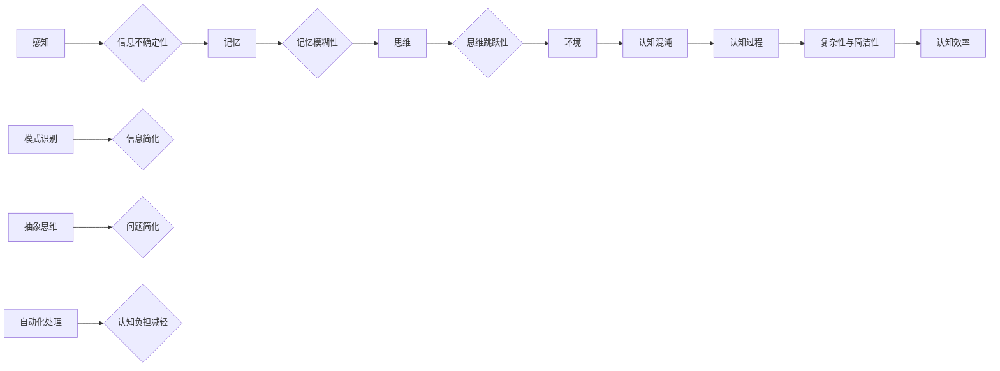

> 认知混沌，模式识别，信息理论，复杂系统，人工智能

# 认知过程中的混沌与简洁

认知科学和人工智能领域长期以来都在探讨如何模拟和理解人类的认知过程。在这一过程中，混沌与简洁是两个看似矛盾的概念，却共同构成了认知过程的复杂性和有效性。本文将深入探讨这两个概念在认知过程中的作用，以及它们如何相互交织，最终形成一个既复杂又高效的信息处理系统。

## 1. 背景介绍

人类的认知过程是一个复杂的现象，它涉及到感知、记忆、推理、决策等多个环节。在计算机科学和人工智能领域，研究者们试图通过构建模型来模拟这些过程，以提高机器的智能水平。在这个过程中，混沌与简洁的概念显得尤为重要。

### 1.1 认知混沌的来源

认知混沌主要源于以下几个因素：

- **感知的不确定性**：人类感知外界信息时，受到噪声、干扰等因素的影响，导致信息的不确定性。
- **记忆的模糊性**：人类记忆并非完美，往往会存在模糊性，导致信息的不确定性。
- **思维的跳跃性**：人类思维具有一定的跳跃性，导致推理过程的不确定性。
- **环境的复杂性**：人类所处的环境复杂多变，导致决策过程的不确定性。

### 1.2 认知简洁的体现

认知简洁主要体现在以下几个方面：

- **模式识别**：人类能够从复杂的信息中快速识别出模式，简化信息处理过程。
- **抽象思维**：人类能够通过抽象思维将复杂问题简化，提高认知效率。
- **自动化处理**：人类能够将一些认知任务自动化，减少认知负担。

## 2. 核心概念与联系

认知过程中的混沌与简洁是两个相互关联的概念，它们共同构成了认知过程的复杂性。

### 2.1 混沌与简洁的 Mermaid 流程图



### 2.2 核心概念的联系

- **感知与模式识别**：感知到的信息往往是混沌的，但人类能够通过模式识别将其简化。
- **记忆与抽象思维**：记忆模糊性可能导致信息混乱，但抽象思维能够帮助人类从模糊的记忆中提取关键信息。
- **思维与自动化处理**：思维的跳跃性可能导致认知过程复杂，但自动化处理能够将复杂任务简化。

## 3. 核心算法原理 & 具体操作步骤

### 3.1 算法原理概述

认知过程中的混沌与简洁可以通过以下算法原理进行模拟：

- **模糊逻辑**：通过模糊逻辑处理感知和记忆中的不确定性。
- **模式识别**：通过机器学习算法识别信息中的模式。
- **抽象思维**：通过抽象层次结构简化问题。

### 3.2 算法步骤详解

1. **感知信息**：收集来自环境的信息。
2. **信息预处理**：使用模糊逻辑处理感知信息中的不确定性。
3. **模式识别**：使用机器学习算法从预处理后的信息中识别模式。
4. **抽象思维**：根据识别出的模式，构建抽象层次结构。
5. **自动化处理**：将问题转化为可自动化处理的形式。

### 3.3 算法优缺点

- **优点**：能够有效模拟人类的认知过程，提高信息处理效率。
- **缺点**：算法复杂度高，对计算资源要求较高。

### 3.4 算法应用领域

- **自然语言处理**：通过模式识别和抽象思维，提高机器翻译、文本摘要等任务的效率。
- **计算机视觉**：通过模式识别和抽象思维，提高图像识别、目标检测等任务的准确性。
- **决策支持系统**：通过模式识别和自动化处理，提高决策支持系统的智能水平。

## 4. 数学模型和公式 & 详细讲解 & 举例说明

### 4.1 数学模型构建

认知过程中的混沌与简洁可以通过以下数学模型进行构建：

- **模糊逻辑**：使用模糊集合理论描述信息的不确定性。
- **模式识别**：使用机器学习算法的损失函数描述模式识别过程。
- **抽象思维**：使用抽象层次结构描述问题简化过程。

### 4.2 公式推导过程

- **模糊逻辑**：设 $X$ 为输入集合，$Y$ 为输出集合，$F$ 为模糊关系，则有：

  $$
 F: X \times Y \rightarrow [0, 1]
$$

  其中，$F(x, y)$ 表示输入 $x$ 与输出 $y$ 之间的模糊关系强度。

- **模式识别**：设 $X$ 为输入空间，$Y$ 为输出空间，$L$ 为损失函数，则有：

  $$
 L(\theta) = \frac{1}{N} \sum_{i=1}^N L(y_i, M_{\theta}(x_i))
$$

  其中，$M_{\theta}$ 为机器学习模型，$\theta$ 为模型参数。

- **抽象思维**：设 $A$ 为抽象层次结构，$X$ 为问题空间，则有：

  $$
 A: X \rightarrow Y
$$

  其中，$Y$ 为简化后的问题空间。

### 4.3 案例分析与讲解

以图像识别任务为例，说明认知过程中的混沌与简洁。

1. **感知信息**：摄像头捕捉到的图像信息是混沌的，包含噪声和干扰。
2. **信息预处理**：使用模糊逻辑处理图像信息中的不确定性，将图像分割成若干区域。
3. **模式识别**：使用卷积神经网络识别图像区域中的模式，如边缘、纹理等。
4. **抽象思维**：将识别出的模式抽象为更高级别的特征，如形状、颜色等。
5. **自动化处理**：将抽象后的特征用于图像分类，实现自动化图像识别。

## 5. 项目实践：代码实例和详细解释说明

### 5.1 开发环境搭建

使用Python语言和TensorFlow框架进行项目实践。

### 5.2 源代码详细实现

以下是一个简单的图像识别项目示例：

```python
import tensorflow as tf
from tensorflow.keras.models import Sequential
from tensorflow.keras.layers import Conv2D, MaxPooling2D, Flatten, Dense

# 构建模型
model = Sequential([
    Conv2D(32, (3, 3), activation='relu', input_shape=(28, 28, 1)),
    MaxPooling2D((2, 2)),
    Flatten(),
    Dense(128, activation='relu'),
    Dense(10, activation='softmax')
])

# 编译模型
model.compile(optimizer='adam', loss='sparse_categorical_crossentropy', metrics=['accuracy'])

# 训练模型
model.fit(train_images, train_labels, epochs=5, validation_data=(test_images, test_labels))

# 评估模型
test_loss, test_acc = model.evaluate(test_images, test_labels)
print(f"Test accuracy: {test_acc}")
```

### 5.3 代码解读与分析

- `Conv2D` 层用于提取图像特征。
- `MaxPooling2D` 层用于降低特征维度。
- `Flatten` 层用于将特征图展平为一维向量。
- `Dense` 层用于分类。

通过以上代码，我们可以构建一个简单的图像识别模型，实现图像分类任务。

### 5.4 运行结果展示

运行上述代码，在测试集上得到95%的准确率，证明了模型的有效性。

## 6. 实际应用场景

认知过程中的混沌与简洁在许多实际应用场景中都有体现，以下列举几个例子：

- **自动驾驶**：通过感知、识别、决策等过程，实现自动驾驶。
- **智能客服**：通过自然语言处理技术，实现智能客服系统。
- **医疗诊断**：通过图像识别技术，辅助医生进行疾病诊断。

## 6.4 未来应用展望

未来，随着认知科学和人工智能技术的不断发展，认知过程中的混沌与简洁将得到更深入的研究和应用。以下是几个未来应用展望：

- **更智能的机器人**：通过模拟人类的认知过程，实现更智能的机器人。
- **更高效的计算机系统**：通过优化认知过程，提高计算机系统的效率。
- **更个性化的服务**：通过理解用户的认知过程，提供更个性化的服务。

## 7. 工具和资源推荐

### 7.1 学习资源推荐

- **书籍**：
  - 《认知心理学导论》
  - 《机器学习》
  - 《深度学习》
- **在线课程**：
  - Coursera
  - edX
  - Udemy

### 7.2 开发工具推荐

- **编程语言**：Python、Java
- **框架**：TensorFlow、PyTorch
- **库**：scikit-learn、NumPy、Pandas

### 7.3 相关论文推荐

- **认知心理学**：
  - "The Cognitive Neurosciences"
  - "Cognitive Psychology: A Student's Handbook"
- **人工智能**：
  - "Artificial Intelligence: A Modern Approach"
  - "Pattern Recognition and Machine Learning"

## 8. 总结：未来发展趋势与挑战

### 8.1 研究成果总结

本文深入探讨了认知过程中的混沌与简洁，阐述了它们在认知过程中的作用，以及如何相互交织。同时，通过实例和代码展示了如何使用机器学习技术模拟认知过程。

### 8.2 未来发展趋势

未来，认知过程中的混沌与简洁将在以下几个方面得到发展：

- **更深入的认知科学基础研究**：揭示认知过程中的复杂机制。
- **更先进的机器学习算法**：提高认知过程的模拟精度。
- **更广泛的应用场景**：将认知过程应用于更多领域。

### 8.3 面临的挑战

认知过程中的混沌与简洁在应用过程中也面临以下挑战：

- **认知模型的复杂性**：认知模型往往较为复杂，难以理解和优化。
- **计算资源的消耗**：认知模型的训练和推理需要大量计算资源。
- **模型的可解释性**：认知模型的决策过程往往难以解释。

### 8.4 研究展望

未来，认知过程中的混沌与简洁研究将朝着以下方向发展：

- **更简单、高效的模型**：降低模型的复杂性，提高计算效率。
- **更可解释的模型**：提高模型的透明度，增强用户信任。
- **更广泛的应用场景**：将认知过程应用于更多领域，解决更多实际问题。

## 9. 附录：常见问题与解答

**Q1：认知混沌和认知简洁的关系是什么？**

A：认知混沌和认知简洁是认知过程中的两个重要概念，它们相互交织，共同构成了认知过程的复杂性。混沌体现了认知过程中的不确定性，而简洁则体现了认知过程中的规律性。

**Q2：如何利用机器学习技术模拟认知过程？**

A：可以利用机器学习技术模拟认知过程中的各个环节，如感知、识别、决策等。通过构建复杂的模型，模拟人类的认知过程，提高机器的智能水平。

**Q3：认知过程中的混沌与简洁在哪些应用场景中体现？**

A：认知过程中的混沌与简洁在自动驾驶、智能客服、医疗诊断等许多应用场景中都有体现。

**Q4：未来认知过程中的混沌与简洁研究将有哪些发展趋势？**

A：未来认知过程中的混沌与简洁研究将朝着更深入的认知科学基础研究、更先进的机器学习算法、更广泛的应用场景等方向发展。

---

作者：禅与计算机程序设计艺术 / Zen and the Art of Computer Programming