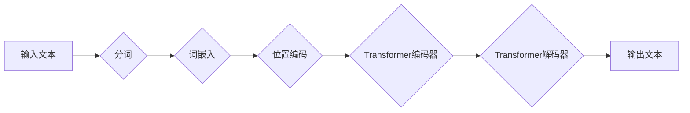

> 人工智能, 大模型, 认知科学, 语言理解, 模型偏差, 人类思维, 预训练, 微调, 可解释性

# 语言≈思维：大模型的认知盲点

### 1. 背景介绍

自20世纪中叶以来，人工智能（AI）领域取得了长足的进步，尤其是在自然语言处理（NLP）领域。大语言模型（Large Language Models, LLMs）如BERT、GPT-3等，通过在大量文本数据上进行预训练，展现出了惊人的语言理解和生成能力。这些模型在多个NLP任务上取得了突破性成果，似乎正在接近甚至超越人类的语言能力。然而，尽管这些模型在语言层面表现出色，但它们是否真正理解了语言背后的思维过程，是否能够真正模拟人类的认知行为，仍然是一个值得深思的问题。

### 2. 核心概念与联系

#### 2.1 语言与思维的关系

在探讨大模型的认知盲点之前，我们首先需要理解语言与思维之间的关系。语言是人类思维的一种表达方式，它不仅反映了我们的认知过程，也是我们与世界互动的桥梁。然而，语言与思维并非完全等同。思维是一个复杂的过程，涉及概念形成、推理、决策等多个层面，而语言只是其中的一部分。

#### 2.2 大语言模型的工作原理

大语言模型通常基于深度学习技术，通过在大量文本数据上进行预训练，学习语言的模式和结构。预训练过程中，模型会学习到语言的统计规律、语法结构、词汇搭配等信息，从而在语言理解、文本生成等任务上表现出色。

#### 2.3 Mermaid流程图：大语言模型的工作流程



### 3. 核心算法原理 & 具体操作步骤

#### 3.1 算法原理概述

大语言模型的核心算法是Transformer，这是一种基于自注意力机制的深度神经网络架构。它通过编码器-解码器结构，实现了对文本的编码和翻译。

#### 3.2 算法步骤详解

1. **分词**：将输入文本分割成单词或子词。
2. **词嵌入**：将分词结果映射到高维向量空间。
3. **位置编码**：为每个词嵌入添加位置信息，以反映其在文本中的位置。
4. **编码器**：通过多头自注意力机制，捕捉词之间的关系。
5. **解码器**：通过解码器-自注意力机制，生成文本输出。
6. **输出**：将解码器输出的词嵌入转换为文本。

#### 3.3 算法优缺点

**优点**：

- **强大的语言理解能力**：能够处理复杂语言结构，理解语义和上下文。
- **泛化能力强**：在多个NLP任务上表现出色，无需针对特定任务进行大量定制。

**缺点**：

- **可解释性差**：模型决策过程难以解释，难以理解模型的推理过程。
- **数据偏差**：模型可能学习到数据中的偏见，导致输出具有偏见。

#### 3.4 算法应用领域

- **机器翻译**
- **文本摘要**
- **对话系统**
- **问答系统**
- **文本生成**

### 4. 数学模型和公式 & 详细讲解 & 举例说明

#### 4.1 数学模型构建

大语言模型的核心是Transformer模型，其数学基础主要包括词嵌入、自注意力机制、位置编码等。

#### 4.2 公式推导过程

**词嵌入**：

$$
\text{word\_embeddings} = \text{Embedding}(W, D)
$$

其中，$W$ 是输入的词索引，$D$ 是嵌入维度。

**自注意力机制**：

$$
\text{self\_attention}(Q, K, V) = \text{softmax}(\frac{QK^T}{\sqrt{d_k}})V
$$

其中，$Q, K, V$ 分别是查询、键和值，$\text{softmax}$ 是softmax函数。

**位置编码**：

$$
\text{PositionalEncoding}(pos, 2D) = \sin(\frac{pos}{10000^{2i/d_{\text{model}}}})
$$

$$
\text{PositionalEncoding}(pos, 2D+1) = \cos(\frac{pos}{10000^{2i/d_{\text{model}}}})
$$

其中，$pos$ 是位置索引，$D$ 是嵌入维度。

#### 4.3 案例分析与讲解

以机器翻译任务为例，假设我们要将英文句子 "I love programming" 翻译成中文。

1. **分词**：将句子分割成单词 "I", "love", "programming"。
2. **词嵌入**：将每个单词映射到高维向量空间。
3. **位置编码**：为每个单词添加位置信息。
4. **编码器**：通过编码器捕捉单词之间的关系。
5. **解码器**：生成翻译结果 "我喜欢编程"。

### 5. 项目实践：代码实例和详细解释说明

#### 5.1 开发环境搭建

1. 安装Python和PyTorch。
2. 安装transformers库。

#### 5.2 源代码详细实现

```python
from transformers import AutoModelForSeq2SeqLM, AutoTokenizer

# 加载预训练模型和分词器
model = AutoModelForSeq2SeqLM.from_pretrained("t5-small")
tokenizer = AutoTokenizer.from_pretrained("t5-small")

# 英文输入
input_text = "I love programming"

# 加载模型和分词器
model.eval()
input_ids = tokenizer(input_text, return_tensors="pt", max_length=512, truncation=True)

# 生成翻译结果
output_ids = model.generate(input_ids)

# 解码翻译结果
translation = tokenizer.decode(output_ids[0], skip_special_tokens=True)

print(translation)
```

#### 5.3 代码解读与分析

- 加载预训练模型和分词器。
- 将英文输入句子编码成模型所需的格式。
- 使用模型生成翻译结果。
- 解码翻译结果，得到中文输出。

### 6. 实际应用场景

#### 6.1 机器翻译

大语言模型在机器翻译领域取得了显著成果，能够将一种语言的文本翻译成另一种语言。

#### 6.2 文本摘要

大语言模型可以自动生成文本摘要，提取关键信息，简化长文本。

#### 6.3 对话系统

大语言模型可以应用于对话系统，如智能客服、聊天机器人等。

### 7. 工具和资源推荐

#### 7.1 学习资源推荐

- 《深度学习与自然语言处理》
- 《自然语言处理综合教程》
- 《Transformer：原理与实现》

#### 7.2 开发工具推荐

- PyTorch
- Transformers库

#### 7.3 相关论文推荐

- Attention is All You Need
- BERT: Pre-training of Deep Bidirectional Transformers for Language Understanding

### 8. 总结：未来发展趋势与挑战

#### 8.1 研究成果总结

大语言模型在NLP领域取得了显著成果，但它们仍然存在认知盲点，无法完全模拟人类的思维过程。

#### 8.2 未来发展趋势

- 开发更加可解释的模型
- 提高模型的鲁棒性和泛化能力
- 探索跨模态信息融合

#### 8.3 面临的挑战

- 模型的可解释性
- 数据偏差
- 计算资源消耗

#### 8.4 研究展望

未来，大语言模型将继续发展，但我们需要关注其认知盲点，努力构建更加智能、可靠的人工智能系统。

---

作者：禅与计算机程序设计艺术 / Zen and the Art of Computer Programming