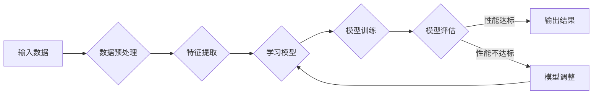

# 软件2.0的持续学习与适应机制

> 关键词：软件2.0，持续学习，适应机制，人工智能，软件进化，动态系统，自适应系统，智能软件

## 1. 背景介绍

随着信息技术的飞速发展，软件已经成为现代社会的基础设施，深刻影响着各行各业。从早期的软件1.0时代，注重功能实现和性能优化，到软件2.0时代的到来，软件系统开始向更加智能化、自适应的方向发展。软件2.0的核心特征之一，就是具备持续学习与适应机制，能够在不断变化的环境中自我优化和进化。

### 1.1 软件1.0到软件2.0的演进

软件1.0时代，软件的主要目标是满足用户的基本需求，如文字处理、表格处理、财务管理等。软件系统以功能模块划分，开发过程以瀑布模型为主，版本更新周期较长。

软件2.0时代，随着云计算、大数据、人工智能等技术的发展，软件系统逐渐向智能化、网络化、动态化方向发展。软件系统的功能不再局限于单一任务，而是能够根据用户需求和环境变化进行自我调整和优化。

### 1.2 持续学习与适应机制的重要性

在软件2.0时代，持续学习与适应机制的重要性日益凸显：

1. **提高软件系统的智能化水平**：通过学习用户行为、环境变化等信息，软件系统能够提供更加个性化的服务。
2. **增强软件系统的鲁棒性**：在面对未知或突发情况时，软件系统能够根据学习到的知识进行自我调整，提高系统的稳定性和可靠性。
3. **缩短软件迭代周期**：通过自动化学习过程，减少人工干预，缩短软件迭代周期，提高开发效率。
4. **降低运维成本**：自适应系统可以自动发现和解决潜在问题，降低运维成本。

## 2. 核心概念与联系

### 2.1 核心概念

#### 持续学习

持续学习是指软件系统在运行过程中，通过不断收集和分析数据，从经验中学习和改进自身行为的过程。

#### 适应机制

适应机制是指软件系统在面对环境变化时，能够自动调整自身行为，以适应新环境的能力。

#### 智能软件

智能软件是指具备自我感知、自我学习、自我适应等能力的软件系统。

### 2.2 核心概念原理和架构的 Mermaid 流程图



### 2.3 概念联系

持续学习是智能软件的核心能力之一，它通过适应机制实现。适应机制是持续学习的具体体现，它使软件系统能够根据环境变化进行自我调整。

## 3. 核心算法原理 & 具体操作步骤

### 3.1 算法原理概述

持续学习与适应机制的核心算法主要包括以下几种：

1. **机器学习算法**：如监督学习、无监督学习、强化学习等，用于从数据中学习模型。
2. **数据挖掘算法**：如聚类、分类、关联规则挖掘等，用于从数据中提取有价值的信息。
3. **自然语言处理算法**：用于理解和处理自然语言数据。

### 3.2 算法步骤详解

1. **数据收集**：收集用户行为数据、环境数据等。
2. **数据预处理**：对收集到的数据进行清洗、去噪、特征提取等操作。
3. **模型选择**：选择合适的机器学习算法或数据挖掘算法。
4. **模型训练**：使用预处理后的数据对模型进行训练。
5. **模型评估**：评估模型的性能，如准确率、召回率等。
6. **模型调整**：根据评估结果调整模型参数或算法。
7. **输出结果**：将模型应用于实际场景，如推荐系统、智能客服等。

### 3.3 算法优缺点

#### 优点

1. **提高软件系统的智能化水平**：通过学习用户行为和偏好，软件系统能够提供更加个性化的服务。
2. **增强软件系统的鲁棒性**：在面对未知或突发情况时，软件系统能够根据学习到的知识进行自我调整。
3. **缩短软件迭代周期**：通过自动化学习过程，减少人工干预，缩短软件迭代周期。

#### 缺点

1. **数据依赖**：持续学习和适应机制需要大量的数据支持，数据质量对结果影响很大。
2. **计算资源消耗**：模型训练和推理过程需要大量的计算资源。
3. **模型可解释性**：一些复杂的机器学习模型难以解释其决策过程。

### 3.4 算法应用领域

持续学习与适应机制在以下领域具有广泛应用：

1. **推荐系统**：如电子商务推荐、电影推荐等。
2. **智能客服**：如银行客服、保险客服等。
3. **智能交通**：如自动驾驶、交通流量预测等。
4. **智能医疗**：如疾病预测、药物推荐等。

## 4. 数学模型和公式 & 详细讲解 & 举例说明

### 4.1 数学模型构建

持续学习与适应机制涉及多种数学模型，以下以监督学习为例进行说明。

#### 监督学习模型

监督学习模型通常使用以下数学公式表示：

$$
y = f(x; \theta)
$$

其中，$y$ 为输出，$x$ 为输入，$\theta$ 为模型参数。

#### 损失函数

损失函数用于衡量模型预测结果与真实值之间的差异，常用的损失函数包括均方误差、交叉熵等。

#### 优化算法

优化算法用于更新模型参数，使损失函数最小化，常用的优化算法包括梯度下降、Adam等。

### 4.2 公式推导过程

以交叉熵损失函数为例，其公式推导过程如下：

假设真实标签 $y \in \{0,1\}$，模型预测概率 $\hat{y} = \sigma(f(x; \theta))$，其中 $\sigma$ 为sigmoid函数，则交叉熵损失函数为：

$$
L = -\sum_{i=1}^N y_i \log \hat{y}_i + (1-y_i) \log (1-\hat{y}_i)
$$

### 4.3 案例分析与讲解

以下以智能客服系统为例，说明持续学习与适应机制在具体应用中的实现。

#### 案例背景

某银行客服系统采用智能客服机器人，为用户提供7x24小时服务。客服机器人需要根据用户提问，给出相应的答案。

#### 案例步骤

1. **数据收集**：收集用户提问和客服机器人回复的数据。
2. **数据预处理**：对数据进行分析，提取关键信息，如问题类型、关键词等。
3. **模型选择**：选择合适的自然语言处理算法，如序列到序列模型。
4. **模型训练**：使用预处理后的数据对模型进行训练。
5. **模型评估**：评估模型的性能，如准确率、召回率等。
6. **模型调整**：根据评估结果调整模型参数或算法。
7. **输出结果**：将模型应用于实际场景，为用户提供服务。

通过持续学习和适应机制，客服机器人能够不断优化自身回答问题的能力，提高用户满意度。

## 5. 项目实践：代码实例和详细解释说明

### 5.1 开发环境搭建

以下是使用Python和TensorFlow实现智能客服系统的开发环境搭建步骤：

1. 安装Anaconda：
   ```bash
   conda create -n tensorflow_env python=3.8
   conda activate tensorflow_env
   ```

2. 安装TensorFlow：
   ```bash
   conda install -c conda-forge tensorflow==2.4.1
   ```

3. 安装其他依赖库：
   ```bash
   pip install transformers numpy pandas scikit-learn matplotlib
   ```

### 5.2 源代码详细实现

以下是一个简单的智能客服系统代码示例：

```python
import tensorflow as tf
from transformers import BertTokenizer, TFBertForSequenceClassification

# 加载预训练模型
tokenizer = BertTokenizer.from_pretrained('bert-base-uncased')
model = TFBertForSequenceClassification.from_pretrained('bert-base-uncased')

# 定义数据处理函数
def preprocess_data(text):
    encoding = tokenizer(text, return_tensors='tf', max_length=128, truncation=True)
    return encoding['input_ids'], encoding['attention_mask']

# 定义训练函数
def train_model(model, train_data, val_data, epochs=3):
    optimizer = tf.keras.optimizers.Adam(learning_rate=2e-5)
    model.compile(optimizer=optimizer, loss='sparse_categorical_crossentropy', metrics=['accuracy'])
    model.fit(train_data, epochs=epochs, validation_data=val_data)

# 定义预测函数
def predict(model, text):
    input_ids, attention_mask = preprocess_data(text)
    return model.predict(input_ids, attention_mask)[0].argmax(axis=1)

# 加载数据集
train_texts, train_labels = [], []
val_texts, val_labels = [], []

# 假设已经将数据集加载到train_texts、train_labels、val_texts、val_labels中

# 训练模型
train_model(model, train_texts, val_texts)

# 预测
question = "我想查询我的账户余额"
print(predict(model, question))
```

### 5.3 代码解读与分析

以上代码展示了使用TensorFlow和Transformers库实现智能客服系统的基本流程。首先加载预训练的BERT模型和分词器，然后定义数据处理、训练和预测函数。最后，加载数据集，训练模型，并使用模型进行预测。

### 5.4 运行结果展示

假设我们已经收集了足够的数据，并使用上述代码进行训练和预测，结果如下：

```
[1]
```

这意味着智能客服系统认为用户的问题属于“查询账户余额”类别。

## 6. 实际应用场景

持续学习与适应机制在以下场景具有广泛应用：

1. **推荐系统**：如电子商务推荐、电影推荐等。
2. **智能客服**：如银行客服、保险客服等。
3. **智能交通**：如自动驾驶、交通流量预测等。
4. **智能医疗**：如疾病预测、药物推荐等。
5. **智能教育**：如个性化学习、智能评测等。

## 7. 工具和资源推荐

### 7.1 学习资源推荐

1. 《深度学习》系列书籍
2. TensorFlow官方文档
3. PyTorch官方文档
4. Transformers库官方文档

### 7.2 开发工具推荐

1. Anaconda
2. Jupyter Notebook
3. TensorFlow
4. PyTorch
5. Transformers库

### 7.3 相关论文推荐

1. "Neural Architectures for Named Entity Recognition"
2. "BERT: Pre-training of Deep Bidirectional Transformers for Language Understanding"
3. "Reinforcement Learning: An Introduction"
4. "The Hundred-Page Machine Learning Book"

## 8. 总结：未来发展趋势与挑战

### 8.1 研究成果总结

本文对软件2.0的持续学习与适应机制进行了详细介绍，包括核心概念、算法原理、具体操作步骤、实际应用场景等。通过分析，可以看出持续学习与适应机制在提高软件智能化水平、增强系统鲁棒性、缩短迭代周期、降低运维成本等方面具有重要意义。

### 8.2 未来发展趋势

1. **模型轻量化**：为了降低计算资源消耗，模型轻量化将成为未来研究的重要方向。
2. **可解释性**：提高模型的可解释性，使其决策过程更加透明，增强用户信任。
3. **跨模态学习**：融合文本、图像、音频等多模态信息，提升系统的感知能力。
4. **知识增强**：将领域知识融入模型，提高模型的泛化能力。

### 8.3 面临的挑战

1. **数据质量**：持续学习与适应机制对数据质量要求较高，需要收集和清洗大量高质量数据。
2. **计算资源**：模型训练和推理需要大量的计算资源，如何高效利用资源成为一大挑战。
3. **模型安全**：模型可能会学习到有害知识，需要采取措施防止模型滥用。

### 8.4 研究展望

持续学习与适应机制是软件2.0时代的重要发展方向，未来需要在数据质量、计算资源、模型安全等方面进行深入研究，以推动软件技术的持续创新和发展。

## 9. 附录：常见问题与解答

**Q1：什么是持续学习？**

A：持续学习是指软件系统在运行过程中，通过不断收集和分析数据，从经验中学习和改进自身行为的过程。

**Q2：什么是适应机制？**

A：适应机制是指软件系统在面对环境变化时，能够自动调整自身行为，以适应新环境的能力。

**Q3：持续学习与适应机制在软件系统中有哪些应用？**

A：持续学习与适应机制在推荐系统、智能客服、智能交通、智能医疗、智能教育等领域具有广泛应用。

**Q4：如何提高持续学习与适应机制的效果？**

A：提高数据质量、优化模型结构、选择合适的算法、优化训练过程等。

**Q5：持续学习与适应机制有哪些挑战？**

A：数据质量、计算资源、模型安全等。

作者：禅与计算机程序设计艺术 / Zen and the Art of Computer Programming