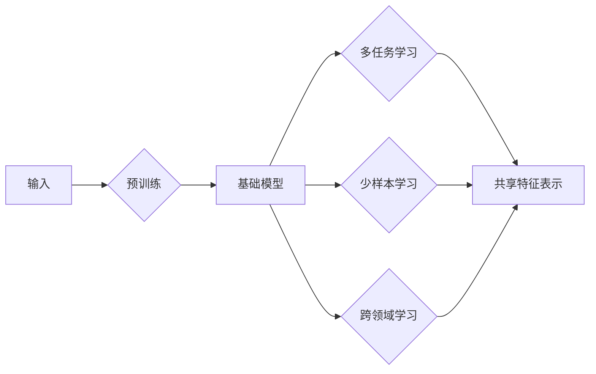

# 迁移学习与基础模型的发展

> 关键词：迁移学习，基础模型，预训练，多任务学习，无监督学习，少样本学习，跨领域学习

## 1. 背景介绍

随着深度学习技术的飞速发展，机器学习模型在各个领域都取得了显著的成果。然而，传统的机器学习模型往往需要大量的标注数据进行训练，这在实际应用中往往难以实现。迁移学习（Transfer Learning）的出现为解决这个问题提供了一种新的思路。迁移学习利用已有的模型知识迁移到新的任务中，从而减少对新任务数据的依赖，提高模型训练的效率和效果。

本文将深入探讨迁移学习与基础模型的发展，分析其核心概念、算法原理、应用场景，并展望其未来趋势和挑战。

## 2. 核心概念与联系

### 2.1 核心概念

#### 2.1.1 迁移学习

迁移学习（Transfer Learning）是指将一个学习任务（源任务）学到的知识迁移到另一个学习任务（目标任务）中，从而提高目标任务的性能。在迁移学习中，源任务和目标任务通常存在一定关联，但并非完全相同。

#### 2.1.2 基础模型

基础模型（Foundation Model）是指在大规模数据集上预训练的、能够处理多种任务的通用模型。基础模型通常具有以下特点：

- 预训练：在大量无标签数据上训练，学习通用的特征表示。
- 多样性：能够处理多种类型的任务，如图像、文本、音频等。
- 可迁移：将预训练的知识迁移到新的任务中。

#### 2.1.3 预训练

预训练（Pre-training）是指在大量无标签数据上训练模型，使其学习到通用的特征表示。预训练通常采用无监督学习或自监督学习方法。

#### 2.1.4 多任务学习

多任务学习（Multi-task Learning）是指同时学习多个相关任务，通过共享底层特征表示，提高模型在各个任务上的性能。

#### 2.1.5 少样本学习

少样本学习（Few-shot Learning）是指在只有少量样本的情况下学习新任务。少样本学习是迁移学习的一个重要分支。

#### 2.1.6 跨领域学习

跨领域学习（Cross-Domain Learning）是指在不同领域之间迁移知识。跨领域学习在现实世界中具有重要意义，如在不同设备、不同用户之间迁移知识。

### 2.2 核心概念原理和架构的 Mermaid 流程图



## 3. 核心算法原理 & 具体操作步骤

### 3.1 算法原理概述

迁移学习的基本原理是利用源任务的模型知识迁移到目标任务中。具体来说，可以分为以下几种方法：

- 特征迁移：将源任务的模型特征表示迁移到目标任务中。
- 参数迁移：将源任务的模型参数迁移到目标任务中。
- 模型迁移：直接将源任务的模型迁移到目标任务中。

### 3.2 算法步骤详解

1. 选择合适的源任务和目标任务。
2. 在源任务上预训练模型，学习通用的特征表示。
3. 将预训练模型迁移到目标任务中，调整模型参数以适应目标任务。
4. 在目标任务上进行微调，优化模型性能。

### 3.3 算法优缺点

#### 3.3.1 优点

- 减少对新任务数据的依赖，降低数据收集成本。
- 提高模型训练效率，缩短训练时间。
- 提升模型性能，特别是在小样本场景下。

#### 3.3.2 缺点

- 源任务和目标任务之间关联性较弱时，迁移效果可能不佳。
- 预训练模型可能存在偏差，迁移到目标任务后可能导致性能下降。
- 需要选择合适的源任务和预训练模型。

### 3.4 算法应用领域

迁移学习在各个领域都有广泛的应用，以下是一些典型的应用场景：

- 图像识别：人脸识别、物体识别、场景识别等。
- 自然语言处理：文本分类、机器翻译、情感分析等。
- 医学影像：疾病诊断、肿瘤检测、分子结构预测等。
- 声音识别：语音识别、语音合成、音乐生成等。

## 4. 数学模型和公式 & 详细讲解 & 举例说明

### 4.1 数学模型构建

假设源任务和目标任务的输入空间分别为 $\mathcal{X}$ 和 $\mathcal{X}'$，输出空间分别为 $\mathcal{Y}$ 和 $\mathcal{Y}'$，模型参数为 $\theta$。则迁移学习可以表示为以下数学模型：

$$
M(\theta) : \mathcal{X} \rightarrow \mathcal{Y}, M'(\theta) : \mathcal{X}' \rightarrow \mathcal{Y}'
$$

其中 $M(\theta)$ 表示源任务的模型，$M'(\theta)$ 表示目标任务的模型。

### 4.2 公式推导过程

以特征迁移为例，假设源任务的模型 $M(\theta)$ 由特征提取层 $F$ 和分类层 $C$ 组成，即 $M(\theta) = F \circ C$。则目标任务的模型 $M'(\theta)$ 可以通过迁移 $F$ 层的参数来获得，即 $M'(\theta) = F \circ C'$，其中 $C'$ 为目标任务的分类层。

### 4.3 案例分析与讲解

以下以图像分类任务为例，分析迁移学习的过程。

假设我们有一个预训练模型 $M(\theta)$，其特征提取层为卷积神经网络（CNN），分类层为softmax分类器。我们需要将该模型迁移到另一个图像分类任务上，即 $M'(\theta)$。

1. 在源任务上预训练模型 $M(\theta)$，学习通用的特征表示。
2. 将 $F$ 层的参数迁移到目标任务，得到新的模型 $M'(\theta) = F \circ C'$。
3. 在目标任务上进行微调，调整 $C'$ 层的参数以适应目标任务。

通过上述步骤，我们可以利用预训练模型的知识，在目标任务上获得较好的性能。

## 5. 项目实践：代码实例和详细解释说明

### 5.1 开发环境搭建

以下以TensorFlow和Keras为例，搭建迁移学习的开发环境。

```bash
pip install tensorflow keras
```

### 5.2 源代码详细实现

以下是一个使用TensorFlow和Keras实现的图像分类迁移学习示例。

```python
import tensorflow as tf
from tensorflow.keras.applications import ResNet50
from tensorflow.keras.models import Model

# 加载预训练模型
base_model = ResNet50(weights='imagenet', include_top=False)

# 定义目标任务的模型
x = tf.keras.layers.Input(shape=(224, 224, 3))
features = base_model(x)
predictions = tf.keras.layers.Dense(10, activation='softmax')(features)

# 创建新的模型
model = Model(inputs=x, outputs=predictions)

# 微调目标任务的模型
model.compile(optimizer='adam', loss='categorical_crossentropy', metrics=['accuracy'])
model.fit(train_data, train_labels, validation_data=(val_data, val_labels), epochs=5)
```

### 5.3 代码解读与分析

以上代码展示了如何使用预训练的ResNet50模型进行迁移学习。首先，我们加载了预训练的ResNet50模型，并只保留了特征提取层。然后，我们定义了目标任务的模型，并在其顶部添加了softmax分类器。最后，我们在目标任务数据上微调了模型的分类层参数。

### 5.4 运行结果展示

通过运行上述代码，我们可以看到模型在目标任务上的性能。

## 6. 实际应用场景

迁移学习在各个领域都有广泛的应用，以下是一些典型的应用场景：

### 6.1 图像识别

- 人脸识别
- 物体识别
- 场景识别

### 6.2 自然语言处理

- 文本分类
- 机器翻译
- 情感分析

### 6.3 医学影像

- 疾病诊断
- 肿瘤检测
- 分子结构预测

### 6.4 声音识别

- 语音识别
- 语音合成
- 音乐生成

## 7. 工具和资源推荐

### 7.1 学习资源推荐

- 《深度学习》（Goodfellow, Bengio, Courville）
- 《迁移学习：原理与实现》（张祥前）
- 《深度学习与计算机视觉》（杨帆）

### 7.2 开发工具推荐

- TensorFlow
- Keras
- PyTorch

### 7.3 相关论文推荐

- “ImageNet Classification with Deep Convolutional Neural Networks”（ Krizhevsky, Sutskever, Hinton）
- “A Study on Transfer Learning for Image Classification”（ Pan, Yang）
- “Multitask Learning”（Caruana）

## 8. 总结：未来发展趋势与挑战

### 8.1 研究成果总结

迁移学习与基础模型的发展为机器学习领域带来了新的突破，为解决实际应用中的数据瓶颈、提高模型性能提供了有效途径。迁移学习和基础模型在各个领域都取得了显著的应用成果，为人工智能的发展做出了重要贡献。

### 8.2 未来发展趋势

1. 更大规模的基础模型：随着计算能力的提升，未来会有更多更大规模的基础模型出现，以处理更加复杂的任务。
2. 多模态迁移学习：将图像、文本、音频等多种模态信息进行整合，实现更全面的迁移学习。
3. 零样本学习：在几乎没有样本的情况下学习新任务，减少对标注数据的依赖。
4. 跨领域迁移学习：在不同领域之间迁移知识，提高模型的泛化能力。

### 8.3 面临的挑战

1. 数据分布差异：源任务和目标任务的数据分布差异可能导致迁移效果不佳。
2. 模型偏差：预训练模型可能存在偏见，迁移到目标任务后可能导致歧视性输出。
3. 计算资源：大规模基础模型的训练和推理需要大量的计算资源。

### 8.4 研究展望

未来，迁移学习和基础模型的研究将朝着以下方向发展：

1. 更有效的迁移学习算法：研究更加鲁棒、高效的迁移学习算法，提高迁移效果。
2. 可解释的迁移学习：研究可解释的迁移学习模型，提高模型的可信度和透明度。
3. 伦理和社会影响：关注迁移学习和基础模型的社会影响，确保技术的安全性和公正性。

## 9. 附录：常见问题与解答

**Q1：迁移学习是否适用于所有任务？**

A：迁移学习并非适用于所有任务。当源任务和目标任务的关联性较弱时，迁移效果可能不佳。

**Q2：如何选择合适的源任务和目标任务？**

A：选择合适的源任务和目标任务需要考虑以下几点：

- 数据分布：源任务和目标任务的数据分布应尽可能相似。
- 任务相关性：源任务和目标任务的相关性越高，迁移效果越好。
- 模型复杂性：选择与目标任务复杂性相当的源任务。

**Q3：如何解决模型偏差问题？**

A：解决模型偏差问题可以从以下几个方面入手：

- 数据增强：通过数据增强技术增加数据的多样性，降低模型对特定样本的依赖。
- 模型正则化：使用正则化技术，如Dropout、L1/L2正则化等，减少模型的过拟合。
- 数据清洗：清洗数据中的偏见和错误信息。

**Q4：迁移学习是否可以提高模型性能？**

A：在适当的情况下，迁移学习可以提高模型性能，特别是在小样本场景下。

**Q5：如何评估迁移学习的效果？**

A：可以使用以下指标评估迁移学习的效果：

- 性能提升：比较迁移前后模型的性能提升。
- 数据效率：比较迁移前后模型对数据的需求。
- 训练时间：比较迁移前后模型的训练时间。

作者：禅与计算机程序设计艺术 / Zen and the Art of Computer Programming