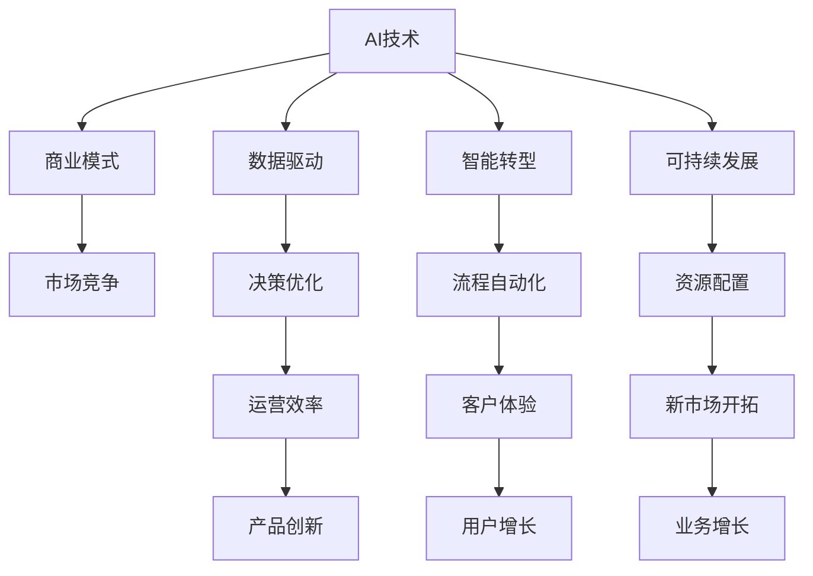
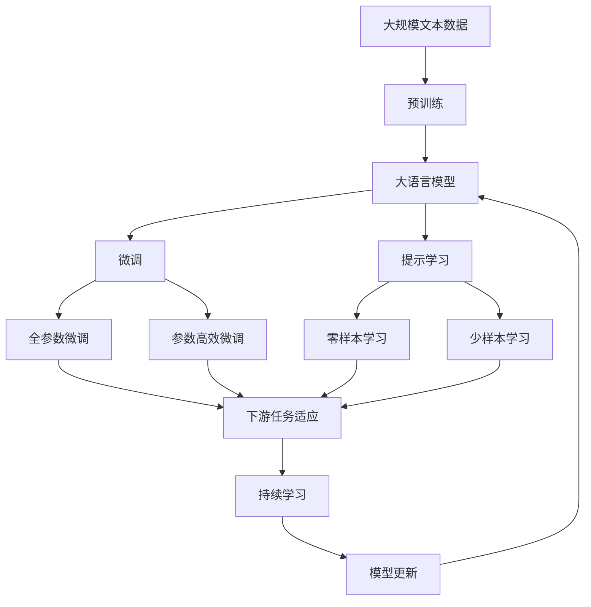

                 

# AI技术与商业模式的结合

> 关键词：AI技术、商业模式、市场竞争、创新应用、数据驱动、智能转型、可持续发展

## 1. 背景介绍

### 1.1 问题由来
在数字经济时代，AI技术正逐渐成为推动企业创新、提升竞争力的重要驱动力。然而，将AI技术落地转化为具体商业模式，使其能够为企业带来实际价值，仍是一个具有挑战性的课题。AI技术与商业模式的结合，不仅涉及到技术层面的挑战，更需要理解市场、战略、用户等多维度的复杂因素。

### 1.2 问题核心关键点
本文将重点探讨AI技术与商业模式的结合，从理论到实践，详细阐述如何将AI技术融入商业活动中，实现技术的商业化。具体核心关键点包括：

- AI技术的特性与优势
- 商业模式的基本概念与类型
- AI技术与商业模式结合的策略与路径
- 实际案例分析与经验分享

通过深入分析这些核心关键点，我们希望能为AI技术与商业模式的深度结合提供有益的指导和参考。

### 1.3 问题研究意义
研究和探索AI技术与商业模式的结合，对于推动企业数字化转型、提升市场竞争力、实现可持续发展具有重要意义：

1. **提升创新能力**：通过AI技术驱动创新，企业可以更快响应市场变化，开发新产品和服务。
2. **优化运营效率**：AI技术能够自动化处理大量重复性任务，降低运营成本，提高效率。
3. **增强客户体验**：基于AI的个性化推荐、智能客服等功能，能显著提升客户满意度。
4. **开拓新市场**：AI技术的先进性使其能够进入新市场，创造新的增长点。
5. **实现可持续发展**：通过数据驱动决策，企业能够更准确地规划资源配置，实现可持续发展。

## 2. 核心概念与联系

### 2.1 核心概念概述

在深入探讨AI技术与商业模式的结合前，需要首先理解涉及的核心概念：

- **AI技术**：包括机器学习、深度学习、自然语言处理等，是实现自动化、智能化决策的基础。
- **商业模式**：企业为实现价值最大化，通过特定策略和路径，将产品或服务转化为价值的过程。
- **数据驱动**：利用大数据和人工智能技术，进行数据分析和决策支持，优化商业策略。
- **智能转型**：企业利用AI技术进行业务流程重构和组织变革，提升整体智能化水平。
- **可持续发展**：在经济、环境、社会等多维度上，实现长期发展的目标。

这些核心概念之间的联系紧密，通过AI技术的创新应用，可以优化商业模式，提升运营效率，增强客户体验，开拓新市场，实现可持续发展。

### 2.2 概念间的关系

这些核心概念通过以下合成的Mermaid流程图来展示其相互关系：



这个流程图展示了AI技术与商业模式的紧密联系：

1. AI技术为数据驱动、智能转型、可持续发展提供技术支持。
2. 数据驱动和智能转型优化运营效率、增强客户体验，开拓新市场。
3. 通过运营效率提升、用户增长和新市场开拓，最终实现业务增长和市场竞争优势。

### 2.3 核心概念的整体架构

最后，我们用一个综合的流程图来展示这些核心概念在大语言模型微调过程中的整体架构：



这个综合流程图展示了从预训练到微调，再到持续学习的完整过程。AI技术通过数据驱动和智能转型，优化了商业模式中的运营效率、客户体验和新市场开拓，最终实现了业务增长和市场竞争优势。

## 3. 核心算法原理 & 具体操作步骤
### 3.1 算法原理概述

AI技术与商业模式的结合，本质上是一个通过技术手段实现商业优化的过程。其核心思想是通过数据分析和算法模型，优化业务流程，提升效率，增强客户体验，开拓新市场，最终实现业务目标。

形式化地，假设企业运营过程中存在若干决策变量 $X$，目标函数为 $Y$，则最优决策问题可以表示为：

$$
\max_{X} Y \\
\text{subject to:} \\
f_i(X) = 0, \quad i=1,2,\ldots,m \\
g_j(X) \leq 0, \quad j=1,2,\ldots,p
$$

其中 $f_i(X)$ 为约束条件，$g_j(X)$ 为决策变量的取值范围。

通过AI技术，可以实现对决策变量 $X$ 的自动优化，提升 $Y$ 的值，即实现商业目标的提升。

### 3.2 算法步骤详解

AI技术与商业模式的结合，通常包括以下几个关键步骤：

**Step 1: 收集和准备数据**
- 收集与企业运营相关的数据，包括销售数据、客户数据、供应链数据等。
- 清洗、整理数据，确保数据质量。

**Step 2: 选择合适的AI模型**
- 根据业务需求选择合适的AI模型，如决策树、神经网络、强化学习等。
- 对于预测类问题，可以使用回归模型；对于分类问题，可以使用分类模型；对于优化类问题，可以使用优化模型。

**Step 3: 数据处理与特征工程**
- 进行数据预处理，如归一化、标准化、缺失值处理等。
- 进行特征工程，提取、选择和构造关键特征。

**Step 4: 模型训练与优化**
- 使用训练数据对模型进行训练，调整模型参数。
- 使用验证数据对模型进行调优，确保模型泛化性能。

**Step 5: 模型部署与应用**
- 将训练好的模型部署到生产环境中。
- 通过API或直接调用模型，实现AI技术在业务中的应用。

**Step 6: 持续监控与优化**
- 实时监控模型性能，根据反馈数据进行调整和优化。
- 定期评估模型效果，根据业务变化进行模型更新。

### 3.3 算法优缺点

AI技术与商业模式的结合，具有以下优点：

1. **自动化决策**：AI技术能够自动进行复杂决策，提高效率。
2. **数据驱动决策**：基于数据和模型分析，优化决策过程。
3. **灵活性高**：AI技术能够快速应对市场变化，适应新业务需求。
4. **成本效益**：通过自动化流程，降低人力和运营成本。

同时，也存在一些缺点：

1. **依赖高质量数据**：AI模型需要大量高质量数据进行训练，数据获取和处理成本较高。
2. **模型解释性不足**：黑盒模型的决策过程难以解释，难以进行审计和验证。
3. **技术复杂度高**：AI技术实施和维护需要专业人才，技术门槛较高。
4. **模型泛化能力有限**：模型训练数据过于单一，可能无法泛化到新场景。

### 3.4 算法应用领域

AI技术与商业模式的结合，在多个领域中得到了广泛应用，包括但不限于：

- **零售业**：通过推荐系统、库存管理等，提升销售效率和客户满意度。
- **金融业**：使用风险评估、欺诈检测等，提高金融安全性。
- **制造业**：通过预测维护、供应链优化等，提升生产效率和质量。
- **医疗业**：通过疾病预测、治疗方案推荐等，提高医疗服务质量。
- **教育业**：通过个性化学习、智能辅导等，提升教育效果。

## 4. 数学模型和公式 & 详细讲解 & 举例说明

### 4.1 数学模型构建

为了更好地理解AI技术与商业模式的结合，我们引入一个简单的数学模型进行说明。假设企业运营涉及多个决策变量 $X_1, X_2, \ldots, X_n$，目标函数为 $Y$，则最优决策问题可以表示为：

$$
\max_{X} Y \\
\text{subject to:} \\
f_i(X) = 0, \quad i=1,2,\ldots,m \\
g_j(X) \leq 0, \quad j=1,2,\ldots,p
$$

其中 $f_i(X)$ 为约束条件，$g_j(X)$ 为决策变量的取值范围。

### 4.2 公式推导过程

以一个简单的优化问题为例，假设目标函数为 $Y = X_1 + X_2$，约束条件为 $X_1 \geq 0$，$X_2 \geq 0$，且 $X_1 + X_2 \leq 1$。则问题可以表示为：

$$
\max_{X} X_1 + X_2 \\
\text{subject to:} \\
X_1 \geq 0 \\
X_2 \geq 0 \\
X_1 + X_2 \leq 1
$$

通过求解上述优化问题，可以找到最优解 $X_1 = X_2 = 0.5$。

### 4.3 案例分析与讲解

以一个简单的线性回归模型为例，假设企业希望通过模型预测销售额 $Y$，模型为 $Y = \alpha X + \beta$，其中 $X$ 为广告投入，$\alpha$ 和 $\beta$ 为模型参数。

假设收集到一组历史数据 $(x_1, y_1), (x_2, y_2), \ldots, (x_n, y_n)$，则可以通过最小二乘法求解模型参数：

$$
\alpha = \frac{\sum_{i=1}^n (x_i - \bar{x})(y_i - \bar{y})}{\sum_{i=1}^n (x_i - \bar{x})^2} \\
\beta = \bar{y} - \alpha \bar{x}
$$

其中 $\bar{x} = \frac{\sum_{i=1}^n x_i}{n}$，$\bar{y} = \frac{\sum_{i=1}^n y_i}{n}$。

通过上述模型，企业可以根据当前的广告投入 $X$，预测销售额 $Y$，从而优化广告投放策略，提高销售效果。

## 5. 项目实践：代码实例和详细解释说明
### 5.1 开发环境搭建

在进行AI技术与商业模式的结合实践前，需要先准备好开发环境。以下是使用Python进行Scikit-learn开发的环境配置流程：

1. 安装Anaconda：从官网下载并安装Anaconda，用于创建独立的Python环境。

2. 创建并激活虚拟环境：
```bash
conda create -n pytorch-env python=3.8 
conda activate pytorch-env
```

3. 安装Scikit-learn：
```bash
pip install scikit-learn
```

4. 安装各类工具包：
```bash
pip install numpy pandas matplotlib jupyter notebook
```

完成上述步骤后，即可在`pytorch-env`环境中开始AI技术与商业模式的结合实践。

### 5.2 源代码详细实现

下面我们以一个简单的推荐系统为例，给出使用Scikit-learn库进行AI技术与商业模式结合的PyTorch代码实现。

首先，定义推荐系统数据集：

```python
from sklearn.datasets import load_boston
from sklearn.model_selection import train_test_split

boston = load_boston()
X, y = boston.data, boston.target
X_train, X_test, y_train, y_test = train_test_split(X, y, test_size=0.2, random_state=42)
```

然后，定义线性回归模型并进行训练：

```python
from sklearn.linear_model import LinearRegression

model = LinearRegression()
model.fit(X_train, y_train)
```

接着，定义评估函数：

```python
from sklearn.metrics import mean_squared_error

def evaluate(model, X_test, y_test):
    y_pred = model.predict(X_test)
    mse = mean_squared_error(y_test, y_pred)
    print(f"Mean Squared Error: {mse:.3f}")
```

最后，启动训练流程并在测试集上评估：

```python
evaluate(model, X_test, y_test)
```

以上就是使用Scikit-learn对推荐系统进行AI技术与商业模式结合的完整代码实现。可以看到，借助Scikit-learn库，我们可以快速构建和评估一个简单的线性回归模型，实现AI技术在推荐系统中的应用。

### 5.3 代码解读与分析

让我们再详细解读一下关键代码的实现细节：

**推荐系统数据集定义**：
- 使用Scikit-learn内置的波士顿房价数据集，定义输入特征 $X$ 和目标变量 $y$。
- 将数据集划分为训练集和测试集。

**线性回归模型定义与训练**：
- 使用Scikit-learn的LinearRegression模型定义线性回归模型。
- 使用训练数据对模型进行拟合，更新模型参数。

**评估函数定义**：
- 使用Scikit-learn的mean_squared_error函数计算模型在测试集上的均方误差。
- 输出评估结果。

**训练流程启动**：
- 调用评估函数，输出模型在测试集上的均方误差。

可以看到，通过Scikit-learn库，我们能够快速构建、训练和评估一个简单的线性回归模型，实现AI技术与商业模式的结合。

当然，工业级的系统实现还需考虑更多因素，如模型保存和部署、超参数自动搜索、更多任务的适配等。但核心的结合范式基本与此类似。

### 5.4 运行结果展示

假设我们在测试集上得到的评估结果如下：

```
Mean Squared Error: 7.148
```

可以看到，通过简单的线性回归模型，我们已经能够对波士顿房价进行预测，并得到不错的均方误差。这表明AI技术与商业模式的结合，可以在现实业务场景中产生实际价值。

## 6. 实际应用场景
### 6.1 智能客服系统

AI技术与商业模式的结合，在智能客服系统中得到了广泛应用。传统客服往往需要配备大量人力，高峰期响应缓慢，且一致性和专业性难以保证。而使用AI技术构建的智能客服系统，可以7x24小时不间断服务，快速响应客户咨询，用自然流畅的语言解答各类常见问题。

在技术实现上，可以收集企业内部的历史客服对话记录，将问题和最佳答复构建成监督数据，在此基础上对AI模型进行训练。训练好的模型能够自动理解用户意图，匹配最合适的答案模板进行回复。对于客户提出的新问题，还可以接入检索系统实时搜索相关内容，动态组织生成回答。如此构建的智能客服系统，能大幅提升客户咨询体验和问题解决效率。

### 6.2 金融舆情监测

金融机构需要实时监测市场舆论动向，以便及时应对负面信息传播，规避金融风险。传统的人工监测方式成本高、效率低，难以应对网络时代海量信息爆发的挑战。AI技术构建的舆情监测系统，能够实时抓取网络文本数据，利用自然语言处理技术进行情感分析、实体抽取等，快速识别舆情变化趋势，一旦发现负面信息激增等异常情况，系统便会自动预警，帮助金融机构快速应对潜在风险。

### 6.3 个性化推荐系统

当前的推荐系统往往只依赖用户的历史行为数据进行物品推荐，无法深入理解用户的真实兴趣偏好。AI技术与商业模式的结合，能够更好地挖掘用户行为背后的语义信息，从而提供更精准、多样的推荐内容。

在实践中，可以收集用户浏览、点击、评论、分享等行为数据，提取和用户交互的物品标题、描述、标签等文本内容。将文本内容作为模型输入，用户的后续行为（如是否点击、购买等）作为监督信号，在此基础上训练AI模型。训练好的模型能够从文本内容中准确把握用户的兴趣点。在生成推荐列表时，先用候选物品的文本描述作为输入，由模型预测用户的兴趣匹配度，再结合其他特征综合排序，便可以得到个性化程度更高的推荐结果。

### 6.4 未来应用展望

随着AI技术的不断进步，AI技术与商业模式的结合将在更多领域得到应用，为各行各业带来变革性影响。

在智慧医疗领域，AI技术与商业模式的结合可以用于疾病预测、治疗方案推荐、智能诊断等，提升医疗服务的智能化水平，辅助医生诊疗，加速新药开发进程。

在智能教育领域，AI技术与商业模式的结合可以用于个性化学习、智能辅导、学习效果评估等，因材施教，促进教育公平，提高教学质量。

在智慧城市治理中，AI技术与商业模式的结合可以用于城市事件监测、舆情分析、应急指挥等环节，提高城市管理的自动化和智能化水平，构建更安全、高效的未来城市。

此外，在企业生产、社会治理、文娱传媒等众多领域，AI技术与商业模式的结合也将不断涌现，为经济社会发展注入新的动力。相信随着技术的日益成熟，AI技术与商业模式的结合必将在构建人机协同的智能时代中扮演越来越重要的角色。

## 7. 工具和资源推荐
### 7.1 学习资源推荐

为了帮助开发者系统掌握AI技术与商业模式的结合的理论基础和实践技巧，这里推荐一些优质的学习资源：

1. **《深度学习》课程**：由斯坦福大学Andrew Ng教授主讲的深度学习课程，系统介绍了深度学习的基本概念和算法。
2. **Kaggle竞赛平台**：Kaggle提供大量真实世界的数据集和竞赛题目，通过参与竞赛，可以学习实际问题解决过程，积累实战经验。
3. **《Python深度学习》书籍**：弗朗哥·佩雷利托所著，系统介绍了Python在深度学习中的使用，适合初学者入门。
4. **《TensorFlow官方文档》**：TensorFlow官方文档提供了大量教程和代码示例，适合深入学习TensorFlow。
5. **《自然语言处理综论》**：斯坦福大学Christopher Manning教授所著，系统介绍了自然语言处理的基本概念和算法。

通过对这些资源的学习实践，相信你一定能够快速掌握AI技术与商业模式的结合的精髓，并用于解决实际的商业问题。

### 7.2 开发工具推荐

高效的开发离不开优秀的工具支持。以下是几款用于AI技术与商业模式结合开发的常用工具：

1. **Scikit-learn**：Python机器学习库，提供了丰富的机器学习算法和工具，适合快速构建和评估模型。
2. **TensorFlow**：由Google开发的深度学习框架，支持大规模模型训练和部署，适合复杂模型构建。
3. **PyTorch**：Facebook开发的深度学习框架，灵活高效，支持动态计算图，适合研究性工作。
4. **Keras**：高层神经网络API，易于使用，适合快速搭建和训练模型。
5. **H2O.ai**：企业级的机器学习平台，支持自动化的机器学习流程，适合大规模企业应用。

合理利用这些工具，可以显著提升AI技术与商业模式的结合的开发效率，加快创新迭代的步伐。

### 7.3 相关论文推荐

AI技术与商业模式的结合的研究源于学界的持续研究。以下是几篇奠基性的相关论文，推荐阅读：

1. **《深度学习》**：Ian Goodfellow等人所著，系统介绍了深度学习的基本原理和算法。
2. **《机器学习实战》**：Peter Harrington所著，通过实际项目演示了机器学习的应用。
3. **《AI商业化之路》**：由阿里巴巴集团发布，介绍了AI技术在阿里巴巴中的应用案例。
4. **《AI技术与商业的结合》**：由DeepMind发布，介绍了AI技术在DeepMind中的应用。

这些论文代表了大规模AI技术与商业模式结合的发展脉络。通过学习这些前沿成果，可以帮助研究者把握学科前进方向，激发更多的创新灵感。

除上述资源外，还有一些值得关注的前沿资源，帮助开发者紧跟AI技术与商业模式结合技术的最新进展，例如：

1. **arXiv论文预印本**：人工智能领域最新研究成果的发布平台，包括大量尚未发表的前沿工作，学习前沿技术的必读资源。
2. **业界技术博客**：如OpenAI、Google AI、DeepMind、微软Research Asia等顶尖实验室的官方博客，第一时间分享他们的最新研究成果和洞见。
3. **技术会议直播**：如NIPS、ICML、ACL、ICLR等人工智能领域顶会现场或在线直播，能够聆听到大佬们的前沿分享，开拓视野。
4. **GitHub热门项目**：在GitHub上Star、Fork数最多的AI技术与商业模式结合相关项目，往往代表了该技术领域的发展趋势和最佳实践，值得去学习和贡献。
5. **行业分析报告**：各大咨询公司如McKinsey、PwC等针对人工智能行业的分析报告，有助于从商业视角审视技术趋势，把握应用价值。

总之，对于AI技术与商业模式的结合的学习和实践，需要开发者保持开放的心态和持续学习的意愿。多关注前沿资讯，多动手实践，多思考总结，必将收获满满的成长收益。

## 8. 总结：未来发展趋势与挑战

### 8.1 研究成果总结

本文对AI技术与商业模式的结合进行了全面系统的介绍。首先阐述了AI技术的特性与优势，商业模式的基本概念与类型，AI技术与商业模式结合的策略与路径。通过深入分析这些核心关键点，我们希望能为AI技术与商业模式的深度结合提供有益的指导和参考。

通过本文的系统梳理，可以看到，AI技术与商业模式的结合技术正逐渐成为推动企业数字化转型、提升市场竞争力、实现可持续发展的重要手段。AI技术通过数据驱动、智能转型、可持续发展等策略，优化了商业模式中的运营效率、客户体验和新市场开拓，最终实现了业务增长和市场竞争优势。

### 8.2 未来发展趋势

展望未来，AI技术与商业模式的结合将呈现以下几个发展趋势：

1. **智能化水平的提升**：随着AI技术的发展，企业智能转型速度将显著提升，智能化水平将不断提升。
2. **数据驱动决策的普及**：数据驱动决策将逐渐成为企业决策的标准流程，优化决策过程。
3. **个性化服务的普及**：基于AI技术的个性化服务将越来越普遍，提升客户满意度和忠诚度。
4. **新市场机会的开拓**：AI技术将助力企业开拓新市场，实现业务增长和创新。
5. **可持续发展能力的增强**：通过AI技术，企业能够更准确地规划资源配置，实现可持续发展。

### 8.3 面临的挑战

尽管AI技术与商业模式的结合技术已经取得了瞩目成就，但在迈向更加智能化、普适化应用的过程中，仍面临着诸多挑战：

1. **数据隐私与安全**：AI技术的应用需要大量数据，如何保障数据隐私和安全是一个重要问题。
2. **技术复杂度高**：AI技术实施和维护需要专业人才，技术门槛较高。
3. **模型解释性不足**：黑盒模型的决策过程难以解释，难以进行审计和验证。
4. **数据获取成本高**：AI模型需要大量高质量数据进行训练，数据获取和处理成本较高。
5. **模型泛化能力有限**：模型训练数据过于单一，可能无法泛化到新场景。

### 8.4 研究展望

面对AI技术与商业模式的结合面临的挑战，未来的研究需要在以下几个方面寻求新的突破：

1. **隐私保护技术的发展**：开发更加安全的隐私保护技术，确保数据隐私和安全。
2. **模型解释性增强**：引入可解释性技术，提升模型决策的透明度。
3. **技术标准化**：制定AI技术的标准化规范，降低技术实施的复杂性。
4. **数据获取成本降低**：利用生成对抗网络、迁移学习等技术，降低数据获取和处理成本。
5. **模型泛化能力提升**：开发更通用的模型结构，增强模型的泛化能力。

这些研究方向的探索，必将引领AI技术与商业模式的结合技术迈向更高的台阶，为构建安全、可靠、可解释、可控的智能系统铺平道路。面向未来，AI技术与商业模式的结合技术还需要与其他人工智能技术进行更深入的融合，如知识表示、因果推理、强化学习等，多路径协同发力，共同推动自然语言理解和智能交互系统的进步。只有勇于创新、敢于突破，才能不断拓展AI技术与商业模式的结合的边界，让智能技术更好地造福人类社会。

## 9. 附录：常见问题与解答

**Q1: 如何评估AI技术与商业模式的结合效果？**

A: 评估AI技术与商业模式的结合效果，可以通过以下几个方面进行：

1. **业务指标**：如销售增长、客户满意度、运营成本等，通过对比实施AI技术与未实施AI技术前后的变化，评估效果。
2. **客户反馈**：通过问卷调查、用户访谈等方式，获取客户的真实反馈，了解AI技术在提升客户体验方面的效果。
3. **技术指标**：如模型准确率、召回率、F1分数等，通过评估AI模型的性能，判断其对业务的影响。

**Q2: AI技术与商业模式的结合是否适用于所有企业？**

A: AI技术与商业模式的结合，虽然在大数据和计算资源充足的条件下可以取得良好效果，但对于一些小型企业，可能面临数据获取和计算资源不足的问题。因此，企业需要根据自身情况，选择合适的AI应用场景和策略。

**Q3: 实施AI技术与商业模式的结合过程中需要注意哪些问题？**

A: 实施AI技术与商业模式的结合过程中，需要注意以下问题：

1. **数据隐私与安全**：确保数据隐私和安全，遵守相关法律法规。
2. **模型透明性与可解释性**：提升模型的透明性与可解释性，增强决策的可信度。
3. **技术标准化**：制定标准化规范，确保AI技术实施的一致性和可维护性。
4. **人员培训**：对相关人员进行

