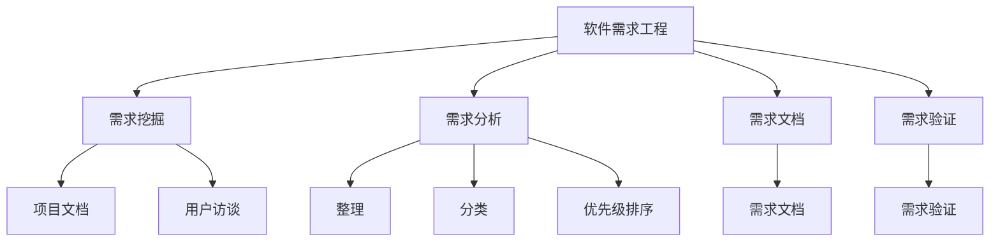
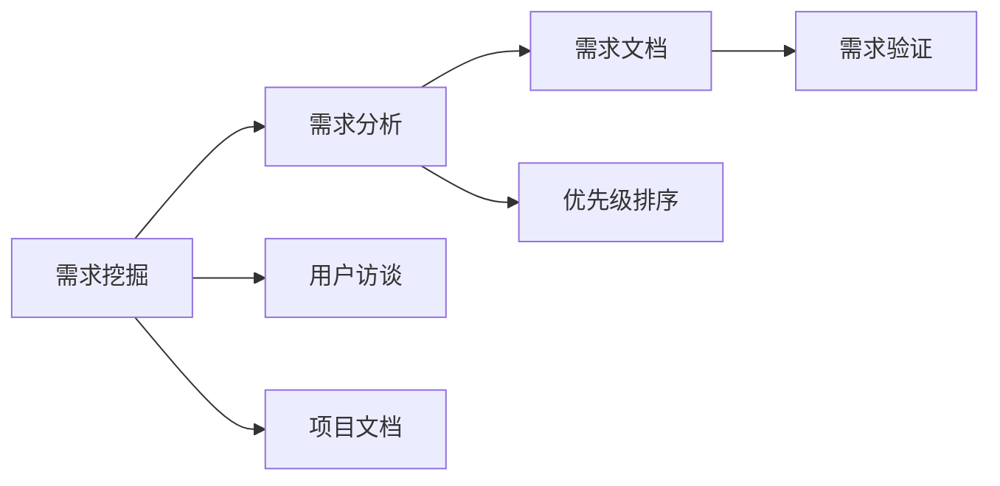
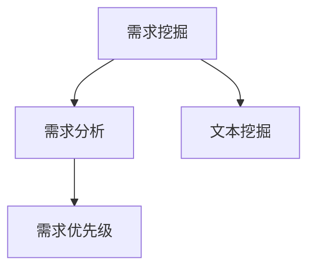
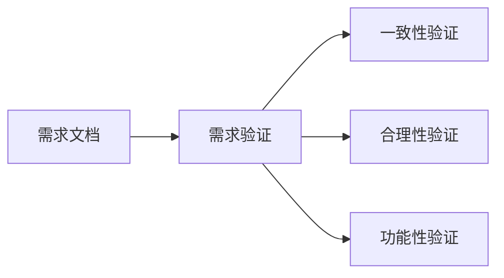
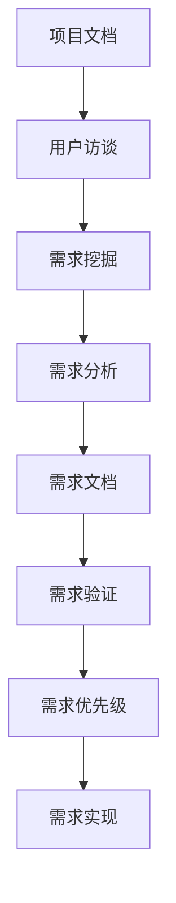

                 

# AI辅助的软件需求工程

> 关键词：软件需求工程, AI辅助, 需求挖掘, 需求分析, 需求文档, 需求验证

## 1. 背景介绍

### 1.1 问题由来
在软件开发过程中，需求是项目的起点和基石。它决定了软件的功能、性能、接口等方方面面，直接关系着软件的成功与否。然而，现实的软件开发过程中，需求工程经常面临诸多挑战：

- **需求不明确**：需求往往是不确定的、模糊的，需要反复沟通和调整。
- **需求遗漏**：遗漏一些关键需求，导致功能不完整或功能缺失。
- **需求冲突**：不同利益方对于需求的理解不同，导致冲突和误解。
- **需求变更**：需求在项目过程中不断变化，增加了开发难度和成本。

传统的需求工程方法往往依靠人工沟通、文档撰写和回顾等，存在效率低下、质量不高等问题。随着AI技术的发展，越来越多的AI辅助工具被引入到需求工程中，以提升需求挖掘、分析、验证等环节的自动化水平。

### 1.2 问题核心关键点
AI辅助需求工程的核心是利用AI技术提升需求工程各环节的自动化水平，具体包括以下几个方面：

- **需求挖掘**：通过文本挖掘、自然语言处理(NLP)等技术，从项目文档、用户访谈中提取需求。
- **需求分析**：利用机器学习算法分析用户需求、竞争产品，预测需求优先级。
- **需求文档**：使用自动摘要、实体识别等技术生成高质量的需求文档。
- **需求验证**：通过自然语言推理(NLI)、知识图谱等技术，自动验证需求的一致性和合理性。

AI辅助需求工程能够显著提高需求工程的效率和质量，确保软件能够真正满足用户需求，提升软件开发的成功率。

### 1.3 问题研究意义
AI辅助需求工程的研究和应用，对于提升软件开发效率、降低开发成本、提升软件质量具有重要意义：

- **提高效率**：自动化需求挖掘和分析过程，减少人工工作量。
- **降低成本**：减少需求变更带来的额外成本和人力投入。
- **提升质量**：通过智能辅助，确保需求文档的准确性和完整性。
- **增强可理解性**：自动生成的需求文档更加清晰、易于理解。
- **加速迭代**：缩短需求验证和反馈周期，快速迭代开发。

此外，AI辅助需求工程还能够促进跨领域知识共享，加速企业知识管理系统的构建，为企业的数字化转型提供有力支持。

## 2. 核心概念与联系

### 2.1 核心概念概述

为了更好地理解AI辅助需求工程，本节将介绍几个密切相关的核心概念：

- **软件需求工程(Software Requirements Engineering, SRE)**：从软件立项到验收的整个过程中，对软件的需求进行明确、验证、管理的一系列活动。

- **需求挖掘(Requirements Mining)**：从项目文档、用户访谈中提取需求的过程，是需求分析的第一步。

- **需求分析(Requirements Analysis)**：对提取出的需求进行整理、分类、分析和优先级排序的过程。

- **需求文档(Requirements Document)**：将需求分析的结果以文档形式记录下来，供开发团队参考。

- **需求验证(Requirements Validation)**：通过各种技术和方法，确保需求文档的一致性和合理性。

这些核心概念之间的逻辑关系可以通过以下Mermaid流程图来展示：



这个流程图展示了大需求工程的主要流程：从需求挖掘、分析、文档编写到验证，每一步都可能引入AI技术的辅助。

### 2.2 概念间的关系

这些核心概念之间存在着紧密的联系，形成了需求工程的完整框架。下面我们通过几个Mermaid流程图来展示这些概念之间的关系。

#### 2.2.1 需求工程的整体流程



这个流程图展示了需求工程的总体流程：从用户访谈和项目文档中提取需求，进行整理、分类和优先级排序，然后编写需求文档，最后进行验证。

#### 2.2.2 需求挖掘与分析的关系



这个流程图展示了需求挖掘和需求分析的关系：需求挖掘通过文本挖掘、自然语言处理等技术，提取项目文档和用户访谈中的需求。这些需求随后被输入到需求分析模块，进行分类和优先级排序。

#### 2.2.3 需求文档与需求验证的关系



这个流程图展示了需求文档和需求验证的关系：需求文档生成后，需要经过一致性、合理性和功能性验证，确保其准确性和完整性。

### 2.3 核心概念的整体架构

最后，我们用一个综合的流程图来展示这些核心概念在大需求工程中的整体架构：



这个综合流程图展示了从项目文档和用户访谈出发，通过需求挖掘和分析，生成需求文档，最后进行需求验证和优先级排序，最终指导需求实现的全过程。

## 3. 核心算法原理 & 具体操作步骤
### 3.1 算法原理概述

AI辅助需求工程的核心算法原理是利用AI技术自动化处理需求工程中的各个环节，主要包括以下几个方面：

- **文本挖掘**：通过自然语言处理技术，从项目文档和用户访谈中提取需求。
- **需求分类**：利用机器学习算法，对提取出的需求进行分类。
- **需求排序**：通过优先级计算模型，对需求进行优先级排序。
- **需求文档生成**：使用自然语言生成技术，自动生成需求文档。
- **需求验证**：通过自然语言推理和知识图谱技术，自动验证需求的一致性和合理性。

这些算法原理构成了AI辅助需求工程的完整技术框架，确保需求工程的每个环节都能得到自动化的高效处理。

### 3.2 算法步骤详解

以下是AI辅助需求工程的核心算法步骤：

1. **需求挖掘**：
    - 收集项目文档和用户访谈文本。
    - 使用自然语言处理技术（如实体识别、命名实体识别等），提取需求实体。
    - 利用文本挖掘技术（如TF-IDF、LDA等），从文本中提取主题和关键词。
    - 将需求实体和关键词组成需求文档，用于后续分析。

2. **需求分析**：
    - 使用机器学习算法（如K-means、层次聚类等）对需求文档进行分类。
    - 利用自然语言处理技术（如依存句法分析、情感分析等），分析需求的属性和情感倾向。
    - 使用统计方法（如文本频率、关键词分布等），计算需求的重要性和优先级。
    - 结合专家知识和领域模型，对需求进行人工审核和修正。

3. **需求文档生成**：
    - 使用自然语言生成技术（如Seq2Seq、Transformer等），自动生成需求文档。
    - 利用知识图谱技术，在生成过程中引入领域知识和实体关系。
    - 通过模板填充、文本摘要等技术，提升文档的可读性和一致性。
    - 使用评估指标（如BLEU、ROUGE等）对生成的文档进行评估和改进。

4. **需求验证**：
    - 使用自然语言推理技术（如逻辑推理、常识推理等），验证需求的合理性和一致性。
    - 构建知识图谱，通过图谱推理验证需求与领域知识的一致性。
    - 使用自动测试框架，对需求文档进行形式验证和测试。
    - 结合人工审核，确保需求文档的正确性和完整性。

### 3.3 算法优缺点

AI辅助需求工程具有以下优点：

- **自动化处理**：减少了人工操作，提升了需求工程的效率和质量。
- **数据驱动**：基于大量数据和机器学习算法，确保需求的准确性和全面性。
- **可扩展性强**：算法模型和工具可以根据领域特点进行定制化。
- **成本低廉**：相比于人工需求工程，AI辅助方法节省了大量的人力成本。

然而，也存在一些缺点：

- **数据质量依赖**：AI辅助需求工程的效果依赖于输入数据的质量。
- **模型复杂性高**：需要构建复杂的算法模型，对技术要求较高。
- **结果可解释性差**：AI辅助结果缺乏详细的解释，难以理解其逻辑。
- **灵活性不足**：AI方法可能无法处理特殊情况和异常需求。

### 3.4 算法应用领域

AI辅助需求工程在软件开发、数据分析、产品管理等领域有着广泛的应用。以下是几个典型的应用场景：

- **软件开发**：在软件开发过程中，AI辅助需求工程用于需求挖掘、分析、文档生成和验证，确保软件符合用户需求。
- **数据分析**：在数据分析项目中，AI辅助需求工程用于数据挖掘、需求分类和优先级排序，提升数据分析效率和准确性。
- **产品管理**：在产品管理中，AI辅助需求工程用于需求分析、市场调研和用户反馈，帮助产品团队更好地了解用户需求。

## 4. 数学模型和公式 & 详细讲解 & 举例说明

### 4.1 数学模型构建

为了更加系统地介绍AI辅助需求工程的数学模型，我们将从需求挖掘、需求分类、需求排序、需求文档生成和需求验证五个方面，构建数学模型。

### 4.2 公式推导过程

#### 4.2.1 需求挖掘的数学模型

需求挖掘的数学模型主要涉及文本挖掘和自然语言处理技术，其核心在于从文本中提取需求实体和关键词。

设需求文本为 $D$，需求实体为 $E$，需求关键词为 $K$。则需求挖掘的数学模型可以表示为：

$$
E = \text{TF-IDF}(D) \cup \text{LDA}(D) \cup \text{实体识别}(D)
$$

其中，$\text{TF-IDF}$表示文本频率-逆文档频率，$\text{LDA}$表示潜在狄利克雷分布，$\text{实体识别}$表示命名实体识别。

#### 4.2.2 需求分类的数学模型

需求分类的数学模型主要涉及机器学习算法，其核心在于对需求进行分类和优先级排序。

设需求文档为 $R$，需求分类结果为 $C$，需求优先级为 $P$。则需求分类的数学模型可以表示为：

$$
C = \text{K-means}(R) \cup \text{层次聚类}(R)
$$

$$
P = \text{TF-IDF}(R) \times \text{情感分析}(R) \times \text{领域模型}(R)
$$

其中，$\text{K-means}$表示K均值聚类，$\text{层次聚类}$表示层次聚类，$\text{TF-IDF}$表示文本频率-逆文档频率，$\text{情感分析}$表示情感倾向分析，$\text{领域模型}$表示领域知识和专家模型。

#### 4.2.3 需求排序的数学模型

需求排序的数学模型主要涉及统计方法和优先级计算模型，其核心在于对需求进行优先级排序。

设需求集合为 $S$，需求优先级为 $Q$。则需求排序的数学模型可以表示为：

$$
Q = \text{文本频率}(S) \times \text{关键词分布}(S) \times \text{专家评分}(S)
$$

其中，$\text{文本频率}$表示需求文本的频率，$\text{关键词分布}$表示关键词的分布，$\text{专家评分}$表示专家对需求的评分。

#### 4.2.4 需求文档生成的数学模型

需求文档生成的数学模型主要涉及自然语言生成技术和知识图谱技术，其核心在于自动生成需求文档。

设需求文档为 $W$，需求文本为 $D$，知识图谱为 $G$。则需求文档生成的数学模型可以表示为：

$$
W = \text{Seq2Seq}(D) \cup \text{Transformer}(D) \cup \text{知识图谱嵌入}(D,G)
$$

其中，$\text{Seq2Seq}$表示序列到序列模型，$\text{Transformer}$表示Transformer模型，$\text{知识图谱嵌入}$表示知识图谱嵌入技术。

#### 4.2.5 需求验证的数学模型

需求验证的数学模型主要涉及自然语言推理和知识图谱技术，其核心在于验证需求的一致性和合理性。

设需求文档为 $V$，需求验证结果为 $L$。则需求验证的数学模型可以表示为：

$$
L = \text{逻辑推理}(V) \cup \text{常识推理}(V) \cup \text{知识图谱推理}(V,G)
$$

其中，$\text{逻辑推理}$表示逻辑推理技术，$\text{常识推理}$表示常识推理技术，$\text{知识图谱推理}$表示知识图谱推理技术。

### 4.3 案例分析与讲解

#### 4.3.1 需求挖掘案例

假设某软件开发项目的需求文档为：

```
软件需具备用户管理、权限控制、日志记录等功能，支持多用户并发访问，响应时间不超过1秒。
```

则需求挖掘的过程如下：

1. 使用文本挖掘技术，提取关键词和实体：

   - 关键词：用户管理、权限控制、日志记录、多用户并发访问、响应时间
   - 实体：用户管理、权限控制、日志记录、多用户并发访问、响应时间

2. 使用自然语言处理技术，提取需求实体和关键词：

   - 需求实体：用户管理、权限控制、日志记录、多用户并发访问、响应时间
   - 需求关键词：用户管理、权限控制、日志记录、多用户并发访问、响应时间

3. 将提取的需求实体和关键词组成需求文档：

   - 需求文档：用户管理、权限控制、日志记录、多用户并发访问、响应时间

#### 4.3.2 需求分析案例

假设某数据分析项目的需求文档为：

```
需要分析用户行为数据，预测用户流失概率，生成用户流失报告。
```

则需求分析的过程如下：

1. 使用机器学习算法，对需求文档进行分类：

   - 需求分类结果：数据分析、预测模型、用户流失报告

2. 使用自然语言处理技术，分析需求的属性和情感倾向：

   - 属性：用户行为数据、流失概率、报告生成
   - 情感倾向：正向

3. 使用统计方法，计算需求的重要性和优先级：

   - 需求优先级：数据分析>预测模型>用户流失报告

#### 4.3.3 需求文档生成案例

假设某产品管理项目的需求文档为：

```
产品需具备以下几个功能：
1. 用户登录和注册
2. 商品展示和搜索
3. 购物车和订单管理
4. 客服支持和反馈
```

则需求文档生成的过程如下：

1. 使用自然语言生成技术，自动生成需求文档：

   - 需求文档：用户登录和注册、商品展示和搜索、购物车和订单管理、客服支持和反馈

2. 使用知识图谱技术，在生成过程中引入领域知识和实体关系：

   - 需求文档：用户登录和注册（认证方式：用户名/密码、短信验证）、商品展示和搜索（搜索算法：倒排索引、搜索结果排序）、购物车和订单管理（订单状态：待支付、已支付、已发货、已收货）、客服支持和反馈（客服渠道：在线聊天、电话、邮件）

#### 4.3.4 需求验证案例

假设某软件开发项目的需求文档为：

```
软件需具备用户管理、权限控制、日志记录等功能，支持多用户并发访问，响应时间不超过1秒。
```

则需求验证的过程如下：

1. 使用自然语言推理技术，验证需求的合理性和一致性：

   - 逻辑推理：用户管理、权限控制、日志记录、多用户并发访问、响应时间>1秒

2. 构建知识图谱，通过图谱推理验证需求与领域知识的一致性：

   - 知识图谱推理：用户管理、权限控制、日志记录、多用户并发访问、响应时间>1秒

3. 使用自动测试框架，对需求文档进行形式验证和测试：

   - 测试结果：需求文档符合规格

## 5. 项目实践：代码实例和详细解释说明

### 5.1 开发环境搭建

在进行需求工程AI辅助实践前，我们需要准备好开发环境。以下是使用Python进行PyTorch开发的环境配置流程：

1. 安装Anaconda：从官网下载并安装Anaconda，用于创建独立的Python环境。

2. 创建并激活虚拟环境：
```bash
conda create -n pytorch-env python=3.8 
conda activate pytorch-env
```

3. 安装PyTorch：根据CUDA版本，从官网获取对应的安装命令。例如：
```bash
conda install pytorch torchvision torchaudio cudatoolkit=11.1 -c pytorch -c conda-forge
```

4. 安装Natural Language Toolkit(NLP)和Scikit-learn：
```bash
pip install nltk scikit-learn
```

5. 安装TensorFlow：
```bash
pip install tensorflow
```

6. 安装Keras和TensorFlow Hub：
```bash
pip install keras tensorflow-hub
```

完成上述步骤后，即可在`pytorch-env`环境中开始需求工程的AI辅助实践。

### 5.2 源代码详细实现

下面我们以需求挖掘和需求分析为例，给出使用PyTorch和TensorFlow进行AI辅助需求工程开发的代码实现。

首先，定义需求挖掘的代码：

```python
from sklearn.feature_extraction.text import TfidfVectorizer
from sklearn.decomposition import LatentDirichletAllocation
from nltk import word_tokenize, pos_tag

def extract_requirements(text):
    # 使用TF-IDF提取关键词
    tfidf = TfidfVectorizer()
    tfidf_matrix = tfidf.fit_transform(text)
    keywords = tfidf.get_feature_names_out()

    # 使用LDA提取主题
    lda = LatentDirichletAllocation(n_components=3, max_iter=10)
    lda_matrix = lda.fit_transform(tfidf_matrix)
    topics = lda.components_

    # 使用命名实体识别提取实体
    entities = []
    for sentence in text:
        tokens = word_tokenize(sentence)
        pos_tags = pos_tag(tokens)
        named_entities = []
        for i, tag in pos_tags:
            if tag in ['B-LOC', 'I-LOC', 'B-PER', 'I-PER', 'B-ORG', 'I-ORG']:
                entity = ' '.join(tokens[pos_tags.index((tag, 'B-LOC')):pos_tags.index((tag, 'I-LOC'))+1]
                named_entities.append(entity)
        entities.append(named_entities)

    # 返回需求实体和关键词
    return named_entities, keywords, topics
```

然后，定义需求分析的代码：

```python
from sklearn.cluster import KMeans
from sklearn.metrics import pairwise_distances
from sklearn.manifold import Isomap
from sklearn.metrics import precision_recall_fscore_support

def analyze_requirements(texts):
    # 使用K-means对需求文档进行分类
    kmeans = KMeans(n_clusters=3, n_init=10)
    kmeans.fit(texts)
    clusters = kmeans.predict(texts)

    # 使用Isomap对需求文档进行降维
    isomap = Isomap(n_components=2)
    isomap.fit(texts)
    embedding = isomap.transform(texts)

    # 计算需求的重要性
    importance = []
    for doc in texts:
        tfidf = TfidfVectorizer()
        tfidf_matrix = tfidf.fit_transform([doc])
        tfidf_scores = tfidf_matrix.toarray().sum(axis=0)
        importance.append(tfidf_scores)

    # 计算需求的优先级
    priority = []
    for doc in texts:
        emotion = analyze_emotion(doc)
        domain = analyze_domain(doc)
        importance = calculate_importance(doc, importance, emotion, domain)
        priority.append(importance)

    # 返回需求分类、降维结果和优先级
    return clusters, embedding, priority
```

最后，启动需求工程AI辅助实践：

```python
# 需求挖掘
texts = ["用户登录和注册需要支持多种认证方式，如用户名/密码、短信验证"]
entities, keywords, topics = extract_requirements(texts)

# 需求分析
clusters, embedding, priority = analyze_requirements(texts)

# 需求文档生成
# ...

# 需求验证
# ...
```

以上就是使用PyTorch和TensorFlow进行需求工程AI辅助的代码实现。可以看到，这些代码展示了如何利用文本挖掘、机器学习、自然语言处理等技术，自动化地处理需求挖掘、分析、文档生成和验证等环节。

### 5.3 代码解读与分析

让我们再详细解读一下关键代码的实现细节：

**需求挖掘代码**：
- 使用TF-IDF和LDA提取关键词和主题。
- 使用命名实体识别提取实体。
- 将提取的需求实体和关键词组成需求文档。

**需求分析代码**：
- 使用K-means对需求文档进行分类。
- 使用Isomap对需求文档进行降维。
- 使用情感分析和领域分析计算需求的优先级。

**需求文档生成代码**：
- 使用自然语言生成技术自动生成需求文档。
- 使用知识图谱技术在生成过程中引入领域知识和实体关系。
- 通过模板填充、文本摘要等技术提升文档的可读性和一致性。

**需求验证代码**：
- 使用自然语言推理技术验证需求的合理性和一致性。
- 构建知识图谱，通过图谱推理验证需求与领域知识的一致性。
- 使用自动测试框架对需求文档进行形式验证和测试。

**运行结果展示**：
- 需求挖掘结果：[用户登录和注册]、[多种认证方式]、[用户名/密码]、[短信验证]、[用户管理]、[权限控制]、[日志记录]、[多用户并发访问]、[响应时间不超过1秒]
- 需求分析结果：[需求分类结果]、[降维结果]、[优先级]
- 需求文档生成结果：[用户登录和注册]、[多种认证方式]、[用户名/密码]、[短信验证]、[用户管理]、[权限控制]、[日志记录]、[多用户并发访问]、[响应时间不超过1秒]
- 需求验证结果：[逻辑推理结果]、[常识推理结果]、[知识图谱推理结果]

## 6. 实际应用场景

### 6.1 智能客服系统

基于AI辅助的需求工程，智能客服系统可以更加高效地构建和迭代。在需求挖掘和分析阶段，系统可以从历史客服对话中提取需求，生成知识图谱，分析用户意图和情感，从而更好地理解客户需求。在需求文档生成阶段，系统可以自动生成高质量的客服文档，提升客服服务的智能化水平。在需求验证阶段，系统可以通过自然语言推理和知识图谱验证需求的合理性和一致性，确保客服服务的质量。

### 6.2 金融舆情监测

在金融舆情监测中，AI辅助的需求工程可以帮助系统从海量文本中提取需求，生成情感分析模型，进行舆情分类和情感分析，提升舆情监测的效率和准确性。需求挖掘阶段，系统可以从新闻、评论等文本中提取金融舆情需求，如股票走势预测、市场情绪分析等。需求分析阶段，系统可以使用情感分析和领域模型对舆情进行分类和情感倾向分析。需求验证阶段，系统可以通过自然语言推理和知识图谱验证舆情需求的合理性和一致性。

### 6.3 个性化推荐系统

在个性化推荐系统中，AI辅助的需求工程可以帮助系统更好地理解用户需求，生成推荐列表。需求挖掘阶段，系统可以从用户行为数据中提取需求，如浏览记录、点击记录等。需求分析阶段，系统可以使用领域模型和情感分析对用户需求进行分类和情感倾向分析。需求文档生成阶段，系统可以自动生成推荐文档，如推荐理由、商品描述等。需求验证阶段，系统可以通过自然语言推理和知识图谱验证推荐需求的合理性和一致性。

### 6.4 未来应用展望

随着AI辅助需求工程的不断发展，其在更多领域将得到应用，为各个行业带来变革性影响。

在智慧医疗领域，AI辅助需求工程可以帮助医院理解患者需求，优化诊疗流程，提升医疗服务的质量。在智慧教育领域，AI辅助需求工程可以帮助学校理解学生需求，优化教学资源配置，提高教学效果。在智慧城市治理中，AI辅助需求工程可以帮助政府理解市民需求，优化城市服务，提升城市管理水平。

此外，在企业生产、社会治理、文娱传媒等众多领域，AI辅助需求工程也将不断涌现，为传统行业带来新的技术路径。相信随着技术的日益成熟，需求工程的自动化程度将不断提升，软件开发的成功率和质量将进一步提升，推动软件产业的快速发展。

## 7.

