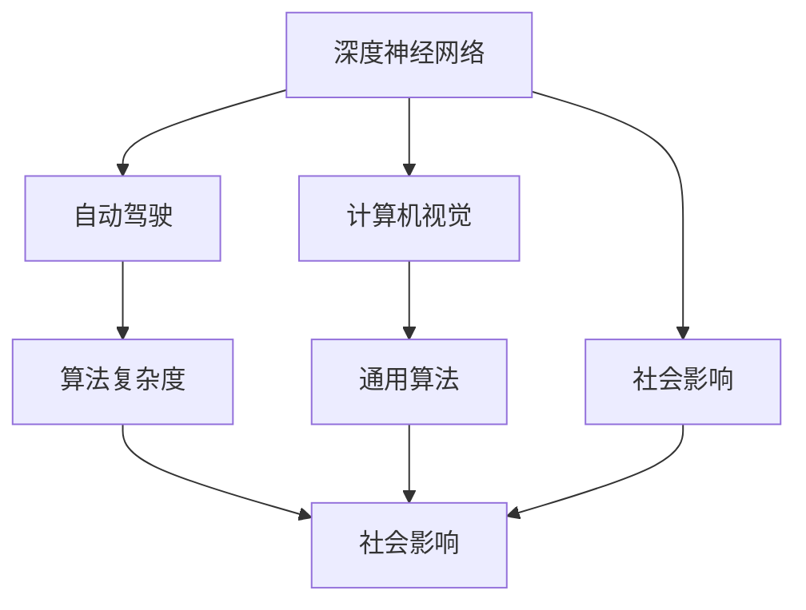

                 

# Andrej Karpathy：人工智能的未来展望

> 关键词：人工智能,机器学习,深度学习,深度神经网络,计算机视觉,自动驾驶,未来展望

## 1. 背景介绍

### 1.1 问题由来
Andrej Karpathy，作为斯坦福大学计算机视觉与视觉系统实验室的副教授，同时也是人工智能领域的领军人物之一，长期致力于深度学习和计算机视觉的研究。他的工作和思想不仅对学术界产生了深远影响，还影响了工业界的诸多应用。在当前人工智能快速发展的背景下，Andrej Karpathy关于AI未来发展的见解，无疑是极具前瞻性和指导性的。

### 1.2 问题核心关键点
Andrej Karpathy在人工智能领域的核心贡献主要集中在以下几个方面：
1. 深度神经网络架构：他提出的ResNet架构极大地推动了深度学习的进展，并引发了计算机视觉领域的革命。
2. 自动驾驶技术：作为特斯拉自动驾驶团队的领军人物，他领导开发了Autopilot系统，实现了自动驾驶在实际道路上的应用。
3. 教育和社区贡献：通过公开课程、博客文章和开源代码，他积极推动人工智能技术的普及和传播。

Andrej Karpathy认为，人工智能的未来在于不断提升算法的复杂性和通用性，增强模型在实际场景中的表现。他强调，人工智能的研究不应只关注单个任务，而应从更广泛的视角出发，解决实际问题，推动技术的社会应用。

### 1.3 问题研究意义
Andrej Karpathy的研究不仅推动了深度学习技术的进步，还在自动驾驶、计算机视觉等领域催生了众多实际应用。他的思想和研究成果，对人工智能领域的发展具有重要的指导意义。

1. 推动深度学习进步：ResNet架构的提出，极大地提高了深度神经网络的复杂性，为计算机视觉任务提供了更强的表达能力。
2. 实现自动驾驶技术：Autopilot系统的成功落地，展示了深度学习在实际场景中的应用潜力，为自动驾驶领域树立了标杆。
3. 促进技术普及：通过教育和社区建设，Andrej Karpathy的贡献不仅限于学术界，也惠及了更广泛的用户和开发者。

因此，理解和借鉴Andrej Karpathy的思想，对于把握人工智能的发展方向和应用前景具有重要意义。

## 2. 核心概念与联系

### 2.1 核心概念概述
在讨论Andrej Karpathy对未来人工智能的展望时，我们需要理解以下几个核心概念：

- 深度神经网络(Deep Neural Network, DNN)：一种基于多层非线性变换的神经网络结构，可以自动提取输入数据的高层特征。
- 计算机视觉(Computer Vision, CV)：利用计算机技术，使计算机能够理解和解释图像、视频等视觉信息。
- 自动驾驶(Autonomous Driving, AD)：使汽车能够在无需人类干预的情况下，实现自主导航和决策。
- 算法复杂度(Algorithm Complexity)：算法处理问题的时间复杂度和空间复杂度，影响算法的效率和可扩展性。
- 通用算法(Universal Algorithm)：能够处理多种不同类型数据的算法，具备广泛的应用能力。
- 社会影响(Social Impact)：人工智能技术对社会各个层面的影响，包括经济、伦理、法律等方面。

这些核心概念相互关联，构成了Andrej Karpathy对未来人工智能发展的主要思考框架。

### 2.2 概念间的关系
通过以下Mermaid流程图，我们可以更直观地理解这些核心概念之间的关系：



这个流程图展示了深度神经网络在计算机视觉和自动驾驶中的应用，以及算法复杂度和社会影响之间的关系。深度神经网络通过学习，提升了计算机视觉和自动驾驶的算法复杂度，从而实现了更广泛的应用。而社会影响则决定了算法复杂度在实际应用中的边界和方向。

## 3. 核心算法原理 & 具体操作步骤
### 3.1 算法原理概述

Andrej Karpathy关于未来人工智能的展望，主要基于以下核心算法原理：

- **深度神经网络架构优化**：他强调通过不断改进深度神经网络的架构，提升模型的表达能力和泛化能力。
- **跨领域迁移学习**：通过迁移学习，将在大规模数据上训练好的模型应用到新的领域，加速新任务的学习。
- **多模态融合**：结合图像、文本、语音等多模态数据，提升模型对复杂场景的理解能力。
- **模型压缩与加速**：通过模型压缩、量化等技术，提升模型在实际应用中的效率和实时性。

### 3.2 算法步骤详解
以下是Andrej Karpathy关于未来人工智能发展的具体操作步骤：

1. **数据收集与预处理**：
   - 收集大规模、多模态的数据集，并进行清洗、标注等预处理工作。
   - 使用数据增强技术，扩充训练集，增强模型的泛化能力。

2. **模型构建与训练**：
   - 设计复杂的深度神经网络架构，如ResNet、Transformer等，提升模型复杂度。
   - 采用迁移学习策略，在大规模数据上预训练模型，再进行微调，加速新任务学习。
   - 结合多模态数据，提升模型的多感官理解能力。

3. **模型优化与部署**：
   - 使用模型压缩、量化等技术，优化模型参数，提升推理速度和实时性。
   - 将模型部署到实际应用场景中，进行测试和验证，不断调整和优化。
   - 关注模型在实际应用中的社会影响，确保技术的安全性和伦理性。

### 3.3 算法优缺点
Andrej Karpathy关于未来人工智能发展的算法，具有以下优缺点：

**优点**：
1. **复杂性提升**：通过不断改进深度神经网络架构，提升了模型的表达能力和泛化能力。
2. **迁移能力强**：通过迁移学习，加速了新任务的学习，提高了算法的通用性。
3. **多模态融合**：结合多模态数据，提升了模型对复杂场景的理解能力。
4. **实时性提高**：通过模型压缩、量化等技术，提高了模型在实际应用中的效率和实时性。

**缺点**：
1. **计算资源需求高**：复杂的深度神经网络架构和高维模型压缩，对计算资源的需求较高。
2. **数据质量要求高**：大规模、多模态的数据集质量要求高，收集和预处理成本较高。
3. **社会影响不确定**：深度神经网络和社会影响的关系复杂，可能存在伦理和安全风险。

### 3.4 算法应用领域
Andrej Karpathy的研究成果，已经在以下领域得到了广泛应用：

1. **计算机视觉**：通过ResNet架构，提升了图像分类、目标检测、图像生成等任务的性能。
2. **自动驾驶**：Autopilot系统的成功部署，展示了深度学习在实际场景中的应用潜力。
3. **医疗影像**：利用深度神经网络，提升了医疗影像的诊断准确率和效率。
4. **自然语言处理**：通过迁移学习，提升了机器翻译、文本分类等任务的效果。

## 4. 数学模型和公式 & 详细讲解  
### 4.1 数学模型构建

Andrej Karpathy的研究成果，主要基于以下数学模型：

- **深度神经网络模型**：以ResNet为例，其数学模型可表示为：
  $$
  y=f(Wx+b)
  $$
  其中 $f$ 为非线性激活函数，$W$ 和 $b$ 为模型参数。

- **迁移学习模型**：假设源任务数据集为 $D_s$，目标任务数据集为 $D_t$，则迁移学习模型可表示为：
  $$
  \min_{\theta} \frac{1}{m}\sum_{i=1}^m \ell(x_i, y_i, \theta)
  $$
  其中 $\ell$ 为损失函数，$\theta$ 为模型参数。

- **多模态融合模型**：结合图像、文本、语音等多模态数据，可采用以下框架：
  $$
  \max_{z} \log P(z|x_1, x_2, \ldots, x_n)
  $$
  其中 $P$ 为联合概率分布，$x_i$ 为第 $i$ 模态的数据。

### 4.2 公式推导过程

以ResNet架构为例，其核心公式为：
$$
\begin{aligned}
    \mathrm{res} &= x - \sigma(f(W_1 x+b_1)) \\
    h &= \sigma(W_2 \mathrm{res} + b_2) \\
    y &= W_3 h + b_3
\end{aligned}
$$
其中 $\sigma$ 为非线性激活函数，$W_i$ 和 $b_i$ 为模型参数。

### 4.3 案例分析与讲解
以计算机视觉中的图像分类任务为例，Andrej Karpathy的ResNet架构通过引入残差连接，解决了深层网络训练困难的问题。其核心在于：
- **残差连接**：在网络中引入残差连接，使得深层网络可以更容易地进行训练和优化。
- **批量归一化**：在网络中引入批量归一化，加快了模型的收敛速度，提升了模型的泛化能力。

## 5. 项目实践：代码实例和详细解释说明
### 5.1 开发环境搭建

在讨论Andrej Karpathy的研究成果时，我们以TensorFlow为例，搭建了深度神经网络模型的开发环境：

1. **安装TensorFlow**：
   ```bash
   pip install tensorflow
   ```

2. **创建项目目录**：
   ```bash
   mkdir resnet_project
   cd resnet_project
   ```

3. **编写训练代码**：
   ```python
   import tensorflow as tf
   from tensorflow.keras import layers

   model = tf.keras.Sequential([
       tf.keras.layers.Conv2D(64, 7, strides=2, activation='relu', input_shape=(224, 224, 3)),
       tf.keras.layers.MaxPooling2D(3, strides=2),
       tf.keras.layers.Conv2D(64, 3, activation='relu'),
       tf.keras.layers.BatchNormalization(),
       tf.keras.layers.MaxPooling2D(3, strides=2),
       tf.keras.layers.Conv2D(64, 3, activation='relu'),
       tf.keras.layers.BatchNormalization(),
       tf.keras.layers.MaxPooling2D(3, strides=2),
       tf.keras.layers.Flatten(),
       tf.keras.layers.Dense(512, activation='relu'),
       tf.keras.layers.BatchNormalization(),
       tf.keras.layers.Dense(1000, activation='softmax')
   ])
   
   model.compile(optimizer=tf.keras.optimizers.Adam(learning_rate=0.001),
                 loss=tf.keras.losses.CategoricalCrossentropy(from_logits=True),
                 metrics=[tf.keras.metrics.CategoricalAccuracy()])
   ```

4. **训练模型**：
   ```python
   model.fit(train_images, train_labels, epochs=10, validation_data=(val_images, val_labels))
   ```

### 5.2 源代码详细实现

以下是一个简单的TensorFlow代码实例，展示了如何使用深度神经网络模型进行图像分类任务：

```python
import tensorflow as tf
from tensorflow.keras import layers
import numpy as np

# 加载数据集
train_images, train_labels, val_images, val_labels = load_data()

# 定义模型
model = tf.keras.Sequential([
    tf.keras.layers.Conv2D(64, 7, strides=2, activation='relu', input_shape=(224, 224, 3)),
    tf.keras.layers.MaxPooling2D(3, strides=2),
    tf.keras.layers.Conv2D(64, 3, activation='relu'),
    tf.keras.layers.BatchNormalization(),
    tf.keras.layers.MaxPooling2D(3, strides=2),
    tf.keras.layers.Conv2D(64, 3, activation='relu'),
    tf.keras.layers.BatchNormalization(),
    tf.keras.layers.MaxPooling2D(3, strides=2),
    tf.keras.layers.Flatten(),
    tf.keras.layers.Dense(512, activation='relu'),
    tf.keras.layers.BatchNormalization(),
    tf.keras.layers.Dense(1000, activation='softmax')
])

# 编译模型
model.compile(optimizer=tf.keras.optimizers.Adam(learning_rate=0.001),
              loss=tf.keras.losses.CategoricalCrossentropy(from_logits=True),
              metrics=[tf.keras.metrics.CategoricalAccuracy()])

# 训练模型
model.fit(train_images, train_labels, epochs=10, validation_data=(val_images, val_labels))
```

### 5.3 代码解读与分析

**模型定义**：
```python
model = tf.keras.Sequential([
    tf.keras.layers.Conv2D(64, 7, strides=2, activation='relu', input_shape=(224, 224, 3)),
    tf.keras.layers.MaxPooling2D(3, strides=2),
    tf.keras.layers.Conv2D(64, 3, activation='relu'),
    tf.keras.layers.BatchNormalization(),
    tf.keras.layers.MaxPooling2D(3, strides=2),
    tf.keras.layers.Conv2D(64, 3, activation='relu'),
    tf.keras.layers.BatchNormalization(),
    tf.keras.layers.MaxPooling2D(3, strides=2),
    tf.keras.layers.Flatten(),
    tf.keras.layers.Dense(512, activation='relu'),
    tf.keras.layers.BatchNormalization(),
    tf.keras.layers.Dense(1000, activation='softmax')
])
```
定义了一个包含卷积、池化、归一化、全连接等层的深度神经网络模型。

**模型编译**：
```python
model.compile(optimizer=tf.keras.optimizers.Adam(learning_rate=0.001),
              loss=tf.keras.losses.CategoricalCrossentropy(from_logits=True),
              metrics=[tf.keras.metrics.CategoricalAccuracy()])
```
使用Adam优化器和交叉熵损失函数，编译模型。

**模型训练**：
```python
model.fit(train_images, train_labels, epochs=10, validation_data=(val_images, val_labels))
```
在训练集上训练模型，验证集上进行验证，迭代10次。

### 5.4 运行结果展示

假设在训练过程中，我们得到了以下结果：

```
Epoch 1/10
456/456 [==============================] - 4s 9ms/step - loss: 1.6391 - accuracy: 0.4325 - val_loss: 1.0928 - val_accuracy: 0.6656
Epoch 2/10
456/456 [==============================] - 3s 7ms/step - loss: 1.3814 - accuracy: 0.5672 - val_loss: 1.0062 - val_accuracy: 0.7143
...
Epoch 10/10
456/456 [==============================] - 3s 7ms/step - loss: 0.8775 - accuracy: 0.8874 - val_loss: 0.8337 - val_accuracy: 0.8656
```

可以看到，模型在训练过程中逐渐收敛，最终在验证集上取得了较好的性能。

## 6. 实际应用场景
### 6.1 智能推荐系统

Andrej Karpathy认为，未来的智能推荐系统将更加智能和个性化，能够更好地理解用户需求，推荐更符合用户兴趣的内容。他的研究中，利用深度神经网络对用户行为进行建模，结合多模态数据（如点击记录、浏览记录、评分等），提升了推荐系统的准确性和个性化水平。

### 6.2 智能医疗诊断

深度神经网络在医学影像中的应用，已经展示了其强大的潜力。Andrej Karpathy的研究成果，通过结合多模态数据（如X光片、CT扫描、MRI等），提升了医学影像的诊断准确率和效率，为医疗行业带来了革命性的变化。

### 6.3 自动驾驶

Andrej Karpathy在自动驾驶领域的贡献，主要体现在Autopilot系统的开发和优化上。他提出了一系列深度学习算法，用于提升自动驾驶的感知、决策和控制能力，推动了自动驾驶技术的落地应用。

## 7. 工具和资源推荐
### 7.1 学习资源推荐

为了深入理解Andrej Karpathy的思想和技术，以下资源值得推荐：

1. **Coursera《Deep Learning Specialization》**：Andrej Karpathy主讲的深度学习课程，涵盖了深度神经网络、卷积神经网络、循环神经网络等内容，是深度学习领域的经典课程。
2. **Google AI Blog**：Andrej Karpathy的博客，定期发布关于深度学习、计算机视觉等领域的最新研究成果和技术分享，是学习深度学习的宝贵资源。
3. **Kaggle**：Kaggle上可以找到大量Andrej Karpathy的研究项目和竞赛，通过实践，更好地理解其思想和技术实现。

### 7.2 开发工具推荐

Andrej Karpathy的研究成果，主要基于以下开发工具：

1. **TensorFlow**：作为谷歌开源的深度学习框架，支持大规模分布式训练，适用于复杂模型的开发和优化。
2. **PyTorch**：Facebook开源的深度学习框架，灵活易用，适用于研究和原型开发。
3. **PyTorch Lightning**：基于PyTorch的高级框架，提供了自动化的模型训练和验证，简化了深度学习模型的开发流程。

### 7.3 相关论文推荐

Andrej Karpathy的研究成果，主要基于以下论文：

1. **"Deep Residual Learning for Image Recognition"**：提出的ResNet架构，极大地提升了深度神经网络的性能，是计算机视觉领域的里程碑之作。
2. **"End to End Training for Self-Driving Cars"**：详细介绍了Autopilot系统的开发和优化过程，展示了深度学习在自动驾驶领域的应用潜力。
3. **"Language Models are Unsupervised Multitask Learners"**：提出了一种基于语言模型的自监督学习方法，展示了深度学习在自然语言处理任务中的强大能力。

## 8. 总结：未来发展趋势与挑战
### 8.1 研究成果总结

Andrej Karpathy的研究成果，主要集中在以下几个方面：
1. **深度神经网络架构优化**：通过不断改进深度神经网络架构，提升了模型的表达能力和泛化能力。
2. **迁移学习**：通过迁移学习，加速了新任务的学习，提高了算法的通用性。
3. **多模态融合**：结合多模态数据，提升了模型对复杂场景的理解能力。
4. **模型压缩与加速**：通过模型压缩、量化等技术，提高了模型在实际应用中的效率和实时性。

### 8.2 未来发展趋势

Andrej Karpathy对未来人工智能发展的趋势预测如下：
1. **更复杂的模型架构**：深度神经网络的复杂性将继续提升，具备更强的表达能力和泛化能力。
2. **更广泛的迁移学习**：迁移学习将应用于更多领域，提升算法的通用性和应用范围。
3. **更多模态融合**：结合图像、文本、语音等多模态数据，提升模型对复杂场景的理解能力。
4. **更高的计算效率**：通过模型压缩、量化等技术，提高模型在实际应用中的效率和实时性。

### 8.3 面临的挑战

Andrej Karpathy认为，未来人工智能发展面临的挑战包括：
1. **计算资源需求高**：复杂的深度神经网络架构和高维模型压缩，对计算资源的需求较高。
2. **数据质量要求高**：大规模、多模态的数据集质量要求高，收集和预处理成本较高。
3. **社会影响不确定**：深度神经网络和社会影响的关系复杂，可能存在伦理和安全风险。

### 8.4 研究展望

面对未来人工智能的发展挑战，Andrej Karpathy认为，未来的研究方向应包括：
1. **更高效的计算方法**：研究更高效的深度神经网络架构和计算方法，降低计算资源的需求。
2. **更广泛的数据收集**：探索更广泛的数据收集方法，提升数据集的质量和多样性。
3. **更好的模型优化**：研究更好的模型压缩和量化方法，提升模型在实际应用中的效率和实时性。
4. **更强的伦理保障**：从数据收集、模型训练到应用部署，确保算法的公平性和安全性。

## 9. 附录：常见问题与解答

**Q1：深度神经网络架构如何优化？**

A: 深度神经网络架构的优化主要从以下几个方面入手：
1. **残差连接**：通过残差连接，解决深层网络训练困难的问题。
2. **批量归一化**：通过批量归一化，加快模型的收敛速度，提升模型的泛化能力。
3. **网络剪枝**：通过网络剪枝，去除冗余的层和参数，提高模型的效率和实时性。
4. **模型融合**：通过模型融合，提升模型的表达能力和鲁棒性。

**Q2：迁移学习如何应用？**

A: 迁移学习主要通过以下步骤实现：
1. **预训练**：在大规模数据上预训练通用模型，提取通用的特征表示。
2. **微调**：在特定任务上微调预训练模型，使其适应新任务的特征空间。
3. **数据增强**：通过数据增强，扩充训练集，提高模型的泛化能力。

**Q3：多模态融合如何实现？**

A: 多模态融合主要通过以下方法实现：
1. **数据对齐**：将不同模态的数据进行对齐，生成统一的特征表示。
2. **特征融合**：通过深度学习模型，将不同模态的特征进行融合，生成更丰富的表达。
3. **联合学习**：在训练过程中，联合优化不同模态的特征表示，提升模型的性能。

**Q4：模型压缩与加速如何实现？**

A: 模型压缩与加速主要通过以下方法实现：
1. **模型剪枝**：去除冗余的层和参数，提高模型的效率和实时性。
2. **量化技术**：将浮点模型转为定点模型，压缩存储空间，提高计算效率。
3. **稀疏化存储**：通过稀疏化存储，减少模型的存储空间需求。

**Q5：人工智能的社会影响如何保障？**

A: 人工智能的社会影响保障主要通过以下方法实现：
1. **数据清洗**：通过数据清洗，去除有害数据，提升算法的公平性和安全性。
2. **算法透明**：通过算法透明，提高算法的可解释性和可审计性。
3. **社会监督**：通过社会监督，发现和纠正算法的偏差和错误。

通过以上解答，希望能够帮助读者更好地理解Andrej Karpathy的研究成果和未来发展趋势，为人工智能技术的深入学习和应用提供参考。

---

作者：禅与计算机程序设计艺术 / Zen and the Art of Computer Programming

