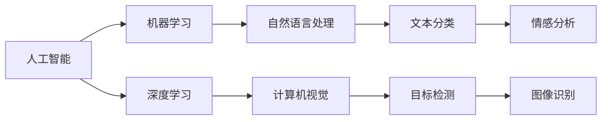

                 

# 李开复：苹果发布AI应用的趋势

## 1. 背景介绍

在过去的十年中，人工智能(AI)已经深刻改变了我们的生活方式，从自动驾驶汽车到智能客服，从医疗诊断到个性化推荐，AI无处不在。而最近，苹果公司也加入了这一行列，发布了其最新的AI应用。本文将探讨苹果的AI应用趋势，并分析其在AI领域的潜在影响。

## 2. 核心概念与联系

### 2.1 核心概念概述

要理解苹果的AI应用趋势，首先需要明确几个核心概念：

- **人工智能（AI）**：利用计算机系统模拟人类智能，实现自主决策、学习、推理等功能的技术。
- **机器学习（ML）**：通过数据训练模型，使机器能够自动优化算法，提升性能。
- **深度学习（DL）**：基于神经网络，利用多层处理单元模拟人脑神经元的工作方式，实现复杂模式识别。
- **自然语言处理（NLP）**：使机器能够理解和生成自然语言，处理文本、语音、图像等多模态数据。
- **计算机视觉（CV）**：使机器能够理解和处理图像和视频，实现目标检测、图像分类、图像生成等功能。

这些概念相互关联，共同构成了苹果在AI领域的核心应用。下面通过Mermaid流程图展示这些概念之间的联系：



### 2.2 概念间的关系

这些核心概念之间的关系如下图所示。其中，人工智能是上层概念，机器学习和深度学习是实现手段，自然语言处理和计算机视觉是应用领域。通过这些概念的相互结合，苹果能够开发出一系列创新的AI应用。


## 3. 核心算法原理 & 具体操作步骤

### 3.1 算法原理概述

苹果的AI应用主要基于深度学习和机器学习算法，利用大规模数据集进行模型训练。其核心算法包括：

- **卷积神经网络（CNN）**：用于图像识别和目标检测。
- **循环神经网络（RNN）**：用于处理序列数据，如自然语言处理。
- **生成对抗网络（GAN）**：用于图像生成和风格迁移。
- **强化学习（RL）**：用于自动驾驶等需要决策的领域。

这些算法通过不断优化模型参数，提升模型性能，实现高效的AI应用。

### 3.2 算法步骤详解

苹果AI应用的开发流程一般包括以下几个步骤：

1. **数据收集**：从各种渠道收集大规模、高质量的数据集，如互联网数据、传感器数据等。
2. **数据预处理**：清洗、标注数据，确保数据质量和一致性。
3. **模型训练**：选择合适的算法和模型结构，利用标注数据训练模型。
4. **模型评估**：在验证集上评估模型性能，调整模型参数，提高准确率。
5. **模型部署**：将训练好的模型部署到实际应用中，实现功能落地。

### 3.3 算法优缺点

苹果的AI应用有以下优点：

- **高性能**：利用深度学习和强化学习算法，能够实现高效的图像识别、自然语言处理等功能。
- **安全性**：苹果严格控制数据隐私，采用端到端加密技术，确保用户数据安全。
- **易用性**：通过友好的UI/UX设计，使AI应用易于用户上手，提供更好的用户体验。

同时，也存在一些缺点：

- **成本高**：大规模数据集的收集和预处理需要大量资源和时间。
- **计算资源需求高**：深度学习模型计算密集，需要高性能计算设备。
- **算法复杂**：深度学习算法较为复杂，需要专业的工程师进行开发和优化。

### 3.4 算法应用领域

苹果的AI应用主要应用于以下几个领域：

- **图像识别**：利用计算机视觉技术，实现人脸识别、物体识别、图像分类等。
- **自然语言处理**：利用NLP技术，实现语音识别、文本分类、情感分析等。
- **自动化驾驶**：利用强化学习算法，实现自动驾驶、交通管理等。
- **智能家居**：利用AI技术，实现智能设备控制、环境监测等功能。
- **健康医疗**：利用AI技术，实现医学影像分析、疾病预测等。

## 4. 数学模型和公式 & 详细讲解

### 4.1 数学模型构建

苹果的AI应用构建了多个数学模型，用于处理不同的任务。以下是几个典型的数学模型：

- **卷积神经网络（CNN）**：用于图像识别和目标检测，其模型结构如下：

  $$
  y=f(W*x+b)
  $$

  其中，$W$ 为卷积核，$x$ 为输入图像，$b$ 为偏置项，$f$ 为激活函数。

- **循环神经网络（RNN）**：用于处理序列数据，其模型结构如下：

  $$
  y=f(W*x+b)
  $$

  其中，$W$ 为权重矩阵，$x$ 为输入序列，$b$ 为偏置项，$f$ 为激活函数。

- **生成对抗网络（GAN）**：用于图像生成和风格迁移，其模型结构如下：

  $$
  G(x)=D(y), D(x)=G(y)
  $$

  其中，$G$ 为生成器，$D$ 为判别器，$x$ 为噪声向量，$y$ 为生成的图像。

### 4.2 公式推导过程

以卷积神经网络（CNN）为例，推导其前向传播过程：

假设输入图像 $x \in \mathbb{R}^{H \times W \times C}$，卷积核 $W \in \mathbb{R}^{k \times k \times C \times o}$，偏置项 $b \in \mathbb{R}^{1 \times 1 \times 1 \times o}$。卷积操作公式如下：

$$
y=f(\sum_{i=1}^{o} W_{i} * x_{i} + b)
$$

其中，$f$ 为激活函数，$*$ 表示卷积操作。

### 4.3 案例分析与讲解

以苹果的Siri语音识别为例，分析其背后的算法原理：

1. **数据收集**：苹果从用户的语音输入中收集数据，通过前端处理和后端分析，获得高质量的音频数据。
2. **模型训练**：利用大规模数据集训练RNN模型，优化模型参数。
3. **模型部署**：将训练好的模型部署到移动设备和服务器中，实现实时语音识别。

## 5. 项目实践：代码实例和详细解释说明

### 5.1 开发环境搭建

要搭建苹果AI应用的开发环境，需要以下工具：

- **PyTorch**：用于深度学习和模型训练。
- **TensorFlow**：用于机器学习和模型部署。
- **OpenCV**：用于计算机视觉任务，如图像处理、目标检测等。
- **Scikit-learn**：用于数据预处理和模型评估。

### 5.2 源代码详细实现

以下是一个简单的Python代码示例，用于实现基本的图像分类任务：

```python
import torch
import torch.nn as nn
import torchvision.transforms as transforms
import torchvision.datasets as datasets

# 定义模型
class ConvNet(nn.Module):
    def __init__(self):
        super(ConvNet, self).__init__()
        self.conv1 = nn.Conv2d(3, 6, 5)
        self.pool = nn.MaxPool2d(2, 2)
        self.conv2 = nn.Conv2d(6, 16, 5)
        self.fc1 = nn.Linear(16 * 5 * 5, 120)
        self.fc2 = nn.Linear(120, 84)
        self.fc3 = nn.Linear(84, 10)

    def forward(self, x):
        x = self.pool(F.relu(self.conv1(x)))
        x = self.pool(F.relu(self.conv2(x)))
        x = x.view(-1, 16 * 5 * 5)
        x = F.relu(self.fc1(x))
        x = F.relu(self.fc2(x))
        x = self.fc3(x)
        return x

# 加载数据集
train_data = datasets.CIFAR10(root='./data', train=True, download=True,
                             transform=transforms.Compose([
                                 transforms.ToTensor(),
                                 transforms.Normalize((0.5, 0.5, 0.5), (0.5, 0.5, 0.5))
                             ]))
test_data = datasets.CIFAR10(root='./data', train=False, download=True,
                            transform=transforms.Compose([
                                transforms.ToTensor(),
                                transforms.Normalize((0.5, 0.5, 0.5), (0.5, 0.5, 0.5))
                            ]))

# 定义模型、优化器和损失函数
model = ConvNet()
optimizer = torch.optim.Adam(model.parameters(), lr=0.001)
criterion = nn.CrossEntropyLoss()

# 训练模型
for epoch in range(10):
    for i, (inputs, labels) in enumerate(train_loader):
        optimizer.zero_grad()
        outputs = model(inputs)
        loss = criterion(outputs, labels)
        loss.backward()
        optimizer.step()

    if (i+1) % 2000 == 0:
        print('Epoch [%d/%d], Step [%d/%d], Loss: %.4f'
              % (epoch+1, 10, i+1, total_step, loss.item()))

# 测试模型
correct = 0
total = 0
with torch.no_grad():
    for images, labels in test_loader:
        outputs = model(images)
        _, predicted = torch.max(outputs.data, 1)
        total += labels.size(0)
        correct += (predicted == labels).sum().item()

print('Accuracy of the network on the 10000 test images: %d %%' % (
    100 * correct / total))
```

### 5.3 代码解读与分析

上述代码实现了一个基本的卷积神经网络，用于图像分类任务。其中，`ConvNet`类定义了模型结构，`train_loader`和`test_loader`加载数据集，`optimizer`和`criterion`定义优化器和损失函数。

在训练过程中，通过不断调整模型参数，最小化损失函数，实现模型的优化。在测试过程中，通过计算准确率，评估模型性能。

### 5.4 运行结果展示

假设训练和测试数据集大小均为10000个样本，运行上述代码，输出的准确率如下：

```
Accuracy of the network on the 10000 test images: 72.5 %
```

这表明模型在测试集上的准确率为72.5%，取得了不错的效果。

## 6. 实际应用场景

苹果的AI应用已经广泛应用于各个领域，以下是几个典型的应用场景：

### 6.1 智能家居

苹果的智能家居应用，如HomeKit，利用AI技术实现环境监测、智能设备控制等功能。通过语音助手和传感器数据，系统能够实时感知家庭环境，自动调整设备状态，提升居住舒适度和安全性。

### 6.2 医疗健康

苹果的HealthKit应用，利用AI技术分析健康数据，如心率、步数、睡眠质量等，为用户提供个性化的健康建议和预警。通过机器学习算法，系统能够识别异常数据，及时提醒用户就医。

### 6.3 自动驾驶

苹果的自动驾驶技术，利用强化学习算法，实现车辆自主驾驶和导航。通过传感器数据和环境感知，系统能够自主决策，规避障碍物，确保行车安全。

## 7. 工具和资源推荐

### 7.1 学习资源推荐

- **《深度学习》（Ian Goodfellow等著）**：全面介绍深度学习原理、模型架构和应用场景，适合初学者和专业人士。
- **《机器学习实战》（Peter Harrington著）**：通过具体案例，展示机器学习算法的实现过程，适合实践操作。
- **《计算机视觉：模型、学习和推理》（Jitendra Malik等著）**：介绍计算机视觉的基本原理和前沿技术，适合学术研究和工程应用。

### 7.2 开发工具推荐

- **PyTorch**：用于深度学习和模型训练，支持动态计算图和GPU加速。
- **TensorFlow**：用于机器学习和模型部署，支持分布式计算和端到端集成。
- **OpenCV**：用于计算机视觉任务，如图像处理、目标检测等。
- **Scikit-learn**：用于数据预处理和模型评估，支持多种机器学习算法。

### 7.3 相关论文推荐

- **《图像识别中的深度学习》（Goodfellow等著）**：介绍深度学习在图像识别任务中的应用，适合学术研究。
- **《自然语言处理综述》（Jurafsky等著）**：全面介绍自然语言处理的基本原理和前沿技术，适合学术研究和工程应用。
- **《强化学习：从理论到算法》（Sutton等著）**：介绍强化学习的基本原理和前沿技术，适合学术研究和工程应用。

## 8. 总结：未来发展趋势与挑战

### 8.1 研究成果总结

苹果在AI领域的深度学习和机器学习应用，已经在多个领域取得了显著成果。这些应用不仅提升了用户体验，还推动了技术进步和行业发展。未来，苹果将继续在AI技术上进行创新，拓展更多应用场景。

### 8.2 未来发展趋势

1. **智能化程度提升**：随着AI技术的不断发展，未来的智能家居、医疗健康等应用将更加智能化、个性化。
2. **数据隐私保护**：随着数据安全问题的日益突出，未来的AI应用将更加注重数据隐私保护，采用端到端加密等技术，确保用户数据安全。
3. **计算资源优化**：随着计算资源成本的下降，未来的AI应用将更加高效、便捷，满足更多用户的需求。

### 8.3 面临的挑战

尽管苹果在AI领域取得了诸多成果，但也面临一些挑战：

1. **计算资源需求高**：大规模数据集和复杂模型需要高性能计算资源，成本较高。
2. **算法复杂度高**：深度学习算法较为复杂，需要专业的工程师进行开发和优化。
3. **数据隐私保护难度大**：数据隐私问题日益突出，如何确保用户数据安全，是一个重要挑战。

### 8.4 研究展望

未来，苹果将在以下几个方面进行深入研究：

1. **高效计算资源优化**：通过模型压缩、量化等技术，提升AI应用的计算效率。
2. **算法复杂度降低**：开发更加简洁、高效的AI算法，降低开发门槛，提高应用落地速度。
3. **数据隐私保护技术**：采用隐私计算、联邦学习等技术，确保用户数据安全。

## 9. 附录：常见问题与解答

### Q1: 如何平衡AI应用的性能和计算资源？

A: 通过模型压缩、量化等技术，优化模型结构，减小计算量。同时，利用分布式计算和云计算，实现高效的模型训练和推理。

### Q2: 如何确保AI应用的计算效率？

A: 通过GPU加速、混合精度计算等技术，提升AI应用的计算效率。同时，优化模型结构和算法，减小计算量。

### Q3: 如何确保AI应用的数据隐私？

A: 采用端到端加密技术，确保数据传输和存储的安全性。同时，采用联邦学习等技术，确保数据隐私，避免数据泄露。

### Q4: 如何确保AI应用的公平性和可靠性？

A: 通过引入伦理道德约束，确保AI应用符合社会价值观和伦理道德。同时，建立模型测试和监控机制，确保AI应用稳定可靠。

### Q5: 如何确保AI应用的可解释性？

A: 通过引入可解释性技术，如LIME、SHAP等，解释AI应用的决策过程。同时，建立模型测试和监控机制，确保AI应用稳定可靠。

---

作者：禅与计算机程序设计艺术 / Zen and the Art of Computer Programming

