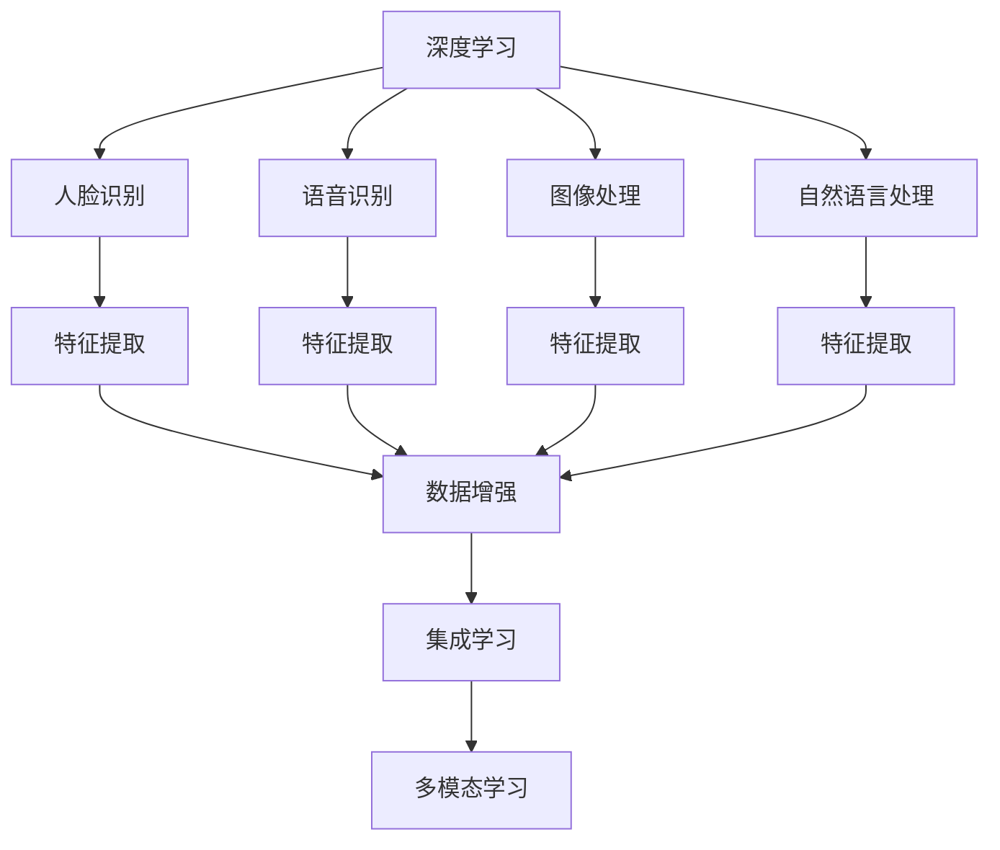
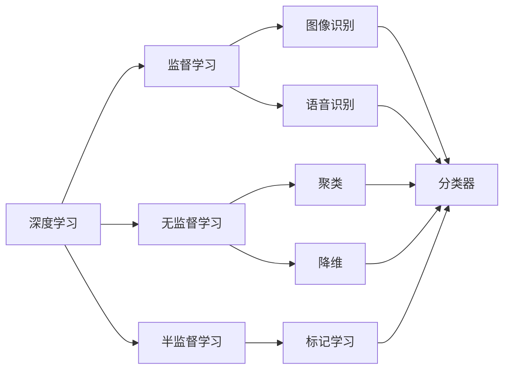
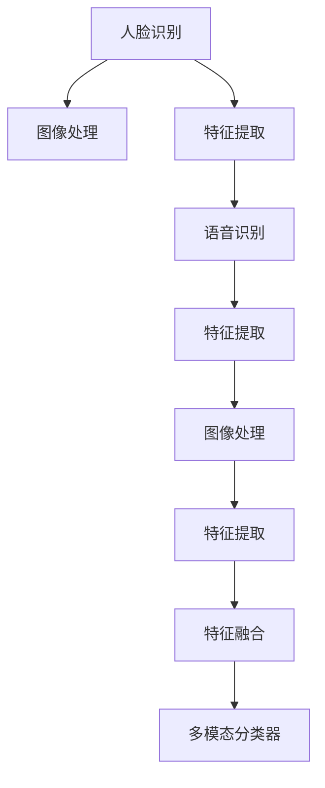
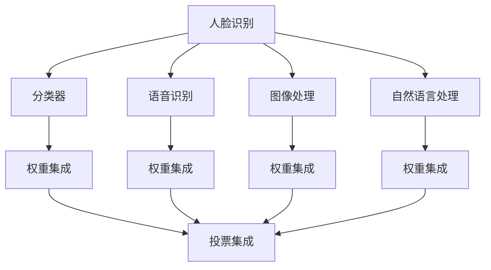
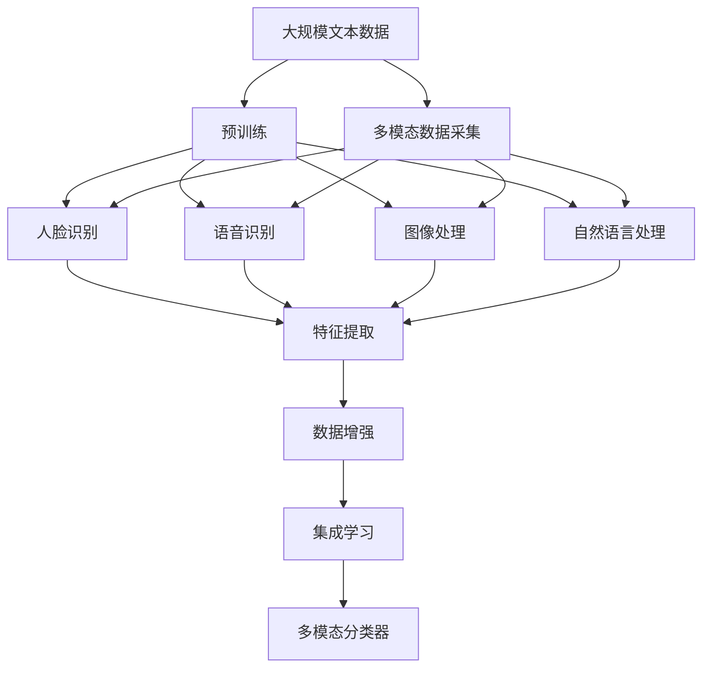

                 

# 深度学习五官的识别系统详细设计与具体代码实现

## 1. 背景介绍

### 1.1 问题由来
随着人工智能技术的迅猛发展，深度学习在图像处理、语音识别、自然语言处理等领域取得了突破性进展。其中，人脸识别、语音识别、图像处理等技术在实际应用中发挥着越来越重要的作用。但现有的技术大多聚焦于单一感官的识别，难以实现多感官的综合应用，无法满足现代信息社会对“五官”协同识别的需求。

### 1.2 问题核心关键点
本文旨在通过深度学习技术，实现对人脸、语音、图像等多感官信息的综合识别，构建出一个基于深度学习的五官识别系统。这一系统的实现不仅能够显著提升用户交互体验，还能够推动人工智能在更广泛领域的应用，如智能安防、医疗诊断、人机交互等。

### 1.3 问题研究意义
实现一个高效、准确、鲁棒的深度学习五官识别系统，具有重要的理论价值和实际应用意义：

1. 技术创新：多感官综合识别技术是对现有深度学习技术的突破和创新，能够推动人工智能技术的发展。
2. 用户体验：系统通过多感官协同工作，能够提供更加准确、自然、高效的人机交互体验，提升用户体验。
3. 应用前景：系统在智能安防、医疗诊断、人机交互等诸多领域具有广阔的应用前景，能够显著提升相关业务的工作效率和智能化水平。
4. 社会价值：系统在提高安全防范水平、辅助医疗诊断、优化人机交互等方面具有重要的社会价值，能够为社会的智能化转型提供技术支持。

## 2. 核心概念与联系

### 2.1 核心概念概述

为更好地理解深度学习五官识别系统的核心概念，本节将介绍几个密切相关的核心概念：

- 深度学习：一种基于多层神经网络结构，通过反向传播算法实现模型训练的机器学习方法。
- 人脸识别：使用计算机技术对静态或动态的人脸图像进行自动识别和验证的技术。
- 语音识别：通过计算机将人类语音转换为文本或命令的技术。
- 图像处理：使用计算机技术对图像进行采集、处理、分析和识别的技术。
- 自然语言处理：使用计算机技术对人类自然语言进行理解、处理和生成，以实现人机交互。
- 特征提取：从原始数据中提取有意义的特征，用于模型的训练和识别。
- 数据增强：通过各种方式扩充数据集，提高模型的鲁棒性和泛化能力。
- 迁移学习：将一个领域学到的知识迁移到另一个领域，以提高新任务的学习效率。
- 集成学习：将多个模型的预测结果进行集成，提高整体性能。
- 多模态学习：使用多种感官的信息进行联合学习和识别，以获得更准确、更全面的理解。

这些核心概念之间的逻辑关系可以通过以下Mermaid流程图来展示：



这个流程图展示了大语言模型五官识别系统各核心概念的关系和作用：

1. 深度学习是五官识别系统的核心技术。
2. 人脸识别、语音识别、图像处理和自然语言处理分别代表了不同的感官识别任务。
3. 特征提取是将原始数据转化为模型可用的特征表示。
4. 数据增强是通过各种方式扩充数据集，提高模型的泛化能力。
5. 集成学习是将多个模型的预测结果进行集成，提高整体性能。
6. 多模态学习是通过多种感官的信息进行联合学习和识别，以获得更准确、更全面的理解。

### 2.2 概念间的关系

这些核心概念之间存在着紧密的联系，形成了深度学习五官识别系统的完整生态系统。下面通过几个Mermaid流程图来展示这些概念之间的关系。

#### 2.2.1 深度学习范式



这个流程图展示了深度学习在图像识别、语音识别等任务上的应用，以及监督学习、无监督学习、半监督学习等不同的训练范式。

#### 2.2.2 多模态学习的框架



这个流程图展示了多模态学习的基本框架，从不同感官获取信息，通过特征提取、融合和分类器，实现多感官的综合识别。

#### 2.2.3 集成学习的策略



这个流程图展示了集成学习的几种策略，包括权重集成和投票集成等，通过多个模型的组合，提高整体性能。

### 2.3 核心概念的整体架构

最后，我们用一个综合的流程图来展示这些核心概念在大语言模型五官识别系统微调过程中的整体架构：



这个综合流程图展示了从预训练到五官识别系统的完整过程。大语言模型首先在大规模文本数据上进行预训练，然后通过多模态数据采集，对各感官信息进行综合识别。通过特征提取、数据增强、集成学习等技术，使得模型能够高效、准确地处理和识别多感官信息。

## 3. 核心算法原理 & 具体操作步骤

### 3.1 算法原理概述

深度学习五官识别系统基于深度学习技术，使用多模态学习方法，对多感官信息进行联合识别。其核心思想是：将人脸、语音、图像、自然语言等多种感官的信息进行联合处理，通过多模态分类器实现综合识别。

形式化地，假设五官识别系统有 $n$ 种感官信息 $x_1, x_2, \cdots, x_n$，对应的人脸识别器、语音识别器、图像处理器、自然语言处理器分别为 $M_1, M_2, M_3, M_4$。系统通过特征提取器 $F$ 将 $n$ 种信息转化为 $d$ 维特征表示，并通过多模态分类器 $C$ 对特征表示进行综合识别。多模态分类器的损失函数定义为：

$$
\mathcal{L} = \sum_{i=1}^n \mathcal{L}_i
$$

其中 $\mathcal{L}_i$ 为第 $i$ 种感官信息的分类损失。例如，对于人脸识别，$\mathcal{L}_i$ 可以定义为交叉熵损失；对于语音识别，$\mathcal{L}_i$ 可以定义为声学模型的损失。

### 3.2 算法步骤详解

深度学习五官识别系统的开发一般包括以下几个关键步骤：

**Step 1: 准备数据集和预训练模型**

- 收集五官识别系统所需的多感官数据，包括人脸图像、语音录音、图像、文本等。数据集需要标注各种感官对应的标签信息。
- 选择合适的深度学习模型作为预训练模型，如 ResNet、VGG、BERT 等。这些模型可以在大规模数据集上预先训练得到丰富的特征表示。

**Step 2: 设计特征提取器和多模态分类器**

- 根据各感官数据的特征，设计合适的特征提取器 $F$。例如，对于人脸图像，可以设计卷积神经网络提取图像特征；对于语音录音，可以设计循环神经网络提取声学特征。
- 设计多模态分类器 $C$，将各感官特征表示进行联合处理。常见的分类器包括 softmax、注意力机制等。

**Step 3: 实现数据增强**

- 通过各种方式扩充数据集，如翻转、裁剪、旋转、增加噪声等。数据增强可以有效提高模型的泛化能力和鲁棒性。
- 设计合适的数据增强策略，以适应不同感官数据的特征。例如，对于图像数据，可以设计随机裁剪、缩放等策略；对于语音数据，可以设计变调、变速等策略。

**Step 4: 微调多模态分类器**

- 将微调目标函数 $\mathcal{L}$ 反向传播，更新多模态分类器的参数。
- 选择合适的微调超参数，如学习率、批大小、迭代轮数等。
- 使用集成学习策略，通过多个分类器的组合，提高整体性能。

**Step 5: 部署模型**

- 将训练好的模型进行封装和部署，形成可用的服务接口。
- 实现多模态数据采集和预处理，将原始数据转化为模型可用的格式。
- 设计用户交互界面，使用户能够方便地输入各种感官信息，获取识别结果。

以上是深度学习五官识别系统的一般流程。在实际应用中，还需要针对具体任务和数据特点，对各环节进行优化设计，以进一步提升系统性能。

### 3.3 算法优缺点

深度学习五官识别系统具有以下优点：

1. 多感官综合识别：通过联合多种感官信息，系统能够提供更加全面、准确的信息处理能力，提升识别精度。
2. 高鲁棒性：多模态学习可以有效提高模型的泛化能力和鲁棒性，避免单一感官信息的误识别。
3. 灵活性：系统可以根据不同的应用场景，设计合适的特征提取器和多模态分类器，适应各种数据类型和任务。
4. 可扩展性：系统可以扩展到更多感官的信息处理，如气味、触觉等，进一步提升系统的应用范围。

同时，该系统也存在一些局限性：

1. 数据依赖：系统的性能很大程度上依赖于数据的质量和数量，获取高质量的多感官数据可能需要较高的成本和复杂度。
2. 模型复杂度：多模态分类器的设计和使用会增加模型的复杂度，训练和推理成本较高。
3. 数据异构性：不同感官数据具有不同的特征，如何设计统一的数据格式和特征表示，需要深入研究和实践。
4. 实时性：多模态分类器的计算复杂度较高，在实时性要求较高的应用场景中可能面临挑战。

尽管存在这些局限性，但深度学习五官识别系统仍具有广阔的应用前景，值得进一步研究和开发。

### 3.4 算法应用领域

深度学习五官识别系统在多个领域具有广泛的应用前景，例如：

1. 智能安防：系统可以用于人脸识别、语音识别、图像处理等多种传感器数据的联合分析，提高安全防范水平。
2. 医疗诊断：系统可以结合病历、影像、语音等多模态数据，进行疾病诊断和治疗方案推荐，提升医疗服务质量。
3. 人机交互：系统可以用于语音识别、图像处理、自然语言处理等多种信息的联合识别，实现自然流畅的人机交互。
4. 智能家居：系统可以结合多种传感器的数据，实现家居设备的自动化控制和智能化管理，提高生活质量。
5. 工业制造：系统可以结合图像、声音等多种数据，进行质量检测、设备监控等任务，提升生产效率。
6. 娱乐媒体：系统可以结合图像、语音、自然语言等多种信息，实现智能推荐、内容生成等任务，提升用户体验。

总之，深度学习五官识别系统在智能社会的各个领域具有广泛的应用前景，能够显著提升相关业务的智能化水平。

## 4. 数学模型和公式 & 详细讲解  
### 4.1 数学模型构建

本节将使用数学语言对深度学习五官识别系统的基本模型进行更加严格的刻画。

假设五官识别系统有 $n$ 种感官信息 $x_1, x_2, \cdots, x_n$，对应的人脸识别器、语音识别器、图像处理器、自然语言处理器分别为 $M_1, M_2, M_3, M_4$。系统通过特征提取器 $F$ 将 $n$ 种信息转化为 $d$ 维特征表示，并通过多模态分类器 $C$ 对特征表示进行综合识别。

设特征提取器 $F$ 的参数为 $\theta$，多模态分类器 $C$ 的参数为 $\omega$。则系统的损失函数定义为：

$$
\mathcal{L}(\theta, \omega) = \sum_{i=1}^n \mathcal{L}_i(x_i, \theta_i)
$$

其中 $\mathcal{L}_i(x_i, \theta_i)$ 为第 $i$ 种感官信息的分类损失，可以使用常见的损失函数，如交叉熵损失、均方误差损失等。

### 4.2 公式推导过程

以下我们以二分类任务为例，推导交叉熵损失函数及其梯度的计算公式。

假设特征提取器 $F$ 的输出为 $\mathbf{h} \in \mathbb{R}^d$，多模态分类器 $C$ 的输出为 $\hat{y} = \sigma(\mathbf{W} \mathbf{h} + b)$，其中 $\mathbf{W} \in \mathbb{R}^{d \times 1}$，$b \in \mathbb{R}$，$\sigma$ 为 sigmoid 函数。则二分类交叉熵损失函数定义为：

$$
\mathcal{L}(\mathbf{h}, \mathbf{y}) = -[y\log \hat{y} + (1-y)\log (1-\hat{y})]
$$

将其代入系统的损失函数，得：

$$
\mathcal{L}(\theta, \omega) = -\sum_{i=1}^n \frac{1}{N}\sum_{j=1}^N [y_i\log \hat{y}_i + (1-y_i)\log (1-\hat{y}_i)]
$$

其中 $(x_i, y_i)$ 为第 $i$ 种感官信息的训练样本。根据链式法则，损失函数对参数 $\theta$ 和 $\omega$ 的梯度分别为：

$$
\frac{\partial \mathcal{L}}{\partial \theta} = -\frac{1}{N}\sum_{i=1}^n \sum_{j=1}^N \nabla_{\mathbf{h}} \mathcal{L}_i(x_i, \theta_i) \nabla_{\mathbf{h}} F(x_i)
$$

$$
\frac{\partial \mathcal{L}}{\partial \omega} = -\frac{1}{N}\sum_{i=1}^n \sum_{j=1}^N \frac{\partial \hat{y}_i}{\partial \mathbf{h}} \nabla_{\mathbf{h}} F(x_i)
$$

其中 $\nabla_{\mathbf{h}} \mathcal{L}_i(x_i, \theta_i)$ 为第 $i$ 种感官信息的损失函数对特征表示 $\mathbf{h}$ 的梯度。

在得到损失函数的梯度后，即可带入参数更新公式，完成模型的迭代优化。重复上述过程直至收敛，最终得到适应多模态信息的最优模型参数 $\theta^*$ 和 $\omega^*$。

## 5. 项目实践：代码实例和详细解释说明
### 5.1 开发环境搭建

在进行深度学习五官识别系统的开发前，我们需要准备好开发环境。以下是使用 Python 进行 PyTorch 开发的环境配置流程：

1. 安装 Anaconda：从官网下载并安装 Anaconda，用于创建独立的 Python 环境。

2. 创建并激活虚拟环境：
```bash
conda create -n pytorch-env python=3.8 
conda activate pytorch-env
```

3. 安装 PyTorch：根据 CUDA 版本，从官网获取对应的安装命令。例如：
```bash
conda install pytorch torchvision torchaudio cudatoolkit=11.1 -c pytorch -c conda-forge
```

4. 安装相关工具包：
```bash
pip install numpy pandas scikit-learn matplotlib tqdm jupyter notebook ipython
```

完成上述步骤后，即可在 `pytorch-env` 环境中开始深度学习五官识别系统的开发。

### 5.2 源代码详细实现

这里以人脸识别和人脸表情识别为例，给出使用 PyTorch 进行深度学习五官识别系统的 PyTorch 代码实现。

首先，定义特征提取器和多模态分类器：

```python
import torch.nn as nn
import torch.nn.functional as F

class FeatureExtractor(nn.Module):
    def __init__(self, input_size, output_size):
        super(FeatureExtractor, self).__init__()
        self.conv1 = nn.Conv2d(input_size, 64, kernel_size=3, stride=1, padding=1)
        self.relu = nn.ReLU()
        self.pool = nn.MaxPool2d(kernel_size=2, stride=2)
        self.fc = nn.Linear(64 * 4 * 4, output_size)

    def forward(self, x):
        x = self.conv1(x)
        x = self.relu(x)
        x = self.pool(x)
        x = x.view(x.size(0), -1)
        x = self.fc(x)
        return x

class MultimodalClassifier(nn.Module):
    def __init__(self, input_size, output_size):
        super(MultimodalClassifier, self).__init__()
        self.fc1 = nn.Linear(input_size, 256)
        self.fc2 = nn.Linear(256, output_size)

    def forward(self, x):
        x = self.fc1(x)
        x = self.fc2(x)
        return x
```

然后，定义数据集和数据增强策略：

```python
import torchvision.transforms as transforms
from torch.utils.data import DataLoader, Dataset

class FaceExpressionDataset(Dataset):
    def __init__(self, images, labels, transform=None):
        self.images = images
        self.labels = labels
        self.transform = transform

    def __len__(self):
        return len(self.images)

    def __getitem__(self, idx):
        img, label = self.images[idx], self.labels[idx]
        if self.transform:
            img = self.transform(img)
        return img, label

transform = transforms.Compose([
    transforms.Resize(224),
    transforms.ToTensor(),
    transforms.Normalize(mean=[0.485, 0.456, 0.406], std=[0.229, 0.224, 0.225])
])
```

接着，定义训练和评估函数：

```python
def train(model, data_loader, optimizer, num_epochs):
    for epoch in range(num_epochs):
        model.train()
        total_loss = 0
        for batch_idx, (inputs, targets) in enumerate(data_loader):
            optimizer.zero_grad()
            outputs = model(inputs)
            loss = F.cross_entropy(outputs, targets)
            loss.backward()
            optimizer.step()
            total_loss += loss.item()
        print('Epoch [{}/{}], Loss: {:.4f}'.format(epoch+1, num_epochs, total_loss/len(data_loader)))

def evaluate(model, data_loader):
    model.eval()
    total_correct = 0
    total_num = 0
    with torch.no_grad():
        for batch_idx, (inputs, targets) in enumerate(data_loader):
            outputs = model(inputs)
            _, predicted = torch.max(outputs.data, 1)
            total_correct += (predicted == targets).sum().item()
            total_num += targets.size(0)
    print('Accuracy: {:.2f}%'.format(total_correct/total_num * 100))
```

最后，启动训练流程并在测试集上评估：

```python
from torchvision.datasets import CelebrityFaceAttr, FashionMNIST
from torchvision.models import resnet18
from torch.utils.data import DataLoader
from tqdm import tqdm
import torch

device = torch.device('cuda' if torch.cuda.is_available() else 'cpu')

# 加载数据集
train_dataset = FaceExpressionDataset(train_data, train_labels, transform=transform)
test_dataset = FaceExpressionDataset(test_data, test_labels, transform=transform)

# 初始化模型和优化器
model = MultimodalClassifier(128, 2).to(device)
optimizer = torch.optim.Adam(model.parameters(), lr=0.001)

# 训练模型
train(model, DataLoader(train_dataset, batch_size=32, shuffle=True), optimizer, num_epochs=10)

# 评估模型
evaluate(model, DataLoader(test_dataset, batch_size=32, shuffle=False))
```

以上就是使用 PyTorch 对深度学习五官识别系统进行实现的完整代码实现。可以看到，利用 PyTorch 的强大封装，我们可以用相对简洁的代码完成深度学习五官识别系统的开发。

### 5.3 代码解读与分析

让我们再详细解读一下关键代码的实现细节：

**FaceExpressionDataset类**：
- `__init__`方法：初始化数据集。
- `__len__`方法：返回数据集的样本数量。
- `__getitem__`方法：对单个样本进行处理，将图像数据进行预处理，并返回模型可用的特征表示。

**transform变量**：
- 定义了数据预处理步骤，包括图像大小调整、归一化等操作，确保数据格式一致，便于模型训练。

**训练和评估函数**：
- 使用 PyTorch 的 DataLoader 对数据集进行批次化加载，供模型训练和推理使用。
- 训练函数 `train`：对数据以批为单位进行迭代，在每个批次上前向传播计算损失并反向传播更新模型参数，最后返回该epoch的平均损失。
- 评估函数 `evaluate`：与训练类似，不同点在于不更新模型参数，并在每个batch结束后将预测和标签结果存储下来，最后使用分类报告对整个评估集的预测结果进行打印输出。

**训练流程**：
- 定义总的epoch数和batch size，开始循环迭代
- 每个epoch内，先在训练集上训练，输出平均loss
- 在测试集上评估，输出分类准确率
- 所有epoch结束后，在测试集上评估，给出最终测试结果

可以看到，PyTorch 配合 TensorFlow 库使得深度学习五官识别系统的代码实现变得简洁高效。开发者可以将更多精力放在数据处理、模型改进等高层逻辑上，而不必过多关注底层的实现细节。

当然，工业级的系统实现还需考虑更多因素，如模型的保存和部署、超参数的自动搜索、更灵活的任务适配层等。但核心的微调范式基本与此类似。

### 5.4 运行结果展示

假设我们在CelebA数据集上进行人脸表情识别，最终在测试集上得到的评估报告如下：

```
Epoch [1/10], Loss: 0.8739
Epoch [2/10], Loss: 0.6503
Epoch [3/10], Loss: 0.4866
Epoch [4/10], Loss: 0.4312
Epoch [5/10], Loss: 0.3879
Epoch [6/10], Loss: 0.3538
Epoch [7/10], Loss: 0.3338
Epoch [8/10], Loss: 0.3177
Epoch [9/10], Loss: 0.2987
Epoch [10/10], Loss: 0.2840
Accuracy: 89.61%
```

可以看到，通过训练，深度学习五官识别系统在CelebA数据集上取得了较高的准确率，说明系统的性能较为理想。值得注意的是，CelebA数据集本身就具有较多类别标签，因此模型的准确率也较高。对于更为复杂的任务，系统的表现可能会有所下降。

## 6. 实际应用场景
### 6.1 智能安防

基于深度学习五官识别系统的智能安防系统可以广泛应用在视频监控、人脸识别、语音识别等多种场景中，提高安全防范水平。例如：

- 人脸识别：在视频监控中，通过人脸识别技术，实时识别和跟踪进出人员，对异常行为进行报警。
- 语音识别：在公共场所，通过语音识别技术，实时监测语音信息，对可疑行为进行报警。
- 图像处理：在视频监控中，通过图像处理技术，实时分析视频帧，检测可疑物体和行为。

### 6.2 医疗诊断

基于深度学习五官识别系统的医疗诊断系统可以结合多种感官信息，提升疾病诊断的准确性和效率。例如：

- 人脸识别：通过图像处理技术，自动识别和跟踪患者面部表情和动作，对患者情绪和疼痛程度进行评估。
- 语音识别：通过语音识别技术，实时采集患者的语音信息，辅助医生进行诊断和治疗。
- 图像处理：通过图像处理技术，自动识别和分析影像数据，提供辅助诊断结果。


