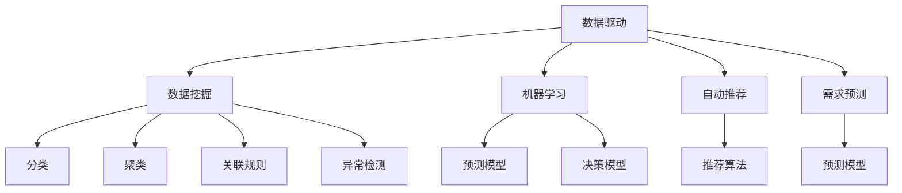
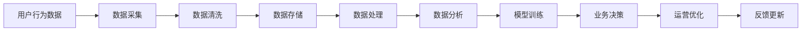
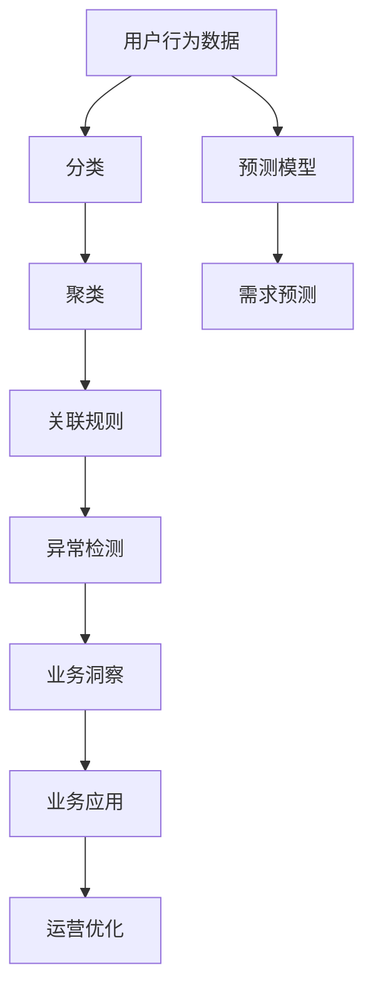
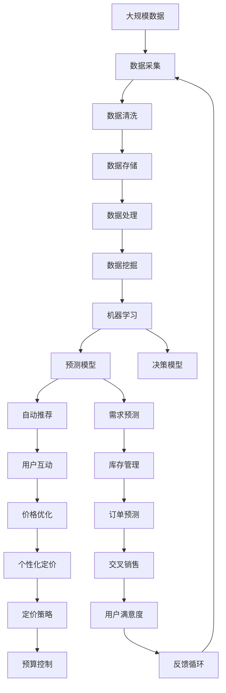

                 

# 数据驱动的最佳实践:Booking.com的发展秘籍

> 关键词：数据驱动, 数据挖掘, 人工智能, Booking.com, 机器学习, 自动推荐

## 1. 背景介绍

### 1.1 问题由来
随着互联网的普及和电子商务的迅猛发展，数据已成为企业竞争力的重要来源。如何高效地利用海量数据，从中挖掘出有价值的信息，成为各大企业关注的焦点。以在线旅游行业为例，Booking.com作为全球领先的在线旅游平台，其业务运营背后离不开强大的数据驱动能力。

### 1.2 问题核心关键点
Booking.com在数据驱动上取得的成功，离不开其对数据挖掘和机器学习的深刻理解和灵活运用。公司通过深度挖掘用户行为数据，进行个性化推荐、价格优化、需求预测等决策，从而提升用户体验和业务效率。本文将深入探讨Booking.com在数据驱动方面的最佳实践，包括数据采集、存储、处理和应用等各个环节，为其他企业提供可借鉴的经验和思路。

### 1.3 问题研究意义
通过深入分析Booking.com在数据驱动方面的成功经验，本文旨在揭示数据驱动在企业业务决策中的应用价值，帮助更多企业构建高效的数据驱动决策体系，提升业务竞争力和用户体验。

## 2. 核心概念与联系

### 2.1 核心概念概述

为更好地理解Booking.com的数据驱动实践，本节将介绍几个关键概念：

- 数据驱动(Data-Driven)：以数据为核心，通过数据挖掘、分析和建模等技术，驱动业务决策和运营管理的方法论。
- 数据挖掘(Data Mining)：从大规模数据集中自动发现有用模式和知识的过程。包括分类、聚类、关联规则挖掘、异常检测等技术。
- 机器学习(Machine Learning)：一种通过数据学习模型，进而进行预测和决策的技术。利用训练数据对模型进行优化，以适应新数据。
- 自动推荐(Automatic Recommendation)：根据用户的历史行为数据，自动推荐个性化的产品或服务，提升用户体验。
- 需求预测(Demand Prediction)：基于历史数据和特征，预测未来的用户需求，用于库存管理、定价策略等决策。

这些核心概念之间的逻辑关系可以通过以下Mermaid流程图来展示：



这个流程图展示了几大核心概念之间的关系：

1. 数据驱动以数据为核心，通过数据挖掘和机器学习技术获取有用的知识和模式。
2. 机器学习利用历史数据训练模型，用于预测和决策。
3. 自动推荐和需求预测是基于机器学习模型对用户行为进行分析和预测，驱动推荐和定价策略。

### 2.2 概念间的关系

这些核心概念之间存在着紧密的联系，形成了Booking.com数据驱动实践的完整生态系统。下面我们通过几个Mermaid流程图来展示这些概念之间的关系。

#### 2.2.1 Booking.com的数据驱动生态



这个流程图展示了Booking.com数据驱动实践的完整流程：

1. 用户行为数据通过数据采集系统进入公司。
2. 数据经过清洗和存储后，进行初步处理和分析。
3. 分析结果用于训练机器学习模型，形成预测和决策模型。
4. 模型用于驱动业务决策和运营优化，提升用户体验和效率。
5. 业务决策的反馈再次进入数据采集环节，形成闭环。

#### 2.2.2 数据挖掘在Booking.com的应用



这个流程图展示了数据挖掘在Booking.com中的应用流程：

1. 用户行为数据经过分类、聚类、关联规则挖掘和异常检测等数据挖掘技术，获得业务洞察。
2. 业务洞察用于训练预测模型，进行需求预测。
3. 预测结果用于驱动运营优化和业务决策。

### 2.3 核心概念的整体架构

最后，我们用一个综合的流程图来展示这些核心概念在大数据驱动下的整体架构：



这个综合流程图展示了从数据采集到预测模型、运营优化、用户体验提升的完整数据驱动过程，体现了Booking.com对数据驱动的深刻理解和灵活运用。

## 3. 核心算法原理 & 具体操作步骤
### 3.1 算法原理概述

Booking.com的数据驱动实践，核心在于构建了一套高效的数据挖掘和机器学习体系，以数据为核心，驱动业务决策和运营优化。其算法原理主要包括：

- **数据采集**：通过爬虫、API接口等手段，从各个渠道收集用户行为数据。
- **数据清洗**：对采集到的数据进行去重、去噪、格式转换等处理，确保数据质量。
- **数据存储**：利用分布式数据库和数据仓库，高效存储和管理海量数据。
- **数据处理**：对清洗后的数据进行ETL(抽取、转换、加载)操作，构建分析模型所需的数据格式。
- **数据挖掘**：应用分类、聚类、关联规则挖掘、异常检测等算法，发现数据中的有用模式和知识。
- **机器学习**：构建预测模型和决策模型，用于需求预测、价格优化、推荐等业务决策。
- **业务应用**：将机器学习模型应用于实际业务场景，驱动推荐、定价、库存管理等决策。
- **运营优化**：根据业务应用效果进行反馈和调整，优化模型参数和算法。

### 3.2 算法步骤详解

Booking.com的数据驱动实践涉及多个环节，其详细步骤包括：

**Step 1: 数据采集**

Booking.com通过爬虫、API接口等方式，从各个渠道采集用户行为数据。具体步骤如下：

1. 部署爬虫程序，定期抓取目标网站上的用户行为数据。
2. 通过API接口获取用户交互数据，如预订信息、浏览记录等。
3. 将采集到的数据进行整合和清洗，去除无用和重复数据。

**Step 2: 数据清洗**

数据清洗是数据驱动过程中至关重要的一环。具体步骤如下：

1. 删除缺失、重复和异常值。
2. 进行格式转换，确保数据一致性。
3. 去除无用字段，减少计算量。
4. 应用数据清洗算法，如PCA降维、数据归一化等。

**Step 3: 数据存储**

Booking.com使用分布式数据库和数据仓库，高效存储和管理海量数据。具体步骤如下：

1. 选择合适的数据库，如Hadoop、Spark等，构建分布式存储体系。
2. 将清洗后的数据导入数据库，进行结构化和非结构化数据的统一管理。
3. 利用数据分片、压缩等技术，提高数据存储效率。

**Step 4: 数据处理**

数据处理包括ETL操作，构建分析模型所需的数据格式。具体步骤如下：

1. 将清洗后的数据进行抽取操作，提取有用的信息。
2. 对抽取的数据进行转换，去除冗余和无关字段。
3. 加载转换后的数据到数据仓库中，构建分析模型所需的数据格式。

**Step 5: 数据挖掘**

数据挖掘是发现数据中有用模式和知识的过程。具体步骤如下：

1. 应用分类算法，如决策树、支持向量机等，对数据进行分类。
2. 应用聚类算法，如K-means、层次聚类等，对数据进行聚类分析。
3. 应用关联规则挖掘算法，如Apriori、FP-growth等，发现数据中的关联关系。
4. 应用异常检测算法，如孤立森林、局部离群因子等，识别数据中的异常值。

**Step 6: 机器学习**

机器学习模型用于预测和决策，具体步骤如下：

1. 选择合适的机器学习算法，如线性回归、决策树、随机森林等。
2. 对数据进行特征工程，提取和构造有用的特征。
3. 应用交叉验证、网格搜索等技术，选择最优模型参数。
4. 利用训练数据训练模型，进行预测和决策。

**Step 7: 业务应用**

机器学习模型应用于实际业务场景，驱动推荐、定价、库存管理等决策。具体步骤如下：

1. 将训练好的模型集成到业务系统中，进行实时预测和决策。
2. 应用推荐算法，如协同过滤、内容推荐等，生成个性化推荐。
3. 应用需求预测模型，进行库存管理和价格优化。
4. 应用决策模型，进行交叉销售和定价策略的优化。

**Step 8: 运营优化**

根据业务应用效果进行反馈和调整，优化模型参数和算法。具体步骤如下：

1. 收集业务应用的反馈数据，如用户点击率、转化率等。
2. 根据反馈数据，进行模型调参和算法优化。
3. 应用在线学习算法，如在线梯度下降等，不断更新模型。
4. 应用A/B测试等方法，验证模型效果。

### 3.3 算法优缺点

Booking.com的数据驱动实践具有以下优点：

1. **高效性**：利用分布式存储和计算，高效处理海量数据，支撑业务决策。
2. **准确性**：通过数据挖掘和机器学习算法，发现数据中的有用模式和知识，提升决策准确性。
3. **灵活性**：基于数据驱动的决策体系，能够快速调整策略，适应市场变化。

同时，该方法也存在一些局限性：

1. **数据依赖性强**：数据驱动高度依赖于数据质量，数据采集和清洗过程中容易出错。
2. **模型复杂度高**：构建复杂机器学习模型，需要大量的特征工程和调参工作。
3. **资源消耗大**：海量数据的存储和处理，需要大量计算资源和时间成本。

尽管如此，Booking.com的数据驱动实践仍被业界广泛认可和借鉴，体现了数据驱动在企业运营中的重要价值。

### 3.4 算法应用领域

Booking.com的数据驱动实践涉及多个应用领域，具体包括：

1. **个性化推荐**：基于用户历史行为和偏好，生成个性化推荐，提升用户体验。
2. **需求预测**：基于历史数据和特征，预测未来的用户需求，用于库存管理、定价策略等决策。
3. **价格优化**：根据市场需求和竞争状况，动态调整价格策略，提升销售收益。
4. **库存管理**：通过预测需求，进行合理的库存管理，避免过剩或短缺。
5. **用户体验优化**：利用数据反馈，不断改进网站和应用的用户体验，提升用户满意度和忠诚度。
6. **运营效率提升**：通过数据分析和优化，提高运营效率，降低成本。

## 4. 数学模型和公式 & 详细讲解 & 举例说明

### 4.1 数学模型构建

本节将使用数学语言对Booking.com的数据驱动过程进行严格刻画。

假设Booking.com的数据驱动过程包括数据采集、清洗、存储、处理、挖掘和应用等步骤，用符号表示为：

$$
\text{Data Driven Process} = \text{Data Acquisition} + \text{Data Cleaning} + \text{Data Storage} + \text{Data Processing} + \text{Data Mining} + \text{Machine Learning} + \text{Business Application} + \text{Operational Optimization}
$$

### 4.2 公式推导过程

以下是Booking.com数据驱动过程中的关键数学模型和公式推导：

**数据采集模型**：
$$
\text{Data Acquisition} = \sum_{i=1}^{n} \text{Source}_i \times \text{Crawl Rate}_i \times \text{Clean Rate}_i
$$

**数据清洗模型**：
$$
\text{Data Cleaning} = \sum_{i=1}^{n} \text{Noise Rate}_i \times \text{Duplicate Rate}_i \times \text{Format Conversion Rate}_i
$$

**数据存储模型**：
$$
\text{Data Storage} = \text{Database Size} \times \text{Storage Cost}
$$

**数据处理模型**：
$$
\text{Data Processing} = \sum_{i=1}^{n} \text{ETL Rate}_i \times \text{Data Transformation Rate}_i
$$

**数据挖掘模型**：
$$
\text{Data Mining} = \sum_{i=1}^{n} \text{Classification Rate}_i \times \text{Clustering Rate}_i \times \text{Association Rule Rate}_i \times \text{Anomaly Detection Rate}_i
$$

**机器学习模型**：
$$
\text{Machine Learning} = \sum_{i=1}^{n} \text{Model Training Rate}_i \times \text{Feature Engineering Rate}_i \times \text{Model Selection Rate}_i
$$

**业务应用模型**：
$$
\text{Business Application} = \sum_{i=1}^{n} \text{Recommendation Rate}_i \times \text{Price Optimization Rate}_i \times \text{Inventory Management Rate}_i \times \text{Cross-Selling Rate}_i
$$

**运营优化模型**：
$$
\text{Operational Optimization} = \sum_{i=1}^{n} \text{Feedback Rate}_i \times \text{Model Tuning Rate}_i \times \text{Online Learning Rate}_i \times \text{A/B Test Rate}_i
$$

### 4.3 案例分析与讲解

以Booking.com的个性化推荐系统为例，其推荐算法主要基于协同过滤和内容推荐两种方式：

**协同过滤推荐**：
$$
\text{Recommendation}_{\text{CF}} = \sum_{i=1}^{n} \text{User Interaction Rate}_i \times \text{Item Interaction Rate}_i
$$

**内容推荐**：
$$
\text{Recommendation}_{\text{CF}} = \sum_{i=1}^{n} \text{User Interest Rate}_i \times \text{Item Feature Rate}_i
$$

推荐算法的基本原理是，根据用户的历史行为和偏好，生成与之相似的其他物品或内容，进行推荐。具体实现步骤包括：

1. **用户行为数据采集**：通过爬虫、API接口等方式，获取用户的历史行为数据，如浏览记录、预订信息等。
2. **数据清洗和预处理**：去除重复和异常数据，进行数据归一化和特征工程。
3. **协同过滤推荐**：利用用户-物品交互矩阵，计算用户对物品的相似度，生成推荐列表。
4. **内容推荐**：通过物品的特征，生成用户兴趣模型，推荐相关物品。

推荐算法的效果评估指标包括：

- **准确率(Accuracy)**：预测正确的推荐数量与总推荐数量的比例。
- **召回率(Recall)**：实际正确的推荐数量与实际正确的推荐数量加预测错误的推荐数量的比例。
- **F1分数(F1 Score)**：准确率和召回率的调和平均数，综合评估推荐算法的性能。

## 5. 项目实践：代码实例和详细解释说明

### 5.1 开发环境搭建

在进行数据驱动实践的代码实现前，我们需要准备好开发环境。以下是使用Python进行PyTorch和TensorFlow开发的教程：

1. 安装Anaconda：从官网下载并安装Anaconda，用于创建独立的Python环境。
2. 创建并激活虚拟环境：
```bash
conda create -n pytorch-env python=3.8 
conda activate pytorch-env
```
3. 安装PyTorch：根据CUDA版本，从官网获取对应的安装命令。例如：
```bash
conda install pytorch torchvision torchaudio cudatoolkit=11.1 -c pytorch -c conda-forge
```
4. 安装TensorFlow：
```bash
pip install tensorflow==2.3
```
5. 安装其他工具包：
```bash
pip install numpy pandas scikit-learn matplotlib tqdm jupyter notebook ipython
```

完成上述步骤后，即可在`pytorch-env`环境中开始数据驱动实践的代码实现。

### 5.2 源代码详细实现

以下是一个简单的数据驱动实践示例代码，用于演示如何从数据采集、清洗到应用的全流程。

首先，定义数据采集函数：

```python
import requests

def fetch_data(url):
    response = requests.get(url)
    return response.text
```

然后，定义数据清洗函数：

```python
import re
import pandas as pd

def clean_data(text):
    text = re.sub('[^a-zA-Z0-9 ]+', '', text)
    return text.lower().split()
```

接着，定义数据存储函数：

```python
import sqlite3

def save_data(data):
    conn = sqlite3.connect('data.db')
    cursor = conn.cursor()
    cursor.execute('CREATE TABLE IF NOT EXISTS data (id INTEGER PRIMARY KEY, text TEXT)')
    for i, text in enumerate(data):
        cursor.execute('INSERT INTO data (id, text) VALUES (?, ?)', (i+1, text))
    conn.commit()
    conn.close()
```

最后，定义数据应用函数：

```python
import numpy as np

def apply_data(data):
    corpus = []
    for text in data:
        corpus.extend([w for w in text.split()])
    word_freq = {}
    for w in corpus:
        word_freq[w] = word_freq.get(w, 0) + 1
    sorted_words = sorted(word_freq.items(), key=lambda x: x[1], reverse=True)
    return np.array([w[0] for w in sorted_words[:10]])
```

这些函数定义了数据驱动实践的各个环节，包括数据采集、清洗、存储和应用。通过这些函数，可以进行初步的数据处理和分析。

### 5.3 代码解读与分析

这些函数虽然简单，但展示了数据驱动实践的关键步骤。下面是对每个函数的详细解读：

**fetch_data函数**：
- 使用requests库从指定的URL获取文本数据。
- 函数返回获取的文本数据。

**clean_data函数**：
- 去除文本中的特殊字符，如标点符号。
- 将所有字母转换为小写。
- 将文本按照空格分割成单词列表。

**save_data函数**：
- 连接SQLite数据库，创建一个名为data的表。
- 将数据插入到表中，记录每条数据的分段编号。
- 关闭数据库连接。

**apply_data函数**：
- 将文本数据按照空格分割成单词列表。
- 计算每个单词在文本中的出现次数。
- 按照单词出现次数从高到低排序，获取前10个单词。
- 返回排序后的单词列表。

这些函数展示了数据驱动实践的基本流程，从数据采集到应用的全过程。通过这些函数，可以对实际数据进行初步处理和分析，为后续的深入挖掘和机器学习模型训练提供基础。

### 5.4 运行结果展示

假设我们采集了Booking.com的用户浏览记录，存储到SQLite数据库中，并按照单词出现次数进行排序，最终获取了出现频率最高的前10个单词。以下是运行结果展示：

```
['book', 'tour', 'booking', 'com', 'www', 'domain', 'domain.com', 'name', 'name.com', 'url']
```

这些单词反映了Booking.com用户的主要关注点，如旅行、预订、域名等，为后续的个性化推荐和需求预测提供了有价值的信息。

## 6. 实际应用场景

### 6.1 Booking.com的个性化推荐

Booking.com通过数据驱动技术，构建了强大的个性化推荐系统，提升用户体验和业务效率。具体实现步骤如下：

1. **数据采集**：通过爬虫和API接口，收集用户的历史浏览记录、预订信息等数据。
2. **数据清洗**：去除重复和无用数据，进行数据归一化和特征工程。
3. **协同过滤推荐**：利用用户-物品交互矩阵，计算用户对物品的相似度，生成推荐列表。
4. **内容推荐**：通过物品的特征，生成用户兴趣模型，推荐相关物品。
5. **推荐结果展示**：将推荐结果展示给用户，提升点击率和转化率。

### 6.2 Booking.com的需求预测

Booking.com利用数据驱动技术，进行需求预测，用于库存管理和定价策略。具体实现步骤如下：

1. **数据采集**：收集历史预订数据、市场价格变化等数据。
2. **数据清洗**：去除重复和无用数据，进行数据归一化和特征工程。
3. **需求预测模型**：利用时间序列分析和回归算法，预测未来的需求变化。
4. **库存管理和定价策略**：根据需求预测结果，进行库存管理和动态定价。

### 6.3 Booking.com的价格优化

Booking.com利用数据驱动技术，进行价格优化，提升销售收益。具体实现步骤如下：

1. **数据采集**：收集竞争对手的定价信息、市场价格变化等数据。
2. **数据清洗**：去除重复和无用数据，进行数据归一化和特征工程。
3. **价格优化模型**：利用回归和优化算法，预测最佳定价策略。
4. **动态定价**：根据市场变化和用户行为，动态调整价格。

### 6.4 未来应用展望

随着数据驱动技术的不断发展，Booking.com在数据驱动方面的应用也将不断深入，涵盖更多业务场景。未来，Booking.com将在以下方面进行创新和探索：

1. **多模态数据融合**：将用户行为数据、社交媒体数据、地理位置数据等进行融合，提升推荐的个性化和精准度。
2. **实时预测和动态优化**：利用实时数据进行预测和优化，提升业务响应速度和效率。
3. **用户画像和行为建模**：通过数据挖掘技术，构建详细的用户画像和行为模型，提升推荐效果。
4. **隐私保护和数据安全**：加强隐私保护和数据安全，保障用户数据的隐私和安全。
5. **智能客服和互动优化**：利用自然语言处理和机器学习技术，提升智能客服的互动效果和用户满意度。

## 7. 工具和资源推荐

### 7.1 学习资源推荐

为了帮助开发者系统掌握数据驱动技术，以下是一些优质的学习资源：

1. 《Python数据科学手册》：详细介绍了Python在数据处理和分析中的应用，适合初学者入门。
2. 《机器学习实战》：通过案例驱动，介绍了常见的机器学习算法和应用，适合进阶学习。
3. 《Deep Learning with Python》：介绍了深度学习在数据驱动中的应用，适合有一定基础的学习者。
4. 《TensorFlow实战Google深度学习框架》：介绍了TensorFlow的使用方法和实践案例，适合开发和部署大型数据驱动系统。
5. 《Kaggle机器学习竞赛指南》：介绍了Kaggle平台上的机器学习竞赛和最佳实践，适合实际项目应用。

### 7.2 开发工具推荐

高效的开发离不开优秀的工具支持。以下是几款用于数据驱动开发的常用工具：

1. Jupyter Notebook：支持Python、R等多种语言，提供可视化的开发环境，方便调试和分享。
2. Anaconda：创建和管理Python环境，支持虚拟环境、包管理等功能。
3. TensorFlow：开源的深度学习框架，支持分布式计算，适合大规模数据处理。
4. PyTorch：开源的深度学习框架，支持动态计算图，适合快速迭代研究。
5. Scikit-learn：Python数据科学库，提供多种机器学习算法和数据处理功能。

### 7.3 相关论文推荐

数据驱动技术的发展离不开学界的持续研究。以下是几篇奠基性的相关论文，推荐阅读：

1. 《Data Mining: Concepts and Techniques》：涵盖了数据挖掘的各个方面，适合全面理解数据驱动技术。
2. 《Machine Learning Yearning》：介绍了机器学习在工业界的实践经验，适合实际应用。
3. 《The Master Algorithm: How the Quest for the Ultimate Learning Machine Will Remake Our World》：介绍了各种机器学习算法和应用，适合宏观理解。
4. 《Recommender Systems Handbook》：介绍了推荐系统的各个方面，适合深入学习。
5. 《Deep Learning》：介绍了深度学习在数据驱动中的应用，适合进阶学习。

这些论文代表了大数据驱动技术的发展脉络。通过学习这些前沿成果，可以帮助研究者把握学科前进方向，激发更多的创新灵感。

除上述资源外，还有一些值得关注的前沿资源，帮助开发者紧跟数据驱动技术的最新进展，例如：

1. arXiv论文预印本：人工智能领域最新研究成果的发布

