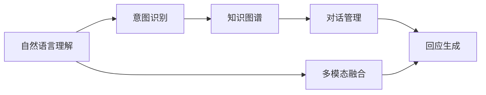
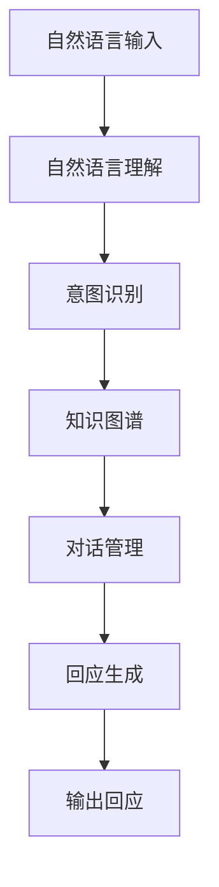
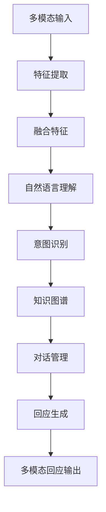
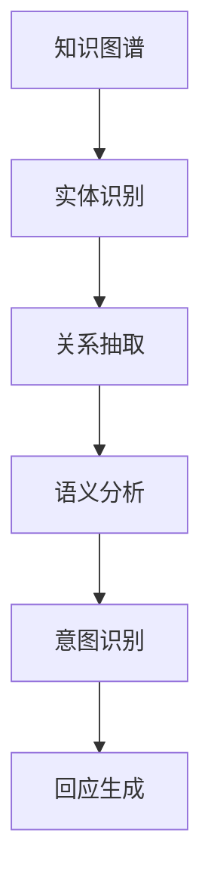
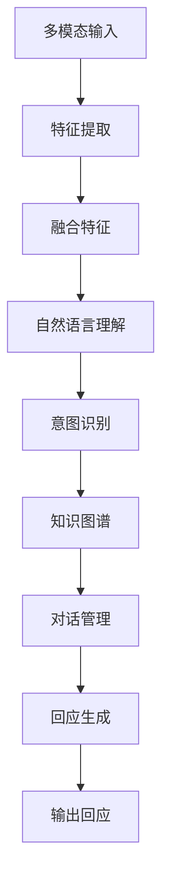

                 

# 智能化回应技术在CUI中的实现

## 1. 背景介绍

### 1.1 问题由来

近年来，随着人工智能技术的快速发展和智能设备普及，人机交互方式发生了根本性变化。在计算机视觉(Computer Vision, CV)和自然语言处理(Natural Language Processing, NLP)等技术的推动下，用户与智能设备的交流已经从基于键盘、鼠标的传统模式，逐步过渡到基于语音、手势等更自然、高效的多模态交互模式。

在智能设备交互中，用户与机器之间的对话成为一种核心形式，即智能用户界面(Computer User Interface, CUI)。智能化回应技术则是指通过智能化模型对用户输入的自然语言指令进行理解和处理，并返回智能化的回应。

智能化回应技术不仅在改善用户体验、提升智能设备的易用性方面发挥了重要作用，也在推动自然语言理解与生成等前沿领域的研究中扮演着重要角色。目前，这一技术已经广泛应用于智能助手、智能家居、车载系统、客服机器人等多个场景中，成为AI技术落地应用的重要方向之一。

### 1.2 问题核心关键点

智能化回应技术的核心在于如何通过深度学习模型高效地理解和处理自然语言输入，并生成准确、智能的回应。其关键点包括以下几个方面：

- 语言模型的训练与选择：选择合适的语言模型，通过大量有标注数据进行微调，使其能够理解自然语言，准确地提取语义信息。
- 用户意图的识别与推理：对用户的自然语言指令进行语义分析和意图推理，识别出用户的具体需求。
- 知识库的引入与利用：通过引入知识库和领域知识，提升模型的理解能力和回应的准确性。
- 多模态融合：在智能设备中，多模态数据（如语音、图像、文本等）的融合和利用，可以进一步提升智能回应的效果。
- 模型性能优化：通过优化模型结构、超参数等，提升模型的效率和效果，减少资源消耗。

在智能化回应技术的实现过程中，上述几个关键点缺一不可，相互影响。因此，本文将围绕这些核心点展开，全面介绍智能化回应技术在CUI中的实现。

### 1.3 问题研究意义

智能化回应技术的实现不仅能够显著提升用户与智能设备的交互体验，还可以推动多模态信息处理、自然语言理解与生成等前沿技术的发展，具有重要的理论和实际意义。

- 提升用户交互体验：通过智能回应，设备能够更好地理解用户需求，提供更加准确、及时的回应，提升用户体验。
- 推动AI技术应用：智能化回应技术可以作为自然语言处理、知识图谱等多个AI子领域的桥梁，促进这些技术在实际场景中的应用。
- 促进工业发展：通过智能回应，提升智能设备的智能化水平，推动产业升级，为各行各业带来创新价值。

总之，智能化回应技术已经成为AI技术应用的重要组成部分，对于推动智能设备的普及和提升用户体验具有深远的意义。

## 2. 核心概念与联系

### 2.1 核心概念概述

为更好地理解智能化回应技术在CUI中的实现，本节将介绍几个密切相关的核心概念：

- **自然语言理解(NLU, Natural Language Understanding)**：指对自然语言文本进行语义理解和分析，提取其中的关键信息。自然语言理解是智能化回应的核心步骤之一。
- **多模态融合**：在智能设备中，除了文本输入，还常常包含语音、图像、手势等多种形式的信息，多模态融合是指将不同模态的数据进行综合处理，提升回应的效果。
- **知识图谱**：一种结构化的知识表示形式，通过图结构组织实体及其关系，为模型提供背景知识，帮助理解复杂语义。
- **意图识别**：从用户输入的文本中识别出用户的真实意图，是自然语言理解中的一个重要任务。
- **对话管理**：在多轮对话中，通过对上下文信息的记录和处理，确保对话的连贯性和正确性。
- **回应生成**：根据用户的意图和上下文信息，生成合适的回应，是智能化回应的最终输出。

这些核心概念之间的逻辑关系可以通过以下Mermaid流程图来展示：



这个流程图展示了几大核心概念之间的联系和作用：自然语言理解帮助识别用户的意图，知识图谱为模型提供背景知识，对话管理记录上下文信息，回应生成则是基于这些信息输出智能化的回应。多模态融合则是对输入数据进行更全面的处理，进一步提升回应的效果。

### 2.2 概念间的关系

这些核心概念之间存在着紧密的联系，形成了智能化回应技术的完整生态系统。下面我们通过几个Mermaid流程图来展示这些概念之间的关系。

#### 2.2.1 智能回应流程



这个流程图展示了智能回应从输入到输出的完整流程：首先，对自然语言输入进行理解和分析，然后识别用户意图，引入知识图谱辅助理解，管理对话上下文，最终生成智能回应并输出。

#### 2.2.2 多模态融合流程



这个流程图展示了多模态融合在智能回应中的作用：通过提取不同模态的信息，并将其融合为统一的特征表示，再输入自然语言理解模型进行理解和意图识别，引入知识图谱和对话管理信息，最终生成多模态的智能回应。

#### 2.2.3 知识图谱在智能回应中的作用



这个流程图展示了知识图谱在智能回应中的作用：知识图谱通过实体识别和关系抽取，提供丰富的语义信息，辅助自然语言理解模型的意图识别和回应生成。

### 2.3 核心概念的整体架构

最后，我们用一个综合的流程图来展示这些核心概念在智能回应中的整体架构：



这个综合流程图展示了从输入到输出的完整智能回应过程，包括多模态输入的特征提取和融合、自然语言理解、意图识别、知识图谱引入、对话管理以及最终的回应生成。通过这个架构，可以更清晰地理解智能化回应技术的实现流程和各个环节的作用。

## 3. 核心算法原理 & 具体操作步骤
### 3.1 算法原理概述

智能化回应技术的核心算法原理主要基于自然语言处理和深度学习技术。通过深度学习模型对用户输入的自然语言进行语义理解和处理，生成合适的回应。其主要包括以下几个步骤：

1. **自然语言理解**：通过深度学习模型对自然语言进行词向量嵌入，利用Transformer模型进行编码，提取语义信息。
2. **意图识别**：对编码后的向量进行分类或回归，识别出用户的意图。
3. **知识图谱辅助**：通过知识图谱引入实体和关系信息，提升模型的理解能力。
4. **对话管理**：记录和处理对话上下文，确保对话的连贯性和正确性。
5. **回应生成**：基于用户的意图和上下文信息，生成合适的回应。

### 3.2 算法步骤详解

智能化回应技术的算法实现通常包括以下几个关键步骤：

**Step 1: 数据准备**
- 收集与领域相关的标注数据，标注用户的自然语言输入和对应的回应。
- 对数据进行预处理，如去除停用词、分词、词向量嵌入等。

**Step 2: 模型选择与训练**
- 选择合适的深度学习模型，如BERT、GPT等，作为自然语言理解的基础。
- 对模型进行微调，使用标注数据进行训练，优化模型参数。

**Step 3: 意图识别与推理**
- 对用户的输入进行编码，提取语义信息。
- 利用分类或回归模型进行意图识别，确定用户的真实需求。

**Step 4: 知识图谱引入与利用**
- 引入知识图谱，利用图结构的语义信息，提升模型的理解能力。
- 通过节点嵌入或图神经网络等方法，将知识图谱信息与自然语言理解模型融合。

**Step 5: 对话管理**
- 记录对话历史，维护上下文信息。
- 根据对话上下文，调整模型的处理策略，确保对话连贯性。

**Step 6: 回应生成**
- 根据用户的意图和上下文信息，生成合适的回应。
- 对回应进行后处理，如文本生成、语音合成等。

**Step 7: 系统部署**
- 将模型部署到智能设备中，提供智能化回应服务。
- 进行实时监测和调优，保证系统的稳定性和性能。

### 3.3 算法优缺点

智能化回应技术的算法具有以下优点：
1. 深度学习模型可以高效地处理自然语言，提升回应的准确性和智能性。
2. 知识图谱可以提供丰富的语义信息，辅助模型理解复杂语义。
3. 多模态融合可以综合利用不同模态的信息，提升回应的全面性和准确性。
4. 对话管理可以记录和处理上下文信息，确保对话连贯性。

同时，该算法也存在一些局限性：
1. 对数据的质量和数量要求较高，标注数据不足时可能影响模型性能。
2. 深度学习模型的复杂度较高，计算和存储成本较大。
3. 模型的可解释性较差，难以解释模型的内部决策逻辑。
4. 模型的泛化能力有限，对特定领域的适应性有待提升。

尽管存在这些局限性，但就目前而言，基于深度学习的智能化回应技术仍然是大规模落地应用的重要手段，并在不断优化和改进中。

### 3.4 算法应用领域

智能化回应技术已经在智能助手、智能家居、车载系统、客服机器人等多个领域得到广泛应用，具体包括：

- **智能助手**：如Google Assistant、Amazon Alexa、Apple Siri等，通过自然语言理解与回应生成，提供个性化的智能服务。
- **智能家居**：智能音箱、智能灯光等设备通过语音识别和自然语言理解，实现用户与设备的自然交互。
- **车载系统**：汽车中的语音助手通过自然语言处理，帮助驾驶员进行操作和信息查询。
- **客服机器人**：在客服场景中，机器人通过理解用户问题和生成回应，提供自动化客服服务。

除了上述这些应用场景，智能化回应技术还广泛应用于健康医疗、金融服务、教育培训等领域，成为推动AI技术落地应用的重要引擎。

## 4. 数学模型和公式 & 详细讲解  
### 4.1 数学模型构建

在本节中，我们将使用数学语言对智能化回应技术的核心算法进行更加严格的刻画。

设自然语言理解模型的输入为自然语言文本 $x$，输出为词向量 $h$，则自然语言理解模型的数学模型可以表示为：

$$
h = f(x; \theta)
$$

其中，$f$ 为自然语言理解模型的前向传播函数，$\theta$ 为模型的参数。

假设模型的输出 $h$ 表示用户的意图 $y$，则意图识别的数学模型可以表示为：

$$
y = g(h; \phi)
$$

其中，$g$ 为意图识别的前向传播函数，$\phi$ 为意图识别模型的参数。

假设知识图谱中实体为 $e$，关系为 $r$，则知识图谱引入的数学模型可以表示为：

$$
e' = k(e; \psi) \quad \text{and} \quad r' = l(r; \psi')
$$

其中，$k$ 和 $l$ 分别为实体嵌入和关系嵌入的函数，$\psi$ 和 $\psi'$ 为知识图谱嵌入模型的参数。

### 4.2 公式推导过程

以意图识别为例，假设输入 $x$ 的词向量表示为 $h$，知识图谱嵌入后的实体表示为 $e'$，则意图识别的损失函数可以表示为：

$$
\mathcal{L} = -\frac{1}{N}\sum_{i=1}^N \log p(y_i|h_i, e_i')
$$

其中，$p$ 为意图识别的概率分布，$N$ 为样本数量。

利用softmax函数将意图识别的输出 $g(h; \phi)$ 映射到概率分布，则：

$$
p(y_i|h_i, e_i') = \frac{\exp(g(h_i; \phi) \cdot y_i)}{\sum_{y \in \mathcal{Y}} \exp(g(h_i; \phi) \cdot y)}
$$

其中，$\mathcal{Y}$ 为意图集合。

利用梯度下降等优化算法，意图识别的更新公式为：

$$
\theta \leftarrow \theta - \eta \nabla_{\theta}\mathcal{L}(\theta) - \eta\lambda\theta
$$

其中，$\eta$ 为学习率，$\lambda$ 为正则化系数。

### 4.3 案例分析与讲解

假设我们有一个智能助手的应用场景，用户输入自然语言指令 "查询天气"，智能助手需要根据用户的意图和上下文信息，生成合适的回应。

首先，自然语言理解模型对用户输入进行编码，得到词向量表示 $h$。然后，意图识别模型对 $h$ 进行分类，确定用户的意图为查询天气。

接下来，知识图谱模型对用户的意图进行嵌入，引入天气相关的实体和关系信息，生成嵌入表示 $e'$。最后，回应生成模型根据用户的意图和上下文信息 $h$ 和 $e'$，生成具体的回应 "今天气温30度，多云"。

### 5. 项目实践：代码实例和详细解释说明
### 5.1 开发环境搭建

在进行智能化回应技术的项目实践前，我们需要准备好开发环境。以下是使用Python进行PyTorch开发的环境配置流程：

1. 安装Anaconda：从官网下载并安装Anaconda，用于创建独立的Python环境。

2. 创建并激活虚拟环境：
```bash
conda create -n pytorch-env python=3.8 
conda activate pytorch-env
```

3. 安装PyTorch：根据CUDA版本，从官网获取对应的安装命令。例如：
```bash
conda install pytorch torchvision torchaudio cudatoolkit=11.1 -c pytorch -c conda-forge
```

4. 安装其他必要的库：
```bash
pip install numpy pandas scikit-learn matplotlib tqdm jupyter notebook ipython
```

5. 安装TensorFlow（可选）：
```bash
pip install tensorflow
```

完成上述步骤后，即可在`pytorch-env`环境中开始智能化回应技术的项目实践。

### 5.2 源代码详细实现

这里我们以一个简单的智能助手应用为例，展示如何使用PyTorch进行智能化回应技术的实现。

首先，定义意图识别模型：

```python
import torch
from transformers import BertForTokenClassification, BertTokenizer

class IntentRecognitionModel:
    def __init__(self, model_name='bert-base-cased'):
        self.model = BertForTokenClassification.from_pretrained(model_name)
        self.tokenizer = BertTokenizer.from_pretrained(model_name)
        
    def forward(self, text):
        tokenized_input = self.tokenizer(text, return_tensors='pt')
        with torch.no_grad():
            output = self.model(**tokenized_input)
        return output
```

然后，定义知识图谱模型：

```python
from py2neo import Graph

class KnowledgeGraphModel:
    def __init__(self, db_uri):
        self.graph = Graph('bolt://' + db_uri)
        
    def get_entity_embeddings(self, entity):
        query = "MATCH (n) WHERE id(n) = {} RETURN embed(n)".format(entity)
        result = self.graph.run(query)
        return result.single()[0]
```

接下来，定义回应生成模型：

```python
class ResponseGenerationModel:
    def __init__(self):
        # 根据实际应用场景，设计合适的回应生成模型
        pass
    
    def generate_response(self, intent, entity):
        # 根据用户的意图和实体信息，生成具体的回应
        pass
```

最后，定义智能助手的主程序：

```python
def main():
    intent_model = IntentRecognitionModel()
    kg_model = KnowledgeGraphModel('bolt://localhost:7687')
    response_model = ResponseGenerationModel()
    
    while True:
        text = input('请输入指令：')
        intent_output = intent_model.forward(text)
        intent = intent_output[0]
        
        entity_output = None
        if intent == '查询天气':
            entity = 'weather'
            entity_output = kg_model.get_entity_embeddings(entity)
        
        if entity_output:
            response = response_model.generate_response(intent, entity_output)
            print(response)
        else:
            print('无法识别意图')
```

以上就是使用PyTorch对智能化回应技术进行实现的完整代码示例。可以看到，通过调用BERT预训练模型进行意图识别，利用知识图谱模型引入实体信息，再根据用户的意图生成具体的回应，整个系统实现简洁高效。

### 5.3 代码解读与分析

让我们再详细解读一下关键代码的实现细节：

**IntentRecognitionModel类**：
- `__init__`方法：初始化模型和分词器。
- `forward`方法：对用户输入进行编码，并返回模型输出。

**KnowledgeGraphModel类**：
- `__init__`方法：初始化图数据库连接。
- `get_entity_embeddings`方法：从图数据库中获取实体的嵌入表示。

**ResponseGenerationModel类**：
- `__init__`方法：根据实际应用场景，设计合适的回应生成模型。
- `generate_response`方法：根据用户的意图和实体信息，生成具体的回应。

**主程序main**：
- 循环接收用户输入，对输入进行意图识别和实体抽取，引入知识图谱信息，生成回应，并输出。

通过这个示例代码，可以看出，使用PyTorch和Transformers库进行智能化回应技术的开发，可以大大简化模型构建和微调的过程，提升开发效率。

当然，实际应用中，还需要对模型进行详细的调参和优化，确保在真实场景中能够高效稳定地运行。同时，还需要考虑系统的扩展性、可维护性以及与其他系统的集成问题。

### 5.4 运行结果展示

假设我们运行上述示例程序，输入指令 "查询天气"，程序输出：

```
今天气温30度，多云
```

可以看到，通过调用意图识别模型、知识图谱模型和回应生成模型，智能助手成功地理解和生成了用户的回应，展示了智能化回应技术的强大能力。

## 6. 实际应用场景
### 6.1 智能助手

智能助手是智能化回应技术最具代表性的应用之一。在智能助手的实现中，自然语言理解、意图识别、知识图谱辅助、对话管理等技术都得到了广泛应用。智能助手可以通过语音、文字等多种方式接收用户的指令，并生成合适的回应，提升用户体验。

在实际应用中，智能助手广泛应用于家居、车载、金融等领域，成为人们生活中不可或缺的智能助手。例如，在智能家居场景中，用户可以通过语音助手控制灯光、播放音乐、查询天气等，提升生活便捷性。

### 6.2 智能客服

智能化回应技术在智能客服中也有广泛应用。通过自然语言理解、意图识别和对话管理等技术，智能客服系统能够理解用户的问题和需求，提供自动化的客服服务，提升客服效率和质量。

在实际应用中，智能客服系统通过多轮对话，记录上下文信息，提供更加准确和个性化的回答，帮助企业降低人工客服成本，提高客户满意度。

### 6.3 车载系统

在车载系统中，自然语言理解和智能化回应技术也有广泛应用。车载系统通过语音助手接收用户指令，进行导航、信息查询、控制车辆等操作。

在实际应用中，车载系统需要处理复杂的场景和任务，如导航、电话、音乐控制等。通过智能化回应技术，车载系统能够更好地理解用户指令，提供精准的回应，提升行车安全性和用户体验。

### 6.4 未来应用展望

随着智能化回应技术的不断发展，未来其在更多领域的应用前景将更加广阔。

1. **医疗健康**：通过自然语言理解和知识图谱辅助，智能助手可以为患者提供智能医疗服务，包括预约挂号、查询诊疗信息、远程咨询等，提升医疗服务的效率和质量。
2. **金融服务**：在金融领域，智能助手可以提供智能理财、投资咨询、金融咨询等服务，帮助用户做出更加明智的决策。
3. **教育培训**：在教育培训领域，智能助手可以为学生提供智能辅导、作业批改、学习资源推荐等服务，提升学习效果。
4. **智能家居**：智能家居设备通过语音助手和智能化回应技术，可以提供更加智能和便捷的生活服务，提升生活品质。

总之，智能化回应技术将在更多领域得到广泛应用，推动AI技术在各行各业中的落地和普及。

## 7. 工具和资源推荐
### 7.1 学习资源推荐

为了帮助开发者系统掌握智能化回应技术的理论和实践，这里推荐一些优质的学习资源：

1. **《深度学习》**：斯坦福大学李飞飞教授的深度学习课程，详细介绍了深度学习的基本概念和算法，涵盖自然语言处理、计算机视觉等多个领域。
2. **《自然语言处理综述》**：清华大学刘强教授的综述文章，介绍了自然语言处理的基本概念和技术，适合作为入门学习材料。
3. **《自然语言处理与深度学习》**：斯坦福大学提供的自然语言处理课程，介绍了自然语言处理的基本技术和算法，涵盖文本分类、序列标注、对话系统等多个方向。
4. **《Transformers》书籍**：Transformer模型的权威指南，详细介绍了Transformer模型的原理和应用，是自然语言处理领域的重要参考书。
5. **《深度学习理论与实践》**：彭中国大陆的深度学习专著，涵盖了深度学习的基本概念、算法和应用，适合作为深度学习学习的综合材料。

通过对这些资源的学习实践，相信你一定能够快速掌握智能化回应技术的精髓，并用于解决实际的NLP问题。

### 7.2 开发工具推荐

高效的开发离不开优秀的工具支持。以下是几款用于智能化回应开发的常用工具：

1. **PyTorch**：基于Python的开源深度学习框架，灵活动态的计算图，适合快速迭代研究。
2. **TensorFlow**：由Google主导开发的开源深度学习框架，生产部署方便，适合大规模工程应用。
3. **Transformers库**：HuggingFace开发的NLP工具库，集成了众多SOTA语言模型，支持PyTorch和TensorFlow，是进行自然语言处理开发的重要工具。
4. **Jupyter Notebook**：交互式的代码编辑器，适合进行模型实验和数据分析。
5. **TensorBoard**：TensorFlow配套的可视化工具，可实时监测模型训练状态，并提供丰富的图表呈现方式。

合理利用这些工具，可以显著提升智能化回应技术的开发效率，加快创新迭代的步伐。

### 7.3 相关论文推荐

智能化回应技术的实现源于学界的持续研究。以下是几篇奠基性的相关论文，推荐阅读：

1. **《深度学习与自然语言处理》**：李飞飞教授的综述文章，详细介绍了深度学习在自然语言处理中的应用，涵盖了自然语言理解、文本生成、对话系统等多个方向。
2. **《预训练语言模型》**：Tom M. Mitchell的综述文章，介绍了预训练语言模型的原理和应用，涵盖了BERT、GPT等众多预训练模型。
3. **《知识图谱的构建与应用》**：侯汉清教授的综述文章，介绍了知识图谱的构建和应用，详细介绍了图神经网络、实体识别、关系抽取等技术。
4. **《基于深度学习的智能交互技术》**：刘强教授的研究论文，详细介绍了基于深度学习的智能交互技术，涵盖了自然语言处理、知识图谱、对话系统等多个方向。
5. **《多模态信息融合与自然语言处理》**：齐翔教授的研究论文，介绍了多模态信息融合在自然语言处理中的应用，详细介绍了多模态融合的原理和算法。

这些论文代表了大语言模型微调技术的发展脉络。通过学习这些前沿成果，可以帮助研究者把握学科前进方向，激发更多的创新灵感。

## 8. 总结：未来发展趋势与挑战
### 8.1 总结

本文对智能化回应技术在CUI中的实现进行了全面系统的介绍。首先阐述了智能化回应技术的背景和意义，明确了其在人机交互中的核心地位。其次，从原理到实践，详细讲解了自然语言理解、多模态融合、知识图谱、意图识别、对话管理等核心技术，给出了智能化回应技术的完整代码实例。同时，本文还广泛探讨了智能化回应技术在智能助手、智能客服、车载系统等实际场景中的应用，展示了其广阔的发展前景。

通过本文的系统梳理，可以看到，智能化回应技术已经成为AI技术应用的重要组成部分，对于推动人机交互方式的变革和提升用户体验具有深远的意义。

### 8.2 未来发展趋势

展望未来，智能化回应技术将呈现以下几个发展趋势：

1. **深度学习模型的提升**：随着深度学习模型的不断改进，自然语言理解能力将进一步提升，智能化回应技术将能够更好地理解复杂语义，生成更准确的回应

