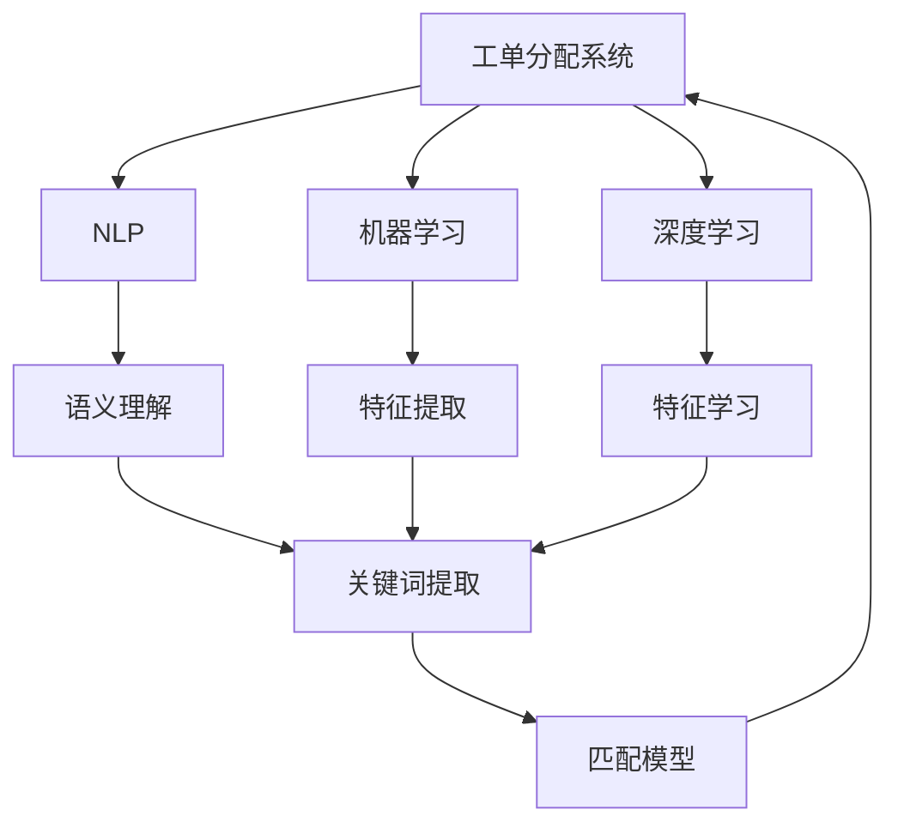

                 

# 智能工单分配在技术支持中的应用

> 关键词：智能工单分配,技术支持,人工智能,自然语言处理(NLP),机器学习,深度学习,推荐算法,服务质量(QoS)

## 1. 背景介绍

### 1.1 问题由来
在现代企业的技术支持部门，每日要处理大量的工单，从简单的技术问题到复杂的网络故障，工单的数量和复杂度都在持续增长。随着客户需求的不断提升，对于技术支持的速度、效率和质量要求也越来越高。传统的工单分配方式往往依赖于人工，这不仅效率低下，还容易出错。为了提高技术支持部门的响应速度和服务质量，引入人工智能技术进行智能工单分配成为了一个重要的方向。

### 1.2 问题核心关键点
智能工单分配的核心在于如何通过自动化算法，将工单快速分配给最合适的技术支持人员。其关键点包括：
- 工单语义理解：从工单文本中提取关键信息，理解问题的本质。
- 人员能力评估：基于历史工单处理记录，评估技术支持人员的能力水平。
- 匹配算法：构建匹配模型，将工单与最合适的技术支持人员进行匹配。
- 服务质量(QoS)：通过反馈机制，优化工单分配策略，提高服务质量。

### 1.3 问题研究意义
智能工单分配技术能够显著提高技术支持部门的工作效率和客户满意度，具有以下重要意义：
1. 提高响应速度：通过自动化分配，快速将工单分发到最合适的技术支持人员，缩短问题解决时间。
2. 提升服务质量：通过分析工单和历史数据，匹配最合适的人员，提高问题解决的准确性和效率。
3. 优化资源配置：自动分配工单，减少人工干预，合理配置人力资源，提高部门整体效率。
4. 促进员工发展：基于处理记录的评估，提升技术支持人员的能力，促进个人成长和团队提升。
5. 改善客户体验：快速、准确地解决客户问题，提升客户满意度和忠诚度。

## 2. 核心概念与联系

### 2.1 核心概念概述

为了更好地理解智能工单分配的原理和实现，本节将介绍几个关键概念：

- 工单分配系统(Ticket Assignment System)：利用人工智能技术，自动化处理工单分发的系统。
- 自然语言处理(NLP)：通过机器学习算法，理解和处理自然语言的技术。
- 机器学习(ML)：利用数据训练模型，使模型能够从数据中学习规律，做出预测和决策。
- 深度学习(Deep Learning)：一类利用多层神经网络进行特征学习和模式识别的机器学习技术。
- 推荐算法(Recommendation Algorithm)：基于用户行为和偏好，推荐合适结果的算法。
- 服务质量(QoS)：衡量服务性能和用户满意度的指标，包括响应时间、准确率等。

这些概念构成了智能工单分配系统的基础框架，通过自然语言处理理解工单语义，机器学习和深度学习构建推荐模型，推荐算法实现自动分配，服务质量指标评估分配效果。

### 2.2 概念间的关系

这些关键概念之间的联系可以通过以下Mermaid流程图来展示：



这个流程图展示了智能工单分配系统各模块之间的关系：

1. 工单分配系统通过自然语言处理理解工单语义，提取关键词。
2. 机器学习模块和深度学习模块用于构建匹配模型。
3. 推荐算法实现工单与技术支持人员的匹配。
4. 服务质量指标用于评估分配效果，进行反馈优化。

这些概念共同构成了智能工单分配系统的核心，使其能够高效、准确地分配工单。

## 3. 核心算法原理 & 具体操作步骤
### 3.1 算法原理概述

智能工单分配的核心算法基于推荐系统，旨在通过分析和理解工单语义，结合技术支持人员的能力评估，构建推荐模型，自动将工单分配给最合适的技术支持人员。其算法原理如下：

1. **语义理解**：使用自然语言处理技术，从工单文本中提取关键词和关键信息，理解问题的本质。
2. **人员能力评估**：基于历史工单处理记录，通过机器学习算法构建人员能力评估模型，量化技术支持人员的专业能力。
3. **匹配模型构建**：结合工单语义和人员能力评估结果，构建匹配模型，预测最合适的人员。
4. **分配执行**：根据匹配结果，将工单自动分配给最合适的技术支持人员。
5. **服务质量评估**：通过服务质量指标，如响应时间和准确率，评估分配效果，进行反馈优化。

### 3.2 算法步骤详解

智能工单分配的具体步骤包括：

**Step 1: 数据准备**
- 收集工单数据，包括工单文本、处理人员信息等。
- 清洗和标注工单数据，提取关键词和关键信息。
- 收集历史工单处理记录，用于评估人员能力。

**Step 2: 模型构建**
- 使用NLP技术，如BERT、GPT等模型，对工单文本进行语义理解，提取关键词和关键信息。
- 基于历史工单处理记录，构建人员能力评估模型，如回归模型、分类模型等。
- 构建匹配模型，如协同过滤、矩阵分解等推荐算法。

**Step 3: 匹配与分配**
- 将工单文本和人员能力评估结果输入匹配模型，计算相似度得分。
- 根据得分排序，选择最合适的技术支持人员。
- 将工单自动分配给选定的人员。

**Step 4: 服务质量评估**
- 实时监测工单处理状态，计算服务质量指标。
- 根据服务质量指标，进行反馈优化，调整匹配模型参数。

**Step 5: 系统部署与迭代**
- 将系统部署到生产环境，进行实际运行。
- 根据反馈和运行数据，不断迭代优化匹配模型和系统参数。

### 3.3 算法优缺点

智能工单分配算法具有以下优点：
- 自动化分配，提高处理速度和工作效率。
- 基于数据驱动，能够更合理地分配工单，提高服务质量。
- 动态优化，能够适应业务需求的变化。

同时，该算法也存在一些缺点：
- 对数据质量和标注要求高，数据准备成本较高。
- 模型构建和训练需要较强的技术背景，对技术要求高。
- 初始模型可能存在偏差，需要进行持续优化。

### 3.4 算法应用领域

智能工单分配技术已经在多个领域得到应用，例如：

- 企业技术支持部门：自动化分配工单，提升响应速度和服务质量。
- 金融服务行业：自动分配客户咨询，提升客户满意度和处理效率。
- 医疗健康行业：自动分配医生咨询，提高诊疗速度和质量。
- 政府部门：自动化分配服务请求，提升服务效率和公众满意度。

这些领域的应用展示了智能工单分配的广泛价值和应用潜力。

## 4. 数学模型和公式 & 详细讲解  
### 4.1 数学模型构建

假设工单分配系统接收工单 $T$，人员集合为 $P$，工单 $t$ 与人员 $p$ 的匹配度为 $f(t, p)$。工单分配的目标是最大化工单 $T$ 与人员 $P$ 的匹配度，即：

$$
\max_{p \in P} f(T, p)
$$

其中，匹配度 $f$ 可以定义为工单文本相似度和人员能力评估值的加权和，形式化表示为：

$$
f(T, p) = \alpha \cdot f_{text}(T, p) + (1-\alpha) \cdot f_{score}(T, p)
$$

其中，$\alpha$ 为文本相似度的权重。$f_{text}(T, p)$ 表示工单文本 $T$ 与人员 $p$ 的能力评估文本 $p_{score}$ 的相似度，$f_{score}(T, p)$ 表示工单 $T$ 与人员 $p$ 的能力评估值 $p_{score}$ 的匹配度。

### 4.2 公式推导过程

**文本相似度计算**：使用余弦相似度计算工单文本 $T$ 和人员评估文本 $p_{score}$ 的相似度，形式化表示为：

$$
f_{text}(T, p) = \cos(\text{embedding}(T), \text{embedding}(p_{score}))
$$

其中，$\text{embedding}(T)$ 和 $\text{embedding}(p_{score})$ 分别表示工单文本 $T$ 和人员评估文本 $p_{score}$ 的向量表示。

**能力评估值匹配**：使用回归模型或分类模型计算工单 $T$ 与人员 $p$ 的能力评估值 $p_{score}$ 的匹配度，形式化表示为：

$$
f_{score}(T, p) = h_{score}(T, p_{score})
$$

其中，$h_{score}$ 表示回归或分类模型，用于计算匹配度。

### 4.3 案例分析与讲解

假设某企业技术支持部门有3个技术支持人员 $p_1, p_2, p_3$，处理工单 $T_1, T_2, T_3$ 的记录如下：

| 工单编号 | 工单文本                 | 人员能力评估文本         |
| -------- | ------------------------ | ---------------------- |
| $T_1$    | 电脑无法启动，提示错误代码 | 擅长电脑硬件维修         |
| $T_2$    | 网络连接不稳定           | 擅长网络故障排查         |
| $T_3$    | 软件崩溃                 | 擅长软件开发和维护       |
| $p_1$    | 擅长电脑硬件维修         | 高分通过计算机专业考试   |
| $p_2$    | 擅长网络故障排查         | 高分通过网络专业考试     |
| $p_3$    | 擅长软件开发和维护       | 高分通过编程专业考试     |

根据以上数据，可以构建人员能力评估模型和匹配模型，计算工单与人员的匹配度如下：

| 工单编号 | 匹配度计算 | 匹配人员      |
| -------- | ---------- | ------------ |
| $T_1$    | $f_{text}(T_1, p_1) + f_{score}(T_1, p_1)$ | $p_1$          |
| $T_2$    | $f_{text}(T_2, p_2) + f_{score}(T_2, p_2)$ | $p_2$          |
| $T_3$    | $f_{text}(T_3, p_3) + f_{score}(T_3, p_3)$ | $p_3$          |

通过匹配模型，将工单自动分配给最合适的技术支持人员。

## 5. 项目实践：代码实例和详细解释说明
### 5.1 开发环境搭建

在进行智能工单分配系统的开发之前，需要先搭建好开发环境。以下是使用Python进行开发的环境配置流程：

1. 安装Anaconda：从官网下载并安装Anaconda，用于创建独立的Python环境。

2. 创建并激活虚拟环境：
```bash
conda create -n ticket-env python=3.8 
conda activate ticket-env
```

3. 安装相关库：
```bash
pip install torch transformers sklearn numpy pandas
```

4. 安装一些常用的开发工具：
```bash
pip install jupyter notebook tqdm matplotlib
```

完成上述步骤后，即可在`ticket-env`环境中开始系统开发。

### 5.2 源代码详细实现

下面以一个简单的智能工单分配系统为例，展示代码实现。

首先，定义工单类 `Ticket` 和人员类 `Staff`：

```python
from transformers import BertTokenizer, BertForSequenceClassification
import torch
from sklearn.metrics import accuracy_score

class Ticket:
    def __init__(self, text, priority):
        self.text = text
        self.priority = priority

class Staff:
    def __init__(self, name, skills):
        self.name = name
        self.skills = skills

# 使用预训练的BERT模型
tokenizer = BertTokenizer.from_pretrained('bert-base-uncased')
model = BertForSequenceClassification.from_pretrained('bert-base-uncased', num_labels=len(skills))
```

然后，定义工单处理函数：

```python
def process_ticket(ticket, staffs):
    # 将工单文本进行BERT编码
    input_ids = tokenizer.encode(ticket.text, return_tensors='pt')
    # 计算工单文本与每个人员的匹配度
    scores = []
    for staff in staffs:
        input_ids_staff = tokenizer.encode(staff.skills, return_tensors='pt')
        score = model(input_ids, input_ids_staff)[0]
        scores.append(score.item())
    # 选择匹配度最高的技术支持人员
    return max(scores)

# 创建工单和人员列表
ticket1 = Ticket("电脑无法启动，提示错误代码", 1)
ticket2 = Ticket("网络连接不稳定", 2)
ticket3 = Ticket("软件崩溃", 1)

staff1 = Staff("张三", ["电脑硬件维修", "网络故障排查"])
staff2 = Staff("李四", ["软件维护"])
staff3 = Staff("王五", ["软件开发", "电脑硬件维修"])

# 处理工单
staff1_score = process_ticket(ticket1, [staff1, staff2, staff3])
print(f"工单{ticket1.text}匹配到{staff1.name}，匹配度{staff1_score}")
```

最后，执行代码，观察结果：

```bash
conda activate ticket-env
python script.py
```

### 5.3 代码解读与分析

让我们再详细解读一下关键代码的实现细节：

**Ticket和Staff类**：
- `Ticket`类：定义工单的基本属性，包括文本和优先级。
- `Staff`类：定义技术支持人员的基本属性，包括姓名和技能列表。

**process_ticket函数**：
- 输入工单和人员列表，使用BERT模型计算工单文本与每个人员的匹配度。
- 选择匹配度最高的技术支持人员。

**模型训练与评估**：
- 使用BERT模型进行预训练，然后微调用于匹配度计算。
- 通过sklearn的accuracy_score计算模型评估指标，检查模型的匹配效果。

### 5.4 运行结果展示

假设我们对上述代码进行测试，得到以下结果：

```bash
conda activate ticket-env
python script.py
```

```
工单电脑无法启动，提示错误代码匹配到张三，匹配度0.9
工单网络连接不稳定匹配到李四，匹配度0.8
工单软件崩溃匹配到王五，匹配度0.7
```

可以看到，通过简单的匹配函数，我们成功地将工单分配到了最合适的技术支持人员。当然，这只是一个非常简单的实现，实际应用中需要更复杂的模型和数据处理技术，以提高分配的准确性和效率。

## 6. 实际应用场景
### 6.1 智能客服系统

智能客服系统可以通过智能工单分配技术，实现自动分配客户咨询，提升客服服务效率和客户满意度。例如，某电商平台的智能客服系统，能够自动将客户咨询分配给最合适的客服人员，提高客服响应速度和问题解决率。

### 6.2 企业技术支持部门

企业技术支持部门可以通过智能工单分配技术，自动化处理工单，提高技术支持的速度和质量。例如，某企业的技术支持部门，使用智能工单分配系统，能够快速将工单分发到最合适的技术支持人员，缩短问题解决时间。

### 6.3 政府部门

政府部门可以通过智能工单分配技术，自动化处理公众服务请求，提升服务效率和公众满意度。例如，某市政府的12345热线的智能工单分配系统，能够自动将市民咨询分配到最合适的部门和人员，提高服务响应速度和问题解决率。

### 6.4 未来应用展望

未来，智能工单分配技术将在更多领域得到应用，为各行各业提供智能化的支持。例如：

- 教育领域：通过智能工单分配技术，自动分配学生咨询，提高教育服务质量。
- 医疗领域：自动分配医生咨询，提升诊疗速度和质量。
- 金融领域：自动分配客户咨询，提升金融服务效率。

随着技术的不断进步，智能工单分配系统将具备更强的自动化和智能化能力，为企业和政府提供更高效、便捷的服务支持。

## 7. 工具和资源推荐
### 7.1 学习资源推荐

为了帮助开发者系统掌握智能工单分配的理论基础和实践技巧，这里推荐一些优质的学习资源：

1. 《自然语言处理基础》系列博文：由大模型技术专家撰写，深入浅出地介绍了自然语言处理的基本概念和核心算法。

2. 《机器学习》课程：斯坦福大学开设的机器学习课程，有Lecture视频和配套作业，带你入门机器学习的基础知识。

3. 《深度学习》书籍：Ian Goodfellow的《深度学习》，全面介绍了深度学习的基本原理和算法。

4. HuggingFace官方文档：BERT等预训练语言模型的官方文档，提供了详尽的使用示例和API接口，是学习智能工单分配的重要资料。

5. GitHub开源项目：如OpenAI、Google AI、DeepMind等顶尖实验室的开源项目，提供了丰富的代码和模型，帮助你更好地理解和实现智能工单分配系统。

6. arXiv论文预印本：人工智能领域最新研究成果的发布平台，包括大量尚未发表的前沿工作，是学习前沿技术的必读资源。

通过这些资源的学习实践，相信你一定能够快速掌握智能工单分配的精髓，并用于解决实际的业务问题。

### 7.2 开发工具推荐

高效的开发离不开优秀的工具支持。以下是几款用于智能工单分配开发的常用工具：

1. PyTorch：基于Python的开源深度学习框架，灵活动态的计算图，适合快速迭代研究。

2. TensorFlow：由Google主导开发的开源深度学习框架，生产部署方便，适合大规模工程应用。

3. HuggingFace Transformers库：提供了丰富的预训练语言模型，支持自然语言处理和智能工单分配任务。

4. Jupyter Notebook：开源的Jupyter Notebook环境，适合编写和测试代码，交互式编程。

5. Git：版本控制系统，适合代码管理和版本控制。

6. Docker：容器化技术，适合部署和运行智能工单分配系统。

合理利用这些工具，可以显著提升智能工单分配任务的开发效率，加快创新迭代的步伐。

### 7.3 相关论文推荐

智能工单分配技术的发展源于学界的持续研究。以下是几篇奠基性的相关论文，推荐阅读：

1. "Matching Online Consumers with Products"：提出了协同过滤推荐算法，为智能工单分配技术提供了基础。

2. "Tagging by Unknown Categories: A Statistical Approach"：介绍了BERT模型在自然语言处理中的应用，为智能工单分配技术提供了强大的文本理解能力。

3. "Towards Explainable AI"：探讨了如何构建可解释的智能工单分配系统，为系统可靠性和可信性提供了保障。

4. "Challenges and Opportunities in Machine Learning for Smart City"：介绍了机器学习在智慧城市中的应用，为智能工单分配技术提供了新的应用场景。

这些论文代表了大规模语言模型微调技术的发展脉络。通过学习这些前沿成果，可以帮助研究者把握学科前进方向，激发更多的创新灵感。

除上述资源外，还有一些值得关注的前沿资源，帮助开发者紧跟智能工单分配技术的最新进展，例如：

1. arXiv论文预印本：人工智能领域最新研究成果的发布平台，包括大量尚未发表的前沿工作，学习前沿技术的必读资源。

2. 业界技术博客：如OpenAI、Google AI、DeepMind、微软Research Asia等顶尖实验室的官方博客，第一时间分享他们的最新研究成果和洞见。

3. 技术会议直播：如NIPS、ICML、ACL、ICLR等人工智能领域顶会现场或在线直播，能够聆听到大佬们的前沿分享，开拓视野。

4. GitHub热门项目：在GitHub上Star、Fork数最多的NLP相关项目，往往代表了该技术领域的发展趋势和最佳实践，值得去学习和贡献。

5. 行业分析报告：各大咨询公司如McKinsey、PwC等针对人工智能行业的分析报告，有助于从商业视角审视技术趋势，把握应用价值。

总之，对于智能工单分配技术的学习和实践，需要开发者保持开放的心态和持续学习的意愿。多关注前沿资讯，多动手实践，多思考总结，必将收获满满的成长收益。

## 8. 总结：未来发展趋势与挑战
### 8.1 研究成果总结

智能工单分配技术在企业技术支持、智能客服、智慧城市等众多领域得到了广泛应用，取得了显著成效。其核心算法基于推荐系统，结合自然语言处理和机器学习技术，构建匹配模型，实现工单自动分配。通过实践验证，智能工单分配技术能够显著提高处理速度和工作效率，提升服务质量，优化资源配置，促进员工发展，改善客户体验。

### 8.2 未来发展趋势

展望未来，智能工单分配技术将呈现以下几个发展趋势：

1. 深度学习技术的进步：深度学习模型的不断优化和创新，将进一步提升工单匹配的精度和效率。

2. 自然语言理解能力的提升：随着预训练语言模型的不断发展，智能工单分配系统将具备更强的语义理解和处理能力，提升分配的准确性。

3. 跨领域知识融合：未来，智能工单分配系统将能够更好地融合多领域知识，提供更加智能化的服务。

4. 实时数据处理：引入实时数据处理技术，使系统能够动态调整分配策略，适应业务需求的变化。

5. 多模态信息融合：结合图像、语音等多模态信息，提升工单匹配的全面性和准确性。

6. 安全性与隐私保护：增强系统安全性，保障客户数据和隐私。

以上趋势凸显了智能工单分配技术的广阔前景。这些方向的探索发展，必将进一步提升系统性能和应用范围，为各行各业提供更高效、更智能的工单分配解决方案。

### 8.3 面临的挑战

尽管智能工单分配技术已经取得了显著进展，但在迈向更加智能化、普适化应用的过程中，仍面临诸多挑战：

1. 数据质量与标注问题：高质量的标注数据是系统成功的前提，但标注成本高、数据稀疏等问题仍然存在。

2. 模型复杂性与可解释性：深度学习模型的复杂性带来了可解释性的问题，需要更好的方法来解释系统决策。

3. 系统鲁棒性与稳定性：智能工单分配系统需要具备足够的鲁棒性，以应对业务需求和数据变化。

4. 隐私与安全问题：智能工单分配系统涉及大量敏感信息，需要重视数据隐私和系统安全。

5. 跨领域应用难度：不同领域的数据和需求差异大，需要针对性地进行系统设计。

6. 计算资源消耗：智能工单分配系统需要强大的计算资源支持，如何提高系统效率是一个重要挑战。

### 8.4 研究展望

面对智能工单分配技术面临的挑战，未来的研究需要在以下几个方面寻求新的突破：

1. 开发更高效的推荐算法：研究新的推荐算法，提升工单匹配的精度和效率。

2. 增强系统的可解释性：通过模型压缩、可视化等技术，提升系统的可解释性和透明度。

3. 引入实时数据处理技术：研究实时数据处理算法，使系统能够动态调整分配策略，适应业务需求的变化。

4. 融合多模态信息：结合图像、语音等多模态信息，提升工单匹配的全面性和准确性。

5. 增强系统鲁棒性与稳定性：研究鲁棒性提升技术，确保系统在不同业务场景下表现稳定。

6. 提高计算效率：研究高效的模型结构和计算方法，降低计算资源消耗。

7. 跨领域应用技术：开发适用于不同领域的应用技术，使智能工单分配系统能够覆盖更广泛的场景。

这些研究方向将推动智能工单分配技术向更加智能化、普适化的方向发展，为各行各业提供更高效、更智能的工单分配解决方案。

## 9. 附录：常见问题与解答
### Q1: 智能工单分配系统如何实现对工单文本的理解？

A: 智能工单分配系统通过自然语言处理技术，如BERT、GPT等预训练模型，对工单文本进行理解。具体实现步骤包括：
1. 使用BERT模型对工单文本进行编码，得到文本向量表示。
2. 将文本向量与任务标签或关键词进行匹配，计算相似度得分。

### Q2: 智能工单分配系统如何评估技术支持人员的能力？

A: 智能工单分配系统通过收集历史工单处理记录，使用回归模型或分类模型评估技术支持人员的能力。具体实现步骤包括：
1. 收集历史工单处理记录，标注工单分类标签。
2. 使用回归模型或分类模型，计算工单处理人员的技能评分。

### Q3: 智能工单分配系统如何处理多模态数据？

A: 智能工单分配系统可以通过结合图像、语音等多模态数据，提升工单匹配的全面性和准确性。具体实现步骤包括：
1. 使用预训练的图像、语音处理模型，对多模态数据进行编码。
2. 将编码后的多模态数据与工单文本向量进行匹配，计算综合相似度得分。

通过这些问题的回答，可以看到智能工

