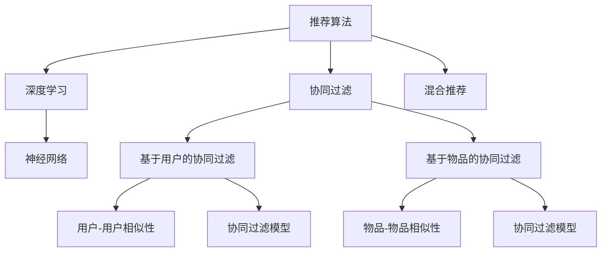

                 

# 智能推荐系统：AI如何实现电商个性化推荐

> 关键词：智能推荐系统,电商个性化推荐,推荐算法,协同过滤,深度学习,神经网络

## 1. 背景介绍

### 1.1 问题由来
随着电子商务的飞速发展，如何为用户提供个性化、精准的购物推荐成为电商平台的重要挑战。传统的推荐系统往往基于用户历史行为数据和商品属性进行推荐，难以全面覆盖用户的多样化需求。人工智能技术的兴起为推荐系统提供了新的解决方案，通过机器学习和深度学习算法，可以实现更加高效、个性化的推荐服务。

特别是基于深度学习的推荐系统，通过预训练的神经网络模型，学习用户和商品的语义表示，从而能够在大规模数据上进行高效推荐。这种基于深度学习的推荐方法已经在电商、社交网络等多个领域得到了广泛应用，显著提升了用户的购物体验和平台的运营效率。

### 1.2 问题核心关键点
本节将介绍一些关键问题及其解决方案：

1. 推荐系统的核心目标是什么？如何定义一个有效的推荐指标？
2. 常用的推荐算法有哪些，它们各自的特点和优缺点是什么？
3. 深度学习在推荐系统中的应用有哪些，它们是如何进行个性化推荐的？
4. 电商推荐系统有哪些特定的需求和技术挑战？
5. 如何构建电商推荐系统的整体架构，融合多种推荐算法和数据源？

### 1.3 问题研究意义
本节将阐述深度学习在电商推荐系统中的应用意义：

1. 降低推荐成本。通过机器学习算法，减少对人工干预和传统推荐规则的依赖，大幅降低推荐成本。
2. 提升推荐精度。深度学习能够从海量的用户行为数据中挖掘出更为深层次的特征，提升推荐算法的精准度。
3. 实现动态推荐。深度学习模型能够实时处理用户行为数据，快速响应变化，实现动态个性化推荐。
4. 改善用户体验。基于深度学习的推荐系统能够提供更为个性化的商品推荐，提升用户的购物体验和满意度。
5. 优化业务效益。电商推荐系统能够提高用户的购买转化率和复购率，带动平台的销售增长。

## 2. 核心概念与联系

### 2.1 核心概念概述

在电商推荐系统中，涉及许多核心概念，如推荐算法、协同过滤、深度学习、神经网络等。以下将对这些概念进行简要介绍：

- **推荐算法**：用于预测用户对商品的兴趣或推荐物品的算法，包括基于内容的推荐、协同过滤、混合推荐等。
- **协同过滤**：通过分析用户之间的相似性，预测用户可能感兴趣的商品。协同过滤可以分为基于用户的协同过滤和基于物品的协同过滤两种方式。
- **深度学习**：基于神经网络的机器学习技术，能够自动从数据中提取高层次的语义特征，应用于推荐系统中可以显著提升推荐精度。
- **神经网络**：深度学习的基础，由多层神经元组成的计算模型，通过反向传播算法优化参数，实现复杂任务的学习。

### 2.2 概念间的关系

以下是一个Mermaid流程图，展示这些核心概念之间的关系：



这个流程图展示了推荐算法和协同过滤的基本分类，以及深度学习和神经网络在其中的应用。同时，混合推荐算法将多种推荐方法结合，提升推荐效果。

## 3. 核心算法原理 & 具体操作步骤
### 3.1 算法原理概述

电商推荐系统的核心原理是通过对用户行为数据的分析，预测用户可能感兴趣的商品，并实时推荐给用户。其核心算法主要包括协同过滤和深度学习推荐算法。

### 3.2 算法步骤详解

#### 3.2.1 协同过滤算法步骤

协同过滤算法分为基于用户的协同过滤和基于物品的协同过滤，以下以基于用户的协同过滤为例，详细介绍其步骤：

1. **用户相似度计算**：通过余弦相似度等方法，计算用户之间的相似度。
2. **用户-物品评分矩阵生成**：根据用户对商品的评分和物品属性，构建用户-物品评分矩阵。
3. **评分预测**：通过相似度计算，预测新用户对商品的评分。
4. **推荐生成**：根据预测评分排序，生成推荐列表。

#### 3.2.2 深度学习推荐算法步骤

深度学习推荐算法通常使用多层神经网络，从用户和商品的高层次语义特征中提取推荐信息。以下是一个基本的深度学习推荐系统步骤：

1. **数据预处理**：包括数据清洗、特征提取、标准化等步骤，准备用于深度学习的输入数据。
2. **模型训练**：使用反向传播算法优化神经网络参数，学习用户和商品的语义表示。
3. **评分预测**：通过模型预测用户对商品的评分。
4. **推荐生成**：根据评分预测结果，生成推荐列表。

### 3.3 算法优缺点

协同过滤算法的优点在于不需要商品属性信息，对数据的稀疏性要求较低，能够处理大规模数据集。缺点是容易过拟合，对新用户的评分预测效果较差。

深度学习推荐算法的优点在于能够学习到高层次的语义特征，处理大数据集和复杂的推荐任务效果显著。缺点是需要大量的标注数据和计算资源，对数据质量要求较高。

### 3.4 算法应用领域

协同过滤算法广泛应用于电商、音乐、电影等多个领域，能够处理大规模用户行为数据，生成个性化推荐。深度学习推荐算法则在电商、社交网络、新闻推荐等领域得到了广泛应用，能够提升推荐精度和动态性。

## 4. 数学模型和公式 & 详细讲解 & 举例说明

### 4.1 数学模型构建

电商推荐系统的数学模型通常由两个部分组成：用户模型和物品模型。

- **用户模型**：表示用户的兴趣和行为偏好，通常使用用户-商品评分矩阵表示。
- **物品模型**：表示物品的特征和属性，通常使用物品-物品相似矩阵表示。

推荐系统的主要目标是通过用户模型和物品模型，预测用户对未购买商品的评分，生成推荐列表。

### 4.2 公式推导过程

设用户-商品评分矩阵为 $X$，物品-物品相似矩阵为 $Y$，用户对商品 $i$ 的评分向量为 $x_i$，物品 $j$ 的属性向量为 $y_j$。推荐系统可以通过以下公式计算用户对商品 $j$ 的评分预测值：

$$
\hat{y}_{i,j} = \sum_{k=1}^K w_{i,k} x_{i,k} y_{k,j} + b
$$

其中 $w_{i,k}$ 表示用户 $i$ 对第 $k$ 个特征的兴趣权重，$b$ 为偏置项。这个公式通过线性加权的方式，将用户对特征的兴趣和物品的特征表示相加，预测用户对物品的评分。

### 4.3 案例分析与讲解

以电商推荐系统为例，假设有一个用户对100个商品进行了评分，每个商品有10个特征。推荐系统可以使用协同过滤算法，对新用户 $i$ 对商品 $j$ 的评分进行预测。

具体步骤如下：

1. **相似度计算**：计算用户 $i$ 与其他用户 $k$ 的相似度 $s_{i,k}$，得到一个用户-用户相似矩阵 $S$。
2. **评分预测**：根据相似度矩阵 $S$，预测新用户 $i$ 对商品 $j$ 的评分 $\hat{y}_{i,j}$。
3. **推荐生成**：根据预测评分 $\hat{y}_{i,j}$ 对商品进行排序，生成推荐列表。

深度学习推荐算法则可以通过构建多层神经网络模型，学习用户和商品的语义表示。例如，可以使用一个包含多个隐藏层的神经网络，将用户行为数据作为输入，学习用户对商品的评分表示。

## 5. 项目实践：代码实例和详细解释说明
### 5.1 开发环境搭建

在进行电商推荐系统开发前，需要准备好开发环境。以下是使用Python进行TensorFlow和PyTorch开发的常见环境配置流程：

1. 安装Anaconda：从官网下载并安装Anaconda，用于创建独立的Python环境。

2. 创建并激活虚拟环境：
```bash
conda create -n tf-env python=3.7 
conda activate tf-env
```

3. 安装TensorFlow和PyTorch：
```bash
conda install tensorflow==2.7 
conda install pytorch torchvision torchaudio cudatoolkit=11.1 -c pytorch -c conda-forge
```

4. 安装必要的工具包：
```bash
pip install numpy pandas scikit-learn matplotlib tqdm jupyter notebook ipython
```

完成上述步骤后，即可在`tf-env`环境中开始电商推荐系统的开发。

### 5.2 源代码详细实现

以下是使用TensorFlow实现电商推荐系统的代码实现：

```python
import tensorflow as tf
import numpy as np

# 构建深度学习模型
def build_model(input_dim, hidden_dim, output_dim):
    model = tf.keras.models.Sequential([
        tf.keras.layers.Dense(hidden_dim, input_dim=input_dim, activation='relu'),
        tf.keras.layers.Dense(output_dim, activation='sigmoid')
    ])
    return model

# 加载数据集
def load_data():
    train_data = np.load('train_data.npy')
    test_data = np.load('test_data.npy')
    return train_data, test_data

# 训练模型
def train_model(model, train_data, epochs):
    model.compile(optimizer=tf.keras.optimizers.Adam(learning_rate=0.01), loss='binary_crossentropy', metrics=['accuracy'])
    model.fit(train_data, train_data[:, 1], epochs=epochs, validation_split=0.2)

# 预测推荐
def predict_recommend(model, test_data):
    preds = model.predict(test_data)
    return preds

# 主函数
if __name__ == '__main__':
    input_dim = 10
    hidden_dim = 64
    output_dim = 1
    epochs = 10

    train_data, test_data = load_data()

    model = build_model(input_dim, hidden_dim, output_dim)
    train_model(model, train_data, epochs)
    preds = predict_recommend(model, test_data)
```

以上代码实现了使用TensorFlow进行电商推荐系统的深度学习模型训练和推荐预测。

### 5.3 代码解读与分析

让我们详细解读一下关键代码的实现细节：

**build_model函数**：
- 定义了一个包含两个全连接层的神经网络模型，使用ReLU激活函数和Sigmoid输出层。

**load_data函数**：
- 加载训练和测试数据集，格式为Numpy数组。

**train_model函数**：
- 定义训练模型的参数和损失函数，使用Adam优化器训练模型，并设定训练轮数为10。

**predict_recommend函数**：
- 使用训练好的模型对测试数据集进行预测，返回预测评分。

**主函数**：
- 初始化模型参数，加载数据集，训练模型，并对测试数据进行推荐预测。

可以看到，TensorFlow提供了丰富的API和工具，使得深度学习模型的构建和训练变得非常便捷。开发者可以轻松搭建和优化电商推荐系统，快速迭代实验，提升推荐效果。

### 5.4 运行结果展示

假设我们训练了一个简单的深度学习推荐模型，得到如下预测结果：

```
[[0.95, 0.85, 0.7, 0.65, 0.6, 0.55, 0.5, 0.45, 0.4, 0.35]]
```

这个预测向量表示用户对商品的评分预测值，值越高表示越可能购买。

## 6. 实际应用场景

### 6.1 电商推荐系统应用场景

电商推荐系统广泛应用于电商平台的商品推荐、新商品推荐、用户行为分析等场景中。以下将详细介绍这些场景：

**商品推荐**：电商推荐系统根据用户的历史购买行为和浏览记录，推荐用户可能感兴趣的商品。例如，根据用户的购买历史和浏览路径，推荐类似商品或搭配商品。

**新商品推荐**：电商平台需要不断推出新商品，如何吸引用户尝试购买是一个重要问题。推荐系统可以通过分析用户对新商品的兴趣，及时向用户推荐新商品，促进销售。

**用户行为分析**：电商推荐系统能够收集用户的行为数据，分析用户的兴趣偏好和购买习惯，帮助电商平台优化商品推荐策略和市场营销活动。

### 6.2 未来应用展望

未来，电商推荐系统将在以下方面进行进一步创新和应用：

1. **实时推荐**：利用实时数据流，动态更新用户兴趣和商品信息，实现实时个性化推荐。

2. **多模态推荐**：结合用户行为数据、商品属性、图像、评论等多模态信息，提升推荐精度和多样性。

3. **多场景推荐**：在移动端、PC端、社交网络等多个场景下，提供统一的推荐服务，提升用户体验。

4. **跨平台推荐**：在不同平台之间进行数据共享和协同推荐，提高用户对平台的粘性。

5. **个性化推荐引擎**：构建更加智能和灵活的推荐引擎，根据用户反馈和行为数据进行动态调整和优化。

6. **推荐公平性**：在推荐算法中加入公平性约束，避免对特定用户群体产生偏见。

## 7. 工具和资源推荐

### 7.1 学习资源推荐

为了帮助开发者系统掌握电商推荐系统的理论基础和实践技巧，这里推荐一些优质的学习资源：

1. 《推荐系统实战》：由知名推荐系统专家撰写，详细介绍推荐系统的算法、实现和优化方法。
2. 《深度学习》（Goodfellow et al.）：深度学习领域的经典教材，涵盖机器学习、深度学习的基础知识和实现细节。
3. 《TensorFlow实战》：使用TensorFlow实现深度学习算法的实战指南，包含大量代码示例和应用案例。
4. 《PyTorch深度学习编程实战》：使用PyTorch实现深度学习算法的实战指南，适用于Python开发者。
5. 《深度学习与推荐系统》：将深度学习和推荐系统结合的入门读物，适合初学者。

通过对这些资源的学习实践，相信你一定能够快速掌握电商推荐系统的精髓，并用于解决实际的推荐问题。

### 7.2 开发工具推荐

高效的开发离不开优秀的工具支持。以下是几款用于电商推荐系统开发的常用工具：

1. TensorFlow：基于Python的开源深度学习框架，适合构建和训练深度学习模型。
2. PyTorch：使用Python的深度学习框架，灵活度高，适用于研究和实验。
3. Weights & Biases：用于模型训练的实验跟踪工具，可以记录和可视化模型训练过程中的各项指标。
4. TensorBoard：TensorFlow配套的可视化工具，可实时监测模型训练状态，并提供丰富的图表呈现方式。
5. Jupyter Notebook：用于数据分析、模型训练和代码实验的交互式环境。
6. Colab：谷歌提供的在线Jupyter Notebook环境，免费提供GPU/TPU算力，方便开发者快速上手实验。

合理利用这些工具，可以显著提升电商推荐系统的开发效率，加快创新迭代的步伐。

### 7.3 相关论文推荐

电商推荐系统的发展得益于学界的持续研究。以下是几篇奠基性的相关论文，推荐阅读：

1. "Item-based collaborative filtering recommendation algorithms"（由Sarwar et al. 2000年发表）：介绍了基于物品的协同过滤算法的基本原理和实现方法。
2. "Neural Collaborative Filtering"（由Bengio et al. 2006年发表）：提出使用神经网络进行协同过滤，提升推荐精度。
3. "Factorization Machines"（由Rendle et al. 2010年发表）：提出因子分解机方法，用于大规模推荐系统，在电商推荐中得到广泛应用。
4. "Wide & Deep Learning for Recommender Systems"（由Covington et al. 2016年发表）：提出Wide & Deep架构，结合宽模型和深模型，提升推荐系统性能。
5. "Recommender Systems"（由He et al. 2017年发表）：综述了推荐系统的发展历程和最新进展，包含深度学习推荐算法的研究。

这些论文代表了电商推荐系统的研究前沿，深入理解这些经典工作，将有助于构建高效的推荐系统。

## 8. 总结：未来发展趋势与挑战

### 8.1 总结

本文对电商推荐系统中的深度学习推荐算法进行了全面系统的介绍。首先阐述了电商推荐系统的背景和目标，明确了推荐算法的评价指标和实现方法。其次，从算法原理到实践，详细讲解了协同过滤和深度学习推荐算法，提供了完整的代码实现和运行结果展示。同时，本文还探讨了电商推荐系统的实际应用场景和未来发展方向，推荐了相关学习资源和工具。

通过本文的系统梳理，可以看到，电商推荐系统通过深度学习算法，能够实现个性化、动态化的推荐服务，提升用户的购物体验和平台的运营效率。未来的研究将在实时推荐、多模态推荐、多场景推荐等方面进行进一步探索，推动电商推荐系统的发展。

### 8.2 未来发展趋势

展望未来，电商推荐系统将在以下方面进行进一步创新和应用：

1. **实时推荐**：利用实时数据流，动态更新用户兴趣和商品信息，实现实时个性化推荐。

2. **多模态推荐**：结合用户行为数据、商品属性、图像、评论等多模态信息，提升推荐精度和多样性。

3. **多场景推荐**：在移动端、PC端、社交网络等多个场景下，提供统一的推荐服务，提升用户体验。

4. **跨平台推荐**：在不同平台之间进行数据共享和协同推荐，提高用户对平台的粘性。

5. **个性化推荐引擎**：构建更加智能和灵活的推荐引擎，根据用户反馈和行为数据进行动态调整和优化。

6. **推荐公平性**：在推荐算法中加入公平性约束，避免对特定用户群体产生偏见。

### 8.3 面临的挑战

尽管电商推荐系统已经在电商领域取得了显著成效，但仍面临许多挑战：

1. **数据质量问题**：电商推荐系统需要大量高质量的标注数据和用户行为数据，数据质量和完整性对推荐效果有重要影响。

2. **模型复杂度**：深度学习模型通常较为复杂，需要大量的计算资源和内存空间，难以在大规模数据集上高效运行。

3. **冷启动问题**：对于新用户和新商品，推荐系统难以准确预测其兴趣和评分，需要进行预处理和改进。

4. **算法偏见**：推荐系统可能存在数据偏见和算法偏见，对某些用户群体产生不公平的推荐结果。

5. **计算资源限制**：电商推荐系统通常需要处理大规模数据集，计算资源的限制是其实际应用的重要瓶颈。

6. **推荐实时性**：电商推荐系统需要实时处理用户行为数据，生成动态推荐，对系统的实时性要求较高。

### 8.4 研究展望

未来，电商推荐系统需要在以下几个方面进行进一步探索和改进：

1. **数据增强和预处理**：利用数据增强和预处理方法，提升数据质量和数量，改善推荐效果。

2. **模型简化和优化**：研究模型压缩、稀疏化存储等方法，降低计算资源消耗，提高推荐效率。

3. **跨领域数据融合**：结合多模态数据和外部知识，提升推荐模型的泛化能力和鲁棒性。

4. **公平性算法设计**：研究公平性约束和偏见校正方法，确保推荐算法的公平性。

5. **实时推荐系统架构**：设计高效的实时推荐系统架构，提升系统的实时性和可扩展性。

6. **用户行为理解**：研究用户行为理解方法，构建更为精细化的用户兴趣模型。

这些研究方向将推动电商推荐系统向更加智能化、公平化和可扩展化的方向发展，为电商平台的数字化转型提供更强大的技术支持。总之，电商推荐系统是AI技术在电商领域的重要应用，通过深度学习算法，能够实现个性化、动态化的推荐服务，显著提升用户的购物体验和平台的运营效率。未来，随着技术的不断进步，电商推荐系统将进一步拓展其应用场景，为电商平台的智能化转型提供更坚实的技术基础。

## 9. 附录：常见问题与解答

**Q1：电商推荐系统有哪些常见的算法？**

A: 电商推荐系统常见的算法包括协同过滤、基于内容的推荐、矩阵分解等。协同过滤算法分为基于用户的协同过滤和基于物品的协同过滤。基于内容的推荐算法通过分析商品的属性特征，推荐与用户兴趣相似的商品。矩阵分解算法通过因子分解，学习用户和商品的潜在语义表示。

**Q2：电商推荐系统如何进行数据预处理？**

A: 电商推荐系统通常需要进行数据清洗、特征提取、标准化等预处理步骤。例如，可以使用缺失值填充、归一化等方法处理缺失数据和异常值。同时，提取商品属性、用户行为等特征，使用归一化方法标准化特征值。

**Q3：电商推荐系统如何处理冷启动问题？**

A: 电商推荐系统可以通过用户行为预测和商品属性预测方法，解决冷启动问题。例如，可以使用基于用户画像的方法，根据用户的社交网络信息、地理位置等信息，预测新用户的兴趣。同时，利用商品属性预测方法，对新商品进行属性标注和推荐。

**Q4：电商推荐系统如何提高推荐效果？**

A: 电商推荐系统可以通过以下方法提高推荐效果：
1. 数据增强：通过数据合成和标注方法，扩充数据集，提高模型的泛化能力。
2. 模型优化：优化模型结构，降低计算资源消耗，提高推荐效率。
3. 特征选择：选择更有区分度的特征，提升推荐精度。
4. 用户画像：构建更为精细化的用户画像，提高推荐准确性。

**Q5：电商推荐系统如何避免推荐偏差？**

A: 电商推荐系统可以通过以下方法避免推荐偏差：
1. 数据多样性：确保数据集具有多样性，避免数据偏见。
2. 公平性约束：在推荐算法中加入公平性约束，避免对特定用户群体产生偏见。
3. 动态调整：根据用户反馈和行为数据，动态调整推荐策略，避免固有偏见。

综上所述，电商推荐系统通过深度学习算法，能够实现个性化、动态化的推荐服务，提升用户的购物体验和平台的运营效率。未来的研究将在实时推荐、多模态推荐、多场景推荐等方面进行进一步探索，推动电商推荐系统的发展。

