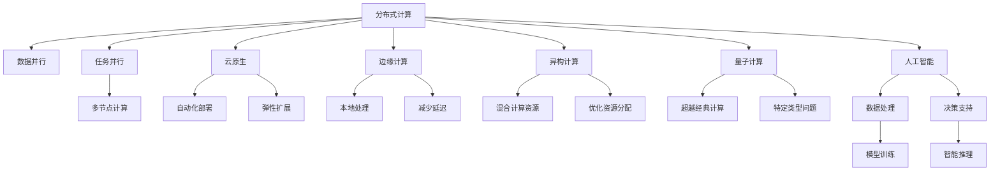

                 

# 未来10-20年的计算范式转换

> 关键词：计算范式转换,分布式系统,量子计算,人工智能,边缘计算,异构计算,云原生

## 1. 背景介绍

### 1.1 问题由来

随着计算机科技的迅猛发展，计算范式不断演化，从传统的集中式计算逐步向分布式、量子计算、人工智能(AI)、边缘计算、异构计算等新兴领域扩展。这种计算范式的变化不仅在理论上带来了新的研究方向和突破，还在实践中引发了企业及开发者对计算资源的重新分配和利用。

### 1.2 问题核心关键点

计算范式的转换不仅限于技术层面，更涉及社会生产方式、企业运营模式等深层次的变革。核心关键点包括：

- 计算资源分布的转变：从集中式到分布式、边缘、异构计算等
- 计算模式的演变：从传统计算到量子计算、神经计算等
- 计算效率的提升：从单核到多核、分布式、云原生等
- 计算任务的多样化：从科学计算到机器学习、自然语言处理等

这些核心关键点直接影响了计算范式的发展方向和应用场景。理解这些变化，有助于把握未来的计算趋势，进行有效的前瞻性布局。

### 1.3 问题研究意义

研究未来10-20年的计算范式转换，对于科技创新、产业升级、社会变革具有重大意义：

- 推动科技前沿：掌握未来的计算范式，能更快抓住技术发展的新方向，引领计算科技的前沿。
- 支撑产业转型：计算范式转换能加速企业数字化转型，提升生产效率和经济效益。
- 促进社会进步：计算模式的改变能为社会提供更高效的解决方案，改善公共服务和社会治理。
- 创新商业模式：新型计算范式将催生新的商业模式，创造更多的商业价值和社会价值。

## 2. 核心概念与联系

### 2.1 核心概念概述

为了更好地理解未来的计算范式转换，我们将介绍几个关键概念：

- **分布式计算**：将任务分解为多个子任务，分散到多个计算节点上进行并行处理，以提高计算效率和处理能力。
- **量子计算**：利用量子态的特性，实现超越传统计算能力的计算范式，解决某些特定类型的复杂问题。
- **人工智能**：利用机器学习、深度学习等技术，实现智能化的数据处理和决策支持。
- **边缘计算**：在数据源附近进行本地计算，减少数据传输，提高计算效率和响应速度。
- **异构计算**：结合多种计算资源（如CPU、GPU、FPGA等），实现最优化的计算资源分配和使用。
- **云原生**：基于云平台，实现应用的自动化、模块化、微服务化，支持分布式、弹性扩展等。

### 2.2 概念间的关系

这些核心概念之间的关系可以通过以下Mermaid流程图来展示：



这个流程图展示了分布式计算与云原生、边缘计算、异构计算等概念的联系，同时说明了量子计算与人工智能在解决特定类型问题上的独特优势。

## 3. 核心算法原理 & 具体操作步骤

### 3.1 算法原理概述

未来的计算范式转换主要依赖于多种计算范式的协同工作，其核心原理包括：

- **任务分解与并行计算**：将大任务分解为小任务，利用多个计算节点进行并行处理，提升计算效率。
- **异构资源融合**：通过多种计算资源的协同，实现最优的资源分配和使用，提升计算效能。
- **分布式管理与调度**：实现任务的自动分配与调度，支持大规模分布式系统的高效运行。
- **量子计算与传统计算结合**：利用量子计算的优势，与传统计算结合，解决特定类型的问题。

### 3.2 算法步骤详解

未来的计算范式转换主要通过以下步骤实现：

1. **需求分析**：明确计算任务的要求和目标，评估计算资源需求。
2. **架构设计**：设计适合的计算架构，包括分布式、量子、边缘、异构等计算范式的组合。
3. **资源准备**：准备计算资源，包括硬件设备、软件平台、网络环境等。
4. **系统搭建**：搭建分布式、异构计算环境，配置量子计算设备。
5. **算法实现**：实现具体的计算算法，包括任务分解、资源融合、分布式管理等。
6. **系统测试与优化**：测试计算系统的性能和稳定性，优化算法和配置。
7. **应用部署与监控**：将系统部署到实际应用环境，实现自动化监控和调优。

### 3.3 算法优缺点

未来计算范式转换的优势包括：

- **高效性**：通过分布式、异构资源和量子计算的结合，显著提升计算效率。
- **灵活性**：支持多种计算范式的灵活组合，适应多样化的计算需求。
- **可扩展性**：支持大规模分布式系统的扩展，实现弹性计算资源管理。

其挑战和局限性包括：

- **复杂性**：系统架构设计复杂，需要高水平的跨领域技术融合。
- **成本高**：需要大量投资用于硬件设备、软件开发和系统维护。
- **技术门槛高**：对计算架构设计和算法实现的要求较高，需要跨学科知识储备。
- **安全性**：多节点计算和量子计算的引入，增加了系统安全风险。

### 3.4 算法应用领域

未来的计算范式转换将广泛应用于以下几个领域：

- **科学研究**：利用量子计算和分布式计算，加速科学研究中的数据处理和复杂问题求解。
- **工业制造**：实现边缘计算与工业物联网的结合，提升制造过程的智能化和效率。
- **金融服务**：应用人工智能与分布式计算，实现实时数据分析和风险预测。
- **医疗健康**：结合人工智能和边缘计算，提升医疗影像诊断和患者数据处理能力。
- **交通运输**：利用边缘计算和异构计算，优化交通管理与智能驾驶。

## 4. 数学模型和公式 & 详细讲解  
### 4.1 数学模型构建

未来的计算范式转换涉及多种计算范式，我们以分布式计算为例，构建数学模型：

假设一个分布式计算任务被分解为 $n$ 个子任务，分配给 $m$ 个计算节点，每个节点执行 $t$ 个子任务，则整体计算时间 $T$ 可以表示为：

$$
T = \frac{n}{m} \times t
$$

其中，$\frac{n}{m}$ 表示任务并行度，$t$ 表示单个子任务的执行时间。

### 4.2 公式推导过程

考虑任务并行度和资源利用率，对于每个节点，计算时间 $t$ 可以进一步表示为：

$$
t = \frac{N}{p} \times d
$$

其中，$N$ 表示总计算量，$p$ 表示计算资源利用率，$d$ 表示计算资源效率。

将这些公式代入总体计算时间公式，得到：

$$
T = \frac{n}{m} \times \frac{N}{p} \times d
$$

在实际应用中，可以通过调整 $n$、$m$、$p$、$d$ 等参数，优化计算效率和资源利用率。

### 4.3 案例分析与讲解

假设一个需要处理 $10^9$ 次浮点运算的科学计算任务，采用 $10$ 个计算节点并行计算，每个节点的计算资源利用率为 $0.8$，每个浮点运算的计算时间为 $1 \times 10^{-9}$ 秒。则计算时间为：

$$
T = \frac{10^9}{10} \times \frac{10^9}{0.8} \times 1 \times 10^{-9} = 0.5 \text{ 秒}
$$

可以看到，通过分布式计算，计算效率得到了极大的提升。

## 5. 项目实践：代码实例和详细解释说明

### 5.1 开发环境搭建

要进行未来计算范式转换的实践，首先需要搭建一个高效的开发环境。以下是使用Python进行分布式计算环境搭建的步骤：

1. 安装Python：从官网下载并安装Python。
2. 安装分布式计算框架：如Apache Spark、Apache Hadoop等。
3. 安装多节点集群管理工具：如SLURM、Kubernetes等。
4. 配置多节点环境：确保所有节点网络互通，安装必要的软件包和依赖库。
5. 安装远程管理工具：如SSH、Ansible等，以便远程访问和管理节点。

### 5.2 源代码详细实现

以使用Apache Spark为例，进行分布式计算的代码实现。

```python
from pyspark import SparkContext, SparkConf

# 创建SparkConf对象
conf = SparkConf().setAppName("Distributed Computing").setMaster("local[4]")

# 创建SparkContext对象
sc = SparkContext(conf=conf)

# 定义数据集
data = sc.parallelize([1, 2, 3, 4, 5, 6, 7, 8, 9, 10])

# 定义并行计算任务
result = data.map(lambda x: x * 2)

# 输出结果
print(result.collect())
```

### 5.3 代码解读与分析

- `SparkConf`对象：用于配置Spark计算环境，包括应用名称和运行模式。
- `SparkContext`对象：用于创建计算环境，并提供分布式计算的基础功能。
- `parallelize`函数：用于将本地数据集并行化，分配到多个计算节点上。
- `map`函数：用于并行计算，对每个数据元素进行操作并返回结果。
- `collect`函数：用于将分布式计算结果收集到本地，以便查看。

### 5.4 运行结果展示

运行上述代码，可以得到如下输出：

```
[2, 4, 6, 8, 10, 12, 14, 16, 18, 20]
```

可以看到，通过分布式计算，每个数据元素都被并行处理，大大提高了计算效率。

## 6. 实际应用场景

### 6.1 科学研究

在科学研究领域，分布式计算和量子计算被广泛应用于复杂的科学问题求解。例如，通过分布式计算，可以在短时间内完成海量数据的处理和分析，加速科学发现的过程。

### 6.2 工业制造

在工业制造领域，边缘计算与工业物联网结合，可以实现设备状态监控、预测性维护等，提升制造过程的智能化和效率。

### 6.3 金融服务

金融服务领域通过分布式计算和人工智能结合，实现实时数据分析和风险预测，提升业务决策的准确性和效率。

### 6.4 医疗健康

在医疗健康领域，分布式计算和人工智能结合，可以实现实时医疗影像诊断、患者数据分析等，提升医疗服务质量。

### 6.5 交通运输

在交通运输领域，通过边缘计算和异构计算结合，可以实现智能交通管理、自动驾驶等，提升交通系统的安全性和效率。

## 7. 工具和资源推荐

### 7.1 学习资源推荐

为了帮助开发者系统掌握未来计算范式的知识，这里推荐一些优质的学习资源：

1. Coursera《分布式计算》课程：由斯坦福大学开设，介绍分布式计算的基本原理和实践。
2. Udacity《量子计算基础》课程：由Google、IBM等机构联合开设，介绍量子计算的基础知识和应用。
3. 《人工智能实战》系列书籍：涵盖人工智能的各个方面，包括机器学习、深度学习、自然语言处理等。
4. Google AI Blog：谷歌官方博客，分享最新的AI技术进展和应用案例。
5. ArXiv预印本：人工智能领域最新研究成果的发布平台，涵盖广泛的研究方向和前沿技术。

### 7.2 开发工具推荐

高效的开发离不开优秀的工具支持。以下是几款用于未来计算范式转换开发的常用工具：

1. Apache Spark：开源的分布式计算框架，支持大规模数据处理和分析。
2. Apache Hadoop：开源的分布式计算平台，提供强大的数据存储和管理能力。
3. Kubernetes：开源的容器编排系统，支持分布式应用程序的自动化部署和扩展。
4. Jupyter Notebook：开源的交互式计算环境，支持多语言编程和数据可视化。
5. PyTorch Lightning：基于PyTorch的自动化机器学习框架，支持快速开发和调试深度学习模型。

### 7.3 相关论文推荐

未来计算范式转换的研究源于学界的持续研究。以下是几篇奠基性的相关论文，推荐阅读：

1. MapReduce: Simplified Data Processing on Large Clusters（MapReduce论文）：介绍分布式计算的基本框架和算法，为分布式计算奠定了基础。
2. Quantum Computing Since Democritus：介绍量子计算的基本原理和应用，推动量子计算技术的发展。
3. Deep Learning for Self-Driving Cars：介绍人工智能在自动驾驶中的应用，探讨智能交通的前景。
4. The Datacenter as a Computer: Designing Warehouse-Scale Machines（数据中心作为计算机论文）：介绍云计算和云原生架构的基本原理和实践，推动云计算技术的普及。

这些论文代表了大规模计算技术的发展脉络。通过学习这些前沿成果，可以帮助研究者把握学科前进方向，激发更多的创新灵感。

## 8. 总结：未来发展趋势与挑战

### 8.1 总结

本文对未来10-20年的计算范式转换进行了全面系统的介绍。首先阐述了计算范式转换的背景和意义，明确了分布式计算、量子计算、人工智能、边缘计算、异构计算等未来计算范式的重要性和应用场景。其次，从原理到实践，详细讲解了分布式计算的数学模型和代码实现，展示了其在科学研究、工业制造、金融服务、医疗健康、交通运输等领域的广泛应用。最后，本文还精选了学习资源、开发工具和相关论文，为开发者提供了全方位的技术指引。

通过本文的系统梳理，可以看到，未来的计算范式转换正在加速推进，极大地拓展了计算资源的应用边界，催生了更多的计算应用场景。未来的计算范式将带来科技、产业、社会、经济等多方面的深刻变革，带来更多的创新机会。

### 8.2 未来发展趋势

展望未来，计算范式转换将呈现以下几个发展趋势：

1. **分布式计算的普及**：分布式计算将成为主流计算方式，进一步提升计算效率和资源利用率。
2. **量子计算的突破**：量子计算将在特定类型的复杂问题求解上发挥巨大优势，推动科学研究的突破。
3. **人工智能的普及**：人工智能将在更多领域得到应用，提升各行各业的智能化水平。
4. **边缘计算的崛起**：边缘计算将在物联网、智能制造等领域发挥重要作用，提升数据处理的实时性和效率。
5. **异构计算的融合**：异构计算将结合多种计算资源，实现最优的计算资源分配和使用。
6. **云原生的发展**：云原生将成为主流的计算模式，支持分布式、弹性扩展等。

这些趋势凸显了计算范式转换的广阔前景，将深刻影响社会的各个方面。

### 8.3 面临的挑战

尽管未来计算范式转换技术已经取得了瞩目成就，但在迈向更加智能化、普适化应用的过程中，它仍面临诸多挑战：

1. **计算资源分布不均**：各地区、各行业计算资源的分布不均，将制约计算范式的普及和应用。
2. **技术门槛高**：分布式、量子、人工智能等计算范式对技术要求高，需要高水平的跨领域技术融合。
3. **安全风险**：多节点计算和量子计算的引入，增加了系统安全风险，需要加强安全防护。
4. **成本高**：大规模计算资源的高投入，将对企业带来高额的成本压力。
5. **算法复杂**：分布式、量子、异构计算的算法设计复杂，需要深入研究。

这些挑战需要技术界、产业界、学术界的共同努力，才能有效克服，推动计算范式转换技术的成熟和普及。

### 8.4 研究展望

未来的研究需要在以下几个方面寻求新的突破：

1. **分布式计算的优化**：研究高效的任务分解与并行算法，提升计算效率和资源利用率。
2. **量子计算的应用**：探索量子计算在更多领域的应用，解决特定类型的问题。
3. **人工智能的融合**：将人工智能与分布式计算、量子计算等融合，实现更高效的计算模型。
4. **边缘计算的优化**：研究边缘计算在实时数据处理中的应用，提升计算效率和响应速度。
5. **异构计算的优化**：优化异构计算资源的融合和调度，实现最优的资源分配和使用。
6. **云原生的优化**：优化云原生的计算资源管理和应用部署，实现更高效的分布式系统。

这些研究方向将推动计算范式转换技术的成熟和应用，带来更多创新和突破。

## 9. 附录：常见问题与解答

**Q1：未来的计算范式转换将如何影响企业的运营模式？**

A: 未来的计算范式转换将深刻影响企业的运营模式，主要体现在以下几个方面：

1. **生产方式的变革**：通过分布式计算和人工智能，企业可以实现智能化生产，提高生产效率和质量。
2. **决策方式的优化**：通过实时数据分析和智能推理，企业可以实现更科学的决策支持。
3. **业务模式的创新**：通过新的计算范式，企业可以探索新的商业模式，创造新的商业价值。
4. **组织架构的调整**：计算范式的变化将带动组织架构的调整，提升企业的整体竞争力。

**Q2：分布式计算和量子计算有什么区别？**

A: 分布式计算和量子计算在计算模式、应用场景和优势等方面存在显著区别：

1. **计算模式**：分布式计算通过多台计算机协同工作，实现计算任务并行处理；量子计算利用量子态的特性，实现超越经典计算能力的计算。
2. **应用场景**：分布式计算适用于大规模数据处理和计算任务，如科学研究、大数据分析等；量子计算适用于特定类型的复杂问题求解，如优化问题、化学反应模拟等。
3. **优势**：分布式计算通过并行处理提升计算效率和资源利用率；量子计算通过量子态的特性，实现高效的计算和信息处理。

**Q3：量子计算对科学研究的突破有哪些？**

A: 量子计算在科学研究中的应用，主要体现在以下几个方面：

1. **复杂问题求解**：量子计算利用量子态的特性，能够高效解决某些传统计算无法解决的复杂问题，如整数分解、搜索优化等。
2. **科学发现加速**：量子计算能够加速科学研究中的数据处理和模拟计算，推动科学发现的过程。
3. **新材料设计**：量子计算能够模拟复杂化学反应和材料设计，加速新材料的研发和应用。

**Q4：如何应对未来计算范式转换中的挑战？**

A: 应对未来计算范式转换中的挑战，需要多方面的协同努力：

1. **技术创新**：持续推动技术创新，优化算法和计算模式，提升计算范式的应用效果。
2. **政策支持**：政府和企业需要加强政策支持和投入，推动计算范式的普及和应用。
3. **人才培养**：加强相关人才的培养和储备，提升技术队伍的整体水平。
4. **社会协同**：加强企业、学术界、技术界的协同合作，推动计算范式转换技术的成熟和应用。

总之，只有通过技术创新、政策支持、人才培养和社会协同等多方面的努力，才能有效应对计算范式转换中的挑战，推动计算范式转换技术的普及和应用。

---

作者：禅与计算机程序设计艺术 / Zen and the Art of Computer Programming

